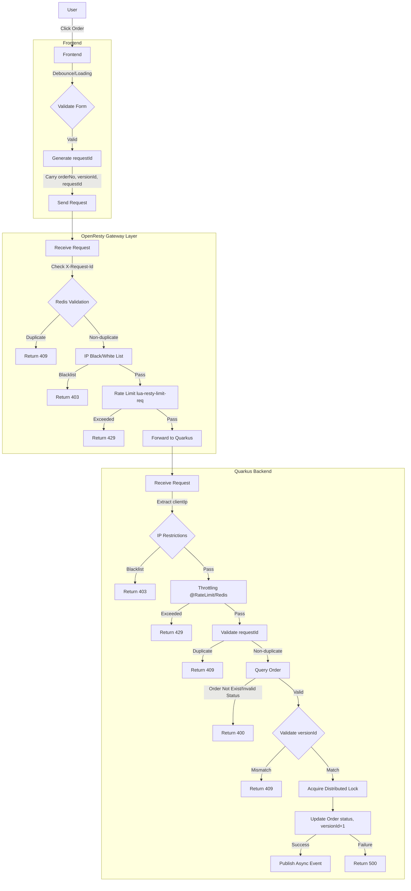

# Preventing Duplicate Orders in E-commerce and Payment Systems: Architecture and Implementation Guide

---

### I. Overall Approach
Duplicate orders are typically caused by:
1. Users rapidly clicking the submit button multiple times.
2. Network delays causing frontend to send duplicate requests.
3. Backend failing to effectively validate duplicate requests.
4. Concurrent processing in distributed systems leading to duplicates.

The core solution involves:
- **Frontend**: Reduce duplicate submissions through UI controls and request limitations.
- **Backend**: Ensure data consistency through uniqueness validation, idempotent design, and locking mechanisms.
- **Database/Cache**: Prevent duplicate records using unique constraints or state machines.

---

### II. Frontend Implementation
Frontend is primarily responsible for reducing unnecessary duplicate requests and improving user experience.

1. **Button Debounce/Throttle**
   - Add debounce or throttle logic to submit buttons to prevent multiple clicks within short timeframes.
   - Example (JavaScript):
     ```javascript
     let isSubmitting = false;
     document.getElementById('submitBtn').addEventListener('click', async () => {
       if (isSubmitting) return;
       isSubmitting = true;
       submitBtn.disabled = true; // Disable button
       try {
         await submitOrder();
       } finally {
         isSubmitting = false;
         submitBtn.disabled = false; // Re-enable button
       }
     });
     ```

2. **Loading State Indication**
   - Show loading state (e.g., overlay or progress bar) during submission to block user from repeated operations.
   - Example (Vue/React):
     ```vue
     <button :disabled="isLoading" @click="submitOrder">
       {{ isLoading ? 'Submitting...' : 'Submit Order' }}
     </button>
     ```

3. **Request Deduplication**
   - Add unique identifiers (e.g., order number or timestamp) to order requests, maintain a request queue on frontend, and discard duplicate requests directly.
   - Example:
     ```javascript
     const pendingRequests = new Set();
     async function submitOrder(orderId) {
       if (pendingRequests.has(orderId)) return;
       pendingRequests.add(orderId);
       try {
         await api.submitOrder(orderId);
       } finally {
         pendingRequests.delete(orderId);
       }
     }
     ```

4. **Form Validation**
   - Validate form data completeness before submission to avoid invalid requests that might lead to duplicate submissions.

---

### III. Backend Implementation
Backend is the core defense against duplicate orders, ensuring idempotency and data consistency.

1. **Idempotent Design**
   - Generate unique identifiers (e.g., `orderId` or `requestId`) for each order, backend validates whether the identifier has been processed.
   - Implementation approach:
     - Client generates `requestId` (e.g., UUID) and sends with request.
     - Backend stores `requestId` in Redis (e.g., `SETNX`) with expiration time (e.g., 30 seconds).
     - If `requestId` already exists, directly return "Order already submitted" or previous result.
     - Example (pseudo-code):
       ```java
       String requestId = request.getHeader("X-Request-Id");
       if (redis.setnx("order:request:" + requestId, "1", 30)) {
           // Process order logic
           processOrder(order);
       } else {
           return Response.error("Order already submitted, please don't repeat operation");
       }
       ```

2. **Database Unique Constraints**
   - Add unique indexes for order number (`orderNo`) or user ID + product ID combination in order table to prevent duplicate inserts.
   - Example (MySQL):
     ```sql
     CREATE TABLE orders (
         id BIGINT AUTO_INCREMENT PRIMARY KEY,
         order_no VARCHAR(50) UNIQUE,
         user_id BIGINT,
         product_id BIGINT,
         UNIQUE INDEX idx_user_product (user_id, product_id)
     );
     ```
   - When insertion violates unique constraint, catch exception and return prompt.

3. **Optimistic/Pessimistic Locking**
   - **Optimistic Locking**: Based on version number or status field to prevent concurrent updates.
     - Example: Add `version` field to order table, validate `version` consistency during submission.
       ```sql
       UPDATE orders SET status = 'SUBMITTED', version = version + 1
       WHERE order_no = ? AND status = 'PENDING' AND version = ?;
       ```
   - **Pessimistic Locking**: Lock critical resources (e.g., `SELECT FOR UPDATE`), suitable for low concurrency scenarios.
     - Example:
       ```sql
       SELECT * FROM orders WHERE order_no = ? FOR UPDATE;
       ```

4. **State Machine Control**
   - Order status flow (e.g., `PENDING -> SUBMITTED -> PAID`), only allows submission in specific states.
   - Example: Backend validates whether order is in `PENDING` status, if already `SUBMITTED`, reject duplicate submission.

5. **Distributed Locking**
   - In distributed systems, use Redis or ZooKeeper to implement distributed locks, locking user ID or order number.
   - Example (Redis):
     ```java
     String lockKey = "lock:order:" + userId;
     if (redis.setnx(lockKey, "1", 10)) {
         try {
             // Process order
             processOrder(order);
         } finally {
             redis.del(lockKey); // Release lock
         }
     } else {
         return Response.error("System busy, please try again later");
     }
     ```

6. **API Rate Limiting**
   - Set frequency limits for order placement interfaces (e.g., 1 request/second/user), preventing malicious or abnormal repeated requests.
   - Tools: Spring Cloud Gateway, Nginx, or Redis (`INCR` counting).

---

### IV. Database/Cache Assistance
1. **Redis Cache**
   - Cache order status or `requestId` for quick duplicate request validation.
   - Example: `SET order:status:{orderId} "SUBMITTED" EX 3600`.

2. **Message Queue**
   - Asynchronize order placement requests, process through message queues (e.g., Kafka, RabbitMQ), validate duplicates during queue consumption.
   - Benefits: Peak shaving, decoupling, suitable for high concurrency scenarios.

---

### V. Comprehensive Architecture Design
Following is a typical high-concurrency anti-duplicate order architecture:
1. **Frontend**: Debounce + Loading state + Request deduplication.
2. **Gateway Layer**: Rate limiting + Request logging.
3. **Backend**:
   - Receive request, validate `requestId` (Redis).
   - Acquire distributed lock (Redis/ZooKeeper).
   - Query order status (database/cache).
   - Insert order, rely on database unique constraints.
   - Update status, release lock.
4. **Asynchronous Processing**: Put inventory deduction, notifications, etc. into message queue.
5. **Monitoring**: Log duplicate request logs, analyze abnormal situations.

---

### VI. Considerations
1. **Performance**: Prioritize Redis validation of `requestId` to reduce database pressure.
2. **User Experience**: Frontend promptly feedback "Order already submitted" to prevent user repeat operations.
3. **Timeout Handling**: Set reasonable lock timeout and request expiration time to prevent deadlocks.
4. **Distributed Consistency**: In high concurrency scenarios, prioritize idempotency over strong consistency.
5. **Exception Scenarios**: Handle network jitter, transaction rollback, etc., ensure status consistency.

---

### VII. Summary
- **Frontend**: Debounce, Loading, request deduplication, reduce invalid requests.
- **Backend**: Idempotency (`requestId`), unique constraints, locking mechanisms, state machine, ensure data consistency.
- **Assistance**: Redis cache, message queues improve performance and scalability.

Choose appropriate combinations based on business scenarios:
- Small systems: Frontend debounce + Database unique constraints.
- High concurrency systems: Frontend deduplication + Backend idempotency + Distributed locks + Message queues.

If you need code examples for specific technology stacks (e.g., Spring Boot, Node.js) or scenarios (e.g., flash sales), please provide further details!

---

Following is a detailed solution using `versionId` (version number) to prevent duplicate orders, based on optimistic locking mechanism, combining frontend and backend implementation and database design, ensuring prevention of duplicate orders in high concurrency scenarios while maintaining performance and consistency. The solution includes architecture design, code examples, and considerations, suitable for typical e-commerce or payment systems.

---

### I. Solution Overview
Using `versionId` optimistic locking mechanism, by maintaining a version number field for order records, validate version number consistency during order submission, only allow updates when matched, preventing duplicate submissions. Main features:
- **Applicable Scenarios**: High concurrency, low conflict scenarios (e.g., e-commerce orders).
- **Core Idea**: Each time order status changes, `versionId` increments, duplicate requests are rejected due to version mismatch.
- **Advantages**: No pessimistic locking needed, higher performance, suitable for distributed systems.
- **Implementation Levels**: Frontend request control + Backend version validation + Database unique constraints.

---

### II. Architecture Design
1. **Database Design**
   - Order table contains `versionId` field for optimistic locking.
   - Table structure example (MySQL):
     ```sql
     CREATE TABLE orders (
         id BIGINT AUTO_INCREMENT PRIMARY KEY,
         order_no VARCHAR(50) UNIQUE, -- Order number, unique
         user_id BIGINT, -- User ID
         product_id BIGINT, -- Product ID
         status ENUM('PENDING', 'SUBMITTED', 'PAID', 'CANCELLED') DEFAULT 'PENDING', -- Order status
         version_id INT DEFAULT 0, -- Version number, initial 0
         created_at TIMESTAMP DEFAULT CURRENT_TIMESTAMP,
         updated_at TIMESTAMP DEFAULT CURRENT_TIMESTAMP ON UPDATE CURRENT_TIMESTAMP
     );
     ```

2. **Frontend**
   - Prevent duplicate clicks, show Loading state.
   - Carry `orderNo` and `versionId` (obtained from backend query) when submitting order.

3. **Backend**
   - Query order status and `versionId`.
   - Validate `versionId` during submission, update order status and increment `versionId`.
   - Use Redis cache for order status to reduce database pressure.
   - Optional: Combine with `requestId` to ensure idempotency.

4. **Process Flow**
   - User initiates order → Frontend debounce → Backend validates `versionId` and status → Update order (`versionId+1`) → Return result.
   - Duplicate requests are rejected due to `versionId` mismatch.

---

### III. Frontend Implementation
Frontend is responsible for reducing duplicate requests and passing `versionId`.

1. **Debounce and Loading State**
   - Prevent rapid clicks, disable button during submission.
   - Example (Vue):
     ```vue
     <template>
       <button :disabled="isLoading" @click="submitOrder">
         {{ isLoading ? 'Submitting...' : 'Submit Order' }}
       </button>
     </template>
     <script>
     export default {
       data() {
         return {
           isLoading: false,
           order: { orderNo: '', versionId: 0 }
         };
       },
       methods: {
         async submitOrder() {
           if (this.isLoading) return;
           this.isLoading = true;
           try {
             const response = await this.$api.submitOrder({
               orderNo: this.order.orderNo,
               versionId: this.order.versionId
             });
             this.$message.success('Order submitted successfully');
             this.order.versionId = response.versionId; // Update version number
           } catch (error) {
             this.$message.error(error.message || 'Submission failed');
           } finally {
             this.isLoading = false;
           }
         },
         async fetchOrder() {
           const response = await this.$api.getOrder(this.orderNo);
           this.order = response.data; // Get order and versionId
         }
       },
       mounted() {
         this.fetchOrder(); // Get order info when page loads
       }
     };
     </script>
     ```

2. **Request Deduplication**
   - Use `orderNo` as identifier to prevent sending duplicate order requests.

---

### IV. Backend Implementation
Backend implements `versionId` validation based on Spring Boot (or other frameworks), combined with Redis and database.

1. **Dependencies**
   - Database: MySQL (or PostgreSQL).
   - Cache: Redis (for status cache and idempotency).
   - Framework: Spring Boot + MyBatis (or other ORM).

2. **Order Entity**
   ```java
   public class Order {
       private Long id;
       private String orderNo;
       private Long userId;
       private Long productId;
       private String status;
       private Integer versionId;
       private Date createdAt;
       private Date updatedAt;
       // Getters and Setters
   }
   ```

3. **Service Layer Logic**
   - Query order, validate status and `versionId`.
   - Update order status, increment `versionId`.
   - Example (Spring Boot):
     ```java
     @Service
     public class OrderService {
         @Autowired
         private OrderMapper orderMapper;
         @Autowired
         private RedisTemplate<String, String> redisTemplate;
     
         @Transactional(rollbackOn = Exception.class)
         public Order submitOrder(String orderNo, Integer versionId, String requestId) {
             // Idempotency validation (requestId)
             String redisKey = "order:request:" + requestId;
             Boolean acquired = redisTemplate.opsForValue()
                 .setIfAbsent(redisKey, "1", 30, TimeUnit.SECONDS);
             if (!acquired) {
                 throw new RuntimeException("Order already submitted, please don't repeat operation");
             }
     
             // Query order
             Order order = orderMapper.selectByOrderNo(orderNo);
             if (order == null) {
                 throw new RuntimeException("Order does not exist");
             }
             if (!"PENDING".equals(order.getStatus())) {
                 throw new RuntimeException("Order status does not support submission");
             }
             if (!versionId.equals(order.getVersionId())) {
                 throw new RuntimeException("Order version conflict, please refresh and retry");
             }
     
             // Update order status and version number
             Order updateOrder = new Order();
             updateOrder.setOrderNo(orderNo);
             updateOrder.setStatus("SUBMITTED");
             updateOrder.setVersionId(versionId + 1);
             int rows = orderMapper.updateByOrderNoAndVersion(updateOrder);
             if (rows == 0) {
                 throw new RuntimeException("Order update failed, may have been modified by other requests");
             }
     
             // Update Redis cache
             redisTemplate.opsForValue().set(
                 "order:status:" + orderNo, "SUBMITTED", 1, TimeUnit.HOURS
             );
     
             return orderMapper.selectByOrderNo(orderNo);
         }
     }
     ```

4. **Mapper Interface**
   ```java
   @Mapper
   public interface OrderMapper {
       Order selectByOrderNo(String orderNo);
   
       @Update("UPDATE orders SET status = #{status}, version_id = #{versionId}, " +
               "updated_at = CURRENT_TIMESTAMP " +
               "WHERE order_no = #{orderNo} AND version_id = #{versionId} - 1")
       int updateByOrderNoAndVersion(Order order);
   }
   ```

5. **Controller**
   ```java
   @RestController
   @RequestMapping("/orders")
   public class OrderController {
       @Autowired
       private OrderService orderService;
   
       @PostMapping("/submit")
       public ResponseEntity<?> submitOrder(@RequestBody SubmitOrderRequest request) {
           try {
               Order order = orderService.submitOrder(
                   request.getOrderNo(),
                   request.getVersionId(),
                   request.getRequestId()
               );
               return ResponseEntity.ok(order);
           } catch (Exception e) {
               return ResponseEntity.badRequest().body(e.getMessage());
           }
       }
   }
   
   @Data
   public class SubmitOrderRequest {
       private String orderNo;
       private Integer versionId;
       private String requestId; // Client-generated unique ID
   }
   ```

---

### V. Database Operations
1. **Query Order**
   ```sql
   SELECT * FROM orders WHERE order_no = ?;
   ```

2. **Update Order (Optimistic Lock)**
   ```sql
   UPDATE orders
   SET status = 'SUBMITTED', version_id = version_id + 1, updated_at = CURRENT_TIMESTAMP
   WHERE order_no = ? AND version_id = ?;
   ```
   - If update row count is 0, indicates `versionId` mismatch, throw exception.

3. **Unique Constraints**
   - Order number (`order_no`) unique index prevents duplicate insertion.
   - Optional: User ID + Product ID combination unique index.

---

### VI. Auxiliary Mechanisms
1. **Redis Cache**
   - Cache order status: `order:status:{orderNo}`, reduce database queries.
   - Idempotency validation: `order:request:{requestId}`, prevent duplicate requests.

2. **Message Queue**
   - After successful order placement, make inventory deduction, notifications, etc. asynchronous (e.g., through Kafka).
   - Example:
     ```java
     @Autowired
     private KafkaTemplate<String, String> kafkaTemplate;
     
     public void publishOrderEvent(Order order) {
         kafkaTemplate.send("order-topic", order.getOrderNo(), JSON.toJSONString(order));
     }
     ```

3. **Distributed Locking (Optional)**
   - If conflict rate is high, can add Redis distributed lock for `orderNo`.
   - Example:
     ```java
     String lockKey = "lock:order:" + orderNo;
     if (redisTemplate.opsForValue().setIfAbsent(lockKey, "1", 10, TimeUnit.SECONDS)) {
         try {
             // Process order
         } finally {
             redisTemplate.delete(lockKey);
         }
     }
     ```

---

### VII. Considerations
1. **Performance Optimization**
   - Redis cache order status to reduce database pressure.
   - Use `IN` clauses for batch order queries, avoid individual queries.

2. **Conflict Handling**
   - When version conflict occurs, return "Please refresh and retry", frontend re-acquires latest `versionId`.
   - Set reasonable retry mechanism (e.g., frontend retries maximum 3 times).

3. **Idempotency**
   - Combine with `requestId` to prevent duplicate requests caused by network jitter.
   - Redis `SETNX` operation ensures `requestId` uniqueness.

4. **Exception Scenarios**
   - Network timeout: Frontend shows "Submission failed, please retry", backend ensures transaction rollback.
   - Concurrent conflict: Throw clear error message when optimistic lock fails.

5. **Monitoring and Logging**
   - Log duplicate submission logs (e.g., `requestId` conflicts).
   - Monitor optimistic lock failure rate, optimize conflict scenarios.

---

### VIII. Complete Code Example
Following is the complete backend core logic code, based on Spring Boot.

```java
package com.example.order.service;

import com.example.order.entity.Order;
import com.example.order.mapper.OrderMapper;
import org.springframework.beans.factory.annotation.Autowired;
import org.springframework.data.redis.core.RedisTemplate;
import org.springframework.stereotype.Service;
import org.springframework.transaction.annotation.Transactional;

import java.util.concurrent.TimeUnit;

@Service
public class OrderService {

    @Autowired
    private OrderMapper orderMapper;
    @Autowired
    private RedisTemplate<String, String> redisTemplate;

    @Transactional(rollbackOn = Exception.class)
    public Order submitOrder(String orderNo, Integer versionId, String requestId) {
        // Idempotency validation
        String redisKey = "order:request:" + requestId;
        Boolean acquired = redisTemplate.opsForValue()
            .setIfAbsent(redisKey, "1", 30, TimeUnit.SECONDS);
        if (!acquired) {
            throw new RuntimeException("Order already submitted, please don't repeat operation");
        }

        // Query order
        Order order = orderMapper.selectByOrderNo(orderNo);
        if (order == null) {
            throw new RuntimeException("Order does not exist");
        }
        if (!"PENDING".equals(order.getStatus())) {
            throw new RuntimeException("Order status does not support submission");
        }
        if (!versionId.equals(order.getVersionId())) {
            throw new RuntimeException("Order version conflict, please refresh and retry");
        }

        // Update order
        Order updateOrder = new Order();
        updateOrder.setOrderNo(orderNo);
        updateOrder.setStatus("SUBMITTED");
        updateOrder.setVersionId(versionId + 1);
        int rows = orderMapper.updateByOrderNoAndVersion(updateOrder);
        if (rows == 0) {
            throw new RuntimeException("Order update failed, may have been modified by other requests");
        }

        // Update cache
        redisTemplate.opsForValue().set(
            "order:status:" + orderNo, "SUBMITTED", 1, TimeUnit.HOURS
        );

        return orderMapper.selectByOrderNo(orderNo);
    }
}
```

```java
package com.example.order.mapper;

import com.example.order.entity.Order;
import org.apache.ibatis.annotations.Mapper;
import org.apache.ibatis.annotations.Update;

@Mapper
public interface OrderMapper {
    Order selectByOrderNo(String orderNo);

    @Update("UPDATE orders SET status = #{status}, version_id = #{versionId}, " +
            "updated_at = CURRENT_TIMESTAMP " +
            "WHERE order_no = #{orderNo} AND version_id = #{versionId} - 1")
    int updateByOrderNoAndVersion(Order order);
}
```

---

### IX. Summary
- **Frontend**: Debounce, carry `versionId`, show friendly prompts.
- **Backend**: Optimistic locking based on `versionId`, combined with `requestId` and Redis to ensure idempotency.
- **Database**: `versionId` field + unique constraints, prevent duplicate insertion.
- **Scalability**: Redis cache and message queues improve performance, distributed locks handle high-conflict scenarios.

This solution is suitable for medium-to-high concurrency scenarios (e.g., e-commerce orders). If further optimization is needed (e.g., flash sale scenarios) or implementation for specific technology stacks (e.g., Node.js), please provide more details!

---

Following is the throttling solution combining **Quarkus** throttling mechanism, IP address restrictions, and supplementary solutions at the **OpenResty** level, focusing on preventing duplicate orders. The content avoids repeating the previously mentioned `versionId` optimistic locking solution, focusing on new throttling and IP restriction mechanisms, combined with Quarkus and OpenResty features, providing supplementary implementation for high concurrency scenarios. The solution includes detailed code examples, architecture design, and considerations, suitable for e-commerce or payment systems.

---

### I. Overall Approach
- **Goal**: Limit request frequency through Quarkus throttling mechanism, combined with IP address restrictions to prevent malicious duplicate orders, supplement with front-end protection at OpenResty level to enhance system robustness.
- **Quarkus Level**: Utilize `SmallRye Fault Tolerance`'s `@RateLimit` or custom throttling logic, combined with IP validation, limit user or IP order frequency.
- **OpenResty Level**: Implement front-end rate limiting and IP black/white lists through Nginx Lua modules, reduce backend pressure.
- **Integration Point**: OpenResty handles coarse-grained rate limiting and IP filtering as gateway layer, Quarkus provides fine-grained business logic validation (e.g., order frequency limits).

---

### II. Quarkus Throttling Solution
Quarkus can implement frequency limiting through `SmallRye Fault Tolerance`'s `@RateLimit` annotation or custom Redis throttler, combined with IP address validation to prevent duplicate orders.

#### 1. Using SmallRye Fault Tolerance's @RateLimit
- **Scenario**: Limit user or IP order frequency (e.g., 10 times per minute).
- **Dependency**: Add `quarkus-smallrye-fault-tolerance` dependency.
  ```xml
  <dependency>
      <groupId>io.quarkus</groupId>
      <artifactId>quarkus-smallrye-fault-tolerance</artifactId>
  </dependency>
  ```

- **Implementation**: Add `@RateLimit` annotation to order interface, combined with IP extraction logic.
  ```java
  import io.smallrye.faulttolerance.api.RateLimit;
  import jakarta.ws.rs.POST;
  import jakarta.ws.rs.Path;
  import jakarta.ws.rs.core.Context;
  import jakarta.ws.rs.core.HttpHeaders;
  import jakarta.ws.rs.core.Response;
  import org.jboss.resteasy.reactive.RestHeader;
  
  @Path("/orders")
  public class OrderResource {
      @POST
      @Path("/submit")
      @RateLimit(limit = 10, window = 60, windowUnit = java.time.temporal.ChronoUnit.SECONDS) // 10 times per minute
      public Response submitOrder(
              @Context HttpHeaders headers,
              @RestHeader("X-Request-Id") String requestId,
              OrderRequest orderRequest) {
          // Extract client IP
          String clientIp = getClientIp(headers);
          // Validate if IP is in blacklist (Redis or database)
          if (isIpBlacklisted(clientIp)) {
              return Response.status(403).entity("IP restricted").build();
          }
  
          // Business logic: validate requestId and place order
          processOrder(orderRequest, requestId, clientIp);
          return Response.ok("Order submitted").build();
      }
  
      private String getClientIp(HttpHeaders headers) {
          String forwardedFor = headers.getHeaderString("X-Forwarded-For");
          if (forwardedFor != null && !forwardedFor.isEmpty()) {
              return forwardedFor.split(",")[0].trim();
          }
          return headers.getHeaderString("X-Real-IP") != null
                  ? headers.getHeaderString("X-Real-IP")
                  : "unknown";
      }
  
      private boolean isIpBlacklisted(String ip) {
          // Example: Query Redis blacklist
          return redisTemplate.opsForSet().isMember("blacklist:ips", ip);
      }
  
      private void processOrder(OrderRequest order, String requestId, String clientIp) {
          // Implement order processing logic, combined with previously mentioned idempotency validation
      }
  }
  ```
- **Explanation**:
  - `@RateLimit` limits 10 requests per 60 seconds, throws `RateLimitException` when exceeded.
  - Extracts `X-Forwarded-For` or `X-Real-IP` to get client IP (requires OpenResty or other proxy to set correctly).
  - Uses Redis to store IP blacklist, dynamically restricts malicious IPs.

- **Configuration**: Adjust global rate limiting strategy in `application.properties`.
  ```properties
  quarkus.fault-tolerance.rate-limit.default.limit=10
  quarkus.fault-tolerance.rate-limit.default.window=60s
  ```

#### 2. Custom Redis Throttler
- **Scenario**: More flexible throttling logic, such as dynamic rate limiting based on user ID or IP.
- **Implementation**: Use Redis counters and sliding windows.
  ```java
  import io.quarkus.redis.datasource.RedisDataSource;
  import jakarta.enterprise.context.ApplicationScoped;
  import jakarta.inject.Inject;
  
  @ApplicationScoped
  public class RateLimiterService {
      @Inject
      RedisDataSource redisDataSource;
  
      public boolean allowRequest(String key, int limit, int windowSeconds) {
          String redisKey = "ratelimit:" + key;
          long currentTime = System.currentTimeMillis() / 1000;
          // Clean expired timestamps
          redisDataSource.sortedSet().zremrangebyscore(redisKey, 0, currentTime - windowSeconds);
          // Get request count in current window
          long requestCount = redisDataSource.sortedSet().zcard(redisKey);
          if (requestCount >= limit) {
              return false;
          }
          // Record current request
          redisDataSource.sortedSet().zadd(redisKey, currentTime, String.valueOf(currentTime));
          redisDataSource.key().expire(redisKey, windowSeconds);
          return true;
      }
  }
  ```
- **Usage**: Call in order interface.
  ```java
  @Path("/orders")
  public class OrderResource {
      @Inject
      RateLimiterService rateLimiterService;
  
      @POST
      @Path("/submit")
      public Response submitOrder(
              @Context HttpHeaders headers,
              @RestHeader("X-Request-Id") String requestId,
              OrderRequest orderRequest) {
          String clientIp = getClientIp(headers);
          String userId = orderRequest.getUserId();
          // Rate limiting based on IP and user ID
          if (!rateLimiterService.allowRequest("ip:" + clientIp, 10, 60) ||
              !rateLimiterService.allowRequest("user:" + userId, 5, 60)) {
              return Response.status(429).entity("Too many requests").build();
          }
          // Order processing logic
          processOrder(orderRequest, requestId, clientIp);
          return Response.ok("Order submitted").build();
      }
  }
  ```
- **Explanation**:
  - Uses Redis sorted set (ZSET) to implement sliding window, records request timestamps.
  - Limits IP (10 times per minute) and user (5 times per minute), prevents malicious duplicate orders.
  - Redis keys auto-expire, reduce memory usage.

#### 3. IP Address Restrictions
- **Implementation**: Combine with Redis for dynamic IP black/white list management.
  ```java
  @ApplicationScoped
  public class IpRestrictionService {
      @Inject
      RedisDataSource redisDataSource;
  
      public void addToBlacklist(String ip, long ttlSeconds) {
          redisDataSource.set().sadd("blacklist:ips", ip);
          redisDataSource.key().expire("blacklist:ips", ttlSeconds);
      }
  
      public void addToWhitelist(String ip) {
          redisDataSource.set().sadd("whitelist:ips", ip);
      }
  
      public boolean isAllowed(String ip) {
          if (redisDataSource.set().sismember("whitelist:ips", ip)) {
              return true;
          }
          return !redisDataSource.set().sismember("blacklist:ips", ip);
      }
  }
  ```
- **Usage**: Validate IP in order interface.
  ```java
  @Inject
  IpRestrictionService ipRestrictionService;
  
  @POST
  @Path("/submit")
  public Response submitOrder(@Context HttpHeaders headers, OrderRequest orderRequest) {
      String clientIp = getClientIp(headers);
      if (!ipRestrictionService.isAllowed(clientIp)) {
          return Response.status(403).entity("IP restricted").build();
      }
      // Order processing logic
      return Response.ok("Order submitted").build();
  }
  ```
- **Explanation**:
  - Whitelist takes priority, allows specific IPs unlimited access.
  - Blacklist updates dynamically (e.g., add after detecting abnormal behavior, TTL controls ban time).
  - Can be adjusted dynamically through management interface.

---

### III. OpenResty Supplementary Solution
OpenResty (based on Nginx and Lua) serves as gateway layer, providing front-end rate limiting and IP restrictions, reducing Quarkus backend pressure, suitable for high concurrency scenarios.

#### 1. Lua-based Request Rate Limiting
- **Scenario**: Global rate limiting for order interface (e.g., 100 times per second).
- **Implementation**: Use `lua-resty-limit-req` module.
  - **Installation**: Ensure OpenResty is compiled with `lua-resty-limit-req`.
  - **Configuration** (`nginx.conf`):
    ```nginx
    http {
        lua_shared_dict limit_req_store 10m;
    
        server {
            listen 80;
            location /orders/submit {
                access_by_lua_block {
                    local limit_req = require "resty.limit.req"
                    -- 100 times per second, burst 10 times
                    local lim, err = limit_req.new("limit_req_store", 100, 10)
                    if not lim then
                        ngx.log(ngx.ERR, "failed to instantiate limit_req: ", err)
                        return ngx.exit(500)
                    end
                    local key = ngx.var.remote_addr -- Rate limiting based on IP
                    local delay, err = lim:incoming(key, true)
                    if not delay then
                        if err == "rejected" then
                            return ngx.exit(429) -- Too Many Requests
                        end
                        ngx.log(ngx.ERR, "failed to limit req: ", err)
                        return ngx.exit(500)
                    end
                    if delay >= 0.001 then
                        ngx.sleep(delay) -- Delay processing
                    end
                }
                proxy_pass http://quarkus_backend;
            }
        }
    }
    ```
- **Explanation**:
  - Uses shared memory (`lua_shared_dict`) to store rate limiting counters.
  - Rate limiting based on client IP (`remote_addr`), prevents single IP malicious requests.
  - Returns 429 status code when rate limit exceeded, frontend can prompt "Too many requests".

#### 2. IP Black/White List
- **Scenario**: Block malicious IPs, prioritize trusted IPs.
- **Implementation**: Use Lua scripts and Redis to store lists.
  - **Configuration** (`nginx.conf`):
    ```nginx
    http {
        lua_shared_dict ip_cache 1m;
        init_by_lua_block {
            local redis = require "resty.redis"
            local red = redis:new()
            red:set_timeout(1000) -- 1 second timeout
            local ok, err = red:connect("redis_host", 6379)
            if not ok then
                ngx.log(ngx.ERR, "failed to connect to redis: ", err)
                return
            end
            _G.redis = red -- Global Redis instance
        }
    
        server {
            listen 80;
            location /orders/submit {
                access_by_lua_block {
                    local ip = ngx.var.remote_addr
                    local redis = _G.redis
                    -- Check whitelist
                    local is_whitelisted, err = redis:sismember("whitelist:ips", ip)
                    if is_whitelisted == 1 then
                        return -- Allow
                    end
                    -- Check blacklist
                    local is_blacklisted, err = redis:sismember("blacklist:ips", ip)
                    if is_blacklisted == 1 then
                        ngx.exit(403) -- Deny access
                    end
                }
                proxy_pass http://quarkus_backend;
            }
        }
    }
    ```
- **Explanation**:
  - Uses Redis to store black/white lists, shares data with Quarkus.
  - Whitelist IPs pass directly, blacklist IPs return 403.
  - Lua scripts execute in `access_by_lua` phase, high performance.

#### 3. Request Deduplication
- **Scenario**: Intercept duplicate `X-Request-Id` requests.
- **Implementation**: Use Lua and Redis to validate request ID.
  ```nginx
  location /orders/submit {
      access_by_lua_block {
          local redis = _G.redis
          local request_id = ngx.req.get_headers()["X-Request-Id"]
          if not request_id then
              ngx.exit(400) -- Missing requestId
          end
          local key = "request:" .. request_id
          local ok, err = redis:setnx(key, 1)
          if not ok then
              ngx.log(ngx.ERR, "redis setnx failed: ", err)
              return ngx.exit(500)
          end
          if ok == 0 then
              ngx.exit(409) -- Request already exists
          end
          redis:expire(key, 30) -- 30 second expiration
      }
      proxy_pass http://quarkus_backend;
  }
  ```
- **Explanation**:
  - Checks if `X-Request-Id` exists in Redis, prevents duplicate requests.
  - Sets 30 second expiration to avoid Redis memory bloat.
  - Intercepts at OpenResty layer, reduces invalid requests to Quarkus.

---

### IV. Comprehensive Architecture Design
Following is the anti-duplicate order architecture combining Quarkus and OpenResty:
1. **OpenResty Gateway Layer**:
   - **Rate Limiting**: Global IP-based rate limiting (`lua-resty-limit-req`).
   - **IP Restrictions**: Redis black/white list filtering for malicious IPs.
   - **Request Deduplication**: Validate `X-Request-Id`, intercept duplicate requests.
2. **Quarkus Application Layer**:
   - **Throttling**: `@RateLimit` or Redis sliding window, limit user/IP frequency.
   - **IP Validation**: Dynamic black/white lists, reject abnormal requests.
   - **Business Logic**: Combine with previous `versionId` optimistic locking and `requestId` idempotency validation.
3. **Redis**: Shared rate limiting counters, black/white lists, and request ID status.
4. **Monitoring**: Log rate limit triggers, IP blocks, and duplicate requests, analyze abnormal behavior.

---

### V. Considerations
1. **Performance**:
   - OpenResty Lua scripts are efficient, but monitor Redis connection pool to avoid bottlenecks.
   - Quarkus `@RateLimit` suitable for simple scenarios, recommend Redis custom throttler for high concurrency.

2. **Consistency**:
   - Ensure OpenResty and Quarkus use same Redis instance, maintain consistency for black/white lists and `requestId`.
   - Configure reasonable Redis key expiration to prevent memory leaks.

3. **User Experience**:
   - Return clear HTTP status codes (e.g., 429, 403) and prompt messages when rate limited or IP restricted.
   - Frontend shows "Too many requests" or "IP restricted", guides user to retry.

4. **Security**:
   - Prevent `X-Forwarded-For` forgery, configure `set_real_ip_from` trusted proxy IPs in OpenResty.
   - Regularly update black/white lists, combine with behavior analysis (e.g., high-frequency ordering) for dynamic blocking.

5. **Scalability**:
   - For high concurrency scenarios, consider OpenResty multi-node deployment, use Redis distributed counters.
   - Quarkus can combine with Kafka for asynchronous order processing, peak shaving.

---

### VI. Summary
- **Quarkus**:
  - Use `@RateLimit` for quick rate limiting implementation, suitable for simple scenarios.
  - Custom Redis throttler supports flexible IP/user rate limiting.
  - Dynamic IP black/white list management enhances protection.
- **OpenResty**:
  - Front-end rate limiting (`lua-resty-limit-req`) reduces backend pressure.
  - Lua + Redis implements IP black/white lists and request deduplication.
- **Combined Advantages**:
  - OpenResty provides high-performance gateway protection, Quarkus focuses on business logic.
  - Redis as shared storage ensures consistency for rate limiting and IP restrictions.

If you need more details for specific scenarios (e.g., flash sales) or more detailed OpenResty Lua script optimization, please provide more details!

---

Following is the comprehensive architecture design based on the previously discussed anti-duplicate order solutions (including `versionId` optimistic locking, Quarkus throttling, IP address restrictions, and OpenResty gateway layer), using Mermaid flowchart to show the interaction flow between frontend/backend, OpenResty, and database/cache. The diagram clearly describes the complete path from user request to order processing, covering frontend debounce, OpenResty rate limiting, Quarkus throttling and validation, backend business logic, and database operations.

