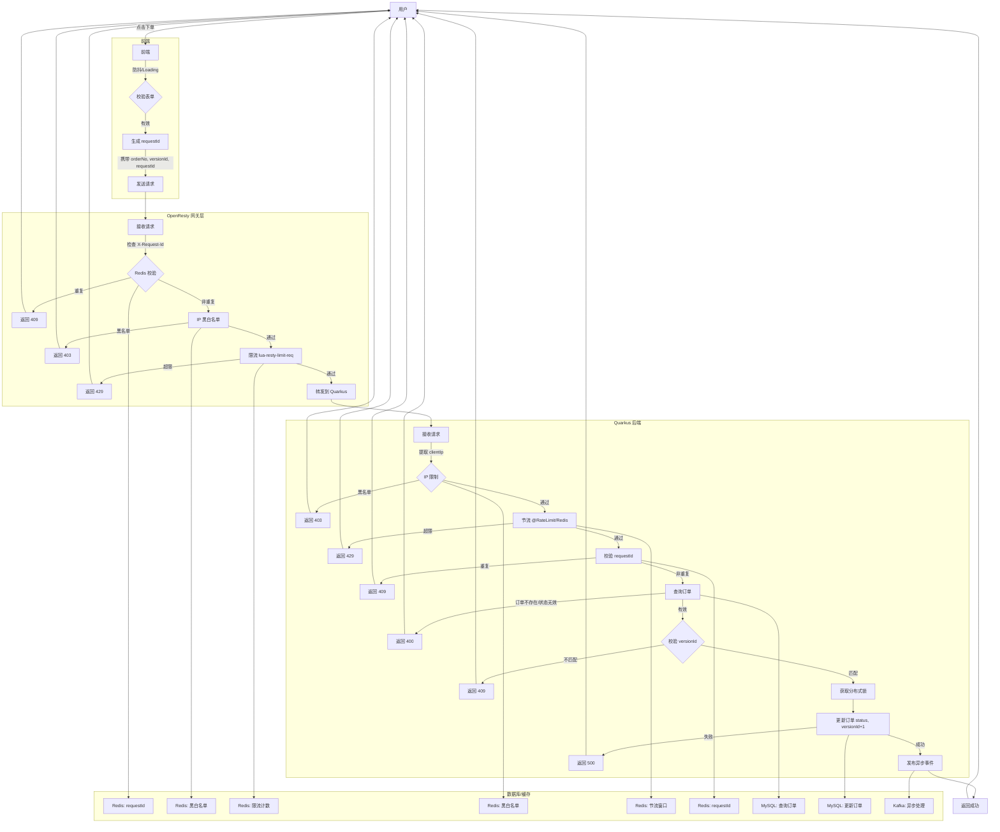

# 防止重复下单是电商、支付等系统中常见的需求，涉及前端和后端的协同设计。以下是从架构角度出发，结合前后端实现的具体方案，简洁而全面地说明如何防止重复下单：

---

### 一、总体思路
重复下单通常由以下原因导致：
1. 用户快速重复点击提交按钮。
2. 网络延迟导致前端重复发送请求。
3. 后端未对重复请求进行有效校验。
4. 分布式系统下并发导致的重复处理。

解决方案的核心是：
- **前端**：通过UI控制和请求限制减少重复提交。
- **后端**：通过唯一性校验、幂等性设计和锁机制确保数据一致性。
- **数据库/缓存**：利用唯一约束或状态机防止重复记录。

---

### 二、前端实现
前端主要负责减少不必要的重复请求，提升用户体验。

1. **按钮防抖/节流**
    - 在提交按钮上添加防抖（Debounce）或节流（Throttle）逻辑，防止短时间内多次点击。
    - 示例（JavaScript）：
      ```javascript
      let isSubmitting = false;
      document.getElementById('submitBtn').addEventListener('click', async () => {
        if (isSubmitting) return;
        isSubmitting = true;
        submitBtn.disabled = true; // 禁用按钮
        try {
          await submitOrder();
        } finally {
          isSubmitting = false;
          submitBtn.disabled = false; // 恢复按钮
        }
      });
      ```

2. **Loading状态提示**
    - 提交时显示Loading状态（如遮罩层或进度条），阻止用户重复操作。
    - 示例（Vue/React）：
      ```vue
      <button :disabled="isLoading" @click="submitOrder">
        {{ isLoading ? '提交中...' : '提交订单' }}
      </button>
      ```

3. **请求去重**
    - 对同一个订单的请求添加唯一标识（如订单号或时间戳），前端维护一个请求队列，重复请求直接丢弃。
    - 示例：
      ```javascript
      const pendingRequests = new Set();
      async function submitOrder(orderId) {
        if (pendingRequests.has(orderId)) return;
        pendingRequests.add(orderId);
        try {
          await api.submitOrder(orderId);
        } finally {
          pendingRequests.delete(orderId);
        }
      }
      ```

4. **表单校验**
    - 提交前校验表单数据完整性，避免无效请求导致重复提交。

---

### 三、后端实现
后端是防止重复下单的核心防线，需确保幂等性和数据一致性。

1. **幂等性设计**
    - 为每个订单生成唯一标识（如`orderId`或`requestId`），后端校验该标识是否已处理。
    - 实现方式：
        - 客户端生成`requestId`（如UUID），随请求发送。
        - 后端将`requestId`存入Redis（如`SETNX`），设置过期时间（如30秒）。
        - 如果`requestId`已存在，直接返回“订单已提交”或上一次的结果。
        - 示例（伪代码）：
          ```java
          String requestId = request.getHeader("X-Request-Id");
          if (redis.setnx("order:request:" + requestId, "1", 30)) {
              // 处理订单逻辑
              processOrder(order);
          } else {
              return Response.error("订单已提交，请勿重复操作");
          }
          ```

2. **数据库唯一约束**
    - 在订单表中为订单号（`orderNo`）或用户ID+商品ID组合添加唯一索引，防止重复插入。
    - 示例（MySQL）：
      ```sql
      CREATE TABLE orders (
          id BIGINT AUTO_INCREMENT PRIMARY KEY,
          order_no VARCHAR(50) UNIQUE,
          user_id BIGINT,
          product_id BIGINT,
          UNIQUE INDEX idx_user_product (user_id, product_id)
      );
      ```
    - 插入时若违反唯一约束，捕获异常并返回提示。

3. **乐观锁/悲观锁**
    - **乐观锁**：基于版本号或状态字段，防止并发更新。
        - 示例：订单表添加`version`字段，提交时校验`version`是否一致。
          ```sql
          UPDATE orders SET status = 'SUBMITTED', version = version + 1
          WHERE order_no = ? AND status = 'PENDING' AND version = ?;
          ```
    - **悲观锁**：对关键资源加锁（如`SELECT FOR UPDATE`），适合低并发场景。
        - 示例：
          ```sql
          SELECT * FROM orders WHERE order_no = ? FOR UPDATE;
          ```

4. **状态机控制**
    - 订单状态流转（如`PENDING -> SUBMITTED -> PAID`），只允许特定状态下提交。
    - 示例：后端校验订单是否为`PENDING`状态，若已为`SUBMITTED`，拒绝重复提交。

5. **分布式锁**
    - 在分布式系统中，使用Redis或ZooKeeper实现分布式锁，锁定用户ID或订单号。
    - 示例（Redis）：
      ```java
      String lockKey = "lock:order:" + userId;
      if (redis.setnx(lockKey, "1", 10)) {
          try {
              // 处理订单
              processOrder(order);
          } finally {
              redis.del(lockKey); // 释放锁
          }
      } else {
          return Response.error("系统繁忙，请稍后重试");
      }
      ```

6. **接口限流**
    - 对下单接口设置频率限制（如每秒1次/用户），防止恶意或异常重复请求。
    - 工具：Spring Cloud Gateway、Nginx或Redis（`INCR`计数）。

---

### 四、数据库/缓存辅助
1. **Redis缓存**
    - 缓存订单状态或`requestId`，快速校验重复请求。
    - 示例：`SET order:status:{orderId} "SUBMITTED" EX 3600`。

2. **消息队列**
    - 下单请求异步化，通过消息队列（如Kafka、RabbitMQ）处理，队列消费时校验重复。
    - 优点：削峰、解耦，适合高并发场景。

---

### 五、综合架构设计
以下是一个典型的高并发防止重复下单架构：
1. **前端**：防抖 + Loading状态 + 请求去重。
2. **网关层**：限流 + 请求日志记录。
3. **后端**：
    - 接收请求，校验`requestId`（Redis）。
    - 获取分布式锁（Redis/ZooKeeper）。
    - 查询订单状态（数据库/缓存）。
    - 插入订单，依赖数据库唯一约束。
    - 更新状态，释放锁。
4. **异步处理**：将库存扣减、通知等操作放入消息队列。
5. **监控**：记录重复请求日志，分析异常情况。

---

### 六、注意事项
1. **性能**：优先使用Redis校验`requestId`，减少数据库压力。
2. **用户体验**：前端及时反馈“订单已提交”，避免用户重复操作。
3. **超时处理**：设置合理的锁超时和请求过期时间，防止死锁。
4. **分布式一致性**：高并发场景下，优先考虑幂等性而非强一致性。
5. **异常场景**：处理网络抖动、事务回滚等情况，确保状态一致。

---

### 七、总结
- **前端**：防抖、Loading、请求去重，减少无效请求。
- **后端**：幂等性（`requestId`）、唯一约束、锁机制、状态机，确保数据一致。
- **辅助**：Redis缓存、消息队列提升性能和扩展性。

根据业务场景选择合适的组合：
- 小型系统：前端防抖 + 数据库唯一约束。
- 高并发系统：前端去重 + 后端幂等性 + 分布式锁 + 消息队列。

如需针对特定技术栈（如Spring Boot、Node.js）或场景（如秒杀）提供代码示例，请进一步说明！

---

以下是使用`versionId`（版本号）来防止重复下单的详细方案，基于乐观锁机制，结合前后端实现和数据库设计，确保在高并发场景下防止重复下单，同时保持性能和一致性。方案包括架构设计、代码示例和注意事项，适用于典型电商或支付系统。

---

### 一、方案概述
使用`versionId`的乐观锁机制，通过为订单记录维护一个版本号字段，在提交订单时校验版本号是否一致，只有匹配时才允许更新，防止重复提交。主要特点：
- **适用场景**：高并发、低冲突场景（如电商下单）。
- **核心思想**：每次订单状态变更时，`versionId`递增，重复请求因版本不匹配被拒绝。
- **优势**：无需悲观锁，性能较高，适合分布式系统。
- **实现层次**：前端控制请求 + 后端校验版本 + 数据库唯一约束。

---

### 二、架构设计
1. **数据库设计**
    - 订单表包含`versionId`字段，用于乐观锁。
    - 表结构示例（MySQL）：
      ```sql
      CREATE TABLE orders (
          id BIGINT AUTO_INCREMENT PRIMARY KEY,
          order_no VARCHAR(50) UNIQUE, -- 订单号，唯一
          user_id BIGINT, -- 用户ID
          product_id BIGINT, -- 商品ID
          status ENUM('PENDING', 'SUBMITTED', 'PAID', 'CANCELLED') DEFAULT 'PENDING', -- 订单状态
          version_id INT DEFAULT 0, -- 版本号，初始为0
          created_at TIMESTAMP DEFAULT CURRENT_TIMESTAMP,
          updated_at TIMESTAMP DEFAULT CURRENT_TIMESTAMP ON UPDATE CURRENT_TIMESTAMP
      );
      ```

2. **前端**
    - 防止重复点击，显示Loading状态。
    - 提交订单时携带`orderNo`和`versionId`（从后端查询获取）。

3. **后端**
    - 查询订单状态和`versionId`。
    - 提交时校验`versionId`，更新订单状态并递增`versionId`。
    - 使用Redis缓存订单状态，减少数据库压力。
    - 可选：结合`requestId`确保幂等性。

4. **流程**
    - 用户发起下单 → 前端防抖 → 后端校验`versionId`和状态 → 更新订单（`versionId+1`）→ 返回结果。
    - 重复请求因`versionId`不匹配被拒绝。

---

### 三、前端实现
前端负责减少重复请求并传递`versionId`。

1. **防抖和Loading状态**
    - 防止快速点击，提交时禁用按钮。
    - 示例（Vue）：
      ```vue
      <template>
        <button :disabled="isLoading" @click="submitOrder">
          {{ isLoading ? '提交中...' : '提交订单' }}
        </button>
      </template>
      <script>
      export default {
        data() {
          return {
            isLoading: false,
            order: { orderNo: '', versionId: 0 }
          };
        },
        methods: {
          async submitOrder() {
            if (this.isLoading) return;
            this.isLoading = true;
            try {
              const response = await this.$api.submitOrder({
                orderNo: this.order.orderNo,
                versionId: this.order.versionId
              });
              this.$message.success('订单提交成功');
              this.order.versionId = response.versionId; // 更新版本号
            } catch (error) {
              this.$message.error(error.message || '提交失败');
            } finally {
              this.isLoading = false;
            }
          },
          async fetchOrder() {
            const response = await this.$api.getOrder(this.orderNo);
            this.order = response.data; // 获取订单和versionId
          }
        },
        mounted() {
          this.fetchOrder(); // 页面加载时获取订单信息
        }
      };
      </script>
      ```

2. **请求去重**
    - 使用`orderNo`作为标识，防止重复发送相同订单请求。

---

### 四、后端实现
后端基于Spring Boot（或其他框架）实现`versionId`校验，结合Redis和数据库。

1. **依赖**
    - 数据库：MySQL（或PostgreSQL）。
    - 缓存：Redis（用于状态缓存和幂等性）。
    - 框架：Spring Boot + MyBatis（或其他ORM）。

2. **订单实体**
   ```java
   public class Order {
       private Long id;
       private String orderNo;
       private Long userId;
       private Long productId;
       private String status;
       private Integer versionId;
       private Date createdAt;
       private Date updatedAt;
       // Getters and Setters
   }
   ```

3. **服务层逻辑**
    - 查询订单，校验状态和`versionId`。
    - 更新订单状态，递增`versionId`。
    - 示例（Spring Boot）：
      ```java
      @Service
      public class OrderService {
          @Autowired
          private OrderMapper orderMapper;
          @Autowired
          private RedisTemplate<String, String> redisTemplate;
      
          @Transactional(rollbackOn = Exception.class)
          public Order submitOrder(String orderNo, Integer versionId, String requestId) {
              // 幂等性校验（requestId）
              String redisKey = "order:request:" + requestId;
              Boolean acquired = redisTemplate.opsForValue()
                  .setIfAbsent(redisKey, "1", 30, TimeUnit.SECONDS);
              if (!acquired) {
                  throw new RuntimeException("订单已提交，请勿重复操作");
              }
      
              // 查询订单
              Order order = orderMapper.selectByOrderNo(orderNo);
              if (order == null) {
                  throw new RuntimeException("订单不存在");
              }
              if (!"PENDING".equals(order.getStatus())) {
                  throw new RuntimeException("订单状态不支持提交");
              }
              if (!versionId.equals(order.getVersionId())) {
                  throw new RuntimeException("订单版本冲突，请刷新后重试");
              }
      
              // 更新订单状态和版本号
              Order updateOrder = new Order();
              updateOrder.setOrderNo(orderNo);
              updateOrder.setStatus("SUBMITTED");
              updateOrder.setVersionId(versionId + 1);
              int rows = orderMapper.updateByOrderNoAndVersion(updateOrder);
              if (rows == 0) {
                  throw new RuntimeException("订单更新失败，可能已被其他请求修改");
              }
      
              // 更新Redis缓存
              redisTemplate.opsForValue().set(
                  "order:status:" + orderNo, "SUBMITTED", 1, TimeUnit.HOURS
              );
      
              return orderMapper.selectByOrderNo(orderNo);
          }
      }
      ```

4. **Mapper接口**
   ```java
   @Mapper
   public interface OrderMapper {
       Order selectByOrderNo(String orderNo);
   
       @Update("UPDATE orders SET status = #{status}, version_id = #{versionId}, " +
               "updated_at = CURRENT_TIMESTAMP " +
               "WHERE order_no = #{orderNo} AND version_id = #{versionId} - 1")
       int updateByOrderNoAndVersion(Order order);
   }
   ```

5. **控制器**
   ```java
   @RestController
   @RequestMapping("/orders")
   public class OrderController {
       @Autowired
       private OrderService orderService;
   
       @PostMapping("/submit")
       public ResponseEntity<?> submitOrder(@RequestBody SubmitOrderRequest request) {
           try {
               Order order = orderService.submitOrder(
                   request.getOrderNo(),
                   request.getVersionId(),
                   request.getRequestId()
               );
               return ResponseEntity.ok(order);
           } catch (Exception e) {
               return ResponseEntity.badRequest().body(e.getMessage());
           }
       }
   }
   
   @Data
   public class SubmitOrderRequest {
       private String orderNo;
       private Integer versionId;
       private String requestId; // 客户端生成的唯一ID
   }
   ```

---

### 五、数据库操作
1. **查询订单**
   ```sql
   SELECT * FROM orders WHERE order_no = ?;
   ```

2. **更新订单（乐观锁）**
   ```sql
   UPDATE orders
   SET status = 'SUBMITTED', version_id = version_id + 1, updated_at = CURRENT_TIMESTAMP
   WHERE order_no = ? AND version_id = ?;
   ```
    - 如果更新行数为0，说明`versionId`不匹配，抛出异常。

3. **唯一约束**
    - 订单号（`order_no`）唯一索引防止重复插入。
    - 可选：用户ID+商品ID组合唯一索引。

---

### 六、辅助机制
1. **Redis缓存**
    - 缓存订单状态：`order:status:{orderNo}`，减少数据库查询。
    - 幂等性校验：`order:request:{requestId}`，防止重复请求。

2. **消息队列**
    - 下单成功后，将库存扣减、通知等操作异步化（如通过Kafka）。
    - 示例：
      ```java
      @Autowired
      private KafkaTemplate<String, String> kafkaTemplate;
      
      public void publishOrderEvent(Order order) {
          kafkaTemplate.send("order-topic", order.getOrderNo(), JSON.toJSONString(order));
      }
      ```

3. **分布式锁（可选）**
    - 如果冲突率高，可为`orderNo`加Redis分布式锁。
    - 示例：
      ```java
      String lockKey = "lock:order:" + orderNo;
      if (redisTemplate.opsForValue().setIfAbsent(lockKey, "1", 10, TimeUnit.SECONDS)) {
          try {
              // 处理订单
          } finally {
              redisTemplate.delete(lockKey);
          }
      }
      ```

---

### 七、注意事项
1. **性能优化**
    - Redis缓存订单状态，减少数据库压力。
    - 批量查询订单时使用`IN`子句，避免逐条查询。

2. **冲突处理**
    - 版本冲突时，返回“请刷新后重试”，前端重新获取最新`versionId`。
    - 设置合理的重试机制（如前端最多重试3次）。

3. **幂等性**
    - 结合`requestId`防止网络抖动导致的重复请求。
    - Redis的`SETNX`操作保证`requestId`唯一性。

4. **异常场景**
    - 网络超时：前端显示“提交失败，请重试”，后端确保事务回滚。
    - 并发冲突：乐观锁失败时抛出明确错误信息。

5. **监控和日志**
    - 记录重复提交日志（如`requestId`冲突）。
    - 监控乐观锁失败率，优化冲突场景。

---

### 八、完整代码示例
以下是后端核心逻辑的完整代码，基于Spring Boot。

```java
package com.example.order.service;

import com.example.order.entity.Order;
import com.example.order.mapper.OrderMapper;
import org.springframework.beans.factory.annotation.Autowired;
import org.springframework.data.redis.core.RedisTemplate;
import org.springframework.stereotype.Service;
import org.springframework.transaction.annotation.Transactional;

import java.util.concurrent.TimeUnit;

@Service
public class OrderService {

    @Autowired
    private OrderMapper orderMapper;
    @Autowired
    private RedisTemplate<String, String> redisTemplate;

    @Transactional(rollbackOn = Exception.class)
    public Order submitOrder(String orderNo, Integer versionId, String requestId) {
        // 幂等性校验
        String redisKey = "order:request:" + requestId;
        Boolean acquired = redisTemplate.opsForValue()
            .setIfAbsent(redisKey, "1", 30, TimeUnit.SECONDS);
        if (!acquired) {
            throw new RuntimeException("订单已提交，请勿重复操作");
        }

        // 查询订单
        Order order = orderMapper.selectByOrderNo(orderNo);
        if (order == null) {
            throw new RuntimeException("订单不存在");
        }
        if (!"PENDING".equals(order.getStatus())) {
            throw new RuntimeException("订单状态不支持提交");
        }
        if (!versionId.equals(order.getVersionId())) {
            throw new RuntimeException("订单版本冲突，请刷新后重试");
        }

        // 更新订单
        Order updateOrder = new Order();
        updateOrder.setOrderNo(orderNo);
        updateOrder.setStatus("SUBMITTED");
        updateOrder.setVersionId(versionId + 1);
        int rows = orderMapper.updateByOrderNoAndVersion(updateOrder);
        if (rows == 0) {
            throw new RuntimeException("订单更新失败，可能已被其他请求修改");
        }

        // 更新缓存
        redisTemplate.opsForValue().set(
            "order:status:" + orderNo, "SUBMITTED", 1, TimeUnit.HOURS
        );

        return orderMapper.selectByOrderNo(orderNo);
    }
}
```

```java
package com.example.order.mapper;

import com.example.order.entity.Order;
import org.apache.ibatis.annotations.Mapper;
import org.apache.ibatis.annotations.Update;

@Mapper
public interface OrderMapper {
    Order selectByOrderNo(String orderNo);

    @Update("UPDATE orders SET status = #{status}, version_id = #{versionId}, " +
            "updated_at = CURRENT_TIMESTAMP " +
            "WHERE order_no = #{orderNo} AND version_id = #{versionId} - 1")
    int updateByOrderNoAndVersion(Order order);
}
```

---

### 九、总结
- **前端**：防抖、携带`versionId`，显示友好提示。
- **后端**：基于`versionId`的乐观锁，结合`requestId`和Redis确保幂等性。
- **数据库**：`versionId`字段 + 唯一约束，防止重复插入。
- **扩展性**：Redis缓存和消息队列提升性能，分布式锁应对高冲突场景。

此方案适合中高并发场景（如电商下单），若需进一步优化（如秒杀场景）或特定技术栈实现（如Node.js），请提供更多细节！

---

以下是结合 **Quarkus** 的节流（throttle）方案、IP 地址限制，以及在 **OpenResty** 层面的补充方案，聚焦于防止重复下单的场景。内容避免重复之前提到的 `versionId` 乐观锁方案，侧重于新的节流和 IP 限制机制，结合 Quarkus 和 OpenResty 的特性，提供高并发场景下的补充实现。方案包括详细代码示例、架构设计和注意事项，适用于电商或支付系统。

---

### 一、总体思路
- **目标**：通过 Quarkus 的节流机制限制请求频率，结合 IP 地址限制防止恶意重复下单，在 OpenResty 层面补充前置防护，增强系统鲁棒性。
- **Quarkus 层面**：利用 `SmallRye Fault Tolerance` 的 `@RateLimit` 或自定义节流逻辑，结合 IP 校验，限制用户或 IP 的下单频率。
- **OpenResty 层面**：通过 Nginx Lua 模块实现前置限流和 IP 黑白名单，减轻后端压力。
- **结合点**：OpenResty 作为网关层处理粗粒度限流和 IP 过滤，Quarkus 提供细粒度业务逻辑校验（如订单频率限制）。

---

### 二、Quarkus 节流方案
Quarkus 可通过 `SmallRye Fault Tolerance` 的 `@RateLimit` 注解或自定义 Redis 节流器实现频率限制，结合 IP 地址校验防止重复下单。

#### 1. 使用 SmallRye Fault Tolerance 的 @RateLimit
- **场景**：限制用户或 IP 的下单频率（如每分钟 10 次）。
- **依赖**：添加 `quarkus-smallrye-fault-tolerance` 依赖。
  ```xml
  <dependency>
      <groupId>io.quarkus</groupId>
      <artifactId>quarkus-smallrye-fault-tolerance</artifactId>
  </dependency>
  ```

- **实现**：在下单接口上添加 `@RateLimit` 注解，结合 IP 提取逻辑。
  ```java
  import io.smallrye.faulttolerance.api.RateLimit;
  import jakarta.ws.rs.POST;
  import jakarta.ws.rs.Path;
  import jakarta.ws.rs.core.Context;
  import jakarta.ws.rs.core.HttpHeaders;
  import jakarta.ws.rs.core.Response;
  import org.jboss.resteasy.reactive.RestHeader;
  
  @Path("/orders")
  public class OrderResource {
      @POST
      @Path("/submit")
      @RateLimit(limit = 10, window = 60, windowUnit = java.time.temporal.ChronoUnit.SECONDS) // 每分钟10次
      public Response submitOrder(
              @Context HttpHeaders headers,
              @RestHeader("X-Request-Id") String requestId,
              OrderRequest orderRequest) {
          // 提取客户端 IP
          String clientIp = getClientIp(headers);
          // 校验 IP 是否在黑名单（Redis 或数据库）
          if (isIpBlacklisted(clientIp)) {
              return Response.status(403).entity("IP restricted").build();
          }
  
          // 业务逻辑：校验 requestId 和下单
          processOrder(orderRequest, requestId, clientIp);
          return Response.ok("Order submitted").build();
      }
  
      private String getClientIp(HttpHeaders headers) {
          String forwardedFor = headers.getHeaderString("X-Forwarded-For");
          if (forwardedFor != null && !forwardedFor.isEmpty()) {
              return forwardedFor.split(",")[0].trim();
          }
          return headers.getHeaderString("X-Real-IP") != null
                  ? headers.getHeaderString("X-Real-IP")
                  : "unknown";
      }
  
      private boolean isIpBlacklisted(String ip) {
          // 示例：查询 Redis 黑名单
          return redisTemplate.opsForSet().isMember("blacklist:ips", ip);
      }
  
      private void processOrder(OrderRequest order, String requestId, String clientIp) {
          // 实现订单处理逻辑，结合之前提到的幂等性校验
      }
  }
  ```
- **说明**：
    - `@RateLimit` 限制每 60 秒 10 次请求，超出时抛出 `RateLimitException`。
    - 提取 `X-Forwarded-For` 或 `X-Real-IP` 获取客户端 IP（需 OpenResty 或其他代理正确设置）。
    - 使用 Redis 存储 IP 黑名单，动态限制恶意 IP。

- **配置**：在 `application.properties` 中调整全局限流策略。
  ```properties
  quarkus.fault-tolerance.rate-limit.default.limit=10
  quarkus.fault-tolerance.rate-limit.default.window=60s
  ```

#### 2. 自定义 Redis 节流器
- **场景**：更灵活的节流逻辑，如基于用户 ID 或 IP 的动态限流。
- **实现**：使用 Redis 的计数器和滑动窗口。
  ```java
  import io.quarkus.redis.datasource.RedisDataSource;
  import jakarta.enterprise.context.ApplicationScoped;
  import jakarta.inject.Inject;
  
  @ApplicationScoped
  public class RateLimiterService {
      @Inject
      RedisDataSource redisDataSource;
  
      public boolean allowRequest(String key, int limit, int windowSeconds) {
          String redisKey = "ratelimit:" + key;
          long currentTime = System.currentTimeMillis() / 1000;
          // 清理过期时间戳
          redisDataSource.sortedSet().zremrangebyscore(redisKey, 0, currentTime - windowSeconds);
          // 获取当前窗口内请求数
          long requestCount = redisDataSource.sortedSet().zcard(redisKey);
          if (requestCount >= limit) {
              return false;
          }
          // 记录当前请求
          redisDataSource.sortedSet().zadd(redisKey, currentTime, String.valueOf(currentTime));
          redisDataSource.key().expire(redisKey, windowSeconds);
          return true;
      }
  }
  ```
- **使用**：在下单接口中调用。
  ```java
  @Path("/orders")
  public class OrderResource {
      @Inject
      RateLimiterService rateLimiterService;
  
      @POST
      @Path("/submit")
      public Response submitOrder(
              @Context HttpHeaders headers,
              @RestHeader("X-Request-Id") String requestId,
              OrderRequest orderRequest) {
          String clientIp = getClientIp(headers);
          String userId = orderRequest.getUserId();
          // 基于 IP 和用户 ID 的限流
          if (!rateLimiterService.allowRequest("ip:" + clientIp, 10, 60) ||
              !rateLimiterService.allowRequest("user:" + userId, 5, 60)) {
              return Response.status(429).entity("Too many requests").build();
          }
          // 订单处理逻辑
          processOrder(orderRequest, requestId, clientIp);
          return Response.ok("Order submitted").build();
      }
  }
  ```
- **说明**：
    - 使用 Redis 排序集合（ZSET）实现滑动窗口，记录请求时间戳。
    - 限制 IP（每分钟 10 次）和用户（每分钟 5 次），防止恶意重复下单。
    - Redis 键自动过期，减少内存占用。

#### 3. IP 地址限制
- **实现**：结合 Redis 动态管理 IP 黑白名单。
  ```java
  @ApplicationScoped
  public class IpRestrictionService {
      @Inject
      RedisDataSource redisDataSource;
  
      public void addToBlacklist(String ip, long ttlSeconds) {
          redisDataSource.set().sadd("blacklist:ips", ip);
          redisDataSource.key().expire("blacklist:ips", ttlSeconds);
      }
  
      public void addToWhitelist(String ip) {
          redisDataSource.set().sadd("whitelist:ips", ip);
      }
  
      public boolean isAllowed(String ip) {
          if (redisDataSource.set().sismember("whitelist:ips", ip)) {
              return true;
          }
          return !redisDataSource.set().sismember("blacklist:ips", ip);
      }
  }
  ```
- **使用**：在下单接口中校验 IP。
  ```java
  @Inject
  IpRestrictionService ipRestrictionService;
  
  @POST
  @Path("/submit")
  public Response submitOrder(@Context HttpHeaders headers, OrderRequest orderRequest) {
      String clientIp = getClientIp(headers);
      if (!ipRestrictionService.isAllowed(clientIp)) {
          return Response.status(403).entity("IP restricted").build();
      }
      // 订单处理逻辑
      return Response.ok("Order submitted").build();
  }
  ```
- **说明**：
    - 白名单优先，允许特定 IP 无限制访问。
    - 黑名单动态更新（如检测到异常行为后加入，TTL 控制禁制时间）。
    - 可通过管理接口动态调整名单。

---

### 三、OpenResty 补充方案
OpenResty（基于 Nginx 和 Lua）作为网关层，提供前置限流和 IP 限制，减轻 Quarkus 后端压力，适合高并发场景。

#### 1. 基于 Lua 的请求限流
- **场景**：对下单接口进行全局限流（如每秒 100 次）。
- **实现**：使用 `lua-resty-limit-req` 模块。
    - **安装**：确保 OpenResty 已编译 `lua-resty-limit-req`。
    - **配置**（`nginx.conf`）：
      ```nginx
      http {
          lua_shared_dict limit_req_store 10m;
      
          server {
              listen 80;
              location /orders/submit {
                  access_by_lua_block {
                      local limit_req = require "resty.limit.req"
                      -- 每秒100次，突发10次
                      local lim, err = limit_req.new("limit_req_store", 100, 10)
                      if not lim then
                          ngx.log(ngx.ERR, "failed to instantiate limit_req: ", err)
                          return ngx.exit(500)
                      end
                      local key = ngx.var.remote_addr -- 基于 IP 限流
                      local delay, err = lim:incoming(key, true)
                      if not delay then
                          if err == "rejected" then
                              return ngx.exit(429) -- Too Many Requests
                          end
                          ngx.log(ngx.ERR, "failed to limit req: ", err)
                          return ngx.exit(500)
                      end
                      if delay >= 0.001 then
                          ngx.sleep(delay) -- 延迟处理
                      end
                  }
                  proxy_pass http://quarkus_backend;
              }
          }
      }
      ```
- **说明**：
    - 使用共享内存（`lua_shared_dict`）存储限流计数。
    - 基于客户端 IP（`remote_addr`）限流，防止单一 IP 恶意请求。
    - 超出限流返回 429 状态码，前端可提示“请求过于频繁”。

#### 2. IP 黑白名单
- **场景**：屏蔽恶意 IP，优先放行信任 IP。
- **实现**：使用 Lua 脚本和 Redis 存储名单。
    - **配置**（`nginx.conf`）：
      ```nginx
      http {
          lua_shared_dict ip_cache 1m;
          init_by_lua_block {
              local redis = require "resty.redis"
              local red = redis:new()
              red:set_timeout(1000) -- 1秒超时
              local ok, err = red:connect("redis_host", 6379)
              if not ok then
                  ngx.log(ngx.ERR, "failed to connect to redis: ", err)
                  return
              end
              _G.redis = red -- 全局 Redis 实例
          }
      
          server {
              listen 80;
              location /orders/submit {
                  access_by_lua_block {
                      local ip = ngx.var.remote_addr
                      local redis = _G.redis
                      -- 检查白名单
                      local is_whitelisted, err = redis:sismember("whitelist:ips", ip)
                      if is_whitelisted == 1 then
                          return -- 放行
                      end
                      -- 检查黑名单
                      local is_blacklisted, err = redis:sismember("blacklist:ips", ip)
                      if is_blacklisted == 1 then
                          ngx.exit(403) -- 拒绝访问
                      end
                  }
                  proxy_pass http://quarkus_backend;
              }
          }
      }
      ```
- **说明**：
    - 使用 Redis 存储黑白名单，与 Quarkus 共享数据。
    - 白名单 IP 直接放行，黑名单 IP 返回 403。
    - Lua 脚本在 `access_by_lua` 阶段执行，性能高效。

#### 3. 请求去重
- **场景**：拦截重复的 `X-Request-Id` 请求。
- **实现**：使用 Lua 和 Redis 校验请求 ID。
  ```nginx
  location /orders/submit {
      access_by_lua_block {
          local redis = _G.redis
          local request_id = ngx.req.get_headers()["X-Request-Id"]
          if not request_id then
              ngx.exit(400) -- 缺少 requestId
          end
          local key = "request:" .. request_id
          local ok, err = redis:setnx(key, 1)
          if not ok then
              ngx.log(ngx.ERR, "redis setnx failed: ", err)
              return ngx.exit(500)
          end
          if ok == 0 then
              ngx.exit(409) -- 请求已存在
          end
          redis:expire(key, 30) -- 30秒过期
      }
      proxy_pass http://quarkus_backend;
  }
  ```
- **说明**：
    - 检查 `X-Request-Id` 是否在 Redis 中存在，防止重复请求。
    - 设置 30 秒过期时间，避免 Redis 内存膨胀。
    - 在 OpenResty 层拦截，减少 Quarkus 处理无效请求。

---

### 四、综合架构设计
以下是结合 Quarkus 和 OpenResty 的防止重复下单架构：
1. **OpenResty 网关层**：
    - **限流**：基于 IP 的全局限流（`lua-resty-limit-req`）。
    - **IP 限制**：Redis 黑白名单过滤恶意 IP。
    - **请求去重**：校验 `X-Request-Id`，拦截重复请求。
2. **Quarkus 应用层**：
    - **节流**：`@RateLimit` 或 Redis 滑动窗口，限制用户/IP 频率。
    - **IP 校验**：动态黑白名单，拒绝异常请求。
    - **业务逻辑**：结合之前的 `versionId` 乐观锁和 `requestId` 幂等性校验。
3. **Redis**：共享限流计数、黑白名单和请求 ID 状态。
4. **监控**：记录限流触发、IP 屏蔽和重复请求日志，分析异常行为。

---

### 五、注意事项
1. **性能**：
    - OpenResty 的 Lua 脚本高效，但需监控 Redis 连接池，避免瓶颈。
    - Quarkus 的 `@RateLimit` 适合简单场景，高并发下推荐 Redis 自定义节流器。

2. **一致性**：
    - 确保 OpenResty 和 Quarkus 使用同一 Redis 实例，保持黑白名单和 `requestId` 一致。
    - 配置合理的 Redis 键过期时间，防止内存泄漏。

3. **用户体验**：
    - 限流或 IP 限制时，返回明确的 HTTP 状态码（如 429、403）和提示信息。
    - 前端显示“请求过于频繁”或“IP 受限”，引导用户重试。

4. **安全性**：
    - 防止 `X-Forwarded-For` 伪造，在 OpenResty 配置 `set_real_ip_from` 信任的代理 IP。[](https://github.com/quarkusio/quarkus/discussions/29887)
    - 定期更新黑白名单，结合行为分析（如高频下单）动态封禁。

5. **扩展性**：
    - 高并发场景下，考虑 OpenResty 多节点部署，使用 Redis 分布式计数。
    - Quarkus 可结合 Kafka 异步处理订单，削峰填谷。

---

### 六、总结
- **Quarkus**：
    - 使用 `@RateLimit` 快速实现限流，适合简单场景。
    - 自定义 Redis 节流器支持灵活的 IP/用户限流。
    - IP 黑白名单动态管理，增强防护。
- **OpenResty**：
    - 前置限流（`lua-resty-limit-req`）降低后端压力。
    - Lua + Redis 实现 IP 黑白名单和请求去重。
- **结合优势**：
    - OpenResty 提供高性能网关防护，Quarkus 聚焦业务逻辑。
    - Redis 作为共享存储，确保限流和 IP 限制一致性。

如需针对特定场景（如秒杀）或更详细的 OpenResty Lua 脚本优化，请提供更多细节！

---

以下是基于之前讨论的防止重复下单方案（包括 `versionId` 乐观锁、Quarkus 节流、IP 地址限制和 OpenResty 网关层）的综合架构设计，使用 Mermaid 流程图展示前后端、OpenResty 和数据库/缓存的交互流程。图表清晰地描述了从用户请求到订单处理的完整路径，涵盖前端防抖、OpenResty 限流、Quarkus 节流与校验、后端业务逻辑及数据库操作。



### 说明
- **图表结构**：
    - **前端**：展示防抖、表单校验、生成 `requestId` 和发送请求的流程。
    - **OpenResty 网关层**：包括 `X-Request-Id` 去重、IP 黑白名单校验和限流。
    - **Quarkus 后端**：涵盖 IP 限制、节流、 `requestId` 校验、订单查询、 `versionId` 校验、分布式锁和订单更新。
    - **数据库/缓存**：Redis 用于限流、黑白名单和 `requestId` 校验，MySQL 存储订单数据，Kafka 处理异步任务。
- **交互**：
    - 用户请求经过前端、OpenResty 和 Quarkus 的层层校验，任何环节失败（如限流、IP 限制、版本冲突）都会返回错误。
    - 成功路径涉及订单更新和异步事件发布。
- **Mermaid 特性**：
    - 使用 `subgraph` 分隔前端、OpenResty、Quarkus 和数据库/缓存层，便于理解。
    - 箭头表示请求流向，条件分支清晰展示成功和失败路径。

此 Mermaid 图可直接在支持 Mermaid 的工具（如 VS Code、GitHub、Mermaid Live Editor）中渲染，完整呈现防止重复下单的架构流程。如需调整图表样式或添加特定细节，请进一步说明！