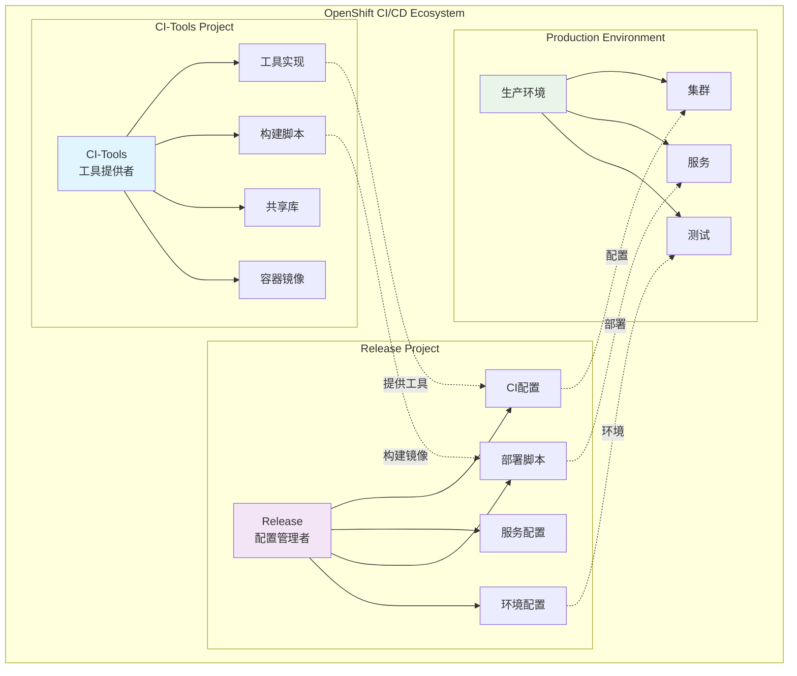
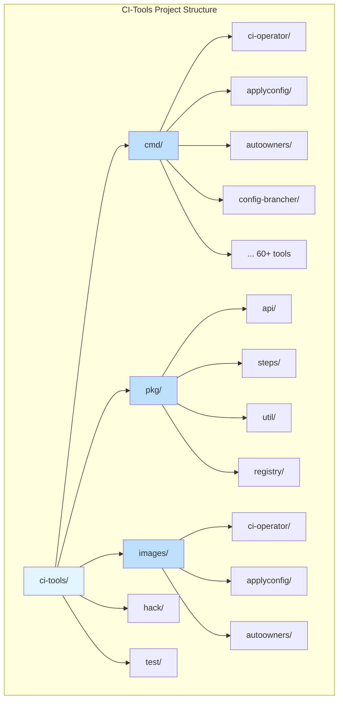
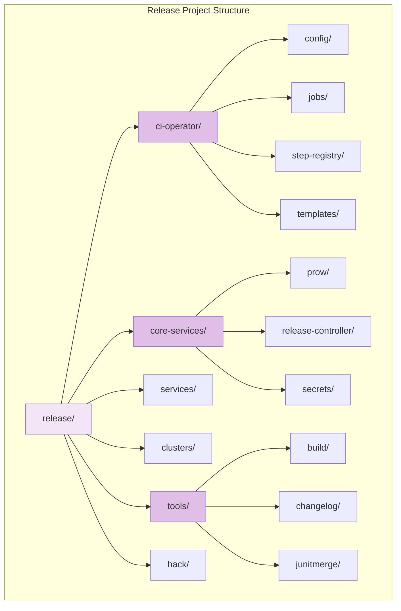
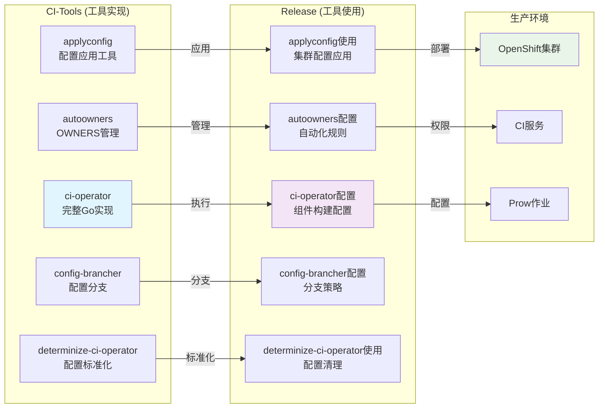
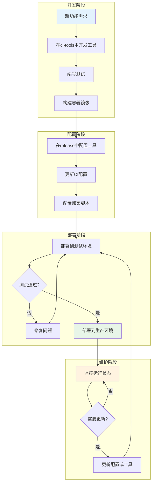
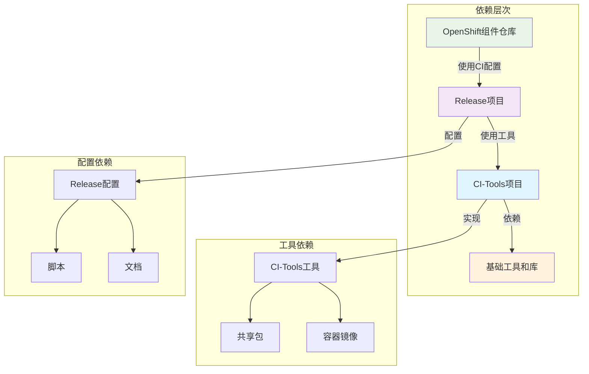

# CI-Tools vs Release 项目分析报告

## 概述

本文档详细分析了OpenShift CI/CD生态系统中的两个核心项目：`ci-tools` 和 `release`。这两个项目虽然名称相似且存在一些相同内容，但它们在OpenShift的CI/CD流程中扮演着不同但互补的角色。

## 项目关系图



## 项目定位

### CI-Tools 项目
- **定位**: CI/CD工具集合和基础设施
- **主要职责**: 提供构建、测试、部署等CI/CD流程所需的工具实现
- **目标用户**: CI/CD工具开发者、平台维护者
- **核心价值**: 提供可重用的CI/CD工具和组件

### Release 项目
- **定位**: 发布流程管理和配置仓库
- **主要职责**: 管理OpenShift组件仓库的CI工作流配置和集群清单
- **目标用户**: 组件开发者、发布工程师
- **核心价值**: 提供标准化的CI配置和发布流程

## 项目结构对比

### CI-Tools 项目结构



### Release 项目结构



## 工具关系图



## 工作流程图



## 相同内容分析

### 1. 完全相同的部分

#### 许可证文件
- **文件**: `LICENSE`
- **内容**: Apache License 2.0
- **版权**: Copyright 2014 Red Hat, Inc.
- **说明**: 开源许可证需要保持一致，这是合理的共享

### 2. 名称相同但内容不同的部分

#### 工具和脚本

| 工具名称 | CI-Tools 实现 | Release 实现 | 差异说明 |
|---------|--------------|-------------|----------|
| ci-operator | 完整的Go实现（2500+行） | 仅配置和文档 | 工具实现 vs 工具使用 |
| check-gh-automation | 复杂的本地开发脚本 | 简单的生产脚本 | 开发环境 vs 生产环境 |
| ci-secret-bootstrap | 工具实现 | 脚本包装器 | 核心功能 vs 部署脚本 |

#### 配置文件

| 配置类型 | CI-Tools 内容 | Release 内容 | 差异说明 |
|---------|--------------|-------------|----------|
| OWNERS | 13个审批者/审查者 | 2个审批者/1个审查者 | 不同的管理结构 |
| Makefile | 构建和测试目标 | 配置管理目标 | 不同的构建流程 |
| .gitignore | 开发环境忽略 | 生产环境忽略 | 不同的环境需求 |

### 3. 功能互补的部分

#### 工具集关系
```
CI-Tools (工具提供者)
├── 工具实现
├── 构建脚本
├── 测试框架
└── 开发工具

Release (工具使用者)
├── 工具配置
├── 部署脚本
├── 生产环境
└── 发布流程
```

## 依赖关系图



## 核心工具对比

### CI-Operator
- **CI-Tools**: 提供完整的ci-operator实现
    - 支持多阶段构建
    - 镜像构建和测试
    - 配置解析和执行
    - 错误处理和日志记录

- **Release**: 提供ci-operator配置
    - 组件特定的构建配置
    - 测试步骤定义
    - 镜像推广规则
    - 环境特定设置

### 配置管理工具
- **CI-Tools**: 提供工具实现
    - `applyconfig`: 配置应用到集群
    - `config-brancher`: 配置分支管理
    - `determinize-ci-operator`: 配置标准化

- **Release**: 提供配置内容
    - 集群配置清单
    - 服务配置
    - 环境特定设置

## 设计模式分析

### 关注点分离
两个项目遵循了清晰的责任分离：

1. **CI-Tools**: 专注于"如何做"
    - 工具的实现和构建
    - 核心功能和算法
    - 可重用组件

2. **Release**: 专注于"做什么"
    - 配置和部署
    - 环境管理
    - 发布流程

### 依赖关系
```
Release 项目
    ↓ (使用)
CI-Tools 项目
    ↓ (提供)
基础工具和组件
```

## 工作流程

### 开发流程
1. **工具开发**: 在ci-tools中开发新工具
2. **工具构建**: 构建容器镜像
3. **配置更新**: 在release中更新配置
4. **部署测试**: 在生产环境中测试
5. **发布**: 正式发布新功能

### 维护流程
1. **配置变更**: 在release中修改配置
2. **工具更新**: 在ci-tools中更新工具
3. **版本同步**: 确保版本兼容性
4. **部署**: 部署到生产环境

## 最佳实践

### 开发建议
1. **新工具开发**: 在ci-tools中实现
2. **配置管理**: 在release中维护
3. **版本控制**: 保持两个项目的版本同步
4. **测试**: 在开发环境中充分测试

### 维护建议
1. **定期同步**: 确保工具和配置的一致性
2. **文档更新**: 及时更新相关文档
3. **向后兼容**: 保持API的向后兼容性
4. **监控**: 监控生产环境的运行状态

## 常见问题

### Q: 为什么需要两个项目？
A: 这种设计实现了关注点分离，允许工具开发和配置管理独立进行，提高了系统的可维护性和灵活性。

### Q: 如何添加新的CI工具？
A: 在ci-tools中实现工具，在release中配置使用，确保两个项目保持同步。

### Q: 如何处理配置变更？
A: 在release中进行配置变更，确保与ci-tools中的工具版本兼容。

## 总结

CI-Tools和Release项目虽然存在一些相同内容，但它们不是重复的项目，而是OpenShift CI/CD生态系统中互补的两个重要组成部分：

- **CI-Tools**: 提供工具和基础设施
- **Release**: 提供配置和部署管理

这种设计模式实现了：
- 清晰的职责分离
- 更好的可维护性
- 灵活的配置管理
- 统一的工具生态

通过理解这两个项目的关系和差异，可以更好地参与OpenShift CI/CD生态系统的开发和维护工作。 