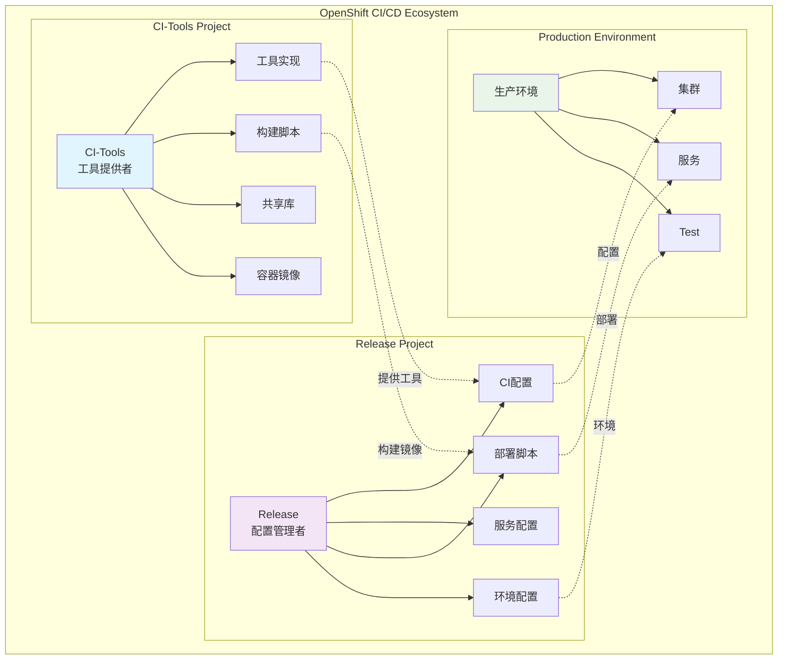
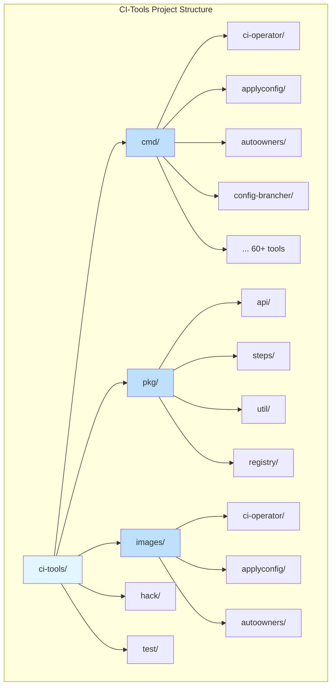
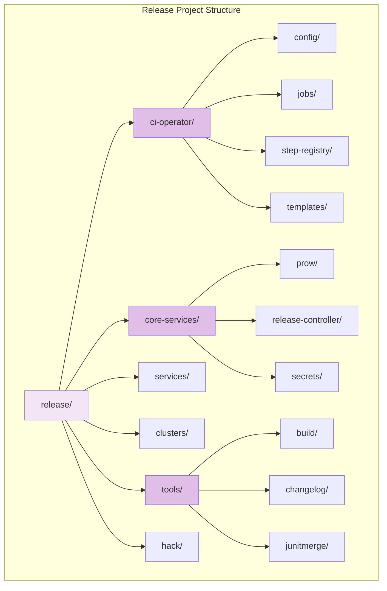
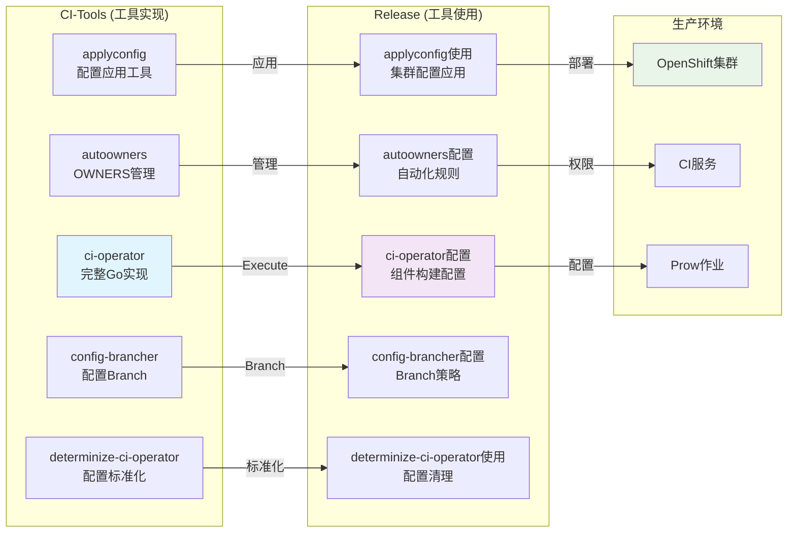
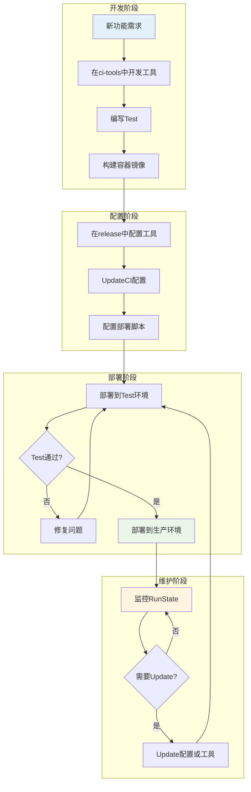
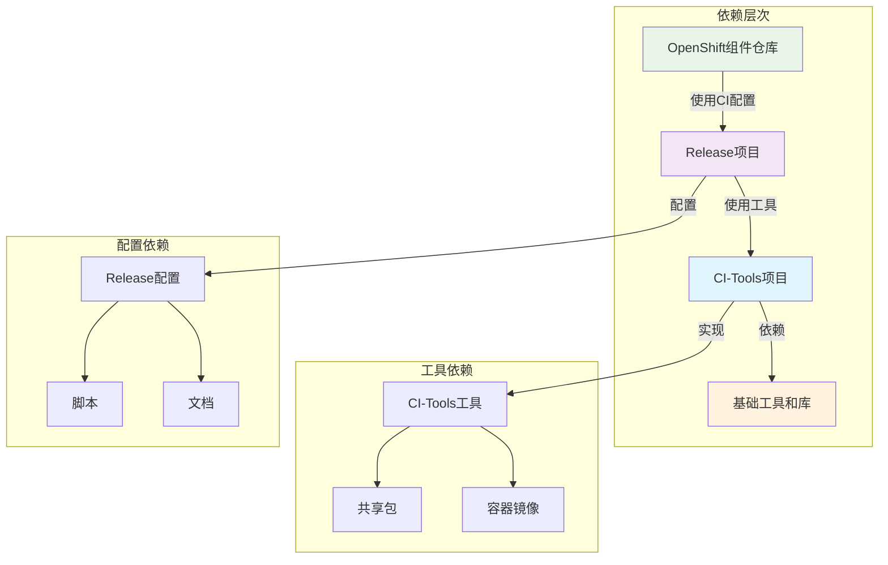

# CI-Tools vs Release 项目Analysis报告

## 概述

本文档详细Analysis了OpenShift CI/CD生态系统中的两个核心项目：`ci-tools` 和 `release`。这两个项目虽然名称相似且存在一些相同内容，但它们在OpenShift的CI/CD流程中扮演着不同但互补的角色。

## 项目关系Graph



## 项目定位

### CI-Tools 项目
- **定位**: CI/CDTool集合和基础设施
- **Main职责**: 提供构建、Testing、Deployment等CI/CD流程所需的ToolImplementation
- **目标用户**: CI/CDToolDevelopment者、平台Maintenance者
- **核心价Value**: 提供可重用的CI/CDTool和组件

### Release 项目
- **定位**: 发布流程管理和Configure仓Library
- **Main职责**: 管理OpenShift组件仓Library的CI工作流Configure和Cluster清单
- **目标用户**: 组件Development者、发布工程师
- **核心价Value**: 提供Standard化的CIConfigure和发布流程

## 项目结构对比

### CI-Tools 项目结构



### Release 项目结构



## Tool关系Graph



## 概述0



## 概述1

## 概述2

## 概述3
- **文件**: `LICENSE`
- **内容**: Apache License 2/CDTool集合和基础设施3
- **Main职责**0: Copyright 2014 Red Hat, Inc.
- **Main职责**1: 开源许可证需要保持一致，这是合理的共享

## 概述4

## 概述5

| Tool名称 | CI-Tools Implementation | Release Implementation | 差异说明 |
|---------|--------------|-------------|----------|
| ci-operator | 完整的GoImplementation（2500+行） | 仅Configure和文档 | ToolImplementation vs Tool使用 |
| check-gh-automation | Complex的本地Development脚本 | Simple的生产脚本 | Development环境 vs 生产环境 |
| ci-secret-bootstrap | ToolImplementation | 脚本包装器 | Core Features vs Deployment脚本 |

## 概述6

| ConfigureClass型 | CI-Tools 内容 | Release 内容 | 差异说明 |
|---------|--------------|-------------|----------|
| OWNERS | 13个审批者/CDTool集合和基础设施4 | 2个审批者/CDTool集合和基础设施5 | 不同的管理结构 |
| Makefile | 构建和Testing目标 | Configure管理目标 | 不同的构建流程 |
| /CDTool集合和基础设施6 | Development环境忽略 | 生产环境忽略 | 不同的环境需求 |

## 概述7

## 概述8
```
CI-Tools (工具提供者)
├── 工具实现
├── 构建脚本
├── Test框架
└── 开发工具

Release (工具使用者)
├── 工具配置
├── 部署脚本
├── 生产环境
└── 发布流程
```

## 概述9



## 项目关系Graph0

## 项目关系Graph1
- **Main职责**2: 提供完整的ci-operatorImplementation
    - 支持多阶段构建
    - 镜像构建和Testing
    - Configure解析和Execute
    - ErrorProcess和Logging记录

- **Main职责**3: 提供ci-operatorConfigure
    - 组件特定的构建Configure
    - TestingStepsDefinition
    - 镜像推广规则
    - 环境特定设置

## 项目关系Graph2
- **Main职责**2: 提供ToolImplementation
    - `applyconfig`release`7config-brancher`release`8determinize-ci-operator`: ConfigureStandard化

- **Main职责**3: 提供Configure内容
    - ClusterConfigure清单
    - 服务Configure
    - 环境特定设置

## 项目关系Graph3

## 项目关系Graph4
两个项目遵循了清晰的责任分离：

1. **Main职责**2: 专注于"如何做"
    - Tool的Implementation和构建
    - Core Features和Algorithm
    - 可重用组件

2. **Main职责**3: 专注于"做什么"
    - Configure和Deployment
    - 环境管理
    - 发布流程

## 项目关系Graph5
```
Release 项目
    ↓ (使用)
CI-Tools 项目
    ↓ (提供)
基础工具和组件
```

## 项目关系Graph6

## 项目关系Graph7
1. **Main职责**8: 在ci-tools中Development新Tool
2. **Main职责**9: 构建Container镜像
3. **目标用户**0: 在release中UpdateConfigure
4. **目标用户**1: 在生产环境中Testing
5. **目标用户**2: 正式发布新功能

## 项目关系Graph8
1. **目标用户**3: 在release中修改Configure
2. **目标用户**4: 在ci-tools中UpdateTool
3. **目标用户**5: 确保版本Compatibility
4. **目标用户**6: Deployment到生产环境

## 项目关系Graph9

## 项目定位0
1. **目标用户**7: 在ci-tools中Implementation
2. **目标用户**8: 在release中Maintenance
3. **目标用户**9: 保持两个项目的版本Synchronization
4. **核心价Value**0: 在Development环境中充分Testing

## 项目定位1
1. **核心价Value**1: 确保Tool和Configure的一致性
2. **核心价Value**2: TimelyUpdate相关文档
3. **核心价Value**3: 保持API的向后Compatibility
4. **核心价Value**4: Monitoring生产环境的RuntimeState

## 项目定位2

## 项目定位3
A: 这种DesignImplementation了关注点分离，允许ToolDevelopment和Configure管理独立进行，提高了系统的Maintainability和Flexible性。

## 项目定位4
A: 在ci-tools中ImplementationTool，在release中Configure使用，确保两个项目保持Synchronization。

## 项目定位5
A: 在release中进行Configure变更，确保与ci-tools中的Tool版本兼容。

## 项目定位6

CI-Tools和Release项目虽然存在一些相同内容，但它们不是重复的项目，而是OpenShift CI/CD生态系统中互补的两个重要组成部分：

- **Main职责**2: 提供Tool和基础设施
- **Main职责**3: 提供Configure和Deployment管理

这种DesignPatternImplementation了：
- 清晰的职责分离
- 更好的Maintainability
- Flexible的Configure管理
- 统一的Tool生态

通过理解这两个项目的关系和差异，可以更好地参与OpenShift CI/CD生态系统的Development和Maintenance工作。 