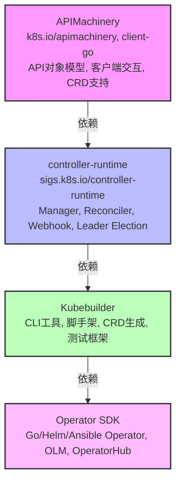
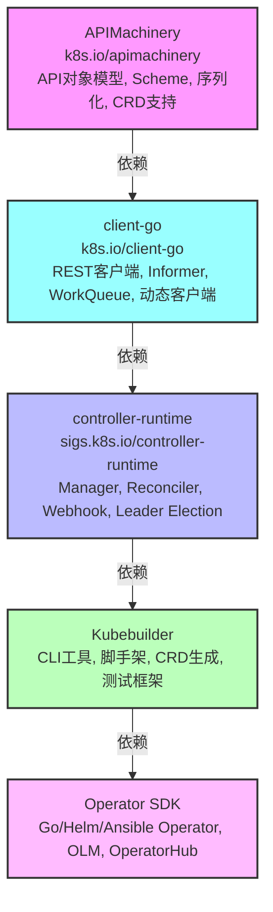

# **controller-runtime** 是一个用于构建 Kubernetes 控制器的 Go 语言库集合

**controller-runtime** 是一个用于构建 Kubernetes 控制器的 Go 语言库集合，广泛应用于云原生开发中。它提供了简化控制器开发的核心工具和抽象，降低了直接操作 Kubernetes API 的复杂性。该项目由 Kubernetes SIGs（Special Interest Groups）维护，是 Kubernetes 生态系统中的重要组件。

### 核心功能
1. **控制器框架**：提供控制器（Controller）的核心逻辑，用于协调 Kubernetes 资源的期望状态（Desired State）与实际状态（Actual State）。
2. **客户端库**：通过 `client-go` 的封装，提供高效的 Kubernetes API 交互能力。
3. **事件驱动机制**：支持基于事件的工作队列（Work Queue），用于处理资源变更事件。
4. **工具集**：
    - **Manager**：协调多个控制器的运行，管理共享缓存和客户端。
    - **Reconciler**：实现控制器的核心调谐逻辑（Reconcile Loop）。
    - **Webhook 支持**：内置支持 Admission Webhooks（如 ValidatingWebhook 和 MutatingWebhook）。
    - **Leader Election**：支持控制器的高可用性，确保同一时间只有一个实例运行。
5. **缓存与索引**：提供高效的本地缓存机制，减少对 Kubernetes API Server 的直接调用。

### 与 Kubebuilder 和 Operator SDK 的关系
- **Kubebuilder**：一个基于 controller-runtime 的框架，提供脚手架工具和代码生成，帮助开发者快速创建控制器和自定义资源（CRD）。Kubebuilder 的控制器逻辑依赖 controller-runtime 的核心库。
- **Operator SDK**：同样基于 controller-runtime，支持更广泛的 Operator 开发场景（包括 Go、Helm 和 Ansible）。它通过 controller-runtime 实现 Go Operator 的核心功能。
- 两者都推荐作为新项目的起点，Kubebuilder 更适合需要深度定制的场景，而 Operator SDK 提供更多开箱即用的功能。

### 使用场景
- 开发自定义控制器，管理 Kubernetes 资源（如 Pod、Deployment 或 CRD）。
- 构建 Kubernetes Operator，扩展 Kubernetes 的功能，自动化复杂应用的部署与管理。
- 实现 Webhook，用于资源验证或修改。

### 如何开始
1. **参考 Kubebuilder 的快速入门**：Kubebuilder 提供了详细的教程，展示如何使用 controller-runtime 创建控制器和 CRD（参见 [Kubebuilder Quick Start](https://book.kubebuilder.io/quick-start.html)）。
2. **直接使用 controller-runtime**：对于高级用户，可以直接引入 `sigs.k8s.io/controller-runtime` 包，编写自定义控制器逻辑。
3. **安装**：
   ```bash
   go get sigs.k8s.io/controller-runtime
   ```
4. **示例代码**：
   ```go
   import (
       "sigs.k8s.io/controller-runtime/pkg/client/config"
       "sigs.k8s.io/controller-runtime/pkg/manager"
       "sigs.k8s.io/controller-runtime/pkg/manager/signals"
   )
   
   func main() {
       // 创建 Manager
       mgr, err := manager.New(config.GetConfigOrDie(), manager.Options{})
       if err != nil {
           panic(err)
       }
       // 启动 Manager
       if err := mgr.Start(signals.SetupSignalHandler()); err != nil {
           panic(err)
       }
   }
   ```

### 优势
- **简化开发**：抽象了 Kubernetes API 的复杂性，开发者只需关注业务逻辑。
- **高性能**：通过缓存和事件驱动机制，减少 API 调用，提高效率。
- **社区支持**：作为 Kubernetes 生态的核心项目，拥有活跃的社区和丰富的文档。

### 文档与资源
- 官方仓库：https://github.com/kubernetes-sigs/controller-runtime
- Kubebuilder 文档：https://book.kubebuilder.io
- Operator SDK 文档：https://sdk.operatorframework.io

如果需要更详细的代码示例或特定功能（如 Webhook、CRD）的实现步骤，请告诉我！

---

### 关系说明：controller-runtime、Kubebuilder、Operator SDK 与 APIMachinery

为了清晰说明 **controller-runtime**、**Kubebuilder**、**Operator SDK** 与 **APIMachinery** 之间的联系，以下从功能、依赖和技术栈角度进行分析：

1. **APIMachinery**：
    - **定义**：APIMachinery 是 Kubernetes 的核心组件库（位于 `k8s.io/apimachinery`），提供 Kubernetes API 的基础功能，包括：
        - **API 对象模型**：如 `metav1.ObjectMeta`、`runtime.Object`，用于定义资源（如 Pod、Deployment）及其元数据。
        - **客户端交互**：通过 `client-go` 提供与 Kubernetes API Server 交互的能力（如 REST 客户端、Informer、WorkQueue）。
        - **CRD 支持**：支持自定义资源（Custom Resource Definition, CRD）的注册与操作。
        - **Scheme 与序列化**：管理资源的序列化、反序列化及 Scheme 注册。
    - **角色**：APIMachinery 是 Kubernetes 生态的底层基础设施，任何与 Kubernetes API 交互的工具或框架都依赖它。

2. **controller-runtime**：
    - **定义**：controller-runtime（`sigs.k8s.io/controller-runtime`）是一个 Go 库，基于 APIMachinery 构建，专注于简化 Kubernetes 控制器开发。
    - **依赖 APIMachinery**：
        - 使用 `client-go` 进行 API 交互。
        - 依赖 `k8s.io/apimachinery` 的对象模型（如 `runtime.Scheme`）来管理资源。
        - 利用 Informer 和 WorkQueue 实现事件驱动的控制器逻辑。
    - **功能**：
        - 提供高层次抽象，如 `Manager`、`Reconciler` 和 `Controller`，简化控制器开发。
        - 支持缓存、Webhook、Leader Election 等功能。
    - **角色**：controller-runtime 是 APIMachinery 的上层封装，专注于控制器开发场景。

3. **Kubebuilder**：
    - **定义**：Kubebuilder 是一个框架，基于 controller-runtime，旨在通过脚手架工具和代码生成帮助开发者快速构建 Kubernetes 控制器和 CRD。
    - **依赖关系**：
        - **直接依赖 controller-runtime**：Kubebuilder 使用 controller-runtime 的核心库（如 `Manager`、`Reconciler`）实现控制器逻辑。
        - **间接依赖 APIMachinery**：通过 controller-runtime 间接使用 `client-go` 和 `k8s.io/apimachinery`。
    - **功能**：
        - 提供 CLI 工具（如 `kubebuilder init`、`kubebuilder create api`）生成项目结构和样板代码。
        - 自动生成 CRD 清单、RBAC 规则和测试框架。
        - 支持 Webhook 和多版本 CRD。
    - **角色**：Kubebuilder 是 controller-runtime 的上层框架，专注于简化开发流程。

4. **Operator SDK**：
    - **定义**：Operator SDK 是一个更高级的工具集，基于 Kubebuilder 和 controller-runtime，用于开发 Kubernetes Operator，支持 Go、Helm 和 Ansible。
    - **依赖关系**：
        - **直接依赖 Kubebuilder**：Operator SDK 的 Go Operator 使用 Kubebuilder 的脚手架和 controller-runtime 库。
        - **间接依赖 controller-runtime**：通过 Kubebuilder 依赖 controller-runtime 的核心功能。
        - **间接依赖 APIMachinery**：通过 controller-runtime 和 Kubebuilder 间接使用 `client-go` 和 `k8s.io/apimachinery`。
    - **功能**：
        - 提供 CLI 工具（如 `operator-sdk init`、`operator-sdk create api`）生成项目。
        - 支持非 Go 语言（如 Helm、Ansible）开发 Operator。
        - 集成 Operator Lifecycle Manager (OLM)、OperatorHub 和 Scorecard 等功能。
    - **角色**：Operator SDK 是最高层次的工具，扩展了 Kubebuilder 的功能，专注于 Operator 开发和生态集成。

### 总结关系
- **层级关系**：
    - APIMachinery 是最底层的核心库，提供 Kubernetes API 交互的基础设施。
    - controller-runtime 基于 APIMachinery，封装了控制器开发的核心逻辑。
    - Kubebuilder 基于 controller-runtime，提供脚手架和代码生成，简化开发。
    - Operator SDK 基于 Kubebuilder，扩展了更多功能（如 Helm、Ansible 支持和 OLM 集成）。
- **依赖链**：
    - Operator SDK → Kubebuilder → controller-runtime → APIMachinery
- **使用场景**：
    - 如果需要直接与 Kubernetes API 交互，使用 APIMachinery（`client-go`）。
    - 如果专注于控制器逻辑开发，使用 controller-runtime。
    - 如果需要快速搭建 Go 控制器和 CRD，使用 Kubebuilder。
    - 如果需要开发复杂 Operator 或支持 Helm/Ansible，使用 Operator SDK。

### Mermaid 图
以下是用 Mermaid 绘制的层级关系图，展示四者之间的依赖和功能层次：



### 解释 Mermaid 图
- **节点**：每个节点表示一个项目，包含其核心功能描述。
- **箭头**：表示依赖关系，箭头指向被依赖的项目。
- **颜色**：不同颜色区分层级，APIMachinery 为底层（紫色），Operator SDK 为最上层（浅紫色）。

### 参考
- controller-runtime 官方文档：https://github.com/kubernetes-sigs/controller-runtime[](https://github.com/kubernetes-sigs/controller-runtime)
- Kubebuilder 官方文档：https://book.kubebuilder.io
- Operator SDK 官方文档：https://sdk.operatorframework.io[](https://sdk.operatorframework.io/docs/faqs/)
- APIMachinery 相关说明：https://github.com/kubernetes/apimachinery

如果需要更详细的代码示例或某部分的深入解释，请告诉我！

---

### client-go 介绍及与 controller-runtime、Kubebuilder、Operator SDK、APIMachinery 的对比

#### client-go 介绍
**client-go**（`k8s.io/client-go`）是 Kubernetes 官方提供的 Go 语言客户端库，用于与 Kubernetes API Server 进行交互。它是 Kubernetes 生态系统中与 API Server 通信的核心工具，广泛用于开发控制器、Operator 或其他需要操作 Kubernetes 资源的程序。

##### 核心功能
1. **API 交互**：
   - 提供 REST 客户端，直接操作 Kubernetes 资源（如 Pod、Deployment、Service）。
   - 支持 CRUD 操作（创建、读取、更新、删除）及 Watch 机制（实时监听资源变化）。
2. **动态客户端**：
   - 支持操作任意资源类型（包括 CRD），无需提前生成类型定义。
3. **Informer 机制**：
   - 提供高效的事件驱动模型，通过本地缓存（`SharedInformer`）减少对 API Server 的请求。
   - 基于 WorkQueue 处理资源变更事件。
4. **工具集**：
   - 包括认证、RBAC、Leader Election 等实用功能。
   - 支持 Scheme 注册，用于序列化/反序列化 Kubernetes 对象。
5. **版本化支持**：
   - 与 Kubernetes API 的版本保持同步（如 `apps/v1`、`core/v1`）。

##### 使用场景
- 直接与 Kubernetes API 交互，如查询资源状态、更新配置。
- 开发自定义控制器或工具，需要低层次的 API 访问。
- 不依赖上层框架（如 controller-runtime）时，适合需要高度定制的场景。

##### 示例代码
```go
package main

import (
    "context"
    "fmt"
    corev1 "k8s.io/api/core/v1"
    metav1 "k8s.io/apimachinery/pkg/apis/meta/v1"
    "k8s.io/client-go/kubernetes"
    "k8s.io/client-go/tools/clientcmd"
)

func main() {
    // 加载 kubeconfig 文件
    config, err := clientcmd.BuildConfigFromFlags("", "~/.kube/config")
    if err != nil {
        panic(err)
    }

    // 创建 Clientset
    clientset, err := kubernetes.NewForConfig(config)
    if err != nil {
        panic(err)
    }

    // 获取 Pod 列表
    pods, err := clientset.CoreV1().Pods("default").List(context.TODO(), metav1.ListOptions{})
    if err != nil {
        panic(err)
    }

    for _, pod := range pods.Items {
        fmt.Printf("Pod Name: %s\n", pod.Name)
    }
}
```

#### 与 controller-runtime、Kubebuilder、Operator SDK、APIMachinery 的对比
以下从功能、抽象层次、依赖关系和使用场景对比五者：

| **特性**                | **client-go**                                                                 | **controller-runtime**                                                  | **Kubebuilder**                                                     | **Operator SDK**                                                    | **APIMachinery**                                                   |
|-------------------------|------------------------------------------------------------------------------|-----------------------------------------------------------------------|--------------------------------------------------------------------|--------------------------------------------------------------------|--------------------------------------------------------------------|
| **定义**                | Go 客户端库，用于直接与 Kubernetes API 交互。                                  | 基于 client-go 的控制器开发库，简化控制器逻辑。                        | 基于 controller-runtime 的框架，提供脚手架和代码生成。               | 基于 Kubebuilder 的 Operator 开发工具，支持 Go/Helm/Ansible。       | Kubernetes API 核心库，提供对象模型和基础功能。                     |
| **核心功能**            | REST 客户端、Informer、WorkQueue、动态客户端、认证。                          | Manager、Reconciler、Webhook、Leader Election、缓存。                  | CLI 工具、CRD 生成、RBAC 自动生成、测试框架。                       | Operator 开发、OLM 集成、Helm/Ansible 支持、Scorecard。             | API 对象定义、Scheme、序列化、CRD 支持。                           |
| **抽象层次**            | 低层次，直接操作 API，需手动实现逻辑。                                        | 中层次，封装控制器逻辑，简化开发。                                    | 高层次，自动化项目搭建和代码生成。                                 | 更高层次，专注于 Operator 开发和生态集成。                         | 底层，提供 API 和客户端基础功能。                                  |
| **依赖关系**            | 依赖 APIMachinery（`k8s.io/apimachinery`）。                                    | 依赖 client-go 和 APIMachinery。                                       | 依赖 controller-runtime、client-go、APIMachinery。                  | 依赖 Kubebuilder、controller-runtime、client-go、APIMachinery。      | 无外部依赖，是 Kubernetes 核心组件。                               |
| **使用场景**            | 自定义工具、控制器开发、需要低层次控制的场景。                                | 开发控制器，管理 CRD 或内置资源。                                      | 快速搭建 Go 控制器和 CRD 项目。                                     | 开发复杂 Operator，支持多种语言和生态集成。                        | 构建 Kubernetes 核心功能或客户端库（如 client-go）。                |
| **开发复杂度**          | 高，需手动实现 Informer、队列等逻辑。                                        | 中，提供了控制器框架，但需实现 Reconcile 逻辑。                       | 低，自动化生成代码和配置。                                          | 低至中，视语言（Go/Helm/Ansible）而定。                            | 高，仅提供基础 API 和模型。                                        |
| **社区支持**            | 核心 Kubernetes 项目，社区活跃。                                             | Kubernetes SIGs 维护，社区活跃。                                       | Kubernetes SIGs 维护，文档丰富。                                    | Red Hat 及社区维护，生态集成广泛。                                  | Kubernetes 核心组件，社区最活跃。                                  |
| **典型用户**            | 高级开发者，需深度定制。                                                     | 控制器开发者，需平衡灵活性和便捷性。                                   | 希望快速开发的 Go 开发者。                                          | Operator 开发者，需跨语言支持或 OLM 集成。                         | 框架开发者（如 client-go、controller-runtime）。                    |

#### 关键对比点
1. **client-go vs. controller-runtime**：
   - **client-go** 是低层次工具，直接提供 API 访问和 Informer 机制，但需要开发者手动实现控制器逻辑（如事件处理、队列管理）。
   - **controller-runtime** 封装了 client-go 的功能，提供了 `Manager` 和 `Reconciler` 等高级抽象，自动处理 Informer 和缓存，适合快速开发控制器。
2. **client-go vs. Kubebuilder/Operator SDK**：
   - **client-go** 需要手动编写大量样板代码，适合高度定制场景。
   - **Kubebuilder** 和 **Operator SDK** 基于 controller-runtime，通过 CLI 和代码生成减少开发工作量，适合快速原型开发和 Operator 构建。
3. **client-go vs. APIMachinery**：
   - **APIMachinery** 提供 Kubernetes API 的对象模型和序列化机制，是 client-go 的基础。
   - **client-go** 基于 APIMachinery，增加了客户端交互和 Informer 等功能，专注于 API 操作。
4. **共同点**：
   - 所有项目都依赖 APIMachinery 的对象模型和 Scheme。
   - client-go 是 controller-runtime、Kubebuilder 和 Operator SDK 的底层依赖。

### 更新后的 Mermaid 图
以下是将 **client-go** 加入的 Mermaid 图，展示其与 APIMachinery、controller-runtime、Kubebuilder 和 Operator SDK 的依赖关系：



#### Mermaid 图解释
- **节点**：
   - **APIMachinery**：最底层，提供 API 对象模型和基础功能。
   - **client-go**：基于 APIMachinery，增加客户端交互和 Informer 功能。
   - **controller-runtime**：基于 client-go，封装控制器逻辑。
   - **Kubebuilder**：基于 controller-runtime，提供脚手架和代码生成。
   - **Operator SDK**：基于 Kubebuilder，支持 Operator 开发和生态集成。
- **箭头**：表示依赖关系，箭头指向被依赖的项目。
- **颜色**：不同颜色区分层级，APIMachinery 为底层（紫色），Operator SDK 为最上层（浅紫色），client-go 为浅蓝色，表示其介于 APIMachinery 和 controller-runtime 之间。

### 参考
- client-go 官方文档：https://github.com/kubernetes/client-go
- controller-runtime 官方文档：https://github.com/kubernetes-sigs/controller-runtime
- Kubebuilder 官方文档：https://book.kubebuilder.io
- Operator SDK 官方文档：https://sdk.operatorframework.io
- APIMachinery 相关说明：https://github.com/kubernetes/apimachinery

如果需要更详细的代码示例（如 client-go 的 Informer 使用）或某部分的深入分析，请告诉我！