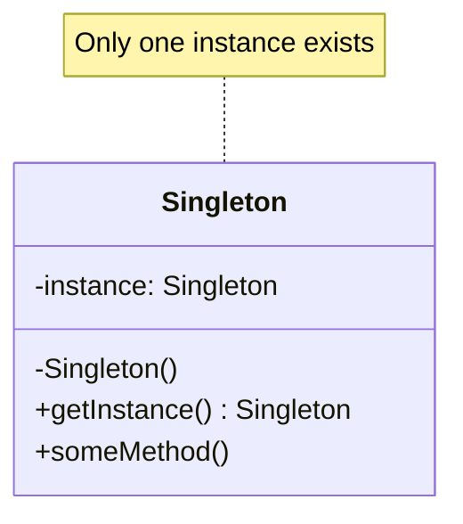
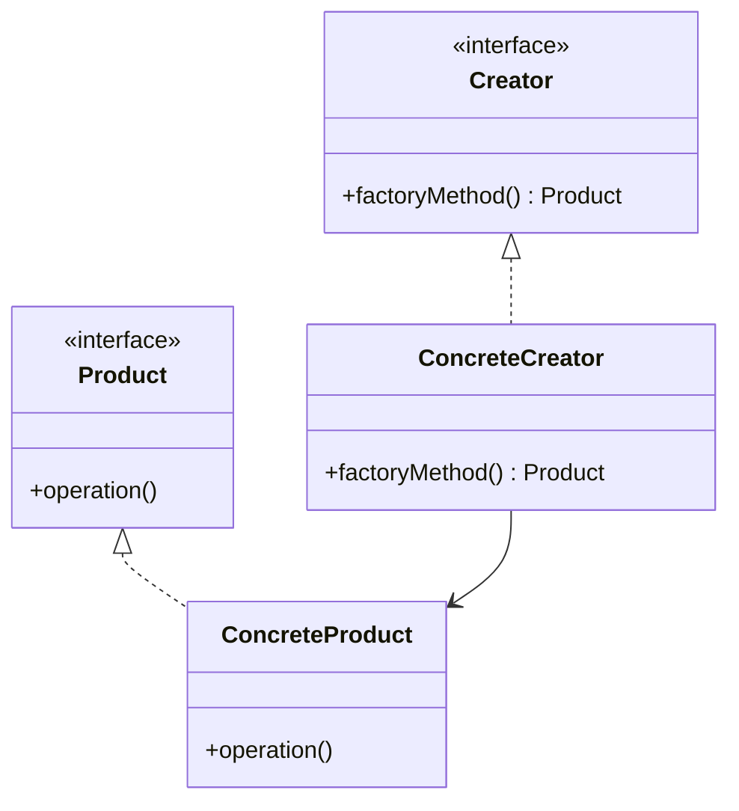
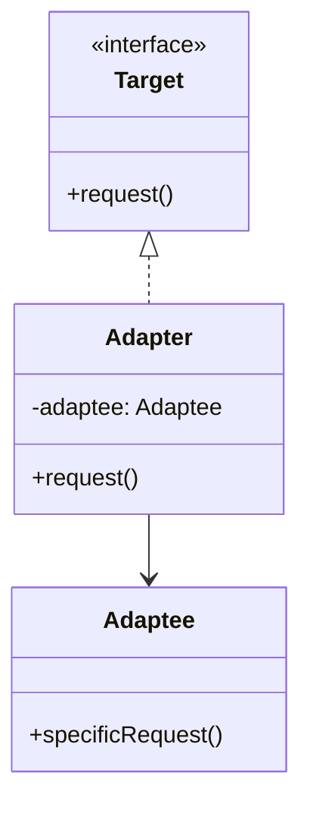
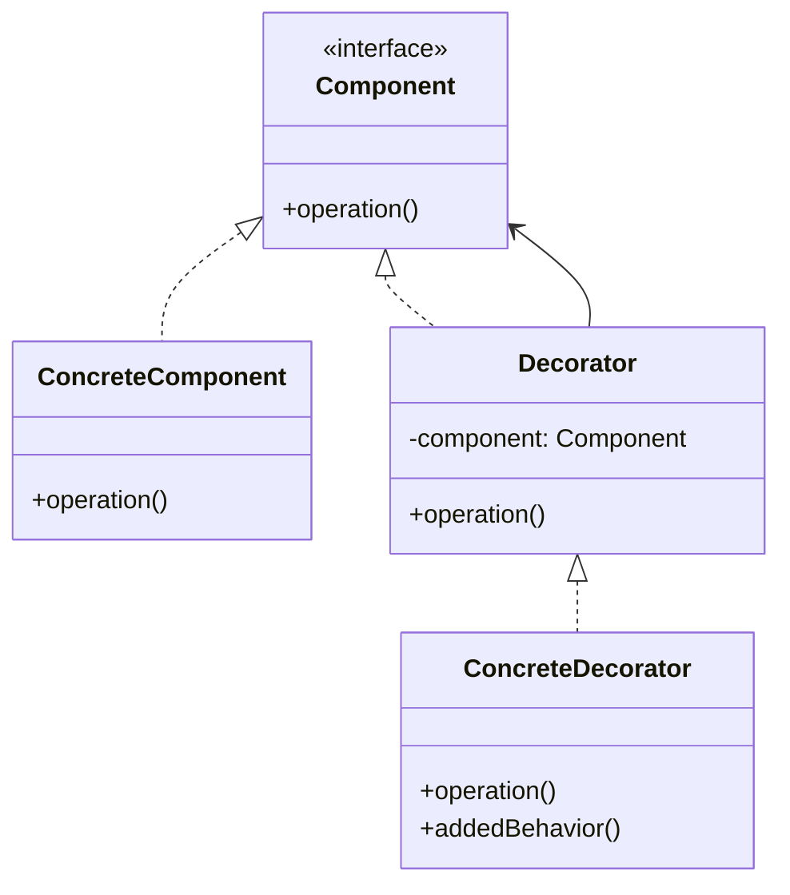
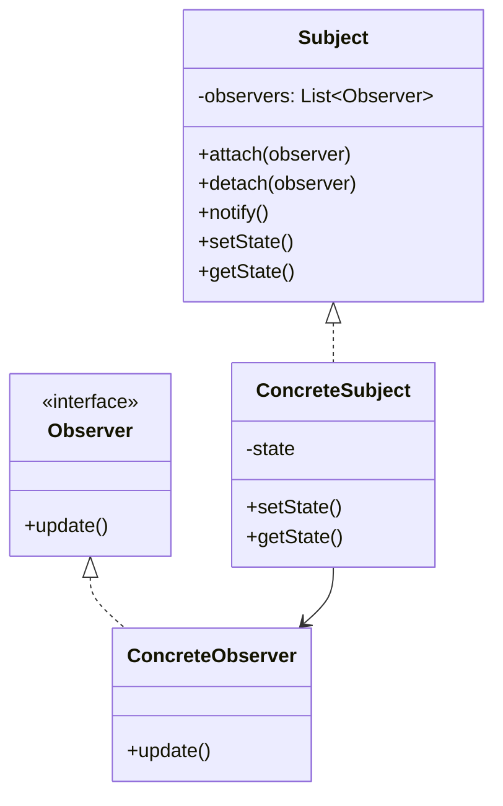
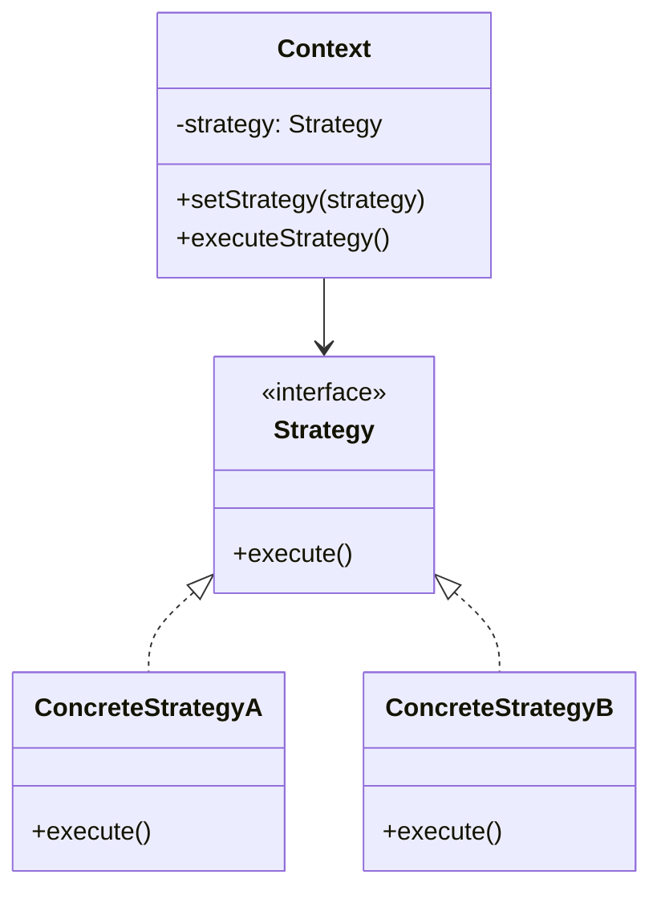
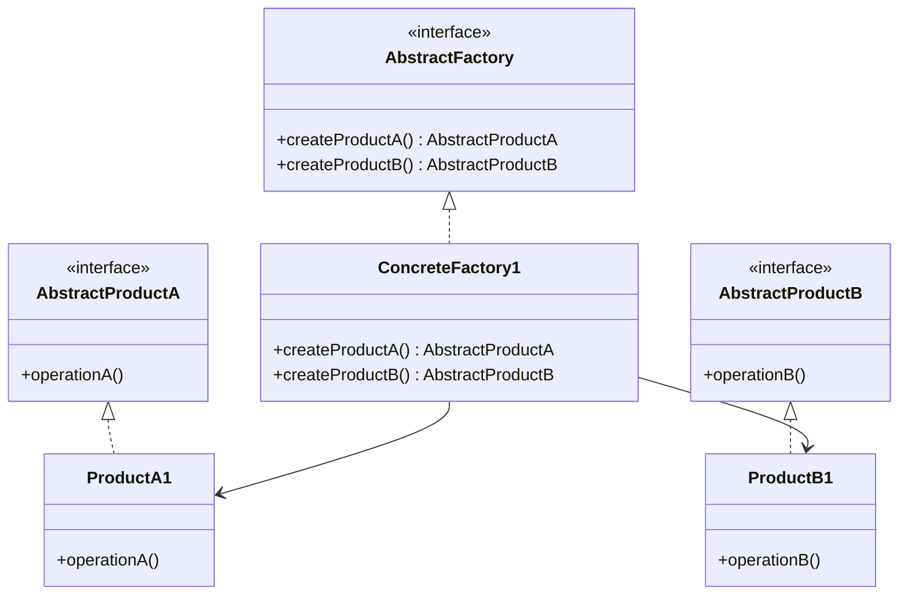

# DesignPattern 

以下是常见的DesignPattern及其对应的 Mermaid Graph表示，以及对这些DesignPattern的分Class和说明。由于DesignPattern较多，我将按照经典的 **GoF（Gang of Four）DesignPattern** 分Class（Create型、结构型、行为型），并为每种Pattern提供简要说明和 Mermaid Graph。限于篇幅，我会挑选几种代表性Pattern进行展示，并提供生成所有Pattern的指导。如果需要全部Pattern的详细Graph示，请进一步说明。

---

### DesignPattern分Class
根据 GoF 的分Class，DesignPattern分为三Class：
1. **Create型Pattern**（Creational Patterns）：ProcessObject的Create机制，OptimizationObjectCreate方式。
    - 常见Pattern：单例Pattern、工厂MethodsPattern、Abstract工厂Pattern、建造者Pattern、原型Pattern。
2. **结构型Pattern**（Structural Patterns）：ProcessClass或Object的组合，形成更大的结构。
    - 常见Pattern：适配器Pattern、桥接Pattern、组合Pattern、装饰者Pattern、门面Pattern、享元Pattern、代理Pattern。
3. **行为型Pattern**（Behavioral Patterns）：关注Object之间的通信和职责分配。
    - 常见Pattern：观察者Pattern、策略Pattern、命令Pattern、Iteration器Pattern、模板MethodsPattern、中介者Pattern、备忘录Pattern、StatePattern、访问者Pattern、责任链Pattern、Interpret器Pattern。

---

### 1. Create型Pattern

#### 单例Pattern（Singleton Pattern）
**说明**：确保一个Class只有一个实例，并提供全局访问点。常用于资源管理（如数据Library连接池）。
**适用场景**：Logging记录器、Configure管理器等需要单一实例的场景。

**Mermaid Graph**：


**Interpret**：
- `Singleton` Class有一个私有静态实例 `instance` 和私有构造Function。
- `getInstance()` Methods控制实例的Create和访问，确保全局唯一性。

---

#### 工厂MethodsPattern（Factory Method Pattern）
**说明**：Definition一个CreateObject的Interface，让子Class决定实例化哪个Class。解耦Object的Create和使用。
**适用场景**：需要根据ConditionCreate不同Class型的Object，如 UI 组件工厂。

**Mermaid Graph**：


**Interpret**：
- `Creator` Definition工厂MethodsInterface，`ConcreteCreator` ImplementationConcreteCreate逻辑。
- `Product` 是产品Interface，`ConcreteProduct` 是Concrete产品。

---

### 2. 结构型Pattern

#### 适配器Pattern（Adapter Pattern）
**说明**：将一个Class的Interface转换为客户端期望的另一个Interface，解决Interface不兼容问题。
**适用场景**：整合遗留系统或第三方Library。

**Mermaid Graph**：


**Interpret**：
- `Target`

**Interpret**：
- `3Adaptee`

**Interpret**：
- `4Adapter`

**Interpret**：
- `5Adaptee`

**Interpret**：
- `6Target` Interface。

---

#### 装饰者Pattern（Decorator Pattern）
**说明**：动态地为Object添加职责，扩展功能而不修改原有代码。
**适用场景**：需要Flexible扩展Object功能，如流Process或 UI 组件装饰。

**Mermaid Graph**：


**Interpret**：
- `Component` Class有一个私有静态实例 `0ConcreteComponent` Class有一个私有静态实例 `1Decorator` Class有一个私有静态实例 `2Component` Class有一个私有静态实例 `3ConcreteDecorator` 添加新功能。

---

### 3. 行为型Pattern

#### 观察者Pattern（Observer Pattern）
**说明**：DefinitionObject间一对多的依赖关系，当一个ObjectState改变时，所有依赖Object自动Update。
**适用场景**：Event驱动系统、发布-订阅模型。

**Mermaid Graph**：


**Interpret**：
- `Subject` Class有一个私有静态实例 `7notify()` Class有一个私有静态实例 `8Observer` Class有一个私有静态实例 `9ConcreteObserver` ImplementationConcreteUpdate逻辑。

---

### DesignPattern分Class0
**说明**：Definition一系列Algorithm，Encapsulation并使其可互换，客户端可动态SelectionAlgorithm。
**适用场景**：需要根据上下文切换行为，如SortAlgorithmSelection。

**Mermaid Graph**：


**Interpret**：
- `Context` Class有一个私有静态实例 `2Strategy` 和私有构造Function。
- `4Strategy` 和私有构造Function。
- `5ConcreteStrategyA/B` ImplementationConcreteAlgorithm。

---

### DesignPattern分Class1
由于 GoF DesignPattern有 **结构型Pattern**8，逐一生成 Mermaid Graph和说明会非常冗长。以下是生成其余Pattern的建议：
1. **结构型Pattern**9：可以使用 Mermaid 支持的编辑器（如 Mermaid Live Editor）或 IDE 插件直接生成ClassGraph。
2. **行为型Pattern**0：
    - **行为型Pattern**1：关注ObjectCreate，Graph示通常包含Abstract工厂/产品和具体实现。
    - **行为型Pattern**2：关注组合关系，Graph示常包含Interface、适配/装饰Object和被操作Object。
    - **行为型Pattern**3：关注交互，Graph示常包含主体、Interface和多个ImplementationClass。
3. **行为型Pattern**4：编写脚本（如 Python）根据Pattern模板生成 Mermaid 代码。例如：
   ```python
   def generate_mermaid_class_diagram(pattern_name, classes, relationships):
       print(f"classDiagram")
       for cls in classes:
           print(f"    class {cls['name']} {{")
           for method in cls.get('methods', []):
               print(f"        {method}")
           print(f"    }}")
       for rel in relationships:
           print(f"    {rel}")
   ```

4. **行为型Pattern**5：
    - 《DesignPattern：可复用面向Object软件的基础》：详细描述 23 种Pattern。
    - 在线Tool：Mermaid Live Editor (https://mermaid.live/)。
    - X 平台Search：Search“DesignPattern UML”或“design patterns mermaid”获取社区分享的Graph示。

---

### DesignPattern分Class2
以上展示了 6 种代表性DesignPattern的 Mermaid Graph和说明，涵盖了Create型（单例、工厂Methods）、结构型（适配器、装饰者）和行为型（观察者、策略）。每种Pattern通过ClassGraph清晰表达了其结构和关系。如果需要特定Pattern的详细Graph示、代码Example，或全部 23 种Pattern的完整集合，请明确告知，我将进一步提供！

---

以下是 GoF（Gang of Four）23种DesignPattern的完整集合，按照**行为型Pattern**1、**行为型Pattern**2和**行为型Pattern**3分Class，每种Pattern包括简要说明和对应的 **行为型Pattern**9。由于篇幅限制，我将为每种Pattern提供简洁的描述和 Mermaid Graph，重点突出其核心结构和关系。如果需要某Pattern的详细代码Example或更深入的Interpret，请进一步说明。

当前日期是 2025 年 5 月 7 日，Mermaid Syntax基于最新Standard生成，可在支持 Mermaid 的编辑器（如 Mermaid Live Editor 或 VS Code）中直接渲染。

---

### DesignPattern分Class3
Create型Pattern关注Object的Create机制，OptimizationObject的实例化过程。

### 1.1 单例Pattern（Singleton Pattern）
**说明**：确保Class只有一个实例，并提供全局访问点。  
**适用场景**：Logging记录、Configure管理。  
**Mermaid Graph**：


---

### 1.2 工厂MethodsPattern（Factory Method Pattern）
**说明**：DefinitionCreateObject的Interface，由子Class决定实例化哪个Class。  
**适用场景**：需要根据ConditionCreate不同Object，如 UI 组件。  
**Mermaid Graph**：


---

### 1.3 Abstract工厂Pattern（Abstract Factory Pattern）
**说明**：提供一个Interface，用于Create一系列相关或依赖Object的家族。  
**适用场景**：跨平台 UI 组件Create。  
**Mermaid Graph**：


---

### 1.4 建造者模式（Builder Pattern）
**说明**：将复杂Object的构建与其表示分离，允许分步构造。  
**适用场景**：构建复杂Object，如文档生成器。  
**Mermaid Graph**：
```mermaid
classDiagram
    class Director {
        -builder: Builder
        +construct()
    }
    class Builder {
        <<interface>>
        +buildPartA()
        +buildPartB()
        +getResult() Product
    }
    class ConcreteBuilder {
        +buildPartA()
        +buildPartB()
        +getResult() Product
    }
    class Product {
        -partA
        -partB
    }
    Director --> Builder
    Builder <|.. ConcreteBuilder
    ConcreteBuilder --> Product
```mermaid
classDiagram
    class Creator {
        <<interface>>
        +factoryMethod() Product
    }
    class ConcreteCreator {
        +factoryMethod() Product
    }
    class Product {
        <<interface>>
        +operation()
    }
    class ConcreteProduct {
        +operation()
    }
    Creator <|.. ConcreteCreator
    Product <|.. ConcreteProduct
    ConcreteCreator --> ConcreteProduct
```0mermaid
classDiagram
    class Prototype {
        <<interface>>
        +clone() Prototype
    }
    class ConcretePrototype {
        -state
        +clone() Prototype
    }
    Prototype <|.. ConcretePrototype
```

---

### DesignPattern分Class8
结构型Pattern关注Class和Object的组合，形成更大的结构。

### 2.1 适配器Pattern（Adapter Pattern）
**说明**：将一个Class的Interface转换为客户端期望的Interface。  
**适用场景**：整合遗留系统或第三方Library。  
**Mermaid Graph**：


---

### 2.2 桥接Pattern（Bridge Pattern）
**说明**：将Abstract与Implementation分离，使两者独立变化。  
**适用场景**：需要独立扩展Abstract和Implementation，如Graph形渲染。  
**Mermaid Graph**：
```mermaid
classDiagram
    class Abstraction {
        -implementor: Implementor
        +operation()
    }
    class RefinedAbstraction {
        +operation()
    }
    class Implementor {
        <<interface>>
        +operationImpl()
    }
    class ConcreteImplementor {
        +operationImpl()
    }
    Abstraction <|.. RefinedAbstraction
    Implementor <|.. ConcreteImplementor
    Abstraction --> Implementor
```mermaid
classDiagram
    class Creator {
        <<interface>>
        +factoryMethod() Product
    }
    class ConcreteCreator {
        +factoryMethod() Product
    }
    class Product {
        <<interface>>
        +operation()
    }
    class ConcreteProduct {
        +operation()
    }
    Creator <|.. ConcreteCreator
    Product <|.. ConcreteProduct
    ConcreteCreator --> ConcreteProduct
```3mermaid
classDiagram
    class Component {
        <<interface>>
        +operation()
        +add(child: Component)
        +remove(child: Component)
    }
    class Leaf {
        +operation()
    }
    class Composite {
        -children: List~Component~
        +operation()
        +add(child: Component)
        +remove(child: Component)
    }
    Component <|.. Leaf
    Component <|.. Composite
    Composite --> Component
```

---

### 2.4 装饰者Pattern（Decorator Pattern）
**说明**：动态为Object添加职责，扩展功能。  
**适用场景**：流Process、UI 组件装饰。  
**Mermaid Graph**：


---

### 2/产品和具体实现。2 门面Pattern（Facade Pattern）
**说明**：为Complex子系统提供简化的Interface。  
**适用场景**：简化Library或Framework的使用。  
**Mermaid Graph**：
```mermaid
classDiagram
    class Facade {
        +simplifiedOperation()
    }
    class SubsystemA {
        +operationA()
    }
    class SubsystemB {
        +operationB()
    }
    Facade --> SubsystemA
    Facade --> SubsystemB
```mermaid
classDiagram
    class Creator {
        <<interface>>
        +factoryMethod() Product
    }
    class ConcreteCreator {
        +factoryMethod() Product
    }
    class Product {
        <<interface>>
        +operation()
    }
    class ConcreteProduct {
        +operation()
    }
    Creator <|.. ConcreteCreator
    Product <|.. ConcreteProduct
    ConcreteCreator --> ConcreteProduct
```6mermaid
classDiagram
    class Flyweight {
        <<interface>>
        +operation(extrinsicState)
    }
    class ConcreteFlyweight {
        -intrinsicState
        +operation(extrinsicState)
    }
    class FlyweightFactory {
        -flyweights: Map~String, Flyweight~
        +getFlyweight(key) Flyweight
    }
    Flyweight <|.. ConcreteFlyweight
    FlyweightFactory --> Flyweight
```mermaid
classDiagram
    class Creator {
        <<interface>>
        +factoryMethod() Product
    }
    class ConcreteCreator {
        +factoryMethod() Product
    }
    class Product {
        <<interface>>
        +operation()
    }
    class ConcreteProduct {
        +operation()
    }
    Creator <|.. ConcreteCreator
    Product <|.. ConcreteProduct
    ConcreteCreator --> ConcreteProduct
```7mermaid
classDiagram
    class Subject {
        <<interface>>
        +request()
    }
    class RealSubject {
        +request()
    }
    class Proxy {
        -realSubject: RealSubject
        +request()
    }
    Subject <|.. RealSubject
    Subject <|.. Proxy
    Proxy --> RealSubject
```

---

### 1. Create型Pattern3
行为型Pattern关注Object间的通信和职责分配。

### 3.1 观察者Pattern（Observer Pattern）
**说明**：Definition一对多依赖，State变化时通知所有观察者。  
**适用场景**：Event驱动系统。  
**Mermaid Graph**：


---

### 3.2 策略Pattern（Strategy Pattern）
**说明**：Encapsulation可互换的Algorithm，动态Selection行为。  
**适用场景**：SortAlgorithmSelection。  
**Mermaid Graph**：


---

### 3.3 命令Pattern（Command Pattern）
**说明**：将请求Encapsulation为Object，支持撤销和Queue操作。  
**适用场景**：操作Logging、Transaction管理。  
**Mermaid Graph**：
```mermaid
classDiagram
    class Command {
        <<interface>>
        +execute()
    }
    class ConcreteCommand {
        -receiver: Receiver
        +execute()
    }
    class Receiver {
        +action()
    }
    class Invoker {
        -command: Command
        +setCommand(command)
        +executeCommand()
    }
    Command <|.. ConcreteCommand
    Invoker --> Command
    ConcreteCommand --> Receiver
```mermaid
classDiagram
    class Target {
        <<interface>>
        +request()
    }
    class Adaptee {
        +specificRequest()
    }
    class Adapter {
        -adaptee: Adaptee
        +request()
    }
    Target <|.. Adapter
    Adapter --> Adaptee
```1mermaid
classDiagram
    class Iterator {
        <<interface>>
        +hasNext()
        +next()
    }
    class Aggregate {
        <<interface>>
        +createIterator() Iterator
    }
    class ConcreteIterator {
        -collection
        +hasNext()
        +next()
    }
    class ConcreteAggregate {
        -items
        +createIterator() Iterator
    }
    Iterator <|.. ConcreteIterator
    Aggregate <|.. ConcreteAggregate
    ConcreteAggregate --> ConcreteIterator
```mermaid
classDiagram
    class Target {
        <<interface>>
        +request()
    }
    class Adaptee {
        +specificRequest()
    }
    class Adapter {
        -adaptee: Adaptee
        +request()
    }
    Target <|.. Adapter
    Adapter --> Adaptee
```2mermaid
classDiagram
    class AbstractClass {
        +templateMethod()
        #primitiveOperation1()
        #primitiveOperation2()
    }
    class ConcreteClass {
        #primitiveOperation1()
        #primitiveOperation2()
    }
    AbstractClass <|.. ConcreteClass
```mermaid
classDiagram
    class Target {
        <<interface>>
        +request()
    }
    class Adaptee {
        +specificRequest()
    }
    class Adapter {
        -adaptee: Adaptee
        +request()
    }
    Target <|.. Adapter
    Adapter --> Adaptee
```3mermaid
classDiagram
    class Mediator {
        <<interface>>
        +send(message, colleague)
    }
    class Colleague {
        -mediator: Mediator
        +send(message)
        +receive(message)
    }
    class ConcreteMediator {
        -colleagues: List~Colleague~
        +send(message, colleague)
    }
    class ConcreteColleague {
        +send(message)
        +receive(message)
    }
    Mediator <|.. ConcreteMediator
    Colleague <|.. ConcreteColleague
    ConcreteMediator --> Colleague
    ConcreteColleague --> Mediator
```mermaid
classDiagram
    class Target {
        <<interface>>
        +request()
    }
    class Adaptee {
        +specificRequest()
    }
    class Adapter {
        -adaptee: Adaptee
        +request()
    }
    Target <|.. Adapter
    Adapter --> Adaptee
```4mermaid
classDiagram
    class Originator {
        -state
        +createMemento() Memento
        +restore(memento)
    }
    class Memento {
        -state
        +getState()
    }
    class Caretaker {
        -memento: Memento
    }
    Originator --> Memento
    Caretaker --> Memento
```mermaid
classDiagram
    class Target {
        <<interface>>
        +request()
    }
    class Adaptee {
        +specificRequest()
    }
    class Adapter {
        -adaptee: Adaptee
        +request()
    }
    Target <|.. Adapter
    Adapter --> Adaptee
```5mermaid
classDiagram
    class Context {
        -state: State
        +setState(state)
        +request()
    }
    class State {
        <<interface>>
        +handle()
    }
    class ConcreteStateA {
        +handle()
    }
    class ConcreteStateB {
        +handle()
    }
    State <|.. ConcreteStateA
    State <|.. ConcreteStateB
    Context --> State
```mermaid
classDiagram
    class Target {
        <<interface>>
        +request()
    }
    class Adaptee {
        +specificRequest()
    }
    class Adapter {
        -adaptee: Adaptee
        +request()
    }
    Target <|.. Adapter
    Adapter --> Adaptee
```6mermaid
classDiagram
    class Visitor {
        <<interface>>
        +visitElementA(elementA)
        +visitElementB(elementB)
    }
    class Element {
        <<interface>>
        +accept(visitor)
    }
    class ConcreteVisitor {
        +visitElementA(elementA)
        +visitElementB(elementB)
    }
    class ConcreteElementA {
        +accept(visitor)
    }
    class ConcreteElementB {
        +accept(visitor)
    }
    Visitor <|.. ConcreteVisitor
    Element <|.. ConcreteElementA
    Element <|.. ConcreteElementB
    ConcreteElementA --> Visitor
    ConcreteElementB --> Visitor
```mermaid
classDiagram
    class Target {
        <<interface>>
        +request()
    }
    class Adaptee {
        +specificRequest()
    }
    class Adapter {
        -adaptee: Adaptee
        +request()
    }
    Target <|.. Adapter
    Adapter --> Adaptee
```7mermaid
classDiagram
    class Handler {
        <<interface>>
        -successor: Handler
        +setSuccessor(handler)
        +handleRequest()
    }
    class ConcreteHandlerA {
        +handleRequest()
    }
    class ConcreteHandlerB {
        +handleRequest()
    }
    Handler <|.. ConcreteHandlerA
    Handler <|.. ConcreteHandlerB
    ConcreteHandlerA --> Handler
    ConcreteHandlerB --> Handler
```mermaid
classDiagram
    class Target {
        <<interface>>
        +request()
    }
    class Adaptee {
        +specificRequest()
    }
    class Adapter {
        -adaptee: Adaptee
        +request()
    }
    Target <|.. Adapter
    Adapter --> Adaptee
```8mermaid
classDiagram
    class AbstractExpression {
        <<interface>>
        +interpret(context)
    }
    class TerminalExpression {
        +interpret(context)
    }
    class NonTerminalExpression {
        -expression1: AbstractExpression
        -expression2: AbstractExpression
        +interpret(context)
    }
    AbstractExpression <|.. TerminalExpression
    AbstractExpression <|.. NonTerminalExpression
    NonTerminalExpression --> AbstractExpression
```mermaid
classDiagram
    class Target {
        <<interface>>
        +request()
    }
    class Adaptee {
        +specificRequest()
    }
    class Adapter {
        -adaptee: Adaptee
        +request()
    }
    Target <|.. Adapter
    Adapter --> Adaptee
```9mermaid
graph TD
    A[Object Creation<br>Singleton<br>Factory Method<br>Abstract Factory<br>Builder<br>Prototype]
    A --> B
    A:::group --> NA[Intent: Optimize object creation.<br>Common: Encapsulate creation.<br>Diff: Singleton: single instance; Factory Method: single product; Abstract Factory: product families; Builder: step-by-step; Prototype: cloning.]

    B[Interface Adaptation<br>Adapter<br>Decorator<br>Proxy]
    B --> C
    B:::group --> NB[Intent: Enhance functionality.<br>Common: Use composition.<br>Diff: Adapter: convert interface; Decorator: add duties; Proxy: control access.]

    C[Structural Composition<br>Composite<br>Bridge<br>Facade]
    C --> D
    C:::group --> NC[Intent: Organize structure.<br>Common: Simplify complexity.<br>Diff: Composite: tree; Bridge: decouple abstraction; Facade: simplify interface.]

    D[Behavior Encapsulation<br>Strategy<br>State<br>Template Method]
    D --> E
    D:::group --> ND[Intent: Encapsulate behavior.<br>Common: Abstract behavior.<br>Diff: Strategy: algorithm choice; State: behavior switch; Template: inherited skeleton.]

    E[Object Communication<br>Observer<br>Mediator<br>Chain of Resp.<br>Command]
    E --> F
    E:::group --> NE[Intent: Manage communication.<br>Common: Decouple interaction.<br>Diff: Observer: broadcast; Mediator: coordinate; Chain: pass request; Command: encapsulate.]

    F[Traversal & Operation<br>Iterator<br>Visitor]
    F --> G
    F:::group --> NF[Intent: Separate traversal/装饰Object和被操作Object。9 Decouple structure.<br>Diff: Iterator: traversal; Visitor: operation extension.]

    G[State Management<br>Memento<br>Prototype]
    G --> H
    G:::group --> NG[Intent: Manage state.<br>Common: Handle state.<br>Diff: Memento: restore; Prototype: clone.]

    H[Resource Optimization<br>Flyweight<br>Singleton]
    H --> I
    H:::group --> NH[Intent: Optimize resources.<br>Common: Enhance efficiency.<br>Diff: Flyweight: share objects; Singleton: single instance.]

    I[Language Interpretation<br>Interpreter]
    I:::group --> NI[Intent: Interpret language.<br>Common: Language parsing.<br>Diff: Standalone, may combine with Visitor.]

    classDef group fill:#f9f,stroke:#333,stroke-width:2px;
```