# 设计模式 

以下是常见的设计模式及其对应的 Mermaid 图表示，以及对这些设计模式的分类和说明。由于设计模式较多，我将按照经典的 **GoF（Gang of Four）设计模式** 分类（创建型、结构型、行为型），并为每种模式提供简要说明和 Mermaid 图。限于篇幅，我会挑选几种代表性模式进行展示，并提供生成所有模式的指导。如果需要全部模式的详细图示，请进一步说明。

---

### 设计模式分类
根据 GoF 的分类，设计模式分为三类：
1. **创建型模式**（Creational Patterns）：处理对象的创建机制，优化对象创建方式。
    - 常见模式：单例模式、工厂方法模式、抽象工厂模式、建造者模式、原型模式。
2. **结构型模式**（Structural Patterns）：处理类或对象的组合，形成更大的结构。
    - 常见模式：适配器模式、桥接模式、组合模式、装饰者模式、门面模式、享元模式、代理模式。
3. **行为型模式**（Behavioral Patterns）：关注对象之间的通信和职责分配。
    - 常见模式：观察者模式、策略模式、命令模式、迭代器模式、模板方法模式、中介者模式、备忘录模式、状态模式、访问者模式、责任链模式、解释器模式。

---

### 1. 创建型模式

#### 单例模式（Singleton Pattern）
**说明**：确保一个类只有一个实例，并提供全局访问点。常用于资源管理（如数据库连接池）。
**适用场景**：日志记录器、配置管理器等需要单一实例的场景。

**Mermaid 图**：
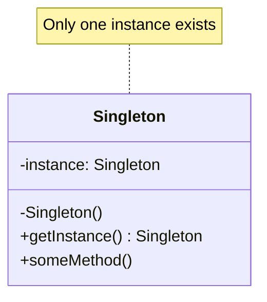

**解释**：
- `Singleton` 类有一个私有静态实例 `instance` 和私有构造函数。
- `getInstance()` 方法控制实例的创建和访问，确保全局唯一性。

---

#### 工厂方法模式（Factory Method Pattern）
**说明**：定义一个创建对象的接口，让子类决定实例化哪个类。解耦对象的创建和使用。
**适用场景**：需要根据条件创建不同类型的对象，如 UI 组件工厂。

**Mermaid 图**：
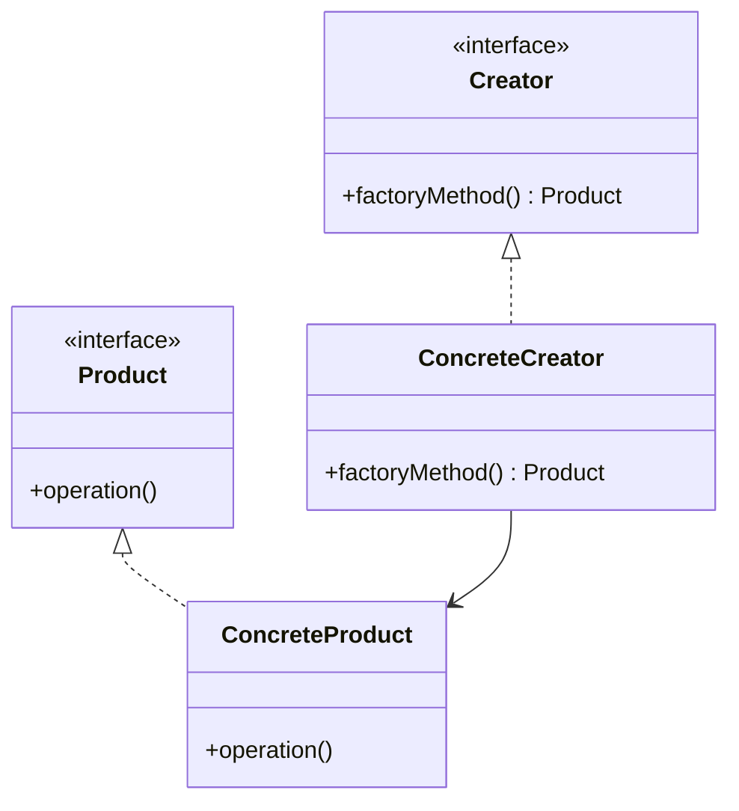

**解释**：
- `Creator` 定义工厂方法接口，`ConcreteCreator` 实现具体创建逻辑。
- `Product` 是产品接口，`ConcreteProduct` 是具体产品。

---

### 2. 结构型模式

#### 适配器模式（Adapter Pattern）
**说明**：将一个类的接口转换为客户端期望的另一个接口，解决接口不兼容问题。
**适用场景**：整合遗留系统或第三方库。

**Mermaid 图**：
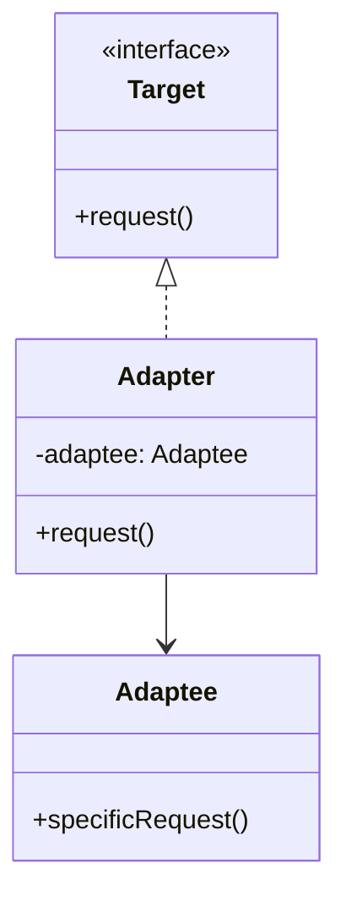

**解释**：
- `Target` 是客户端期望的接口。
- `Adaptee` 是需要适配的类，`Adapter` 通过组合 `Adaptee` 实现 `Target` 接口。

---

#### 装饰者模式（Decorator Pattern）
**说明**：动态地为对象添加职责，扩展功能而不修改原有代码。
**适用场景**：需要灵活扩展对象功能，如流处理或 UI 组件装饰。

**Mermaid 图**：
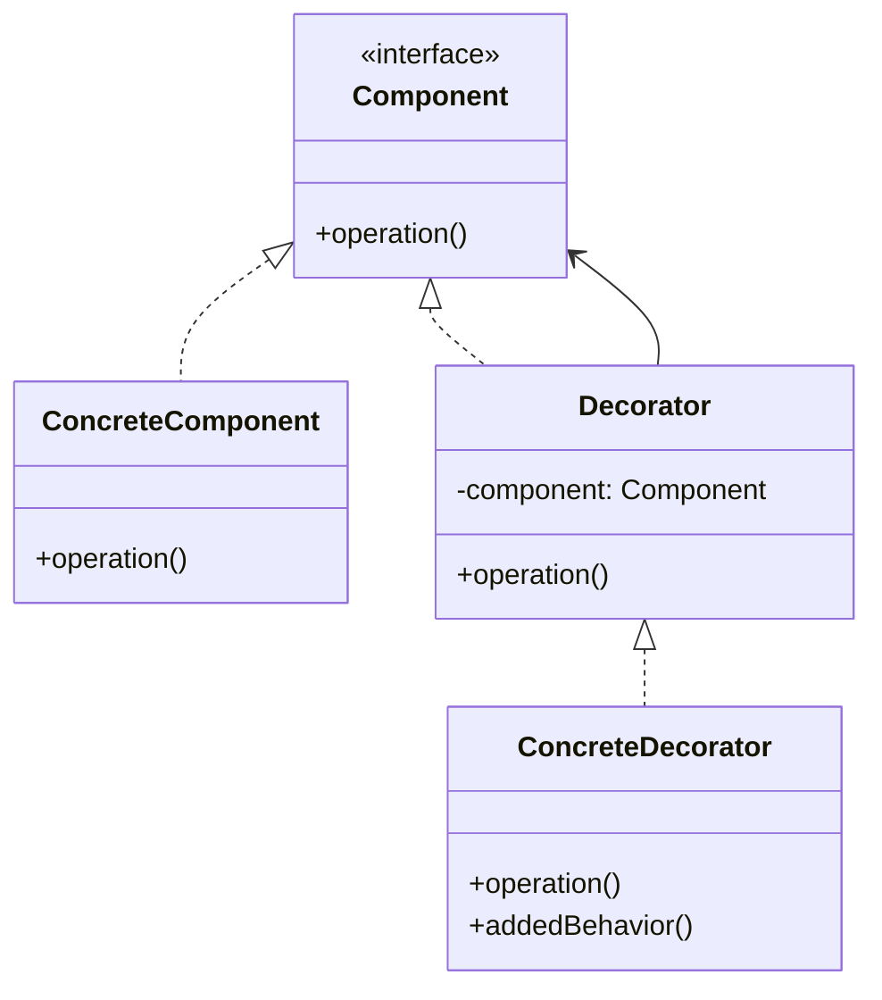

**解释**：
- `Component` 定义基础接口，`ConcreteComponent` 是具体实现。
- `Decorator` 持有 `Component` 引用，`ConcreteDecorator` 添加新功能。

---

### 3. 行为型模式

#### 观察者模式（Observer Pattern）
**说明**：定义对象间一对多的依赖关系，当一个对象状态改变时，所有依赖对象自动更新。
**适用场景**：事件驱动系统、发布-订阅模型。

**Mermaid 图**：
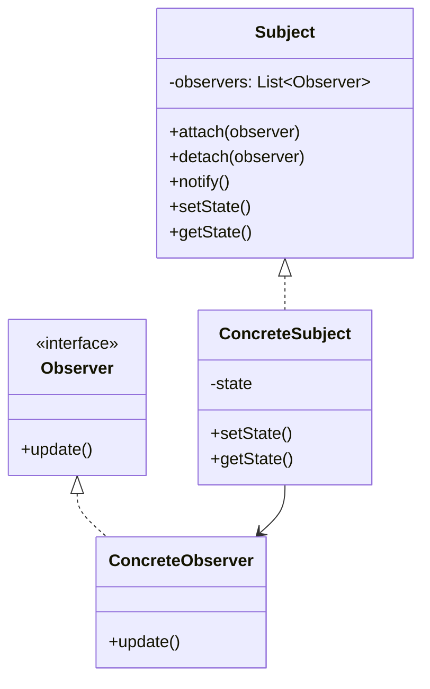

**解释**：
- `Subject` 维护观察者列表，状态变化时调用 `notify()`。
- `Observer` 定义更新接口，`ConcreteObserver` 实现具体更新逻辑。

---

#### 策略模式（Strategy Pattern）
**说明**：定义一系列算法，封装并使其可互换，客户端可动态选择算法。
**适用场景**：需要根据上下文切换行为，如排序算法选择。

**Mermaid 图**：
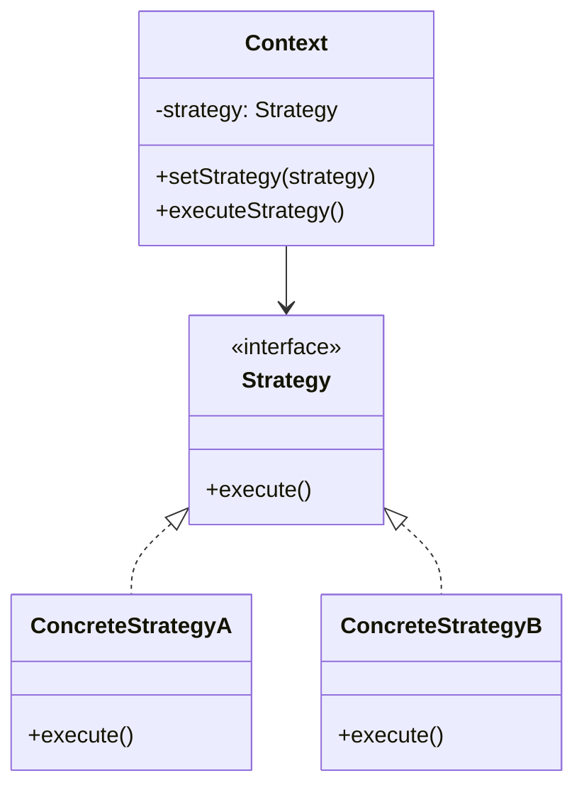

**解释**：
- `Context` 持有 `Strategy` 引用，动态设置和执行策略。
- `Strategy` 定义算法接口，`ConcreteStrategyA/B` 实现具体算法。

---

### 生成所有设计模式的指导
由于 GoF 设计模式有 **23 种**，逐一生成 Mermaid 图和说明会非常冗长。以下是生成其余模式的建议：
1. **工具使用**：可以使用 Mermaid 支持的编辑器（如 Mermaid Live Editor）或 IDE 插件直接生成类图。
2. **模板化**：
    - **创建型**：关注对象创建，图示通常包含抽象工厂/产品和具体实现。
    - **结构型**：关注组合关系，图示常包含接口、适配/装饰对象和被操作对象。
    - **行为型**：关注交互，图示常包含主体、接口和多个实现类。
3. **代码生成**：编写脚本（如 Python）根据模式模板生成 Mermaid 代码。例如：
   ```python
   def generate_mermaid_class_diagram(pattern_name, classes, relationships):
       print(f"classDiagram")
       for cls in classes:
           print(f"    class {cls['name']} {{")
           for method in cls.get('methods', []):
               print(f"        {method}")
           print(f"    }}")
       for rel in relationships:
           print(f"    {rel}")
   ```

4. **推荐资源**：
    - 《设计模式：可复用面向对象软件的基础》：详细描述 23 种模式。
    - 在线工具：Mermaid Live Editor (https://mermaid.live/)。
    - X 平台搜索：搜索“设计模式 UML”或“design patterns mermaid”获取社区分享的图示。

---

### 总结
以上展示了 6 种代表性设计模式的 Mermaid 图和说明，涵盖了创建型（单例、工厂方法）、结构型（适配器、装饰者）和行为型（观察者、策略）。每种模式通过类图清晰表达了其结构和关系。如果需要特定模式的详细图示、代码示例，或全部 23 种模式的完整集合，请明确告知，我将进一步提供！

---

以下是 GoF（Gang of Four）23种设计模式的完整集合，按照**创建型**、**结构型**和**行为型**分类，每种模式包括简要说明和对应的 **Mermaid 类图**。由于篇幅限制，我将为每种模式提供简洁的描述和 Mermaid 图，重点突出其核心结构和关系。如果需要某模式的详细代码示例或更深入的解释，请进一步说明。

当前日期是 2025 年 5 月 7 日，Mermaid 语法基于最新标准生成，可在支持 Mermaid 的编辑器（如 Mermaid Live Editor 或 VS Code）中直接渲染。

---

## 1. 创建型模式（Creational Patterns）
创建型模式关注对象的创建机制，优化对象的实例化过程。

### 1.1 单例模式（Singleton Pattern）
**说明**：确保类只有一个实例，并提供全局访问点。  
**适用场景**：日志记录、配置管理。  
**Mermaid 图**：


---

### 1.2 工厂方法模式（Factory Method Pattern）
**说明**：定义创建对象的接口，由子类决定实例化哪个类。  
**适用场景**：需要根据条件创建不同对象，如 UI 组件。  
**Mermaid 图**：


---

### 1.3 抽象工厂模式（Abstract Factory Pattern）
**说明**：提供一个接口，用于创建一系列相关或依赖对象的家族。  
**适用场景**：跨平台 UI 组件创建。  
**Mermaid 图**：
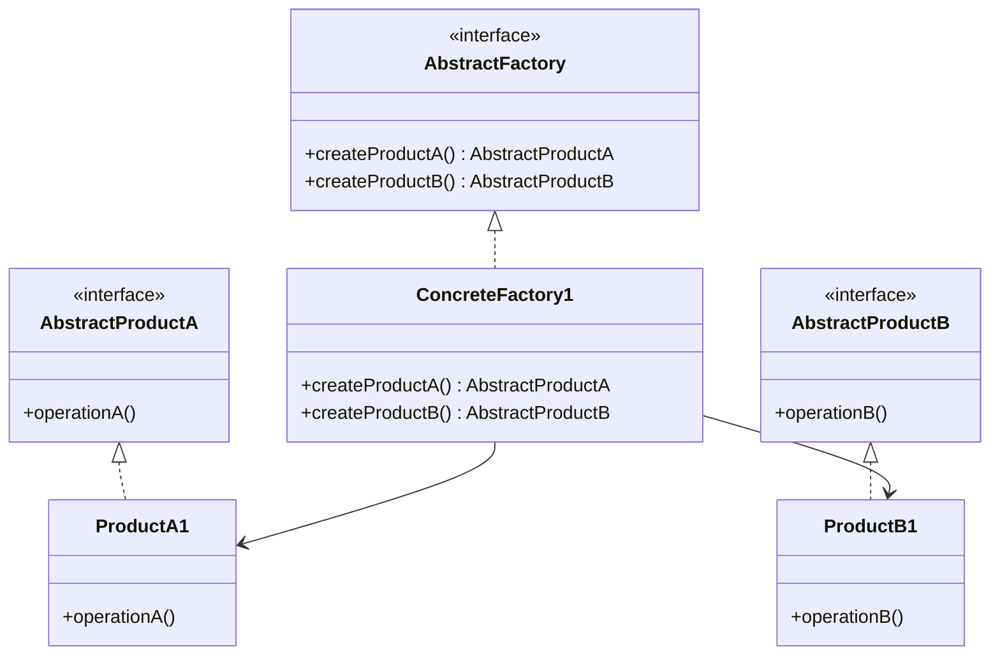

---

### 1.4 建造者模式（Builder Pattern）
**说明**：将复杂对象的构建与其表示分离，允许分步构造。  
**适用场景**：构建复杂对象，如文档生成器。  
**Mermaid 图**：
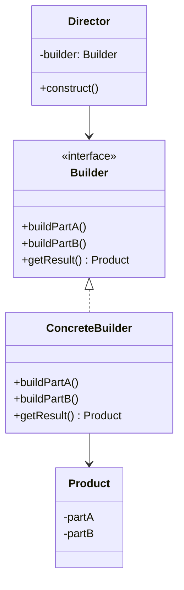

---

### 1.5 原型模式（Prototype Pattern）
**说明**：通过复制现有对象创建新对象，减少构造成本。  
**适用场景**：需要频繁创建相似对象，如游戏中的角色克隆。  
**Mermaid 图**：
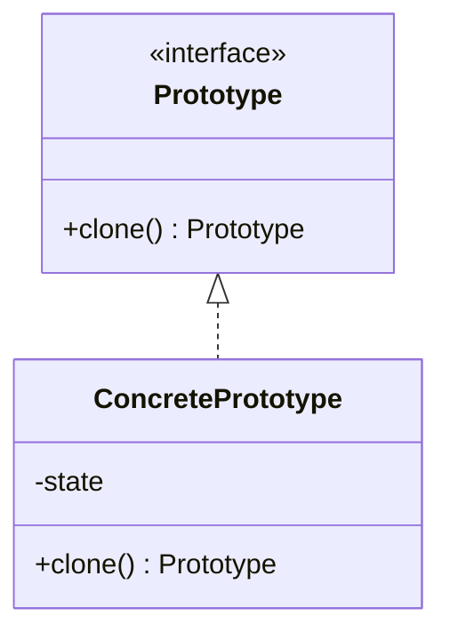

---

## 2. 结构型模式（Structural Patterns）
结构型模式关注类和对象的组合，形成更大的结构。

### 2.1 适配器模式（Adapter Pattern）
**说明**：将一个类的接口转换为客户端期望的接口。  
**适用场景**：整合遗留系统或第三方库。  
**Mermaid 图**：


---

### 2.2 桥接模式（Bridge Pattern）
**说明**：将抽象与实现分离，使两者独立变化。  
**适用场景**：需要独立扩展抽象和实现，如图形渲染。  
**Mermaid 图**：
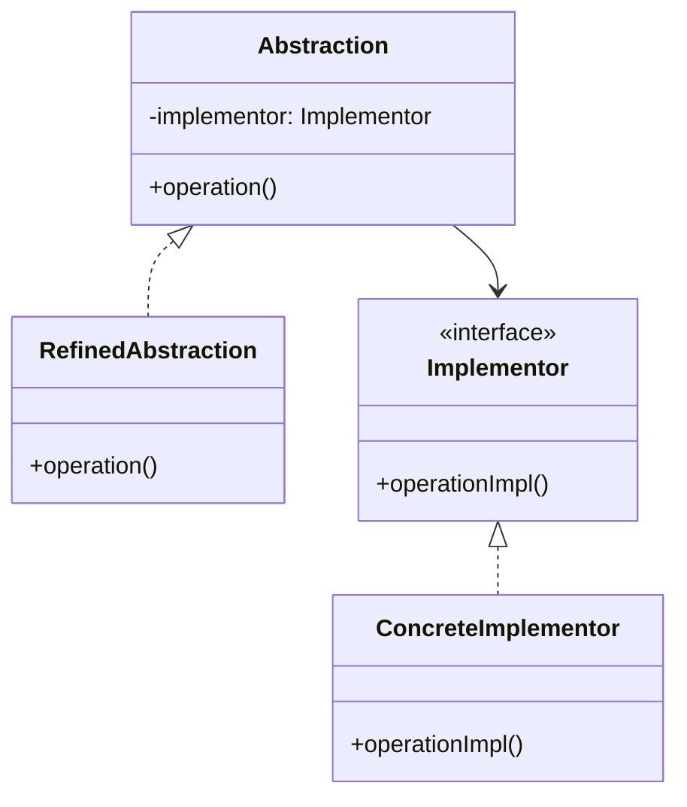

---

### 2.3 组合模式（Composite Pattern）
**说明**：将对象组合成树形结构，表示“部分-整体”关系。  
**适用场景**：文件系统、组织结构。  
**Mermaid 图**：
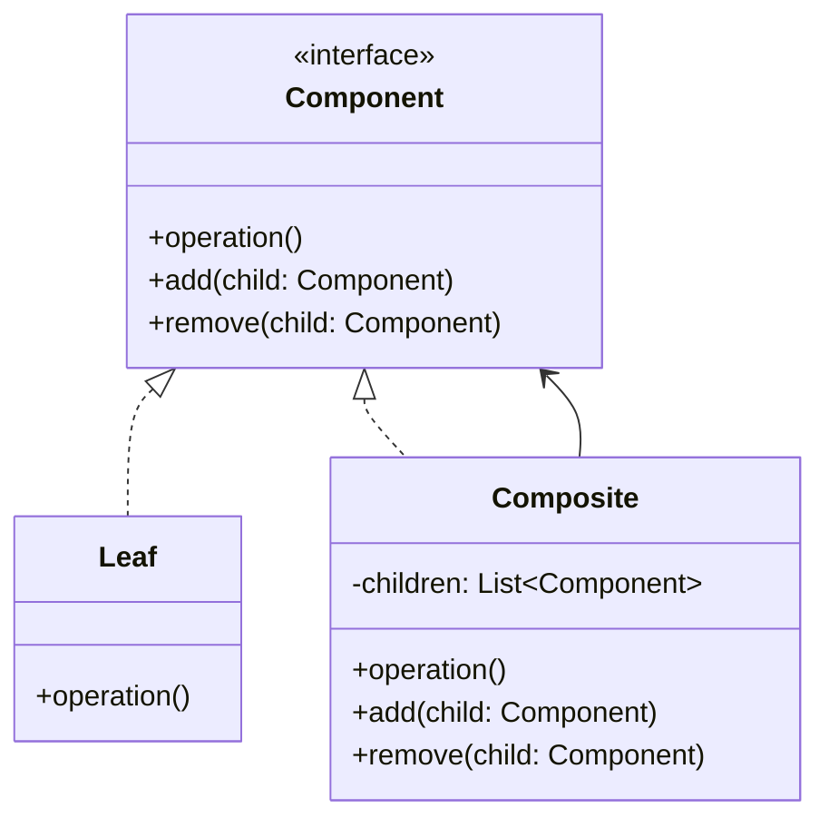

---

### 2.4 装饰者模式（Decorator Pattern）
**说明**：动态为对象添加职责，扩展功能。  
**适用场景**：流处理、UI 组件装饰。  
**Mermaid 图**：


---

### 2.5 门面模式（Facade Pattern）
**说明**：为复杂子系统提供简化的接口。  
**适用场景**：简化库或框架的使用。  
**Mermaid 图**：
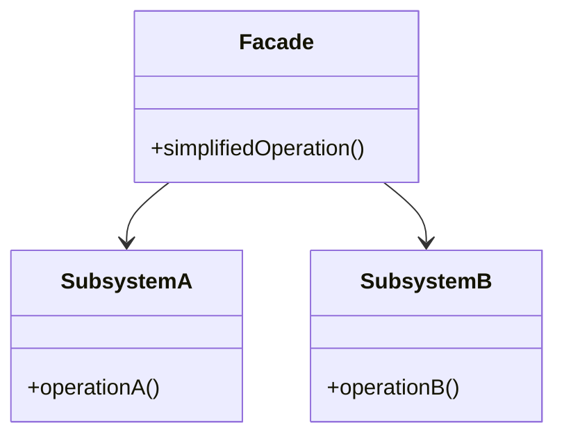

---

### 2.6 享元模式（Flyweight Pattern）
**说明**：共享细粒度对象，减少内存使用。  
**适用场景**：大量相似对象的场景，如文本编辑器中的字符。  
**Mermaid 图**：
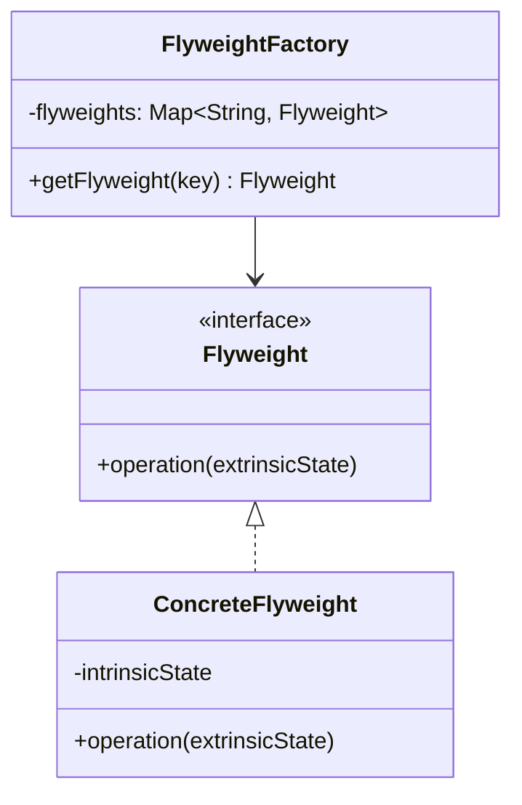

---

### 2.7 代理模式（Proxy Pattern）
**说明**：为其他对象提供代理，控制访问。  
**适用场景**：延迟加载、权限控制。  
**Mermaid 图**：
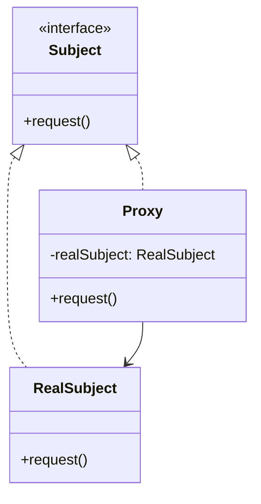

---

## 3. 行为型模式（Behavioral Patterns）
行为型模式关注对象间的通信和职责分配。

### 3.1 观察者模式（Observer Pattern）
**说明**：定义一对多依赖，状态变化时通知所有观察者。  
**适用场景**：事件驱动系统。  
**Mermaid 图**：


---

### 3.2 策略模式（Strategy Pattern）
**说明**：封装可互换的算法，动态选择行为。  
**适用场景**：排序算法选择。  
**Mermaid 图**：


---

### 3.3 命令模式（Command Pattern）
**说明**：将请求封装为对象，支持撤销和队列操作。  
**适用场景**：操作日志、事务管理。  
**Mermaid 图**：
```mermaid
classDiagram
    class Command {
        <<interface>>
        +execute()
    }
    class ConcreteCommand {
        -receiver: Receiver
        +execute()
    }
    class Receiver {
        +action()
    }
    class Invoker {
        -command: Command
        +setCommand(command)
        +executeCommand()
    }
    Command <|.. ConcreteCommand
    Invoker --> Command
    ConcreteCommand --> Receiver
```

---

### 3.4 迭代器模式（Iterator Pattern）
**说明**：提供遍历集合元素的方法，不暴露底层实现。  
**适用场景**：集合遍历。  
**Mermaid 图**：
```mermaid
classDiagram
    class Iterator {
        <<interface>>
        +hasNext()
        +next()
    }
    class Aggregate {
        <<interface>>
        +createIterator() Iterator
    }
    class ConcreteIterator {
        -collection
        +hasNext()
        +next()
    }
    class ConcreteAggregate {
        -items
        +createIterator() Iterator
    }
    Iterator <|.. ConcreteIterator
    Aggregate <|.. ConcreteAggregate
    ConcreteAggregate --> ConcreteIterator
```

---

### 3.5 模板方法模式（Template Method Pattern）
**说明**：定义算法骨架，子类实现具体步骤。  
**适用场景**：框架中的通用流程。  
**Mermaid 图**：
```mermaid
classDiagram
    class AbstractClass {
        +templateMethod()
        #primitiveOperation1()
        #primitiveOperation2()
    }
    class ConcreteClass {
        #primitiveOperation1()
        #primitiveOperation2()
    }
    AbstractClass <|.. ConcreteClass
```

---

### 3.6 中介者模式（Mediator Pattern）
**说明**：通过中介者对象协调多个对象间的交互。  
**适用场景**：聊天室、航空交通控制。  
**Mermaid 图**：
```mermaid
classDiagram
    class Mediator {
        <<interface>>
        +send(message, colleague)
    }
    class Colleague {
        -mediator: Mediator
        +send(message)
        +receive(message)
    }
    class ConcreteMediator {
        -colleagues: List~Colleague~
        +send(message, colleague)
    }
    class ConcreteColleague {
        +send(message)
        +receive(message)
    }
    Mediator <|.. ConcreteMediator
    Colleague <|.. ConcreteColleague
    ConcreteMediator --> Colleague
    ConcreteColleague --> Mediator
```

---

### 3.7 备忘录模式（Memento Pattern）
**说明**：保存对象状态以便恢复，不暴露内部实现。  
**适用场景**：撤销操作。  
**Mermaid 图**：
```mermaid
classDiagram
    class Originator {
        -state
        +createMemento() Memento
        +restore(memento)
    }
    class Memento {
        -state
        +getState()
    }
    class Caretaker {
        -memento: Memento
    }
    Originator --> Memento
    Caretaker --> Memento
```

---

### 3.8 状态模式（State Pattern）
**说明**：根据对象状态改变其行为。  
**适用场景**：状态机，如订单流程。  
**Mermaid 图**：
```mermaid
classDiagram
    class Context {
        -state: State
        +setState(state)
        +request()
    }
    class State {
        <<interface>>
        +handle()
    }
    class ConcreteStateA {
        +handle()
    }
    class ConcreteStateB {
        +handle()
    }
    State <|.. ConcreteStateA
    State <|.. ConcreteStateB
    Context --> State
```

---

### 3.9 访问者模式（Visitor Pattern）
**说明**：将操作与对象结构分离，允许添加新操作而不修改对象。  
**适用场景**：编译器中对 AST 的操作。  
**Mermaid 图**：
```mermaid
classDiagram
    class Visitor {
        <<interface>>
        +visitElementA(elementA)
        +visitElementB(elementB)
    }
    class Element {
        <<interface>>
        +accept(visitor)
    }
    class ConcreteVisitor {
        +visitElementA(elementA)
        +visitElementB(elementB)
    }
    class ConcreteElementA {
        +accept(visitor)
    }
    class ConcreteElementB {
        +accept(visitor)
    }
    Visitor <|.. ConcreteVisitor
    Element <|.. ConcreteElementA
    Element <|.. ConcreteElementB
    ConcreteElementA --> Visitor
    ConcreteElementB --> Visitor
```

---

### 3.10 责任链模式（Chain of Responsibility Pattern）
**说明**：将请求沿处理者链传递，直到被处理。  
**适用场景**：事件处理、审批流程。  
**Mermaid 图**：
```mermaid
classDiagram
    class Handler {
        <<interface>>
        -successor: Handler
        +setSuccessor(handler)
        +handleRequest()
    }
    class ConcreteHandlerA {
        +handleRequest()
    }
    class ConcreteHandlerB {
        +handleRequest()
    }
    Handler <|.. ConcreteHandlerA
    Handler <|.. ConcreteHandlerB
    ConcreteHandlerA --> Handler
    ConcreteHandlerB --> Handler
```

---

### 3.11 解释器模式（Interpreter Pattern）
**说明**：为语言定义文法，解释特定语句。  
**适用场景**：简单脚本语言、SQL 解析。  
**Mermaid 图**：
```mermaid
classDiagram
    class AbstractExpression {
        <<interface>>
        +interpret(context)
    }
    class TerminalExpression {
        +interpret(context)
    }
    class NonTerminalExpression {
        -expression1: AbstractExpression
        -expression2: AbstractExpression
        +interpret(context)
    }
    AbstractExpression <|.. TerminalExpression
    AbstractExpression <|.. NonTerminalExpression
    NonTerminalExpression --> AbstractExpression
```

---

## 总结
以上为 GoF 23 种设计模式的完整集合，每种模式包括：
- **简要说明**：描述模式的核心功能和适用场景。
- **Mermaid 类图**：以标准 UML 表示模式结构，兼容 Mermaid 渲染工具。

### 使用建议
1. **渲染图表**：复制 Mermaid 代码到 [Mermaid Live Editor](https://mermaid.live/) 或支持 Mermaid 的 IDE（如 VS Code）查看可视化效果。
2. **进一步需求**：
    - 如果需要某模式的详细代码示例（如 Java、Python），请指定模式和语言。
    - 如果需要更深入的解释或特定场景的应用案例，请告知。
3. **扩展资源**：
    - 《设计模式：可复用面向对象软件的基础》：经典参考书籍。
    - X 平台搜索“设计模式 UML”或“design patterns mermaid”获取社区分享的资源。

如果有其他需求（如生成特定模式的时序图、代码实现，或优化某图的细节），请随时告知！