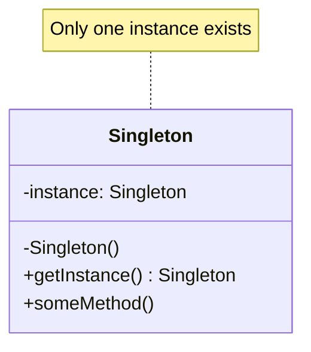
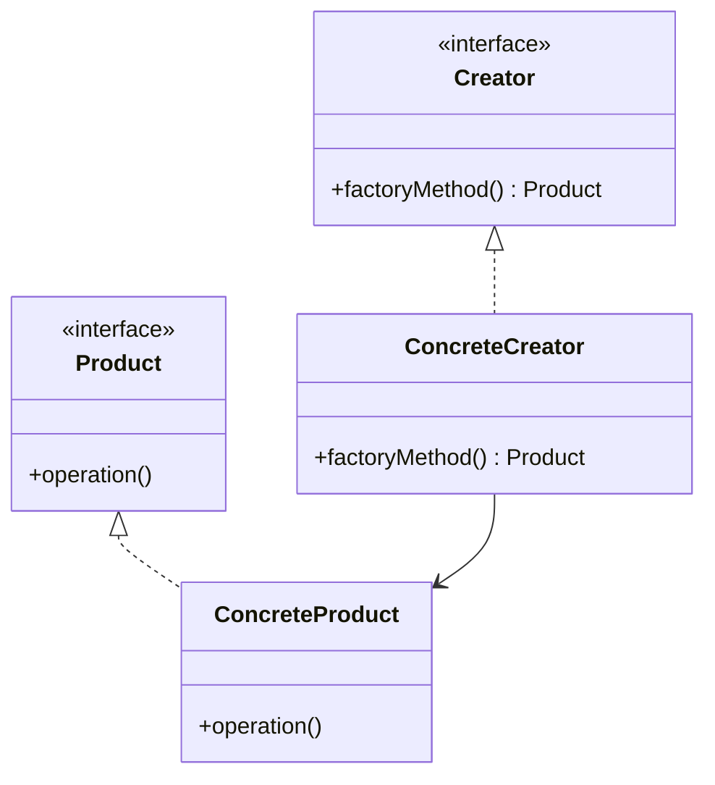
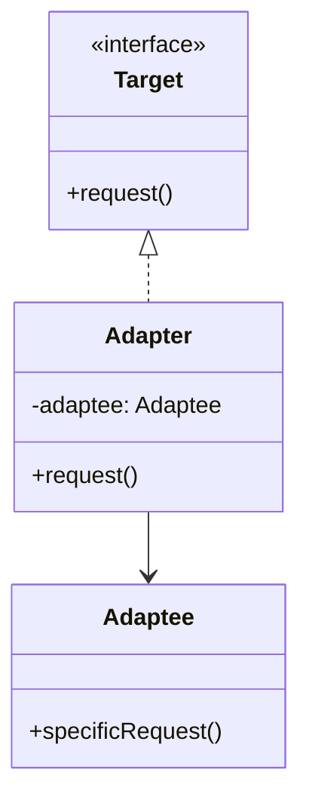
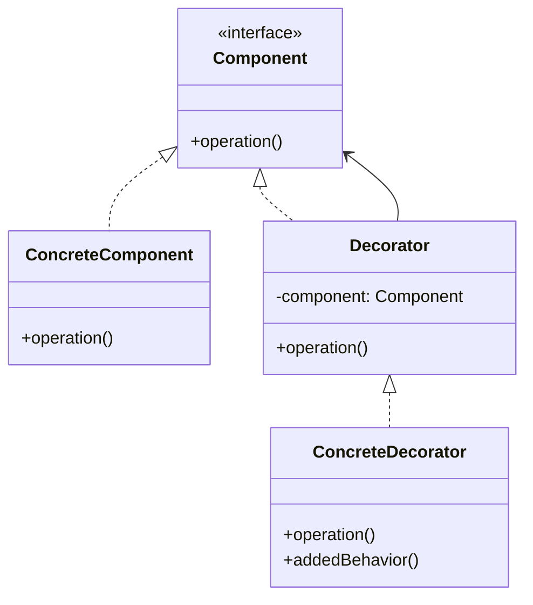
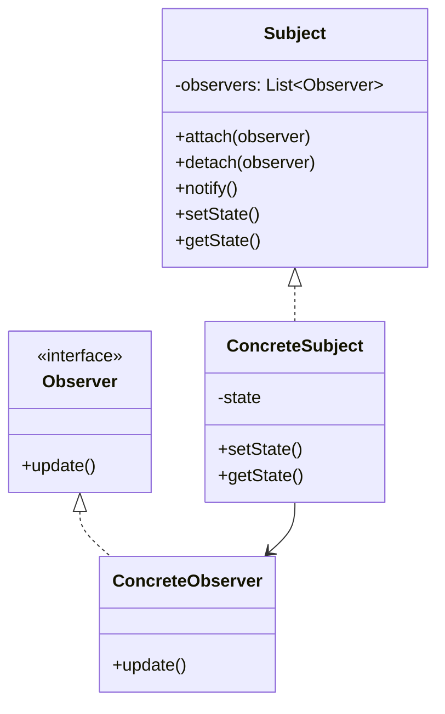
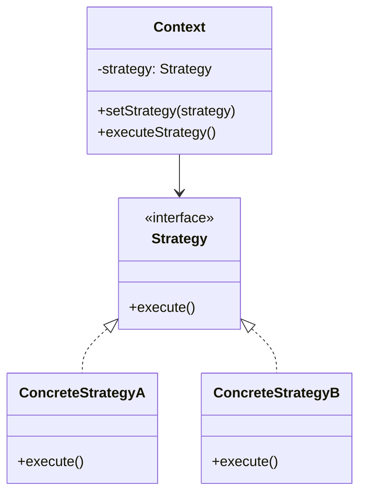
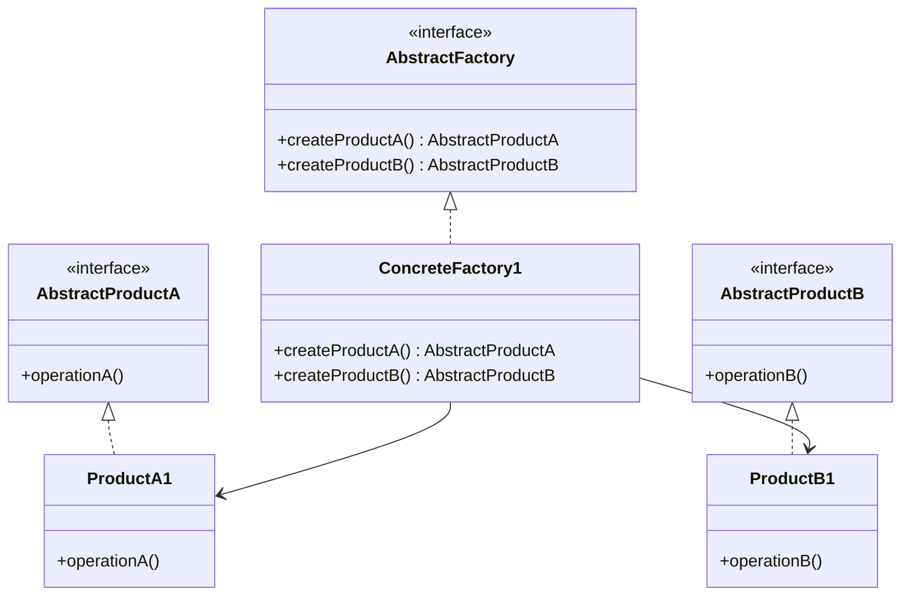

# DesignPattern 

Below are common DesignPatterns with their corresponding Mermaid Graph representations, along with classification and explanations of these DesignPatterns. Since there are many DesignPatterns, I will follow the classic **GoF (Gang of Four) DesignPattern** classification (Creational, Structural, Behavioral), and provide brief explanations and Mermaid Graphs for each pattern. Due to space limitations, I will select several representative patterns for demonstration and provide guidance for generating all patterns. If you need detailed graphs for all patterns, please specify.

---

### DesignPattern Classification
According to GoF classification, DesignPatterns are divided into three categories:
1. **Creational Patterns**: Handle object creation mechanisms, optimizing object creation methods.
    - Common Patterns: Singleton Pattern, Factory Method Pattern, Abstract Factory Pattern, Builder Pattern, Prototype Pattern.
2. **Structural Patterns**: Handle composition of classes or objects to form larger structures.
    - Common Patterns: Adapter Pattern, Bridge Pattern, Composite Pattern, Decorator Pattern, Facade Pattern, Flyweight Pattern, Proxy Pattern.
3. **Behavioral Patterns**: Focus on communication between objects and responsibility assignment.
    - Common Patterns: Observer Pattern, Strategy Pattern, Command Pattern, Iterator Pattern, Template Method Pattern, Mediator Pattern, Memento Pattern, State Pattern, Visitor Pattern, Chain of Responsibility Pattern, Interpreter Pattern.

---

### 1. Creational Patterns

#### Singleton Pattern (Singleton Pattern)
**Description**: Ensures a class has only one instance and provides a global access point. Commonly used for resource management (such as database connection pools).
**Applicable Scenarios**: Logging, configuration managers, and other scenarios requiring a single instance.

**Mermaid Graph**:


**Explanation**:
- The `Singleton` class has a private static instance `instance` and a private constructor.
- The `getInstance()` method controls the creation and access of the instance, ensuring global uniqueness.

---

#### Factory Method Pattern (Factory Method Pattern)
**Description**: Defines an interface for creating objects, allowing subclasses to decide which class to instantiate. Decouples object creation from usage.
**Applicable Scenarios**: When different types of objects need to be created based on conditions, such as UI component factories.

**Mermaid Graph**:


**Explanation**:
- `Creator` defines the factory method interface, `ConcreteCreator` implements specific creation logic.
- `Product` is the product interface, `ConcreteProduct` is the concrete product.

---

### 2. Structural Patterns

#### Adapter Pattern (Adapter Pattern)
**Description**: Converts the interface of one class into another interface that clients expect, solving interface incompatibility issues.
**Applicable Scenarios**: Integrating legacy systems or third-party libraries.

**Mermaid Graph**:


**Explanation**:
- `Target`

**Explanation**:
- `3Adaptee`

**Explanation**:
- `4Adapter`

**Explanation**:
- `5Adaptee`

**Explanation**:
- `6Target` interface.

---

#### Decorator Pattern (Decorator Pattern)
**Description**: Dynamically adds responsibilities to objects, extending functionality without modifying existing code.
**Applicable Scenarios**: When flexible extension of object functionality is needed, such as stream processing or UI component decoration.

**Mermaid Graph**:


**Explanation**:
- `Component` class has a private static instance `0ConcreteComponent` class has a private static instance `1Decorator` class has a private static instance `2Component` class has a private static instance `3ConcreteDecorator` adds new functionality.

---

### 3. Behavioral Patterns

#### Observer Pattern (Observer Pattern)
**Description**: Defines a one-to-many dependency relationship between objects, where all dependent objects are automatically updated when an object's state changes.
**Applicable Scenarios**: Event-driven systems, publish-subscribe models.

**Mermaid Graph**:


**Explanation**:
- `Subject` class has a private static instance `7notify()` class has a private static instance `8Observer` class has a private static instance `9ConcreteObserver` implements specific update logic.

---

### DesignPattern Classification0
**Description**: Defines a series of algorithms, encapsulates them and makes them interchangeable, allowing clients to dynamically select algorithms.
**Applicable Scenarios**: When behavior needs to be switched based on context, such as sorting algorithm selection.

**Mermaid Graph**:


**Explanation**:
- `Context` class has a private static instance `2Strategy` and private constructor.
- `4Strategy` and private constructor.
- `5ConcreteStrategyA/B` implement concrete algorithms.

---

### DesignPattern Classification1
Since GoF DesignPatterns have **Structural Patterns**9, generating Mermaid Graphs and explanations for each one individually would be very lengthy. Here are suggestions for generating the remaining patterns:
1. **Structural Patterns**9: You can use Mermaid-supported editors (such as Mermaid Live Editor) or IDE plugins to directly generate class diagrams.
2. **Behavioral Patterns**0:
    - **Behavioral Patterns**1: Focus on object creation, diagrams typically include abstract factories/products and concrete implementations.
    - **Behavioral Patterns**2: Focus on composition relationships, diagrams often include interfaces, adapter/decorator objects and objects being operated on.
    - **Behavioral Patterns**3: Focus on interaction, diagrams often include subjects, interfaces and multiple implementation classes.
3. **Behavioral Patterns**4: Write scripts (such as Python) to generate Mermaid code based on pattern templates. For example:
   ```python
   def generate_mermaid_class_diagram(pattern_name, classes, relationships):
       print(f"classDiagram")
       for cls in classes:
           print(f"    class {cls['name']} {{")
           for method in cls.get('methods', []):
               print(f"        {method}")
           print(f"    }}")
       for rel in relationships:
           print(f"    {rel}")
   ```

4. **Behavioral Patterns**5:
    - "Design Patterns: Elements of Reusable Object-Oriented Software": Detailed description of 23 patterns.
    - Online Tools: Mermaid Live Editor (https://mermaid.live/).
    - Platform Search: Search for "Design Pattern UML" or "design patterns mermaid" to get community-shared diagrams.

---

### DesignPattern Classification2
The above demonstrates Mermaid Graphs and explanations for 6 representative DesignPatterns, covering Creational (Singleton, Factory Method), Structural (Adapter, Decorator), and Behavioral (Observer, Strategy) patterns. Each pattern clearly expresses its structure and relationships through class diagrams. If you need detailed graphs for specific patterns, code examples, or a complete collection of all 23 patterns, please let me know and I will provide further information!

---

Below is the complete collection of GoF (Gang of Four) 23 DesignPatterns, classified according to **Behavioral Patterns**1, **Behavioral Patterns**2, and **Behavioral Patterns**3 categories. Each pattern includes a brief explanation and corresponding **Behavioral Patterns**9. Due to space limitations, I will provide concise descriptions and Mermaid Graphs for each pattern, focusing on highlighting their core structures and relationships. If you need detailed code examples or deeper explanations for any pattern, please specify.

The current date is May 7, 2025, and Mermaid Syntax is generated based on the latest standard, which can be directly rendered in editors that support Mermaid (such as Mermaid Live Editor or VS Code).

---

### DesignPattern Classification3
Creational Patterns focus on object creation mechanisms, optimizing the object instantiation process.

### 1.1 Singleton Pattern (Singleton Pattern)
**Description**: Ensures a class has only one instance and provides a global access point.  
**Applicable Scenarios**: Logging, configuration management.  
**Mermaid Graph**:


---

### 1.2 Factory Method Pattern (Factory Method Pattern)
**Description**: Defines an interface for creating objects, allowing subclasses to decide which class to instantiate.  
**Applicable Scenarios**: When different objects need to be created based on conditions, such as UI components.  
**Mermaid Graph**:


---

### 1.3 Abstract Factory Pattern (Abstract Factory Pattern)
**Description**: Provides an interface for creating families of related or dependent objects.  
**Applicable Scenarios**: Cross-platform UI component creation.  
**Mermaid Graph**:


---

### 1.4 Builder Pattern (Builder Pattern)
**Description**: Separates the construction of complex objects from their representation, allowing step-by-step construction.  
**Applicable Scenarios**: Building complex objects, such as document generators.  
**Mermaid Graph**:
```mermaid
classDiagram
    class Director {
        -builder: Builder
        +construct()
    }
    class Builder {
        <<interface>>
        +buildPartA()
        +buildPartB()
        +getResult() Product
    }
    class ConcreteBuilder {
        +buildPartA()
        +buildPartB()
        +getResult() Product
    }
    class Product {
        -partA
        -partB
    }
    Director --> Builder
    Builder <|.. ConcreteBuilder
    ConcreteBuilder --> Product
```mermaid
classDiagram
    class Creator {
        <<interface>>
        +factoryMethod() Product
    }
    class ConcreteCreator {
        +factoryMethod() Product
    }
    class Product {
        <<interface>>
        +operation()
    }
    class ConcreteProduct {
        +operation()
    }
    Creator <|.. ConcreteCreator
    Product <|.. ConcreteProduct
    ConcreteCreator --> ConcreteProduct
```0mermaid
classDiagram
    class Prototype {
        <<interface>>
        +clone() Prototype
    }
    class ConcretePrototype {
        -state
        +clone() Prototype
    }
    Prototype <|.. ConcretePrototype
```

---

### DesignPattern Classification8
Structural Patterns focus on the composition of classes and objects to form larger structures.

### 2.1 Adapter Pattern (Adapter Pattern)
**Description**: Converts the interface of one class into another interface that clients expect.  
**Applicable Scenarios**: Integrating legacy systems or third-party libraries.  
**Mermaid Graph**:


---

### 2.2 Bridge Pattern (Bridge Pattern)
**Description**: Separates abstraction from implementation, allowing both to vary independently.  
**Applicable Scenarios**: When abstraction and implementation need to be extended independently, such as graphics rendering.  
**Mermaid Graph**:
```mermaid
classDiagram
    class Abstraction {
        -implementor: Implementor
        +operation()
    }
    class RefinedAbstraction {
        +operation()
    }
    class Implementor {
        <<interface>>
        +operationImpl()
    }
    class ConcreteImplementor {
        +operationImpl()
    }
    Abstraction <|.. RefinedAbstraction
    Implementor <|.. ConcreteImplementor
    Abstraction --> Implementor
```mermaid
classDiagram
    class Creator {
        <<interface>>
        +factoryMethod() Product
    }
    class ConcreteCreator {
        +factoryMethod() Product
    }
    class Product {
        <<interface>>
        +operation()
    }
    class ConcreteProduct {
        +operation()
    }
    Creator <|.. ConcreteCreator
    Product <|.. ConcreteProduct
    ConcreteCreator --> ConcreteProduct
```3mermaid
classDiagram
    class Component {
        <<interface>>
        +operation()
        +add(child: Component)
        +remove(child: Component)
    }
    class Leaf {
        +operation()
    }
    class Composite {
        -children: List~Component~
        +operation()
        +add(child: Component)
        +remove(child: Component)
    }
    Component <|.. Leaf
    Component <|.. Composite
    Composite --> Component
```

---

### 2.4 Decorator Pattern (Decorator Pattern)
**Description**: Dynamically adds responsibilities to objects, extending functionality.  
**Applicable Scenarios**: Stream processing, UI component decoration.  
**Mermaid Graph**:


---

### 2/Products and concrete implementations.2 Facade Pattern (Facade Pattern)
**Description**: Provides a simplified interface for complex subsystems.  
**Applicable Scenarios**: Simplifying the use of libraries or frameworks.  
**Mermaid Graph**:
```mermaid
classDiagram
    class Facade {
        +simplifiedOperation()
    }
    class SubsystemA {
        +operationA()
    }
    class SubsystemB {
        +operationB()
    }
    Facade --> SubsystemA
    Facade --> SubsystemB
```mermaid
classDiagram
    class Creator {
        <<interface>>
        +factoryMethod() Product
    }
    class ConcreteCreator {
        +factoryMethod() Product
    }
    class Product {
        <<interface>>
        +operation()
    }
    class ConcreteProduct {
        +operation()
    }
    Creator <|.. ConcreteCreator
    Product <|.. ConcreteProduct
    ConcreteCreator --> ConcreteProduct
```6mermaid
classDiagram
    class Flyweight {
        <<interface>>
        +operation(extrinsicState)
    }
    class ConcreteFlyweight {
        -intrinsicState
        +operation(extrinsicState)
    }
    class FlyweightFactory {
        -flyweights: Map~String, Flyweight~
        +getFlyweight(key) Flyweight
    }
    Flyweight <|.. ConcreteFlyweight
    FlyweightFactory --> Flyweight
```mermaid
classDiagram
    class Creator {
        <<interface>>
        +factoryMethod() Product
    }
    class ConcreteCreator {
        +factoryMethod() Product
    }
    class Product {
        <<interface>>
        +operation()
    }
    class ConcreteProduct {
        +operation()
    }
    Creator <|.. ConcreteCreator
    Product <|.. ConcreteProduct
    ConcreteCreator --> ConcreteProduct
```7mermaid
classDiagram
    class Subject {
        <<interface>>
        +request()
    }
    class RealSubject {
        +request()
    }
    class Proxy {
        -realSubject: RealSubject
        +request()
    }
    Subject <|.. RealSubject
    Subject <|.. Proxy
    Proxy --> RealSubject
```

---

### 1. Creational Pattern3
Behavioral Patterns focus on communication between objects and responsibility assignment.

### 3.1 Observer Pattern (Observer Pattern)
**Description**: Defines one-to-many dependencies, notifying all observers when state changes.  
**Applicable Scenarios**: Event-driven systems.  
**Mermaid Graph**:


---

### 3.2 Strategy Pattern (Strategy Pattern)
**Description**: Encapsulates interchangeable algorithms, allowing dynamic behavior selection.  
**Applicable Scenarios**: Sorting algorithm selection.  
**Mermaid Graph**:


---

### 3.3 Command Pattern (Command Pattern)
**Description**: Encapsulates requests as objects, supporting undo and queue operations.  
**Applicable Scenarios**: Operation logging, transaction management.  
**Mermaid Graph**:
```mermaid
classDiagram
    class Command {
        <<interface>>
        +execute()
    }
    class ConcreteCommand {
        -receiver: Receiver
        +execute()
    }
    class Receiver {
        +action()
    }
    class Invoker {
        -command: Command
        +setCommand(command)
        +executeCommand()
    }
    Command <|.. ConcreteCommand
    Invoker --> Command
    ConcreteCommand --> Receiver
```mermaid
classDiagram
    class Target {
        <<interface>>
        +request()
    }
    class Adaptee {
        +specificRequest()
    }
    class Adapter {
        -adaptee: Adaptee
        +request()
    }
    Target <|.. Adapter
    Adapter --> Adaptee
```1mermaid
classDiagram
    class Iterator {
        <<interface>>
        +hasNext()
        +next()
    }
    class Aggregate {
        <<interface>>
        +createIterator() Iterator
    }
    class ConcreteIterator {
        -collection
        +hasNext()
        +next()
    }
    class ConcreteAggregate {
        -items
        +createIterator() Iterator
    }
    Iterator <|.. ConcreteIterator
    Aggregate <|.. ConcreteAggregate
    ConcreteAggregate --> ConcreteIterator
```mermaid
classDiagram
    class Target {
        <<interface>>
        +request()
    }
    class Adaptee {
        +specificRequest()
    }
    class Adapter {
        -adaptee: Adaptee
        +request()
    }
    Target <|.. Adapter
    Adapter --> Adaptee
```2mermaid
classDiagram
    class AbstractClass {
        +templateMethod()
        #primitiveOperation1()
        #primitiveOperation2()
    }
    class ConcreteClass {
        #primitiveOperation1()
        #primitiveOperation2()
    }
    AbstractClass <|.. ConcreteClass
```mermaid
classDiagram
    class Target {
        <<interface>>
        +request()
    }
    class Adaptee {
        +specificRequest()
    }
    class Adapter {
        -adaptee: Adaptee
        +request()
    }
    Target <|.. Adapter
    Adapter --> Adaptee
```3mermaid
classDiagram
    class Mediator {
        <<interface>>
        +send(message, colleague)
    }
    class Colleague {
        -mediator: Mediator
        +send(message)
        +receive(message)
    }
    class ConcreteMediator {
        -colleagues: List~Colleague~
        +send(message, colleague)
    }
    class ConcreteColleague {
        +send(message)
        +receive(message)
    }
    Mediator <|.. ConcreteMediator
    Colleague <|.. ConcreteColleague
    ConcreteMediator --> Colleague
    ConcreteColleague --> Mediator
```mermaid
classDiagram
    class Target {
        <<interface>>
        +request()
    }
    class Adaptee {
        +specificRequest()
    }
    class Adapter {
        -adaptee: Adaptee
        +request()
    }
    Target <|.. Adapter
    Adapter --> Adaptee
```4mermaid
classDiagram
    class Originator {
        -state
        +createMemento() Memento
        +restore(memento)
    }
    class Memento {
        -state
        +getState()
    }
    class Caretaker {
        -memento: Memento
    }
    Originator --> Memento
    Caretaker --> Memento
```mermaid
classDiagram
    class Target {
        <<interface>>
        +request()
    }
    class Adaptee {
        +specificRequest()
    }
    class Adapter {
        -adaptee: Adaptee
        +request()
    }
    Target <|.. Adapter
    Adapter --> Adaptee
```5mermaid
classDiagram
    class Context {
        -state: State
        +setState(state)
        +request()
    }
    class State {
        <<interface>>
        +handle()
    }
    class ConcreteStateA {
        +handle()
    }
    class ConcreteStateB {
        +handle()
    }
    State <|.. ConcreteStateA
    State <|.. ConcreteStateB
    Context --> State
```mermaid
classDiagram
    class Target {
        <<interface>>
        +request()
    }
    class Adaptee {
        +specificRequest()
    }
    class Adapter {
        -adaptee: Adaptee
        +request()
    }
    Target <|.. Adapter
    Adapter --> Adaptee
```6mermaid
classDiagram
    class Visitor {
        <<interface>>
        +visitElementA(elementA)
        +visitElementB(elementB)
    }
    class Element {
        <<interface>>
        +accept(visitor)
    }
    class ConcreteVisitor {
        +visitElementA(elementA)
        +visitElementB(elementB)
    }
    class ConcreteElementA {
        +accept(visitor)
    }
    class ConcreteElementB {
        +accept(visitor)
    }
    Visitor <|.. ConcreteVisitor
    Element <|.. ConcreteElementA
    Element <|.. ConcreteElementB
    ConcreteElementA --> Visitor
    ConcreteElementB --> Visitor
```mermaid
classDiagram
    class Target {
        <<interface>>
        +request()
    }
    class Adaptee {
        +specificRequest()
    }
    class Adapter {
        -adaptee: Adaptee
        +request()
    }
    Target <|.. Adapter
    Adapter --> Adaptee
```7mermaid
classDiagram
    class Handler {
        <<interface>>
        -successor: Handler
        +setSuccessor(handler)
        +handleRequest()
    }
    class ConcreteHandlerA {
        +handleRequest()
    }
    class ConcreteHandlerB {
        +handleRequest()
    }
    Handler <|.. ConcreteHandlerA
    Handler <|.. ConcreteHandlerB
    ConcreteHandlerA --> Handler
    ConcreteHandlerB --> Handler
```mermaid
classDiagram
    class Target {
        <<interface>>
        +request()
    }
    class Adaptee {
        +specificRequest()
    }
    class Adapter {
        -adaptee: Adaptee
        +request()
    }
    Target <|.. Adapter
    Adapter --> Adaptee
```8mermaid
classDiagram
    class AbstractExpression {
        <<interface>>
        +interpret(context)
    }
    class TerminalExpression {
        +interpret(context)
    }
    class NonTerminalExpression {
        -expression1: AbstractExpression
        -expression2: AbstractExpression
        +interpret(context)
    }
    AbstractExpression <|.. TerminalExpression
    AbstractExpression <|.. NonTerminalExpression
    NonTerminalExpression --> AbstractExpression
```mermaid
classDiagram
    class Target {
        <<interface>>
        +request()
    }
    class Adaptee {
        +specificRequest()
    }
    class Adapter {
        -adaptee: Adaptee
        +request()
    }
    Target <|.. Adapter
    Adapter --> Adaptee
```9mermaid
graph TD
    A[Object Creation<br>Singleton<br>Factory Method<br>Abstract Factory<br>Builder<br>Prototype]
    A --> B