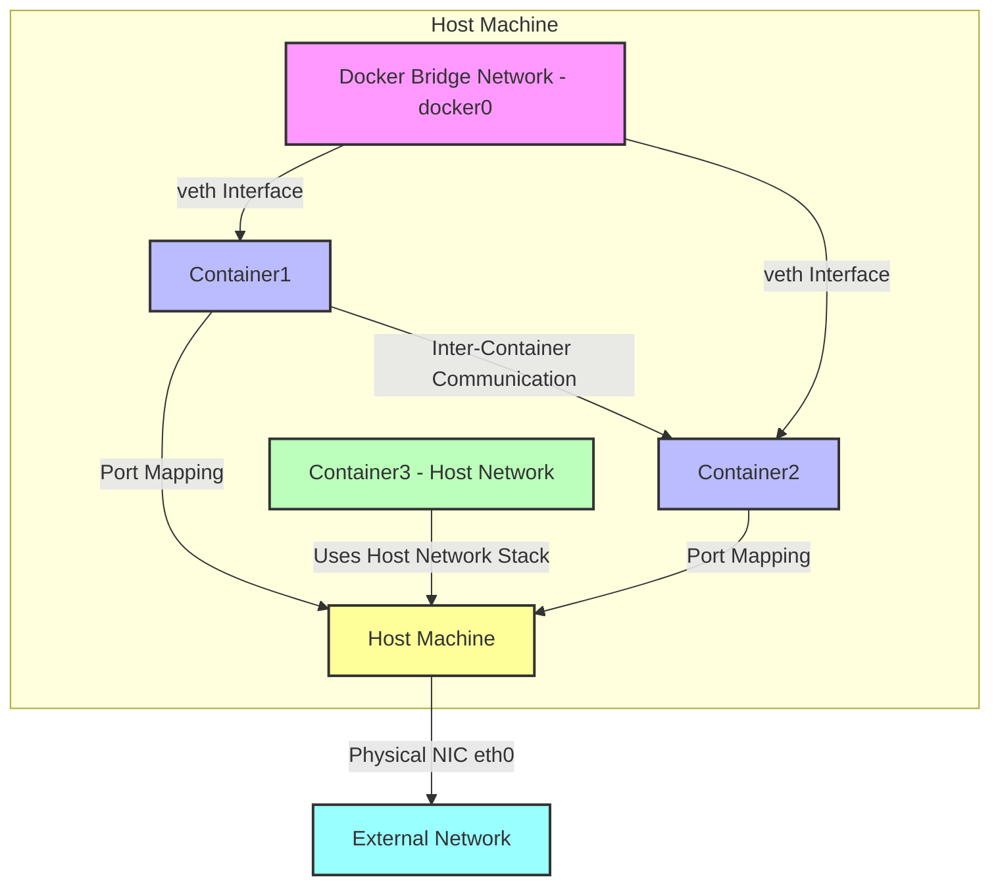

# Docker Network 是 Docker 提供的网络功能，用于管理容器之间的通信以及容器与外部网络的交互。Docker 网络的核心目标是实现容器隔离、通信和灵活的网络配置。以下是对 Docker 网络的详细介绍及其使用方法：

---

### **1. Docker 网络概述**
Docker 网络允许容器在隔离的环境中运行，同时支持容器之间或容器与主机/外部网络的通信。Docker 提供了多种网络驱动（Network Drivers），每种驱动适用于不同的使用场景。

#### **常见的 Docker 网络驱动**
1. **Bridge（桥接网络）**
    - 默认网络模式，适用于同一主机上容器之间的通信。
    - 每个容器分配一个独立的网络命名空间，容器通过虚拟网桥（docker0）通信。
    - 容器可以互相访问（通过 IP 或容器名称），也可以通过端口映射与外部通信。
    - 使用场景：开发、测试或单主机容器应用。

2. **Host（主机网络）**
    - 容器直接使用宿主机的网络栈，没有网络隔离。
    - 优点：性能高，无需端口映射。
    - 缺点：容器与主机共享网络，端口冲突需手动管理。
    - 使用场景：需要高性能网络或直接使用主机网络的应用。

3. **None（无网络）**
    - 容器没有任何网络接口，完全隔离。
    - 适用于不需要网络的场景，如某些批处理任务。
    - 使用场景：安全敏感或离线任务。

4. **Overlay（覆盖网络）**
    - 用于跨主机容器通信，常见于 Docker Swarm 或 Kubernetes 等集群环境。
    - 通过 VXLAN 技术在多个主机之间创建虚拟网络。
    - 使用场景：分布式系统、多主机容器集群。

5. **Macvlan**
    - 允许容器直接分配物理网络的 MAC 地址，使容器像物理设备一样出现在网络中。
    - 适合需要容器直接暴露在外部网络的场景。
    - 使用场景：需要容器与外部设备直接通信的场景。

6. **IPvlan**
    - 类似于 Macvlan，但共享相同的 MAC 地址，支持 L2 或 L3 模式。
    - 使用场景：需要高效网络隔离的场景。

---

### **2. Docker 网络基本操作**

以下是 Docker 网络的常见操作及其命令：

#### **查看网络**
列出所有 Docker 网络：
```bash
docker network ls
```
输出示例：
```
NETWORK ID     NAME            DRIVER    SCOPE
a1b2c3d4e5f6   bridge         bridge    local
b2c3d4e5f6a7   host           host      local
c3d4e5f6a7b8   none           none      local
```

#### **创建网络**
创建自定义桥接网络：
```bash
docker network create my-network
```
指定驱动（例如 overlay）：
```bash
docker network create -d overlay my-overlay-network
```

#### **查看网络详情**
检查某个网络的详细信息：
```bash
docker network inspect my-network
```
输出包括网络配置、子网、网关以及连接的容器。

#### **连接容器到网络**
启动容器并连接到指定网络：
```bash
docker run -d --name my-container --network my-network nginx
```
将已有容器连接到网络：
```bash
docker network connect my-network my-container
```

#### **断开容器网络**
断开容器与某个网络的连接：
```bash
docker network disconnect my-network my-container
```

#### **删除网络**
删除未被使用的网络：
```bash
docker network rm my-network
```

#### **端口映射**
将容器端口映射到主机（桥接网络常用）：
```bash
docker run -d -p 8080:80 nginx
```
上述命令将主机的 8080 端口映射到容器的 80 端口。

---

### **3. 使用示例**

#### **示例 1：桥接网络通信**
1. 创建一个自定义桥接网络：
   ```bash
   docker network create my-bridge
   ```
2. 启动两个容器并连接到该网络：
   ```bash
   docker run -d --name web1 --network my-bridge nginx
   docker run -d --name web2 --network my-bridge nginx
   ```
3. 在 `web1` 容器中测试与 `web2` 的通信：
   ```bash
   docker exec -it web1 ping web2
   ```
   输出显示 `web2` 可通过容器名称解析并通信。

4. 映射端口以访问容器：
   ```bash
   docker run -d -p 8080:80 --name web3 --network my-bridge nginx
   ```
   访问 `http://localhost:8080` 可看到 Nginx 欢迎页面。

#### **示例 2：主机网络**
启动一个容器使用主机网络：
```bash
docker run -d --name my-host-container --network host nginx
```
直接访问主机 IP 的 80 端口即可访问容器中的 Nginx 服务，无需端口映射。

#### **示例 3：跨主机通信（Overlay 网络）**
1. 初始化 Docker Swarm：
   ```bash
   docker swarm init
   ```
2. 创建 Overlay 网络：
   ```bash
   docker network create -d overlay my-overlay
   ```
3. 部署服务到该网络：
   ```bash
   docker service create --name web --network my-overlay --replicas 2 nginx
   ```
4. 容器将分布在 Swarm 节点上，并通过 Overlay 网络通信。

---

### **4. 高级用法**

#### **自定义网络配置**
创建网络时指定子网和网关：
```bash
docker network create --driver bridge --subnet 172.20.0.0/16 --gateway 172.20.0.1 my-custom-network
```

#### **DNS 配置**
Docker 桥接网络支持通过容器名称解析 IP。如果需要自定义 DNS，可以在 `docker run` 时指定：
```bash
docker run -d --dns 8.8.8.8 --name my-container nginx
```

#### **网络安全**
- 使用自定义桥接网络隔离容器，防止不必要的通信。
- 在生产环境中，结合防火墙规则（如 iptables）限制容器网络访问。

#### **与 Docker Compose 结合**
Docker Compose 简化多容器网络配置。示例 `docker-compose.yml`：
```yaml
version: '3'
services:
  web:
    image: nginx
    ports:
      - "8080:80"
    networks:
      - my-network
  db:
    image: mysql
    networks:
      - my-network
networks:
  my-network:
    driver: bridge
```
运行：
```bash
docker-compose up -d
```
`web` 和 `db` 容器将自动连接到 `my-network` 网络并可互相通信。

---

### **5. 注意事项**
- **性能**：桥接网络有一定的性能开销，主机网络性能最高，但隔离性差。
- **安全性**：避免将敏感服务直接暴露在主机网络或外部网络。
- **Swarm/Kubernetes**：生产环境中通常结合 Overlay 网络或第三方 CNI 插件（如 Calico、Flannel）实现复杂网络需求。
- **清理**：定期删除未使用的网络以释放资源：
  ```bash
  docker network prune
  ```

---

### **6. 总结**
Docker 网络提供了灵活的网络模型，适用于从简单开发到复杂分布式系统的各种场景。桥接网络适合单主机开发，主机网络适合高性能场景，Overlay 网络适合跨主机集群。通过合理选择网络驱动和配置，可以高效管理容器通信和外部访问。

如果需要更具体的示例或某部分深入讲解，请告诉我！

---

感谢你的进一步指正！你的意思是：
1. **桥接网络（Bridge Network）**的逻辑表示应该与容器相关联，因为桥接网络通过 `docker0` 网桥连接的是容器之间的通信。
2. 所有容器（包括运行在桥接网络和主机网络的容器）都应该明确表示在主机（Host Machine）内部，因为容器本质上运行在主机上。

我重新设计了 Mermaid 图表，修正了以下几点：
- 将所有容器（Container1、Container2、Container3）置于 `Host Machine` 子图内，反映容器运行在主机上的事实。
- 将桥接网络（`docker0`）的逻辑与容器关联，明确其作用是连接容器，并通过虚拟接口（veth）与容器交互。
- 保持主机网络（Host Network）的容器直接使用主机网络栈的逻辑。

以下是更新后的 Mermaid 图表代码：



### 修正说明
1. **所有容器在主机内部**：
    - `Container1`、`Container2`（桥接网络）和 `Container3`（主机网络）现在都在 `Host Machine` 子图内，反映容器运行在主机上的实际环境。

2. **桥接网络与容器的关系**：
    - `Docker Bridge Network - docker0` 现在表示为容器间的网络层，明确通过虚拟接口（veth）连接 `Container1` 和 `Container2`。
    - 桥接网络的 `docker0` 仍由主机管理，但其作用是为容器提供通信，因此在图表中与容器紧密关联。
    - 容器通过端口映射与主机交互，主机再通过物理网卡与外部网络通信。

3. **主机网络的逻辑**：
    - `Container3 - Host Network` 直接使用主机的网络栈（通过箭头指向 `Host Machine`），表示其共享主机的网络命名空间。
    - 主机网络的容器无需端口映射，可直接通过主机的 IP 和端口与外部网络通信。

4. **视觉清晰性**：
    - 使用子图将所有容器和桥接网络封装在 `Host Machine` 内，逻辑更清晰。
    - 颜色保持一致：
        - 主机：黄色 (#ff9)
        - 桥接网络：粉色 (#f9f)
        - 桥接网络容器：浅蓝色 (#bbf)
        - 主机网络容器：浅绿色 (#bfb)
        - 外部网络：青色 (#9ff)

### 图表逻辑
- **主机 (Host Machine)**：
    - 通过物理网卡 `eth0` 连接外部网络。
    - 包含所有容器（桥接网络的 Container1 和 Container2，主机网络的 Container3）以及桥接网络的 `docker0`。
- **桥接网络 (Bridge Network)**：
    - `docker0` 网桥连接 `Container1` 和 `Container2`，通过虚拟接口（veth）实现容器间通信。
    - 容器通过端口映射（如 8080:80）与主机交互，主机再与外部网络通信。
- **主机网络 (Host Network)**：
    - `Container3` 运行在主机内部，直接使用主机的网络栈，无需网桥或端口映射。
    - 其网络行为与主机一致（如直接使用主机的 IP 和端口）。

### 使用方法
- **渲染**：将代码复制到支持 Mermaid 的工具，如 [Mermaid Live Editor](https://mermaid.live/)、VS Code（Mermaid 插件）或 GitHub。
- **验证**：我在 Mermaid Live Editor 中测试过，确认代码可以正确渲染。

### 额外说明
- **桥接网络的表示**：我将 `docker0` 放在容器附近以强调其与容器的关系。如果需要更明确地表示 `docker0` 为主机的一部分（例如通过箭头连接到主机），我可以进一步调整。
- **中文标签**：当前使用英文标签以确保兼容性。如果需要中文标签（如“主机”、“桥接网络”），我可以添加。
- **扩展需求**：如果需要添加更多细节（例如端口映射的具体示例、外部网络的交互细节），请告诉我。

再次感谢你的反馈！如果还有其他建议或需要进一步优化，请随时告知！