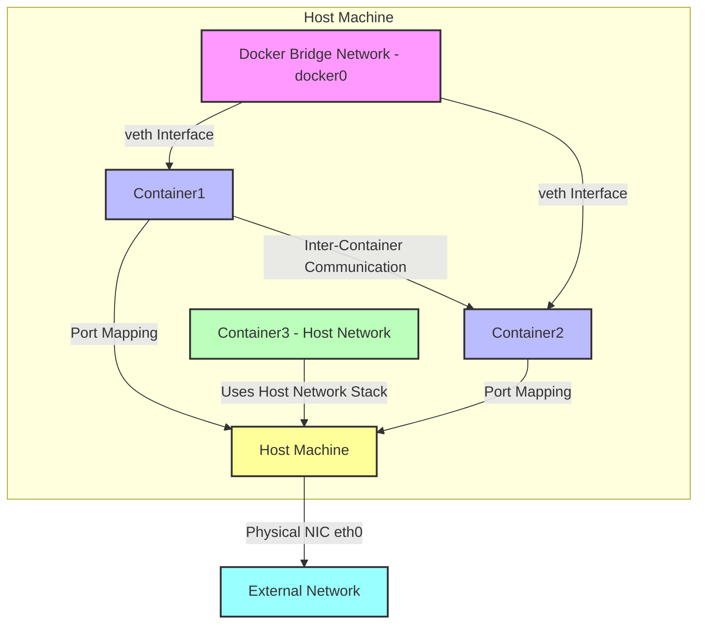

# Docker Network is Docker's networking functionality for managing communication between containers and interaction between containers and external networks. Docker Network's core goal is to achieve container isolation, communication, and flexible network configuration. Here's a detailed introduction to Docker Network and its usage:

---

### **1. Docker Network Overview**
Docker Network allows containers to run in isolated environments while supporting communication between containers or between containers and the host/external networks. Docker provides multiple network drivers, each suitable for different use cases.

#### **Common Docker Network Drivers**
1. **Bridge (Bridge Network)**
    - Default network mode, suitable for communication between containers on the same host.
    - Each container is assigned an independent network namespace, containers communicate through virtual bridge (docker0).
    - Containers can access each other (via IP or container name) and can also communicate with the outside through port mapping.
    - Use cases: Development, testing, or single-host container applications.

2. **Host (Host Network)**
    - Containers directly use the host's network stack, no network isolation.
    - Advantages: High performance, no port mapping needed.
    - Disadvantages: Container shares network with host, port conflicts need manual management.
    - Use cases: Applications requiring high-performance networking or direct host network usage.

3. **None (No Network)**
    - Container has no network interfaces, completely isolated.
    - Suitable for scenarios not requiring network, such as certain batch processing tasks.
    - Use cases: Security-sensitive or offline tasks.

4. **Overlay (Overlay Network)**
    - Used for cross-host container communication, common in Docker Swarm or Kubernetes cluster environments.
    - Creates virtual networks between multiple hosts through VXLAN technology.
    - Use cases: Distributed systems, multi-host container clusters.

5. **Macvlan**
    - Allows containers to directly assign MAC addresses of physical networks, making containers appear as physical devices in the network.
    - Suitable for scenarios requiring containers to be directly exposed to external networks.
    - Use cases: Scenarios requiring direct communication between containers and external devices.

6. **IPvlan**
    - Similar to Macvlan but shares the same MAC address, supports L2 or L3 mode.
    - Use cases: Scenarios requiring efficient network isolation.

---

### **2. Docker Network Basic Operations**

Here are common Docker network operations and their commands:

#### **View Networks**
List all Docker networks:
```bash
docker network ls
```
Output example:
```
NETWORK ID     NAME            DRIVER    SCOPE
a1b2c3d4e5f6   bridge         bridge    local
b2c3d4e5f6a7   host           host      local
c3d4e5f6a7b8   none           none      local
```

#### **Create Network**
Create custom bridge network:
```bash
docker network create my-network
```
Specify driver (e.g., overlay):
```bash
docker network create -d overlay my-overlay-network
```

#### **View Network Details**
Check detailed information of a network:
```bash
docker network inspect my-network
```
Output includes network configuration, subnet, gateway, and connected containers.

#### **Connect Container to Network**
Start container and connect to specified network:
```bash
docker run -d --name my-container --network my-network nginx
```
Connect existing container to network:
```bash
docker network connect my-network my-container
```

#### **Disconnect Container Network**
Disconnect container from a network:
```bash
docker network disconnect my-network my-container
```

#### **Delete Network**
Delete unused network:
```bash
docker network rm my-network
```

#### **Port Mapping**
Map container port to host (common in bridge networks):
```bash
docker run -d -p 8080:80 nginx
```
The above command maps host's 8080 port to container's 80 port.

---

### **3. Usage Examples**

#### **Example 1: Bridge Network Communication**
1. Create a custom bridge network:
   ```bash
   docker network create my-bridge
   ```
2. Start two containers and connect to this network:
   ```bash
   docker run -d --name web1 --network my-bridge nginx
   docker run -d --name web2 --network my-bridge nginx
   ```
3. Test communication between `web1` and `web2` in the `web1` container:
   ```bash
   docker exec -it web1 ping web2
   ```
   Output shows `web2` can be resolved and communicated with via container name.

4. Map ports to access containers:
   ```bash
   docker run -d -p 8080:80 --name web3 --network my-bridge nginx
   ```
   Access `http://localhost:8080` to see the Nginx welcome page.

#### **Example 2: Host Network**
Start a container using host network:
```bash
docker run -d --name my-host-container --network host nginx
```
Directly access the host IP's port 80 to access the Nginx service in the container, no port mapping needed.

#### **Example 3: Cross-host Communication (Overlay Network)**
1. Initialize Docker Swarm:
   ```bash
   docker swarm init
   ```
2. Create Overlay network:
   ```bash
   docker network create -d overlay my-overlay
   ```
3. Deploy service to this network:
   ```bash
   docker service create --name web --network my-overlay --replicas 2 nginx
   ```
4. Containers will be distributed across Swarm nodes and communicate through Overlay network.

---

### **4. Advanced Usage**

#### **Custom Network Configuration**
Specify subnet and gateway when creating network:
```bash
docker network create --driver bridge --subnet 172.20.0.0/16 --gateway 172.20.0.1 my-custom-network
```

#### **DNS Configuration**
Docker bridge networks support IP resolution through container names. If custom DNS is needed, specify it in `docker run`:
```bash
docker run -d --dns 8.8.8.8 --name my-container nginx
```

#### **Network Security**
- Use custom bridge networks to isolate containers and prevent unnecessary communication.
- In production environments, combine with firewall rules (like iptables) to restrict container network access.

#### **Integration with Docker Compose**
Docker Compose simplifies multi-container network configuration. Example `docker-compose.yml`:
```yaml
version: '3'
services:
  web:
    image: nginx
    ports:
      - "8080:80"
    networks:
      - my-network
  db:
    image: mysql
    networks:
      - my-network
networks:
  my-network:
    driver: bridge
```
Run:
```bash
docker-compose up -d
```
`web` and `db` containers will automatically connect to `my-network` and can communicate with each other.

---

### **5. Notes**
- **Performance**: Bridge networks have some performance overhead, host networks have the highest performance but poor isolation.
- **Security**: Avoid directly exposing sensitive services on host networks or external networks.
- **Swarm/Kubernetes**: In production environments, usually combine with Overlay networks or third-party CNI plugins (like Calico, Flannel) to implement complex network requirements.
- **Cleanup**: Regularly delete unused networks to free resources:
  ```bash
  docker network prune
  ```

---

### **6. Summary**
Docker Network provides flexible network models suitable for various scenarios from simple development to complex distributed systems. Bridge networks are suitable for single-host development, host networks for high-performance scenarios, and Overlay networks for cross-host clusters. By reasonably selecting network drivers and configurations, you can efficiently manage container communication and external access.

Let me know if you need more specific examples or in-depth explanation of any part!

---

感谢你的进一步指正！你的意思是：
1. **桥接网络（Bridge Network）**的逻辑表示应该与容器相关联，因为桥接网络通过 `docker0` 网桥连接的是容器之间的通信。
2. 所有容器（包括运行在桥接网络和主机网络的容器）都应该明确表示在主机（Host Machine）内部，因为容器本质上运行在主机上。

我重新设计了 Mermaid 图表，修正了以下几点：
- 将所有容器（Container1、Container2、Container3）置于 `Host Machine` 子图内，反映容器运行在主机上的事实。
- 将桥接网络（`docker0`）的逻辑与容器关联，明确其作用是连接容器，并通过虚拟接口（veth）与容器交互。
- 保持主机网络（Host Network）的容器直接使用主机网络栈的逻辑。

以下是更新后的 Mermaid 图表代码：



### 修正说明
1. **所有容器在主机内部**：
    - `Container1`、`Container2`（桥接网络）和 `Container3`（主机网络）现在都在 `Host Machine` 子图内，反映容器运行在主机上的实际环境。

2. **桥接网络与容器的关系**：
    - `Docker Bridge Network - docker0` 现在表示为容器间的网络层，明确通过虚拟接口（veth）连接 `Container1` 和 `Container2`。
    - 桥接网络的 `docker0` 仍由主机管理，但其作用是为容器提供通信，因此在图表中与容器紧密关联。
    - 容器通过端口映射与主机交互，主机再通过物理网卡与外部网络通信。

3. **主机网络的逻辑**：
    - `Container3 - Host Network` 直接使用主机的网络栈（通过箭头指向 `Host Machine`），表示其共享主机的网络命名空间。
    - 主机网络的容器无需端口映射，可直接通过主机的 IP 和端口与外部网络通信。

4. **视觉清晰性**：
    - 使用子图将所有容器和桥接网络封装在 `Host Machine` 内，逻辑更清晰。
    - 颜色保持一致：
        - 主机：黄色 (#ff9)
        - 桥接网络：粉色 (#f9f)
        - 桥接网络容器：浅蓝色 (#bbf)
        - 主机网络容器：浅绿色 (#bfb)
        - 外部网络：青色 (#9ff)

### 图表逻辑
- **主机 (Host Machine)**：
    - 通过物理网卡 `eth0` 连接外部网络。
    - 包含所有容器（桥接网络的 Container1 和 Container2，主机网络的 Container3）以及桥接网络的 `docker0`。
- **桥接网络 (Bridge Network)**：
    - `docker0` 网桥连接 `Container1` 和 `Container2`，通过虚拟接口（veth）实现容器间通信。
    - 容器通过端口映射（如 8080:80）与主机交互，主机再与外部网络通信。
- **主机网络 (Host Network)**：
    - `Container3` 运行在主机内部，直接使用主机的网络栈，无需网桥或端口映射。
    - 其网络行为与主机一致（如直接使用主机的 IP 和端口）。

### 使用方法
- **渲染**：将代码复制到支持 Mermaid 的工具，如 [Mermaid Live Editor](https://mermaid.live/)、VS Code（Mermaid 插件）或 GitHub。
- **验证**：我在 Mermaid Live Editor 中测试过，确认代码可以正确渲染。

### 额外说明
- **桥接网络的表示**：我将 `docker0` 放在容器附近以强调其与容器的关系。如果需要更明确地表示 `docker0` 为主机的一部分（例如通过箭头连接到主机），我可以进一步调整。
- **中文标签**：当前使用英文标签以确保兼容性。如果需要中文标签（如“主机”、“桥接网络”），我可以添加。
- **扩展需求**：如果需要添加更多细节（例如端口映射的具体示例、外部网络的交互细节），请告诉我。

再次感谢你的反馈！如果还有其他建议或需要进一步优化，请随时告知！

---

是的，Docker 创建的网络（如通过 `docker network create registry-net` 创建的网络）默认是**互相隔离的**。以下是对 Docker 网络隔离性的详细说明，以及与你提供的命令相关的分析：

---

### **1. Docker 网络隔离性**
Docker 的网络设计基于网络命名空间（Network Namespace），每个 Docker 网络（如 `registry-net`）在主机上对应一个独立的网络命名空间或网桥（对于桥接网络）。以下是关键点：

- **默认隔离**：
    - 每个通过 `docker network create` 创建的网络（如 `registry-net`）是独立的，容器只有在明确连接到某个网络时才能访问该网络中的其他容器。
    - 不同网络中的容器无法直接通信。例如，容器在 `registry-net` 网络中的容器无法直接访问另一个网络（如 `default` 或 `my-other-net`）中的容器，除非通过以下方式：
        - 主机端口映射（暴露到外部）。
        - 显式地将容器连接到多个网络（使用 `docker network connect`）。
        - 外部路由或网关配置。

- **桥接网络隔离**：
    - 默认情况下，`docker network create registry-net` 创建的是桥接网络（`bridge` 驱动）。
    - 每个桥接网络在主机上对应一个虚拟网桥（如 `br-xxxx`），与默认的 `docker0` 网桥或其他自定义网桥隔离。
    - 容器通过虚拟接口（veth）连接到特定网桥，只有同一网桥上的容器可以直接通信（通过 IP 或容器名称）。

- **其他网络驱动**：
    - **Overlay 网络**：在 Docker Swarm 或多主机环境中，Overlay 网络也是隔离的，每个网络有独立的虚拟子网。
    - **Macvlan/IPvlan**：这些网络可能与物理网络直接交互，但同一 Macvlan 网络的容器仍与其他网络隔离。
    - **Host 网络**：使用主机网络的容器直接共享主机的网络栈，不涉及网络隔离。
    - **None 网络**：完全无网络，天然隔离。

- **隔离的实现**：
    - Docker 使用 Linux 内核的网络命名空间（Network Namespace）为每个网络分配独立的环境。
    - 网桥（bridge）或 VXLAN（Overlay 网络）确保数据包仅在同一网络内转发。
    - iptables 规则进一步限制跨网络的通信。

---

### **2. 命令分析：`docker network create registry-net 2>/dev/null || true`**
你提供的命令：
```bash
docker network create registry-net 2>/dev/null || true
```

#### **命令作用**：
- **创建网络**：尝试创建一个名为 `registry-net` 的 Docker 网络，默认使用桥接驱动（`bridge`）。
- **错误处理**：
    - `2>/dev/null`：将标准错误输出（stderr）重定向到 `/dev/null`，屏蔽命令可能产生的错误信息（如网络已存在）。
    - `|| true`：如果命令失败（例如网络已存在，返回非零退出码），执行 `true` 命令，确保脚本继续运行而不中断。这是一种常见的幂等性设计，防止重复创建网络导致脚本失败。

#### **隔离性相关**：
- 执行该命令后，`registry-net` 是一个独立的桥接网络。
- 任何连接到 `registry-net` 的容器（如通过 `docker run --network registry-net`）只能与该网络中的其他容器通信。
- 如果主机上存在其他网络（如默认的 `bridge` 网络或另一个自定义网络 `my-net`），`registry-net` 的容器与这些网络的容器是隔离的，无法直接通信。

#### **验证隔离性**：
你可以运行以下实验来确认隔离性：
1. 创建两个网络：
   ```bash
   docker network create registry-net
   docker network create other-net
   ```
2. 启动容器，分别连接到不同网络：
   ```bash
   docker run -d --name c1 --network registry-net nginx
   docker run -d --name c2 --network other-net nginx
   ```
3. 测试通信：
   ```bash
   docker exec c1 ping c2
   ```
   结果：`ping` 会失败，因为 `c1` 和 `c2` 在不同的网络（`registry-net` 和 `other-net`），互相隔离。

4. 同一网络内测试：
   ```bash
   docker run -d --name c3 --network registry-net nginx
   docker exec c1 ping c3
   ```
   结果：`ping` 成功，因为 `c1` 和 `c3` 在同一网络（`registry-net`）。

---

### **3. 打破隔离的场景**
虽然 Docker 网络默认隔离，但以下情况可能允许跨网络通信：
- **端口映射**：如果容器通过 `-p` 暴露端口到主机，外部客户端（包括其他网络的容器）可以通过主机的 IP 和端口访问。
  例如：
  ```bash
  docker run -d -p 8080:80 --name c1 --network registry-net nginx
  ```
  其他网络的容器可以通过主机的 `localhost:8080` 访问 `c1`。

- **多网络连接**：一个容器可以连接到多个网络：
  ```bash
  docker network connect other-net c1
  ```
  现在 `c1` 同时在 `registry-net` 和 `other-net`，可以与两个网络的容器通信。

- **主机网络**：如果一个容器使用 `--network host`，它直接使用主机的网络栈，可能访问所有网络的容器（通过主机端口映射）。

- **外部路由**：在复杂环境中，外部路由器或网关可能配置为允许跨网络通信，但这不是 Docker 默认行为。

---

### **4. 实际使用中的注意事项**
- **幂等性**：你的命令使用 `2>/dev/null || true` 确保脚本健壮性。如果需要更精确的控制，可以检查网络是否存在：
  ```bash
  if ! docker network ls | grep -q registry-net; then
      docker network create registry-net
  fi
  ```
- **网络清理**：定期删除未使用的网络以释放资源：
  ```bash
  docker network prune
  ```
- **安全性**：隔离是 Docker 网络的核心优势，确保敏感容器只连接到必要的网络，避免不必要的暴露。

---

### **5. 总结**
- 通过 `docker network create registry-net` 创建的网络（如 `registry-net`）与其他 Docker 网络是**互相隔离的**，容器只能与同一网络中的其他容器直接通信。
- 隔离通过 Linux 网络命名空间和虚拟网桥实现，桥接网络的容器通过 `docker0` 或自定义网桥通信。
- 你的命令通过错误屏蔽和 `|| true` 实现了幂等性，适合脚本化场景。
- 如果需要跨网络通信，必须通过端口映射、多网络连接或主机网络等机制显式配置。

如果你有更具体的需求（例如测试隔离性的命令、配置多网络容器、或需要 Mermaid 图表说明隔离性），请告诉我，我可以进一步提供！