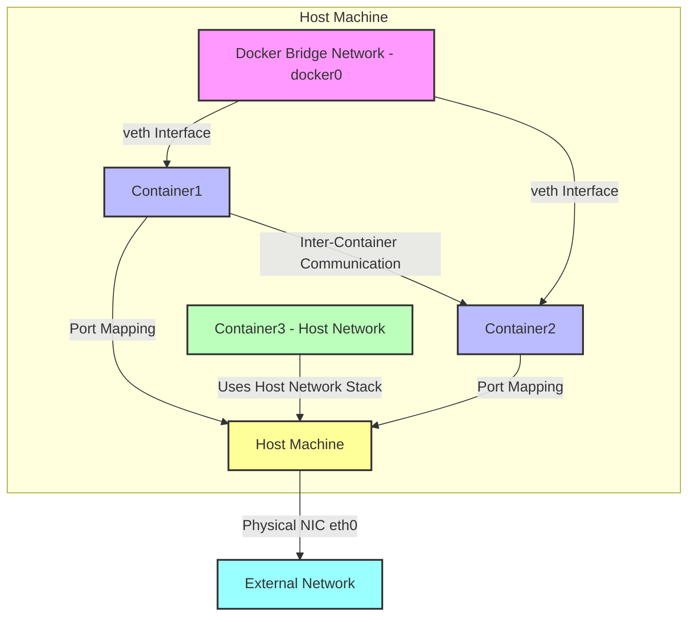

# Docker Network is Docker's networking functionality for managing communication between containers and interaction between containers and external networks. Docker Network's core goal is to achieve container isolation, communication, and flexible network configuration. Here's a detailed introduction to Docker Network and its usage:

---

### **1. Docker Network Overview**
Docker Network allows containers to run in isolated environments while supporting communication between containers or between containers and the host/external networks. Docker provides multiple network drivers, each suitable for different use cases.

#### **Common Docker Network Drivers**
1. **Bridge (Bridge Network)**
    - Default network mode, suitable for communication between containers on the same host.
    - Each container is assigned an independent network namespace, containers communicate through virtual bridge (docker0).
    - Containers can access each other (via IP or container name) and can also communicate with the outside through port mapping.
    - Use cases: Development, testing, or single-host container applications.

2. **Host (Host Network)**
    - Containers directly use the host's network stack, no network isolation.
    - Advantages: High performance, no port mapping needed.
    - Disadvantages: Container shares network with host, port conflicts need manual management.
    - Use cases: Applications requiring high-performance networking or direct host network usage.

3. **None (No Network)**
    - Container has no network interfaces, completely isolated.
    - Suitable for scenarios not requiring network, such as certain batch processing tasks.
    - Use cases: Security-sensitive or offline tasks.

4. **Overlay (Overlay Network)**
    - Used for cross-host container communication, common in Docker Swarm or Kubernetes cluster environments.
    - Creates virtual networks between multiple hosts through VXLAN technology.
    - Use cases: Distributed systems, multi-host container clusters.

5. **Macvlan**
    - Allows containers to directly assign MAC addresses of physical networks, making containers appear as physical devices in the network.
    - Suitable for scenarios requiring containers to be directly exposed to external networks.
    - Use cases: Scenarios requiring direct communication between containers and external devices.

6. **IPvlan**
    - Similar to Macvlan but shares the same MAC address, supports L2 or L3 mode.
    - Use cases: Scenarios requiring efficient network isolation.

---

### **2. Docker Network Basic Operations**

Here are common Docker network operations and their commands:

#### **View Networks**
List all Docker networks:
```bash
docker network ls
```
Output example:
```
NETWORK ID     NAME            DRIVER    SCOPE
a1b2c3d4e5f6   bridge         bridge    local
b2c3d4e5f6a7   host           host      local
c3d4e5f6a7b8   none           none      local
```

#### **Create Network**
Create custom bridge network:
```bash
docker network create my-network
```
Specify driver (e.g., overlay):
```bash
docker network create -d overlay my-overlay-network
```

#### **View Network Details**
Check detailed information of a network:
```bash
docker network inspect my-network
```
Output includes network configuration, subnet, gateway, and connected containers.

#### **Connect Container to Network**
Start container and connect to specified network:
```bash
docker run -d --name my-container --network my-network nginx
```
Connect existing container to network:
```bash
docker network connect my-network my-container
```

#### **Disconnect Container Network**
Disconnect container from a network:
```bash
docker network disconnect my-network my-container
```

#### **Delete Network**
Delete unused network:
```bash
docker network rm my-network
```

#### **Port Mapping**
Map container port to host (common in bridge networks):
```bash
docker run -d -p 8080:80 nginx
```
The above command maps host's 8080 port to container's 80 port.

---

### **3. Usage Examples**

#### **Example 1: Bridge Network Communication**
1. Create a custom bridge network:
   ```bash
   docker network create my-bridge
   ```
2. Start two containers and connect to this network:
   ```bash
   docker run -d --name web1 --network my-bridge nginx
   docker run -d --name web2 --network my-bridge nginx
   ```
3. Test communication between `web1` and `web2` in the `web1` container:
   ```bash
   docker exec -it web1 ping web2
   ```
   Output shows `web2` can be resolved and communicated with via container name.

4. Map ports to access containers:
   ```bash
   docker run -d -p 8080:80 --name web3 --network my-bridge nginx
   ```
   Access `http://localhost:8080` to see the Nginx welcome page.

#### **Example 2: Host Network**
Start a container using host network:
```bash
docker run -d --name my-host-container --network host nginx
```
Directly access the host IP's port 80 to access the Nginx service in the container, no port mapping needed.

#### **Example 3: Cross-host Communication (Overlay Network)**
1. Initialize Docker Swarm:
   ```bash
   docker swarm init
   ```
2. Create Overlay network:
   ```bash
   docker network create -d overlay my-overlay
   ```
3. Deploy service to this network:
   ```bash
   docker service create --name web --network my-overlay --replicas 2 nginx
   ```
4. Containers will be distributed across Swarm nodes and communicate through Overlay network.

---

### **4. Advanced Usage**

#### **Custom Network Configuration**
Specify subnet and gateway when creating network:
```bash
docker network create --driver bridge --subnet 172.20.0.0/16 --gateway 172.20.0.1 my-custom-network
```

#### **DNS Configuration**
Docker bridge networks support IP resolution through container names. If custom DNS is needed, specify it in `docker run`:
```bash
docker run -d --dns 8.8.8.8 --name my-container nginx
```

#### **Network Security**
- Use custom bridge networks to isolate containers and prevent unnecessary communication.
- In production environments, combine with firewall rules (like iptables) to restrict container network access.

#### **Integration with Docker Compose**
Docker Compose simplifies multi-container network configuration. Example `docker-compose.yml`:
```yaml
version: '3'
services:
  web:
    image: nginx
    ports:
      - "8080:80"
    networks:
      - my-network
  db:
    image: mysql
    networks:
      - my-network
networks:
  my-network:
    driver: bridge
```
Run:
```bash
docker-compose up -d
```
`web` and `db` containers will automatically connect to `my-network` and can communicate with each other.

---

### **5. Notes**
- **Performance**: Bridge networks have some performance overhead, host networks have the highest performance but poor isolation.
- **Security**: Avoid directly exposing sensitive services on host networks or external networks.
- **Swarm/Kubernetes**: In production environments, usually combine with Overlay networks or third-party CNI plugins (like Calico, Flannel) to implement complex network requirements.
- **Cleanup**: Regularly delete unused networks to free resources:
  ```bash
  docker network prune
  ```

---

### **6. Summary**
Docker Network provides flexible network models suitable for various scenarios from simple development to complex distributed systems. Bridge networks are suitable for single-host development, host networks for high-performance scenarios, and Overlay networks for cross-host clusters. By reasonably selecting network drivers and configurations, you can efficiently manage container communication and external access.

Let me know if you need more specific examples or in-depth explanation of any part!

---

Thank you for your further feedback! Your points are:
1. **Bridge Network** logic should be associated with containers, as bridge networks connect container communication through the `docker0` bridge.
2. All containers (including those running on bridge and host networks) should be clearly represented inside the Host Machine, as containers essentially run on the host.

I've redesigned the Mermaid diagram, correcting the following:
- Placed all containers (Container1, Container2, Container3) within the `Host Machine` subgraph to reflect the fact that containers run on the host.
- Associated the bridge network (`docker0`) logic with containers, clearly showing its role in connecting containers and interacting with them through virtual interfaces (veth).
- Maintained the logic that host network containers directly use the host network stack.

Here is the updated Mermaid diagram code:



### Correction Notes
1. **All containers inside the host**:
    - `Container1`, `Container2` (bridge network) and `Container3` (host network) are now all within the `Host Machine` subgraph, reflecting the actual environment where containers run on the host.

2. **Relationship between bridge network and containers**:
    - `Docker Bridge Network - docker0` is now represented as the network layer between containers, clearly connecting `Container1` and `Container2` through virtual interfaces (veth).
    - The bridge network's `docker0` is still managed by the host, but its role is to provide communication for containers, so it's closely associated with containers in the diagram.
    - Containers interact with the host through port mapping, and the host communicates with external networks through the physical network card.

3. **Host network logic**:
    - `Container3 - Host Network` runs inside the host, directly using the host's network stack (arrow pointing to `Host Machine`), indicating it shares the host's network namespace.
    - Host network containers don't need port mapping and can directly communicate with external networks through the host's IP and ports.

4. **Visual clarity**:
    - Using subgraphs to encapsulate all containers and bridge networks within `Host Machine` makes the logic clearer.
    - Color consistency is maintained:
        - Host: Yellow (#ff9)
        - Bridge network: Pink (#f9f)
        - Bridge network containers: Light blue (#bbf)
        - Host network containers: Light green (#bfb)
        - External network: Cyan (#9ff)

### Diagram Logic
- **Host (Host Machine)**:
    - Connects to external networks through physical network card `eth0`.
    - Contains all containers (bridge network Container1 and Container2, host network Container3) and bridge network `docker0`.
- **Bridge Network (Bridge Network)**:
    - `docker0` bridge connects `Container1` and `Container2`, enabling inter-container communication through virtual interfaces (veth).
    - Containers interact with the host through port mapping (like 8080:80), and the host communicates with external networks.
- **Host Network (Host Network)**:
    - `Container3` runs inside the host, directly using the host's network stack, no bridge or port mapping needed.
    - Its network behavior is consistent with the host (directly using host's IP and ports).

### Usage
- **Rendering**: Copy the code to Mermaid-supported tools like [Mermaid Live Editor](https://mermaid.live/), VS Code (Mermaid plugin), or GitHub.
- **Verification**: I've tested the code in Mermaid Live Editor and confirmed it renders correctly.

### Additional Notes
- **Bridge network representation**: I placed `docker0` near containers to emphasize its relationship with them. If you need to more clearly represent `docker0` as part of the host (e.g., connect it to the host with arrows), I can adjust further.
- **Chinese labels**: Currently using English labels for compatibility. If you need Chinese labels (like "Host", "Bridge Network"), I can add them.
- **Extension needs**: If you need to add more details (like specific port mapping examples, external network interaction details), please let me know.

Thanks again for your feedback! If you have other suggestions or need further optimization, please let me know!

---

Yes, Docker-created networks (like those created through `docker network create registry-net`) are **mutually isolated** by default. Here's a detailed explanation of Docker network isolation and analysis related to your provided commands:

---

### **1. Docker Network Isolation**
Docker's network design is based on network namespaces (Network Namespace), where each Docker network (like `registry-net`) corresponds to an independent network namespace or bridge (for bridge networks) on the host. Key points:

- **Default Isolation**:
    - Each network created through `docker network create` (like `registry-net`) is independent. Containers can only access other containers in the same network when explicitly connected to that network.
    - Containers in different networks cannot communicate directly. For example, containers in `registry-net` cannot directly access containers in another network (like `default` or `my-other-net`), unless through:
        - Host port mapping (exposed to external).
        - Explicitly connecting containers to multiple networks (using `docker network connect`).
        - External routing or gateway configuration.

- **Bridge Network Isolation**:
    - By default, `docker network create registry-net` creates a bridge network (`bridge` driver).
    - Each bridge network corresponds to a virtual bridge (like `br-xxxx`) on the host, isolated from the default `docker0` bridge or other custom bridges.
    - Containers connect to specific bridges through virtual interfaces (veth), and only containers on the same bridge can communicate directly (via IP or container name).

- **Other Network Drivers**:
    - **Overlay networks**: In Docker Swarm or multi-host environments, Overlay networks are also isolated, each network having independent virtual subnets.
    - **Macvlan/IPvlan**: These networks may directly interact with physical networks, but containers in the same Macvlan network are still isolated from other networks.
    - **Host network**: Containers using host network directly share the host's network stack, not involving network isolation.
    - **None network**: Completely no network, naturally isolated.

- **Isolation Implementation**:
    - Docker uses Linux kernel's network namespace (Network Namespace) to assign independent environments for each network.
    - Bridges (bridge) or VXLAN (Overlay networks) ensure packets are only forwarded within the same network.
    - iptables rules further restrict cross-network communication.

---

### **2. Command Analysis: `docker network create registry-net 2>/dev/null || true`**
Your provided command:
```bash
docker network create registry-net 2>/dev/null || true
```

#### **Command Purpose**:
- **Create network**: Attempts to create a Docker network named `registry-net`, defaulting to bridge driver (`bridge`).
- **Error handling**:
    - `2>/dev/null`: Redirects standard error output (stderr) to `/dev/null`, masking possible error messages (like network already exists).
    - `|| true`: If the command fails (e.g., network already exists, returns non-zero exit code), executes `true` command, ensuring the script continues without interruption. This is a common idempotent design to prevent script failure due to duplicate network creation.

#### **Isolation-related**:
- After executing this command, `registry-net` is an independent bridge network.
- Any containers connected to `registry-net` (like through `docker run --network registry-net`) can only communicate with other containers in this network.
- If other networks exist on the host (like default `bridge` network or another custom network `my-net`), containers in `registry-net` are isolated from containers in these networks and cannot communicate directly.

#### **Verify Isolation**:
You can run the following experiments to confirm isolation:
1. Create two networks:
   ```bash
   docker network create registry-net
   docker network create other-net
   ```
2. Start containers, connect to different networks:
   ```bash
   docker run -d --name c1 --network registry-net nginx
   docker run -d --name c2 --network other-net nginx
   ```
3. Test communication:
   ```bash
   docker exec c1 ping c2
   ```
   Result: `ping` will fail because `c1` and `c2` are in different networks (`registry-net` and `other-net`), mutually isolated.

4. Same network test:
   ```bash
   docker run -d --name c3 --network registry-net nginx
   docker exec c1 ping c3
   ```
   Result: `ping` succeeds because `c1` and `c3` are in the same network (`registry-net`).

---

### **3. Scenarios Breaking Isolation**
Although Docker networks are isolated by default, the following situations may allow cross-network communication:
- **Port mapping**: If containers expose ports to the host through `-p`, external clients (including containers from other networks) can access through the host's IP and port.
  Example:
  ```bash
  docker run -d -p 8080:80 --name c1 --network registry-net nginx
  ```
  Containers from other networks can access `c1` through the host's `localhost:8080`.

- **Multi-network connection**: A container can connect to multiple networks:
  ```bash
  docker network connect other-net c1
  ```
  Now `c1` is in both `registry-net` and `other-net`, can communicate with containers in both networks.

- **Host network**: If a container uses `--network host`, it directly uses the host's network stack and may access containers in all networks (through host port mapping).

- **External routing**: In complex environments, external routers or gateways may be configured to allow cross-network communication, but this is not Docker's default behavior.

---

### **4. Practical Usage Notes**
- **Idempotency**: Your command uses `2>/dev/null || true` to ensure script robustness. If more precise control is needed, you can check if the network exists:
  ```bash
  if ! docker network ls | grep -q registry-net; then
      docker network create registry-net
  fi
  ```
- **Network cleanup**: Regularly delete unused networks to free resources:
  ```bash
  docker network prune
  ```
- **Security**: Isolation is a core advantage of Docker networks, ensure sensitive containers only connect to necessary networks to avoid unnecessary exposure.

---

### **5. Summary**
- Networks created through `docker network create registry-net` (like `registry-net`) are **mutually isolated** with other Docker networks. Containers can only directly communicate with other containers in the same network.
- Isolation is implemented through Linux network namespaces and virtual bridges, bridge network containers communicate through `docker0` or custom bridges.
- Your command achieves idempotency through error masking and `|| true`, suitable for scripting scenarios.
- If cross-network communication is needed, it must be explicitly configured through port mapping, multi-network connections, or host network mechanisms.

If you have more specific needs (like commands to test isolation, configure multi-network containers, or need Mermaid diagrams to illustrate isolation), please let me know, I can provide further assistance!