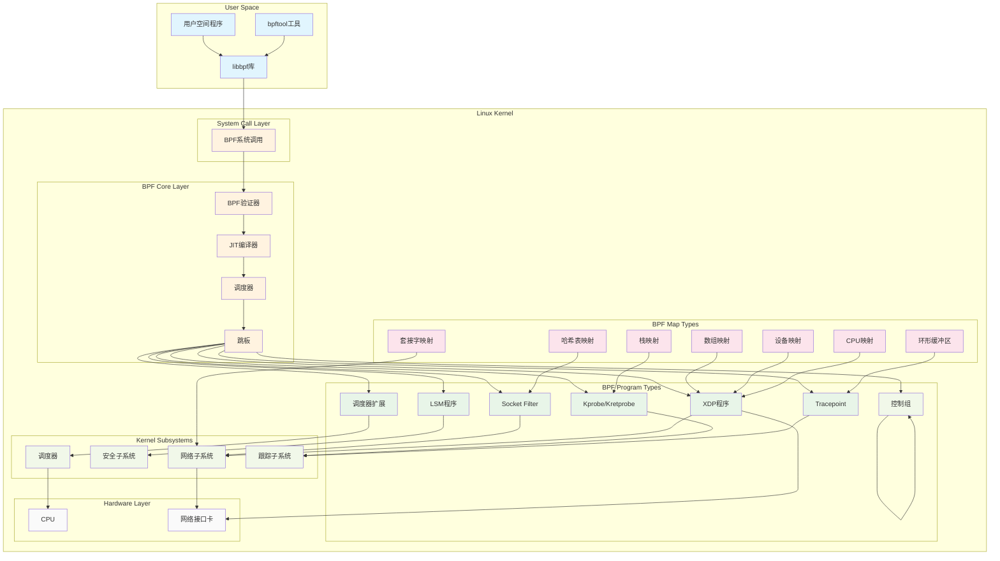
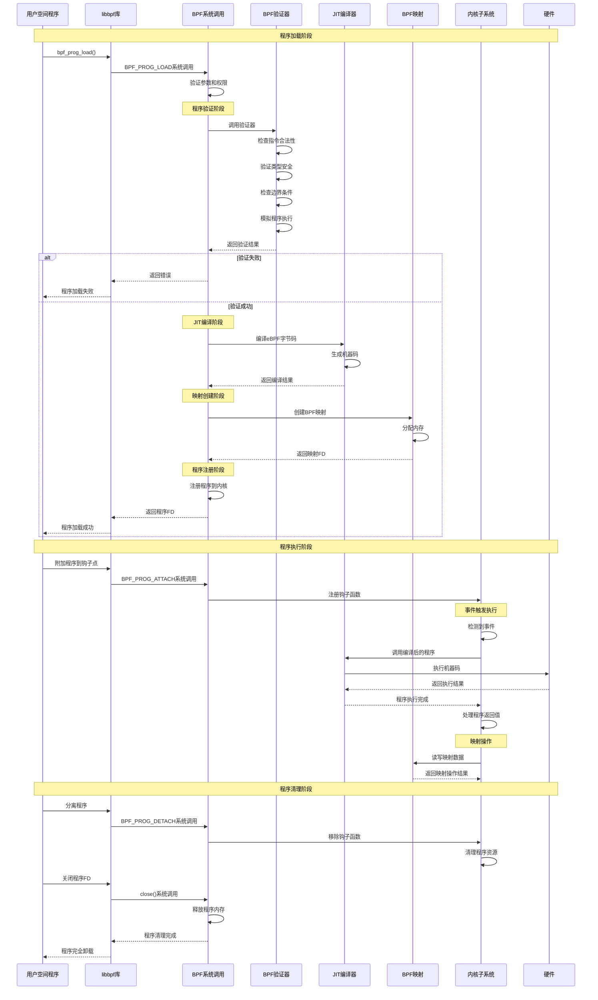

# Linux Kernel项目中eBPF相关代码分析

### 1. 核心eBPF实现文件

#### 主要头文件
- **`include/linux/bpf.h`** - eBPF核心头文件，定义了所有eBPF相关的数据结构、函数原型和宏
- **`include/uapi/linux/bpf.h`** - 用户空间API头文件
- **`include/linux/lsm/bpf.h`** - LSM (Linux Security Module) eBPF相关定义
- **`include/net/netns/bpf.h`** - 网络命名空间eBPF相关定义

#### 核心实现目录
- **`kernel/bpf/`** - eBPF核心实现目录，包含以下重要文件：

**核心系统调用和程序管理：**
- `kernel/bpf/syscall.c` (6198行) - eBPF系统调用实现
- `kernel/bpf/core.c` (3195行) - eBPF核心功能实现
- `kernel/bpf/helpers.c` (3465行) - eBPF辅助函数实现

**验证器：**
- `kernel/bpf/verifier.c` (24207行) - eBPF程序验证器，确保程序安全性

**映射类型实现：**
- `kernel/bpf/hashtab.c` (2629行) - 哈希表映射实现
- `kernel/bpf/arraymap.c` - 数组映射实现
- `kernel/bpf/devmap.c` (1171行) - 设备映射实现
- `kernel/bpf/cpumap.c` (815行) - CPU映射实现
- `kernel/bpf/ringbuf.c` (802行) - 环形缓冲区实现
- `kernel/bpf/stackmap.c` (763行) - 栈映射实现

**BTF (BPF Type Format) 支持：**
- `kernel/bpf/btf.c` (246KB) - BTF核心实现
- `kernel/bpf/btf_iter.c` - BTF迭代器

**其他重要组件：**
- `kernel/bpf/trampoline.c` (1139行) - 跳板实现
- `kernel/bpf/dispatcher.c` (172行) - 调度器实现
- `kernel/bpf/offload.c` (879行) - 卸载支持
- `kernel/bpf/token.c` (256行) - 令牌管理

### 2. 网络相关eBPF实现

#### 网络子系统集成
- **`net/bpf/`** - 网络eBPF实现
    - `net/bpf/test_run.c` (1769行) - 测试运行框架
    - `net/bpf/bpf_dummy_struct_ops.c` (323行) - 虚拟结构体操作

#### 网络协议栈集成
- **`net/core/`** - 核心网络功能中的eBPF集成
- **`net/socket.c`** - 套接字层eBPF支持
- **`net/filter/`** - 网络过滤器eBPF支持

### 3. 文件系统eBPF支持

- **`fs/bpf_fs_kfuncs.c`** - BPF文件系统内核函数实现
    - 实现了文件系统相关的eBPF内核函数
    - 支持文件操作、路径解析、扩展属性等

### 4. 工具和库

#### 用户空间工具
- **`tools/bpf/`** - eBPF工具集
    - `tools/bpf/bpftool/` - 主要的eBPF管理工具
    - `tools/bpf/bpf_dbg.c` (1399行) - eBPF调试器
    - `tools/bpf/bpf_jit_disasm.c` (333行) - JIT反汇编器

#### 用户空间库
- **`tools/lib/bpf/`** - libbpf库实现
    - `tools/lib/bpf/libbpf.c` (14174行) - 主要库实现
    - `tools/lib/bpf/libbpf.h` (1948行) - 库头文件
    - `tools/lib/bpf/btf.c` (5833行) - BTF库实现
    - `tools/lib/bpf/linker.c` (3115行) - 链接器实现

### 5. 文档

- **`Documentation/bpf/`** - 完整的eBPF文档
    - `Documentation/bpf/verifier.rst` (825行) - 验证器文档
    - `Documentation/bpf/btf.rst` (1211行) - BTF文档
    - `Documentation/bpf/kfuncs.rst` (696行) - 内核函数文档
    - 各种映射类型和程序类型的详细文档

### 6. 测试和示例

- **`samples/bpf/`** - eBPF示例程序
- **`tools/testing/selftests/bpf/`** - eBPF自测试套件

### 7. 架构特定实现

- **`arch/x86/bpf/`** - x86架构特定的eBPF实现
- **`arch/arm64/bpf/`** - ARM64架构特定的eBPF实现
- 其他架构的eBPF JIT编译器实现

### 8. 主要功能特性

#### 程序类型支持
- 套接字过滤器 (Socket Filter)
- Kprobe/Kretprobe
- Tracepoint
- XDP (eXpress Data Path)
- Cgroup
- LSM (Linux Security Module)
- 调度器扩展 (Sched Ext)

#### 映射类型支持
- 哈希表 (Hash)
- 数组 (Array)
- 环形缓冲区 (Ring Buffer)
- 栈映射 (Stack Map)
- 设备映射 (Device Map)
- CPU映射 (CPU Map)
- 套接字映射 (Socket Map)

#### 安全特性
- 程序验证器确保类型安全
- 边界检查防止越界访问
- 循环检测防止无限循环
- 权限检查控制访问权限

### 9. 关键设计特点

1. **安全性优先** - 所有eBPF程序必须通过严格的验证器检查
2. **高性能** - JIT编译将eBPF字节码编译为本地机器码
3. **可扩展性** - 模块化设计支持新的程序类型和映射类型
4. **用户友好** - 提供丰富的用户空间工具和库
5. **内核集成** - 深度集成到Linux内核的各个子系统

这个eBPF实现是Linux内核中最复杂和功能最丰富的子系统之一，为内核提供了强大的可编程性和可扩展性，同时保持了严格的安全保证。

---

抱歉，让我重新整理一个简洁清晰的eBPF工作原理和代码分析：

## eBPF工作原理

### 1. 基本流程

```
用户程序 → eBPF字节码 → 验证器检查 → JIT编译 → 内核执行
```

### 2. 核心代码片段分析

#### 系统调用入口
```c
// kernel/bpf/syscall.c
static int bpf_prog_load(union bpf_attr *attr, bpfptr_t uattr, u32 uattr_size)
{
    enum bpf_prog_type type = attr->prog_type;
    struct bpf_prog *prog, *dst_prog = NULL;
    struct btf *attach_btf = NULL;
    struct bpf_token *token = NULL;
    
    // 1. 验证程序类型
    if (type >= ARRAY_SIZE(bpf_prog_types) || !bpf_prog_types[type])
        return -EINVAL;
    
    // 2. 分配程序结构
    prog = bpf_prog_alloc(bpf_prog_size(attr->insn_cnt), 0);
    if (IS_ERR(prog))
        return PTR_ERR(prog);
    
    // 3. 复制指令
    if (copy_from_bpfptr(prog->insns, u64_to_bpfptr(attr->insns),
                         bpf_prog_insn_size(prog)) != 0) {
        err = -EFAULT;
        goto free_prog;
    }
    
    // 4. 验证程序
    err = bpf_check(&prog, &attr, uattr, uattr_size);
    if (err < 0)
        goto free_prog;
    
    // 5. 创建文件描述符
    err = bpf_prog_new_fd(prog);
    if (err < 0)
        goto free_prog;
    
    return err;
}
```

#### 验证器核心逻辑
```c
// kernel/bpf/verifier.c
static int do_check(struct bpf_verifier_env *env)
{
    struct bpf_verifier_state *state = env->cur_state;
    struct bpf_insn *insns = env->prog->insnsi;
    struct bpf_reg_state *regs;
    int insn_cnt = env->prog->len;
    int i;
    
    for (i = 0; i < insn_cnt; i++) {
        struct bpf_insn *insn = &insns[i];
        
        // 检查指令边界
        if (i >= insn_cnt) {
            verbose(env, "invalid insn idx %d insn_cnt %d\n", i, insn_cnt);
            return -EINVAL;
        }
        
        // 验证指令
        err = check_insn(env, i);
        if (err)
            return err;
        
        // 模拟执行
        err = do_simulate(env, insn);
        if (err)
            return err;
    }
    
    return 0;
}
```

#### 映射操作示例
```c
// kernel/bpf/hashtab.c - 哈希表映射实现
static long htab_map_update_elem(struct bpf_map *map, void *key, void *value, u64 flags)
{
    struct bpf_htab *htab = container_of(map, struct bpf_htab, map);
    struct htab_elem *l_new = NULL, *l_old;
    struct hlist_nulls_head *head;
    unsigned long flags;
    struct bucket *b;
    u32 key_size, hash;
    int ret;
    
    if (unlikely(flags > BPF_EXIST))
        return -EINVAL;
    
    WARN_ON_ONCE(!rcu_read_lock_held());
    
    key_size = map->key_size;
    hash = htab_map_hash(key, key_size, htab->hashrnd);
    b = __select_bucket(htab, hash);
    head = &b->head;
    
    // 查找现有元素
    l_old = lookup_elem_raw(head, hash, key, key_size);
    
    ret = check_flags(htab, l_old, map_flags);
    if (ret)
        return ret;
    
    // 分配新元素
    l_new = alloc_htab_elem(htab, key, value, key_size, hash, false, false);
    if (IS_ERR(l_new))
        return PTR_ERR(l_new);
    
    // 更新哈希表
    hlist_nulls_add_head_rcu(&l_new->hash_node, head);
    if (l_old) {
        hlist_nulls_del_rcu(&l_old->hash_node);
        free_htab_elem(htab, l_old);
    }
    
    return 0;
}
```

#### 辅助函数示例
```c
// kernel/bpf/helpers.c - 获取当前任务ID
BPF_CALL_2(bpf_get_current_pid_tgid, u64, r1, u64, r2)
{
    struct task_struct *task = current;
    
    if (unlikely(!task))
        return -EINVAL;
    
    return ((u64) task->tgid << 32) | task->pid;
}

// 获取当前用户ID
BPF_CALL_2(bpf_get_current_uid_gid, u64, r1, u64, r2)
{
    struct task_struct *task = current;
    kuid_t uid;
    kgid_t gid;
    
    if (unlikely(!task))
        return -EINVAL;
    
    current_uid_gid(&uid, &gid);
    return ((u64) from_kgid(&init_user_ns, gid) << 32) |
           from_kuid(&init_user_ns, uid);
}
```

### 3. 程序类型和映射类型

#### 程序类型定义
```c
// include/uapi/linux/bpf.h
enum bpf_prog_type {
    BPF_PROG_TYPE_UNSPEC,
    BPF_PROG_TYPE_SOCKET_FILTER,    // 套接字过滤器
    BPF_PROG_TYPE_KPROBE,           // Kprobe
    BPF_PROG_TYPE_SCHED_CLS,        // 流量控制
    BPF_PROG_TYPE_SCHED_ACT,        // 流量动作
    BPF_PROG_TYPE_TRACEPOINT,       // 跟踪点
    BPF_PROG_TYPE_XDP,              // XDP
    BPF_PROG_TYPE_PERF_EVENT,       // 性能事件
    BPF_PROG_TYPE_CGROUP_SKB,       // Cgroup套接字
    BPF_PROG_TYPE_CGROUP_SOCK,      // Cgroup套接字
    BPF_PROG_TYPE_LWT_IN,           // LWT输入
    BPF_PROG_TYPE_LWT_OUT,          // LWT输出
    BPF_PROG_TYPE_LWT_XMIT,         // LWT传输
    BPF_PROG_TYPE_SOCK_OPS,         // 套接字操作
    BPF_PROG_TYPE_SK_SKB,           // 套接字SKB
    BPF_PROG_TYPE_CGROUP_DEVICE,    // Cgroup设备
    BPF_PROG_TYPE_SK_MSG,           // 套接字消息
    BPF_PROG_TYPE_RAW_TRACEPOINT,   // 原始跟踪点
    BPF_PROG_TYPE_CGROUP_SOCK_ADDR, // Cgroup套接字地址
    BPF_PROG_TYPE_LWT_SEG6LOCAL,    // LWT SEG6本地
    BPF_PROG_TYPE_LIRC_MODE2,       // LIRC模式2
    BPF_PROG_TYPE_SK_REUSEPORT,     // 套接字重用端口
    BPF_PROG_TYPE_FLOW_DISSECTOR,   // 流解析器
    BPF_PROG_TYPE_CGROUP_SYSCTL,    // Cgroup系统控制
    BPF_PROG_TYPE_RAW_TRACEPOINT_WRITABLE, // 可写原始跟踪点
    BPF_PROG_TYPE_CGROUP_SOCKOPT,   // Cgroup套接字选项
    BPF_PROG_TYPE_TRACING,          // 跟踪
    BPF_PROG_TYPE_STRUCT_OPS,       // 结构体操作
    BPF_PROG_TYPE_EXT,              // 扩展
    BPF_PROG_TYPE_LSM,              // LSM
    BPF_PROG_TYPE_SK_LOOKUP,        // 套接字查找
    BPF_PROG_TYPE_SYSCALL,          // 系统调用
};
```

#### 映射类型定义
```c
enum bpf_map_type {
    BPF_MAP_TYPE_UNSPEC,
    BPF_MAP_TYPE_HASH,              // 哈希表
    BPF_MAP_TYPE_ARRAY,             // 数组
    BPF_MAP_TYPE_PROG_ARRAY,        // 程序数组
    BPF_MAP_TYPE_PERF_EVENT_ARRAY,  // 性能事件数组
    BPF_MAP_TYPE_PERCPU_HASH,       // 每CPU哈希表
    BPF_MAP_TYPE_PERCPU_ARRAY,      // 每CPU数组
    BPF_MAP_TYPE_STACK_TRACE,       // 栈跟踪
    BPF_MAP_TYPE_CGROUP_ARRAY,      // Cgroup数组
    BPF_MAP_TYPE_LRU_HASH,          // LRU哈希表
    BPF_MAP_TYPE_LRU_PERCPU_HASH,   // LRU每CPU哈希表
    BPF_MAP_TYPE_LPM_TRIE,          // LPM Trie
    BPF_MAP_TYPE_ARRAY_OF_MAPS,     // 映射数组
    BPF_MAP_TYPE_HASH_OF_MAPS,      // 映射哈希表
    BPF_MAP_TYPE_DEVMAP,            // 设备映射
    BPF_MAP_TYPE_SOCKMAP,           // 套接字映射
    BPF_MAP_TYPE_CPUMAP,            // CPU映射
    BPF_MAP_TYPE_XSKMAP,            // XSK映射
    BPF_MAP_TYPE_SOCKHASH,          // 套接字哈希表
    BPF_MAP_TYPE_CGROUP_STORAGE,    // Cgroup存储
    BPF_MAP_TYPE_REUSEPORT_SOCKARRAY, // 重用端口套接字数组
    BPF_MAP_TYPE_PERCPU_CGROUP_STORAGE, // 每CPU Cgroup存储
    BPF_MAP_TYPE_QUEUE,             // 队列
    BPF_MAP_TYPE_STACK,             // 栈
    BPF_MAP_TYPE_SK_STORAGE,        // 套接字存储
    BPF_MAP_TYPE_DEVMAP_HASH,       // 设备映射哈希表
    BPF_MAP_TYPE_STRUCT_OPS,        // 结构体操作
    BPF_MAP_TYPE_RINGBUF,           // 环形缓冲区
    BPF_MAP_TYPE_INODE_STORAGE,     // 索引节点存储
    BPF_MAP_TYPE_TASK_STORAGE,      // 任务存储
    BPF_MAP_TYPE_BLOOM_FILTER,      // 布隆过滤器
    BPF_MAP_TYPE_USER_RINGBUF,      // 用户环形缓冲区
    BPF_MAP_TYPE_CGRP_STORAGE,      // Cgroup存储
};
```

### 4. 关键特性

1. **安全性**: 严格的验证器确保程序安全
2. **性能**: JIT编译为本地机器码
3. **可扩展性**: 支持多种程序类型和映射类型
4. **内核集成**: 深度集成到Linux内核子系统

这个架构使得eBPF成为Linux内核中最强大的可编程接口之一，广泛应用于网络、安全、性能分析等领域。

---

抱歉，让我重新整理一个简洁清晰的eBPF工作原理和代码分析：

## eBPF工作原理

### 1. 基本流程

```
用户程序 → eBPF字节码 → 验证器检查 → JIT编译 → 内核执行
```

### 2. 核心代码片段分析

#### 系统调用入口
```c
// kernel/bpf/syscall.c
static int bpf_prog_load(union bpf_attr *attr, bpfptr_t uattr, u32 uattr_size)
{
    enum bpf_prog_type type = attr->prog_type;
    struct bpf_prog *prog, *dst_prog = NULL;
    struct btf *attach_btf = NULL;
    struct bpf_token *token = NULL;
    
    // 1. 验证程序类型
    if (type >= ARRAY_SIZE(bpf_prog_types) || !bpf_prog_types[type])
        return -EINVAL;
    
    // 2. 分配程序结构
    prog = bpf_prog_alloc(bpf_prog_size(attr->insn_cnt), 0);
    if (IS_ERR(prog))
        return PTR_ERR(prog);
    
    // 3. 复制指令
    if (copy_from_bpfptr(prog->insns, u64_to_bpfptr(attr->insns),
                         bpf_prog_insn_size(prog)) != 0) {
        err = -EFAULT;
        goto free_prog;
    }
    
    // 4. 验证程序
    err = bpf_check(&prog, &attr, uattr, uattr_size);
    if (err < 0)
        goto free_prog;
    
    // 5. 创建文件描述符
    err = bpf_prog_new_fd(prog);
    if (err < 0)
        goto free_prog;
    
    return err;
}
```

#### 验证器核心逻辑
```c
// kernel/bpf/verifier.c
static int do_check(struct bpf_verifier_env *env)
{
    struct bpf_verifier_state *state = env->cur_state;
    struct bpf_insn *insns = env->prog->insnsi;
    struct bpf_reg_state *regs;
    int insn_cnt = env->prog->len;
    int i;
    
    for (i = 0; i < insn_cnt; i++) {
        struct bpf_insn *insn = &insns[i];
        
        // 检查指令边界
        if (i >= insn_cnt) {
            verbose(env, "invalid insn idx %d insn_cnt %d\n", i, insn_cnt);
            return -EINVAL;
        }
        
        // 验证指令
        err = check_insn(env, i);
        if (err)
            return err;
        
        // 模拟执行
        err = do_simulate(env, insn);
        if (err)
            return err;
    }
    
    return 0;
}
```

#### 映射操作示例
```c
// kernel/bpf/hashtab.c - 哈希表映射实现
static long htab_map_update_elem(struct bpf_map *map, void *key, void *value, u64 flags)
{
    struct bpf_htab *htab = container_of(map, struct bpf_htab, map);
    struct htab_elem *l_new = NULL, *l_old;
    struct hlist_nulls_head *head;
    unsigned long flags;
    struct bucket *b;
    u32 key_size, hash;
    int ret;
    
    if (unlikely(flags > BPF_EXIST))
        return -EINVAL;
    
    WARN_ON_ONCE(!rcu_read_lock_held());
    
    key_size = map->key_size;
    hash = htab_map_hash(key, key_size, htab->hashrnd);
    b = __select_bucket(htab, hash);
    head = &b->head;
    
    // 查找现有元素
    l_old = lookup_elem_raw(head, hash, key, key_size);
    
    ret = check_flags(htab, l_old, map_flags);
    if (ret)
        return ret;
    
    // 分配新元素
    l_new = alloc_htab_elem(htab, key, value, key_size, hash, false, false);
    if (IS_ERR(l_new))
        return PTR_ERR(l_new);
    
    // 更新哈希表
    hlist_nulls_add_head_rcu(&l_new->hash_node, head);
    if (l_old) {
        hlist_nulls_del_rcu(&l_old->hash_node);
        free_htab_elem(htab, l_old);
    }
    
    return 0;
}
```

#### 辅助函数示例
```c
// kernel/bpf/helpers.c - 获取当前任务ID
BPF_CALL_2(bpf_get_current_pid_tgid, u64, r1, u64, r2)
{
    struct task_struct *task = current;
    
    if (unlikely(!task))
        return -EINVAL;
    
    return ((u64) task->tgid << 32) | task->pid;
}

// 获取当前用户ID
BPF_CALL_2(bpf_get_current_uid_gid, u64, r1, u64, r2)
{
    struct task_struct *task = current;
    kuid_t uid;
    kgid_t gid;
    
    if (unlikely(!task))
        return -EINVAL;
    
    current_uid_gid(&uid, &gid);
    return ((u64) from_kgid(&init_user_ns, gid) << 32) |
           from_kuid(&init_user_ns, uid);
}
```

### 3. 程序类型和映射类型

#### 程序类型定义
```c
// include/uapi/linux/bpf.h
enum bpf_prog_type {
    BPF_PROG_TYPE_UNSPEC,
    BPF_PROG_TYPE_SOCKET_FILTER,    // 套接字过滤器
    BPF_PROG_TYPE_KPROBE,           // Kprobe
    BPF_PROG_TYPE_SCHED_CLS,        // 流量控制
    BPF_PROG_TYPE_SCHED_ACT,        // 流量动作
    BPF_PROG_TYPE_TRACEPOINT,       // 跟踪点
    BPF_PROG_TYPE_XDP,              // XDP
    BPF_PROG_TYPE_PERF_EVENT,       // 性能事件
    BPF_PROG_TYPE_CGROUP_SKB,       // Cgroup套接字
    BPF_PROG_TYPE_CGROUP_SOCK,      // Cgroup套接字
    BPF_PROG_TYPE_LWT_IN,           // LWT输入
    BPF_PROG_TYPE_LWT_OUT,          // LWT输出
    BPF_PROG_TYPE_LWT_XMIT,         // LWT传输
    BPF_PROG_TYPE_SOCK_OPS,         // 套接字操作
    BPF_PROG_TYPE_SK_SKB,           // 套接字SKB
    BPF_PROG_TYPE_CGROUP_DEVICE,    // Cgroup设备
    BPF_PROG_TYPE_SK_MSG,           // 套接字消息
    BPF_PROG_TYPE_RAW_TRACEPOINT,   // 原始跟踪点
    BPF_PROG_TYPE_CGROUP_SOCK_ADDR, // Cgroup套接字地址
    BPF_PROG_TYPE_LWT_SEG6LOCAL,    // LWT SEG6本地
    BPF_PROG_TYPE_LIRC_MODE2,       // LIRC模式2
    BPF_PROG_TYPE_SK_REUSEPORT,     // 套接字重用端口
    BPF_PROG_TYPE_FLOW_DISSECTOR,   // 流解析器
    BPF_PROG_TYPE_CGROUP_SYSCTL,    // Cgroup系统控制
    BPF_PROG_TYPE_RAW_TRACEPOINT_WRITABLE, // 可写原始跟踪点
    BPF_PROG_TYPE_CGROUP_SOCKOPT,   // Cgroup套接字选项
    BPF_PROG_TYPE_TRACING,          // 跟踪
    BPF_PROG_TYPE_STRUCT_OPS,       // 结构体操作
    BPF_PROG_TYPE_EXT,              // 扩展
    BPF_PROG_TYPE_LSM,              // LSM
    BPF_PROG_TYPE_SK_LOOKUP,        // 套接字查找
    BPF_PROG_TYPE_SYSCALL,          // 系统调用
};
```

#### 映射类型定义
```c
enum bpf_map_type {
    BPF_MAP_TYPE_UNSPEC,
    BPF_MAP_TYPE_HASH,              // 哈希表
    BPF_MAP_TYPE_ARRAY,             // 数组
    BPF_MAP_TYPE_PROG_ARRAY,        // 程序数组
    BPF_MAP_TYPE_PERF_EVENT_ARRAY,  // 性能事件数组
    BPF_MAP_TYPE_PERCPU_HASH,       // 每CPU哈希表
    BPF_MAP_TYPE_PERCPU_ARRAY,      // 每CPU数组
    BPF_MAP_TYPE_STACK_TRACE,       // 栈跟踪
    BPF_MAP_TYPE_CGROUP_ARRAY,      // Cgroup数组
    BPF_MAP_TYPE_LRU_HASH,          // LRU哈希表
    BPF_MAP_TYPE_LRU_PERCPU_HASH,   // LRU每CPU哈希表
    BPF_MAP_TYPE_LPM_TRIE,          // LPM Trie
    BPF_MAP_TYPE_ARRAY_OF_MAPS,     // 映射数组
    BPF_MAP_TYPE_HASH_OF_MAPS,      // 映射哈希表
    BPF_MAP_TYPE_DEVMAP,            // 设备映射
    BPF_MAP_TYPE_SOCKMAP,           // 套接字映射
    BPF_MAP_TYPE_CPUMAP,            // CPU映射
    BPF_MAP_TYPE_XSKMAP,            // XSK映射
    BPF_MAP_TYPE_SOCKHASH,          // 套接字哈希表
    BPF_MAP_TYPE_CGROUP_STORAGE,    // Cgroup存储
    BPF_MAP_TYPE_REUSEPORT_SOCKARRAY, // 重用端口套接字数组
    BPF_MAP_TYPE_PERCPU_CGROUP_STORAGE, // 每CPU Cgroup存储
    BPF_MAP_TYPE_QUEUE,             // 队列
    BPF_MAP_TYPE_STACK,             // 栈
    BPF_MAP_TYPE_SK_STORAGE,        // 套接字存储
    BPF_MAP_TYPE_DEVMAP_HASH,       // 设备映射哈希表
    BPF_MAP_TYPE_STRUCT_OPS,        // 结构体操作
    BPF_MAP_TYPE_RINGBUF,           // 环形缓冲区
    BPF_MAP_TYPE_INODE_STORAGE,     // 索引节点存储
    BPF_MAP_TYPE_TASK_STORAGE,      // 任务存储
    BPF_MAP_TYPE_BLOOM_FILTER,      // 布隆过滤器
    BPF_MAP_TYPE_USER_RINGBUF,      // 用户环形缓冲区
    BPF_MAP_TYPE_CGRP_STORAGE,      // Cgroup存储
};
```

### 4. 关键特性

1. **安全性**: 严格的验证器确保程序安全
2. **性能**: JIT编译为本地机器码
3. **可扩展性**: 支持多种程序类型和映射类型
4. **内核集成**: 深度集成到Linux内核子系统

这个架构使得eBPF成为Linux内核中最强大的可编程接口之一，广泛应用于网络、安全、性能分析等领域。

---

基于对Linux kernel eBPF代码的分析，我来为你绘制两张UML图：

## 1. UML Deployment Diagram - eBPF模块在Linux Kernel中的部署结构



## 2. UML Sequence Diagram - eBPF程序加载执行过程



## 关键说明

### Deployment Diagram特点：
1. **分层架构**：展示了从用户空间到硬件层的完整部署结构
2. **模块化设计**：eBPF核心层、程序类型、映射类型清晰分离
3. **子系统集成**：显示eBPF如何与Linux内核各子系统集成
4. **硬件抽象**：包含CPU和网络接口卡的硬件层

### Sequence Diagram特点：
1. **完整生命周期**：从程序加载到卸载的完整流程
2. **错误处理**：包含验证失败的分支处理
3. **异步执行**：展示事件驱动的程序执行模式
4. **资源管理**：包含映射操作和资源清理

这两张图完整描述了eBPF在Linux内核中的架构设计和执行流程，体现了其作为内核可编程接口的核心特性。