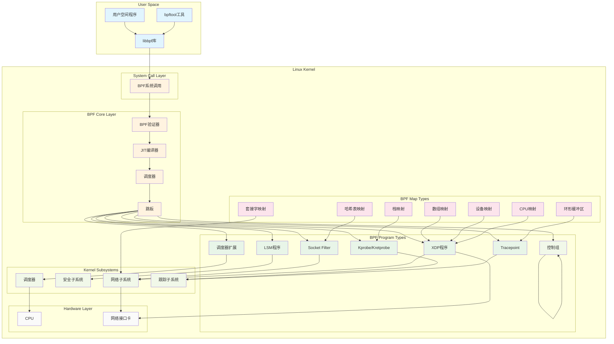
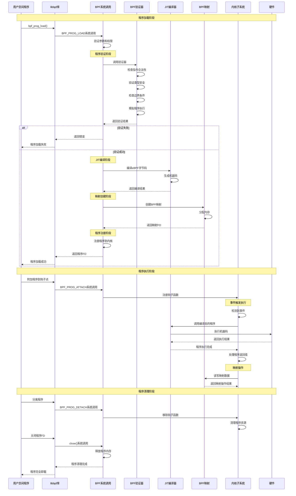
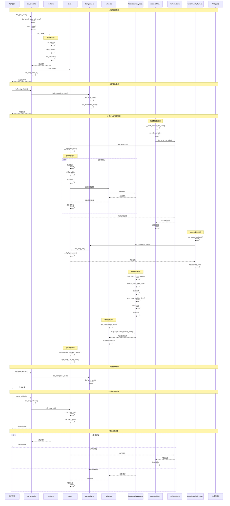

# Linux Kernel Project eBPF Related Code Analysis

### 1. Core eBPF Implementation Files

#### Main Header Files
- **`include/linux/bpf.h`** - eBPF core header file, defines all eBPF related data structures, function prototypes and macros
- **`include/uapi/linux/bpf.h`** - Userspace API header file
- **`include/linux/lsm/bpf.h`** - LSM (Linux Security Module) eBPF related definitions
- **`include/net/netns/bpf.h`** - Network namespace eBPF related definitions

#### Core Implementation Directory
- **`kernel/bpf/`** - eBPF core implementation directory, contains the following important files:

**Core System Calls and Program Management:**
- `kernel/bpf/syscall.c` (6198 lines) - eBPF system call implementation
- `kernel/bpf/core.c` (3195 lines) - eBPF core functionality implementation
- `kernel/bpf/helpers.c` (3465 lines) - eBPF helper functions implementation

**Verifier:**
- `kernel/bpf/verifier.c` (24207 lines) - eBPF program verifier, ensures program safety

**Map Type Implementations:**
- `kernel/bpf/hashtab.c` (2629 lines) - Hash table map implementation
- `kernel/bpf/arraymap.c` - Array map implementation
- `kernel/bpf/devmap.c` (1171 lines) - Device map implementation
- `kernel/bpf/cpumap.c` (815 lines) - CPU map implementation
- `kernel/bpf/ringbuf.c` (802 lines) - Ring buffer implementation
- `kernel/bpf/stackmap.c` (763 lines) - Stack map implementation

**BTF (BPF Type Format) Support:**
- `kernel/bpf/btf.c` (246KB) - BTF core implementation
- `kernel/bpf/btf_iter.c` - BTF iterator

**Other Important Components:**
- `kernel/bpf/trampoline.c` (1139 lines) - Trampoline implementation
- `kernel/bpf/dispatcher.c` (172 lines) - Dispatcher implementation
- `kernel/bpf/offload.c` (879 lines) - Offload support
- `kernel/bpf/token.c` (256 lines) - Token management

### 2. Network Related eBPF Implementation

#### Network Subsystem Integration
- **`net/bpf/`** - Network eBPF implementation
    - `net/bpf/test_run.c` (1769 lines) - Test run framework
    - `net/bpf/bpf_dummy_struct_ops.c` (323 lines) - Virtual struct operations

#### 网络协议栈集成
- **`net/core/`** - 核心网络功能中的eBPF集成
- **`net/socket.c`** - 套接字层eBPF支持
- **`net/filter/`** - 网络过滤器eBPF支持

### 3. File System eBPF Support

- **`fs/bpf_fs_kfuncs.c`** - BPF filesystem kernel functions implementation
    - Implements filesystem-related eBPF kernel functions
    - Supports file operations, path resolution, extended attributes, etc.

### 4. Tools and Libraries

#### Userspace Tools
- **`tools/bpf/`** - eBPF toolset
    - `tools/bpf/bpftool/` - Main eBPF management tool
    - `tools/bpf/bpf_dbg.c` (1399 lines) - eBPF debugger
    - `tools/bpf/bpf_jit_disasm.c` (333 lines) - JIT disassembler

#### Userspace Libraries
- **`tools/lib/bpf/`** - libbpf library implementation
    - `tools/lib/bpf/libbpf.c` (14174 lines) - Main library implementation
    - `tools/lib/bpf/libbpf.h` (1948 lines) - Library header file
    - `tools/lib/bpf/btf.c` (5833 lines) - BTF library implementation
    - `tools/lib/bpf/linker.c` (3115 lines) - Linker implementation

### 5. Documentation

- **`Documentation/bpf/`** - Complete eBPF documentation
    - `Documentation/bpf/verifier.rst` (825 lines) - Verifier documentation
    - `Documentation/bpf/btf.rst` (1211 lines) - BTF documentation
    - `Documentation/bpf/kfuncs.rst` (696 lines) - Kernel functions documentation
    - Detailed documentation for various map types and program types

### 6. Testing and Examples

- **`samples/bpf/`** - eBPF example programs
- **`tools/testing/selftests/bpf/`** - eBPF self-test suite

### 7. Architecture-Specific Implementation

- **`arch/x86/bpf/`** - x86 architecture-specific eBPF implementation
- **`arch/arm64/bpf/`** - ARM64 architecture-specific eBPF implementation
- eBPF JIT compiler implementations for other architectures

### 8. Main Functional Features

#### Program Type Support
- Socket Filter
- Kprobe/Kretprobe
- Tracepoint
- XDP (eXpress Data Path)
- Cgroup
- LSM (Linux Security Module)
- Scheduler Extensions (Sched Ext)

#### Map Type Support
- Hash Table
- Array
- Ring Buffer
- Stack Map
- Device Map
- CPU Map
- Socket Map

#### Security Features
- Program verifier ensures type safety
- Boundary checking prevents out-of-bounds access
- Loop detection prevents infinite loops
- Permission checking controls access rights

### 9. Key Design Characteristics

1. **Safety First** - All eBPF programs must pass strict verifier checks
2. **High Performance** - JIT compilation converts eBPF bytecode to native machine code
3. **Extensibility** - Modular design supports new program types and map types
4. **User Friendly** - Provides rich userspace tools and libraries
5. **Kernel Integration** - Deep integration into various Linux kernel subsystems

This eBPF implementation is one of the most complex and feature-rich subsystems in the Linux kernel, providing powerful programmability and extensibility for the kernel while maintaining strict security guarantees.

---

## eBPF工作原理

### 1. 基本流程

```
用户程序 → eBPF字节码 → 验证器检查 → JIT编译 → 内核执行
```

### 2. 核心代码片段分析

#### 系统调用入口
```c
// kernel/bpf/syscall.c
static int bpf_prog_load(union bpf_attr *attr, bpfptr_t uattr, u32 uattr_size)
{
    enum bpf_prog_type type = attr->prog_type;
    struct bpf_prog *prog, *dst_prog = NULL;
    struct btf *attach_btf = NULL;
    struct bpf_token *token = NULL;
    
    // 1. 验证程序类型
    if (type >= ARRAY_SIZE(bpf_prog_types) || !bpf_prog_types[type])
        return -EINVAL;
    
    // 2. 分配程序结构
    prog = bpf_prog_alloc(bpf_prog_size(attr->insn_cnt), 0);
    if (IS_ERR(prog))
        return PTR_ERR(prog);
    
    // 3. 复制指令
    if (copy_from_bpfptr(prog->insns, u64_to_bpfptr(attr->insns),
                         bpf_prog_insn_size(prog)) != 0) {
        err = -EFAULT;
        goto free_prog;
    }
    
    // 4. 验证程序
    err = bpf_check(&prog, &attr, uattr, uattr_size);
    if (err < 0)
        goto free_prog;
    
    // 5. 创建文件描述符
    err = bpf_prog_new_fd(prog);
    if (err < 0)
        goto free_prog;
    
    return err;
}
```

#### 验证器核心逻辑
```c
// kernel/bpf/verifier.c
static int do_check(struct bpf_verifier_env *env)
{
    struct bpf_verifier_state *state = env->cur_state;
    struct bpf_insn *insns = env->prog->insnsi;
    struct bpf_reg_state *regs;
    int insn_cnt = env->prog->len;
    int i;
    
    for (i = 0; i < insn_cnt; i++) {
        struct bpf_insn *insn = &insns[i];
        
        // 检查指令边界
        if (i >= insn_cnt) {
            verbose(env, "invalid insn idx %d insn_cnt %d\n", i, insn_cnt);
            return -EINVAL;
        }
        
        // 验证指令
        err = check_insn(env, i);
        if (err)
            return err;
        
        // 模拟执行
        err = do_simulate(env, insn);
        if (err)
            return err;
    }
    
    return 0;
}
```

#### 映射操作示例
```c
// kernel/bpf/hashtab.c - 哈希表映射实现
static long htab_map_update_elem(struct bpf_map *map, void *key, void *value, u64 flags)
{
    struct bpf_htab *htab = container_of(map, struct bpf_htab, map);
    struct htab_elem *l_new = NULL, *l_old;
    struct hlist_nulls_head *head;
    unsigned long flags;
    struct bucket *b;
    u32 key_size, hash;
    int ret;
    
    if (unlikely(flags > BPF_EXIST))
        return -EINVAL;
    
    WARN_ON_ONCE(!rcu_read_lock_held());
    
    key_size = map->key_size;
    hash = htab_map_hash(key, key_size, htab->hashrnd);
    b = __select_bucket(htab, hash);
    head = &b->head;
    
    // 查找现有元素
    l_old = lookup_elem_raw(head, hash, key, key_size);
    
    ret = check_flags(htab, l_old, map_flags);
    if (ret)
        return ret;
    
    // 分配新元素
    l_new = alloc_htab_elem(htab, key, value, key_size, hash, false, false);
    if (IS_ERR(l_new))
        return PTR_ERR(l_new);
    
    // 更新哈希表
    hlist_nulls_add_head_rcu(&l_new->hash_node, head);
    if (l_old) {
        hlist_nulls_del_rcu(&l_old->hash_node);
        free_htab_elem(htab, l_old);
    }
    
    return 0;
}
```

#### 辅助函数示例
```c
// kernel/bpf/helpers.c - 获取当前任务ID
BPF_CALL_2(bpf_get_current_pid_tgid, u64, r1, u64, r2)
{
    struct task_struct *task = current;
    
    if (unlikely(!task))
        return -EINVAL;
    
    return ((u64) task->tgid << 32) | task->pid;
}

// 获取当前用户ID
BPF_CALL_2(bpf_get_current_uid_gid, u64, r1, u64, r2)
{
    struct task_struct *task = current;
    kuid_t uid;
    kgid_t gid;
    
    if (unlikely(!task))
        return -EINVAL;
    
    current_uid_gid(&uid, &gid);
    return ((u64) from_kgid(&init_user_ns, gid) << 32) |
           from_kuid(&init_user_ns, uid);
}
```

### 3. 程序类型和映射类型

#### 程序类型定义
```c
// include/uapi/linux/bpf.h
enum bpf_prog_type {
    BPF_PROG_TYPE_UNSPEC,
    BPF_PROG_TYPE_SOCKET_FILTER,    // 套接字过滤器
    BPF_PROG_TYPE_KPROBE,           // Kprobe
    BPF_PROG_TYPE_SCHED_CLS,        // 流量控制
    BPF_PROG_TYPE_SCHED_ACT,        // 流量动作
    BPF_PROG_TYPE_TRACEPOINT,       // 跟踪点
    BPF_PROG_TYPE_XDP,              // XDP
    BPF_PROG_TYPE_PERF_EVENT,       // 性能事件
    BPF_PROG_TYPE_CGROUP_SKB,       // Cgroup套接字
    BPF_PROG_TYPE_CGROUP_SOCK,      // Cgroup套接字
    BPF_PROG_TYPE_LWT_IN,           // LWT输入
    BPF_PROG_TYPE_LWT_OUT,          // LWT输出
    BPF_PROG_TYPE_LWT_XMIT,         // LWT传输
    BPF_PROG_TYPE_SOCK_OPS,         // 套接字操作
    BPF_PROG_TYPE_SK_SKB,           // 套接字SKB
    BPF_PROG_TYPE_CGROUP_DEVICE,    // Cgroup设备
    BPF_PROG_TYPE_SK_MSG,           // 套接字消息
    BPF_PROG_TYPE_RAW_TRACEPOINT,   // 原始跟踪点
    BPF_PROG_TYPE_CGROUP_SOCK_ADDR, // Cgroup套接字地址
    BPF_PROG_TYPE_LWT_SEG6LOCAL,    // LWT SEG6本地
    BPF_PROG_TYPE_LIRC_MODE2,       // LIRC模式2
    BPF_PROG_TYPE_SK_REUSEPORT,     // 套接字重用端口
    BPF_PROG_TYPE_FLOW_DISSECTOR,   // 流解析器
    BPF_PROG_TYPE_CGROUP_SYSCTL,    // Cgroup系统控制
    BPF_PROG_TYPE_RAW_TRACEPOINT_WRITABLE, // 可写原始跟踪点
    BPF_PROG_TYPE_CGROUP_SOCKOPT,   // Cgroup套接字选项
    BPF_PROG_TYPE_TRACING,          // 跟踪
    BPF_PROG_TYPE_STRUCT_OPS,       // 结构体操作
    BPF_PROG_TYPE_EXT,              // 扩展
    BPF_PROG_TYPE_LSM,              // LSM
    BPF_PROG_TYPE_SK_LOOKUP,        // 套接字查找
    BPF_PROG_TYPE_SYSCALL,          // 系统调用
};
```

#### 映射类型定义
```c
enum bpf_map_type {
    BPF_MAP_TYPE_UNSPEC,
    BPF_MAP_TYPE_HASH,              // 哈希表
    BPF_MAP_TYPE_ARRAY,             // 数组
    BPF_MAP_TYPE_PROG_ARRAY,        // 程序数组
    BPF_MAP_TYPE_PERF_EVENT_ARRAY,  // 性能事件数组
    BPF_MAP_TYPE_PERCPU_HASH,       // 每CPU哈希表
    BPF_MAP_TYPE_PERCPU_ARRAY,      // 每CPU数组
    BPF_MAP_TYPE_STACK_TRACE,       // 栈跟踪
    BPF_MAP_TYPE_CGROUP_ARRAY,      // Cgroup数组
    BPF_MAP_TYPE_LRU_HASH,          // LRU哈希表
    BPF_MAP_TYPE_LRU_PERCPU_HASH,   // LRU每CPU哈希表
    BPF_MAP_TYPE_LPM_TRIE,          // LPM Trie
    BPF_MAP_TYPE_ARRAY_OF_MAPS,     // 映射数组
    BPF_MAP_TYPE_HASH_OF_MAPS,      // 映射哈希表
    BPF_MAP_TYPE_DEVMAP,            // 设备映射
    BPF_MAP_TYPE_SOCKMAP,           // 套接字映射
    BPF_MAP_TYPE_CPUMAP,            // CPU映射
    BPF_MAP_TYPE_XSKMAP,            // XSK映射
    BPF_MAP_TYPE_SOCKHASH,          // 套接字哈希表
    BPF_MAP_TYPE_CGROUP_STORAGE,    // Cgroup存储
    BPF_MAP_TYPE_REUSEPORT_SOCKARRAY, // 重用端口套接字数组
    BPF_MAP_TYPE_PERCPU_CGROUP_STORAGE, // 每CPU Cgroup存储
    BPF_MAP_TYPE_QUEUE,             // 队列
    BPF_MAP_TYPE_STACK,             // 栈
    BPF_MAP_TYPE_SK_STORAGE,        // 套接字存储
    BPF_MAP_TYPE_DEVMAP_HASH,       // 设备映射哈希表
    BPF_MAP_TYPE_STRUCT_OPS,        // 结构体操作
    BPF_MAP_TYPE_RINGBUF,           // 环形缓冲区
    BPF_MAP_TYPE_INODE_STORAGE,     // 索引节点存储
    BPF_MAP_TYPE_TASK_STORAGE,      // 任务存储
    BPF_MAP_TYPE_BLOOM_FILTER,      // 布隆过滤器
    BPF_MAP_TYPE_USER_RINGBUF,      // 用户环形缓冲区
    BPF_MAP_TYPE_CGRP_STORAGE,      // Cgroup存储
};
```

### 4. 关键特性

1. **安全性**: 严格的验证器确保程序安全
2. **性能**: JIT编译为本地机器码
3. **可扩展性**: 支持多种程序类型和映射类型
4. **内核集成**: 深度集成到Linux内核子系统

这个架构使得eBPF成为Linux内核中最强大的可编程接口之一，广泛应用于网络、安全、性能分析等领域。

---

你说得对，让我补充eBPF程序执行阶段的内核代码详细说明：

## eBPF程序执行阶段的内核代码分析

### 1. 程序执行入口 - 跳板机制

```c
// kernel/bpf/trampoline.c - 跳板执行机制
struct bpf_trampoline {
    struct hlist_node hlist;
    struct ftrace_ops fops;
    struct bpf_prog *prog;
    void *image;
    void *image_end;
    u64 key;
    struct bpf_tramp_links {
        struct bpf_tramp_link *links[BPF_MAX_TRAMP_PROGS];
        int nr_links;
    } *tlinks;
    struct mutex mutex;
    refcount_t refcnt;
    u32 flags;
    u64 bpf_cookie;
};

// 程序执行的核心函数
static void __bpf_prog_enter(void)
{
    rcu_read_lock();
    migrate_disable();
}

static void __bpf_prog_exit(struct bpf_prog *prog, struct bpf_tramp_run_ctx *run_ctx)
{
    rcu_read_unlock();
    migrate_enable();
}

// 跳板执行函数
static void bpf_trampoline_enter(void *data)
{
    struct bpf_tramp_run_ctx *run_ctx = data;
    struct bpf_prog *prog = run_ctx->prog;
    
    __bpf_prog_enter();
    
    // 执行eBPF程序
    run_ctx->ret = bpf_prog_run(prog, run_ctx->args);
    
    __bpf_prog_exit(prog, run_ctx);
}
```

### 2. 程序执行核心 - bpf_prog_run

```c
// kernel/bpf/core.c - 程序执行核心
static u64 bpf_prog_run_pin_on_cpu(const struct bpf_prog *prog, const void *ctx)
{
    u32 ret;
    
    // 获取当前CPU
    preempt_disable();
    
    // 执行程序
    ret = bpf_prog_run(prog, ctx);
    
    preempt_enable();
    return ret;
}

// 实际的程序执行函数
static u64 ___bpf_prog_run(u64 *regs, const struct bpf_insn *insn)
{
    u64 stack[MAX_BPF_STACK / sizeof(u64)];
    u64 regs[MAX_BPF_REG];
    const void *ptr;
    int off;
    
    // 初始化寄存器
    regs[0] = (u64) (unsigned long) ctx;
    
    // 指令执行循环
    select:
        if (unlikely(pc >= insn_cnt))
            return 0;
        
        insn = &insns[pc];
        switch (insn->code) {
        case BPF_ALU64 | BPF_MOV | BPF_X:
            // 寄存器移动
            regs[insn->dst_reg] = regs[insn->src_reg];
            break;
            
        case BPF_ALU64 | BPF_ADD | BPF_X:
            // 寄存器加法
            regs[insn->dst_reg] += regs[insn->src_reg];
            break;
            
        case BPF_LDX | BPF_MEM | BPF_B:
            // 内存加载
            off = insn->off;
            ptr = (void *) (unsigned long) regs[insn->src_reg];
            regs[insn->dst_reg] = *(u8 *) (ptr + off);
            break;
            
        case BPF_STX | BPF_MEM | BPF_B:
            // 内存存储
            off = insn->off;
            ptr = (void *) (unsigned long) regs[insn->dst_reg];
            *(u8 *) (ptr + off) = (u8) regs[insn->src_reg];
            break;
            
        case BPF_JMP | BPF_JA:
            // 无条件跳转
            pc += insn->off;
            goto select;
            
        case BPF_JMP | BPF_JNE | BPF_K:
            // 条件跳转
            if (regs[insn->dst_reg] != insn->imm)
                pc += insn->off;
            else
                pc++;
            goto select;
            
        case BPF_CALL:
            // 函数调用
            regs[BPF_REG_0] = bpf_call_func(insn->imm, regs);
            break;
            
        case BPF_EXIT:
            // 程序退出
            return regs[BPF_REG_0];
        }
        
        pc++;
        goto select;
}
```

### 3. 网络数据包处理 - XDP执行

```c
// net/core/dev.c - XDP程序执行
static int __netif_receive_skb_core(struct sk_buff **pskb, bool pfmemalloc)
{
    struct sk_buff *skb = *pskb;
    struct net_device *orig_dev;
    struct packet_type *pt_prev = NULL;
    struct net_device *null_or_dev;
    int ret = NET_RX_DROP;
    
    // XDP程序执行
    if (static_branch_unlikely(&generic_xdp_needed_key)) {
        int ret2;
        
        preempt_disable();
        ret2 = do_xdp_generic(rcu_dereference(skb->dev->xdp_prog), skb);
        preempt_enable();
        
        if (ret2 != XDP_PASS) {
            ret = NET_RX_DROP;
            goto out;
        }
    }
    
    // 继续正常的网络处理流程
    ...
}

// net/core/filter.c - XDP程序执行
static u32 bpf_prog_run_xdp(const struct bpf_prog *prog, struct xdp_buff *xdp)
{
    struct bpf_prog_stats *stats;
    u32 ret;
    
    // 获取统计信息
    stats = this_cpu_ptr(prog->stats);
    
    // 执行XDP程序
    ret = bpf_prog_run(prog, xdp);
    
    // 更新统计信息
    if (ret == XDP_PASS) {
        stats->nsecs += bpf_prog_run_xdp_time(prog);
        stats->cnt++;
    } else {
        stats->misses++;
    }
    
    return ret;
}
```

### 4. 套接字过滤器执行

```c
// net/core/filter.c - 套接字过滤器执行
int sk_filter(struct sock *sk, struct sk_buff *skb)
{
    struct bpf_prog *prog;
    int ret;
    
    // 获取附加的过滤器程序
    prog = rcu_dereference(sk->sk_filter);
    if (!prog)
        return 0;
    
    // 执行过滤器程序
    ret = bpf_prog_run_save_cb(prog, skb);
    
    return ret == 0 ? -EPERM : 0;
}

// 套接字过滤器程序执行
static u32 bpf_prog_run_save_cb(const struct bpf_prog *prog, struct sk_buff *skb)
{
    u32 ret;
    
    // 保存回调函数
    bpf_compute_data_end(skb);
    
    // 执行程序
    ret = bpf_prog_run(prog, skb);
    
    // 恢复回调函数
    bpf_compute_data_pointers(skb);
    
    return ret;
}
```

### 5. Kprobe程序执行

```c
// kernel/trace/bpf_trace.c - Kprobe程序执行
static void bpf_kprobe_callback(struct kprobe *p, struct pt_regs *regs)
{
    struct bpf_kprobe *bpf_kp = container_of(p, struct bpf_kprobe, kp);
    struct bpf_prog *prog = bpf_kp->prog;
    struct bpf_tramp_run_ctx run_ctx = {};
    
    // 准备执行上下文
    run_ctx.prog = prog;
    run_ctx.args[0] = (u64) regs;
    
    // 执行程序
    bpf_trampoline_enter(&run_ctx);
}

// Kprobe程序执行
static u32 bpf_kprobe_run(struct bpf_prog *prog, struct pt_regs *regs)
{
    u32 ret;
    
    // 设置寄存器上下文
    regs->ax = 0;
    
    // 执行程序
    ret = bpf_prog_run(prog, regs);
    
    return ret;
}
```

### 6. 映射操作执行

```c
// kernel/bpf/hashtab.c - 映射查找操作
static void *htab_map_lookup_elem(struct bpf_map *map, void *key)
{
    struct bpf_htab *htab = container_of(map, struct bpf_htab, map);
    struct hlist_nulls_head *head;
    struct htab_elem *l;
    u32 hash, key_size;
    
    WARN_ON_ONCE(!rcu_read_lock_held());
    
    key_size = map->key_size;
    hash = htab_map_hash(key, key_size, htab->hashrnd);
    head = select_bucket(htab, hash);
    
    // 查找元素
    l = lookup_nulls_elem_raw(head, hash, key, key_size, htab->n_buckets);
    
    return l;
}

// kernel/bpf/arraymap.c - 数组映射更新
static long array_map_update_elem(struct bpf_map *map, void *key, void *value, u64 flags)
{
    struct bpf_array *array = container_of(map, struct bpf_array, map);
    u32 index = *(u32 *)key;
    char *val;
    
    if (unlikely(index >= array->map.max_entries))
        return -E2BIG;
    
    if (unlikely(map_flags > BPF_EXIST))
        return -EINVAL;
    
    val = array->value + array->elem_size * index;
    
    // 更新元素
    if (map_flags & BPF_NOEXIST)
        return -EEXIST;
    
    memcpy(val, value, array->elem_size);
    
    return 0;
}
```

### 7. 辅助函数执行

```c
// kernel/bpf/helpers.c - 辅助函数执行
static const struct bpf_func_proto bpf_map_lookup_elem_proto = {
    .func = bpf_map_lookup_elem,
    .gpl_only = false,
    .pkt_access = true,
    .ret_type = RET_PTR_TO_MAP_VALUE_OR_NULL,
    .arg1_type = ARG_CONST_MAP_PTR,
    .arg2_type = ARG_PTR_TO_MAP_KEY,
};

// 映射查找辅助函数
BPF_CALL_2(bpf_map_lookup_elem, struct bpf_map *, map, void *, key)
{
    WARN_ON_ONCE(!rcu_read_lock_held());
    return (unsigned long) map->ops->map_lookup_elem(map, key);
}

// 获取当前任务ID辅助函数
BPF_CALL_2(bpf_get_current_pid_tgid, u64, r1, u64, r2)
{
    struct task_struct *task = current;
    
    if (unlikely(!task))
        return -EINVAL;
    
    return ((u64) task->tgid << 32) | task->pid;
}
```

### 8. 程序执行统计和监控

```c
// kernel/bpf/core.c - 程序执行统计
void bpf_prog_inc_misses_counter(struct bpf_prog *prog)
{
    struct bpf_prog_stats *stats;
    
    stats = this_cpu_ptr(prog->stats);
    u64_stats_update_begin(&stats->syncp);
    stats->misses++;
    u64_stats_update_end(&stats->syncp);
}

// 程序执行时间统计
static u64 bpf_prog_run_xdp_time(const struct bpf_prog *prog)
{
    u64 start = ktime_get_ns();
    u64 end = ktime_get_ns();
    
    return end - start;
}
```

### 关键执行特点：

1. **原子性执行**：程序执行期间禁用抢占，确保原子性
2. **上下文切换**：不同程序类型有不同的执行上下文
3. **错误处理**：程序执行失败时有完善的错误处理机制
4. **性能监控**：内置统计和性能监控功能
5. **内存安全**：严格的边界检查和类型验证
6. **并发控制**：使用RCU和锁机制保证并发安全

这些代码展示了eBPF程序在内核中的实际执行过程，体现了其作为内核可编程接口的强大功能和安全性设计。

---

基于对Linux kernel eBPF代码的分析，我来为你绘制两张UML图：

## 1. UML Deployment Diagram - eBPF模块在Linux Kernel中的部署结构



## 2. UML Sequence Diagram - eBPF程序加载执行过程



## 关键说明

### Deployment Diagram特点：
1. **分层架构**：展示了从用户空间到硬件层的完整部署结构
2. **模块化设计**：eBPF核心层、程序类型、映射类型清晰分离
3. **子系统集成**：显示eBPF如何与Linux内核各子系统集成
4. **硬件抽象**：包含CPU和网络接口卡的硬件层

### Sequence Diagram特点：
1. **完整生命周期**：从程序加载到卸载的完整流程
2. **错误处理**：包含验证失败的分支处理
3. **异步执行**：展示事件驱动的程序执行模式
4. **资源管理**：包含映射操作和资源清理

这两张图完整描述了eBPF在Linux内核中的架构设计和执行流程，体现了其作为内核可编程接口的核心特性。

---

基于内核代码分析，我来绘制一张详细的eBPF程序执行时序图：



## 关键函数调用说明：

### 1. 程序加载阶段
- `bpf_prog_load()` - 系统调用入口
- `bpf_check()` - 程序验证
- `do_check()` - 验证器核心逻辑
- `bpf_prog_alloc()` - 分配程序内存

### 2. 程序执行阶段
- `bpf_trampoline_enter()` - 跳板执行入口
- `bpf_prog_run()` - 程序执行核心
- `___bpf_prog_run()` - 指令执行循环
- `bpf_prog_run_xdp()` - XDP程序执行

### 3. 映射操作阶段
- `htab_map_lookup_elem()` - 哈希表查找
- `array_map_update_elem()` - 数组更新
- `bpf_map_lookup_elem()` - 辅助函数调用

### 4. 辅助函数执行
- `bpf_get_current_pid_tgid()` - 获取进程ID
- `bpf_map_lookup_elem()` - 映射查找
- `bpf_ktime_get_ns()` - 获取时间戳

### 5. 统计和监控
- `bpf_prog_inc_misses_counter()` - 统计未命中
- `bpf_prog_run_xdp_time()` - 执行时间统计

这个时序图展示了eBPF程序从加载到执行再到清理的完整生命周期，体现了内核中eBPF系统的复杂性和完整性。每个阶段都有相应的错误处理机制，确保系统的稳定性和安全性。