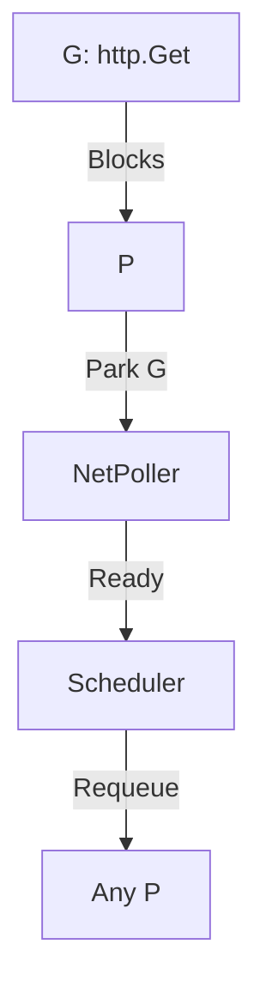

### **The Work-Stealing Model in Go (Golang)**

Go's **work-stealing scheduler** is a key feature that enables efficient **concurrency** with goroutines. It optimizes CPU usage by dynamically balancing workloads across threads.

---

## **1. Basics of Go Scheduler**
- **Goroutines (G)**: Lightweight threads managed by Go (not OS threads).
- **OS Threads (M)**: Real threads that execute goroutines.
- **Logical Processors (P)**: Manage a queue of goroutines and assign them to threads.

Go’s scheduler uses **M:P:N threading model**:
- **M** (Machine) = OS thread
- **P** (Processor) = Context (max set by `GOMAXPROCS`)
- **G** (Goroutine) = Concurrent task

---

## **2. How Work-Stealing Works**

### **Step 1: Goroutine Queue per P**
Each **P** maintains a **local run queue** of goroutines.
- New goroutines go into the **current P’s queue** (FIFO).

### **Step 2: Idle P Steals Work**
If a **P** finishes its queue:
1. Checks the **global run queue** (rarely used).
2. **Steals half** of another **P’s local queue** (random victim).


### **Step 3: Thread Parking**
If no work is found:
- The **M** (thread) is **parked** (released to the OS).
- Reactivated when new goroutines appear.

---

## **3. Why Work-Stealing?**
✅ **Benefits**:
- **Load Balancing**: Distributes work evenly across CPUs.
- **Low Latency**: Reduces goroutine starvation.
- **Scalability**: Handles 1000s of goroutines efficiently.

❌ **Without It**:
- Some CPU cores sit idle while others are overloaded.

---

## **4. Example in Code**
```go
package main

import (
	"fmt"
	"runtime"
	"time"
)

func task(name string) {
	for i := 0; i < 3; i++ {
		fmt.Printf("%s: %d\n", name, i)
		time.Sleep(100 * time.Millisecond)
	}
}

func main() {
	runtime.GOMAXPROCS(2) // 2 Ps for demo

	go task("Goroutine 1")
	go task("Goroutine 2")
	go task("Goroutine 3")

	time.Sleep(1 * time.Second)
}
```
**Output (Possible Interleaving)**:
```
Goroutine 1: 0  
Goroutine 3: 0  
Goroutine 2: 0  
Goroutine 1: 1  
...  
```
- The scheduler dynamically assigns goroutines to **Ps**.

---

## **5. Key Takeaways**
1. **Work-stealing** ensures no CPU core is left idle.
2. **Local queues** reduce lock contention.
3. **Global queue** is a fallback (rarely used).

Go’s scheduler is why **goroutines scale better than OS threads**!

Want a deep dive into **Go’s scheduler internals**? Let me know! 🚀

---

### **Deep Dive into Go's Scheduler Internals**
Go's scheduler is the secret sauce behind goroutine efficiency. Let's dissect its core mechanics, including **work-stealing**, **sysmon**, **network poller**, and **blocking handling**.

---

## **1. Core Components (Recap)**
| Component  | Role                                                                 |
|------------|----------------------------------------------------------------------|
| **G**      | Goroutine (lightweight thread).                                      |
| **M**      | OS thread (Machine). Bound to a P for execution.                     |
| **P**      | Logical Processor (context). Holds a local runqueue of Gs.           |
| **Sched**  | Global scheduler state (handles global runqueue, idle Ps/Ms).        |

---

## **2. Work-Stealing Algorithm (Detailed)**
### **When a P’s Local Runqueue is Empty:**
1. **Step 1:** Check the **global runqueue** (for high-priority or newly created Gs).
2. **Step 2:** Perform **work-stealing**:
    - Randomly select another **P** (victim).
    - Steal **half** of its local runqueue (lock-free atomic ops).
    - If victim’s queue is empty, repeat.

```go
// Pseudocode for work-stealing (simplified)
func stealWork() {
    for {
        victim := randomP()
        if !victim.runqueue.empty() {
            batch := victim.runqueue.takeHalf()
            return batch
        }
    }
}
```

### **Why Half?**
- Prevents **thundering herd** (all Ps stealing from one victim).
- Balances fairness vs. overhead.

---

## **3. System Monitor (`sysmon`)**
A special **background thread** that:  
✅ **Detects deadlocks** (e.g., all goroutines blocked).  
✅ **Retakes Ps** from long-running Gs (10ms+ preemption).  
✅ **Handles network polling** (wakes Gs on I/O events).

```go
// In runtime/proc.go
func sysmon() {
    for {
        // Check for deadlocks
        if noRunningGs() {
            throw("deadlock!")
        }
        // Preempt long-running Gs
        preemptM(m)
        // Network poller wakeups
        pollNetwork()
    }
}
```

---

## **4. Network Poller Integration**
- **Non-blocking I/O:** When a goroutine performs I/O (e.g., `http.Get`):
    1. G is **parked** (removed from P’s runqueue).
    2. The OS notifies Go when I/O is ready (epoll/kqueue).
    3. **Network poller** wakes the G and requeues it.



---

## **5. Blocking System Calls**
When a G calls **blocking OS code** (e.g., `file.Read`):
1. The **M detaches from its P** (so P can keep running other Gs).
2. The **M blocks in the OS**.
3. When the syscall returns:
    - M tries to reattach to **any idle P**.
    - If no P is free, G goes to the **global runqueue**.

```go
// Example: Blocking syscall
fd, _ := os.Open("file.txt")
buf := make([]byte, 100)
n, _ := fd.Read(buf)  // M detaches from P here
```

---

## **6. Preemption (Cooperative vs. Forced)**
- **Cooperative:** Goroutines yield voluntarily (e.g., `time.Sleep`, channel ops).
- **Forced:** `sysmon` preempts Gs running for **>10ms** (since Go 1.14).
    - Uses **async signals** (SIGURG on Unix) to interrupt long-running Gs.

```go
// Example: Preemption point
func longTask() {
    for i := 0; i < 1e9; i++ {
        // No preemption point (pre-Go 1.14: would hog P)
        // Since Go 1.14: async preemption possible
    }
}
```

---

## **7. Performance Optimizations**
### **a. Lock-Free Structures**
- Local runqueues use **lock-free rings** (no contention between Ps).
- Global runqueue uses **atomic operations**.

### **b. Spinning Threads**
- An **M** without work briefly "spins" (checks for new Gs) before parking.
- Reduces wake-up latency for new Gs.

### **c. Cache Locality**
- Ps **cache** their Gs to avoid stealing (when possible).

---

## **8. Debugging the Scheduler**
### **a. GODEBUG Flags**
```bash
GODEBUG=schedtrace=1000,scheddetail=1 ./myprogram
```
Outputs:
```
SCHED 0ms: gomaxprocs=4 idleprocs=2 threads=3 spinningthreads=1 ...
```

### **b. Execution Tracer**
```go
import "runtime/trace"
func main() {
    trace.Start(os.Stderr)
    defer trace.Stop()
    // Your code
}
```
Visualize with:
```bash
go tool trace trace.out
```

---

## **9. Key Takeaways**
1. **Work-stealing** balances load across Ps.
2. **Sysmon** handles preemption, I/O, and deadlocks.
3. **Network poller** makes I/O non-blocking.
4. **Preemption** prevents goroutine monopolization.

Go’s scheduler is why you can spawn **1M goroutines** without melting your CPU!

Want to explore **specific edge cases** (e.g., `GOMAXPROCS=1`, CGO interactions)? Ask away! 🚀

