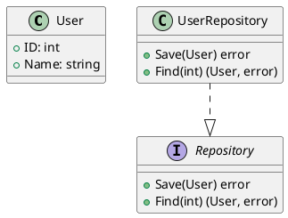

# Determining if a Go Struct Implements an Interface

There are several ways to check if a Go struct implements an interface, both at compile-time and at runtime.

## Compile-Time Checks

### 1. Assignment Check (Most Common)

```go
var _ MyInterface = (*MyStruct)(nil)
```

This creates a nil pointer of your struct type and tries to assign it to the interface. If the struct doesn't implement the interface, you'll get a compile-time error.

Example:
```go
type Speaker interface {
    Speak() string
}

type Dog struct{}

// Uncomment to see the compile error
// var _ Speaker = (*Dog)(nil)  // Error: *Dog doesn't implement Speaker

// After implementing the method:
func (d *Dog) Speak() string { return "Woof!" }
var _ Speaker = (*Dog)(nil)  // Now compiles successfully
```

### 2. Using Type Assertion in Code

```go
func checkImplementation(s MyStruct) {
    if _, ok := interface{}(s).(MyInterface); ok {
        fmt.Println("Implements MyInterface")
    } else {
        fmt.Println("Does NOT implement MyInterface")
    }
}
```

## Runtime Checks

### 1. Type Assertion

```go
func isImplementation(obj interface{}, iface interface{}) bool {
    ifaceType := reflect.TypeOf(iface).Elem()
    objType := reflect.TypeOf(obj)
    
    return objType.Implements(ifaceType)
}

// Usage:
var s Speaker
fmt.Println(isImplementation(&Dog{}, &s))  // true
```

### 2. Using Reflection

```go
func implements(obj interface{}, iface interface{}) bool {
    ifaceType := reflect.TypeOf(iface).Elem()
    objType := reflect.TypeOf(obj)
    
    if objType.Implements(ifaceType) {
        return true
    }
    
    // Check if pointer to type implements interface
    if reflect.PtrTo(objType).Implements(ifaceType) {
        return true
    }
    
    return false
}
```

## IDE/Tool Support

Most modern Go IDEs (VS Code with Go plugin, GoLand) will:
1. Show interface implementation errors during development
2. Provide quick fixes to implement missing methods
3. Show interface satisfaction through code lenses

## Important Notes

1. **Pointer vs Value Receivers**:
    - `(*MyStruct)(nil)` checks if the pointer type implements the interface
    - `var _ MyInterface = MyStruct{}` checks if the value type implements it

2. **Interface Compliance**:
    - A type implements an interface by implementing all its methods
    - The method signatures must match exactly (including pointer/value receivers)

3. **Empty Interface**:
    - All types implement the empty interface `interface{}` (or `any` in Go 1.18+)

The compile-time assignment check is generally preferred as it catches issues early in the development process.

---

# Tools to Visualize Go Structs and Interfaces

Several tools can help visualize Go code structures, including relationships between structs and interfaces. Here are the best options:

## 1. **GoCallVis** (Dependency Graph Visualization)
- Visualizes call graphs and package dependencies
- Can show relationships between structs and interfaces
- Installation:
  ```bash
  go install github.com/ofabry/go-callvis@latest
  ```
- Usage:
  ```bash
  go-callvis -focus=YourPackage -group=pkg,type ./...
  ```

## 2. **PlantUML with Go Diagrams**
- Generate UML diagrams from Go code
- Works with VS Code PlantUML extension
- Example usage with [go-plantuml](https://github.com/jfeliu007/goplantuml):
  ```bash
  go install github.com/jfeliu007/goplantuml/cmd/goplantuml@latest
  goplantuml -recursive . > diagram.puml
  ```

## 3. **GoUML** (Class Diagrams)
- Generates UML class diagrams
- Shows inheritance (embedding) and interface implementation
- Installation:
  ```bash
  go install github.com/nsf/gouml@latest
  ```
- Usage:
  ```bash
  gouml -recursive -output diagram.svg ./...
  ```

## 4. **D2** (Modern Diagramming Tool)
- Text-to-diagram tool with Go support
- Example workflow:
    1. Generate structure with [go-diagrams](https://github.com/blushft/go-diagrams)
    2. Render with D2

## 5. **VS Code Extensions**
- **Go Graphviz Visualizer**: Shows package dependencies
- **Code Outline**: Shows struct/interface relationships
- **Go Diagrams**: Generates diagrams from code

## 6. **GoStruct2Interface** (Specialized for Interfaces)
- Shows which structs implement which interfaces
- Installation:
  ```bash
  go install github.com/gregoryv/go-struct2interface@latest
  ```
- Usage:
  ```bash
  struct2interface -dir ./...
  ```

## Example Output (PlantUML)

A generated diagram might look like this:


## Online Tools
- **GoDoc.org**: Shows package documentation with relationships
- **Sourcegraph**: Browser-based code navigation with dependency graphs

For the most comprehensive visualization, I recommend combining:
1. **go-callvis** for call graphs
2. **goplantuml** for structural relationships
3. Your IDE's built-in code navigation features

---

# Using Visual Paradigm for Go Struct and Interface Visualization

Yes, **Visual Paradigm** can help visualize Go structs and interfaces, though it requires some manual work or intermediate steps since it's not a dedicated Go documentation tool. Here's how to approach it:

## Option 1: Manual Diagram Creation

1. **Create a Class Diagram**:
    - Open Visual Paradigm
    - Create a new "Class Diagram"
    - Manually add classes (structs) and interfaces
    - Add relationships (implementations, compositions)

2. **For Interface Implementation**:
    - Use the "Realization" arrow (dashed line with hollow arrowhead)
    - Right-click to show interface methods in the relationship

## Option 2: Import from Generated UML

1. **First generate UML from your Go code**:
   ```bash
   go install github.com/jfeliu007/goplantuml/cmd/goplantuml@latest
   goplantuml -recursive . > go_diagram.puml
   ```

2. **Import into Visual Paradigm**:
    - Go to "File" → "Import" → "Import PlantUML"
    - Select your `.puml` file
    - Visual Paradigm will convert it to a proper diagram

## Option 3: Using Reverse Engineering (Limited Support)

1. **Export Go code to XMI** (using tools like [go-xmi](https://github.com/fatih/goxmi))
2. **Import XMI into Visual Paradigm**:
    - "File" → "Import" → "XMI"
    - May require adjustments as Go's type system differs from UML

## Key Features in Visual Paradigm

1. **Interface Visualization**:
    - Shows interface methods
    - Displays implementing structs
    - Can generate relationship matrices

2. **Struct Details**:
    - Fields and methods display
    - Embedded struct relationships
    - Tag information display

## Limitations

1. **No Direct Go Code Analysis**:
    - Visual Paradigm doesn't natively parse Go code
    - Requires intermediate formats (PlantUML/XMI)

2. **Manual Updates**:
    - Diagrams won't auto-update with code changes
    - Requires re-importing/recreating when code changes

## Recommended Workflow

1. Use `goplantuml` to generate initial diagrams
2. Import into Visual Paradigm for polishing:
    - Layout adjustments
    - Adding documentation
    - Exporting high-quality images
3. Re-generate when major code changes occur

For teams already using Visual Paradigm, this approach provides good results. For Go-specific visualization, dedicated tools like `go-callvis` or `goplantuml` may be more efficient.