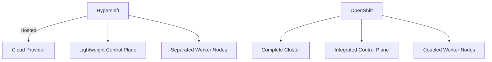

# Hypershift vs OpenShift Deep Comparison Analysis

Hypershift and OpenShift are both Kubernetes platform solutions provided by Red Hat, but they have significant differences in design philosophy and applicable scenarios. Here's a comprehensive comparison of the two:

## 1. Core Architecture Differences

| **Feature**               | **Hypershift**                          | **Traditional OpenShift**                     |
|------------------------|----------------------------------------|---------------------------------------|
| **Architecture Model**           | Hosted Control Plane    | Self-managed Control Plane                        |
| **Deployment Mode**           | Control plane and workload separation                 | Control plane and worker nodes integrated deployment           |
| **Resource Usage**           | Lightweight control plane (about 1/3 resources)             | Control plane requires 3-5 nodes                   |
| **Management Complexity**         | Operations handled by platform                         | User full management                          |



## 2. Technical Implementation Comparison

### Hypershift Key Innovations:
- **Control Plane Component Containerization**: API Server and other core components run in Pods
- **No Node Management**: Does not directly manage control plane nodes
- **Multi-tenant Sharing**: Single cluster can host multiple tenant control planes
- **Fast Deployment**: Control plane startup time <5 minutes

### Traditional OpenShift Features:
- **Complete K8s Stack**: Includes full components like etcd, ingress, monitoring
- **Strong Security Defaults**: SELinux and Pod security admission enabled by default
- **Integrated Developer Tools**: Built-in Source-to-Image build pipeline

## 3. Deployment Mode Comparison

**Hypershift Deployment Example**:
```bash
hypershift create cluster aws \
  --name my-cluster \
  --base-domain example.com \
  --aws-creds ~/.aws/credentials \
  --region us-east-1 \
  --control-plane-availability-policy HighlyAvailable
```

**Traditional OpenShift Deployment**:
```bash
openshift-install create cluster \
  --dir ./install-dir \
  --log-level=info
```

## 4. Applicable Scenario Analysis

### Hypershift Best Scenarios:
✅ **Large-scale multi-tenant environments** (like SaaS platforms)  
✅ **Need for rapid scaling** (minute-level new cluster addition)  
✅ **Reduce operational costs** (control plane managed by platform)  
✅ **Hybrid cloud deployment** (unified management of different cloud worker nodes)

### Traditional OpenShift Necessary Scenarios:
✅ **Strict compliance requirements** (like air-gapped environments)  
✅ **Full stack control needs** (need to customize all components)  
✅ **Edge computing scenarios** (need complete cluster offline operation)  
✅ **Existing OpenShift investment** (compatible with existing toolchain)

## 5. Performance and Scale Comparison

| **Metric**         | **Hypershift**              | **Traditional OpenShift**         |
|------------------|----------------------------|---------------------------|
| Maximum Clusters       | 1000+/Management Plane             | Dozens                    |
| Control Plane Cost     | Reduced 60-70%                 | Full Cost                    |
| Node Startup Time     | <2 Minutes                     | 5-10 Minutes                  |
| Supported Nodes       | 5000+/Cluster                 | 2000/Cluster                 |

## 6. Network and Security Differences

**Hypershift Network Model**:


**Security Features Comparison**:
- **Hypershift**:
    - Automatic certificate rotation
    - Control plane isolation
    - Worker node independent encryption

- **Traditional OpenShift**:
    - Cluster-wide security policies
    - Node-level security hardening
    - Complete audit logs

## 7. Operations Management Comparison

**Hypershift Operations Features**:
- Control plane automatic repair
- Version rolling updates without downtime
- Unified monitoring through management cluster

**Traditional OpenShift Operations**:
- Manual control plane upgrade handling required
- Self-monitoring of etcd health status required
- More underlying configuration options

## 8. Cost Comparison Analysis

**Typical 3-year TCO Comparison** (100-node scenario):
| **Cost Item**       | **Hypershift** | **Traditional OpenShift** |
|------------------|---------------|--------------------|
| Infrastructure         | $150k         | $200k              |
| Operations Labor         | $50k          | $150k              |
| License           | $180k         | $220k              |
| **Total**         | **$380k**     | **$570k**          |

## 9. Developer Experience

**Code Deployment Differences**:
```yaml
# Hypershift deployment example (note missing control plane configuration)
apiVersion: apps/v1
kind: Deployment
metadata:
  name: app
spec:
  template:
    spec:
      nodeSelector:
        node-role.kubernetes.io/worker: ""

# Traditional OpenShift deployment
apiVersion: apps.openshift.io/v1
kind: DeploymentConfig
metadata:
  name: app
spec:
  triggers:
    - type: ConfigChange
```

## 10. Evolution Roadmap

- **Hypershift**: Future support for more cloud providers and GitOps workflow integration
- **Traditional OpenShift**: Continuous enhancement of security and edge computing capabilities

## Decision Recommendations

**Choose Hypershift When**:
- Need to manage ultra-large scale clusters (50+)
- Want to reduce control plane operational burden
- Building multi-tenant SaaS platforms
- Need rapid elastic scaling

**Choose Traditional OpenShift When**:
- Have strict data sovereignty requirements
- Need deep customization of cluster components
- Running in offline or edge environments
- Have established mature OpenShift operations system

Both can also be used in combination, for example using Hypershift to manage cloud workloads while retaining traditional OpenShift clusters for local critical business.