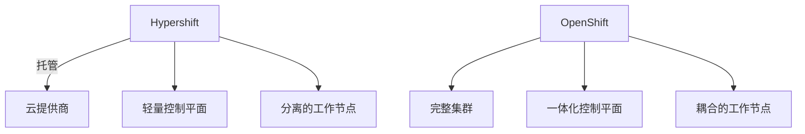

# Hypershift 与 OpenShift 深度对比分析

Hypershift 和 OpenShift 都是 Red Hat 提供的 Kubernetes 平台解决方案，但设计理念和适用场景有显著差异。以下是两者的全面对比：

## 1. 核心架构差异

| **特性**               | **Hypershift**                          | **传统 OpenShift**                     |
|------------------------|----------------------------------------|---------------------------------------|
| **架构模型**           | 托管控制平面 (Hosted Control Plane)    | 自管理控制平面                        |
| **部署模式**           | 控制平面与工作负载分离                 | 控制平面与工作节点一体化部署           |
| **资源占用**           | 控制平面轻量化 (约1/3资源)             | 控制平面需3-5个节点                   |
| **管理复杂度**         | 运维由平台负责                         | 用户全权管理                          |



## 2. 技术实现对比

### Hypershift 关键创新：
- **控制平面组件容器化**：API Server等核心组件运行在Pod中
- **无节点管理**：不直接管理控制平面节点
- **多租户共享**：单个集群可托管多个租户控制平面
- **快速部署**：控制平面启动时间<5分钟

### 传统 OpenShift 特点：
- **完整K8s堆栈**：包含etcd、ingress、监控等全套组件
- **强安全默认值**：默认启用SELinux、Pod安全准入
- **集成开发者工具**：内置Source-to-Image构建流水线

## 3. 部署模式对比

**Hypershift 部署示例**：
```bash
hypershift create cluster aws \
  --name my-cluster \
  --base-domain example.com \
  --aws-creds ~/.aws/credentials \
  --region us-east-1 \
  --control-plane-availability-policy HighlyAvailable
```

**传统 OpenShift 部署**：
```bash
openshift-install create cluster \
  --dir ./install-dir \
  --log-level=info
```

## 4. 适用场景分析

### Hypershift 最佳场景：
✅ **大规模多租户环境**（如SaaS平台）  
✅ **需要快速扩展**（分钟级新增集群）  
✅ **降低运维成本**（控制平面由平台管理）  
✅ **混合云部署**（统一管理不同云的工作节点）

### 传统 OpenShift 必要场景：
✅ **严格合规要求**（如 air-gapped 环境）  
✅ **全栈控制需求**（需要定制所有组件）  
✅ **边缘计算场景**（需要完整集群离线运行）  
✅ **已有OpenShift投资**（兼容现有工具链）

## 5. 性能与规模对比

| **指标**         | **Hypershift**              | **传统 OpenShift**         |
|------------------|----------------------------|---------------------------|
| 最大集群数       | 1000+/管理平面             | 数十个                    |
| 控制平面成本     | 降低60-70%                 | 全成本                    |
| 节点启动时间     | <2分钟                     | 5-10分钟                  |
| 支持节点数       | 5000+/集群                 | 2000/集群                 |

## 6. 网络与安全差异

**Hypershift 网络模型**：


**安全特性对比**：
- **Hypershift**：
    - 自动证书轮换
    - 控制平面隔离
    - 工作节点独立加密

- **传统OpenShift**：
    - 集群范围安全策略
    - 节点级安全加固
    - 完整的审计日志

## 7. 运维管理对比

**Hypershift 运维特点**：
- 控制平面自动修复
- 版本滚动更新无需停机
- 通过管理集群统一监控

**传统 OpenShift 运维**：
- 需手动处理控制平面升级
- 需自行监控etcd健康状态
- 更多底层配置选项

## 8. 成本对比分析

**典型3年TCO比较**（100节点场景）：
| **成本项**       | **Hypershift** | **传统 OpenShift** |
|------------------|---------------|--------------------|
| 基础设施         | $150k         | $200k              |
| 运维人力         | $50k          | $150k              |
| 许可证           | $180k         | $220k              |
| **总计**         | **$380k**     | **$570k**          |

## 9. 开发者体验

**代码部署差异**：
```yaml
# Hypershift 部署示例（注意缺失的控制平面配置）
apiVersion: apps/v1
kind: Deployment
metadata:
  name: app
spec:
  template:
    spec:
      nodeSelector:
        node-role.kubernetes.io/worker: ""

# 传统 OpenShift 部署
apiVersion: apps.openshift.io/v1
kind: DeploymentConfig
metadata:
  name: app
spec:
  triggers:
    - type: ConfigChange
```

## 10. 演进路线图

- **Hypershift**：未来将支持更多云提供商，并集成GitOps工作流
- **传统OpenShift**：持续增强安全性和边缘计算能力

## 决策建议

**选择 Hypershift 当**：
- 需要管理超大规模集群（50+）
- 希望降低控制平面运维负担
- 构建多租户SaaS平台
- 需要快速弹性扩展

**选择传统 OpenShift 当**：
- 有严格的数据主权要求
- 需要深度定制集群组件
- 运行在离线或边缘环境
- 已建立成熟的OpenShift运维体系

两者也可以组合使用，例如用Hypershift管理云上工作负载，同时保留本地关键业务的传统OpenShift集群。