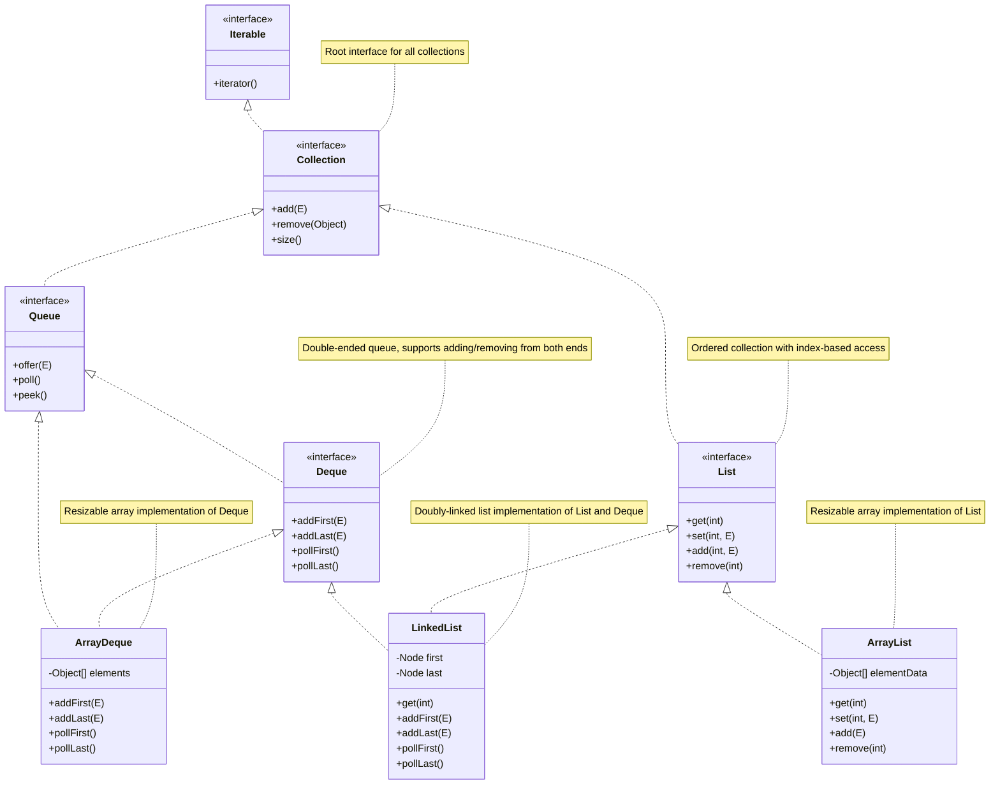

# Java的Deque和List关系图

Below is a UML class diagram in Mermaid syntax that illustrates the relationships between Java's `Deque`, `List`, `ArrayList`, and related interfaces and classes in the Java Collections Framework. The diagram includes key interfaces like `Collection`, `List`, `Deque`, and `Queue`, and concrete classes like `ArrayList`, `LinkedList`, and `ArrayDeque`, showing their inheritance and implementation relationships.

