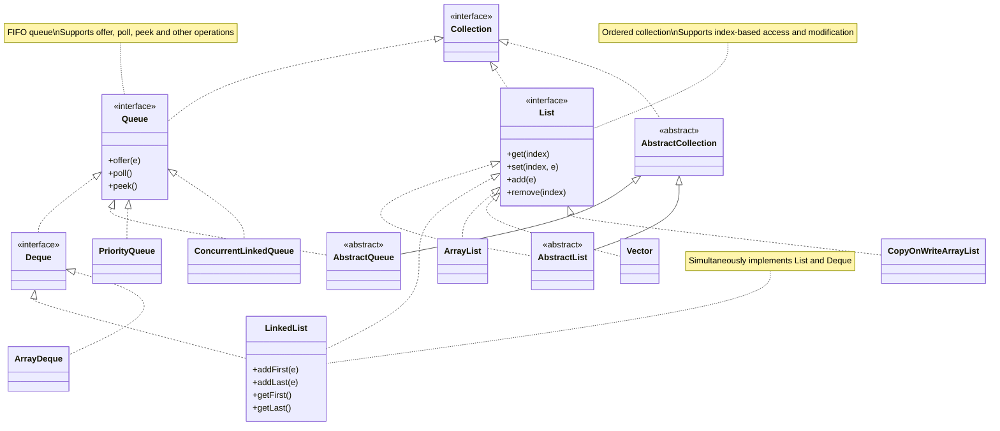

# In Java, both `Queue` and `List` are interfaces belonging to the Java Collections Framework, but they have significant differences in purpose, characteristics, and implementation methods. Here is a detailed comparison:

### 1. **Definition and Purpose**
- **`Queue`**:
    - Definition: `Queue` is the `java.util.Queue` interface, inherited from `Collection`, mainly used to represent First-In-First-Out (FIFO) data structures, suitable for processing elements in order (such as task queues, message queues).
    - Purpose: Commonly used in scenarios that require processing elements in order, such as breadth-first search (BFS), thread pool task queues, message passing, etc.
    - Typical implementations: `LinkedList` (implements `Deque`), `ArrayDeque`, `PriorityQueue` (not strictly FIFO, as it's based on priority).

- **`List`**:
    - Definition: `List` is the `java.util.List` interface, inherited from `Collection`, representing an ordered collection of elements, allowing duplicate elements, supporting index-based access.
    - Purpose: Suitable for scenarios that require accessing, inserting, and deleting elements by position, such as dynamic arrays, list data storage.
    - Typical implementations: `ArrayList`, `LinkedList`, `Vector`.

### 2. **Data Structure Characteristics**
- **`Queue`**:
    - Follows FIFO (or priority queue ordering rules), elements are added from the tail (`offer`/`add`), removed from the head (`poll`/`remove`).
    - Some implementations (such as `Deque`) support double-ended queues (FIFO and LIFO mixed).
    - Does not support random access to elements (no index access methods).

- **`List`**:
    - Ordered collection, elements are stored in insertion order (unless explicitly sorted).
    - Supports random access, modification, insertion, and deletion of elements through index (`get(int index)`).
    - Does not enforce FIFO or LIFO, flexible operations.

### 3. **Common Methods**
- **`Queue`**:
    - Add elements: `offer(E e)` (recommended), `add(E e)` (may throw exception).
    - Remove/view head: `poll()` (remove and return head, return null when empty), `remove()` (throws exception), `peek()` (view head, return null when empty), `element()` (throws exception).
    - Special: `PriorityQueue` is sorted according to comparator or natural order.

- **`List`**:
    - Add elements: `add(E e)`, `add(int index, E e)`.
    - Access/modify: `get(int index)`, `set(int index, E e)`.
    - Delete: `remove(int index)`, `remove(Object o)`.
    - Sublist: `subList(int fromIndex, int toIndex)`.

### 4. **Thread Safety**
- **`Queue`**:
    - Standard implementations (such as `LinkedList`, `ArrayDeque`) are not thread-safe.
    - Thread-safe implementations: `ConcurrentLinkedQueue` (lock-free concurrency), subclasses of `BlockingQueue` (such as `ArrayBlockingQueue`, `LinkedBlockingQueue`).

- **`List`**:
    - Standard implementations (such as `ArrayList`, `LinkedList`) are not thread-safe.
    - Thread-safe implementations: `Vector` (synchronized methods), `Collections.synchronizedList(List)`, `CopyOnWriteArrayList`.

### 5. **Performance Differences**
- **`Queue`**:
    - Suitable for fast insertion and deletion of head/tail elements (such as `ArrayDeque` O(1)).
    - Insertion and deletion of `PriorityQueue` is O(log n), because it's based on heap.
    - Not suitable for random access (no index, accessing middle elements requires traversal).

- **`List`**:
    - `ArrayList`: Random access O(1), insertion/deletion O(n) (due to array shifting).
    - `LinkedList`: Insertion/deletion at head/tail O(1), random access O(n) (requires traversal).
    - Suitable for scenarios that require frequent index-based operations.

### 6. **Code Example**
```java
import java.util.*;

public class QueueVsList {
    public static void main(String[] args) {
        // Queue example (FIFO)
        Queue<String> queue = new LinkedList<>();
        queue.offer("A");
        queue.offer("B");
        System.out.println("Queue poll: " + queue.poll()); // Output: A

        // List example (index access)
        List<String> list = new ArrayList<>();
        list.add("A");
        list.add("B");
        System.out.println("List get(1): " + list.get(1)); // Output: B
    }
}
```

### 7. **Summary**
- **Choose `Queue`**: When you need FIFO (or priority) processing of elements, emphasizing head/tail operations, such as task scheduling, message queues.
- **Choose `List`**: When you need random access by index, flexible operation of elements, such as storing ordered data, dynamic arrays.
- **Note**: `LinkedList` simultaneously implements `List` and `Deque` (subinterface of `Queue`), can be used as queue or list, but performance varies by scenario.

If you have questions about specific scenarios or implementation classes (such as `ArrayDeque` vs `ArrayList`), we can discuss further!

---

Below is a UML diagram using Mermaid language describing Java's `Queue`, `List` interfaces and their common implementation classes, showing their inheritance and implementation relationships. Mermaid is a JavaScript-based diagram generation tool, suitable for embedding in Markdown.





### Description
- **Diagram Content**:
    - `Collection` is the parent interface of `Queue` and `List`.
    - `Queue` extends to `Deque` (double-ended queue).
    - Abstract classes `AbstractCollection`, `AbstractQueue`, `AbstractList` provide partial implementations.
    - Implementation classes:
        - `Queue`: `LinkedList` (through `Deque`), `ArrayDeque`, `PriorityQueue`, `ConcurrentLinkedQueue`.
        - `List`: `ArrayList`, `LinkedList`, `Vector`, `CopyOnWriteArrayList`.
    - `LinkedList` simultaneously implements `List` and `Deque`.
    - Added main method examples for `Queue` and `List` to enhance readability.
- **Generate UML Diagram**:
    - You can paste the above Mermaid code into editors that support Mermaid (such as GitHub, VS Code with Mermaid plugin, or [Mermaid Live Editor](https://mermaid.live/)) to generate graphics.
    - The diagram will show inheritance and implementation relationships of interfaces, abstract classes, and implementation classes.
- **Mermaid Features**:
    - Compared to PlantUML, Mermaid is more lightweight, suitable for embedding in Markdown.
    - Supports class diagrams, methods and annotations, but has limited support for complex relationships (such as aggregation).

If you need to adjust diagram content (such as adding more methods, modifying styles) or convert to other formats, please let me know!