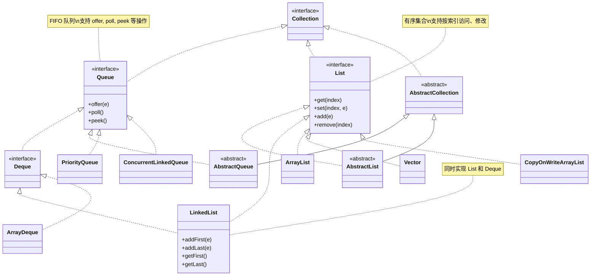

# 在 Java 中，`Queue` 和 `List` 都是接口，属于 Java 集合框架，但它们的用途、特性和实现方式有显著区别。以下是详细对比：

### 1. **定义和用途**
- **`Queue`**:
    - 定义：`Queue` 是 `java.util.Queue` 接口，继承自 `Collection`，主要用于表示先进先出（FIFO，First-In-First-Out）的数据结构，适合处理按顺序处理元素（如任务队列、消息队列）。
    - 用途：常用于需要按顺序处理元素的场景，如广度优先搜索（BFS）、线程池任务队列、消息传递等。
    - 典型实现：`LinkedList`（实现 `Deque`）、`ArrayDeque`、`PriorityQueue`（非严格 FIFO，因其基于优先级）。

- **`List`**:
    - 定义：`List` 是 `java.util.List` 接口，继承自 `Collection`，表示有序的元素集合，允许重复元素，支持按索引访问。
    - 用途：适合需要按位置访问、插入、删除元素的场景，如动态数组、列表数据存储。
    - 典型实现：`ArrayList`、`LinkedList`、`Vector`。

### 2. **数据结构特性**
- **`Queue`**:
    - 遵循 FIFO（或优先级队列的排序规则），元素从队尾添加（`offer`/`add`），从队首移除（`poll`/`remove`）。
    - 某些实现（如 `Deque`）支持双端队列（FIFO 和 LIFO 混合）。
    - 不支持随机访问元素（无索引访问方法）。

- **`List`**:
    - 有序集合，元素按插入顺序存储（除非显式排序）。
    - 支持通过索引（`get(int index)`）随机访问、修改、插入、删除元素。
    - 不强制 FIFO 或 LIFO，操作灵活。

### 3. **常用方法**
- **`Queue`**:
    - 添加元素：`offer(E e)`（推荐）、`add(E e)`（可能抛异常）。
    - 移除/查看队首：`poll()`（移除并返回队首，空时返回 null）、`remove()`（抛异常）、`peek()`（查看队首，空时返回 null）、`element()`（抛异常）。
    - 特殊：`PriorityQueue` 根据比较器或自然顺序排序。

- **`List`**:
    - 添加元素：`add(E e)`、`add(int index, E e)`。
    - 访问/修改：`get(int index)`、`set(int index, E e)`。
    - 删除：`remove(int index)`、`remove(Object o)`。
    - 子列表：`subList(int fromIndex, int toIndex)`。

### 4. **线程安全**
- **`Queue`**:
    - 标准实现（如 `LinkedList`、`ArrayDeque`）非线程安全。
    - 线程安全实现：`ConcurrentLinkedQueue`（无锁并发）、`BlockingQueue` 的子类（如 `ArrayBlockingQueue`、`LinkedBlockingQueue`）。

- **`List`**:
    - 标准实现（如 `ArrayList`、`LinkedList`）非线程安全。
    - 线程安全实现：`Vector`（同步方法）、`Collections.synchronizedList(List)`、`CopyOnWriteArrayList`。

### 5. **性能差异**
- **`Queue`**:
    - 适合快速插入和删除队首/队尾元素（如 `ArrayDeque` O(1)）。
    - `PriorityQueue` 的插入和删除为 O(log n)，因其基于堆。
    - 不适合随机访问（无索引，访问中间元素需遍历）。

- **`List`**:
    - `ArrayList`：随机访问 O(1)，插入/删除 O(n)（因数组移位）。
    - `LinkedList`：插入/删除首尾 O(1)，随机访问 O(n)（需遍历）。
    - 适合需要频繁按索引操作的场景。

### 6. **代码示例**
```java
import java.util.*;

public class QueueVsList {
    public static void main(String[] args) {
        // Queue 示例（FIFO）
        Queue<String> queue = new LinkedList<>();
        queue.offer("A");
        queue.offer("B");
        System.out.println("Queue poll: " + queue.poll()); // 输出: A

        // List 示例（索引访问）
        List<String> list = new ArrayList<>();
        list.add("A");
        list.add("B");
        System.out.println("List get(1): " + list.get(1)); // 输出: B
    }
}
```

### 7. **总结**
- **选择 `Queue`**：当需要 FIFO（或优先级）处理元素，强调队首/队尾操作，如任务调度、消息队列。
- **选择 `List`**：当需要按索引随机访问、灵活操作元素，如存储有序数据、动态数组。
- **注意**：`LinkedList` 同时实现 `List` 和 `Deque`（`Queue` 的子接口），可用作队列或列表，但性能因场景而异。

如果有具体场景或实现类（如 `ArrayDeque` vs `ArrayList`）的疑问，可以进一步讨论！

---

以下是使用 Mermaid 语言描述 Java 中 `Queue`、`List` 接口及其常见实现类的 UML 图，展示它们的继承和实现关系。Mermaid 是一种基于 JavaScript 的图表生成工具，适合在 Markdown 中嵌入。





### 说明
- **图中内容**：
    - `Collection` 是 `Queue` 和 `List` 的父接口。
    - `Queue` 扩展出 `Deque`（双端队列）。
    - 抽象类 `AbstractCollection`、`AbstractQueue`、`AbstractList` 提供部分实现。
    - 实现类：
        - `Queue`：`LinkedList`（通过 `Deque`）、`ArrayDeque`、`PriorityQueue`、`ConcurrentLinkedQueue`。
        - `List`：`ArrayList`、`LinkedList`、`Vector`、`CopyOnWriteArrayList`。
    - `LinkedList` 同时实现 `List` 和 `Deque`。
    - 为 `Queue` 和 `List` 添加了主要方法示例，增强可读性。
- **生成 UML 图**：
    - 可将上述 Mermaid 代码粘贴到支持 Mermaid 的编辑器中（如 GitHub、VS Code with Mermaid 插件、或 [Mermaid Live Editor](https://mermaid.live/)）生成图形。
    - 图形将展示接口、抽象类、实现类的继承和实现关系。
- **Mermaid 特点**：
    - 相比 PlantUML，Mermaid 更轻量，适合嵌入 Markdown。
    - 支持类图、方法和注释，但复杂关系（如聚合）支持有限。

如果需要调整图表内容（如添加更多方法、修改样式）或转换为其他格式，请告诉我！