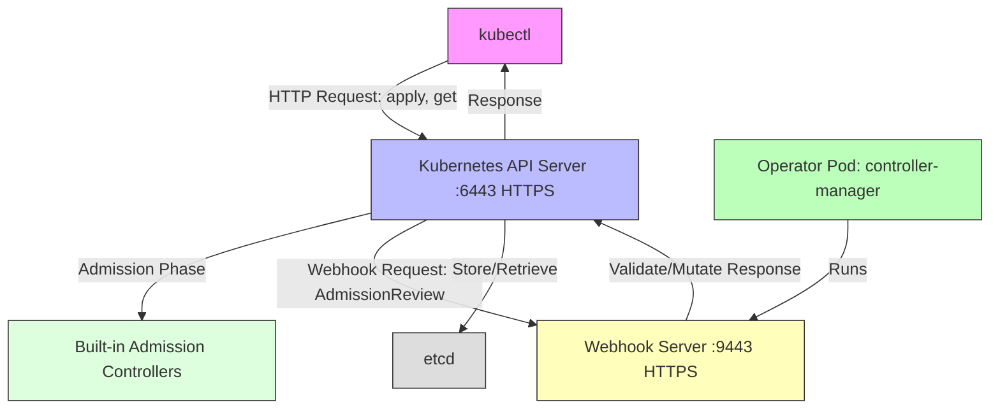

# 解析 Kubernetes 准入 Webhook 的标准、与 Kubernetes API 服务器的区别

好的，我将用中文回答您的问题，重点解析 Kubernetes 准入 Webhook 的标准、与 Kubernetes API 服务器的区别，并提供详细介绍、表格和 Mermaid 架构图。以下是针对您的问题的完整解答。

### 1. Kubernetes Webhook 和 API 服务器简介

#### Kubernetes 准入 Webhook
Kubernetes 准入 Webhook 是 Kubernetes API 服务器在处理 API 请求（如创建、更新资源）时调用的 HTTP 回调，用于执行自定义验证或修改操作。它们是准入控制流程的一部分，与 `kubectl` 无直接关系，但会在 `kubectl` 或其他客户端发起请求时被 API 服务器触发。

- **Webhook 类型**：
    - **MutatingAdmissionWebhook**：修改资源（如注入默认值、添加标签）。
    - **ValidatingAdmissionWebhook**：验证资源，决定是否允许请求（如检查字段是否符合规则）。
- **用途**：扩展 Kubernetes 内置准入控制器，允许自定义逻辑，常用于 Operator（如您提到的 Kubebuilder 项目）来强制执行策略或自动化配置。
- **配置**：通过 `MutatingWebhookConfiguration` 或 `ValidatingWebhookConfiguration` 资源定义，指定 Webhook 端点、拦截的资源和 TLS 配置。
- **与 `kubectl` 的交互**：当使用 `kubectl apply` 创建或更新资源时，API 服务器可能调用 Webhook，但 `kubectl` 仅是发送 REST 请求的客户端，对 Webhook 过程无感知。

#### Kubernetes API 服务器
Kubernetes API 服务器是 Kubernetes 控制平面的核心组件，负责处理集群资源的管理，提供 RESTful API 供客户端（如 `kubectl`、控制器或 Operator）使用。

- **角色**：处理所有 API 请求（GET、POST、PUT、DELETE、WATCH），管理资源（如 Pod、Deployment、自定义资源如 `Application` 或 `SimpleApp`）。
- **功能**：
    - 使用内置准入控制器和 CRD 模式验证请求。
    - 将资源持久化到 etcd（集群数据存储）。
    - 与其他控制平面组件（如调度器、控制器管理器）协调。
- **与 `kubectl` 的交互**：`kubectl` 向 API 服务器发送 HTTP 请求（如 `kubectl get pods` 查询 `/api/v1/pods` 端点），API 服务器处理并返回响应。

#### `kubectl` 是否有 Webhook API？
- **无 Webhook API**：`kubectl` 是一个命令行客户端，通过 HTTP/REST 与 Kubernetes API 服务器交互，没有自己的“Webhook API”。您的问题可能指的是 **Kubernetes 准入 Webhook**，这是 API 服务器在处理 `kubectl` 或其他客户端请求时调用的机制。

### 2. Kubernetes Webhook 是否有标准？
是的，Kubernetes 准入 Webhook 遵循 Kubernetes 生态系统内的 **明确标准**，在 Kubernetes API 规范和官方文档中有详细定义，涵盖配置、行为和与 API 服务器的交互。

- **标准化组件**：
    - **配置资源**：
        - `MutatingWebhookConfiguration` 和 `ValidatingWebhookConfiguration` 是 Kubernetes API 资源（`admissionregistration.k8s.io/v1`），用于定义 Webhook。
        - 关键字段：
            - `webhooks[].name`：Webhook 的唯一标识。
            - `webhooks[].clientConfig`：指定 Webhook 端点（URL 或 Service）和 TLS 配置（如 CA 证书）。
            - `webhooks[].rules`：定义触发 Webhook 的资源和操作（CREATE、UPDATE 等）。
            - `webhooks[].admissionReviewVersions`：支持的 `AdmissionReview` API 版本（如 `v1`）。
    - **AdmissionReview API**：
        - Webhook 使用 `AdmissionReview` 对象（`admission.k8s.io/v1`）进行请求和响应。
        - **请求**：包含待准入的资源（如 `Pod` 或 `Application`）、操作类型和元数据。
        - **响应**：包含 `allowed`（true/false）、`status`（拒绝原因）和可选的 `patch`（用于变更 Webhook）。
    - **TLS 要求**：Webhook 必须使用 HTTPS，需要有效的 TLS 证书。

- **标准来源**：
    - Kubernetes 官方文档：https://kubernetes.io/docs/reference/access-authn-authz/extensible-admission-controllers/
    - API 规范：`admissionregistration.k8s.io/v1` 和 `admission.k8s.io/v1`。
    - 实现库：`controller-runtime`（Kubebuilder 使用）提供了 Webhook 开发支持。

### 3. Webhook 与 API 服务器的区别

以下是对 Kubernetes 准入 Webhook 和 API 服务器的详细比较，突出它们在功能、角色和交互方式上的差异。

| **特性**                | **准入 Webhook**                                                                 | **Kubernetes API 服务器**                                                |
|-------------------------|--------------------------------------------------------------------------------|-------------------------------------------------------------------------|
| **角色**                | 准入控制扩展，处理自定义验证或变更逻辑                                          | 集群的核心管理组件，处理所有资源操作                                    |
| **功能**                | - 验证资源请求（ValidatingWebhook） - 修改资源（MutatingWebhook）            | - 提供 RESTful API - 验证、存储资源 - 协调控制平面组件             |
| **运行位置**            | 外部服务（如 Operator 的 Pod，运行 Webhook 服务器）                             | 集群控制平面（`kube-apiserver` Pod）                                     |
| **触发方式**            | API 服务器在准入阶段调用（在请求到达 etcd 之前）                                | 客户端（如 `kubectl`）直接发送 HTTP 请求                                 |
| **通信协议**            | HTTPS（需要 TLS 证书）                                                         | HTTPS（通过 `kubeconfig` 或 ServiceAccount 认证）                        |
| **API 交互**            | 接收/响应 `AdmissionReview` 对象                                                | 提供资源端点（如 `/api/v1/pods`、`/apis/apps.example.com/v1/applications`） |
| **标准化**              | 是，遵循 `admission.k8s.io/v1` 和 Webhook 配置规范                             | 是，遵循 Kubernetes API 规范（如 `core/v1`、`apps/v1`）                  |
| **端口**                | 默认 `:9443`（HTTPS，可自定义）                                                | 默认 `:6443`（集群外部）或 `:443`（集群内部）                            |
| **与 `kubectl` 关系**   | 间接触发（`kubectl` 请求触发 API 服务器调用 Webhook）                           | 直接交互（`kubectl` 发送请求到 API 服务器）                              |
| **依赖性**              | 依赖 API 服务器调用，需注册 Webhook 配置                                       | 独立运行，核心控制平面组件                                               |
| **用例**                | 自定义验证（如检查 `Application` 字段）、注入默认值                            | 管理集群资源、处理所有 CRUD 操作                                        |

- **主要区别**：
    - **角色与范围**：API 服务器是集群的核心，处理所有资源操作；Webhook 是可选的扩展，仅处理准入阶段的自定义逻辑。
    - **交互点**：`kubectl` 直接与 API 服务器通信，而 Webhook 是 API 服务器在准入流程中调用的外部服务。
    - **运行环境**：API 服务器运行在控制平面，Webhook 运行在用户定义的 Pod（如 Operator 的控制器）。
    - **功能焦点**：API 服务器管理整个资源生命周期，Webhook 专注于准入控制。

### 4. 详细介绍

#### 准入 Webhook 的工作流程
1. **客户端请求**：
    - `kubectl apply -f resource.yaml` 发送资源创建/更新请求到 API 服务器。
2. **API 服务器处理**：
    - 认证和授权（基于 `kubeconfig` 或 ServiceAccount）。
    - 初始验证（CRD 模式、RBAC）。
3. **准入控制阶段**：
    - API 服务器调用内置准入控制器（如 `LimitRanger`）。
    - 如果配置了 Webhook，API 服务器发送 `AdmissionReview` 请求到 Webhook 服务器（HTTPS 端点）。
4. **Webhook 处理**：
    - **ValidatingWebhook**：检查资源，返回 `allowed: true/false`。
    - **MutatingWebhook**：返回修改补丁（如 JSON Patch）。
5. **最终处理**：
    - 如果 Webhook 允许，API 服务器将资源存储到 etcd。
    - 如果拒绝，返回错误给 `kubectl`。

- **示例**：在 `operator-example` 项目中，Webhook 可能验证 `Application` 资源的 `spec.replicas` 是否在允许范围内，或注入默认 `spec.image`。

#### API 服务器的工作流程
1. **客户端请求**：
    - `kubectl get pods` 或 `kubectl apply` 发送 HTTP 请求到 API 服务器。
2. **认证和授权**：
    - 使用 `kubeconfig`（客户端证书、令牌）或 ServiceAccount 验证用户。
3. **请求处理**：
    - 解析请求，验证资源模式（基于 CRD 或内置 API）。
    - 调用准入控制器（包括 Webhook，如果配置）。
4. **存储/响应**：
    - 存储资源到 etcd（对于写操作）。
    - 返回资源数据或状态给客户端（如 `kubectl`）。

- **示例**：`kubectl get applications.apps.example.com` 查询 `/apis/apps.example.com/v1/namespaces/default/applications`，API 服务器返回资源列表。

#### Webhook 与 API 服务器的交互
- **Webhook 是 API 服务器的扩展**：
    - Webhook 服务器是外部服务（通常由 Operator 实现，如 `operator-example` 的 Webhook 服务器）。
    - API 服务器通过 `clientConfig`（在 Webhook 配置中）调用 Webhook 的 HTTPS 端点。
- **`kubectl` 的角色**：
    - `kubectl` 仅与 API 服务器通信（通过 REST API）。
    - Webhook 由 API 服务器在后台调用，`kubectl` 不直接与之交互。

### 5. Mermaid 架构图
以下是展示 `kubectl`、准入 Webhook 和 API 服务器交互的 Mermaid 图，确保语法正确并清晰表示流程。

**图解说明**：
- **`kubectl`**：发送 HTTP 请求到 API 服务器（如 `kubectl apply`）。
- **API 服务器**：处理请求，调用内置准入控制器，并触发 Webhook（如果配置）。
- **Webhook 服务器**：运行在 Operator Pod（如 `operator-example` 的 `controller-manager`），处理验证/变更请求，返回 `AdmissionReview` 响应。
- **etcd**：存储资源数据。
- **Operator Pod**：运行 Webhook 服务器（`:9443`）和控制器逻辑。

### 6. 总结
- **Webhook 标准**：Kubernetes 准入 Webhook 遵循明确标准，使用 `MutatingWebhookConfiguration`、`ValidatingWebhookConfiguration` 和 `AdmissionReview` API，基于 HTTPS 和 TLS。
- **与 API 服务器的区别**：
    - Webhook 是外部准入控制扩展，运行在用户 Pod，专注于验证/变更。
    - API 服务器是核心控制平面组件，处理所有资源操作，协调集群。
- **`kubectl` 关系**：`kubectl` 是 API 服务器的客户端，间接触发 Webhook（通过 API 服务器），无直接 Webhook API。
- **架构图**：展示了 `kubectl`、API 服务器、Webhook 和 etcd 的交互流程。

如果您需要更深入的细节（如 Webhook 配置示例、API 服务器的准入流程），请告诉我！