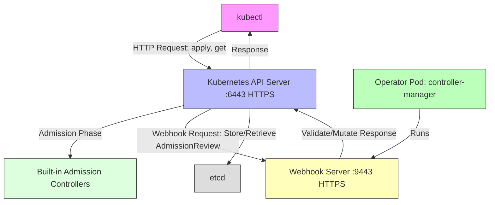

# Analysis of Kubernetes Admission Webhook Standards and Differences from Kubernetes API Server

Alright, I will answer your question in English, focusing on analyzing Kubernetes admission webhook standards, their differences from the Kubernetes API server, and providing detailed introductions, tables, and Mermaid architecture diagrams. Below is a complete answer to your question.

### 1. Kubernetes Webhook and API Server Introduction

#### Kubernetes Admission Webhook
Kubernetes admission webhooks are HTTP callbacks called by the Kubernetes API server when processing API requests (such as creating or updating resources) to perform custom validation or modification operations. They are part of the admission control process and have no direct relationship with `kubectl`, but are triggered by the API server when requests are initiated by `kubectl` or other clients.

- **Webhook Types**:
    - **MutatingAdmissionWebhook**: Modifies resources (such as injecting default values, adding labels).
    - **ValidatingAdmissionWebhook**: Validates resources and decides whether to allow requests (such as checking if fields comply with rules).
- **Purpose**: Extends Kubernetes built-in admission controllers, allowing custom logic, commonly used by Operators (like the Kubebuilder project you mentioned) to enforce policies or automate configurations.
- **Configuration**: Defined through `MutatingWebhookConfiguration` or `ValidatingWebhookConfiguration` resources, specifying webhook endpoints, intercepted resources, and TLS configuration.
- **Interaction with `kubectl`**: When using `kubectl apply` to create or update resources, the API server may call webhooks, but `kubectl` is only a client sending REST requests and is unaware of the webhook process.

#### Kubernetes API Server
The Kubernetes API server is the core component of the Kubernetes control plane, responsible for managing cluster resources and providing RESTful APIs for clients (such as `kubectl`, controllers, or Operators).

- **Role**: Handles all API requests (GET, POST, PUT, DELETE, WATCH), manages resources (such as Pods, Deployments, custom resources like `Application` or `SimpleApp`).
- **Functions**:
    - Validates requests using built-in admission controllers and CRD schemas.
    - Persists resources to etcd (cluster data storage).
    - Coordinates with other control plane components (such as scheduler, controller manager).
- **Interaction with `kubectl`**: `kubectl` sends HTTP requests to the API server (such as `kubectl get pods` queries the `/api/v1/pods` endpoint), the API server processes and returns responses.

#### Does `kubectl` have a Webhook API?
- **No Webhook API**: `kubectl` is a command-line client that interacts with the Kubernetes API server through HTTP/REST and does not have its own "webhook API". Your question might refer to **Kubernetes admission webhooks**, which are mechanisms called by the API server when processing requests from `kubectl` or other clients.

### 2. Does Kubernetes Webhook have Standards?
Yes, Kubernetes admission webhooks follow **clear standards** within the Kubernetes ecosystem, detailed in the Kubernetes API specifications and official documentation, covering configuration, behavior, and interaction with the API server.

- **Standardized Components**:
    - **Configuration Resources**:
        - `MutatingWebhookConfiguration` and `ValidatingWebhookConfiguration` are Kubernetes API resources (`admissionregistration.k8s.io/v1`) used to define webhooks.
        - Key fields:
            - `webhooks[].name`: Unique identifier for the webhook.
            - `webhooks[].clientConfig`: Specifies the webhook endpoint (URL or Service) and TLS configuration (such as CA certificate).
            - `webhooks[].rules`: Defines the resources and operations (CREATE, UPDATE, etc.) that trigger the webhook.
            - `webhooks[].admissionReviewVersions`: Supported `AdmissionReview` API versions (such as `v1`).
    - **AdmissionReview API**:
        - Webhooks use `AdmissionReview` objects (`admission.k8s.io/v1`) for requests and responses.
        - **Request**: Contains the resource to be admitted (such as `Pod` or `Application`), operation type, and metadata.
        - **Response**: Contains `allowed` (true/false), `status` (reason for rejection), and optional `patch` (for mutating webhooks).
    - **TLS Requirements**: Webhooks must use HTTPS and require valid TLS certificates.

- **Standard Sources**:
    - Kubernetes official documentation: https://kubernetes.io/docs/reference/access-authn-authz/extensible-admission-controllers/
    - API specifications: `admissionregistration.k8s.io/v1` and `admission.k8s.io/v1`.
    - Implementation libraries: `controller-runtime` (used by Kubebuilder) provides webhook development support.

### 3. Differences Between Webhook and API Server

Below is a detailed comparison of Kubernetes admission webhooks and API servers, highlighting their differences in functionality, role, and interaction methods.

| **Feature**                | **Admission Webhook**                                                                 | **Kubernetes API Server**                                                |
|-------------------------|--------------------------------------------------------------------------------|-------------------------------------------------------------------------|
| **Role**                | Admission control extension, handles custom validation or modification logic                                          | Core management component of the cluster, handles all resource operations                                    |
| **Function**                | - Validates resource requests (ValidatingWebhook) - Modifies resources (MutatingWebhook)            | - Provides RESTful API - Validates and stores resources - Coordinates control plane components             |
| **Running Location**            | External service (such as Operator Pod, running webhook server)                             | Cluster control plane (`kube-apiserver` Pod)                                     |
| **Trigger Method**            | API server calls during admission phase (before requests reach etcd)                                | Clients (such as `kubectl`) directly send HTTP requests                                 |
| **Communication Protocol**            | HTTPS (requires TLS certificate)                                                         | HTTPS (authenticated through `kubeconfig` or ServiceAccount)                        |
| **API Interaction**            | Receives/responds to `AdmissionReview` objects                                                | Provides resource endpoints (such as `/api/v1/pods`, `/apis/apps.example.com/v1/applications`) |
| **Standardization**              | Yes, follows `admission.k8s.io/v1` and webhook configuration specifications                             | Yes, follows Kubernetes API specifications (such as `core/v1`, `apps/v1`)                  |
| **Ports**                | Default `:9443` (HTTPS, customizable)                                                    | Default `:6443` (external) or `:443` (internal)                            |
| **Relationship with `kubectl`**   | Indirectly triggered (`kubectl` requests trigger API server to call webhook)                           | Direct interaction (`kubectl` sends requests to API server)                              |
| **Dependencies**              | Depends on API server calls, requires webhook configuration registration                                       | Runs independently, core control plane component                                               |
| **Use Cases**                | Custom validation (such as checking `Application` fields), injecting default values                            | Manages cluster resources, handles all CRUD operations                                        |

- **Main Differences**:
    - **Role and Scope**: API server is the core of the cluster, handling all resource operations; webhook is an optional extension, only handling custom logic during admission phase.
    - **Interaction Point**: `kubectl` communicates directly with API server, while webhook is an external service called by API server in the background during admission process.
    - **Running Environment**: API server runs in control plane, webhook runs in user-defined Pods (such as Operator controllers).
    - **Functional Focus**: API server manages entire resource lifecycle, webhook focuses on admission control.

### 4. Detailed Introduction

#### Admission Webhook Workflow
1. **Client Request**:
    - `kubectl apply -f resource.yaml` sends resource creation/update request to API server.
2. **API Server Processing**:
    - Authentication and authorization (based on `kubeconfig` or ServiceAccount).
    - Initial validation (CRD schema, RBAC).
3. **Admission Control Phase**:
    - API server calls built-in admission controllers (such as `LimitRanger`).
    - If webhooks are configured, API server sends `AdmissionReview` request to webhook server (HTTPS endpoint).
4. **Webhook Processing**:
    - **ValidatingWebhook**: Checks resource, returns `allowed: true/false`.
    - **MutatingWebhook**: Returns modification patch (such as JSON Patch).
5. **Final Processing**:
    - If webhook allows, API server stores resource in etcd.
    - If rejected, returns error to `kubectl`.

- **Example**: In the `operator-example` project, webhooks might validate `Application` resource's `spec.replicas` is within allowed range, or inject default `spec.image`.

#### API Server Workflow
1. **Client Request**:
    - `kubectl get pods` or `kubectl apply` sends HTTP request to API server.
2. **Authentication and Authorization**:
    - Validates user using `kubeconfig` (client certificate, token) or ServiceAccount.
3. **Request Processing**:
    - Parses request, validates resource schema (based on CRD or built-in API).
    - Calls admission controllers (including webhooks if configured).
4. **Storage/Response**:
    - Stores resource in etcd (for write operations).
    - Returns resource data or status to client (such as `kubectl`).

- **Example**: `kubectl get applications.apps.example.com` queries `/apis/apps.example.com/v1/namespaces/default/applications`, API server returns resource list.

#### Interaction Between Webhook and API Server
- **Webhook is an Extension of API Server**:
    - Webhook server is an external service (typically implemented by Operator, such as `operator-example`'s webhook server).
    - API server calls webhook's HTTPS endpoint through `clientConfig` (in webhook configuration).
- **Role of `kubectl`**:
    - `kubectl` only communicates with API server (through REST API).
    - Webhooks are called by API server in background, `kubectl` has no direct interaction with webhooks.

### 5. Mermaid Architecture Diagram
Below is a Mermaid diagram showing the interaction between `kubectl`, admission webhook, and API server, ensuring correct syntax and clear flow representation.

**Diagram Explanation**:
- **`kubectl`**: Sends HTTP requests to API server (such as `kubectl apply`).
- **API Server**: Processes requests, calls built-in admission controllers, and triggers webhooks (if configured).
- **Webhook Server**: Runs in Operator Pod (such as `operator-example`'s `controller-manager`), processes validation/mutation requests, returns `AdmissionReview` response.
- **etcd**: Stores resource data.
- **Operator Pod**: Runs webhook server (`:9443`) and controller logic.

### 6. Summary
- **Webhook Standards**: Kubernetes admission webhooks follow clear standards, using `MutatingWebhookConfiguration`, `ValidatingWebhookConfiguration`, and `AdmissionReview` API, based on HTTPS and TLS.
- **Differences from API Server**:
    - Webhook is an external admission control extension, running in user Pods, focusing on validation/modification.
    - API server is a core control plane component, handling all resource operations and coordinating the cluster.
- **Relationship with `kubectl`**: `kubectl` is a client of API server, indirectly triggers webhooks (through API server), has no direct webhook API.
- **Architecture Diagram**: Shows the interaction flow between `kubectl`, API server, webhook, and etcd.

If you need more in-depth details (such as webhook configuration examples, API server admission process), please let me know!