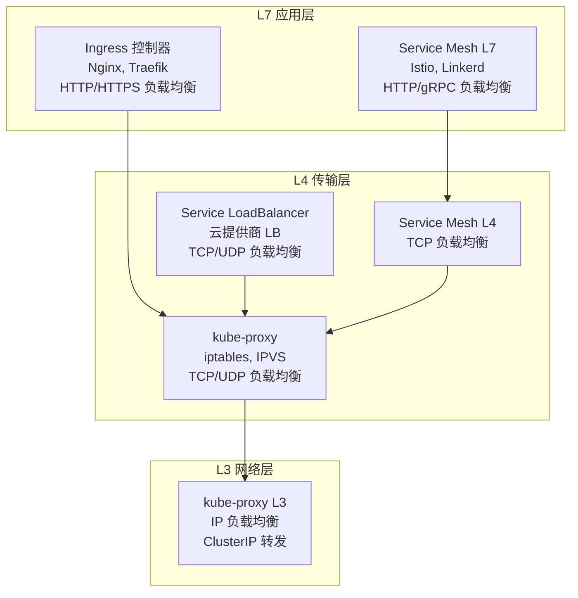
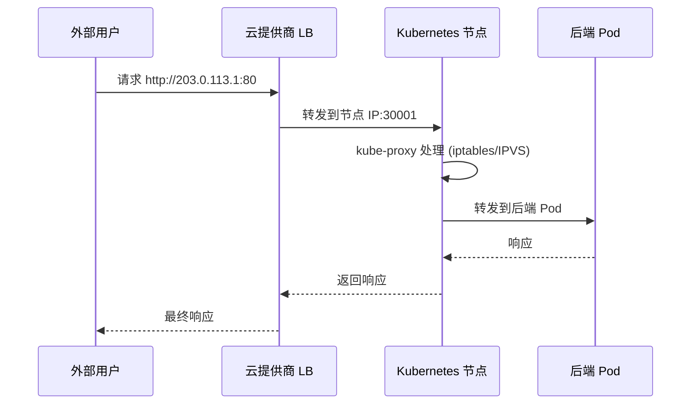

# Kubernetes 中的 Load Balancer 组件

### 1. **Service 类型的 LoadBalancer（L4）**
```yaml
apiVersion: v1
kind: Service
metadata:
  name: my-service
spec:
  type: LoadBalancer  # 这是 Kubernetes 的 LoadBalancer 类型
  ports:
  - port: 80
    targetPort: 8080
```

- **OSI 层级**：主要在第 4 层（传输层）
- **功能**：TCP/UDP 负载均衡
- **实现**：依赖云提供商的负载均衡器（如 AWS ELB、GCP Load Balancer、Azure Load Balancer）

### 2. **kube-proxy（L3/L4）**
- **OSI 层级**：第 3 层（网络层）和第 4 层（传输层）
- **功能**：
    - L3：IP 地址负载均衡（ClusterIP 到 Pod IP）
    - L4：端口负载均衡（TCP/UDP 端口映射）
- **实现方式**：
    - iptables 模式
    - IPVS 模式
    - userspace 模式

### 3. **Ingress 控制器（L7）**
```yaml
apiVersion: networking.k8s.io/v1
kind: Ingress
metadata:
  name: my-ingress
spec:
  rules:
  - host: myapp.example.com
    http:
      paths:
      - path: /
        pathType: Prefix
        backend:
          service:
            name: my-service
            port:
              number: 80
```

- **OSI 层级**：第 7 层（应用层）
- **功能**：HTTP/HTTPS 负载均衡，基于域名和路径
- **常见实现**：
    - Nginx Ingress Controller
    - Traefik
    - HAProxy Ingress
    - Contour（基于 Envoy）

### 4. **Service Mesh（L7/L4）**
```yaml
# Istio 示例
apiVersion: networking.istio.io/v1alpha3
kind: DestinationRule
metadata:
  name: my-service
spec:
  host: my-service
  trafficPolicy:
    loadBalancer:
      simple: ROUND_ROBIN  # 负载均衡算法
```

- **OSI 层级**：第 7 层（应用层）和第 4 层（传输层）
- **功能**：
    - L7：HTTP/gRPC 负载均衡，支持高级路由
    - L4：TCP 负载均衡
- **常见实现**：
    - Istio
    - Linkerd
    - Consul Connect

## OSI 层级分布图



## 具体组件对比

| 组件 | OSI 层级 | 负载均衡类型 | 实现方式 | 适用场景 |
|------|----------|--------------|----------|----------|
| **Service LoadBalancer** | L4 | TCP/UDP | 云提供商 LB | 外部访问，简单 TCP/UDP |
| **kube-proxy** | L3/L4 | IP + 端口 | iptables/IPVS | 集群内部，所有 Service |
| **Ingress 控制器** | L7 | HTTP/HTTPS | Nginx/Traefik | Web 应用，域名路由 |
| **Service Mesh** | L7/L4 | HTTP/gRPC + TCP | Envoy/Linkerd | 微服务，高级流量管理 |

## 负载均衡算法

### kube-proxy 支持的算法：
- **iptables 模式**：随机选择
- **IPVS 模式**：
    - `rr`：轮询
    - `lc`：最少连接
    - `dh`：目标哈希
    - `sh`：源哈希

### Ingress 控制器支持的算法：
- **Nginx**：轮询、最少连接、IP 哈希、权重
- **Traefik**：轮询、最少连接、随机

### Service Mesh 支持的算法：
- **Istio**：轮询、最少连接、随机、一致性哈希

## 总结

Kubernetes 中的 Load Balancer 概念是**多层次**的：

1. **L7 层**：Ingress 控制器、Service Mesh（HTTP/gRPC 负载均衡）
2. **L4 层**：Service LoadBalancer、kube-proxy、Service Mesh（TCP/UDP 负载均衡）
3. **L3 层**：kube-proxy（IP 负载均衡）

每个组件都有其特定的使用场景和优势，在实际部署中通常会组合使用多个层级的负载均衡器来实现完整的流量管理。

**是的**，External IP 主要是由 Service LoadBalancer 提供的，但还有其他情况。让我详细解释：

## External IP 的来源

### 1. **Service LoadBalancer 类型（主要来源）**
```yaml
apiVersion: v1
kind: Service
metadata:
  name: my-service
spec:
  type: LoadBalancer
  ports:
  - port: 80
    targetPort: 8080
```

**结果**：
```bash
$ kubectl get svc
NAME         TYPE           CLUSTER-IP    EXTERNAL-IP     PORT(S)
my-service   LoadBalancer   10.96.0.1     203.0.113.1     80:30001/TCP
```

- **External IP**: `203.0.113.1`（由云提供商的负载均衡器分配）
- **来源**: AWS ELB、GCP Load Balancer、Azure Load Balancer 等

### 2. **NodePort 类型（间接提供）**
```yaml
apiVersion: v1
kind: Service
metadata:
  name: my-service
spec:
  type: NodePort
  ports:
  - port: 80
    targetPort: 8080
    nodePort: 30001
```

**结果**：
```bash
$ kubectl get svc
NAME         TYPE       CLUSTER-IP    EXTERNAL-IP   PORT(S)
my-service   NodePort   10.96.0.1     <nodes>       80:30001/TCP
```

- **External IP**: `<nodes>`（表示所有节点 IP）
- **访问方式**: `http://<node-ip>:30001`

### 3. **手动指定 External IP**
```yaml
apiVersion: v1
kind: Service
metadata:
  name: my-service
spec:
  type: ClusterIP
  externalIPs:
  - 203.0.113.100  # 手动指定的外部 IP
  ports:
  - port: 80
    targetPort: 8080
```

**结果**：
```bash
$ kubectl get svc
NAME         TYPE        CLUSTER-IP    EXTERNAL-IP     PORT(S)
my-service   ClusterIP   10.96.0.1     203.0.113.100   80/TCP
```

## 不同场景的 External IP 对比

| Service 类型 | External IP 来源 | 访问方式 | 适用场景 |
|-------------|------------------|----------|----------|
| **LoadBalancer** | 云提供商自动分配 | `http://<external-ip>:80` | 云环境，需要外部访问 |
| **NodePort** | 节点 IP 地址 | `http://<node-ip>:30001` | 裸机环境，或需要直接访问节点 |
| **ClusterIP + externalIPs** | 手动指定 | `http://203.0.113.100:80` | 自定义网络配置 |

## LoadBalancer 的工作流程



## 云提供商的具体实现

### AWS EKS
```bash
$ kubectl get svc
NAME         TYPE           EXTERNAL-IP
my-service   LoadBalancer   a1234567890abcdef-1234567890.us-west-2.elb.amazonaws.com
```

### GCP GKE
```bash
$ kubectl get svc
NAME         TYPE           EXTERNAL-IP
my-service   LoadBalancer   35.123.456.789
```

### Azure AKS
```bash
$ kubectl get svc
NAME         TYPE           EXTERNAL-IP
my-service   LoadBalancer   20.123.456.789
```

## 总结

**External IP 的主要来源**：
1. ✅ **Service LoadBalancer**：最常见，由云提供商自动分配
2. ✅ **NodePort**：使用节点 IP 作为 External IP
3. ✅ **手动指定**：通过 `externalIPs` 字段手动配置

**LoadBalancer 类型是 External IP 的主要提供者**，特别是在云环境中，它提供了最便捷的外部访问方式。