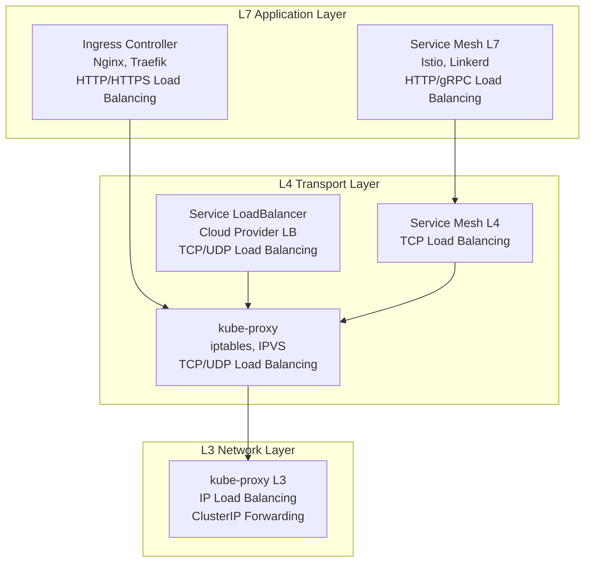
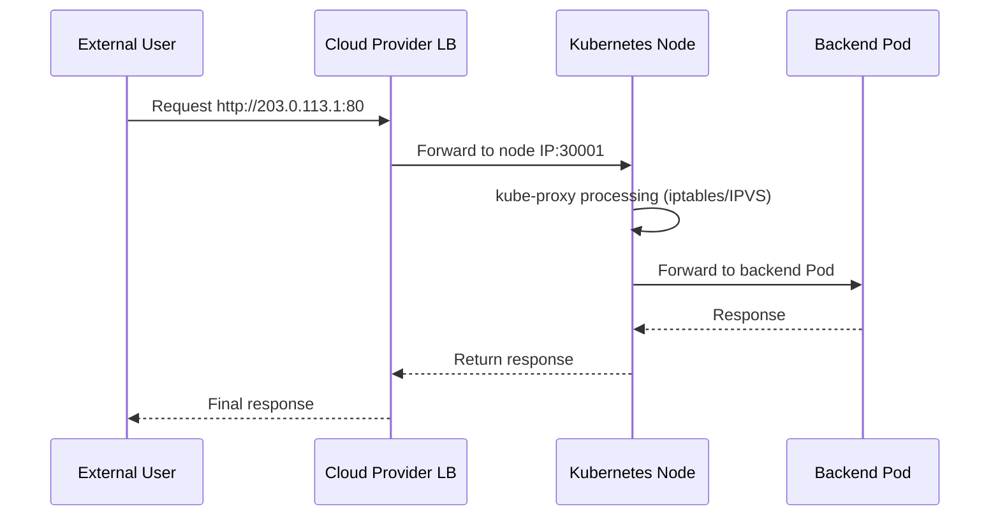
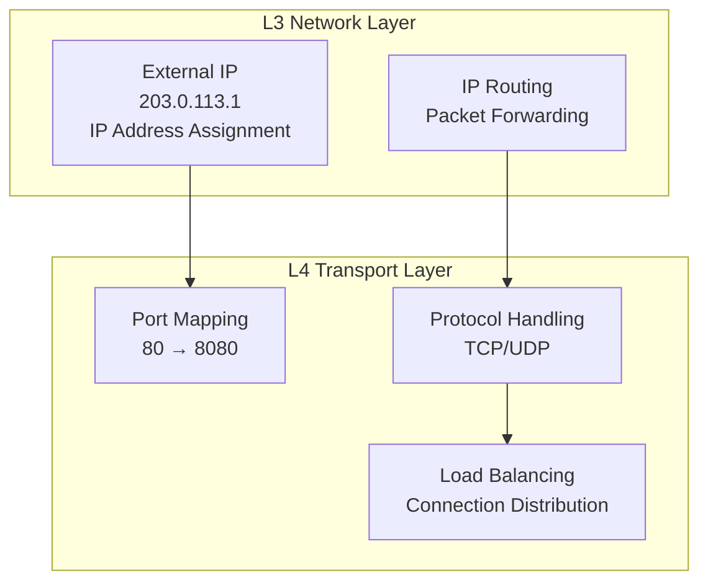
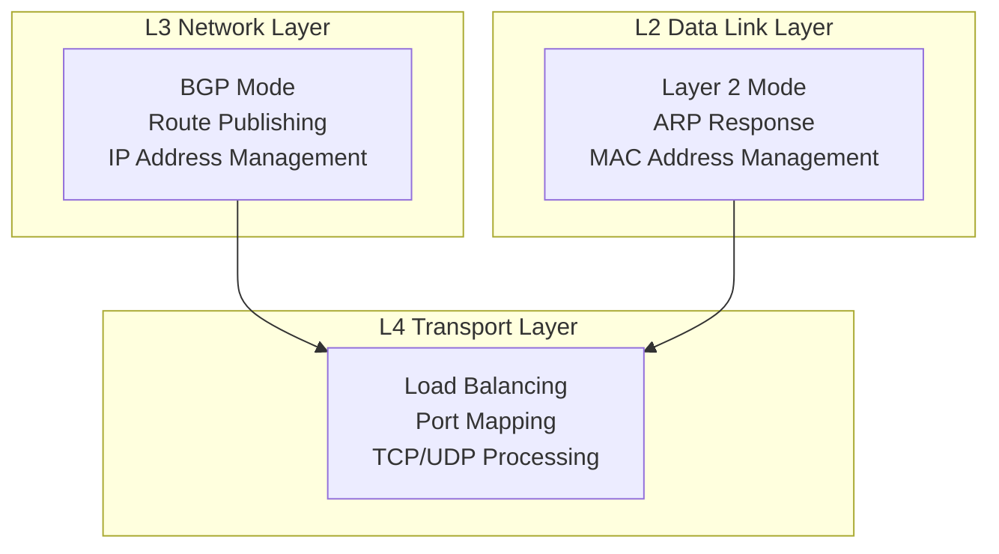
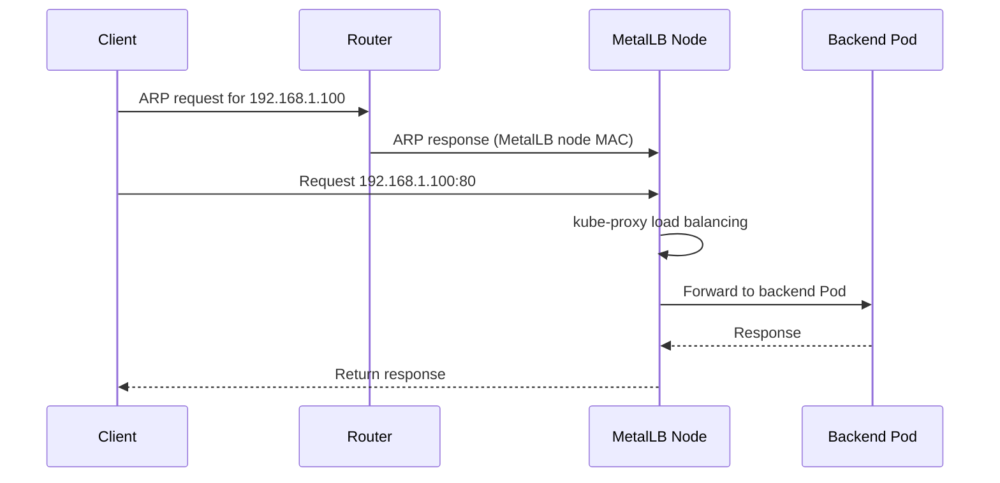
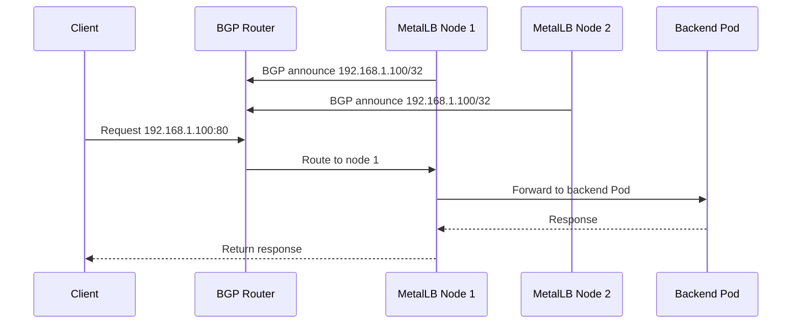
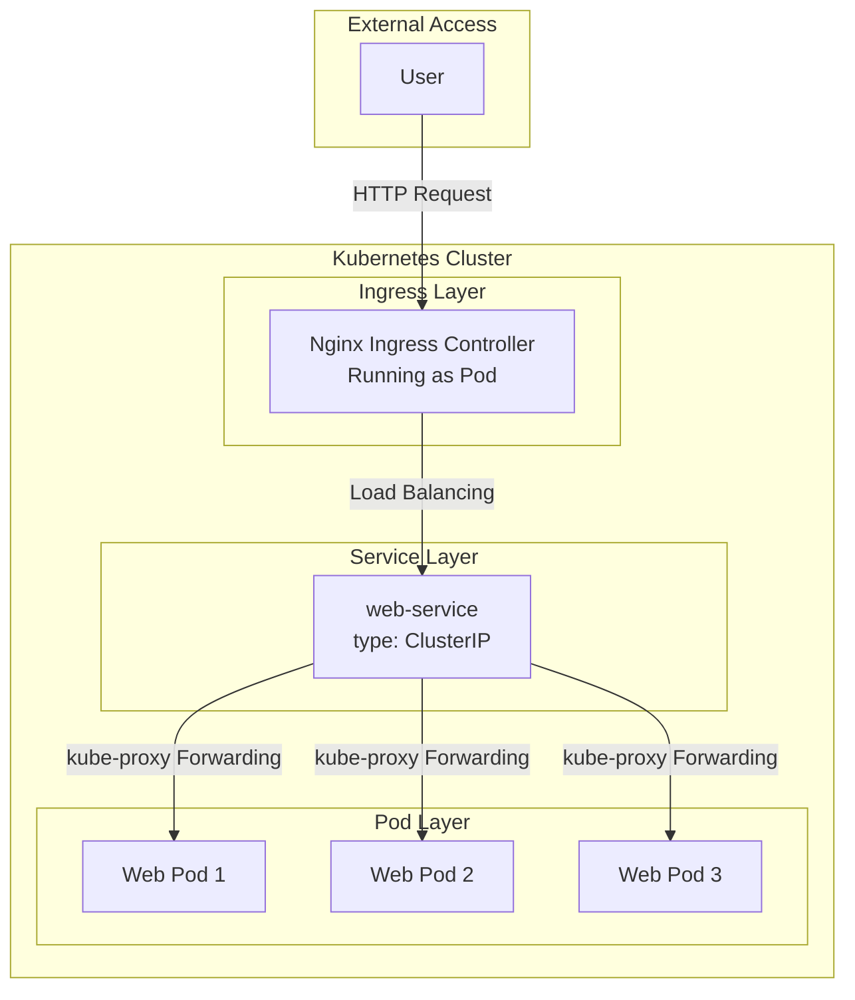
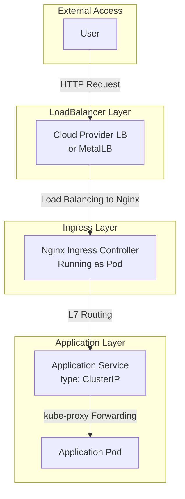

# Load Balancer Components in Kubernetes

### 1. **Service Type LoadBalancer (L4)**
```yaml
apiVersion: v1
kind: Service
metadata:
  name: my-service
spec:
  type: LoadBalancer  # This is Kubernetes' LoadBalancer type
  ports:
  - port: 80
    targetPort: 8080
```

- **OSI Layer**: Primarily Layer 4 (Transport Layer)
- **Function**: TCP/UDP load balancing
- **Implementation**: Depends on cloud provider's load balancer (like AWS ELB, GCP Load Balancer, Azure Load Balancer)

### 2. **kube-proxy (L3/L4)**
- **OSI Layer**: Layer 3 (Network Layer) and Layer 4 (Transport Layer)
- **Functions**:
    - L3: IP address load balancing (ClusterIP to Pod IP)
    - L4: Port load balancing (TCP/UDP port mapping)
- **Implementation Modes**:
    - iptables mode
    - IPVS mode
    - userspace mode

### 3. **Ingress Controller (L7)**
```yaml
apiVersion: networking.k8s.io/v1
kind: Ingress
metadata:
  name: my-ingress
spec:
  rules:
  - host: myapp.example.com
    http:
      paths:
      - path: /
        pathType: Prefix
        backend:
          service:
            name: my-service
            port:
              number: 80
```

- **OSI Layer**: Layer 7 (Application Layer)
- **Function**: HTTP/HTTPS load balancing, based on domain and path
- **Common Implementations**:
    - Nginx Ingress Controller
    - Traefik
    - HAProxy Ingress
    - Contour (based on Envoy)

### 4. **Service Mesh (L7/L4)**
```yaml
# Istio example
apiVersion: networking.istio.io/v1alpha3
kind: DestinationRule
metadata:
  name: my-service
spec:
  host: my-service
  trafficPolicy:
    loadBalancer:
      simple: ROUND_ROBIN  # Load balancing algorithm
```

- **OSI Layer**: Layer 7 (Application Layer) and Layer 4 (Transport Layer)
- **Functions**:
    - L7: HTTP/gRPC load balancing, supports advanced routing
    - L4: TCP load balancing
- **Common Implementations**:
    - Istio
    - Linkerd
    - Consul Connect

## OSI Layer Distribution Diagram



## Component Comparison

| Component | OSI Layer | Load Balancing Type | Implementation | Use Case |
|------|----------|--------------|----------|----------|
| **Service LoadBalancer** | L4 | TCP/UDP | Cloud Provider LB | External access, simple TCP/UDP |
| **kube-proxy** | L3/L4 | IP + Port | iptables/IPVS | Cluster internal, all Services |
| **Ingress Controller** | L7 | HTTP/HTTPS | Nginx/Traefik | Web applications, domain routing |
| **Service Mesh** | L7/L4 | HTTP/gRPC + TCP | Envoy/Linkerd | Microservices, advanced traffic management |

## Load Balancing Algorithms

### kube-proxy supported algorithms:
- **iptables mode**: Random selection
- **IPVS mode**:
    - `rr`: Round Robin
    - `lc`: Least Connections
    - `dh`: Destination Hash
    - `sh`: Source Hash

### Ingress Controller supported algorithms:
- **Nginx**: Round Robin, Least Connections, IP Hash, Weighted
- **Traefik**: Round Robin, Least Connections, Random

### Service Mesh supported algorithms:
- **Istio**: Round Robin, Least Connections, Random, Consistent Hash

## Summary

Kubernetes' Load Balancer concept is **multi-layered**:

1. **L7 Layer**: Ingress controllers, Service Mesh (HTTP/gRPC load balancing)
2. **L4 Layer**: Service LoadBalancer, kube-proxy, Service Mesh (TCP/UDP load balancing)
3. **L3 Layer**: kube-proxy (IP load balancing)

Each component has its specific use cases and advantages. In actual deployments, multiple layers of load balancers are usually combined to achieve complete traffic management.

**Yes**, External IP is mainly provided by Service LoadBalancer, but there are other cases. Let me explain in detail:

## Sources of External IP

### 1. **Service LoadBalancer Type (Primary Source)**
```yaml
apiVersion: v1
kind: Service
metadata:
  name: my-service
spec:
  type: LoadBalancer
  ports:
  - port: 80
    targetPort: 8080
```

**Result**:
```bash
$ kubectl get svc
NAME         TYPE           CLUSTER-IP    EXTERNAL-IP     PORT(S)
my-service   LoadBalancer   10.96.0.1     203.0.113.1     80:30001/TCP
```

- **External IP**: `203.0.113.1` (assigned by cloud provider's load balancer)
- **Source**: AWS ELB, GCP Load Balancer, Azure Load Balancer, etc.

### 2. **NodePort Type (Indirect Provision)**
```yaml
apiVersion: v1
kind: Service
metadata:
  name: my-service
spec:
  type: NodePort
  ports:
  - port: 80
    targetPort: 8080
    nodePort: 30001
```

**Result**:
```bash
$ kubectl get svc
NAME         TYPE       CLUSTER-IP    EXTERNAL-IP   PORT(S)
my-service   NodePort   10.96.0.1     <nodes>       80:30001/TCP
```

- **External IP**: `<nodes>` (indicates all node IPs)
- **Access Method**: `http://<node-ip>:30001`

### 3. **Manually Specified External IP**
```yaml
apiVersion: v1
kind: Service
metadata:
  name: my-service
spec:
  type: ClusterIP
  externalIPs:
  - 203.0.113.100  # Manually specified external IP
  ports:
  - port: 80
    targetPort: 8080
```

**Result**:
```bash
$ kubectl get svc
NAME         TYPE        CLUSTER-IP    EXTERNAL-IP     PORT(S)
my-service   ClusterIP   10.96.0.1     203.0.113.100   80/TCP
```

## Comparison of Different Scenarios

| Service Type | External IP Source | Access Method | Use Case |
|-------------|------------------|----------|----------|
| **LoadBalancer** | Automatically assigned by cloud provider | `http://<external-ip>:80` | Cloud environments, needs external access |
| **NodePort** | Node IP address | `http://<node-ip>:30001` | Bare metal environments, or direct node access needed |
| **ClusterIP + externalIPs** | Manually specified | `http://203.0.113.100:80` | Custom network configurations |

## LoadBalancer Workflow



## Cloud Provider Specific Implementations

### AWS EKS
```bash
$ kubectl get svc
NAME         TYPE           EXTERNAL-IP
my-service   LoadBalancer   a1234567890abcdef-1234567890.us-west-2.elb.amazonaws.com
```

### GCP GKE
```bash
$ kubectl get svc
NAME         TYPE           EXTERNAL-IP
my-service   LoadBalancer   35.123.456.789
```

### Azure AKS
```bash
$ kubectl get svc
NAME         TYPE           EXTERNAL-IP
my-service   LoadBalancer   20.123.456.789
```

## Summary

**Main Sources of External IP**:
1. ✅ **Service LoadBalancer**: Most common, automatically assigned by cloud provider
2. ✅ **NodePort**: Uses node IP as External IP
3. ✅ **Manual specification**: Manually configured through `externalIPs` field

**LoadBalancer type is the main provider of External IP**, especially in cloud environments, providing the most convenient external access method.

---

You raised a great question! This involves understanding OSI layers and LoadBalancer functionality. Let me explain in detail:

## LoadBalancer Layer Analysis

### 1. **External IP Itself is an L3 Concept**
- **External IP Address**: Indeed an L3 (Network Layer) concept
- **IP Address Assignment**: Provided by cloud provider's network infrastructure

### 2. **But LoadBalancer's Function is L4**
```yaml
apiVersion: v1
kind: Service
metadata:
  name: my-service
spec:
  type: LoadBalancer
  ports:
  - port: 80        # L4 port
    targetPort: 8080 # L4 port
```

**LoadBalancer's Core Functions**:
- **Port Mapping**: 80 → 8080 (typical L4 transport layer function)
- **Protocol Handling**: TCP/UDP (L4 transport layer protocols)
- **Connection Management**: Maintains TCP connection state

### 3. **Complete Layer Analysis**



## Detailed Workflow Analysis

### 1. **L3 Level (IP Layer)**
```
User request: http://203.0.113.1:80
    ↓
DNS resolution: 203.0.113.1 → Cloud provider LB IP
    ↓
IP routing: Packet reaches cloud provider LB
```

### 2. **L4 Level (Transport Layer)**
```
LB receives: TCP connection request to port 80
    ↓
Port mapping: 80 → 8080
    ↓
Load balancing: Select backend node
    ↓
Protocol handling: Maintain TCP connection state
    ↓
Forwarding to backend port: 8080
```

## Why is LoadBalancer Classified as L4?

### 1. **Main Function at L4**
- **Port Translation**: This is a typical L4 function
- **Protocol Awareness**: Handles TCP/UDP protocols
- **Connection State**: Maintains transport layer connections

### 2. **L3 is Just Infrastructure**
- **IP Address**: Just network layer identification
- **Routing**: Handled by underlying network infrastructure
- **LoadBalancer doesn't directly handle IP routing**

## Comparison with Other Components

| Component | L3 Function | L4 Function | Primary Layer |
|------|---------|---------|----------|
| **LoadBalancer** | IP address assignment | Port mapping, load balancing | **L4** |
| **kube-proxy** | IP forwarding | Port mapping, load balancing | **L3/L4** |
| **Router** | IP routing, forwarding | None | **L3** |
| **Switch** | None | None | **L2** |

## Practical Example

### AWS ELB Working Method:
```bash
# L3: IP address assignment
External IP: 203.0.113.1

# L4: Port and protocol handling
Port 80 (HTTP) → Backend Port 8080
Port 443 (HTTPS) → Backend Port 8443
```

### Packet Processing Flow:
```
1. L3: Packet arrives at 203.0.113.1
2. L4: LB checks destination port (80)
3. L4: LB makes load balancing decision
4. L4: LB forwards to backend port (8080)
5. L3: Packet routes to backend node
```

## Summary

**LoadBalancer's Layer Positioning**:
- ✅ **L3 provides infrastructure**: External IP address assignment
- ✅ **L4 provides core functions**: Port mapping, protocol handling, load balancing
- ✅ **Mainly classified as L4**: Because its core function is transport layer

**Analogy**:
- Just like HTTP servers run on IP addresses but mainly function at L7
- LoadBalancer uses IP addresses but mainly functions at L4

So, although External IP is an L3 concept, **LoadBalancer's core function is L4 transport layer load balancing**.

---

**Yes**, MetalLB is a LoadBalancer implementation, but it's a **software-defined load balancer** specifically designed for bare metal Kubernetes clusters.

## MetalLB Overview

### 1. **What is MetalLB?**
- **Open Source Project**: Provides LoadBalancer services for bare metal Kubernetes clusters
- **Problem Solved**: Cloud environments have cloud provider LoadBalancers, but bare metal environments don't
- **Implementation Method**: Implements LoadBalancer functionality through software

### 2. **MetalLB's Two Modes**

#### **Layer 2 Mode (L2)**
```yaml
apiVersion: metallb.io/v1beta1
kind: IPAddressPool
metadata:
  name: first-pool
  namespace: metallb-system
spec:
  addresses:
  - 192.168.1.240-192.168.1.250  # Assign IP address pool
```

- **OSI Layer**: Layer 2 (Data Link Layer)
- **Working Principle**: Uses ARP protocol, lets one node respond to ARP requests for specific IP
- **Characteristics**: Simple, but single point of failure

#### **BGP Mode (L3)**
```yaml
apiVersion: metallb.io/v1beta1
kind: BGPPeer
metadata:
  name: sample
  namespace: metallb-system
spec:
  peerAddress: 192.168.1.1
  peerASN: 64501
  myASN: 64500
```

- **OSI Layer**: Layer 3 (Network Layer)
- **Working Principle**: Communicates with routers through BGP protocol, publishes routing information
- **Characteristics**: High availability, but requires BGP-supporting routers

## MetalLB's Position in OSI Model



## MetalLB vs Other LoadBalancers

| Type | Environment | OSI Layer | Implementation | High Availability |
|------|------|----------|----------|----------|
| **Cloud Provider LB** | Cloud Environment | L4 | Hardware/Software | High |
| **MetalLB L2** | Bare Metal | L2 + L4 | ARP + Software | Low (Single Point) |
| **MetalLB BGP** | Bare Metal | L3 + L4 | BGP + Software | High |
| **kube-proxy** | All Environments | L3 + L4 | iptables/IPVS | High |

## MetalLB Configuration Example

### 1. **Install MetalLB**
```bash
kubectl apply -f https://raw.githubusercontent.com/metallb/metallb/v0.13.12/config/manifests/metallb-native.yaml
```

### 2. **Configure IP Address Pool**
```yaml
apiVersion: metallb.io/v1beta1
kind: IPAddressPool
metadata:
  name: production
  namespace: metallb-system
spec:
  addresses:
  - 192.168.1.100-192.168.1.200
```

### 3. **Create LoadBalancer Service**
```yaml
apiVersion: v1
kind: Service
metadata:
  name: my-service
spec:
  type: LoadBalancer
  ports:
  - port: 80
    targetPort: 8080
```

**Result**:
```bash
$ kubectl get svc
NAME         TYPE           CLUSTER-IP    EXTERNAL-IP     PORT(S)
my-service   LoadBalancer   10.96.0.1     192.168.1.100   80:30001/TCP
```

## MetalLB Workflow

### Layer 2 Mode Process:


### BGP Mode Process:


## Summary

**Is MetalLB a LoadBalancer?**
- ✅ **Yes**: It implements Kubernetes LoadBalancer interface
- ✅ **Software Implementation**: Provides LoadBalancer functionality through software
- ✅ **Bare Metal Specific**: Solves the problem of missing LoadBalancer in bare metal environments

**OSI Layer Positioning**:
- **Layer 2 Mode**: L2 (ARP) + L4 (Load Balancing)
- **BGP Mode**: L3 (BGP) + L4 (Load Balancing)
- **Core Function**: L4 transport layer load balancing

MetalLB allows bare metal Kubernetes clusters to enjoy LoadBalancer services like cloud environments, making it an important network component in the Kubernetes ecosystem.

---

**You're absolutely right!** My previous statement was misleading. Let me clarify:

## Nginx's Actual Role

### 1. **Nginx Ingress Controller ≠ LoadBalancer Type**
```yaml
# This is Ingress, not LoadBalancer
apiVersion: networking.k8s.io/v1
kind: Ingress
metadata:
  name: my-ingress
spec:
  rules:
  - host: myapp.example.com
    http:
      paths:
      - path: /
        pathType: Prefix
        backend:
          service:
            name: my-service
            port:
              number: 80
```

### 2. **Nginx Cannot Serve as Provider for `type: LoadBalancer`**
```yaml
# In this configuration, Nginx is not the LoadBalancer provider
apiVersion: v1
kind: Service
metadata:
  name: my-service
spec:
  type: LoadBalancer  # Nginx cannot provide this function
  ports:
  - port: 80
    targetPort: 8080
```

## Correct Understanding

### **How Nginx Ingress Controller Works**:


### **Nginx Ingress Controller Itself Also Needs Service**:
```yaml
# Nginx Ingress Controller's Service
apiVersion: v1
kind: Service
metadata:
  name: ingress-nginx-controller
  namespace: ingress-nginx
spec:
  type: LoadBalancer  # Here is where real LoadBalancer provider is needed
  ports:
  - port: 80
    targetPort: 80
    name: http
  - port: 443
    targetPort: 443
    name: https
  selector:
    app.kubernetes.io/component: controller
    app.kubernetes.io/instance: ingress-nginx
    app.kubernetes.io/name: ingress-nginx
```

## Layer Relationship Comparison

| Component | Role | Needs LoadBalancer | Provider |
|------|------|---------------------|--------|
| **Nginx Ingress Controller** | L7 Load Balancer | ✅ Needs | Cloud Provider LB or MetalLB |
| **User Application Service** | Backend Service | ❌ Doesn't Need | Uses ClusterIP |
| **kube-proxy** | L4 Load Balancer | ❌ Doesn't Need | Built into Kubernetes |

## Correct Architecture Understanding

### **Complete Request Flow**:
```
1. User → Cloud Provider LoadBalancer (External IP)
2. LoadBalancer → Nginx Ingress Controller Pod
3. Nginx Ingress Controller → Application Service (ClusterIP)
4. Application Service → Application Pod (via kube-proxy)
```

### **Nginx Ingress Controller Deployment**:
```yaml
# Nginx Ingress Controller runs as Deployment
apiVersion: apps/v1
kind: Deployment
metadata:
  name: ingress-nginx-controller
  namespace: ingress-nginx
spec:
  replicas: 2
  selector:
    matchLabels:
      app: ingress-nginx
  template:
    metadata:
      labels:
        app: ingress-nginx
    spec:
      containers:
      - name: controller
        image: k8s.gcr.io/ingress-nginx/controller:v1.8.2
        ports:
        - containerPort: 80
        - containerPort: 443
```

## Summary

**Your understanding is correct**:
- ❌ **Nginx cannot serve as provider for `type: LoadBalancer`**
- ✅ **Nginx Ingress Controller itself needs LoadBalancer to expose**
- ✅ **Nginx provides L7 application layer load balancing, not L4 transport layer LoadBalancer**

**Correct Role Division**:
- **Cloud Provider LB/MetalLB**: Provide `type: LoadBalancer` functionality
- **Nginx Ingress Controller**: Provide L7 HTTP/HTTPS load balancing
- **kube-proxy**: Provide L4 TCP/UDP load balancing

Thanks for the correction!

---

You asked very well! Let me explain the situation here:

## Key Understanding: Nginx Ingress Controller's Service Configuration

In the YAML you provided, the LoadBalancer provider **is not Nginx**, but rather **the underlying LoadBalancer implementation**:

```yaml
apiVersion: v1
kind: Service
metadata:
  name: ingress-nginx-controller
  namespace: ingress-nginx
spec:
  type: LoadBalancer  # Here needs real LoadBalancer provider
  ports:
  - name: http
    port: 80
    targetPort: http
  - name: https
    port: 443
    targetPort: https
  selector:
    app.kubernetes.io/component: controller
    app.kubernetes.io/instance: ingress-nginx
    app.kubernetes.io/name: ingress-nginx
```

## Actual LoadBalancer Provider

### 1. **In Cloud Environments**
```bash
$ kubectl get svc -n ingress-nginx
NAME                                 TYPE           CLUSTER-IP       EXTERNAL-IP     PORT(S)
ingress-nginx-controller             LoadBalancer   10.152.183.101   35.123.456.789  80:30236/TCP,443:32580/TCP
```

- **LoadBalancer Provider**: AWS ELB, GCP Load Balancer, Azure Load Balancer
- **External IP**: Assigned by cloud provider
- **Nginx Role**: Serves as backend service, load balanced by LoadBalancer

### 2. **In Bare Metal Environments (Using MetalLB)**
```bash
$ kubectl get svc -n ingress-nginx
NAME                                 TYPE           CLUSTER-IP       EXTERNAL-IP     PORT(S)
ingress-nginx-controller             LoadBalancer   10.152.183.101   192.168.1.200  80:30236/TCP,443:32580/TCP
```

- **LoadBalancer Provider**: MetalLB
- **External IP**: Assigned by MetalLB
- **Nginx Role**: Serves as backend service, load balanced by MetalLB

## Architecture Layer Analysis



## Key Distinction

| Component | Role | LoadBalancer Provider | Function |
|------|------|-------------------|------|
| **Cloud Provider LB/MetalLB** | L4 LoadBalancer | ✅ Yes | Provide External IP, TCP/UDP load balancing |
| **Nginx Ingress Controller** | L7 Load Balancer | ❌ No | Provide HTTP/HTTPS routing, load balanced by LoadBalancer |

## Verification Method

### Check LoadBalancer's Actual Provider:
```bash
# View Service details
kubectl describe svc ingress-nginx-controller -n ingress-nginx

# Check External IP source
kubectl get events -n ingress-nginx --sort-by='.lastTimestamp'
```

### Output Example in Cloud Environment:
```
Events:
  Type    Reason                Age   From                Message
  ----    ------                ----  ----                -------
  Normal  EnsuringLoadBalancer  2m    service-controller  Ensuring load balancer
  Normal  EnsuredLoadBalancer   1m    service-controller  Ensured load balancer
```

### Output Example in MetalLB Environment:
```
Events:
  Type    Reason                Age   From                Message
  ----    ------                ----  ----                -------
  Normal  IPAllocated           2m    metallb             Assigned IP "192.168.1.200"
```

## Summary

**Your understanding is correct**:
- ❌ **Nginx is not the LoadBalancer provider**
- ✅ **Nginx Ingress Controller needs LoadBalancer to expose**
- ✅ **The real LoadBalancer providers are**:
    - Cloud environments: Cloud provider's LoadBalancer (AWS ELB, GCP LB, Azure LB)
    - Bare metal environments: MetalLB

**Nginx's Actual Role**:
- Serves as **backend service**, load balanced by LoadBalancer
- Provides **L7 HTTP/HTTPS routing** functionality
- Runs in Pod, exposed through Service

So the `type: LoadBalancer` here needs real LoadBalancer implementation (cloud provider LB or MetalLB) to provide External IP, not Nginx itself.