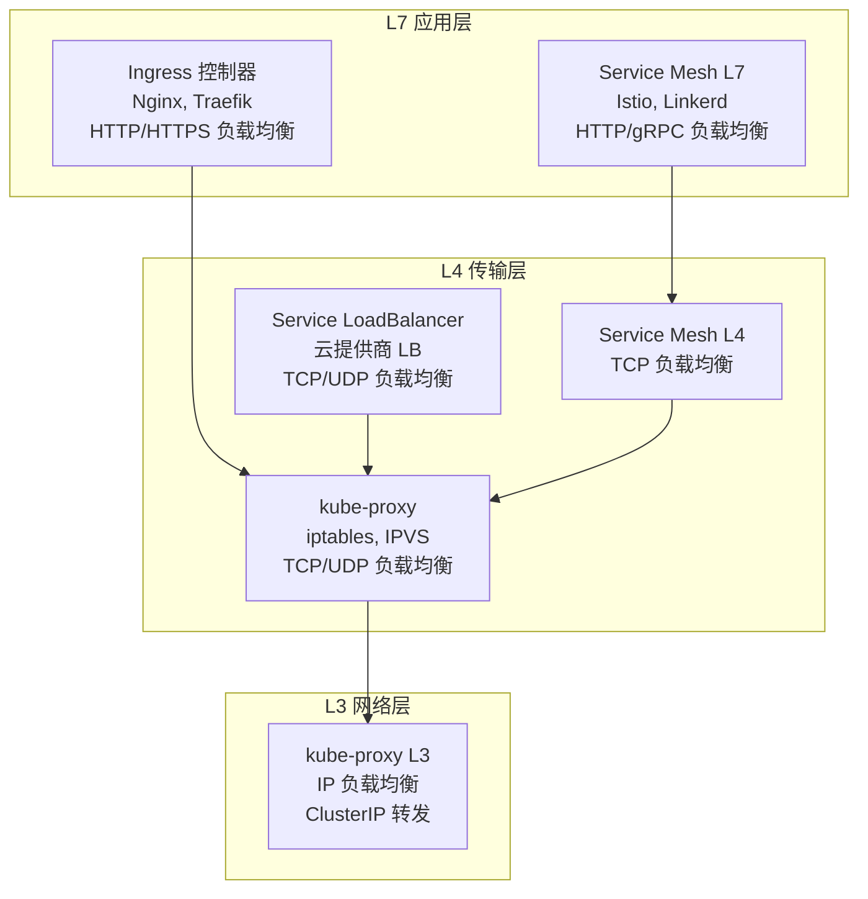
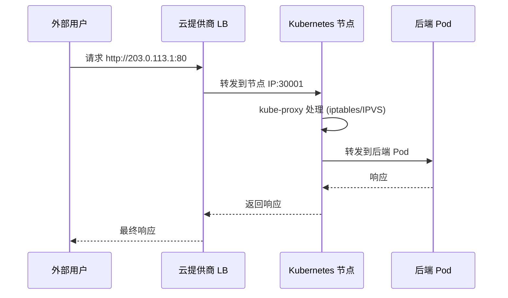
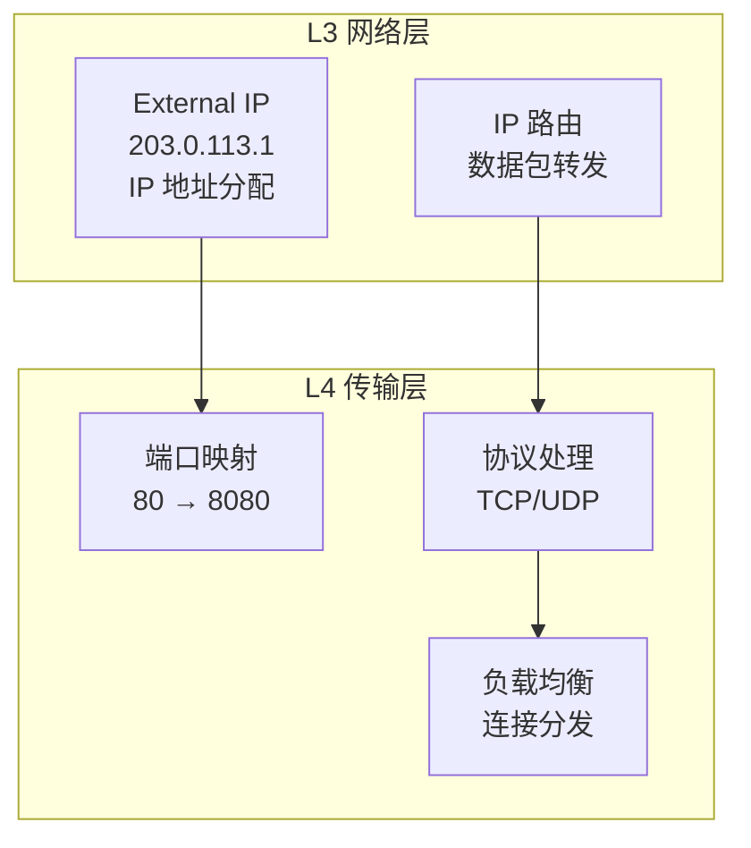
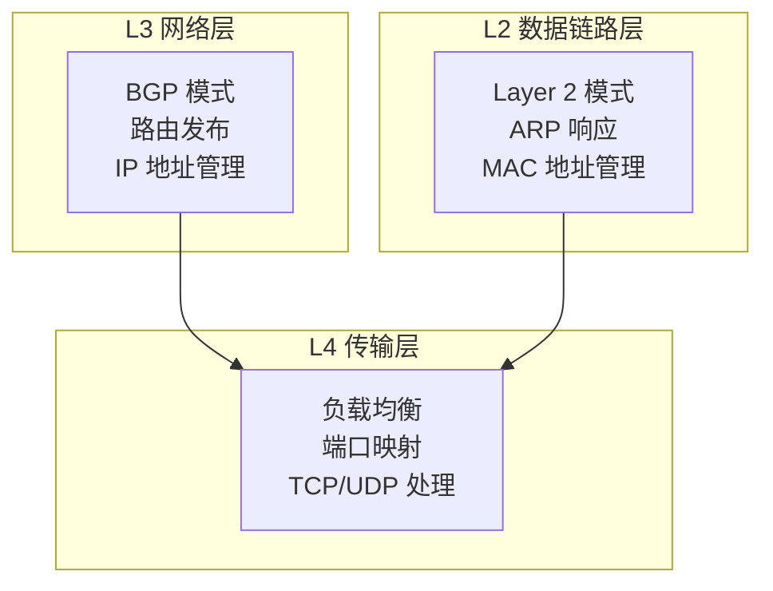
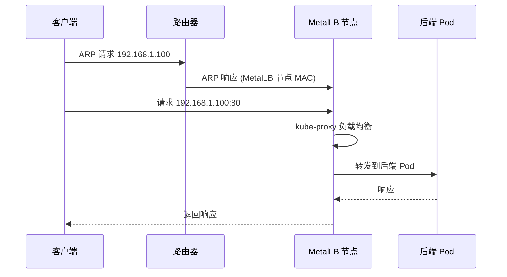
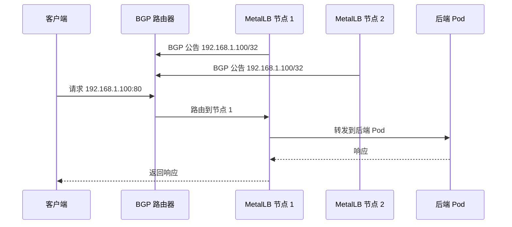

# Kubernetes 中的 Load Balancer 组件

### 1. **Service 类型的 LoadBalancer（L4）**
```yaml
apiVersion: v1
kind: Service
metadata:
  name: my-service
spec:
  type: LoadBalancer  # 这是 Kubernetes 的 LoadBalancer 类型
  ports:
  - port: 80
    targetPort: 8080
```

- **OSI 层级**：主要在第 4 层（传输层）
- **功能**：TCP/UDP 负载均衡
- **实现**：依赖云提供商的负载均衡器（如 AWS ELB、GCP Load Balancer、Azure Load Balancer）

### 2. **kube-proxy（L3/L4）**
- **OSI 层级**：第 3 层（网络层）和第 4 层（传输层）
- **功能**：
    - L3：IP 地址负载均衡（ClusterIP 到 Pod IP）
    - L4：端口负载均衡（TCP/UDP 端口映射）
- **实现方式**：
    - iptables 模式
    - IPVS 模式
    - userspace 模式

### 3. **Ingress 控制器（L7）**
```yaml
apiVersion: networking.k8s.io/v1
kind: Ingress
metadata:
  name: my-ingress
spec:
  rules:
  - host: myapp.example.com
    http:
      paths:
      - path: /
        pathType: Prefix
        backend:
          service:
            name: my-service
            port:
              number: 80
```

- **OSI 层级**：第 7 层（应用层）
- **功能**：HTTP/HTTPS 负载均衡，基于域名和路径
- **常见实现**：
    - Nginx Ingress Controller
    - Traefik
    - HAProxy Ingress
    - Contour（基于 Envoy）

### 4. **Service Mesh（L7/L4）**
```yaml
# Istio 示例
apiVersion: networking.istio.io/v1alpha3
kind: DestinationRule
metadata:
  name: my-service
spec:
  host: my-service
  trafficPolicy:
    loadBalancer:
      simple: ROUND_ROBIN  # 负载均衡算法
```

- **OSI 层级**：第 7 层（应用层）和第 4 层（传输层）
- **功能**：
    - L7：HTTP/gRPC 负载均衡，支持高级路由
    - L4：TCP 负载均衡
- **常见实现**：
    - Istio
    - Linkerd
    - Consul Connect

## OSI 层级分布图



## 具体组件对比

| 组件 | OSI 层级 | 负载均衡类型 | 实现方式 | 适用场景 |
|------|----------|--------------|----------|----------|
| **Service LoadBalancer** | L4 | TCP/UDP | 云提供商 LB | 外部访问，简单 TCP/UDP |
| **kube-proxy** | L3/L4 | IP + 端口 | iptables/IPVS | 集群内部，所有 Service |
| **Ingress 控制器** | L7 | HTTP/HTTPS | Nginx/Traefik | Web 应用，域名路由 |
| **Service Mesh** | L7/L4 | HTTP/gRPC + TCP | Envoy/Linkerd | 微服务，高级流量管理 |

## 负载均衡算法

### kube-proxy 支持的算法：
- **iptables 模式**：随机选择
- **IPVS 模式**：
    - `rr`：轮询
    - `lc`：最少连接
    - `dh`：目标哈希
    - `sh`：源哈希

### Ingress 控制器支持的算法：
- **Nginx**：轮询、最少连接、IP 哈希、权重
- **Traefik**：轮询、最少连接、随机

### Service Mesh 支持的算法：
- **Istio**：轮询、最少连接、随机、一致性哈希

## 总结

Kubernetes 中的 Load Balancer 概念是**多层次**的：

1. **L7 层**：Ingress 控制器、Service Mesh（HTTP/gRPC 负载均衡）
2. **L4 层**：Service LoadBalancer、kube-proxy、Service Mesh（TCP/UDP 负载均衡）
3. **L3 层**：kube-proxy（IP 负载均衡）

每个组件都有其特定的使用场景和优势，在实际部署中通常会组合使用多个层级的负载均衡器来实现完整的流量管理。

**是的**，External IP 主要是由 Service LoadBalancer 提供的，但还有其他情况。让我详细解释：

## External IP 的来源

### 1. **Service LoadBalancer 类型（主要来源）**
```yaml
apiVersion: v1
kind: Service
metadata:
  name: my-service
spec:
  type: LoadBalancer
  ports:
  - port: 80
    targetPort: 8080
```

**结果**：
```bash
$ kubectl get svc
NAME         TYPE           CLUSTER-IP    EXTERNAL-IP     PORT(S)
my-service   LoadBalancer   10.96.0.1     203.0.113.1     80:30001/TCP
```

- **External IP**: `203.0.113.1`（由云提供商的负载均衡器分配）
- **来源**: AWS ELB、GCP Load Balancer、Azure Load Balancer 等

### 2. **NodePort 类型（间接提供）**
```yaml
apiVersion: v1
kind: Service
metadata:
  name: my-service
spec:
  type: NodePort
  ports:
  - port: 80
    targetPort: 8080
    nodePort: 30001
```

**结果**：
```bash
$ kubectl get svc
NAME         TYPE       CLUSTER-IP    EXTERNAL-IP   PORT(S)
my-service   NodePort   10.96.0.1     <nodes>       80:30001/TCP
```

- **External IP**: `<nodes>`（表示所有节点 IP）
- **访问方式**: `http://<node-ip>:30001`

### 3. **手动指定 External IP**
```yaml
apiVersion: v1
kind: Service
metadata:
  name: my-service
spec:
  type: ClusterIP
  externalIPs:
  - 203.0.113.100  # 手动指定的外部 IP
  ports:
  - port: 80
    targetPort: 8080
```

**结果**：
```bash
$ kubectl get svc
NAME         TYPE        CLUSTER-IP    EXTERNAL-IP     PORT(S)
my-service   ClusterIP   10.96.0.1     203.0.113.100   80/TCP
```

## 不同场景的 External IP 对比

| Service 类型 | External IP 来源 | 访问方式 | 适用场景 |
|-------------|------------------|----------|----------|
| **LoadBalancer** | 云提供商自动分配 | `http://<external-ip>:80` | 云环境，需要外部访问 |
| **NodePort** | 节点 IP 地址 | `http://<node-ip>:30001` | 裸机环境，或需要直接访问节点 |
| **ClusterIP + externalIPs** | 手动指定 | `http://203.0.113.100:80` | 自定义网络配置 |

## LoadBalancer 的工作流程



## 云提供商的具体实现

### AWS EKS
```bash
$ kubectl get svc
NAME         TYPE           EXTERNAL-IP
my-service   LoadBalancer   a1234567890abcdef-1234567890.us-west-2.elb.amazonaws.com
```

### GCP GKE
```bash
$ kubectl get svc
NAME         TYPE           EXTERNAL-IP
my-service   LoadBalancer   35.123.456.789
```

### Azure AKS
```bash
$ kubectl get svc
NAME         TYPE           EXTERNAL-IP
my-service   LoadBalancer   20.123.456.789
```

## 总结

**External IP 的主要来源**：
1. ✅ **Service LoadBalancer**：最常见，由云提供商自动分配
2. ✅ **NodePort**：使用节点 IP 作为 External IP
3. ✅ **手动指定**：通过 `externalIPs` 字段手动配置

**LoadBalancer 类型是 External IP 的主要提供者**，特别是在云环境中，它提供了最便捷的外部访问方式。

---

您提出了一个很好的问题！这涉及到对 OSI 层级和 LoadBalancer 功能的理解。让我详细解释：

## LoadBalancer 的层级分析

### 1. **External IP 本身是 L3 概念**
- **External IP 地址**：确实是 L3（网络层）的概念
- **IP 地址分配**：由云提供商的网络基础设施提供

### 2. **但 LoadBalancer 的功能是 L4**
```yaml
apiVersion: v1
kind: Service
metadata:
  name: my-service
spec:
  type: LoadBalancer
  ports:
  - port: 80        # L4 端口
    targetPort: 8080 # L4 端口
```

**LoadBalancer 的核心功能**：
- **端口映射**：80 → 8080（L4 传输层功能）
- **协议处理**：TCP/UDP（L4 传输层协议）
- **连接管理**：维护 TCP 连接状态

### 3. **完整的层级分析**



## 具体工作流程分析

### 1. **L3 层面（IP 层）**
```
用户请求: http://203.0.113.1:80
    ↓
DNS 解析: 203.0.113.1 → 云提供商 LB 的 IP
    ↓
IP 路由: 数据包到达云提供商 LB
```

### 2. **L4 层面（传输层）**
```
LB 接收: TCP 连接请求到端口 80
    ↓
端口映射: 80 → 8080
    ↓
负载均衡: 选择后端节点
    ↓
协议处理: 维护 TCP 连接状态
```

## 为什么说 LoadBalancer 是 L4？

### 1. **主要功能在 L4**
- **端口转换**：这是典型的 L4 功能
- **协议感知**：处理 TCP/UDP 协议
- **连接状态**：维护传输层连接

### 2. **L3 只是基础设施**
- **IP 地址**：只是网络层的标识
- **路由**：由底层网络基础设施处理
- **LoadBalancer 不直接处理 IP 路由**

## 对比其他组件

| 组件 | L3 功能 | L4 功能 | 主要层级 |
|------|---------|---------|----------|
| **LoadBalancer** | IP 地址分配 | 端口映射、负载均衡 | **L4** |
| **kube-proxy** | IP 转发 | 端口映射、负载均衡 | **L3/L4** |
| **路由器** | IP 路由、转发 | 无 | **L3** |
| **交换机** | 无 | 无 | **L2** |

## 实际例子

### AWS ELB 的工作方式：
```bash
# L3: IP 地址分配
External IP: 203.0.113.1

# L4: 端口和协议处理
Port 80 (HTTP) → Backend Port 8080
Port 443 (HTTPS) → Backend Port 8443
```

### 数据包处理流程：
```
1. L3: 数据包到达 203.0.113.1
2. L4: LB 检查目标端口 (80)
3. L4: LB 进行负载均衡决策
4. L4: LB 转发到后端端口 (8080)
5. L3: 数据包路由到后端节点
```

## 总结

**LoadBalancer 的层级定位**：
- ✅ **L3 提供基础设施**：External IP 地址分配
- ✅ **L4 提供核心功能**：端口映射、协议处理、负载均衡
- ✅ **主要归类为 L4**：因为其核心功能是传输层的

**类比**：
- 就像 HTTP 服务器运行在 IP 地址上，但主要功能是 L7
- LoadBalancer 使用 IP 地址，但主要功能是 L4

所以，虽然 External IP 是 L3 概念，但 **LoadBalancer 的核心功能是 L4 传输层的负载均衡**。

---

**是的**，MetalLB 是一个 LoadBalancer 实现，但它是一个**软件定义的负载均衡器**，专门为裸机 Kubernetes 集群设计。

## MetalLB 概述

### 1. **MetalLB 是什么？**
- **开源项目**：为裸机 Kubernetes 集群提供 LoadBalancer 服务
- **解决问题**：云环境有云提供商的 LoadBalancer，但裸机环境没有
- **实现方式**：通过软件实现 LoadBalancer 功能

### 2. **MetalLB 的两种模式**

#### **Layer 2 模式（L2）**
```yaml
apiVersion: metallb.io/v1beta1
kind: IPAddressPool
metadata:
  name: first-pool
  namespace: metallb-system
spec:
  addresses:
  - 192.168.1.240-192.168.1.250  # 分配 IP 地址池
```

- **OSI 层级**：第 2 层（数据链路层）
- **工作原理**：使用 ARP 协议，让一个节点响应特定 IP 的 ARP 请求
- **特点**：简单，但单点故障

#### **BGP 模式（L3）**
```yaml
apiVersion: metallb.io/v1beta1
kind: BGPPeer
metadata:
  name: sample
  namespace: metallb-system
spec:
  peerAddress: 192.168.1.1
  peerASN: 64501
  myASN: 64500
```

- **OSI 层级**：第 3 层（网络层）
- **工作原理**：通过 BGP 协议与路由器通信，发布路由信息
- **特点**：高可用，但需要支持 BGP 的路由器

## MetalLB 在 OSI 模型中的位置



## MetalLB 与其他 LoadBalancer 的对比

| 类型 | 环境 | OSI 层级 | 实现方式 | 高可用性 |
|------|------|----------|----------|----------|
| **云提供商 LB** | 云环境 | L4 | 硬件/软件 | 高 |
| **MetalLB L2** | 裸机 | L2 + L4 | ARP + 软件 | 低（单点） |
| **MetalLB BGP** | 裸机 | L3 + L4 | BGP + 软件 | 高 |
| **kube-proxy** | 所有环境 | L3 + L4 | iptables/IPVS | 高 |

## MetalLB 配置示例

### 1. **安装 MetalLB**
```bash
kubectl apply -f https://raw.githubusercontent.com/metallb/metallb/v0.13.12/config/manifests/metallb-native.yaml
```

### 2. **配置 IP 地址池**
```yaml
apiVersion: metallb.io/v1beta1
kind: IPAddressPool
metadata:
  name: production
  namespace: metallb-system
spec:
  addresses:
  - 192.168.1.100-192.168.1.200
```

### 3. **创建 LoadBalancer Service**
```yaml
apiVersion: v1
kind: Service
metadata:
  name: my-service
spec:
  type: LoadBalancer
  ports:
  - port: 80
    targetPort: 8080
```

**结果**：
```bash
$ kubectl get svc
NAME         TYPE           CLUSTER-IP    EXTERNAL-IP     PORT(S)
my-service   LoadBalancer   10.96.0.1     192.168.1.100   80:30001/TCP
```

## MetalLB 的工作流程

### Layer 2 模式流程：


### BGP 模式流程：


## 总结

**MetalLB 是 LoadBalancer 吗？**
- ✅ **是的**：它实现了 Kubernetes LoadBalancer 接口
- ✅ **软件实现**：通过软件提供 LoadBalancer 功能
- ✅ **裸机专用**：解决裸机环境缺少 LoadBalancer 的问题

**OSI 层级定位**：
- **Layer 2 模式**：L2（ARP）+ L4（负载均衡）
- **BGP 模式**：L3（BGP）+ L4（负载均衡）
- **核心功能**：L4 传输层负载均衡

MetalLB 让裸机 Kubernetes 集群也能享受云环境中的 LoadBalancer 服务，是 Kubernetes 生态中重要的网络组件。