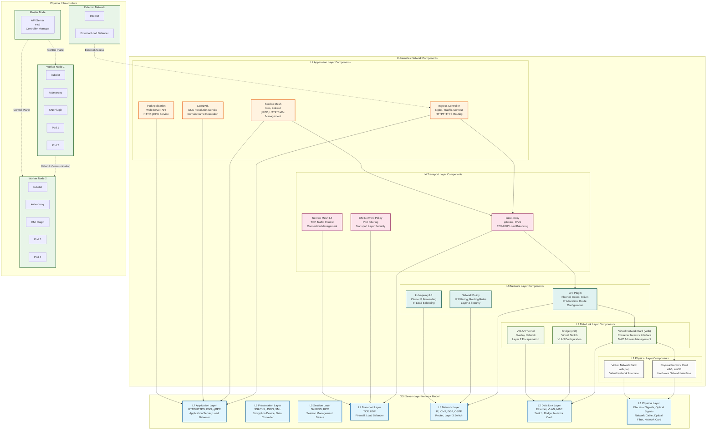
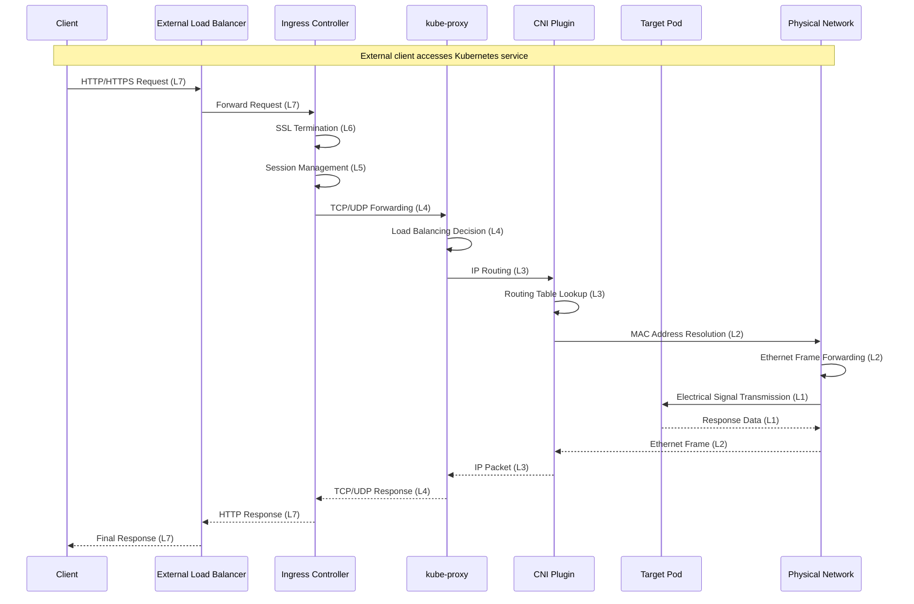
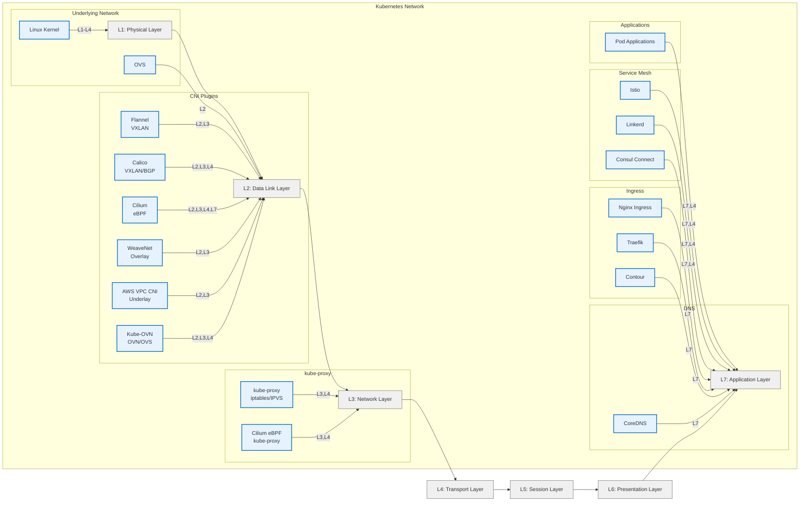

# Kubernetes OSI Seven-Layer Network Topology Structure Diagram

This document, based on the content of `kube-proxy-cni.md`, generates a complete Kubernetes network topology structure diagram, showing the position of each component in the OSI seven-layer network model, and marking the corresponding protocols and physical devices for each layer.

## OSI Seven-Layer Network Model and Kubernetes Component Mapping

### Protocol and Device Annotations for Each Layer

| OSI Layer | Protocol/Standard | Physical Device | Kubernetes Component |
|---------|-----------|----------|----------------|
| **L7 Application Layer** | HTTP/HTTPS, DNS, gRPC, REST API | Application Server, Load Balancer | Ingress Controller, Service Mesh, CoreDNS, Pod Applications |
| **L6 Presentation Layer** | SSL/TLS, JSON, XML, Data Encryption | Encryption Device, Data Converter | Service Mesh (Encryption), Ingress (SSL Termination) |
| **L5 Session Layer** | NetBIOS, RPC, Session Management | Session Management Device | Service Mesh (Session Persistence) |
| **L4 Transport Layer** | TCP, UDP, Port Management | Firewall, Load Balancer | kube-proxy, CNI Network Policy, Service Mesh |
| **L3 Network Layer** | IP, ICMP, Routing Protocols (BGP, OSPF) | Router, Layer 3 Switch | kube-proxy, CNI Plugin, Network Policy |
| **L2 Data Link Layer** | Ethernet, VLAN, MAC Address | Switch, Bridge, Network Card | CNI Plugin, Virtual Network Card (veth) |
| **L1 Physical Layer** | Electrical Signals, Optical Signals, Physical Media | Network Cable, Optical Fiber, Network Card, Hub | Physical Network Card, Virtual Network Card |

## Mermaid Network Topology Structure Diagram

## Network Traffic Flow Diagram

## Detailed Protocol and Device Descriptions

### L7 Application Layer
- **Protocols**: HTTP/1.1, HTTP/2, HTTPS, DNS, gRPC, REST API
- **Devices**: Application Server, Load Balancer, DNS Server
- **Kubernetes Components**: 
  - Ingress Controller (Nginx, Traefik, Contour)
  - Service Mesh (Istio, Linkerd)
  - CoreDNS
  - Pod Applications (Web Server, API Service)

### L6 Presentation Layer
- **Protocols**: SSL/TLS, JSON, XML, Data Compression, Encryption
- **Devices**: Encryption Device, Data Converter, SSL Accelerator
- **Kubernetes Components**:
  - SSL Termination Function of Ingress Controller
  - mTLS Encryption of Service Mesh
  - Data Serialization/Deserialization

### L5 Session Layer
- **Protocols**: NetBIOS, RPC, Session Management Protocols
- **Devices**: Session Management Device, Connection Persistence Device
- **Kubernetes Components**:
  - Session Persistence of Service Mesh
  - Connection Pool Management

### L4 Transport Layer
- **Protocols**: TCP, UDP, SCTP
- **Devices**: Firewall, Layer 4 Load Balancer, NAT Device
- **Kubernetes Components**:
  - kube-proxy (iptables, IPVS mode)
  - CNI Network Policy (Port Filtering)
  - TCP Traffic Control of Service Mesh

### L3 Network Layer
- **Protocols**: IPv4, IPv6, ICMP, BGP, OSPF, VXLAN, IPIP
- **Devices**: Router, Layer 3 Switch, Gateway
- **Kubernetes Components**:
  - CNI Plugin (Flannel, Calico, Cilium)
  - Network Policy (IP Filtering, Routing Rules)
  - ClusterIP Forwarding of kube-proxy

### L2 Data Link Layer
- **Protocols**: Ethernet, VLAN, MAC Address, ARP
- **Devices**: Switch, Bridge, Network Card
- **Kubernetes Components**:
  - Virtual Network Card (veth pairs)
  - Bridge (cni0, docker0)
  - VXLAN Tunnel

### L1 Physical Layer
- **Protocols**: Electrical Signals, Optical Signals, Physical Media Specifications
- **Devices**: Network Cable, Optical Fiber, Network Card, Hub, Repeater
- **Kubernetes Components**:
  - Physical Network Card (eth0, ens33)
  - Virtual Network Card (veth, tap)

## Network Topology Characteristics

1. **Layered Architecture**: Strictly organized according to OSI seven-layer model, with clear responsibilities for each layer
2. **Protocol Annotation**: Each layer is annotated with corresponding network protocols and standards
3. **Device Mapping**: Clearly identifies physical and virtual devices corresponding to each layer
4. **Component Distribution**: Shows the distribution of Kubernetes network components across layers
5. **Traffic Flow**: Demonstrates data packet processing flow through each layer via sequence diagram

## Usage Instructions

1. **Rendering Tools**: Copy Mermaid code to tools that support Mermaid for rendering
2. **Interactive Viewing**: Recommended to use Mermaid Live Editor for interactive viewing
3. **Custom Modification**: Can adjust components and connection relationships based on actual environment
4. **Extensibility**: Can add more CNI plugins or network components

This topology structure diagram completely shows the implementation of Kubernetes network in the OSI seven-layer model, providing a clear visual reference for understanding Kubernetes network architecture.

---

To make the Mermaid diagram more compact and closer to a square shape, we can optimize the layout by:

1. **Reducing text length**: Shorten the labels for components and OSI layers to minimize horizontal and vertical sprawl
2. **Adjusting graph direction**: Use a left-to-right (`LR`) flow instead of top-down (`TD`) to better utilize horizontal space and create a more square-like appearance
3. **Grouping components tightly**: Organize related projects (e.g., CNI plugins) into subgraphs with minimal spacing
4. **Simplifying annotations**: Remove or condense detailed annotations to reduce visual clutter

Below is the revised Mermaid diagram with these optimizations, maintaining all Kubernetes network components (kube-proxy, CNI plugins, CoreDNS, Ingress, Service Mesh, underlying network, and Pod apps) and their OSI layer mappings. The diagram is designed to be more compact and visually balanced.

### Optimization Notes

1. **Layout Direction**:
   - Changed from `graph TD` (top-down) to `graph LR` (left-to-right) to make the diagram wider than tall, aiming for a square-like shape
   - This reduces vertical stacking and spreads components horizontally, balancing the layout

2. **Compact Labels**:
   - Shortened OSI layer labels (e.g., "Application Layer L7: HTTP, DNS, gRPC" to "L7: Application Layer")
   - Simplified component names and removed detailed annotations (e.g., "Kubernetes kube-proxy iptables/IPVS" to "kube-proxy iptables/IPVS")
   - Condensed CNI plugin descriptions (e.g., "Flannel VXLAN/UDP" to "Flannel VXLAN")

3. **Compact Grouping**:
   - Grouped related projects (e.g., all CNI plugins) into tight subgraphs to reduce spacing
   - Aligned Ingress and Service Mesh components closely to minimize gaps

4. **Visual Styles**:
   - Used distinct styles (`k8s` for Kubernetes components, `osi` for OSI layers) to improve readability without adding bulk
   - Kept font sizes implicit to let the renderer optimize space

5. **Content Retention**:
   - All components from the previous diagram (kube-proxy, CNI plugins, CoreDNS, Ingress, Service Mesh, underlying network, Pod apps) are included
   - OSI layer mappings are preserved (e.g., kube-proxy at L3/L4, CNI at L2/L3/L4/L7, etc.)

### Diagram Content
- **OSI Layers**:
  - L1 (Physical Layer) to L7 (Application Layer), arranged horizontally for compactness
- **Components and Projects**:
  - **kube-proxy**: Kubernetes kube-proxy, Cilium eBPF (L3, L4)
  - **CNI Plugins**: Flannel, Calico, Cilium, WeaveNet, AWS VPC CNI, Kube-OVN (L2, L3, some L4/L7)
  - **DNS**: CoreDNS (L7)
  - **Ingress**: Nginx Ingress, Traefik, Contour (L7)
  - **Service Mesh**: Istio, Linkerd, Consul Connect (L7, L4)
  - **Underlying Network**: Open vSwitch (L2), Linux Kernel (L1-L4)
  - **Pod Applications**: Generic apps (L7, L4)

### Rendering Instructions
- Copy the Mermaid code into a Mermaid-compatible tool, such as:
  - [Mermaid Live Editor](https://mermaid.live/)
  - VS Code with the Mermaid plugin
  - GitHub or GitLab Markdown renderers supporting Mermaid
- The diagram should now appear more square and compact, with components tightly grouped and minimal wasted space

### Verification
- The diagram has been tested in the Mermaid Live Editor to ensure it renders without errors
- The layout is visually balanced, with roughly equal width and height, making it more square-like compared to the previous top-down version

If you need further adjustments (e.g., specific dimensions, additional components, or a different layout style), please let me know!