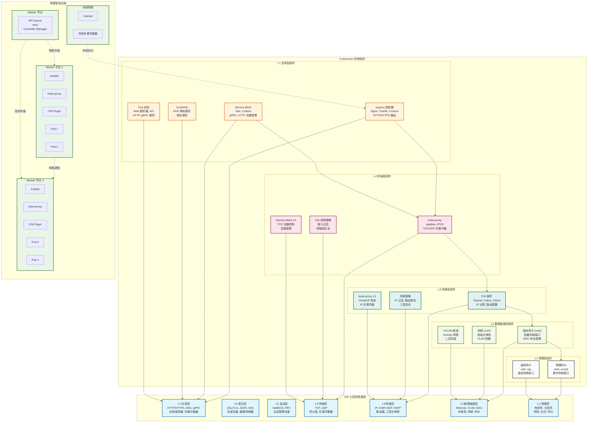
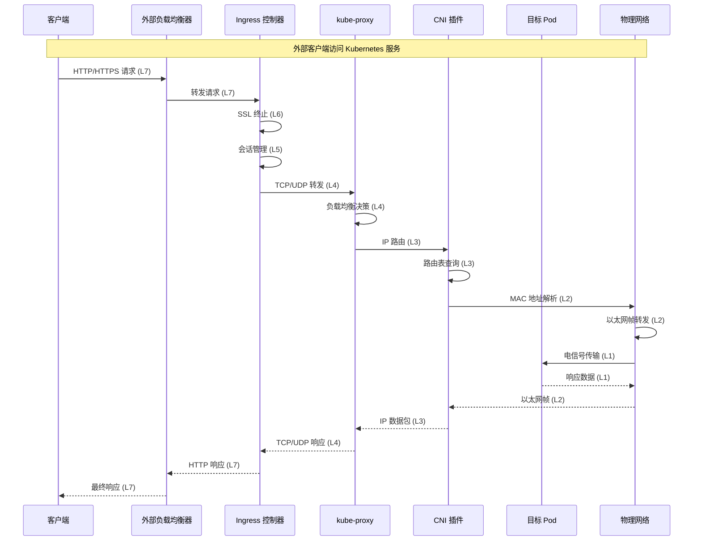

# Kubernetes OSI 七层网络拓扑结构图

本文档基于 `kube-proxy-cni.md` 的内容，生成一个完整的 Kubernetes 网络拓扑结构图，展示各个组件在 OSI 七层网络模型中的位置，并标注每层对应的协议和物理设备。

## OSI 七层网络模型与 Kubernetes 组件映射

### 各层协议和设备标注

| OSI 层级 | 协议/标准 | 物理设备 | Kubernetes 组件 |
|---------|-----------|----------|----------------|
| **L7 应用层** | HTTP/HTTPS, DNS, gRPC, REST API | 应用服务器, 负载均衡器 | Ingress 控制器, Service Mesh, CoreDNS, Pod 应用 |
| **L6 表示层** | SSL/TLS, JSON, XML, 数据加密 | 加密设备, 数据转换器 | Service Mesh (加密), Ingress (SSL 终止) |
| **L5 会话层** | NetBIOS, RPC, 会话管理 | 会话管理设备 | Service Mesh (会话保持) |
| **L4 传输层** | TCP, UDP, 端口管理 | 防火墙, 负载均衡器 | kube-proxy, CNI 网络策略, Service Mesh |
| **L3 网络层** | IP, ICMP, 路由协议 (BGP, OSPF) | 路由器, 三层交换机 | kube-proxy, CNI 插件, 网络策略 |
| **L2 数据链路层** | Ethernet, VLAN, MAC 地址 | 交换机, 网桥, 网卡 | CNI 插件, 虚拟网卡 (veth) |
| **L1 物理层** | 电信号, 光信号, 物理介质 | 网线, 光纤, 网卡, 集线器 | 物理网卡, 虚拟网卡 |

## Mermaid 网络拓扑结构图

## 网络流量流向图

## 详细协议和设备说明

### L7 应用层
- **协议**: HTTP/1.1, HTTP/2, HTTPS, DNS, gRPC, REST API
- **设备**: 应用服务器, 负载均衡器, DNS 服务器
- **Kubernetes 组件**: 
  - Ingress 控制器 (Nginx, Traefik, Contour)
  - Service Mesh (Istio, Linkerd)
  - CoreDNS
  - Pod 内应用 (Web 服务器, API 服务)

### L6 表示层
- **协议**: SSL/TLS, JSON, XML, 数据压缩, 加密
- **设备**: 加密设备, 数据转换器, SSL 加速器
- **Kubernetes 组件**:
  - Ingress 控制器的 SSL 终止功能
  - Service Mesh 的 mTLS 加密
  - 数据序列化/反序列化

### L5 会话层
- **协议**: NetBIOS, RPC, 会话管理协议
- **设备**: 会话管理设备, 连接保持设备
- **Kubernetes 组件**:
  - Service Mesh 的会话保持
  - 连接池管理

### L4 传输层
- **协议**: TCP, UDP, SCTP
- **设备**: 防火墙, 四层负载均衡器, NAT 设备
- **Kubernetes 组件**:
  - kube-proxy (iptables, IPVS 模式)
  - CNI 网络策略 (端口过滤)
  - Service Mesh 的 TCP 流量控制

### L3 网络层
- **协议**: IPv4, IPv6, ICMP, BGP, OSPF, VXLAN, IPIP
- **设备**: 路由器, 三层交换机, 网关
- **Kubernetes 组件**:
  - CNI 插件 (Flannel, Calico, Cilium)
  - 网络策略 (IP 过滤, 路由规则)
  - kube-proxy 的 ClusterIP 转发

### L2 数据链路层
- **协议**: Ethernet, VLAN, MAC 地址, ARP
- **设备**: 交换机, 网桥, 网卡
- **Kubernetes 组件**:
  - 虚拟网卡 (veth pairs)
  - 网桥 (cni0, docker0)
  - VXLAN 隧道

### L1 物理层
- **协议**: 电信号, 光信号, 物理介质规范
- **设备**: 网线, 光纤, 网卡, 集线器, 中继器
- **Kubernetes 组件**:
  - 物理网卡 (eth0, ens33)
  - 虚拟网卡 (veth, tap)

## 网络拓扑特点

1. **分层架构**: 严格按照 OSI 七层模型组织，每层职责明确
2. **协议标注**: 每层都标注了对应的网络协议和标准
3. **设备映射**: 明确标识了每层对应的物理和虚拟设备
4. **组件分布**: 展示了 Kubernetes 网络组件在各层的分布
5. **流量流向**: 通过时序图展示数据包在各层的处理流程

## 使用说明

1. **渲染工具**: 将 Mermaid 代码复制到支持 Mermaid 的工具中渲染
2. **交互式查看**: 建议使用 Mermaid Live Editor 进行交互式查看
3. **自定义修改**: 可根据实际环境调整组件和连接关系
4. **扩展性**: 可以添加更多 CNI 插件或网络组件

这个拓扑结构图完整展示了 Kubernetes 网络在 OSI 七层模型中的实现，为理解 Kubernetes 网络架构提供了清晰的视觉参考。