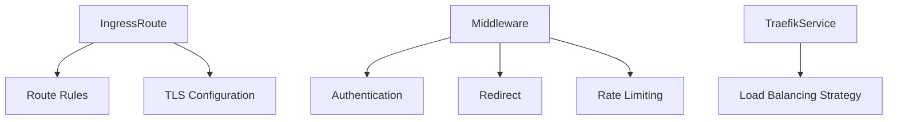

# Traefik Native CRD Support Detailed Explanation

Native CRD (Custom Resource Definition) support means that cloud-native tools like Traefik deeply integrate with Kubernetes' extension mechanisms through custom resource types, providing a more natural and powerful configuration method. This support represents deep integration with the Kubernetes ecosystem.

## Core Concept Analysis

### 1. What is CRD?
CRD (Custom Resource Definition) is a Kubernetes mechanism that allows users to extend APIs, enabling creation of:
- **Custom Resource Types** (such as `TraefikService`, `Middleware`)
- **Custom Controllers** to process these resources

### 2. Native Support vs Annotations Approach

| Feature               | Native CRD Support                          | Traditional Annotations Approach                     |
|--------------------|---------------------------------------|--------------------------------|
| **Configuration Form**       | Independent YAML resources                         | Adding annotations in Ingress resources       |
| **Validation Capability**       | Strong type Schema validation                     | String without structural validation               |
| **Discoverability**       | `kubectl get traefikservices`          | Need to check Ingress annotations            |
| **Function Extensibility**     | Can define complex object structures                  | Limited by annotation's key-value simple structure |
| **Version Management**       | Supports multi-version API conversion                   | No version control                    |

## Traefik's CRD Implementation

### 1. Main Custom Resource Types



#### Key CRD Examples:

- **IngressRoute** (Alternative to native Ingress)
  ```yaml
  apiVersion: traefik.io/v1alpha1
  kind: IngressRoute
  metadata:
    name: web-route
  spec:
    entryPoints: [web]
    routes:
    - match: Host(`example.com`) && PathPrefix(`/api`)
      kind: Rule
      services:
      - name: api-service
        port: 8080
      middlewares:
      - name: rate-limit
  ```

- **Middleware** (Middleware)
  ```yaml
  apiVersion: traefik.io/v1alpha1
  kind: Middleware
  metadata:
    name: auth-middleware
  spec:
    basicAuth:
      secret: auth-secret
  ```

- **TraefikService** (Advanced Service Definition)
  ```yaml
  apiVersion: traefik.io/v1alpha1
  kind: TraefikService
  metadata:
    name: weighted-service
  spec:
    weighted:
      services:
      - name: v1
        weight: 70
      - name: v2
        weight: 30
  ```

### 2. Install CRD Resources
CRD resources need to be pre-registered during deployment:
```bash
kubectl apply -f https://raw.githubusercontent.com/traefik/traefik/v2.6/docs/content/reference/dynamic-configuration/kubernetes-crd-definition-v1.yml
```

## Core Advantages

### 1. Type-Safe Configuration
```go
// Example CRD Go struct definition (actually used by Traefik)
type IngressRouteSpec struct {
    EntryPoints []string          `json:"entryPoints"`
    Routes      []Route           `json:"routes"`
    TLS         *TLS              `json:"tls,omitempty"`
}

type Route struct {
    Match       string            `json:"match"`
    Kind        string            `json:"kind"`
    Services    []Service         `json:"services"`
    Middlewares []MiddlewareRef   `json:"middlewares"`
}
```
- Compile-time field validation
- Automatic documentation and Schema generation

### 2. Dynamic Capability Combination
```yaml
# Combine multiple middlewares
apiVersion: traefik.io/v1alpha1
kind: Middleware
metadata:
  name: security-chain
spec:
  chain:
    middlewares:
    - name: rate-limit
    - name: ip-whitelist
    - name: auth
```

### 3. Deep Integration with Kubernetes Ecosystem
- Native support for `kubectl` operations
  ```bash
  kubectl get ingressroutes
  kubectl describe middleware rate-limit
  ```
- Seamless integration with RBAC system
- Support for Kubernetes' watch/update mechanisms

## Production Practice Example

### Case: Canary Release Configuration
```yaml
# 1. Define traffic splitting service
apiVersion: traefik.io/v1alpha1
kind: TraefikService
metadata:
  name: canary-app
spec:
  weighted:
    services:
    - name: app-v1
      weight: 90
    - name: app-v2
      weight: 10

# 2. Route to split service
apiVersion: traefik.io/v1alpha1
kind: IngressRoute
metadata:
  name: app-route
spec:
  entryPoints: [web]
  routes:
  - match: Host(`app.example.com`)
    kind: Rule
    services:
    - name: canary-app
      kind: TraefikService
```

### Verify Configuration
```bash
# View defined CRD resources
kubectl get crd | grep traefik

# Check resource configuration status
kubectl get ingressroutes -o wide
kubectl describe traefikservice canary-app
```

## Performance Considerations

1. **API Server Load**:
    - Each CRD operation goes through Kubernetes API
    - For large configurations, recommend batch application

2. **Controller Efficiency**:
   ```bash
   # View Traefik controller processing latency
   kubectl logs -n traefik traefik-pod | grep "Configuration reload"
   ```

3. **Resource Limit Recommendations**:
   ```yaml
   resources:
     limits:
       cpu: 1000m
       memory: 512Mi
     requests:
       cpu: 200m
       memory: 128Mi
   ```

Native CRD support makes Traefik a first-class citizen in the Kubernetes ecosystem. Compared with traditional annotation approaches, it provides more powerful, type-safe, and maintainable configuration methods, especially suitable for complex enterprise-level traffic management scenarios.