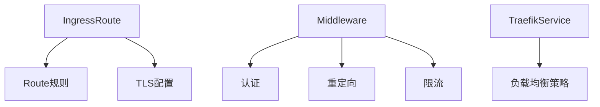

# Traefik 原生 CRD 支持详解

原生 CRD (Custom Resource Definition) 支持是指 Traefik 等云原生工具深度集成 Kubernetes 的扩展机制，通过自定义资源类型提供更自然、更强大的配置方式。这种支持代表了与 Kubernetes 生态系统的深度整合。

## 核心概念解析

### 1. 什么是 CRD？
CRD (Custom Resource Definition) 是 Kubernetes 允许用户扩展 API 的机制，可以创建：
- **自定义资源类型**（如 `TraefikService`, `Middleware`）
- **自定义控制器** 处理这些资源

### 2. 原生支持 vs 注解(Annotations)方式

| 特性               | 原生 CRD 支持                          | 传统注解方式                     |
|--------------------|---------------------------------------|--------------------------------|
| **配置形式**       | 独立 YAML 资源                         | 在 Ingress 资源中添加注解       |
| **验证能力**       | 强类型 Schema 校验                     | 字符串无结构校验               |
| **可发现性**       | `kubectl get traefikservices`          | 需查看 Ingress 注解            |
| **功能扩展性**     | 可定义复杂对象结构                      | 受限于注解的 key-value 简单结构 |
| **版本管理**       | 支持多版本 API 转换                     | 无版本控制                    |

## Traefik 的 CRD 实现

### 1. 主要自定义资源类型



#### 关键 CRD 示例：
- **IngressRoute** (替代原生 Ingress)
  ```yaml
  apiVersion: traefik.io/v1alpha1
  kind: IngressRoute
  metadata:
    name: web-route
  spec:
    entryPoints: [web]
    routes:
    - match: Host(`example.com`) && PathPrefix(`/api`)
      kind: Rule
      services:
      - name: api-service
        port: 8080
      middlewares:
      - name: rate-limit
  ```

- **Middleware** (中间件)
  ```yaml
  apiVersion: traefik.io/v1alpha1
  kind: Middleware
  metadata:
    name: auth-middleware
  spec:
    basicAuth:
      secret: auth-secret
  ```

- **TraefikService** (高级服务定义)
  ```yaml
  apiVersion: traefik.io/v1alpha1
  kind: TraefikService
  metadata:
    name: weighted-service
  spec:
    weighted:
      services:
      - name: v1
        weight: 70
      - name: v2
        weight: 30
  ```

### 2. 安装 CRD 资源
部署时需要预先注册 CRD：
```bash
kubectl apply -f https://raw.githubusercontent.com/traefik/traefik/v2.6/docs/content/reference/dynamic-configuration/kubernetes-crd-definition-v1.yml
```

## 核心优势

### 1. 类型安全的配置
```go
// 示例 CRD 的 Go 结构体定义（Traefik 实际使用）
type IngressRouteSpec struct {
    EntryPoints []string          `json:"entryPoints"`
    Routes      []Route           `json:"routes"`
    TLS         *TLS              `json:"tls,omitempty"`
}

type Route struct {
    Match       string            `json:"match"`
    Kind        string            `json:"kind"`
    Services    []Service         `json:"services"`
    Middlewares []MiddlewareRef   `json:"middlewares"`
}
```
- 编译时检查字段有效性
- 自动生成文档和Schema

### 2. 动态能力组合
```yaml
# 组合多个中间件
apiVersion: traefik.io/v1alpha1
kind: Middleware
metadata:
  name: security-chain
spec:
  chain:
    middlewares:
    - name: rate-limit
    - name: ip-whitelist
    - name: auth
```

### 3. 与 Kubernetes 生态深度集成
- 原生支持 `kubectl` 操作
  ```bash
  kubectl get ingressroutes
  kubectl describe middleware rate-limit
  ```
- 与 RBAC 系统无缝配合
- 支持 Kubernetes 的 watch/update 机制

## 生产实践示例

### 案例：金丝雀发布配置
```yaml
# 1. 定义流量拆分服务
apiVersion: traefik.io/v1alpha1
kind: TraefikService
metadata:
  name: canary-app
spec:
  weighted:
    services:
    - name: app-v1
      weight: 90
    - name: app-v2
      weight: 10

# 2. 路由到拆分服务
apiVersion: traefik.io/v1alpha1
kind: IngressRoute
metadata:
  name: app-route
spec:
  entryPoints: [web]
  routes:
  - match: Host(`app.example.com`)
    kind: Rule
    services:
    - name: canary-app
      kind: TraefikService
```

### 验证配置
```bash
# 查看已定义的 CRD 资源
kubectl get crd | grep traefik

# 检查资源配置状态
kubectl get ingressroutes -o wide
kubectl describe traefikservice canary-app
```

## 性能考量

1. **API Server 负载**：
    - 每个 CRD 操作都会经过 Kubernetes API
    - 大量配置时建议批量应用

2. **控制器效率**：
   ```bash
   # 查看 Traefik 控制器处理延迟
   kubectl logs -n traefik traefik-pod | grep "Configuration reload"
   ```

3. **资源限制建议**：
   ```yaml
   resources:
     limits:
       cpu: 1000m
       memory: 512Mi
     requests:
       cpu: 200m
       memory: 128Mi
   ```

原生 CRD 支持使 Traefik 成为 Kubernetes 生态中的一等公民，相比传统注解方式，它提供了更强大、更类型安全且更易维护的配置方式，特别适合复杂的企业级流量管理场景。
