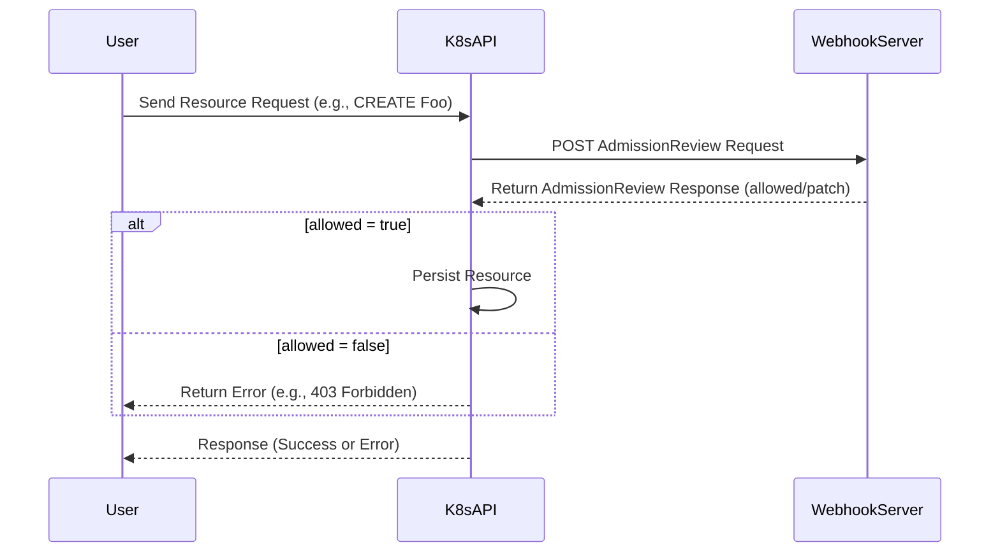
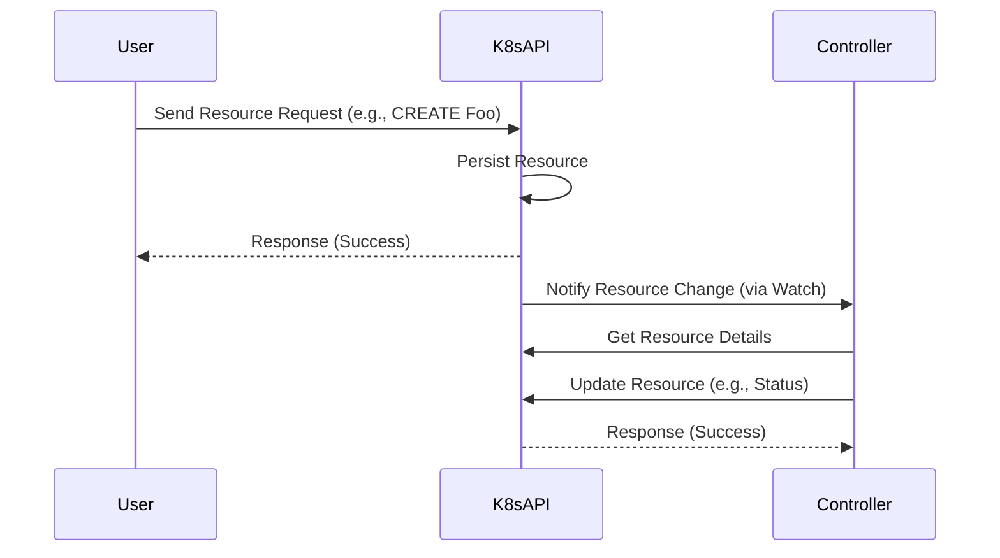
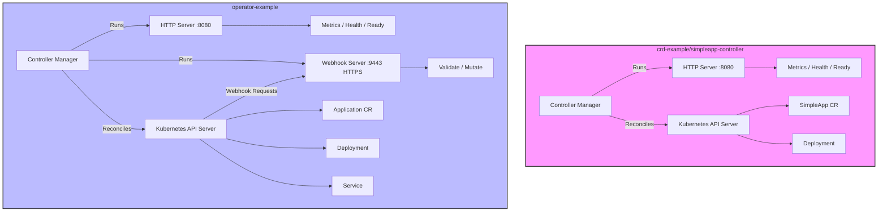

# 使用 `kubebuilder` 创建的项目可以通过启用 Webhook 功能来实现自定义资源的验证（ValidatingWebhook）或变更（MutatingWebhook）。Webhook 的数据内容通常是 Kubernetes API Server 发送给 Webhook 服务器的 `AdmissionReview` 请求，以及 Webhook 服务器返回的 `AdmissionReview` 响应。以下是一个典型的 Webhook 数据内容样例，包括请求和响应的结构。

### 1. **AdmissionReview 请求样例**
Kubernetes API Server 向 Webhook 服务器发送的 `AdmissionReview` 请求包含了待验证或变更的资源信息。以下是一个 JSON 格式的请求样例：

```json
{
  "apiVersion": "admission.k8s.io/v1",
  "kind": "AdmissionReview",
  "request": {
    "uid": "705ab4f5-6393-11e8-b7cc-42010a800002",
    "kind": {
      "group": "example.com",
      "version": "v1",
      "kind": "Foo"
    },
    "resource": {
      "group": "example.com",
      "version": "v1",
      "resource": "foos"
    },
    "requestKind": {
      "group": "example.com",
      "version": "v1",
      "kind": "Foo"
    },
    "requestResource": {
      "group": "example.com",
      "version": "v1",
      "resource": "foos"
    },
    "name": "my-foo",
    "namespace": "default",
    "operation": "CREATE",
    "userInfo": {
      "username": "system:serviceaccount:kube-system:generic-garbage-collector",
      "uid": "7903a66e-6392-11e8-b7cc-42010a800002",
      "groups": [
        "system:serviceaccounts",
        "system:serviceaccounts:kube-system",
        "system:authenticated"
      ]
    },
    "object": {
      "apiVersion": "example.com/v1",
      "kind": "Foo",
      "metadata": {
        "name": "my-foo",
        "namespace": "default"
      },
      "spec": {
        "field": "value"
      }
    },
    "oldObject": null,
    "dryRun": false,
    "options": {}
  }
}
```

#### 关键字段说明：
- `uid`: 请求的唯一标识符，用于响应时匹配。
- `kind` / `resource`: 描述操作的资源类型（例如自定义资源 `Foo`）。
- `operation`: 操作类型（`CREATE`, `UPDATE`, `DELETE`, `CONNECT`）。
- `object`: 当前请求的资源对象（对于 `CREATE` 和 `UPDATE`）。
- `oldObject`: 对于 `UPDATE` 或 `DELETE`，包含资源的上一个状态（对于 `CREATE` 为 `null`）。
- `userInfo`: 执行操作的用户信息。
- `namespace`: 资源所在的命名空间（如果适用）。

### 2. **AdmissionReview 响应样例**
Webhook 服务器处理请求后，返回一个 `AdmissionReview` 响应，指示是否允许该操作（验证 Webhook）或对资源进行修改（变更 Webhook）。以下是一个响应的 JSON 样例：

#### 验证 Webhook（ValidatingWebhook）响应
验证 Webhook 用于检查资源是否符合规则，决定是否允许操作。

```json
{
  "apiVersion": "admission.k8s.io/v1",
  "kind": "AdmissionReview",
  "response": {
    "uid": "705ab4f5-6393-11e8-b7cc-42010a800002",
    "allowed": true
  }
}
```

如果验证失败，可以返回拒绝信息：

```json
{
  "apiVersion": "admission.k8s.io/v1",
  "kind": "AdmissionReview",
  "response": {
    "uid": "705ab4f5-6393-11e8-b7cc-42010a800002",
    "allowed": false,
    "status": {
      "code": 403,
      "message": "Spec.field must not be empty"
    }
  }
}
```

#### 变更 Webhook（MutatingWebhook）响应
变更 Webhook 可以修改资源内容，通过 `patch` 字段返回 JSON Patch。

```json
{
  "apiVersion": "admission.k8s.io/v1",
  "kind": "AdmissionReview",
  "response": {
    "uid": "705ab4f5-6393-11e8-b7cc-42010a800002",
    "allowed": true,
    "patchType": "JSONPatch",
    "patch": "W3sib3AiOiAiYWRkIiwgInBhdGgiOiAiL3NwZWMvbmV3RmllbGQiLCAidmFsdWUiOiAibXlWYWx1ZSJ9XQ=="
  }
}
```

#### 关键字段说明：
- `uid`: 必须与请求中的 `uid` 匹配。
- `allowed`: 是否允许操作（`true` 表示允许，`false` 表示拒绝）。
- `status`: 如果 `allowed` 为 `false`，可提供拒绝的原因和 HTTP 状态码。
- `patchType`: 如果是变更 Webhook，返回的补丁类型（通常为 `JSONPatch`）。
- `patch`: 基于 JSON Patch（RFC 6902）的补丁内容，Base64 编码。例如，上例中的 Base64 解码后为：
  ```json
  [{"op": "add", "path": "/spec/newField", "value": "myValue"}]
  ```
  表示向资源的 `spec` 中添加一个字段 `newField`。

### 3. **在 Kubebuilder 项目中的实现**
在 Kubebuilder 项目中，Webhook 的实现通常在 `api/v1/<kind>_webhook.go` 文件中（例如 `foo_webhook.go`）。以下是一个简单的验证 Webhook 实现样例：

```go
package v1

import (
	"context"
	"fmt"

	apierrors "k8s.io/apimachinery/pkg/api/errors"
	"k8s.io/apimachinery/pkg/runtime"
	ctrl "sigs.k8s.io/controller-runtime"
	"sigs.k8s.io/controller-runtime/pkg/webhook"
	"sigs.k8s.io/controller-runtime/pkg/webhook/admission"
)

// +kubebuilder:webhook:path=/validate-example-com-v1-foo,mutating=false,failurePolicy=fail,sideEffects=None,groups=example.com,resources=foos,verbs=create;update,versions=v1,name=vfoo.kb.io,admissionReviewVersions=v1

func (r *Foo) SetupWebhookWithManager(mgr ctrl.Manager) error {
	return ctrl.NewWebhookManagedBy(mgr).
		For(r).
		Complete()
}

// +kubebuilder:webhook:verbs=create;update,path=/validate-example-com-v1-foo,mutating=false,failurePolicy=fail,groups=example.com,resources=foos,versions=v1,name=vfoo.kb.io,sideEffects=None,admissionReviewVersions=v1

func (r *Foo) ValidateCreate() (admission.Warnings, error) {
	if r.Spec.Field == "" {
		return nil, apierrors.NewInvalid(
			r.GroupVersionKind().GroupKind(),
			r.Name,
			field.ErrorList{
				field.Invalid(field.NewPath("spec").Child("field"), r.Spec.Field, "field must not be empty"),
			})
	}
	return nil, nil
}

func (r *Foo) ValidateUpdate(old runtime.Object) (admission.Warnings, error) {
	return r.ValidateCreate()
}

func (r *Foo) ValidateDelete() (admission.Warnings, error) {
	return nil, nil
}
```

#### 说明：
- `+kubebuilder:webhook` 注释定义了 Webhook 的配置（路径、操作、资源等）。
- `ValidateCreate` 和 `ValidateUpdate` 方法实现验证逻辑，返回错误以拒绝不符合规则的请求。
- Kubebuilder 自动生成 Webhook 的服务端代码，并注册到 Kubernetes。

### 4. **如何测试 Webhook**
可以使用 `kubectl` 模拟发送 `AdmissionReview` 请求，或者直接在集群中创建/更新资源，观察 Webhook 的行为。例如：

```bash
kubectl apply -f - <<EOF
apiVersion: example.com/v1
kind: Foo
metadata:
  name: my-foo
  namespace: default
spec:
  field: ""
EOF
```

如果 `field` 为空，上述验证 Webhook 将拒绝请求，并返回类似 `"field must not be empty"` 的错误。

### 5. **注意事项**
- **安全性**：确保 Webhook 服务器使用 TLS（Kubebuilder 默认生成自签名证书）。
- **性能**：Webhook 需快速响应，避免阻塞 API Server。
- **错误处理**：在响应中提供清晰的错误信息，便于调试。
- **FailurePolicy**：在 Webhook 注释中配置 `failurePolicy`（`Fail` 或 `Ignore`），决定 Webhook 不可用时的行为。

如果需要更具体的 Webhook 实现（例如变更 Webhook 的 JSON Patch 生成）或针对某特定自定义资源的样例，请提供更多细节，我可以进一步定制代码或数据内容！

---

使用 Webhook 实现的控制器（通常指 Kubernetes 自定义控制器结合 Webhook 功能）和不使用 Webhook 实现的控制器，在功能、实现方式和使用场景上有显著区别。以下从多个维度详细对比两者的差异：

### 1. **定义和作用**
- **Webhook 控制器**：
    - Webhook 是 Kubernetes 提供的一种扩展机制，通过 `MutatingWebhookConfiguration` 或 `ValidatingWebhookConfiguration`，在资源操作（CREATE、UPDATE、DELETE 等）时调用外部 HTTP 服务。
    - 主要用于**实时干预** Kubernetes API 请求，例如验证资源合法性（ValidatingWebhook）或修改资源内容（MutatingWebhook）。
    - Webhook 是 API Server 的“拦截器”，在资源持久化到 etcd 之前执行。
    - 常用于自定义资源（CRD）的验证或默认值设置。

- **非 Webhook 控制器**：
    - 通常指通过 `controller-runtime` 或其他框架实现的 Kubernetes 控制器，基于事件驱动的**调谐循环（Reconcile Loop）**。
    - 通过监听 API 对象的变化（使用 Informer/Watch 机制），在事件发生后异步处理逻辑，调谐实际状态到期望状态。
    - 更适合处理需要持续监控和管理的资源，例如部署 Pod、更新状态字段等。

### 2. **执行时机**
- **Webhook 控制器**：
    - **同步执行**：在 Kubernetes API 请求的生命周期中（资源创建、更新等）被调用，属于请求处理的一部分。
    - 直接影响 API 请求的结果（例如拒绝创建、修改资源内容）。
    - 执行在资源持久化到 etcd 之前，响应速度要求高。

- **非 Webhook 控制器**：
    - **异步执行**：通过事件队列（Informer）监听资源变化，触发 `Reconcile` 函数进行处理。
    - 在资源已持久化到 etcd 后运行，通常不直接干预 API 请求。
    - 适合处理需要较长时间的操作，例如创建子资源、调用外部服务等。

### 3. **功能差异**
- **Webhook 控制器**：
    - **验证（ValidatingWebhook）**：检查资源是否符合规则，例如确保某个字段不为空。返回 `allowed: false` 可阻止操作。
    - **变更（MutatingWebhook）**：修改资源内容，例如设置默认值、添加标签等，返回 JSON Patch。
    - **集中式干预**：适合需要在资源创建或更新时强制执行规则的场景。
    - **无状态逻辑**：Webhook 通常只处理当前请求的资源快照，不维护状态。

- **非 Webhook 控制器**：
    - **状态调谐**：通过比较资源的期望状态（Spec）和实际状态（Status），执行操作以消除差异。例如，Deployment 控制器根据副本数创建或删除 Pod。
    - **复杂逻辑**：可以处理多资源协调、外部系统交互、状态更新等。
    - **有状态逻辑**：控制器通常通过缓存（Informer）或其他机制跟踪资源状态，适合需要历史信息或上下文的场景。
    - **事件驱动**：对资源变化做出反应，适合长期运行的业务逻辑。

### 4. **实现方式**
- **Webhook 控制器**（以 Kubebuilder 为例）：
    - 在 Kubebuilder 项目中，通过 `+kubebuilder:webhook` 注释定义 Webhook 路径、操作等。
    - 实现 `ValidateCreate`、`ValidateUpdate`、`Default` 等方法处理验证或变更逻辑。
    - 需要部署 Webhook 服务端（通常是 HTTPS 服务器），并配置 TLS 证书。
    - 示例代码（验证 Webhook）：
      ```go
      func (r *Foo) ValidateCreate() (admission.Warnings, error) {
          if r.Spec.Field == "" {
              return nil, apierrors.NewInvalid(
                  r.GroupVersionKind().GroupKind(),
                  r.Name,
                  field.ErrorList{
                      field.Invalid(field.NewPath("spec").Child("field"), r.Spec.Field, "field must not be empty"),
                  })
          }
          return nil, nil
      }
      ```

- **非 Webhook 控制器**（以 Kubebuilder 为例）：
    - 实现 `Reconcile` 函数，处理资源的调谐逻辑。
    - 使用 Informer 监听资源变化，触发 `Reconcile` 调用。
    - 不需要额外的 HTTPS 服务端，只需运行控制器进程。
    - 示例代码（Reconcile 逻辑）：
      ```go
      func (r *FooReconciler) Reconcile(ctx context.Context, req ctrl.Request) (ctrl.Result, error) {
          foo := &examplev1.Foo{}
          if err := r.Get(ctx, req.NamespacedName, foo); err != nil {
              return ctrl.Result{}, client.IgnoreNotFound(err)
          }
          if foo.Spec.Field == "" {
              foo.Status.Error = "Field is empty"
              return ctrl.Result{}, r.Status().Update(ctx, foo)
          }
          foo.Status.Error = ""
          return ctrl.Result{}, r.Status().Update(ctx, foo)
      }
      ```

### 5. **使用场景**
- **Webhook 控制器**：
    - **强制验证**：确保资源满足特定规则，例如 CRD 的字段约束（必填字段、值范围等）。
    - **默认值设置**：自动为资源设置默认值，例如为 Pod 添加特定注解。
    - **跨资源约束**：验证资源与其他资源的依赖关系（例如，确保引用的 ConfigMap 存在）。
    - **快速干预**：需要立即阻止不符合规则的操作。
    - 示例：Istio 的 Webhook 验证 Sidecar 配置，Kubebuilder 生成的 CRD 默认 Webhook。

- **非 Webhook 控制器**：
    - **资源管理**：管理资源的生命周期，例如创建子资源（Pod、Service）、清理无用资源。
    - **状态同步**：将外部系统状态同步到 Kubernetes（例如，更新 CR 的 Status 字段）。
    - **复杂工作流**：需要协调多个资源或执行多步骤操作。
    - 示例：Deployment 控制器管理 ReplicaSet 和 Pod，Operator 管理数据库实例。

### 6. **优缺点**
- **Webhook 控制器**：
    - **优点**：
        - 实时性强，直接干预 API 请求。
        - 适合简单的验证或变更逻辑，代码实现较轻量。
        - 与 Kubernetes API 紧密集成，适合扩展 CRD 功能。
    - **缺点**：
        - 性能要求高，延迟会影响 API 请求。
        - 需要部署 HTTPS 服务端，配置 TLS 增加复杂性。
        - 不适合复杂逻辑或需要长期运行的任务。
        - 如果 Webhook 不可用（取决于 `failurePolicy`），可能导致 API 请求失败或绕过验证。

- **非 Webhook 控制器**：
    - **优点**：
        - 适合复杂逻辑和异步处理，不阻塞 API 请求。
        - 无需额外 HTTPS 服务端，部署更简单。
        - 通过事件重试机制，容错性更强。
        - 适合需要状态跟踪或多资源协调的场景。
    - **缺点**：
        - 异步处理，无法阻止不符合规则的资源被持久化（只能事后纠正）。
        - 实现复杂逻辑可能需要更多代码和状态管理。
        - 对 Informer 缓存和事件队列有依赖，调试可能更复杂。

### 7. **部署和运维**
- **Webhook 控制器**：
    - 需要部署 Webhook 服务端，通常作为 Kubernetes 集群中的 Pod 运行。
    - 必须配置 TLS 证书（Kubebuilder 可自动生成自签名证书）。
    - 需要注册 `MutatingWebhookConfiguration` 或 `ValidatingWebhookConfiguration` 到 API Server。
    - 如果服务不可用，可能导致 API 请求失败（取决于 `failurePolicy=Fail` 或 `Ignore`）。

- **非 Webhook 控制器**：
    - 仅需部署控制器进程，通常作为 Deployment 运行。
    - 无需 TLS 或额外 Webhook 配置，依赖 Kubernetes Client 库与 API Server 通信。
    - 如果控制器不可用，事件会积压，恢复后继续处理，影响较小。

### 8. **Kubebuilder 中的典型实现**
- **Webhook 控制器**：
    - Kubebuilder 通过 `kubebuilder create webhook` 命令生成 Webhook 框架代码。
    - 自动生成 Webhook 的服务端代码和 Kubernetes 配置文件。
    - 在 `api/v1/<kind>_webhook.go` 中实现验证或变更逻辑。

- **非 Webhook 控制器**：
    - Kubebuilder 通过 `kubebuilder create api` 命令生成控制器框架代码。
    - 在 `controllers/<kind>_controller.go` 中实现 `Reconcile` 逻辑。
    - 自动配置 Informer 和事件处理。

### 9. **实际案例对比**
- **场景**：管理一个自定义资源 `Foo`，要求 `spec.field` 不为空。
    - **Webhook 实现**（ValidatingWebhook）：
        - 在资源创建或更新时，检查 `spec.field`，如果为空，直接拒绝请求（返回 `allowed: false`）。
        - 用户会收到类似 `spec.field must not be empty` 的错误，资源不会被持久化。
    - **非 Webhook 实现**（控制器）：
        - 监听 `Foo` 资源变化，在 `Reconcile` 中检查 `spec.field`。
        - 如果为空，更新 `status.error` 字段记录错误，或尝试修复（例如，触发其他操作）。
        - 资源会被持久化，但控制器会异步处理问题。

### 10. **总结**
| 特性                | Webhook 控制器                          | 非 Webhook 控制器                     |
|---------------------|---------------------------------------|-------------------------------------|
| **执行时机**        | 同步，API 请求处理期间                | 异步，资源变化后                    |
| **主要功能**        | 验证资源、修改资源                    | 调谐状态、管理资源生命周期          |
| **实时性**          | 高，直接干预 API 请求                 | 低，异步处理                        |
| **复杂逻辑**        | 不适合，需快速响应                    | 适合，可处理复杂工作流              |
| **部署要求**        | HTTPS 服务端、TLS 证书                | 仅需控制器进程                      |
| **容错性**          | 依赖 `failurePolicy`，可能影响 API     | 事件重试，容错性强                  |
| **典型场景**        | CRD 验证、默认值设置                  | Operator、资源管理、状态同步        |

### 11. **选择建议**
- 如果需要**实时验证或修改资源**（例如，强制字段约束、设置默认值），选择 Webhook 控制器。
- 如果需要**异步管理资源状态**或**复杂业务逻辑**（例如，创建子资源、外部系统同步），选择非 Webhook 控制器。
- 在实际项目中，**两者可以结合使用**：
    - 使用 Webhook 确保资源创建时的基本验证和默认值。
    - 使用控制器处理资源的后续管理、状态更新或复杂协调。

如果有具体的自定义资源或场景需要进一步分析，可以提供更多细节，我可以帮你设计两者的实现方案或代码样例！

---

非 Webhook 的 Kubernetes 控制器（通常基于 `controller-runtime` 或 Kubebuilder 实现）**不使用 HTTPS 服务端**，也**没有回调接口**，这与 Webhook 控制器有根本区别。以下详细解答并对比两者，解释非 Webhook 控制器的运行机制及其与 HTTPS 服务端和回调接口的关系。

### 1. **非 Webhook 控制器的运行机制**
- **事件驱动的调谐循环**：
    - 非 Webhook 控制器通过 Kubernetes 的 Informer 机制（或 `controller-runtime` 提供的客户端）监听 API 资源的变化（例如，创建、更新、删除）。
    - 当检测到资源事件时，控制器将事件放入工作队列，并触发 `Reconcile` 函数处理。
    - `Reconcile` 函数根据资源的当前状态（Spec 和 Status）执行逻辑，调谐实际状态到期望状态。
- **与 API Server 的交互**：
    - 控制器通过 Kubernetes API Client（通常基于 REST 或 gRPC）与 API Server 通信，获取资源信息或更新资源。
    - 通信使用客户端证书或 ServiceAccount 的 Token 进行认证，通常通过 HTTP/HTTPS，但这是客户端到 API Server 的通信，不是控制器本身提供服务端。
- **无服务端**：
    - 控制器是一个运行在集群内或外的进程（通常作为 Pod 部署），不暴露任何 HTTP/HTTPS 端点。
    - 它只“消费” API Server 的事件，不接受外部 HTTP 请求。

### 2. **是否使用 HTTPS 服务端？**
- **非 Webhook 控制器**：
    - **无 HTTPS 服务端**：控制器不运行任何 HTTP/HTTPS 服务器，也不监听任何端口。
    - 控制器的运行只需要与 Kubernetes API Server 通信（通过 HTTPS，但这是客户端行为）。
    - 部署时，控制器只需要一个容器运行进程，无需配置 TLS 证书或 Web 服务器。
    - 示例：Kubebuilder 生成的控制器（`controllers/<kind>_controller.go`）只包含 `Reconcile` 逻辑，依赖 Informer 和 API Client，无服务端代码。
      ```go
      func (r *FooReconciler) Reconcile(ctx context.Context, req ctrl.Request) (ctrl.Result, error) {
          foo := &examplev1.Foo{}
          if err := r.Get(ctx, req.NamespacedName, foo); err != nil {
              return ctrl.Result{}, client.IgnoreNotFound(err)
          }
          // 调谐逻辑，例如更新 Status
          return ctrl.Result{}, nil
      }
      ```

- **Webhook 控制器**：
    - **需要 HTTPS 服务端**：Webhook 控制器运行一个 HTTPS 服务器，监听特定路径（例如 `/validate` 或 `/mutate`），接收 API Server 发送的 `AdmissionReview` 请求。
    - 必须配置 TLS 证书（Kubebuilder 自动生成自签名证书），并注册 `MutatingWebhookConfiguration` 或 `ValidatingWebhookConfiguration`。
    - 示例：Kubebuilder 的 Webhook 实现（`api/v1/<kind>_webhook.go`）包含 HTTP 处理器。
      ```go
      func (r *Foo) ValidateCreate() (admission.Warnings, error) {
          // 验证逻辑
          return nil, nil
      }
      ```

### 3. **是否提供回调接口？**
- **非 Webhook 控制器**：
    - **无回调接口**：控制器不接受任何外部 HTTP 请求，因此没有回调接口的概念。
    - 控制器的核心是 `Reconcile` 函数，由内部事件队列触发，而不是通过外部 API 调用。
    - 它通过主动“拉取”事件（Informer Watch）或处理工作队列中的任务来运行，不依赖外部系统发起请求。
    - 交互方式：控制器通过 API Server 的 Watch 机制“订阅”资源变化，API Server 推送事件到控制器的 Informer 缓存。

- **Webhook 控制器**：
    - **提供回调接口**：Webhook 控制器暴露 HTTP/HTTPS 端点（例如 `/validate-example-com-v1-foo`），API Server 在资源操作时通过 HTTP POST 请求调用这些端点。
    - 回调接口接收 `AdmissionReview` 请求，控制器处理后返回 `AdmissionReview` 响应。
    - 示例：API Server 发送 POST 请求到 Webhook 的 HTTPS 端点，包含资源信息，Webhook 响应是否允许操作。

### 4. **通信模式对比**
| 特性                | 非 Webhook 控制器                     | Webhook 控制器                       |
|---------------------|-------------------------------------|-------------------------------------|
| **HTTPS 服务端**    | 无，仅作为客户端与 API Server 通信   | 有，运行 HTTPS 服务器接收请求       |
| **回调接口**        | 无，事件通过 Informer 触发 Reconcile | 有，API Server 通过 HTTP 调用       |
| **通信方向**        | 控制器 → API Server（拉取/Watch）   | API Server → 控制器（HTTP POST）    |
| **TLS 要求**        | 无需 TLS（仅客户端认证）            | 必须配置 TLS 证书                   |
| **触发机制**        | 事件队列（异步）                   | HTTP 请求（同步）                   |

### 5. **实际案例对比**
- **场景**：确保自定义资源 `Foo` 的 `spec.field` 不为空。
    - **非 Webhook 控制器**：
        - 监听 `Foo` 资源变化，在 `Reconcile` 中检查 `spec.field`。
        - 如果为空，更新 `status.error` 或触发修复操作。
        - 资源会被持久化，控制器异步处理问题。
        - 无 HTTPS 服务端，逻辑在控制器进程内运行。
      ```go
      if foo.Spec.Field == "" {
          foo.Status.Error = "Field is empty"
          return ctrl.Result{}, r.Status().Update(ctx, foo)
      }
      ```

    - **Webhook 控制器**：
        - 在资源创建/更新时，API Server 调用 Webhook 的 HTTPS 端点（例如 `/validate`）。
        - Webhook 检查 `spec.field`，返回 `allowed: false` 阻止操作。
        - 需要运行 HTTPS 服务器，配置 TLS 和 Webhook 注册。
      ```go
      if r.Spec.Field == "" {
          return nil, apierrors.NewInvalid(
              r.GroupVersionKind().GroupKind(),
              r.Name,
              field.ErrorList{
                  field.Invalid(field.NewPath("spec").Child("field"), r.Spec.Field, "field must not be empty"),
              })
      }
      ```

### 6. **非 Webhook 控制器的部署**
- 部署为 Kubernetes Deployment 或本地进程，只需：
    - 配置 ServiceAccount 和 RBAC 权限，允许控制器访问 API Server。
    - 运行控制器进程（Kubebuilder 的 `main.go` 启动）。
- 无需暴露端口、配置 TLS 或注册 Webhook 配置。
- 示例 Kubebuilder 项目结构：
  ```
  controllers/
    foo_controller.go  # Reconcile 逻辑
  main.go             # 启动控制器
  ```

### 7. **为什么非 Webhook 控制器不需要 HTTPS 服务端或回调接口？**
- **设计目标**：非 Webhook 控制器旨在异步管理资源状态，响应资源变化，而不是干预 API 请求。
- **事件驱动**：通过 Informer/Watch 机制，控制器被动接收事件，无需外部系统主动调用。
- **解耦性**：控制器与 API Server 的交互是单向的（控制器作为客户端），无需提供服务端接口。
- **简化部署**：无需 HTTPS 服务端，降低运维复杂性，适合复杂逻辑或长期运行的任务。

### 8. **可能的误解**
- **误解 1**：控制器与 API Server 的 HTTPS 通信是否意味着控制器有 HTTPS 服务端？
    - 答：控制器作为客户端通过 HTTPS 与 API Server 通信，但这不意味着控制器运行服务端。HTTPS 是 API Server 提供的，控制器只负责发起请求。
- **误解 2**：控制器是否需要类似 Webhook 的回调机制？
    - 答：控制器通过 Informer 的事件队列处理资源变化，无需外部回调。Informer 内部通过 Watch 机制实现类似“回调”的功能，但这是客户端行为，不是 HTTP 回调。

### 9. **总结**
- **非 Webhook 控制器**：
    - **无 HTTPS 服务端**：仅作为客户端与 API Server 通信。
    - **无回调接口**：通过 Informer 的事件队列触发 `Reconcile`，不接受 HTTP 请求。
    - 适合异步、复杂的状态管理，部署简单，无需 TLS 配置。
- **Webhook 控制器**：
    - 运行 HTTPS 服务端，暴露回调接口，接收 API Server 的 `AdmissionReview` 请求。
    - 适合实时验证或修改资源，需要 TLS 和 Webhook 注册。

如果需要进一步澄清非 Webhook 控制器的实现细节、代码样例，或对比特定场景下的设计选择，请提供更多上下文，我可以提供更具体的解答或代码！

---

非 Webhook 控制器通过 Informer 机制与 Kubernetes API Server 通信，通信方向是**控制器 → API Server（拉取/Watch）**，并且这种通信是**事件驱动**的。下面详细解答非 Webhook 控制器在**什么时候**进行通信，以及通信的触发时机和机制。

### 1. **通信的整体机制**
- **Informer 机制**：
    - 非 Webhook 控制器使用 Kubernetes 的 Informer（通常由 `controller-runtime` 提供）来监听特定资源（例如，Pod、Deployment 或自定义资源）的变化。
    - Informer 通过 **Watch 机制**与 API Server 建立长连接，订阅资源的事件（`ADDED`、`MODIFIED`、`DELETED`）。
    - 当 API Server 检测到资源变化时，会通过 Watch 通道将事件推送给控制器的 Informer。
    - Informer 将事件缓存到本地，并将需要处理的资源键（例如 `namespace/name`）放入工作队列，触发控制器的 `Reconcile` 函数。

- **通信方向**：
    - **控制器 → API Server**：控制器主动发起与 API Server 的通信，包括：
        - **List 操作**：初始同步时，获取资源的完整列表。
        - **Watch 操作**：建立长连接，订阅资源变化。
        - **Get/Update 操作**：在 `Reconcile` 中查询或更新资源。
    - API Server 推送事件到控制器，但这通过 Watch 通道实现，不是 HTTP 回调。

### 2. **通信发生的具体时机**
非 Webhook 控制器的通信主要发生在以下几个阶段：

#### （1）**控制器启动时：初始同步**
- **时机**：
    - 当控制器进程启动时（例如，Kubebuilder 的 `main.go` 运行），Informer 会初始化并与 API Server 通信。
- **通信内容**：
    - **List 请求**：Informer 向 API Server 发送 HTTP GET 请求，获取监听资源（例如，所有 `Foo` 资源）的完整列表。
    - **Watch 请求**：在 List 完成后，Informer 发起 Watch 请求，建立与 API Server 的长连接，订阅资源的后续变化。
- **通信方向**：
    - 控制器 → API Server：发送 List 和 Watch 请求。
    - API Server → 控制器：返回资源列表和 Watch 事件流。
- **示例**：
    - 控制器启动时，Informer 获取所有 `example.com/v1` 组的 `Foo` 资源，缓存到本地，并开始 Watch。
    - HTTP 请求示例（伪代码）：
      ```
      GET /apis/example.com/v1/foos
      GET /apis/example.com/v1/foos?watch=true
      ```

#### （2）**资源变化时：Watch 事件触发**
- **时机**：
    - 当集群中的资源发生变化（例如，创建、更新、删除 `Foo` 资源）时，API Server 通过 Watch 通道推送事件。
    - 事件类型包括：
        - `ADDED`：资源被创建。
        - `MODIFIED`：资源被更新（Spec、Metadata 或 Status）。
        - `DELETED`：资源被删除。
- **通信内容**：
    - API Server 推送事件到控制器的 Informer（通过已建立的 Watch 连接）。
    - Informer 更新本地缓存，并将资源键（例如 `default/my-foo`）加入工作队列。
    - 工作队列触发 `Reconcile` 函数处理事件。
- **通信方向**：
    - API Server → 控制器：推送 Watch 事件。
    - 控制器 → API Server：`Reconcile` 中可能发起 Get/Update 请求以获取最新资源状态或更新资源。
- **示例**：
    - 用户运行 `kubectl apply -f foo.yaml` 创建一个 `Foo` 资源。
    - API Server 推送 `ADDED` 事件到控制器的 Informer。
    - 控制器在 `Reconcile` 中处理：
      ```go
      func (r *FooReconciler) Reconcile(ctx context.Context, req ctrl.Request) (ctrl.Result, error) {
          foo := &examplev1.Foo{}
          if err := r.Get(ctx, req.NamespacedName, foo); err != nil {
              return ctrl.Result{}, client.IgnoreNotFound(err)
          }
          // 处理逻辑，例如更新 Status
          foo.Status.State = "Processed"
          return ctrl.Result{}, r.Status().Update(ctx, foo)
      }
      ```

#### （3）**Reconcile 执行时：主动查询或更新**
- **时机**：
    - 当 `Reconcile` 函数被工作队列触发时，控制器可能需要与 API Server 通信以：
        - **查询资源状态**：通过 `Get` 获取资源的最新 Spec 或 Status。
        - **更新资源**：通过 `Update` 或 `Patch` 修改资源的 Spec、Status 或 Metadata。
        - **创建/删除子资源**：例如，创建 Pod 或清理无用资源。
- **通信内容**：
    - **Get 请求**：获取特定资源（例如，`GET /apis/example.com/v1/namespaces/default/foos/my-foo`）。
    - **Update/Patch 请求**：更新资源（例如，`PUT /apis/example.com/v1/namespaces/default/foos/my-foo`）。
    - **List 请求**：查询相关资源（例如，列出所有相关 Pod）。
- **通信方向**：
    - 控制器 → API Server：发送 Get/Update/Patch 请求。
    - API Server → 控制器：返回资源数据或确认更新。
- **示例**：
    - `Reconcile` 中检查 `Foo` 的 `spec.field`，如果为空，更新 `status.error`：
      ```go
      if foo.Spec.Field == "" {
          foo.Status.Error = "Field is empty"
          return ctrl.Result{}, r.Status().Update(ctx, foo) // 发送 Update 请求
      }
      ```

#### （4）**定期重新同步（Resync）**
- **时机**：
    - Informer 通常配置了定期重新同步（Resync）周期（例如，Kubebuilder 默认 10 小时）。
    - 即使没有资源变化，Informer 会重新列出资源并触发 `Reconcile`，以确保没有遗漏事件（例如，网络中断导致事件丢失）。
- **通信内容**：
    - 类似初始同步，发送 List 请求获取资源列表。
    - 对比本地缓存，更新缓存并触发必要的 `Reconcile`。
- **通信方向**：
    - 控制器 → API Server：发送 List 请求。
    - API Server → 控制器：返回资源列表。
- **示例**：
    - 每 10 小时，Informer 重新获取所有 `Foo` 资源，触发 `Reconcile` 检查状态。

### 3. **通信的触发条件总结**
非 Webhook 控制器与 API Server 的通信发生在以下具体时机：
1. **控制器启动**：
    - List 请求：获取初始资源列表。
    - Watch 请求：订阅资源变化。
2. **资源变化**：
    - API Server 推送 `ADDED`、`MODIFIED`、`DELETED` 事件。
    - 触发 `Reconcile`，可能导致 Get/Update 请求。
3. **Reconcile 执行**：
    - 控制器主动发起 Get/Update/Patch 请求，查询或修改资源。
4. **定期重新同步**：
    - 每隔一段时间（默认 10 小时）重新 List 资源，触发 `Reconcile`。

### 4. **通信的频率和优化**
- **频率**：
    - **List**：仅在启动或 Resync 时发生，频率低。
    - **Watch**：建立一次长连接，持续接收事件，资源变化频繁时事件较多。
    - **Get/Update**：取决于 `Reconcile` 的触发频率和逻辑，可能较高。
- **优化**：
    - Informer 使用本地缓存，减少对 API Server 的 Get 请求。
    - `controller-runtime` 提供 Delta Informer，仅处理变化部分，降低开销。
    - 合理设置 Resync 周期，避免不必要的 List 请求。
    - 在 `Reconcile` 中避免频繁更新资源（例如，使用条件检查减少 Update 调用）。

### 5. **与 Webhook 控制器的对比**
- **非 Webhook 控制器**：
    - **通信时机**：启动时（List/Watch）、资源变化时（Watch 事件）、Reconcile 执行时（Get/Update）、定期 Resync。
    - **通信方向**：控制器主动发起（List/Get/Update）或通过 Watch 接收事件。
    - **无回调**：不提供 HTTP 端点，API Server 不主动调用控制器。
    - 示例：控制器 Watch `Foo` 资源，处理 `ADDED` 事件，更新 `status.state`。

- **Webhook 控制器**：
    - **通信时机**：API Server 在资源操作（CREATE/UPDATE/DELETE）时通过 HTTP POST 调用 Webhook 的 HTTPS 端点。
    - **通信方向**：API Server → 控制器（HTTP 请求）。
    - **有回调**：控制器暴露 HTTPS 端点，接收 `AdmissionReview` 请求。
    - 示例：API Server 在创建 `Foo` 时调用 `/validate`，Webhook 检查 `spec.field`。

### 6. **代码示例：通信触发的 Reconcile**
以下是一个 Kubebuilder 控制器的 `Reconcile` 函数，展示通信时机：
```go
package controllers

import (
    "context"
    ctrl "sigs.k8s.io/controller-runtime"
    "sigs.k8s.io/controller-runtime/pkg/client"
    examplev1 "my.api.group/v1"
)

type FooReconciler struct {
    client.Client
}

func (r *FooReconciler) Reconcile(ctx context.Context, req ctrl.Request) (ctrl.Result, error) {
    // 1. 通信：Get 请求获取 Foo 资源
    foo := &examplev1.Foo{}
    if err := r.Get(ctx, req.NamespacedName, foo); err != nil {
        return ctrl.Result{}, client.IgnoreNotFound(err)
    }

    // 2. 逻辑处理
    if foo.Spec.Field == "" {
        foo.Status.Error = "Field is empty"
    } else {
        foo.Status.Error = ""
    }

    // 3. 通信：Update 请求更新 Status
    if err := r.Status().Update(ctx, foo); err != nil {
        return ctrl.Result{}, err
    }

    return ctrl.Result{}, nil
}

func (r *FooReconciler) SetupWithManager(mgr ctrl.Manager) error {
    return ctrl.NewControllerManagedBy(mgr).
        For(&examplev1.Foo{}). // Watch Foo 资源
        Complete(r)
}
```

- **通信时机**：
    - **启动时**：Informer Watch `Foo` 资源，触发 List/Watch 请求。
    - **资源变化**：用户创建/更新 `Foo`，Informer 接收 `ADDED`/`MODIFIED` 事件，触发 `Reconcile`。
    - **Reconcile 中**：`r.Get` 发送 GET 请求，`r.Status().Update` 发送 PATCH 请求。

### 7. **注意事项**
- **性能**：频繁的 Get/Update 请求可能增加 API Server 负载，建议使用 Informer 缓存减少请求。
- **网络中断**：Watch 连接断开时，Informer 会自动重连并重新 List/Watch。
- **RBAC**：控制器需要正确的 RBAC 权限（例如，`get`、`list`、`watch`、`update`）才能与 API Server 通信。
- **事件丢失**：Resync 机制确保即使事件丢失，控制器也能通过定期 List 恢复状态。

### 8. **总结**
非 Webhook 控制器与 API Server 的通信发生在：
- **启动时**：List/Watch 初始化资源缓存和事件订阅。
- **资源变化时**：Watch 接收 `ADDED`/`MODIFIED`/`DELETED` 事件，触发 `Reconcile`。
- **Reconcile 执行时**：Get/Update/Patch 查询或修改资源。
- **定期 Resync 时**：重新 List 资源，确保状态一致。

通信方向是**控制器 → API Server**（主动 List/Get/Update）或**API Server → 控制器**（通过 Watch 推送事件）。与 Webhook 不同，非 Webhook 控制器不运行 HTTPS 服务端，也不接受回调请求，而是通过事件队列异步处理。

如果需要更具体的通信流程分析、调试方法或代码优化建议，请提供更多细节，我可以进一步定制解答！

---

以下是使用 Mermaid 语言编写的 UML 序列图（Sequence Diagram），分别描述使用 Webhook 的通信方式和不使用 Webhook 的通信方式。Mermaid 是一种基于文本的图表生成工具，可以直接嵌入到支持 Mermaid 的环境中（如 Markdown 文件或某些在线工具）以生成图形。

### 1. **使用 Webhook 的通信方式**


#### 说明：
- **User**：发起资源操作的用户或客户端（例如 `kubectl`）。
- **K8sAPI**：Kubernetes API Server，处理资源请求并调用 Webhook。
- **WebhookServer**：运行 Webhook 的 HTTPS 服务端，验证或修改资源。
- **流程**：
    1. 用户发送资源请求（例如创建自定义资源 `Foo`）。
    2. API Server 将请求发送给 Webhook Server（`AdmissionReview` 请求）。
    3. Webhook Server 处理并返回响应（`allowed: true/false` 或 `patch`）。
    4. 如果 `allowed: true`，API Server 持久化资源；如果 `allowed: false`，返回错误。
    5. API Server 将结果返回给用户。

### 2. **不使用 Webhook 的通信方式**


#### 说明：
- **User**：发起资源操作的用户或客户端。
- **K8sAPI**：Kubernetes API Server，处理资源请求并通知控制器。
- **Controller**：非 Webhook 控制器，通过 Informer 监听资源变化。
- **流程**：
    1. 用户发送资源请求（例如创建 `Foo`）。
    2. API Server 持久化资源并返回成功响应给用户。
    3. API Server 通过 Watch 机制通知控制器资源变化。
    4. 控制器获取资源详情（Get 请求）。
    5. 控制器更新资源（例如设置 `Status`，通过 Update 请求）。
    6. API Server 返回更新结果给控制器。

### 使用方法
- 将上述 Mermaid 代码复制到支持 Mermaid 的环境中（例如，Mermaid Live Editor：https://mermaid.live/ 或 GitHub 的 Markdown 预览）。
- 代码会自动渲染为 UML 序列图，清晰展示两种通信方式的流程。

### 备注
- **Webhook 通信**：同步、实时干预，API Server 主动调用 Webhook Server。
- **非 Webhook 通信**：异步、事件驱动，控制器通过 Watch 接收事件并主动与 API Server 交互。
- 如果需要调整细节（例如添加更多参与者或步骤），请告诉我，我可以进一步修改代码！

这些图表可以帮助直观理解两种控制器的通信机制及其差异。

---

# 我将分析这两个 Kubebuilder 项目中 `main.go` 文件的实现差异

我将分析这两个 Kubebuilder 项目中 `main.go` 文件的实现差异，重点比较 `crd-example/simpleapp-controller/main.go` 和 `operator-example/cmd/main.go` 中提到的代码片段，回答它们是否使用同一端口，并列出每个控制器启动的服务端口，最后提供一个 Mermaid 架构图。

- https://github.com/liweinan/k8s-example

### 1. 两种实现的区别

#### 第一种实现：`crd-example/simpleapp-controller/main.go` (L81-L84)
```go
if err := mgr.Start(ctrl.SetupSignalHandler()); err != nil {
    ctrl.Log.Error(err, "problem running manager")
    os.Exit(1)
}
```
- **上下文**：
    - 这是 `crd-example` 项目中 `simpleapp-controller` 的 `main.go` 文件的结尾部分。
    - 代码启动 `controller-runtime` 提供的 `Manager`，这是 Kubebuilder 控制器运行的核心组件。
    - `mgr.Start(ctrl.SetupSignalHandler())`：
        - 启动控制器管理器，运行所有注册的控制器（如 `SimpleAppReconciler`）和相关的服务。
        - `ctrl.SetupSignalHandler()` 提供信号处理（如 SIGTERM、SIGINT），允许优雅关闭。
    - **功能**：
        - 初始化并运行控制器，监听 `SimpleApp` 资源（`simpleapp.example.com`）并执行协调逻辑。
        - 启动一个 HTTP 服务器，提供：
            - **Metrics 端点**：暴露 Prometheus 格式的控制器运行时指标（如协调次数）。
            - **Health 探针端点**：提供健康检查（`/healthz`）和就绪检查（`/readyz`），用于 Kubernetes 存活和就绪探针。
        - **无 Webhook**：该实现不配置 Webhook（如验证或变更 Webhook），因此不运行 Webhook 服务器。
    - **特点**：
        - 简单实现，专注于基本的控制器功能。
        - 不需要额外的 TLS 配置或 Webhook 服务器。
        - 仅运行一个 HTTP 服务器，处理指标和探针。

#### 第二种实现：`operator-example/cmd/main.go` (L113-L115)
```go
webhookServer := webhook.NewServer(webhook.Options{
    TLSOpts: tlsOpts,
})
```
- **上下文**：
    - 这是 `operator-example` 项目中 `cmd/main.go` 文件的一部分，位于 `Manager` 初始化后。
    - 代码创建一个 Webhook 服务器，用于处理 Kubernetes 准入控制请求（如验证或变更 Webhook）。
    - `webhook.NewServer(webhook.Options{TLSOpts: tlsOpts})`：
        - 初始化一个 Webhook 服务器，配置 TLS 选项（`tlsOpts`）以启用 HTTPS。
        - `tlsOpts` 通常包含证书配置（如 CA、服务器证书），用于安全通信。
    - **功能**：
        - 除了控制器功能（类似第一种实现），还运行一个 Webhook 服务器，处理 `Application` 资源（`applications.apps.example.com`）的准入请求。
        - Webhook 服务器支持：
            - **验证 Webhook**：检查 `Application` 资源是否符合自定义规则（如 `spec.replicas` 是否有效）。
            - **变更 Webhook**：在创建/更新时修改 `Application` 资源（如设置默认值）。
        - 控制器管理器运行两个 HTTP 服务器：
            - **Metrics 和探针服务器**：处理指标（`/metrics`）和健康探针（`/healthz`、`/readyz`）。
            - **Webhook 服务器**：处理准入请求（路径由 Webhook 配置指定，如 `/validate-apps-example-com-v1alpha1-application`）。
    - **特点**：
        - 更复杂，支持准入控制，需要 TLS 配置。
        - 需要额外的 Kubernetes 资源（如 `ValidatingWebhookConfiguration`）来注册 Webhook。
        - Webhook 服务器与指标/探针服务器分开运行，通常使用不同端口。

#### 关键区别
| 特性                     | `crd-example` (`simpleapp-controller`) | `operator-example` |
|--------------------------|----------------------------------------|--------------------|
| **Webhook 支持**         | 无，仅控制器逻辑                       | 支持验证/变更 Webhook |
| **HTTP 服务器数量**      | 1 个（指标 + 探针）                   | 2 个（指标/探针 + Webhook） |
| **TLS 配置**             | 无需 TLS                              | 需要 TLS（用于 Webhook） |
| **功能复杂度**           | 简单，专注于协调                      | 复杂，包含准入控制 |
| **CRD**                  | `simpleapp.example.com`               | `applications.apps.example.com` |
| **端口使用**             | 单一端口（默认 `:8080`）              | 多个端口（默认 `:8080` 和 `:9443`） |

### 2. 是否服务于同一端口？
- **结论**：两种实现的服务端口**不完全相同**，具体取决于 Webhook 配置。
    - **第一种 (`crd-example`)**：运行一个 HTTP 服务器，默认端口为 `:8080`，用于指标和健康探针。
    - **第二种 (`operator-example`)**：运行两个 HTTP 服务器：
        - 指标和探针服务器，默认端口 `:8080`。
        - Webhook 服务器，默认端口 `:9443`（由 `controller-runtime` 的 Webhook 服务器使用 HTTPS）。
    - **重叠**：两个项目都使用 `:8080` 提供指标和探针，但 `operator-example` 的 Webhook 服务器使用单独的端口（`:9443`），避免冲突。

- **端口配置来源**：
    - **Metrics/Probe 端口**：由 `controller-runtime` 的 `Manager` 配置，默认 `:8080`。可通过 `main.go` 中的 `--metrics-bind-address` 标志或 `ManagerOptions` 自定义。
    - **Webhook 端口**：由 Webhook 服务器配置，默认 `:9443`（HTTPS）。可通过 `webhook.Options.Port` 或 `--webhook-port` 标志自定义。

- **注意**：
    - 如果在同一 Pod 中运行多个服务，端口必须不同（`:8080` 和 `:9443` 不冲突）。
    - 在 `operator-example`，Webhook 服务器的 TLS 配置确保准入请求通过 HTTPS 安全处理，而指标/探针服务器通常是 HTTP（除非显式配置 TLS）。

### 3. 每个控制器启动的服务端口列表

#### 第一种：`crd-example/simpleapp-controller`
- **服务端口**：
    - **Port `:8080` (HTTP)**：
        - **用途**：提供以下端点：
            - `/metrics`: Prometheus 指标（如控制器协调次数）。
            - `/healthz`: 健康检查（用于存活探针）。
            - `/readyz`: 就绪检查（用于就绪探针）。
        - **配置**：由 `controller-runtime` 的 `Manager` 启动，默认绑定到 `:8080`。可在 `main.go` 中通过 `--metrics-bind-address` 修改。
        - **代码证据**：
          ```go
          if err := mgr.AddHealthzCheck("healthz", healthz.Ping); err != nil {...}
          if err := mgr.AddReadyzCheck("readyz", healthz.Ping); err != nil {...}
          ```
            - 这些检查通过 `:8080` 的 HTTP 服务器提供。

- **总计**：1 个 HTTP 服务器，1 个端口（`:8080`）。

#### 第二种：`operator-example`
- **服务端口**：
    - **Port `:8080` (HTTP)**：
        - **用途**：与 `crd-example` 相同，提供：
            - `/metrics`: Prometheus 指标。
            - `/healthz`: 健康检查。
            - `/readyz`: 就绪检查。
        - **配置**：由 `Manager` 启动，默认 `:8080`，可通过 `--metrics-bind-address` 修改。
        - **代码证据**：
          ```go
          if err := mgr.AddHealthzCheck("healthz", healthz.Ping); err != nil {...}
          if err := mgr.AddReadyzCheck("readyz", healthz.Ping); err != nil {...}
          ```

    - **Port `:9443` (HTTPS)**：
        - **用途**：提供 Webhook 准入端点，如：
            - `/validate-apps-example-com-v1alpha1-application`: 验证 `Application` 资源。
            - `/mutate-apps-example-com-v1alpha1-application`: 变更 `Application` 资源（如果配置）。
        - **配置**：由 `webhook.NewServer` 启动，默认 `:9443`，使用 TLS（`TLSOpts` 提供证书）。可通过 `webhook.Options.Port` 或 `--webhook-port` 修改。
        - **代码证据**：
          ```go
          webhookServer := webhook.NewServer(webhook.Options{
              TLSOpts: tlsOpts,
          })
          ```
            - 创建 HTTPS Webhook 服务器，绑定到 `:9443`。

- **总计**：2 个服务器（1 个 HTTP，1 个 HTTPS），2 个端口（`:8080`, `:9443`）。

### 4. Mermaid 架构图
以下是两种实现的架构对比图，展示控制器管理器、服务器、端口和与 Kubernetes API 的交互。



**说明**：
- **crd-example**：控制器管理器运行单一 HTTP 服务器（`:8080`），提供指标和探针，通过 API 服务器管理 `SimpleApp` 资源和 `Deployment`。
- **operator-example**：运行两个服务器（`:8080` 用于指标/探针，`:9443` 用于 Webhook），通过 API 服务器管理 `Application` 资源、`Deployment` 和 `Service`，并处理 Webhook 请求。

### 5. 总结
- **区别**：
    - `crd-example` 仅运行控制器逻辑和一个 HTTP 服务器（`:8080`），无 Webhook。
    - `operator-example` 运行控制器逻辑、指标/探针服务器（`:8080`）和 Webhook 服务器（`:9443`），支持准入控制。
- **端口**：
    - `crd-example`: `:8080` (指标、探针)。
    - `operator-example`: `:8080` (指标、探针), `:9443` (Webhook)。
    - 两者共享 `:8080`，但 `operator-example` 额外使用 `:9443`。
- **架构图**：展示了服务器、端口和与 Kubernetes API 的交互，突出 Webhook 的差异。

如果需要进一步澄清或深入分析（如 Webhook 配置细节），请告诉我！

---

