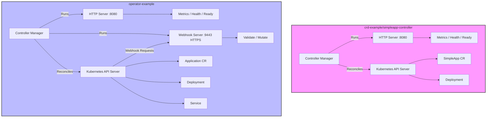

# 我将分析这两个 Kubebuilder 项目中 `main.go` 文件的实现差异

我将分析这两个 Kubebuilder 项目中 `main.go` 文件的实现差异，重点比较 `crd-example/simpleapp-controller/main.go` 和 `operator-example/cmd/main.go` 中提到的代码片段，回答它们是否使用同一端口，并列出每个控制器启动的服务端口，最后提供一个 Mermaid 架构图。

- https://github.com/liweinan/k8s-example

### 1. 两种实现的区别

#### 第一种实现：`crd-example/simpleapp-controller/main.go` (L81-L84)
```go
if err := mgr.Start(ctrl.SetupSignalHandler()); err != nil {
    ctrl.Log.Error(err, "problem running manager")
    os.Exit(1)
}
```
- **上下文**：
    - 这是 `crd-example` 项目中 `simpleapp-controller` 的 `main.go` 文件的结尾部分。
    - 代码启动 `controller-runtime` 提供的 `Manager`，这是 Kubebuilder 控制器运行的核心组件。
    - `mgr.Start(ctrl.SetupSignalHandler())`：
        - 启动控制器管理器，运行所有注册的控制器（如 `SimpleAppReconciler`）和相关的服务。
        - `ctrl.SetupSignalHandler()` 提供信号处理（如 SIGTERM、SIGINT），允许优雅关闭。
    - **功能**：
        - 初始化并运行控制器，监听 `SimpleApp` 资源（`simpleapp.example.com`）并执行协调逻辑。
        - 启动一个 HTTP 服务器，提供：
            - **Metrics 端点**：暴露 Prometheus 格式的控制器运行时指标（如协调次数）。
            - **Health 探针端点**：提供健康检查（`/healthz`）和就绪检查（`/readyz`），用于 Kubernetes 存活和就绪探针。
        - **无 Webhook**：该实现不配置 Webhook（如验证或变更 Webhook），因此不运行 Webhook 服务器。
    - **特点**：
        - 简单实现，专注于基本的控制器功能。
        - 不需要额外的 TLS 配置或 Webhook 服务器。
        - 仅运行一个 HTTP 服务器，处理指标和探针。

#### 第二种实现：`operator-example/cmd/main.go` (L113-L115)
```go
webhookServer := webhook.NewServer(webhook.Options{
    TLSOpts: tlsOpts,
})
```
- **上下文**：
    - 这是 `operator-example` 项目中 `cmd/main.go` 文件的一部分，位于 `Manager` 初始化后。
    - 代码创建一个 Webhook 服务器，用于处理 Kubernetes 准入控制请求（如验证或变更 Webhook）。
    - `webhook.NewServer(webhook.Options{TLSOpts: tlsOpts})`：
        - 初始化一个 Webhook 服务器，配置 TLS 选项（`tlsOpts`）以启用 HTTPS。
        - `tlsOpts` 通常包含证书配置（如 CA、服务器证书），用于安全通信。
    - **功能**：
        - 除了控制器功能（类似第一种实现），还运行一个 Webhook 服务器，处理 `Application` 资源（`applications.apps.example.com`）的准入请求。
        - Webhook 服务器支持：
            - **验证 Webhook**：检查 `Application` 资源是否符合自定义规则（如 `spec.replicas` 是否有效）。
            - **变更 Webhook**：在创建/更新时修改 `Application` 资源（如设置默认值）。
        - 控制器管理器运行两个 HTTP 服务器：
            - **Metrics 和探针服务器**：处理指标（`/metrics`）和健康探针（`/healthz`、`/readyz`）。
            - **Webhook 服务器**：处理准入请求（路径由 Webhook 配置指定，如 `/validate-apps-example-com-v1alpha1-application`）。
    - **特点**：
        - 更复杂，支持准入控制，需要 TLS 配置。
        - 需要额外的 Kubernetes 资源（如 `ValidatingWebhookConfiguration`）来注册 Webhook。
        - Webhook 服务器与指标/探针服务器分开运行，通常使用不同端口。

#### 关键区别
| 特性                     | `crd-example` (`simpleapp-controller`) | `operator-example` |
|--------------------------|----------------------------------------|--------------------|
| **Webhook 支持**         | 无，仅控制器逻辑                       | 支持验证/变更 Webhook |
| **HTTP 服务器数量**      | 1 个（指标 + 探针）                   | 2 个（指标/探针 + Webhook） |
| **TLS 配置**             | 无需 TLS                              | 需要 TLS（用于 Webhook） |
| **功能复杂度**           | 简单，专注于协调                      | 复杂，包含准入控制 |
| **CRD**                  | `simpleapp.example.com`               | `applications.apps.example.com` |
| **端口使用**             | 单一端口（默认 `:8080`）              | 多个端口（默认 `:8080` 和 `:9443`） |

### 2. 是否服务于同一端口？
- **结论**：两种实现的服务端口**不完全相同**，具体取决于 Webhook 配置。
    - **第一种 (`crd-example`)**：运行一个 HTTP 服务器，默认端口为 `:8080`，用于指标和健康探针。
    - **第二种 (`operator-example`)**：运行两个 HTTP 服务器：
        - 指标和探针服务器，默认端口 `:8080`。
        - Webhook 服务器，默认端口 `:9443`（由 `controller-runtime` 的 Webhook 服务器使用 HTTPS）。
    - **重叠**：两个项目都使用 `:8080` 提供指标和探针，但 `operator-example` 的 Webhook 服务器使用单独的端口（`:9443`），避免冲突。

- **端口配置来源**：
    - **Metrics/Probe 端口**：由 `controller-runtime` 的 `Manager` 配置，默认 `:8080`。可通过 `main.go` 中的 `--metrics-bind-address` 标志或 `ManagerOptions` 自定义。
    - **Webhook 端口**：由 Webhook 服务器配置，默认 `:9443`（HTTPS）。可通过 `webhook.Options.Port` 或 `--webhook-port` 标志自定义。

- **注意**：
    - 如果在同一 Pod 中运行多个服务，端口必须不同（`:8080` 和 `:9443` 不冲突）。
    - 在 `operator-example`，Webhook 服务器的 TLS 配置确保准入请求通过 HTTPS 安全处理，而指标/探针服务器通常是 HTTP（除非显式配置 TLS）。

### 3. 每个控制器启动的服务端口列表

#### 第一种：`crd-example/simpleapp-controller`
- **服务端口**：
    - **Port `:8080` (HTTP)**：
        - **用途**：提供以下端点：
            - `/metrics`: Prometheus 指标（如控制器协调次数）。
            - `/healthz`: 健康检查（用于存活探针）。
            - `/readyz`: 就绪检查（用于就绪探针）。
        - **配置**：由 `controller-runtime` 的 `Manager` 启动，默认绑定到 `:8080`。可在 `main.go` 中通过 `--metrics-bind-address` 修改。
        - **代码证据**：
          ```go
          if err := mgr.AddHealthzCheck("healthz", healthz.Ping); err != nil {...}
          if err := mgr.AddReadyzCheck("readyz", healthz.Ping); err != nil {...}
          ```
            - 这些检查通过 `:8080` 的 HTTP 服务器提供。

- **总计**：1 个 HTTP 服务器，1 个端口（`:8080`）。

#### 第二种：`operator-example`
- **服务端口**：
    - **Port `:8080` (HTTP)**：
        - **用途**：与 `crd-example` 相同，提供：
            - `/metrics`: Prometheus 指标。
            - `/healthz`: 健康检查。
            - `/readyz`: 就绪检查。
        - **配置**：由 `Manager` 启动，默认 `:8080`，可通过 `--metrics-bind-address` 修改。
        - **代码证据**：
          ```go
          if err := mgr.AddHealthzCheck("healthz", healthz.Ping); err != nil {...}
          if err := mgr.AddReadyzCheck("readyz", healthz.Ping); err != nil {...}
          ```

    - **Port `:9443` (HTTPS)**：
        - **用途**：提供 Webhook 准入端点，如：
            - `/validate-apps-example-com-v1alpha1-application`: 验证 `Application` 资源。
            - `/mutate-apps-example-com-v1alpha1-application`: 变更 `Application` 资源（如果配置）。
        - **配置**：由 `webhook.NewServer` 启动，默认 `:9443`，使用 TLS（`TLSOpts` 提供证书）。可通过 `webhook.Options.Port` 或 `--webhook-port` 修改。
        - **代码证据**：
          ```go
          webhookServer := webhook.NewServer(webhook.Options{
              TLSOpts: tlsOpts,
          })
          ```
            - 创建 HTTPS Webhook 服务器，绑定到 `:9443`。

- **总计**：2 个服务器（1 个 HTTP，1 个 HTTPS），2 个端口（`:8080`, `:9443`）。

### 4. Mermaid 架构图
以下是两种实现的架构对比图，展示控制器管理器、服务器、端口和与 Kubernetes API 的交互。



**说明**：
- **crd-example**：控制器管理器运行单一 HTTP 服务器（`:8080`），提供指标和探针，通过 API 服务器管理 `SimpleApp` 资源和 `Deployment`。
- **operator-example**：运行两个服务器（`:8080` 用于指标/探针，`:9443` 用于 Webhook），通过 API 服务器管理 `Application` 资源、`Deployment` 和 `Service`，并处理 Webhook 请求。

### 5. 总结
- **区别**：
    - `crd-example` 仅运行控制器逻辑和一个 HTTP 服务器（`:8080`），无 Webhook。
    - `operator-example` 运行控制器逻辑、指标/探针服务器（`:8080`）和 Webhook 服务器（`:9443`），支持准入控制。
- **端口**：
    - `crd-example`: `:8080` (指标、探针)。
    - `operator-example`: `:8080` (指标、探针), `:9443` (Webhook)。
    - 两者共享 `:8080`，但 `operator-example` 额外使用 `:9443`。
- **架构图**：展示了服务器、端口和与 Kubernetes API 的交互，突出 Webhook 的差异。

如果需要进一步澄清或深入分析（如 Webhook 配置细节），请告诉我！

---

