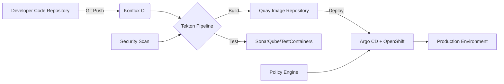

# Konflux CI

Below is a detailed introduction to **Konflux CI**, covering its positioning, core functions, technical architecture, and comparison with existing toolchains:

---

### **1. What is Konflux CI?**
**Konflux CI** is Red Hat's next-generation cloud-native CI/CD solution, designed specifically for **OpenShift** and **Kubernetes** environments. It integrates modern GitOps practices, developer toolchains, and automation capabilities, aiming to simplify cloud-native application build, test, and deployment processes.

#### **Key Positioning**
- **Cloud-Native Focused**: Deeply integrated with OpenShift, supports containerized workloads
- **Developer Friendly**: Low-code configuration, seamless integration with IDEs (like VSCode)
- **Security Compliant**: Built-in policy engine (like Open Policy Agent), ensures supply chain security

---

### **2. Core Functions**

#### **(1) Pipeline as Code**
- Uses **Tekton** as the underlying engine, defining multi-stage pipelines through YAML or GUI
- Example:
  ```yaml
  apiVersion: tekton.dev/v1beta1
  kind: Pipeline
  metadata:
    name: konflux-pipeline
  spec:
    tasks:
      - name: build
        taskRef:
          name: kaniko-build  # Use Kaniko to build container images
      - name: deploy
        taskRef:
          name: kustomize-deploy  # GitOps deployment to OpenShift
  ```

#### **(2) Built-in Template Library**
- Pre-configured common scenario templates (like Java/Node.js applications, Helm deployments)
- Supports custom template sharing (through **Konflux Hub**)

#### **(3) Multi-Cloud Deployment**
- Achieves cross-cluster GitOps deployment through **Argo CD** (AWS/GCP/OpenShift)
- Integrates **Kubernetes Multi-Cluster Management** (like Submariner)

#### **(4) Security Scanning**
- Automated vulnerability detection (integrates **Quay Container Security**, **Grype**)
- Compliance checking (like NIST SP 800-53)

#### **(5) Developer Self-Service**
- Provides **Web Console** and **CLI Tools** (`konflux-cli`)
- One-click generation of CI/CD configuration:
  ```bash
  konflux init --language=go --target=openshift
  ```

---

### **3. Technical Architecture**


#### **Key Components**
- **Tekton**: Pipeline execution engine
- **Argo CD**: GitOps deployment tool
- **Quay**: Container image management
- **Open Policy Agent (OPA)**: Policy management

---

### **4. Comparison with Mainstream Tools**
| **Feature**               | Konflux CI         | Jenkins            | GitHub Actions     | GitLab CI          |
|------------------------|--------------------|--------------------|--------------------|--------------------|
| **Cloud-Native Integration**         | ⭐⭐⭐⭐⭐ (OpenShift Native) | ⭐⭐ (Plugin Required)      | ⭐⭐⭐ (K8s Support)   | ⭐⭐⭐⭐ (Built-in K8s) |
| **Learning Curve**           | ⭐⭐⭐ (YAML/GUI)   | ⭐⭐ (Groovy Scripts) | ⭐⭐⭐ (YAML)       | ⭐⭐⭐ (YAML)      |
| **Security Capabilities**           | ⭐⭐⭐⭐⭐ (Built-in Scanning) | ⭐⭐ (Plugin Dependent)    | ⭐⭐⭐ (Basic Scanning)   | ⭐⭐⭐⭐ (Advanced Scanning) |
| **Multi-Cloud Support**           | ⭐⭐⭐⭐ (Argo CD)  | ⭐⭐ (Manual Configuration)    | ⭐⭐⭐ (Limited Support)   | ⭐⭐⭐ (Configuration Required)    |

---

### **5. Quick Start Example**

#### **Step 1: Install Konflux CLI**
```bash
# macOS
brew install konflux-cli

# Linux
curl -sL https://cli.konflux.io/install.sh | bash
```

#### **Step 2: Initialize Project**
```bash
konflux init \
  --repo=https://github.com/your/app \
  --language=python \
  --target=openshift
```

#### **Step 3: Trigger Pipeline**
```bash
git add . && git commit -m "Add Konflux config"
git push origin main  # Automatically triggers pipeline
```

#### **Step 4: Monitor Deployment**
```bash
konflux pipeline logs --follow
konflux status  # View application status
```

---

### **6. Applicable Scenarios**
- **Enterprise Cloud-Native Applications**: Need end-to-end security compliant CI/CD
- **Hybrid Cloud Deployment**: Unified pipeline across OpenShift/AWS/GCP
- **Developer Experience Optimization**: Quickly generate standardized pipelines

---

### **7. Limitations and Considerations**
- **OpenShift Dependency**: Some functions require OpenShift 4.10+
- **Resource Consumption**: Pipeline execution requires sufficient cluster resources (recommended minimum 8CPU/16GB)
- **Learning Cost**: Need to be familiar with Tekton and GitOps concepts

---

### **8. Reference Resources**
- [Official Documentation](https://docs.konflux.io)
- [GitHub Example Repository](https://github.com/konflux-examples)
- [Red Hat Blog Introduction](https://www.redhat.com/en/blog/introducing-konflux-ci)

Konflux CI provides an out-of-the-box cloud-native CI/CD solution for enterprises through deep integration with the OpenShift ecosystem, especially suitable for teams already using Red Hat technology stacks.

---

Below is a **step-by-step tutorial** for using **Konflux** to build and deploy cloud-native applications on OpenShift, covering the full process from environment preparation to automated deployment.

---

### **Prerequisites**
1. **OpenShift Cluster** (version 4.10+, local simulation available with [CRC](https://developers.redhat.com/products/codeready-containers))
2. **Konflux CLI** installation (see steps below)
3. **GitHub/GitLab Account** (code repository permissions)
4. **Quay.io Account** (container image repository)

---

## **Step 1: Install Konflux Toolchain**

### **1.1 Install Konflux CLI**
```bash
# macOS (Homebrew)
brew install konflux-cli

# Linux
curl -sL https://cli.konflux.io/install.sh | bash

# Verify installation
konflux version
```

### **1.2 Login to OpenShift Cluster**
```bash
oc login --server=https://api.your-openshift-cluster:6443 --username=kubeadmin --password=<your-password>
```

---

## **Step 2: Initialize Konflux Project**

### **2.1 Create Sample Application (Go Language)**
```bash
mkdir konflux-demo && cd konflux-demo
konflux init \
  --name=myapp \
  --language=go \
  --git-repo=https://github.com/yourusername/konflux-demo.git
```

This command will generate the following files:
```
.
├── .konflux/            # Konflux configuration directory
│   ├── pipeline.yaml    # Tekton pipeline definition
│   └── policy.yaml      # Security policy
├── Dockerfile           # Containerization configuration
└── src/                 # Application code
```

### **2.2 Push Code to Git Repository**
```bash
git init
git add .
git commit -m "Initial commit with Konflux config"
git remote add origin https://github.com/yourusername/konflux-demo.git
git push -u origin main
```

---

## **Step 3: Configure CI/CD Pipeline**

### **3.1 Modify Pipeline (Optional)**
Edit `.konflux/pipeline.yaml`, for example, add unit test stage:
```yaml
spec:
  tasks:
    - name: test
      taskRef:
        name: go-test
      params:
        - name: package
          value: ./...
```

### **3.2 Link Quay Image Repository**
```bash
konflux registry connect --quay --username=yourquayuser --token=yourquaytoken
```

---

## **Step 4: Trigger Automated Build**

### **4.1 Manually Trigger Pipeline**
```bash
konflux pipeline start
```

Or automatically trigger via **Git Push**:
```bash
git add . && git commit -m "Add new feature"
git push origin main
```

### **4.2 Monitor Pipeline Status**
```bash
konflux pipeline logs --follow
```

Output example:
```
[build] Successfully built image: quay.io/youruser/myapp:abc123
[deploy] Deployed to OpenShift namespace: myapp-dev
```

---

## **Step 5: Verify Deployment**

### **5.1 View OpenShift Application Status**
```bash
oc get pods -n myapp-dev
oc get route myapp -n myapp-dev -o jsonpath='{.spec.host}'
```

Visit the output URL (e.g., `https://myapp-myapp-dev.apps.cluster.example.com`).

### **5.2 Check Security Scan Results**
```bash
konflux security report
```

Output example:
```
Vulnerabilities: LOW (2), MEDIUM (1)
Policy Checks: PASSED
```

---

## **Step 6: Advanced Configuration (Optional)**

### **6.1 Multi-Environment Deployment (Dev/Staging/Prod)**
Edit `.konflux/pipeline.yaml`, add multi-stage:
```yaml
- name: deploy-to-prod
  when:
    - input: git.ref
      operator: eq
      values: ["refs/heads/main"]
  taskRef:
    name: kustomize-deploy
  params:
    - name: environment
      value: prod
```

### **6.2 Custom Policy (e.g., Only Allow Signed Images)**
Edit `.konflux/policy.yaml`:
```yaml
apiVersion: policy.konflux.io/v1
kind: Policy
spec:
  rules:
    - name: require-signed-images
      enforce: true
      match:
        - kind: Pod
      validate:
        imageSigned: true
```

---

## **Troubleshooting**
| **Issue**                | **Solution**                              |
|-------------------------|------------------------------------------|
| Pipeline stuck at `Pending`    | Check if OpenShift cluster resources are sufficient           |
| Image push failed            | Confirm Quay token has `push` permission           |
| Application inaccessible after deployment      | Check OpenShift Route and Service configuration      |

---

## **Summary**
Through Konflux, you have completed:
1. **Initialization** of cloud-native project templates
2. **Automation** of build, test, and deployment processes
3. **Integration** of security scanning and policy validation
4. **Extension** of multi-environment deployment capabilities

**Next Steps**:
- Explore shared templates in [Konflux Hub](https://hub.konflux.io)
- Read [official documentation](https://docs.konflux.io) to learn about advanced features (like multi-cloud deployment)

---

Below is a complete **Konflux Demo Project** step-by-step guide, including code examples, configuration files, and operation commands to help you quickly experience Konflux's CI/CD process.

---

### **Konflux Demo Project: Go Microservice Automated Deployment**

#### **Goal**: Achieve automated build, security scanning, and deployment from code commit to OpenShift through Konflux

---

## **1. Environment Preparation**

### **1.1 Tool Installation**
```bash
# Install Konflux CLI (MacOS)
brew install konflux-cli

# Install OpenShift Client (oc)
brew install openshift-cli

# Login to OpenShift cluster (using CRC or existing cluster)
oc login --server=https://api.crc.testing:6443 --username=developer --password=developer
```

### **1.2 Code Repository Initialization**
```bash
mkdir konflux-demo && cd konflux-demo
git init
echo "# Konflux Demo" > README.md
```

---

## **2. Project Structure**
```
konflux-demo/
├── .konflux/            # Konflux automation configuration
│   ├── pipeline.yaml    # CI/CD pipeline
│   └── policy.yaml      # Security policy
├── src/                 # Application code
│   ├── main.go          # Go sample application
│   └── go.mod          # Go dependencies
├── Dockerfile           # Containerization configuration
└── .gitignore
```

---

## **3. File Contents**

### **3.1 Go Application Code (`src/main.go`)**
```go
package main

import (
	"fmt"
	"net/http"
)

func handler(w http.ResponseWriter, r *http.Request) {
	fmt.Fprintf(w, "Hello from Konflux Demo!")
}

func main() {
	http.HandleFunc("/", handler)
	http.ListenAndServe(":8080", nil)
}
```

### **3.2 Dockerfile**
```dockerfile
FROM golang:1.19 as builder
WORKDIR /app
COPY src/ .
RUN go build -o /app/server

FROM alpine:3.15
COPY --from=builder /app/server /server
CMD ["/server"]
```

### **3.3 Konflux Pipeline (`./konflux/pipeline.yaml`)**
```yaml
apiVersion: tekton.dev/v1beta1
kind: Pipeline
metadata:
  name: konflux-demo-pipeline
spec:
  tasks:
    - name: build
      taskRef:
        name: kaniko-build
      params:
        - name: IMAGE
          value: quay.io/yourusername/konflux-demo:latest

    - name: deploy
      runAfter: ["build"]
      taskRef:
        name: openshift-deploy
      params:
        - name: NAMESPACE
          value: konflux-demo-dev
        - name: MANIFESTS
          value: |
            apiVersion: apps/v1
            kind: Deployment
            metadata:
              name: konflux-demo
            spec:
              replicas: 1
              template:
                spec:
                  containers:
                    - name: app
                      image: quay.io/yourusername/konflux-demo:latest
```

### **3.4 Security Policy (`./konflux/policy.yaml`)**
```yaml
apiVersion: policy.konflux.io/v1
kind: Policy
spec:
  rules:
    - name: no-critical-vulnerabilities
      enforce: true
      match:
        - kind: "Image"
      validate:
        maxSeverity: "High"  # Block images with critical vulnerabilities
```

---

## **4. Project Initialization and Deployment**

### **4.1 Initialize Konflux Configuration**
```bash
konflux init \
  --name=konflux-demo \
  --language=go \
  --git-repo=https://github.com/yourusername/konflux-demo.git \
  --output=.
```

### **4.2 Link Image Repository**
```bash
konflux registry connect --quay --username=yourquayuser --token=yourquaytoken
```

### **4.3 Push Code and Trigger Pipeline**
```bash
git add .
git commit -m "Initial commit with Konflux config"
git remote add origin https://github.com/yourusername/konflux-demo.git
git push -u origin main
```

---

## **5. Monitoring and Verification**

### **5.1 View Pipeline Status**
```bash
konflux pipeline logs --follow
```

Output example:
```
[build] INFO: Building image quay.io/yourusername/konflux-demo:abc123
[scan] INFO: Security scan passed (0 critical vulnerabilities)
[deploy] SUCCESS: Deployed to namespace konflux-demo-dev
```

### **5.2 Access Application**
```bash
oc get route -n konflux-demo-dev
```

Open the output URL (e.g., `http://konflux-demo-konflux-demo-dev.apps-crc.testing`), should display:
```
Hello from Konflux Demo!
```

### **5.3 Check Security Report**
```bash
konflux security report
```

Output example:
```
IMAGE: quay.io/yourusername/konflux-demo:latest
VULNERABILITIES:
  - CVE-2023-1234 (Medium)
POLICY CHECKS: PASSED
```

---

## **6. Advanced Operations**

### **6.1 Multi-Environment Deployment**
Add `prod` environment tasks in `.konflux/pipeline.yaml`:
```yaml
- name: deploy-prod
  when:
    - input: git.ref
      operator: eq
      values: ["refs/heads/main"]  # Only main branch triggers
  taskRef:
    name: openshift-deploy
  params:
    - name: NAMESPACE
      value: konflux-demo-prod
```

### **6.2 Custom Build Parameters**
Override default values through `konflux params`:
```bash
konflux params set BUILD_ARGS="--build-arg VERSION=1.0"
```

---

## **7. Resource Cleanup**
```bash
# Delete OpenShift resources
oc delete project konflux-demo-dev

# Delete image
konflux registry delete quay.io/yourusername/konflux-demo
```

---

## **Summary**
Through this Demo, you have achieved:
1. **Automated Build**: Code push triggers image building
2. **Security Compliance**: Vulnerability scanning and policy interception
3. **One-Click Deployment**: GitOps method releases to OpenShift

**Extension Suggestions**:
- Explore more templates in [Konflux Hub](https://hub.konflux.io) (like Java/Node.js)
- Refer to [official documentation](https://docs.konflux.io) to configure notifications (like Slack alerts)

---