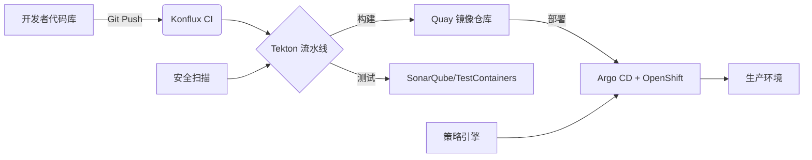

# Konflux CI

以下是关于 **Konflux CI** 的详细介绍，涵盖其定位、核心功能、技术架构及与现有工具链的对比：

---

### **1. Konflux CI 是什么？**
**Konflux CI** 是 Red Hat 推出的新一代云原生 CI/CD 解决方案，专为 **OpenShift** 和 **Kubernetes** 环境设计。它整合了现代 GitOps 实践、开发者工具链和自动化能力，旨在简化云原生应用的构建、测试和部署流程。

#### **关键定位**
- **面向云原生**：深度集成 OpenShift，支持容器化工作负载。
- **开发者友好**：低代码配置，与 IDE（如 VSCode）无缝衔接。
- **安全合规**：内置策略引擎（如 Open Policy Agent），确保供应链安全。

---

### **2. 核心功能**
#### **(1) 流水线即代码（Pipeline as Code）**
- 使用 **Tekton** 作为底层引擎，通过 YAML 或 GUI 定义多阶段流水线。
- 示例：
  ```yaml
  apiVersion: tekton.dev/v1beta1
  kind: Pipeline
  metadata:
    name: konflux-pipeline
  spec:
    tasks:
      - name: build
        taskRef:
          name: kaniko-build  # 使用 Kaniko 构建容器镜像
      - name: deploy
        taskRef:
          name: kustomize-deploy  # GitOps 部署到 OpenShift
  ```

#### **(2) 内置模板库**
- 预置常见场景模板（如 Java/Node.js 应用、Helm 部署）。
- 支持自定义模板共享（通过 **Konflux Hub**）。

#### **(3) 多云部署**
- 通过 **Argo CD** 实现跨集群 GitOps 部署（AWS/GCP/OpenShift）。
- 集成 **Kubernetes 多集群管理**（如 Submariner）。

#### **(4) 安全扫描**
- 自动化漏洞检测（集成 **Quay Container Security**、**Grype**）。
- 合规性检查（如 NIST SP 800-53）。

#### **(5) 开发者自助服务**
- 提供 **Web 控制台** 和 **CLI 工具**（`konflux-cli`）。
- 一键生成 CI/CD 配置：
  ```bash
  konflux init --language=go --target=openshift
  ```

---

### **3. 技术架构**


#### **关键组件**
- **Tekton**：流水线执行引擎。
- **Argo CD**：GitOps 部署工具。
- **Quay**：容器镜像管理。
- **Open Policy Agent (OPA)**：策略管理。

---

### **4. 与主流工具的对比**
| **特性**               | Konflux CI         | Jenkins            | GitHub Actions     | GitLab CI          |
|------------------------|--------------------|--------------------|--------------------|--------------------|
| **云原生集成**         | ⭐⭐⭐⭐⭐（OpenShift 原生） | ⭐⭐（需插件）      | ⭐⭐⭐（K8s 支持）   | ⭐⭐⭐⭐（内置 K8s） |
| **学习曲线**           | ⭐⭐⭐（YAML/GUI）   | ⭐⭐（Groovy 脚本） | ⭐⭐⭐（YAML）       | ⭐⭐⭐（YAML）      |
| **安全能力**           | ⭐⭐⭐⭐⭐（内置扫描） | ⭐⭐（依赖插件）    | ⭐⭐⭐（基础扫描）   | ⭐⭐⭐⭐（高级扫描） |
| **多云支持**           | ⭐⭐⭐⭐（Argo CD）  | ⭐⭐（手动配置）    | ⭐⭐⭐（有限支持）   | ⭐⭐⭐（需配置）    |

---

### **5. 快速入门示例**
#### **步骤 1：安装 Konflux CLI**
```bash
# macOS
brew install konflux-cli

# Linux
curl -sL https://cli.konflux.io/install.sh | bash
```

#### **步骤 2：初始化项目**
```bash
konflux init \
  --repo=https://github.com/your/app \
  --language=python \
  --target=openshift
```

#### **步骤 3：触发流水线**
```bash
git add . && git commit -m "Add Konflux config"
git push origin main  # 自动触发流水线
```

#### **步骤 4：监控部署**
```bash
konflux pipeline logs --follow
konflux status  # 查看应用状态
```

---

### **6. 适用场景**
- **企业级云原生应用**：需要端到端安全合规的 CI/CD。
- **混合云部署**：跨 OpenShift/AWS/GCP 的统一流水线。
- **开发者体验优化**：快速生成标准化流水线。

---

### **7. 限制与注意事项**
- **依赖 OpenShift**：部分功能需 OpenShift 4.10+。
- **资源消耗**：流水线执行需要充足的集群资源（建议至少 8CPU/16GB）。
- **学习成本**：需熟悉 Tekton 和 GitOps 概念。

---

### **8. 参考资源**
- [官方文档](https://docs.konflux.io)
- [GitHub 示例库](https://github.com/konflux-examples)
- [Red Hat 博客介绍](https://www.redhat.com/en/blog/introducing-konflux-ci)

Konflux CI 通过深度集成 OpenShift 生态，为企业提供了开箱即用的云原生 CI/CD 解决方案，尤其适合已使用 Red Hat 技术栈的团队。

---

以下是使用 **Konflux** 在 OpenShift 上构建和部署云原生应用的 **手把手教程**，涵盖从环境准备到自动化部署的全流程。

---

### **前提条件**
1. **OpenShift 集群**（4.10+ 版本，可用 [CRC](https://developers.redhat.com/products/codeready-containers) 本地模拟）。
2. **Konflux CLI** 安装（见下方步骤）。
3. **GitHub/GitLab 账号**（代码仓库权限）。
4. **Quay.io 账号**（容器镜像仓库）。

---

## **步骤 1：安装 Konflux 工具链**
### **1.1 安装 Konflux CLI**
```bash
# macOS (Homebrew)
brew install konflux-cli

# Linux
curl -sL https://cli.konflux.io/install.sh | bash

# 验证安装
konflux version
```

### **1.2 登录 OpenShift 集群**
```bash
oc login --server=https://api.your-openshift-cluster:6443 --username=kubeadmin --password=<your-password>
```

---

## **步骤 2：初始化 Konflux 项目**
### **2.1 创建示例应用（Go 语言）**
```bash
mkdir konflux-demo && cd konflux-demo
konflux init \
  --name=myapp \
  --language=go \
  --git-repo=https://github.com/yourusername/konflux-demo.git
```
此命令会生成以下文件：
```
.
├── .konflux/            # Konflux 配置目录
│   ├── pipeline.yaml    # Tekton 流水线定义
│   └── policy.yaml      # 安全策略
├── Dockerfile           # 容器化配置
└── src/                 # 应用代码
```

### **2.2 推送代码到 Git 仓库**
```bash
git init
git add .
git commit -m "Initial commit with Konflux config"
git remote add origin https://github.com/yourusername/konflux-demo.git
git push -u origin main
```

---

## **步骤 3：配置 CI/CD 流水线**
### **3.1 修改流水线（可选）**
编辑 `.konflux/pipeline.yaml`，例如添加单元测试阶段：
```yaml
spec:
  tasks:
    - name: test
      taskRef:
        name: go-test
      params:
        - name: package
          value: ./...
```

### **3.2 链接 Quay 镜像仓库**
```bash
konflux registry connect --quay --username=yourquayuser --token=yourquaytoken
```

---

## **步骤 4：触发自动化构建**
### **4.1 手动触发流水线**
```bash
konflux pipeline start
```
或通过 **Git Push** 自动触发：
```bash
git add . && git commit -m "Add new feature"
git push origin main
```

### **4.2 监控流水线状态**
```bash
konflux pipeline logs --follow
```
输出示例：
```
[build] Successfully built image: quay.io/youruser/myapp:abc123
[deploy] Deployed to OpenShift namespace: myapp-dev
```

---

## **步骤 5：验证部署**
### **5.1 查看 OpenShift 应用状态**
```bash
oc get pods -n myapp-dev
oc get route myapp -n myapp-dev -o jsonpath='{.spec.host}'
```
访问输出的 URL（如 `https://myapp-myapp-dev.apps.cluster.example.com`）。

### **5.2 检查安全扫描结果**
```bash
konflux security report
```
输出示例：
```
Vulnerabilities: LOW (2), MEDIUM (1)
Policy Checks: PASSED
```

---

## **步骤 6：进阶配置（可选）**
### **6.1 多环境部署（Dev/Staging/Prod）**
编辑 `.konflux/pipeline.yaml`，添加多阶段：
```yaml
- name: deploy-to-prod
  when:
    - input: git.ref
      operator: eq
      values: ["refs/heads/main"]
  taskRef:
    name: kustomize-deploy
  params:
    - name: environment
      value: prod
```

### **6.2 自定义策略（如仅允许签名镜像）**
编辑 `.konflux/policy.yaml`：
```yaml
apiVersion: policy.konflux.io/v1
kind: Policy
spec:
  rules:
    - name: require-signed-images
      enforce: true
      match:
        - kind: Pod
      validate:
        imageSigned: true
```

---

## **故障排查**
| **问题**                | **解决方案**                              |
|-------------------------|------------------------------------------|
| 流水线卡在 `Pending`    | 检查 OpenShift 集群资源是否充足           |
| 镜像推送失败            | 确认 Quay token 有 `push` 权限           |
| 部署后应用不可访问      | 检查 OpenShift Route 和 Service 配置      |

---

## **总结**
通过 Konflux，您已完成以下操作：
1. **初始化**云原生项目模板。
2. **自动化**构建、测试、部署流程。
3. **集成**安全扫描和策略验证。
4. **扩展**多环境部署能力。

**下一步建议**：
- 探索 [Konflux Hub](https://hub.konflux.io) 中的共享模板。
- 阅读 [官方文档](https://docs.konflux.io) 了解高级功能（如多云部署）。