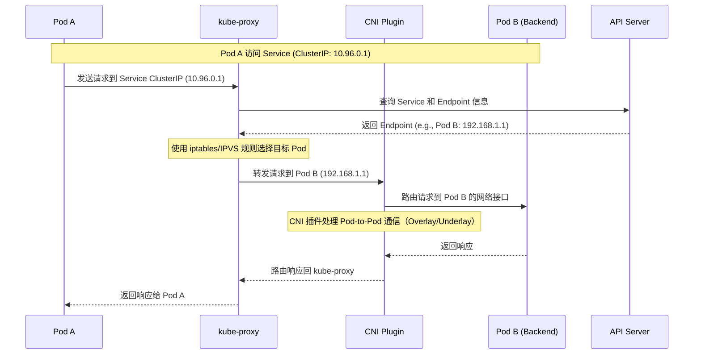
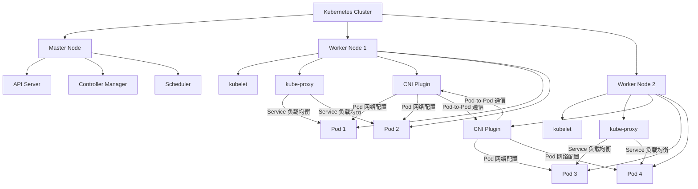
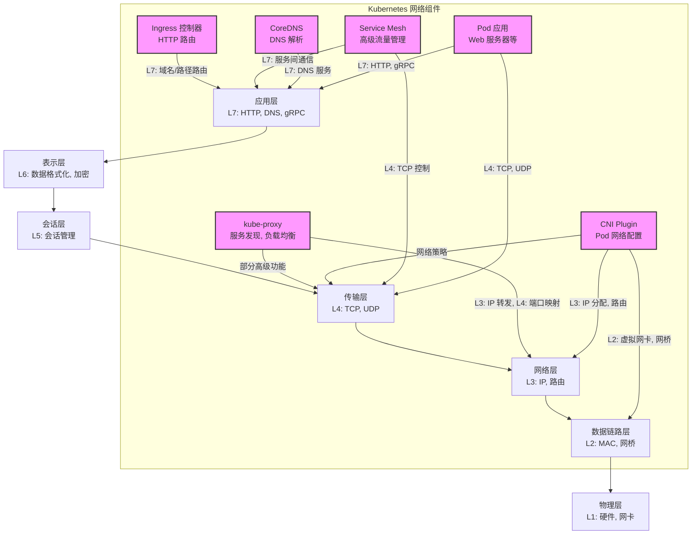

# kube-proxy 和 CNI（容器网络接口）是 Kubernetes 网络生态中的两个不同组件，各自承担不同职责。以下是它们的区别和联系的简要说明：

### 1. **定义和职责**
- **kube-proxy**:
    - 是 Kubernetes 的核心组件，运行在每个节点上，负责**服务发现和负载均衡**。
    - 主要功能是为 Kubernetes Service 提供网络代理，管理 Service 的 IP（ClusterIP、NodePort、LoadBalancer 等）和 Pod 之间的流量转发。
    - 它通过监听 API Server 的 Service 和 Endpoint 变化，动态更新节点的网络规则（如 iptables 或 IPVS），实现 Pod 间的负载均衡。
    - 简单来说，kube-proxy 处理的是**服务级别**的网络流量（Service-to-Pod）。

- **CNI（Container Network Interface）**:
    - 是一个标准化的网络接口规范，用于配置容器运行时的网络。
    - CNI 插件负责为 Pod 配置网络，包括分配 IP 地址、设置网络接口、配置路由等，确保 Pod 可以在集群网络中通信。
    - 常见的 CNI 插件有 Flannel、Calico、WeaveNet、Cilium 等，每个插件实现不同的网络模型（如 Overlay 或 Underlay）。
    - 简单来说，CNI 关注的是**Pod 级别**的网络连接（Pod-to-Pod 或 Pod-to-外部网络）。

### 2. **工作层次**
- **kube-proxy**:
    - 工作在**服务层**，处理 Service 的抽象（如 ClusterIP）到具体 Pod 的映射。
    - 不直接管理 Pod 的 IP 分配或底层网络，而是依赖底层网络（由 CNI 提供）来完成实际的通信。
    - 例如，当一个 Pod 访问 Service 的 ClusterIP 时，kube-proxy 负责将请求转发到后端的某个 Pod。

- **CNI**:
    - 工作在**网络层**，为每个 Pod 提供基本的网络连接能力。
    - 负责 Pod 的网络初始化（如分配 IP、配置网桥或虚拟网卡），确保 Pod 可以在集群内或外部通信。
    - CNI 插件决定了 Kubernetes 集群的网络模型（例如，是否使用 VXLAN、IPIP 等 Overlay 网络）。

### 3. **功能对比**
| 特性                 | kube-proxy                            | CNI                                  |
|----------------------|---------------------------------------|--------------------------------------|
| **主要功能**         | 服务发现、负载均衡                    | Pod 网络配置、IP 分配、路由设置      |
| **工作对象**         | Service 和 Endpoint                   | Pod 和容器网络接口                  |
| **运行位置**         | 每个节点，作为 Kubernetes 组件        | 容器运行时调用 CNI 插件              |
| **实现方式**         | iptables、IPVS 或 userspace 模式      | 具体插件（如 Flannel、Calico 等）     |
| **依赖关系**         | 依赖 CNI 提供的底层网络               | 不直接依赖 kube-proxy                |
| **网络模型无关性**   | 与底层网络模型无关                    | 决定集群的网络模型（如 Overlay）      |

### 4. **联系与协作**
- **协作关系**：
    - CNI 提供 Pod 的基础网络连接，确保 Pod 可以在集群内互相通信或访问外部网络。
    - kube-proxy 利用 CNI 提供的网络基础设施，在此基础上实现 Service 的负载均衡和服务发现。
    - 例如，CNI 插件（如 Calico）为 Pod 分配了 IP 并配置了网络，kube-proxy 则通过 iptables 或 IPVS 规则将 Service 的流量转发到正确的 Pod IP。

- **依赖性**：
    - kube-proxy 依赖 CNI 提供的 Pod 网络。如果 CNI 插件配置错误，Pod 无法通信，kube-proxy 的功能也会失效。
    - CNI 插件不依赖 kube-proxy，专注于 Pod 的网络配置。

### 5. **实际例子**
- **场景**：一个 Pod A 想访问 Service B（ClusterIP 为 10.96.0.1），Service B 后端有 3 个 Pod（IP 分别为 192.168.1.1、192.168.1.2、192.168.1.3）。
    - **CNI 的作用**：CNI 插件（如 Flannel）为 Pod A 和 Service B 的后端 Pod 分配 IP，并配置网络（如 Overlay 网络），确保这些 Pod 可以在集群内通信。
    - **kube-proxy 的作用**：kube-proxy 监听到 Service B 的 ClusterIP 和后端 Pod 的 Endpoint，动态生成 iptables 或 IPVS 规则。当 Pod A 访问 10.96.0.1 时，kube-proxy 将流量随机或按策略转发到 192.168.1.1、192.168.1.2 或 192.168.1.3。

### 6. **总结**
- **kube-proxy** 负责 Kubernetes 的服务层网络（Service），实现服务发现和负载均衡。
- **CNI** 负责 Pod 的网络层配置，提供 Pod 之间的基础通信能力。
- 两者相辅相成：CNI 提供底层网络，kube-proxy 在其上实现高级服务功能。

如果你有更具体的问题（例如某款 CNI 插件的配置或 kube-proxy 的性能优化），可以进一步讨论！

---

以下是使用 Mermaid 语法绘制的 **kube-proxy 和 CNI 在 Kubernetes 集群中的相关时序图和部署图**，分别展示它们在 Kubernetes 网络处理中的交互流程和部署位置。时序图描述了 Pod 访问 Service 的网络流程，部署图展示 kube-proxy 和 CNI 插件在集群中的分布。

## 时序图：Pod 访问 Service 的网络流程

## 部署图：kube-proxy 和 CNI 在 Kubernetes 集群中的分布

### 说明
1. **时序图**：
    - 展示了 Pod A 访问 Service（ClusterIP）时，kube-proxy 和 CNI 的交互流程。
    - kube-proxy 负责服务发现（通过 API Server 获取 Endpoint）和负载均衡（通过 iptables/IPVS 转发）。
    - CNI 插件负责底层 Pod-to-Pod 的网络通信（如 Overlay 网络的路由）。

2. **部署图**：
    - 展示了 Kubernetes 集群中 kube-proxy 和 CNI 插件的部署位置。
    - kube-proxy 和 CNI 插件运行在每个 Worker 节点上，kube-proxy 管理 Service 流量，CNI 插件为 Pod 配置网络。
    - 跨节点通信由 CNI 插件实现，kube-proxy 不直接参与 Pod 间的网络配置。

这些图使用 Mermaid 语法编写，可以在支持 Mermaid 的工具（如 VS Code、Mermaid Live Editor）中渲染查看。如果你需要进一步调整图表内容或格式，请告诉我！

---

在 Kubernetes 集群中，**kube-proxy** 和 **CNI（容器网络接口）** 插件在 OSI 七层网络模型（物理层、数据链路层、网络层、传输层、会话层、表示层、应用层）中的作用和位置不同。以下是对它们在七层网络模型中的定位分析，并附上使用 Mermaid 绘制的图表，展示 Kubernetes 网络组件在七层网络模型中的位置。

### 1. **kube-proxy 在七层网络模型中的位置**
- **主要层面**：网络层（Layer 3）和传输层（Layer 4）
    - **网络层（L3）**：kube-proxy 主要处理 Kubernetes Service 的 ClusterIP（虚拟 IP）到 Pod IP 的流量转发。它通过 iptables、IPVS 或 userspace 模式操作 IP 地址和路由规则，属于网络层的功能。
    - **传输层（L4）**：kube-proxy 还处理端口映射（如 Service 的端口到 Pod 的目标端口），涉及 TCP/UDP 协议的负载均衡，因此也涉及传输层。
    - **部分应用层（L7）功能**：在某些高级场景（如使用 IPVS 结合服务网格或 Ingress），kube-proxy 可能间接支持应用层负载均衡，但其核心功能仍集中在 L3/L4。

- **职责**：kube-proxy 负责服务发现和负载均衡，管理 Service 的虚拟 IP 和后端 Pod 的 Endpoint 映射。它不直接处理 Pod 的底层网络配置，而是依赖 CNI 提供的网络基础设施。

### 2. **CNI 在七层网络模型中的位置**
- **主要层面**：数据链路层（Layer 2）和网络层（Layer 3）
    - **数据链路层（L2）**：CNI 插件（如 Flannel、Calico）为 Pod 配置虚拟网络接口（如 veth 设备）、网桥（如 cni0）或 VLAN，处理帧的转发，属于数据链路层的功能。
    - **网络层（L3）**：CNI 插件为 Pod 分配 IP 地址、配置路由表，并实现跨节点通信（如通过 VXLAN、IPIP 等 Overlay 网络或 BGP 路由）。这些功能属于网络层。
    - **部分传输层（L4）支持**：某些 CNI 插件（如 Calico、Cilium）支持基于传输层的网络策略（如限制 TCP/UDP 端口访问），但这不是 CNI 的核心功能。

- **职责**：CNI 插件负责 Pod 的网络初始化（IP 分配、网卡配置）和集群内/外的网络通信（如 Pod-to-Pod、Pod-to-外部网络）。

### 3. **其他 Kubernetes 网络组件的七层定位**
为了全面说明，以下是一些其他常见 Kubernetes 网络组件在七层模型中的位置：
- **Ingress 控制器（如 Nginx、Traefik）**：
    - **应用层（L7）**：Ingress 控制器处理 HTTP/HTTPS 请求，支持基于 URL 路径或域名的路由、负载均衡，以及 SSL 终止等应用层功能。
- **Service Mesh（如 Istio、Linkerd）**：
    - **应用层（L7）**：Service Mesh 提供高级流量管理（如重试、超时、A/B 测试）、服务间认证和加密，操作在应用层。
    - **传输层（L4）**：部分功能（如 TCP 流量控制）涉及传输层。
- **DNS（CoreDNS）**：
    - **应用层（L7）**：CoreDNS 提供 Kubernetes 集群内的 DNS 服务（如解析 Service 名称到 ClusterIP），属于应用层。
- **Pod 网络**：
    - **应用层（L7）到传输层（L4）**：Pod 内的容器应用（如 Web 服务器）直接处理应用层协议（如 HTTP），通过传输层协议（如 TCP/UDP）与外部通信。

### 4. **Mermaid 图表**

以下是使用 Mermaid 绘制的图表，展示 Kubernetes 网络组件在 OSI 七层网络模型中的位置。

### 图表说明
- **图表结构**：
  - 左侧展示 OSI 七层网络模型，从物理层（L1）到应用层（L7）。
  - 右侧展示 Kubernetes 网络组件（kube-proxy、CNI、Ingress 控制器、Service Mesh、CoreDNS、Pod 应用），通过箭头指向它们主要作用的网络层。
  - 每个组件标注了其主要功能和对应的 OSI 层级。
- **组件定位**：
  - **kube-proxy**：主要在 L3（IP 转发）和 L4（端口映射），部分高级功能涉及 L4。
  - **CNI Plugin**：主要在 L2（虚拟网卡、网桥）和 L3（IP 分配、路由），部分插件支持 L4 网络策略。
  - **Ingress 控制器**：主要在 L7（HTTP 路由）。
  - **Service Mesh**：主要在 L7（服务间通信），部分功能在 L4（TCP 控制）。
  - **CoreDNS**：在 L7（DNS 解析）。
  - **Pod 应用**：主要在 L7（应用协议如 HTTP），依赖 L4（TCP/UDP）通信。

### 渲染说明
- 复制以上 Mermaid 代码到支持 Mermaid 的工具（如 Mermaid Live Editor、VS Code Mermaid 插件或 GitHub Markdown）中即可渲染。
- 图表清晰展示各组件在 OSI 模型中的位置，便于理解 Kubernetes 网络组件的分层职责。

如果你需要进一步调整图表（如添加特定 CNI 插件或更详细的交互关系），或对某个组件的网络行为有更具体的问题，请告诉我！