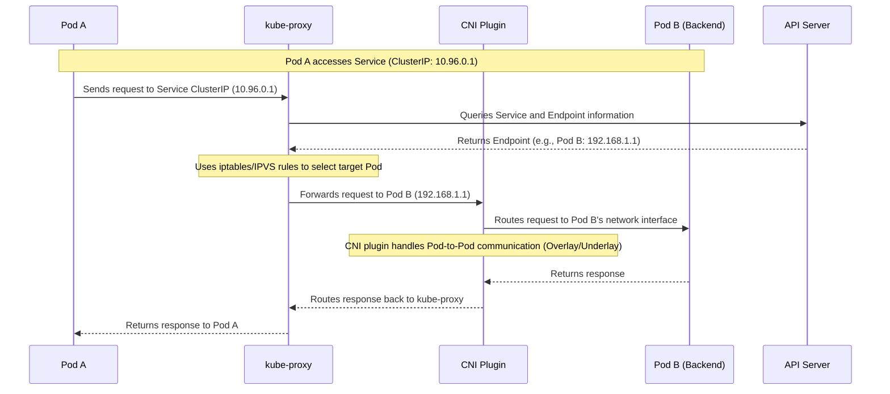
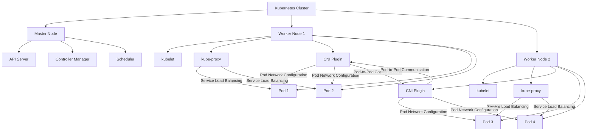
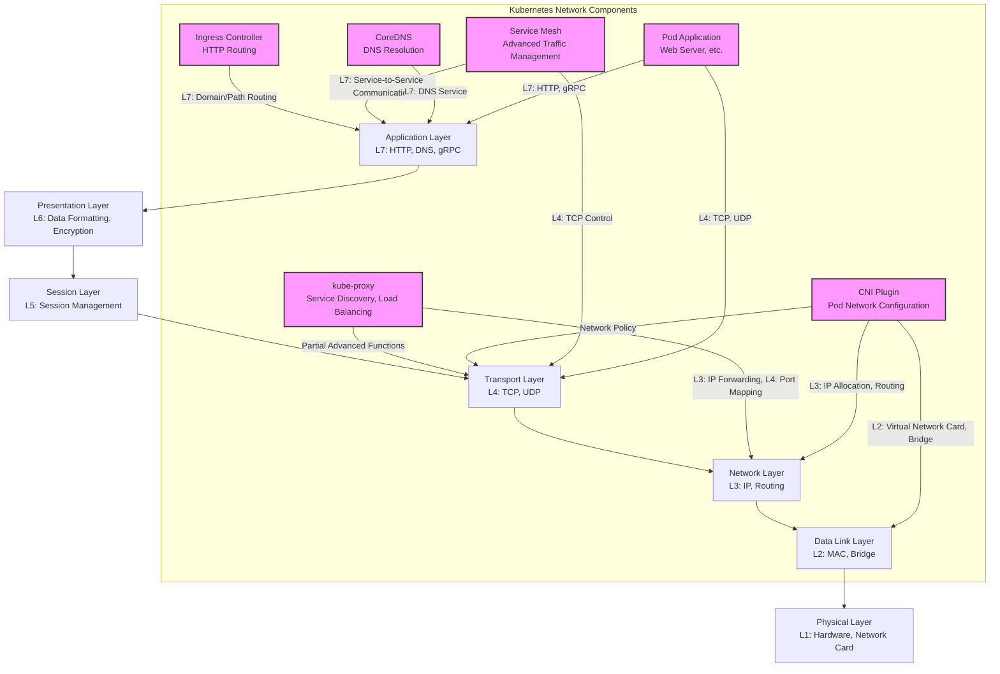

# kube-proxy and CNI (Container Network Interface) are two different components in the Kubernetes network ecosystem, each with different responsibilities. Here is a brief explanation of their differences and relationships:

### 1. **Definitions and Responsibilities**

- **kube-proxy**:
  - Is a core Kubernetes component that runs on each node, responsible for **service discovery and load balancing**
  - Main function is to provide network proxy for Kubernetes Services, managing Service IPs (ClusterIP, NodePort, LoadBalancer, etc.) and traffic forwarding between Pods
  - Listens to Service and Endpoint changes from API Server, dynamically updates node network rules (like iptables or IPVS), implementing load balancing between Pods
  - Simply put, kube-proxy handles **service-level** network traffic (Service-to-Pod)

- **CNI (Container Network Interface)**:
  - Is a standardized network interface specification for configuring container runtime networks
  - CNI plugins are responsible for configuring Pod networks, including IP address allocation, network interface setup, routing configuration, etc., ensuring Pods can communicate in the cluster network
  - Common CNI plugins include Flannel, Calico, WeaveNet, Cilium, etc., each implementing different network models (like Overlay or Underlay)
  - Simply put, CNI focuses on **Pod-level** network connectivity (Pod-to-Pod or Pod-to-external network)

### 2. **Working Layers**

- **kube-proxy**:
  - Works at **service layer**, handling mapping from Service abstractions (like ClusterIP) to specific Pods
  - Doesn't directly manage Pod IP allocation or underlying networks, but relies on underlying networks (provided by CNI) to complete actual communication
  - For example, when a Pod accesses Service's ClusterIP, kube-proxy is responsible for forwarding the request to one of the backend Pods

- **CNI**:
  - Works at **network layer**, providing basic network connectivity for each Pod
  - Responsible for Pod network initialization (like IP allocation, configuring bridges or virtual network cards), ensuring Pods can communicate within the cluster or with external networks
  - CNI plugins determine the network model of Kubernetes clusters (for example, whether to use VXLAN, IPIP, and other Overlay networks)

### 3. **Function Comparison**

| Feature                 | kube-proxy                            | CNI                                  |
|----------------------|---------------------------------------|--------------------------------------|
| **Main Function**         | Service discovery, load balancing                    | Pod network configuration, IP allocation, routing setup      |
| **Working Object**         | Service and Endpoint                   | Pod and container network interface                  |
| **Running Location**         | On each node, as Kubernetes component        | Called by container runtime              |
| **Implementation Method**         | iptables, IPVS, or userspace mode      | Specific plugins (like Flannel, Calico, etc.)     |
| **Dependency Relationship**         | Depends on CNI-provided underlying network               | Doesn't directly depend on kube-proxy                |
| **Network Model Independence**   | Independent of underlying network model                    | Determines cluster's network model (like Overlay)      |

### 4. **Relationship and Collaboration**

- **Collaborative Relationship**:
  - CNI provides basic network connectivity for Pods, ensuring Pods can communicate with each other in the cluster or access external networks
  - kube-proxy utilizes network infrastructure provided by CNI, implementing Service load balancing and service discovery on this basis
  - For example, CNI plugin (like Calico) assigns IPs to Pods and configures networks, kube-proxy then uses iptables or IPVS rules to forward Service traffic to the correct Pod IP

- **Dependency Relationship**:
  - kube-proxy depends on Pod networks provided by CNI. If CNI plugin configuration is wrong, Pods cannot communicate, and kube-proxy functions will also fail
  - CNI plugins don't depend on kube-proxy, focusing on Pod network configuration

### 5. **Practical Example**

- **Scenario**: Pod A wants to access Service B (ClusterIP is 10.96.0.1), Service B has 3 backend Pods (IPs are 192.168.1.1, 192.168.1.2, 192.168.1.3)
  - **CNI's Role**: CNI plugin (like Flannel) assigns IPs to Pod A and Service B's backend Pods, and configures networks (like Overlay network), ensuring these Pods can communicate within the cluster
  - **kube-proxy's Role**: kube-proxy listens to Service B's ClusterIP and backend Pod Endpoints, dynamically generates iptables or IPVS rules. When Pod A accesses 10.96.0.1, kube-proxy randomly or strategically forwards traffic to 192.168.1.1, 192.168.1.2, or 192.168.1.3

### 6. **Summary**

- **kube-proxy** is responsible for Kubernetes service-level networks (Service), implementing service discovery and load balancing
- **CNI** is responsible for Pod network layer configuration, providing basic communication capabilities between Pods
- Both complement each other: CNI provides underlying network, kube-proxy implements advanced service functions on this basis

If you have more specific questions (like configuration for certain CNI plugins or performance optimization of kube-proxy), we can discuss further!

---

Below are **sequence diagrams and deployment diagrams** drawn using Mermaid syntax, showing the interaction process of kube-proxy and CNI plugins in Kubernetes network processing, and their deployment positions in the cluster. The sequence diagram describes the network flow when Pods access Services, and the deployment diagram shows the distribution of kube-proxy and CNI plugins in the cluster.

## Sequence Diagram: Pod Accessing Service Network Flow

## Deployment Diagram: Distribution of kube-proxy and CNI in Kubernetes Cluster

### Notes

1. **Sequence Diagram**:
   - Shows the interaction process between kube-proxy and CNI when Pod A accesses Service (ClusterIP)
   - kube-proxy is responsible for service discovery (getting Endpoint through API Server) and load balancing (forwarding through iptables/IPVS)
   - CNI plugin is responsible for underlying Pod-to-Pod network communication (like Overlay network routing)

2. **Deployment Diagram**:
   - Shows the deployment positions of kube-proxy and CNI plugins in Kubernetes cluster
   - kube-proxy and CNI plugins run on each Worker node, kube-proxy manages Service traffic, CNI plugins configure Pod networks
   - Cross-node communication is implemented by CNI plugins, kube-proxy doesn't directly participate in Pod-to-Pod network configuration

These diagrams are written in Mermaid syntax and can be rendered in tools that support Mermaid (like VS Code, Mermaid Live Editor). If you need to further adjust the diagram content or format, please let me know!

---

In the OSI seven-layer network model (Physical Layer, Data Link Layer, Network Layer, Transport Layer, Session Layer, Presentation Layer, Application Layer), **kube-proxy** and **CNI (Container Network Interface)** plugins play different roles and are positioned at different layers. Below is an analysis of their positioning in the seven-layer network model, along with Mermaid diagrams showing the position of Kubernetes network components in the seven-layer network model.

### 1. **kube-proxy's Position in Seven-Layer Network Model**

- **Main Layers**: Network Layer (Layer 3) and Transport Layer (Layer 4)
  - **Network Layer (L3)**: kube-proxy mainly handles traffic forwarding from Kubernetes Service's ClusterIP (virtual IP) to Pod IP. It operates IP addresses and routing rules through iptables, IPVS, or userspace modes, belonging to network layer functions
  - **Transport Layer (L4)**: kube-proxy also handles port mapping (like Service ports to Pod target ports), involving TCP/UDP protocol load balancing, thus also involving transport layer
  - **Partial Application Layer (L7) Functions**: In some advanced scenarios (like using IPVS combined with service mesh or Ingress), kube-proxy may indirectly support application layer load balancing, but its core functions remain focused on L3/L4

- **Responsibilities**: kube-proxy is responsible for service discovery and load balancing, managing mapping between Service's virtual IP and backend Pod's Endpoint. It doesn't directly handle Pod's underlying network configuration but relies on underlying networks (provided by CNI) to complete actual communication

### 2. **CNI's Position in Seven-Layer Network Model**

- **Main Layers**: Data Link Layer (Layer 2) and Network Layer (Layer 3)
  - **Data Link Layer (L2)**: CNI plugins (like Flannel, Calico) configure virtual network interfaces (like veth devices), bridges (like cni0), or VLANs for Pods, handle frame forwarding, belonging to data link layer functions
  - **Network Layer (L3)**: CNI plugins assign IP addresses to Pods, configure routing tables, and implement cross-node communication (like through VXLAN, IPIP, and other Overlay networks or BGP routing). These functions belong to network layer
  - **Partial Transport Layer (L4) Support**: Some CNI plugins (like Calico, Cilium) support transport layer-based network policies (like restricting TCP/UDP port access), but this is not CNI's core function

- **Responsibilities**: CNI plugins are responsible for Pod network initialization (IP allocation, network card configuration) and cluster internal/external network communication (like Pod-to-Pod, Pod-to-external network)

### 3. **Other Kubernetes Network Components' Seven-Layer Positioning**

For comprehensive explanation, here are some other common Kubernetes network components' positions in the seven-layer model:

- **Ingress Controller (like Nginx, Traefik)**:
  - **Application Layer (L7)**: Ingress controllers handle HTTP/HTTPS requests, support routing and load balancing based on URL paths or domain names, as well as SSL termination and other application layer functions

- **Service Mesh (like Istio, Linkerd)**:
  - **Application Layer (L7)**: Service mesh provides advanced traffic management (like retries, timeouts, A/B testing), service-to-service authentication and encryption, operating at application layer
  - **Transport Layer (L4, partial functions)**: Some functions (like TCP traffic control) involve transport layer

- **DNS (CoreDNS)**:
  - **Application Layer (L7)**: CoreDNS provides DNS services within Kubernetes cluster (like resolving Service names to ClusterIP), belonging to application layer

- **Pod Network**:
  - **Application Layer (L7) to Transport Layer (L4)**: Pod container applications (like web servers) directly handle application layer protocols (like HTTP), communicate with external through transport layer protocols (like TCP/UDP)

### 4. **Mermaid Diagram**

Below is a Mermaid diagram showing the position of Kubernetes network components in the OSI seven-layer network model:

### Diagram Notes

- **Diagram Structure**:
  - Left side shows OSI seven-layer network model, from Physical Layer (L1) to Application Layer (L7)
  - Right side shows Kubernetes network components (kube-proxy, CNI plugins, Ingress controllers, Service Mesh, CoreDNS, Pod applications), with arrows pointing to their main operating network layers
  - Each component is labeled with its main functions and corresponding OSI layers

- **Component Positioning**:
  - **kube-proxy**: Mainly at L3 (IP forwarding) and L4 (port mapping), some advanced functions involve L4
  - **CNI Plugin**: Mainly at L2 (virtual network card, bridge) and L3 (IP allocation, routing), some plugins support L4 network policies
  - **Ingress Controller**: Mainly at L7 (HTTP routing)
  - **Service Mesh**: Mainly at L7 (service-to-service communication), some functions at L4 (TCP control)
  - **CoreDNS**: At L7 (DNS resolution)
  - **Pod Application**: Mainly at L7 (application protocols like HTTP), relies on L4 (TCP/UDP) for communication

### Rendering Instructions

- Copy the above Mermaid code to tools that support Mermaid (like Mermaid Live Editor, VS Code Mermaid plugin, or GitHub Markdown renderers supporting Mermaid) to render
- The diagram clearly shows the position of each component in the OSI model, facilitating understanding of the layered responsibilities of Kubernetes network components

If you need to further adjust the diagram (like adding specific CNI plugins or more detailed interaction relationships), or have more specific questions about network behavior of certain components, please let me know!

---

In addition to **kube-proxy** (service discovery and load balancing) and **CNI plugins** (Pod network configuration) in Kubernetes cluster network architecture, there are other network-related components that play roles at different levels of the OSI seven-layer network model. These components include **CoreDNS** (DNS resolution), **Ingress controllers** (HTTP routing), **Service Mesh** (advanced traffic management), etc., covering multiple layers from Physical Layer (L1) to Application Layer (L7). Below is a detailed explanation of these components and their related open source projects, along with a comprehensive table and Mermaid diagram showing the position of Kubernetes network components and projects in the seven-layer network model.

### 1. **Kubernetes Network Components and Their Projects**

#### 1.1 **kube-proxy (L3/L4)**
- **Function**: Responsible for service discovery and load balancing, handles traffic forwarding from Service's ClusterIP to Pod, supports iptables, IPVS, and userspace modes
- **OSI Layer**: Mainly at Network Layer (L3, IP forwarding) and Transport Layer (L4, port mapping/load balancing)
- **Related Projects**:
  - **Kubernetes kube-proxy**:
    - Official component, built into Kubernetes, provides iptables and IPVS mode load balancing
    - Project Address: https://github.com/kubernetes/kubernetes (`pkg/proxy` directory)
  - **Cilium eBPF kube-proxy**:
    - High-performance alternative based on eBPF, bypasses iptables/IPVS, directly processes service traffic at kernel layer
    - Project Address: https://github.com/cilium/cilium
  - **AWS VPC CNI (Partial Replacement)**:
    - Optimizes service traffic forwarding in AWS EKS, combined with ENI (Elastic Network Interface) for high performance
    - Project Address: https://github.com/aws/amazon-vpc-cni-k8s

#### 1.2 **CNI Plugins (L2/L3, Partial L4/L7)**
- **Function**: Configures networks for Pods (IP allocation, virtual network cards, routing), implements Pod-to-Pod and Pod-to-external communication, supports Overlay and Underlay networks
- **OSI Layers**:
  - Data Link Layer (L2): Configures virtual network cards (like veth), bridges (like cni0)
  - Network Layer (L3): IP allocation, routing configuration (like VXLAN, IPIP, BGP)
  - Transport Layer (L4, partial plugins): Supports network policies (like restricting TCP/UDP ports)
  - Application Layer (L7, partial plugins): Supports HTTP-level policies (like Cilium)
- **Related Projects**:
  - **Flannel**: Simple Overlay network (VXLAN/UDP), suitable for small to medium clusters
    - Project Address: https://github.com/flannel-io/flannel
  - **Calico**: Supports Overlay (VXLAN) and Underlay (BGP), provides network policies
    - Project Address: https://github.com/projectcalico/calico
  - **Cilium**: Based on eBPF, supports Overlay/Underlay, L7 policies, high performance
    - Project Address: https://github.com/cilium/cilium
  - **WeaveNet**: Overlay network, supports encrypted communication and simple network policies
    - Project Address: https://github.com/weaveworks/weave
  - **AWS VPC CNI**: Underlay network, utilizes AWS VPC ENI for IP allocation
    - Project Address: https://github.com/aws/amazon-vpc-cni-k8s
  - **Kube-OVN**: Based on OVN/OVS, supports Overlay, static IP, ACL, QoS
    - Project Address: https://github.com/kubeovn/kube-ovn

#### 1.3 **CoreDNS (L7)**
- **Function**: Default DNS service for Kubernetes cluster, resolves Service names and ClusterIP, supports Pod domain name resolution
- **OSI Layer**: Application Layer (L7, DNS protocol)
- **Related Projects**:
  - **CoreDNS**:
    - Official DNS service, replaced early kube-dns, supports pluggable configuration
    - Project Address: https://github.com/coredns/coredns
  - **Kube-DNS (Deprecated)**:
    - Early Kubernetes DNS solution, based on dnsmasq, now replaced by CoreDNS
    - Project Address: https://github.com/kubernetes/dns (archived)

#### 1.4 **Ingress Controllers (L7)**
- **Function**: Handles HTTP/HTTPS requests, supports routing based on domain names and paths, SSL termination, load balancing, etc.
- **OSI Layer**: Application Layer (L7, HTTP/HTTPS)
- **Related Projects**:
  - **Nginx Ingress Controller**:
    - Nginx-based Ingress controller, supports extensive HTTP routing functions
    - Project Address: https://github.com/kubernetes/ingress-nginx
  - **Traefik**:
    - Cloud-native Ingress controller, supports dynamic configuration and multiple protocols
    - Project Address: https://github.com/traefik/traefik
  - **HAProxy Ingress**:
    - High-performance Ingress controller based on HAProxy, suitable for high-load scenarios
    - Project Address: https://github.com/jcmoraisjr/haproxy-ingress
  - **Contour**:
    - Envoy-based Ingress controller, supports gRPC and HTTP/2
    - Project Address: https://github.com/projectcontour/contour
  - **Istio Gateway (Partial Replacement)**:
    - Gateway function provided by Istio, can serve as Ingress controller, supports advanced routing
    - Project Address: https://github.com/istio/istio

#### 1.5 **Service Mesh (L7, Partial L4)**
- **Function**: Provides advanced management for service-to-service communication, including traffic control (retries, timeouts), service discovery, authentication and encryption, monitoring, etc.
- **OSI Layers**:
  - Application Layer (L7): Handles traffic management for HTTP/gRPC and other protocols
  - Transport Layer (L4, partial functions): TCP traffic control and service-to-service encryption
- **Related Projects**:
  - **Istio**:
    - Full-featured Service Mesh, supports traffic management, security, observability, based on Envoy proxy
    - Project Address: https://github.com/istio/istio
  - **Linkerd**:
    - Lightweight Service Mesh, focuses on simplicity and performance, based on Linkerd proxy
    - Project Address: https://github.com/linkerd/linkerd2
  - **Consul Connect**:
    - Service Mesh provided by HashiCorp, supports service discovery and encrypted communication
    - Project Address: https://github.com/hashicorp/consul
  - **Kuma**:
    - Envoy-based Service Mesh, supports multi-cluster and hybrid cloud
    - Project Address: https://github.com/kumahq/kuma

#### 1.6 **Other Related Components**
- **Pod Applications**:
  - **Function**: Containerized applications running in Pods (like web servers, API services), directly handle business logic
  - **OSI Layers**: Application Layer (L7, HTTP/gRPC, etc.), rely on Transport Layer (L4, TCP/UDP)
  - **Projects**: Depend on specific applications, no unified project (like Nginx, Apache, custom applications)
- **Physical Layer/Data Link Layer Components**:
  - **Function**: Underlying network hardware (like network cards, switches) and virtualized networks (like veth, OVS)
  - **OSI Layers**: Physical Layer (L1, network cards) and Data Link Layer (L2, MAC addresses, bridges)
  - **Projects**:
    - **Open vSwitch (OVS)**: Virtual switch, used by CNI plugins (like Kube-OVN)
      - Project Address: https://github.com/openvswitch/ovs
    - **Linux Kernel Networking**: Provides netfilter (iptables), veth, VXLAN, and other functions
      - Project Address: https://github.com/torvalds/linux (network subsystem)

### 2. **Comprehensive Comparison Table**

The following table summarizes the functions, OSI layers, and applicable scenarios of Kubernetes network components and their related projects:

| Component/Project                     | Type            | Function Description                                                                 | OSI Layer              | Project Address                                      | Applicable Scenario                           |
|-------------------------------|-----------------|--------------------------------------------------------------------------|-----------------------|-----------------------------------------------|----------------------------------|
| **Kubernetes kube-proxy**     | Core Component        | Service discovery and load balancing (iptables/IPVS)                                      | L3, L4                | https://github.com/kubernetes/kubernetes       | All Kubernetes clusters               |
| **Cilium eBPF kube-proxy**    | Alternative Solution        | eBPF-based service forwarding, replaces kube-proxy, high performance                             | L3, L4                | https://github.com/cilium/cilium              | High-performance, large-scale clusters                |
| **Flannel**                   | CNI Plugin        | Simple Overlay network (VXLAN/UDP), suitable for small to medium clusters                                           | L2, L3                | https://github.com/flannel-io/flannel          | Simple small to medium clusters                    |
| **Calico**                    | CNI Plugin        | Overlay (VXLAN) and Underlay (BGP), provides network policies                               | L2, L3, L4            | https://github.com/projectcalico/calico       | Security-sensitive, high-performance clusters              |
| **Cilium**                    | CNI Plugin        | eBPF-based, Overlay/Underlay, L7 policies, high performance                                          | L2, L3, L4, L7        | https://github.com/cilium/cilium              | High-performance, complex network scenarios              |
| **WeaveNet**                  | CNI Plugin        | Overlay network, supports encrypted communication                                                   | L2, L3                | https://github.com/weaveworks/weave           | Clusters with high security requirements                |
| **AWS VPC CNI**               | CNI Plugin        | Underlay network, utilizes AWS VPC ENI for IP allocation                                          | L2, L3                | https://github.com/aws/amazon-vpc-cni-k8s     | AWS EKS environments                      |
| **Kube-OVN**                  | CNI Plugin        | OVN/OVS-based, Overlay, static IP, ACL, QoS                                      | L2, L3, L4            | https://github.com/kubeovn/kube-ovn           | Complex networks, Windows support            |
| **CoreDNS**                   | DNS Service        | Cluster DNS resolution, resolves Service names to ClusterIP                             | L7                    | https://github.com/coredns/coredns            | All Kubernetes clusters               |
| **Nginx Ingress Controller**  | Ingress Controller  | HTTP/HTTPS routing, load balancing                                                | L7                    | https://github.com/kubernetes/ingress-nginx   | HTTP traffic management                     |
| **Traefik**                   | Ingress Controller  | Cloud-native HTTP routing, supports dynamic configuration                                           | L7                    | https://github.com/traefik/traefik            | Dynamic configuration, modern applications              |
| **Contour**                   | Ingress Controller  | Envoy-based Ingress, supports gRPC and HTTP/2                               | L7                    | https://github.com/projectcontour/contour     | High-performance HTTP/gRPC traffic             |
| **Istio**                     | Service Mesh    | Traffic management (retries, timeouts), security, observability, based on Envoy                           | L7, L4                | https://github.com/istio/istio                | Microservices, complex traffic management              |
| **Linkerd**                   | Service Mesh    | Lightweight Service Mesh, simple and high-performance                                          | L7, L4                | https://github.com/linkerd/linkerd2           | Lightweight microservices                      |
| **Consul Connect**            | Service Mesh    | Service discovery and encrypted communication                                                       | L7, L4                | https://github.com/hashicorp/consul           | HashiCorp ecosystem, hybrid cloud            |
| **Open vSwitch (OVS)**        | Underlying Network        | Virtual switch, supports CNI plugins (like Kube-OVN)                                      | L2                    | https://github.com/openvswitch/ovs            | SDN, complex networks                     |
| **Linux Kernel Networking**   | Underlying Network        | Provides netfilter, veth, VXLAN, and other functions                                       | L1, L2, L3, L4        | https://github.com/torvalds/linux             | All network scenarios                      |
| **Pod Applications (like Nginx)**      | Applications            | Run business logic (like web servers, APIs)                                       | L7, L4                | Depend on specific applications                                  | Business applications                          |

### 3. **Mermaid Diagram**

The following Mermaid diagram shows the position of Kubernetes network components and their related projects in the OSI seven-layer network model, covering kube-proxy, CNI plugins, DNS, Ingress controllers, Service Mesh, and underlying network components.

```mermaid
graph TD
    %% OSI Seven-Layer Network Model
    A[Application Layer<br>L7: HTTP, DNS, gRPC] --> B[Presentation Layer<br>L6: Data Formatting]
    B --> C[Session Layer<br>L5: Session Management]
    C --> D[Transport Layer<br>L4: TCP, UDP]
    D --> E[Network Layer<br>L3: IP, Routing]
    E --> F[Data Link Layer<br>L2: MAC, Bridge]
    F --> G[Physical Layer<br>L1: Hardware, Network Card]

    %% Kubernetes Network Components and Projects
    subgraph Kubernetes Network Architecture
        subgraph kube-proxy Projects
            KubeProxy[Kubernetes kube-proxy<br/>iptables/IPVS] -->|L3: ClusterIP Forwarding<br>L4: Port Mapping| E
            KubeProxy -->|L4: TCP/UDP Load Balancing| D
            CiliumProxy[Cilium eBPF kube-proxy] -->|L3, L4: eBPF Forwarding| E
            CiliumProxy -->|L4: High-Performance Load Balancing| D
        end

        subgraph CNI Plugin Projects
            Flannel[Flannel<br/>VXLAN] -->|L2: Virtual Network Card<br>L3: IP Allocation| F
            Flannel -->|L3: Routing| E
            Calico[Calico<br/>VXLAN/BGP, Policies] -->|L2: veth<br>L3: IPAM| F
            Calico -->|L3: Routing<br>L4: Network Policies| E
            Calico -->|L4: TCP/UDP Policies| D
            Cilium[Cilium<br/>eBPF, L7 Policies] -->|L2: veth<br>L3: IPAM| F
            Cilium -->|L3: Routing<br>L4: Policies| E
            Cilium -->|L7: HTTP Policies| A
            WeaveNet[WeaveNet<br/>Overlay, Encryption] -->|L2: Virtual Network Card<br>L3: IP Allocation| F
            WeaveNet -->|L3: Routing| E
            AWSCNI[AWS VPC CNI<br/>Underlay, ENI] -->|L2: ENI<br>L3: VPC IP| F
            AWSCNI -->|L3: Routing| E
            KubeOVN[Kube-OVN<br/>OVN/OVS, QoS] -->|L2: veth<br>L3: IPAM| F
            KubeOVN -->|L3: Routing<br>L4: ACL/QoS| E
            KubeOVN -->|L4: Policies| D
        end

        subgraph DNS Projects
            CoreDNS[CoreDNS<br/>DNS Resolution] -->|L7: DNS Service| A
        end

        subgraph Ingress Projects
            NginxIngress[Nginx Ingress<br/>HTTP Routing] -->|L7: HTTP/HTTPS| A
            Traefik[Traefik<br/>Dynamic Routing] -->|L7: HTTP/HTTPS| A
            Contour[Contour<br/>Envoy, gRPC] -->|L7: HTTP/gRPC| A
        end

        subgraph Service Mesh Projects
            Istio[Istio<br/>Envoy, Traffic Management] -->|L7: HTTP/gRPC| A
            Istio -->|L4: TCP Control| D
            Linkerd[Linkerd<br/>Lightweight Mesh] -->|L7: HTTP/gRPC| A
            Linkerd -->|L4: TCP Control| D
            Consul[Consul Connect<br/>Service Discovery] -->|L7: HTTP| A
            Consul -->|L4: Encrypted Communication| D
        end

        subgraph Underlying Network
            OVS[Open vSwitch<br/>Virtual Switch] -->|L2: Bridge| F
            LinuxKernel[Linux Kernel<br/>netfilter, veth] -->|L1: Network Card| G
            LinuxKernel -->|L2: veth<br>L3: VXLAN| F
            LinuxKernel -->|L3: Routing<br>L4: iptables| E
            LinuxKernel -->|L4: TCP/UDP| D
        end

        subgraph Applications
            PodApp[Pod Applications<br/>like Nginx, API] -->|L7: HTTP/gRPC| A
            PodApp -->|L4: TCP/UDP| D
        end
    end

    %% Notes
    classDef k8s fill:#f9f,stroke:#333,stroke-width:2px;
    class KubeProxy,CiliumProxy,Flannel,Calico,Cilium,WeaveNet,AWSCNI,KubeOVN,CoreDNS,NginxIngress,Traefik,Contour,Istio,Linkerd,Consul,OVS,LinuxKernel,PodApp k8s;
```

### 4. **Diagram Notes**

- **Structure**:
  - Left side shows OSI seven-layer network model, from Physical Layer (L1) to Application Layer (L7)
  - Right side shows Kubernetes network components and their related projects, divided into kube-proxy, CNI plugins, DNS, Ingress controllers, Service Mesh, underlying network, and Pod applications
  - Each project points to its main operating OSI layer through arrows, with core functions labeled

- **Components and Projects**:
  - **kube-proxy**: Kubernetes kube-proxy and Cilium eBPF implementation, covering L3 (IP forwarding) and L4 (port mapping)
  - **CNI Plugins**: Flannel, Calico, Cilium, etc., covering L2 (virtual network card), L3 (IPAM, routing), L4 (network policies), Cilium extends to L7 (HTTP policies)
  - **CoreDNS**: L7, responsible for DNS resolution
  - **Ingress Controllers**: Nginx, Traefik, Contour, etc., L7, handle HTTP/HTTPS routing
  - **Service Mesh**: Istio, Linkerd, etc., L7 and L4, provide advanced traffic management
  - **Underlying Network**: OVS and Linux Kernel, L1-L4, provide basic network functions
  - **Pod Applications**: L7 and L4, run business logic

### Rendering Instructions

- Copy the above Mermaid code to tools that support Mermaid (like [Mermaid Live Editor](https://mermaid.live/), VS Code Mermaid plugin, or GitHub Markdown renderers supporting Mermaid) to render
- The diagram intuitively shows the distribution of Kubernetes network components and their projects in the OSI seven-layer model, facilitating understanding of each component's layer and responsibilities

### 5. **Summary**

- **kube-proxy**: Core component (Kubernetes kube-proxy) and alternatives (Cilium eBPF), responsible for L3/L4 service load balancing
- **CNI Plugins**: Flannel, Calico, Cilium, etc., covering L2/L3, some supporting L4/L7, responsible for Pod networks
- **CoreDNS**: L7, provides DNS resolution
- **Ingress Controllers**: Nginx, Traefik, etc., L7, handle HTTP routing
- **Service Mesh**: Istio, Linkerd, etc., L7 and L4, provide advanced traffic management
- **Underlying Network**: OVS and Linux Kernel, L1-L4, provide basic network functions
- **Pod Applications**: L7 and L4, run business logic

This comprehensive explanation covers all major components and their projects in the Kubernetes network ecosystem. If you need deployment examples for specific projects (like Cilium deployment) or more detailed interaction flow diagrams, please let me know!