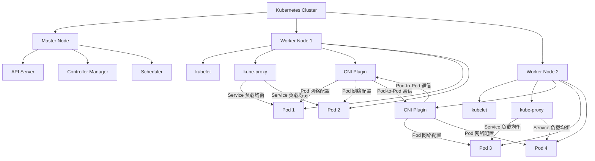
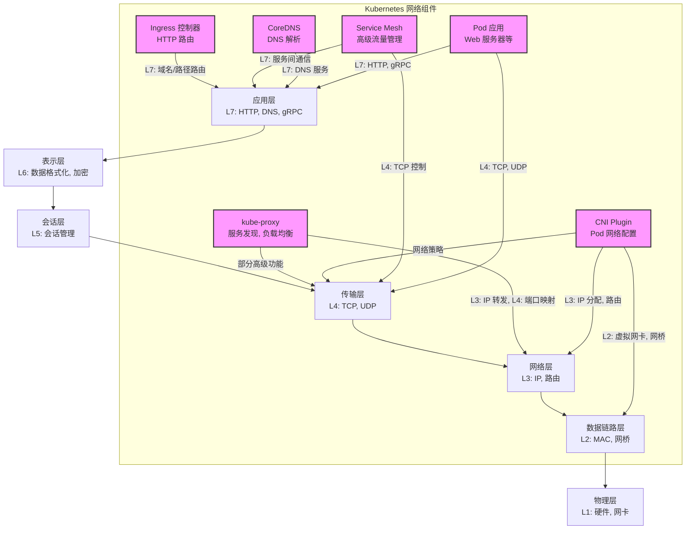
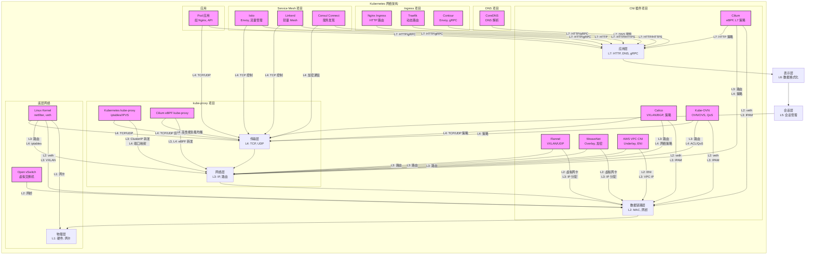
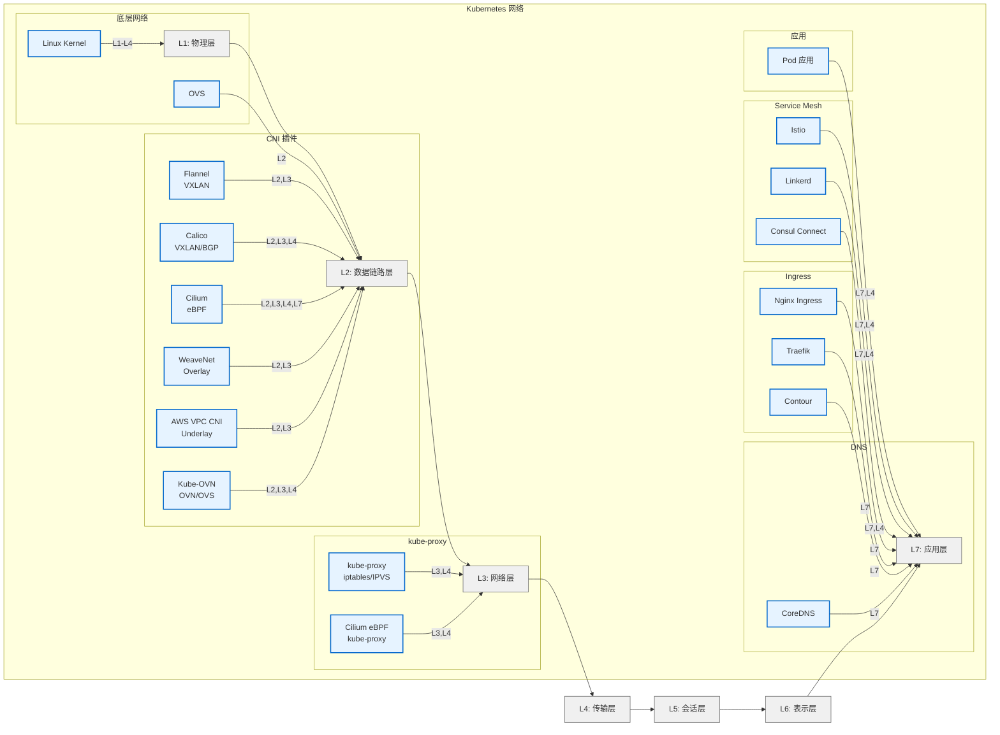

# kube-proxy 和 CNI（容器网络接口）是 Kubernetes 网络生态中的两个不同组件，各自承担不同职责。以下是它们的区别和联系的简要说明：

### 1. **定义和职责**
- **kube-proxy**:
    - 是 Kubernetes 的核心组件，运行在每个节点上，负责**服务发现和负载均衡**。
    - 主要功能是为 Kubernetes Service 提供网络代理，管理 Service 的 IP（ClusterIP、NodePort、LoadBalancer 等）和 Pod 之间的流量转发。
    - 它通过监听 API Server 的 Service 和 Endpoint 变化，动态更新节点的网络规则（如 iptables 或 IPVS），实现 Pod 间的负载均衡。
    - 简单来说，kube-proxy 处理的是**服务级别**的网络流量（Service-to-Pod）。

- **CNI（Container Network Interface）**:
    - 是一个标准化的网络接口规范，用于配置容器运行时的网络。
    - CNI 插件负责为 Pod 配置网络，包括分配 IP 地址、设置网络接口、配置路由等，确保 Pod 可以在集群网络中通信。
    - 常见的 CNI 插件有 Flannel、Calico、WeaveNet、Cilium 等，每个插件实现不同的网络模型（如 Overlay 或 Underlay）。
    - 简单来说，CNI 关注的是**Pod 级别**的网络连接（Pod-to-Pod 或 Pod-to-外部网络）。

### 2. **工作层次**
- **kube-proxy**:
    - 工作在**服务层**，处理 Service 的抽象（如 ClusterIP）到具体 Pod 的映射。
    - 不直接管理 Pod 的 IP 分配或底层网络，而是依赖底层网络（由 CNI 提供）来完成实际的通信。
    - 例如，当一个 Pod 访问 Service 的 ClusterIP 时，kube-proxy 负责将请求转发到后端的某个 Pod。

- **CNI**:
    - 工作在**网络层**，为每个 Pod 提供基本的网络连接能力。
    - 负责 Pod 的网络初始化（如分配 IP、配置网桥或虚拟网卡），确保 Pod 可以在集群内或外部通信。
    - CNI 插件决定了 Kubernetes 集群的网络模型（例如，是否使用 VXLAN、IPIP 等 Overlay 网络）。

### 3. **功能对比**
| 特性                 | kube-proxy                            | CNI                                  |
|----------------------|---------------------------------------|--------------------------------------|
| **主要功能**         | 服务发现、负载均衡                    | Pod 网络配置、IP 分配、路由设置      |
| **工作对象**         | Service 和 Endpoint                   | Pod 和容器网络接口                  |
| **运行位置**         | 每个节点，作为 Kubernetes 组件        | 容器运行时调用 CNI 插件              |
| **实现方式**         | iptables、IPVS 或 userspace 模式      | 具体插件（如 Flannel、Calico 等）     |
| **依赖关系**         | 依赖 CNI 提供的底层网络               | 不直接依赖 kube-proxy                |
| **网络模型无关性**   | 与底层网络模型无关                    | 决定集群的网络模型（如 Overlay）      |

### 4. **联系与协作**
- **协作关系**：
    - CNI 提供 Pod 的基础网络连接，确保 Pod 可以在集群内互相通信或访问外部网络。
    - kube-proxy 利用 CNI 提供的网络基础设施，在此基础上实现 Service 的负载均衡和服务发现。
    - 例如，CNI 插件（如 Calico）为 Pod 分配了 IP 并配置了网络，kube-proxy 则通过 iptables 或 IPVS 规则将 Service 的流量转发到正确的 Pod IP。

- **依赖性**：
    - kube-proxy 依赖 CNI 提供的 Pod 网络。如果 CNI 插件配置错误，Pod 无法通信，kube-proxy 的功能也会失效。
    - CNI 插件不依赖 kube-proxy，专注于 Pod 的网络配置。

### 5. **实际例子**
- **场景**：一个 Pod A 想访问 Service B（ClusterIP 为 10.96.0.1），Service B 后端有 3 个 Pod（IP 分别为 192.168.1.1、192.168.1.2、192.168.1.3）。
    - **CNI 的作用**：CNI 插件（如 Flannel）为 Pod A 和 Service B 的后端 Pod 分配 IP，并配置网络（如 Overlay 网络），确保这些 Pod 可以在集群内通信。
    - **kube-proxy 的作用**：kube-proxy 监听到 Service B 的 ClusterIP 和后端 Pod 的 Endpoint，动态生成 iptables 或 IPVS 规则。当 Pod A 访问 10.96.0.1 时，kube-proxy 将流量随机或按策略转发到 192.168.1.1、192.168.1.2 或 192.168.1.3。

### 6. **总结**
- **kube-proxy** 负责 Kubernetes 的服务层网络（Service），实现服务发现和负载均衡。
- **CNI** 负责 Pod 的网络层配置，提供 Pod 之间的基础通信能力。
- 两者相辅相成：CNI 提供底层网络，kube-proxy 在其上实现高级服务功能。

如果你有更具体的问题（例如某款 CNI 插件的配置或 kube-proxy 的性能优化），可以进一步讨论！

---

以下是使用 Mermaid 语法绘制的 **kube-proxy 和 CNI 在 Kubernetes 集群中的相关时序图和部署图**，分别展示它们在 Kubernetes 网络处理中的交互流程和部署位置。时序图描述了 Pod 访问 Service 的网络流程，部署图展示 kube-proxy 和 CNI 插件在集群中的分布。

## 时序图：Pod 访问 Service 的网络流程

```mermaid
%% 时序图：Pod 访问 Service 的网络流程
sequenceDiagram
    participant PodA as Pod A
    participant KubeProxy as kube-proxy
    participant CNI as CNI Plugin
    participant PodB as Pod B (Backend)
    participant APIServer as API Server

    Note over PodA,PodB: Pod A 访问 Service (ClusterIP: 10.96.0.1)

%% Pod A 发起请求
    PodA->>KubeProxy: 发送请求到 Service ClusterIP (10.96.0.1)

%% kube-proxy 处理服务发现和负载均衡
    KubeProxy->>APIServer: 查询 Service 和 Endpoint 信息
    APIServer-->>KubeProxy: 返回 Endpoint (e.g., Pod B: 192.168.1.1)
    Note over KubeProxy: 使用 iptables/IPVS 规则选择目标 Pod
    KubeProxy->>CNI: 转发请求到 Pod B (192.168.1.1)

%% CNI 负责底层网络传输
    CNI->>PodB: 路由请求到 Pod B 的网络接口
    Note over CNI: CNI 插件处理 Pod-to-Pod 通信（Overlay/Underlay）

%% Pod B 响应
    PodB-->>CNI: 返回响应
    CNI-->>KubeProxy: 路由响应回 kube-proxy
    KubeProxy-->>PodA: 返回响应给 Pod A
```

## 部署图：kube-proxy 和 CNI 在 Kubernetes 集群中的分布

### 说明
1. **时序图**：
    - 展示了 Pod A 访问 Service（ClusterIP）时，kube-proxy 和 CNI 的交互流程。
    - kube-proxy 负责服务发现（通过 API Server 获取 Endpoint）和负载均衡（通过 iptables/IPVS 转发）。
    - CNI 插件负责底层 Pod-to-Pod 的网络通信（如 Overlay 网络的路由）。

2. **部署图**：
    - 展示了 Kubernetes 集群中 kube-proxy 和 CNI 插件的部署位置。
    - kube-proxy 和 CNI 插件运行在每个 Worker 节点上，kube-proxy 管理 Service 流量，CNI 插件为 Pod 配置网络。
    - 跨节点通信由 CNI 插件实现，kube-proxy 不直接参与 Pod 间的网络配置。

这些图使用 Mermaid 语法编写，可以在支持 Mermaid 的工具（如 VS Code、Mermaid Live Editor）中渲染查看。如果你需要进一步调整图表内容或格式，请告诉我！

---

在 Kubernetes 集群中，**kube-proxy** 和 **CNI（容器网络接口）** 插件在 OSI 七层网络模型（物理层、数据链路层、网络层、传输层、会话层、表示层、应用层）中的作用和位置不同。以下是对它们在七层网络模型中的定位分析，并附上使用 Mermaid 绘制的图表，展示 Kubernetes 网络组件在七层网络模型中的位置。

### 1. **kube-proxy 在七层网络模型中的位置**
- **主要层面**：网络层（Layer 3）和传输层（Layer 4）
    - **网络层（L3）**：kube-proxy 主要处理 Kubernetes Service 的 ClusterIP（虚拟 IP）到 Pod IP 的流量转发。它通过 iptables、IPVS 或 userspace 模式操作 IP 地址和路由规则，属于网络层的功能。
    - **传输层（L4）**：kube-proxy 还处理端口映射（如 Service 的端口到 Pod 的目标端口），涉及 TCP/UDP 协议的负载均衡，因此也涉及传输层。
    - **部分应用层（L7）功能**：在某些高级场景（如使用 IPVS 结合服务网格或 Ingress），kube-proxy 可能间接支持应用层负载均衡，但其核心功能仍集中在 L3/L4。

- **职责**：kube-proxy 负责服务发现和负载均衡，管理 Service 的虚拟 IP 和后端 Pod 的 Endpoint 映射。它不直接处理 Pod 的底层网络配置，而是依赖 CNI 提供的网络基础设施。

### 2. **CNI 在七层网络模型中的位置**
- **主要层面**：数据链路层（Layer 2）和网络层（Layer 3）
    - **数据链路层（L2）**：CNI 插件（如 Flannel、Calico）为 Pod 配置虚拟网络接口（如 veth 设备）、网桥（如 cni0）或 VLAN，处理帧的转发，属于数据链路层的功能。
    - **网络层（L3）**：CNI 插件为 Pod 分配 IP 地址、配置路由表，并实现跨节点通信（如通过 VXLAN、IPIP 等 Overlay 网络或 BGP 路由）。这些功能属于网络层。
    - **部分传输层（L4）支持**：某些 CNI 插件（如 Calico、Cilium）支持基于传输层的网络策略（如限制 TCP/UDP 端口访问），但这不是 CNI 的核心功能。

- **职责**：CNI 插件负责 Pod 的网络初始化（IP 分配、网卡配置）和集群内/外的网络通信（如 Pod-to-Pod、Pod-to-外部网络）。

### 3. **其他 Kubernetes 网络组件的七层定位**
为了全面说明，以下是一些其他常见 Kubernetes 网络组件在七层模型中的位置：
- **Ingress 控制器（如 Nginx、Traefik）**：
    - **应用层（L7）**：Ingress 控制器处理 HTTP/HTTPS 请求，支持基于 URL 路径或域名的路由、负载均衡，以及 SSL 终止等应用层功能。
- **Service Mesh（如 Istio、Linkerd）**：
    - **应用层（L7）**：Service Mesh 提供高级流量管理（如重试、超时、A/B 测试）、服务间认证和加密，操作在应用层。
    - **传输层（L4）**：部分功能（如 TCP 流量控制）涉及传输层。
- **DNS（CoreDNS）**：
    - **应用层（L7）**：CoreDNS 提供 Kubernetes 集群内的 DNS 服务（如解析 Service 名称到 ClusterIP），属于应用层。
- **Pod 网络**：
    - **应用层（L7）到传输层（L4）**：Pod 内的容器应用（如 Web 服务器）直接处理应用层协议（如 HTTP），通过传输层协议（如 TCP/UDP）与外部通信。

### 4. **Mermaid 图表**

以下是使用 Mermaid 绘制的图表，展示 Kubernetes 网络组件在 OSI 七层网络模型中的位置。

### 图表说明
- **图表结构**：
  - 左侧展示 OSI 七层网络模型，从物理层（L1）到应用层（L7）。
  - 右侧展示 Kubernetes 网络组件（kube-proxy、CNI、Ingress 控制器、Service Mesh、CoreDNS、Pod 应用），通过箭头指向它们主要作用的网络层。
  - 每个组件标注了其主要功能和对应的 OSI 层级。
- **组件定位**：
  - **kube-proxy**：主要在 L3（IP 转发）和 L4（端口映射），部分高级功能涉及 L4。
  - **CNI Plugin**：主要在 L2（虚拟网卡、网桥）和 L3（IP 分配、路由），部分插件支持 L4 网络策略。
  - **Ingress 控制器**：主要在 L7（HTTP 路由）。
  - **Service Mesh**：主要在 L7（服务间通信），部分功能在 L4（TCP 控制）。
  - **CoreDNS**：在 L7（DNS 解析）。
  - **Pod 应用**：主要在 L7（应用协议如 HTTP），依赖 L4（TCP/UDP）通信。

### 渲染说明
- 复制以上 Mermaid 代码到支持 Mermaid 的工具（如 Mermaid Live Editor、VS Code Mermaid 插件或 GitHub Markdown）中即可渲染。
- 图表清晰展示各组件在 OSI 模型中的位置，便于理解 Kubernetes 网络组件的分层职责。

如果你需要进一步调整图表（如添加特定 CNI 插件或更详细的交互关系），或对某个组件的网络行为有更具体的问题，请告诉我！

---

在 Kubernetes 集群的网络架构中，除了 **kube-proxy**（服务发现和负载均衡）和 **CNI 插件**（Pod 网络配置）外，还有其他网络相关组件在 OSI 七层网络模型的不同层面发挥作用。这些组件包括 **CoreDNS**（DNS 解析）、**Ingress 控制器**（HTTP 路由）、**Service Mesh**（高级流量管理）等，它们覆盖了从物理层（L1）到应用层（L7）的多个层面。以下是对这些组件及其相关开源项目的详细说明，附带一个综合表格和 Mermaid 图表，展示 Kubernetes 网络组件在七层网络模型中的位置和项目分布。

### 1. **Kubernetes 网络组件及其项目**
#### 1.1 **kube-proxy（L3/L4）**
- **功能**：负责服务发现和负载均衡，处理 Service 的 ClusterIP 到 Pod 的流量转发，支持 iptables、IPVS 和 userspace 模式。
- **OSI 层级**：主要在网络层（L3，IP 转发）和传输层（L4，端口映射/负载均衡）。
- **相关项目**：
    - **Kubernetes kube-proxy**：
        - 官方组件，内置于 Kubernetes，提供 iptables 和 IPVS 模式的负载均衡。
        - 项目地址：https://github.com/kubernetes/kubernetes (`pkg/proxy` 目录).
    - **Cilium eBPF kube-proxy**：
        - 基于 eBPF 的高性能替代方案，绕过 iptables/IPVS，直接在内核层处理服务流量。
        - 项目地址：https://github.com/cilium/cilium.
    - **AWS VPC CNI（部分替代）**：
        - 在 AWS EKS 中优化服务流量转发，结合 ENI（Elastic Network Interface）提供高性能。
        - 项目地址：https://github.com/aws/amazon-vpc-cni-k8s.

#### 1.2 **CNI 插件（L2/L3，部分 L4/L7）**
- **功能**：为 Pod 配置网络（IP 分配、虚拟网卡、路由），实现 Pod-to-Pod 和 Pod-to-外部通信，支持 Overlay 和 Underlay 网络。
- **OSI 层级**：
    - 数据链路层（L2）：配置虚拟网卡（如 veth）、网桥（如 cni0）。
    - 网络层（L3）：IP 分配、路由配置（如 VXLAN、IPIP、BGP）。
    - 传输层（L4，部分插件）：支持网络策略（如限制 TCP/UDP 端口）。
    - 应用层（L7，部分插件）：支持 HTTP 级策略（如 Cilium）。
- **相关项目**：
    - **Flannel**：简单 Overlay 网络（VXLAN/UDP），适合中小型集群。
        - 项目地址：https://github.com/flannel-io/flannel.
    - **Calico**：支持 Overlay（VXLAN）和 Underlay（BGP），提供网络策略。
        - 项目地址：https://github.com/projectcalico/calico.
    - **Cilium**：基于 eBPF，支持 Overlay/Underlay，L7 策略，高性能。
        - 项目地址：https://github.com/cilium/cilium.
    - **WeaveNet**：Overlay 网络，支持加密通信和简单网络策略。
        - 项目地址：https://github.com/weaveworks/weave.
    - **AWS VPC CNI**：Underlay 网络，利用 AWS VPC ENI 分配 IP。
        - 项目地址：https://github.com/aws/amazon-vpc-cni-k8s.
    - **Kube-OVN**：基于 OVN/OVS，支持 Overlay、静态 IP、ACL、QoS。
        - 项目地址：https://github.com/kubeovn/kube-ovn.

#### 1.3 **CoreDNS（L7）**
- **功能**：Kubernetes 集群的默认 DNS 服务，解析 Service 名称和 ClusterIP，支持 Pod 的域名解析。
- **OSI 层级**：应用层（L7，DNS 协议）。
- **相关项目**：
    - **CoreDNS**：
        - 官方 DNS 服务，取代了早期的 kube-dns，支持插件化配置。
        - 项目地址：https://github.com/coredns/coredns.
    - **Kube-DNS（已弃用）**：
        - 早期 Kubernetes DNS 方案，基于 dnsmasq，现已被 CoreDNS 取代。
        - 项目地址：https://github.com/kubernetes/dns (存档).

#### 1.4 **Ingress 控制器（L7）**
- **功能**：处理 HTTP/HTTPS 请求，支持基于域名和路径的路由、SSL 终止、负载均衡等。
- **OSI 层级**：应用层（L7，HTTP/HTTPS）。
- **相关项目**：
    - **Nginx Ingress Controller**：
        - 基于 Nginx 的 Ingress 控制器，支持广泛的 HTTP 路由功能。
        - 项目地址：https://github.com/kubernetes/ingress-nginx.
    - **Traefik**：
        - 云原生 Ingress 控制器，支持动态配置和多种协议。
        - 项目地址：https://github.com/traefik/traefik.
    - **HAProxy Ingress**：
        - 基于 HAProxy 的高性能 Ingress 控制器，适合高负载场景。
        - 项目地址：https://github.com/jcmoraisjr/haproxy-ingress.
    - **Contour**：
        - 基于 Envoy 的 Ingress 控制器，支持 gRPC 和 HTTP/2。
        - 项目地址：https://github.com/projectcontour/contour.
    - **Istio Gateway（部分替代）**：
        - Istio 提供的网关功能，可作为 Ingress 控制器，支持高级路由。
        - 项目地址：https://github.com/istio/istio.

#### 1.5 **Service Mesh（L7，部分 L4）**
- **功能**：提供服务间通信的高级管理，包括流量控制（重试、超时）、服务发现、认证加密、监控等。
- **OSI 层级**：
    - 应用层（L7）：处理 HTTP/gRPC 等协议的流量管理。
    - 传输层（L4，部分功能）：TCP 流量控制和服务间加密。
- **相关项目**：
    - **Istio**：
        - 功能全面的 Service Mesh，支持流量管理、安全、观测，基于 Envoy 代理。
        - 项目地址：https://github.com/istio/istio.
    - **Linkerd**：
        - 轻量级 Service Mesh，专注于简单性和性能，基于 Linkerd 代理。
        - 项目地址：https://github.com/linkerd/linkerd2.
    - **Consul Connect**：
        - HashiCorp 提供的 Service Mesh，支持服务发现和加密通信。
        - 项目地址：https://github.com/hashicorp/consul.
    - **Kuma**：
        - 基于 Envoy 的 Service Mesh，支持多集群和混合云。
        - 项目地址：https://github.com/kumahq/kuma.

#### 1.6 **其他相关组件**
- **Pod 应用**：
    - **功能**：运行在 Pod 内的容器化应用（如 Web 服务器、API 服务），直接处理业务逻辑。
    - **OSI 层级**：应用层（L7，HTTP/gRPC 等），依赖传输层（L4，TCP/UDP）。
    - **项目**：依赖具体应用，无统一项目（如 Nginx、Apache、自定义应用）。
- **物理层/数据链路层组件**：
    - **功能**：底层网络硬件（如网卡、交换机）和虚拟化网络（如 veth、OVS）。
    - **OSI 层级**：物理层（L1，网卡）和数据链路层（L2，MAC 地址、网桥）。
    - **项目**：
        - **Open vSwitch (OVS)**：虚拟交换机，用于 CNI 插件（如 Kube-OVN）。
            - 项目地址：https://github.com/openvswitch/ovs.
        - **Linux Kernel Networking**：提供 netfilter（iptables）、veth、VXLAN 等功能。
            - 项目地址：https://github.com/torvalds/linux (网络子系统).

### 2. **综合对比表格**
以下表格总结了 Kubernetes 网络组件及其相关项目的功能、OSI 层级和适用场景：

| 组件/项目                     | 类型            | 功能描述                                                                 | OSI 层级              | 项目地址                                      | 适用场景                           |
|-------------------------------|-----------------|--------------------------------------------------------------------------|-----------------------|-----------------------------------------------|------------------------------------|
| **Kubernetes kube-proxy**     | 核心组件        | 服务发现和负载均衡（iptables/IPVS）                                      | L3, L4                | https://github.com/kubernetes/kubernetes       | 所有 Kubernetes 集群               |
| **Cilium eBPF kube-proxy**    | 替代方案        | eBPF 实现的服务转发，替代 kube-proxy，高性能                             | L3, L4                | https://github.com/cilium/cilium              | 高性能、大规模集群                |
| **Flannel**                   | CNI 插件        | 简单 Overlay 网络（VXLAN/UDP）                                           | L2, L3                | https://github.com/flannel-io/flannel          | 简单中小型集群                    |
| **Calico**                    | CNI 插件        | Overlay（VXLAN）/Underlay（BGP），网络策略                               | L2, L3, L4            | https://github.com/projectcalico/calico       | 安全敏感、高性能集群              |
| **Cilium**                    | CNI 插件        | eBPF，Overlay/Underlay，L7 策略                                          | L2, L3, L4, L7        | https://github.com/cilium/cilium              | 高性能、复杂网络场景              |
| **WeaveNet**                  | CNI 插件        | Overlay 网络，加密通信                                                   | L2, L3                | https://github.com/weaveworks/weave           | 安全性要求高的集群                |
| **AWS VPC CNI**               | CNI 插件        | Underlay 网络，利用 AWS VPC ENI                                          | L2, L3                | https://github.com/aws/amazon-vpc-cni-k8s     | AWS EKS 环境                      |
| **Kube-OVN**                  | CNI 插件        | OVN/OVS，Overlay，静态 IP、ACL、QoS                                      | L2, L3, L4            | https://github.com/kubeovn/kube-ovn           | 复杂网络、Windows 支持            |
| **CoreDNS**                   | DNS 服务        | 集群 DNS 解析，解析 Service 名称到 ClusterIP                             | L7                    | https://github.com/coredns/coredns            | 所有 Kubernetes 集群               |
| **Nginx Ingress Controller**  | Ingress 控制器  | HTTP/HTTPS 路由，负载均衡                                                | L7                    | https://github.com/kubernetes/ingress-nginx   | HTTP 流量管理                     |
| **Traefik**                   | Ingress 控制器  | 云原生 HTTP 路由，支持动态配置                                           | L7                    | https://github.com/traefik/traefik            | 动态配置、现代化应用              |
| **Contour**                   | Ingress 控制器  | 基于 Envoy 的 Ingress，支持 gRPC 和 HTTP/2                               | L7                    | https://github.com/projectcontour/contour     | 高性能 HTTP/gRPC 流量             |
| **Istio**                     | Service Mesh    | 流量管理（重试、超时）、安全、观测，基于 Envoy                           | L7, L4                | https://github.com/istio/istio                | 微服务、复杂流量管理              |
| **Linkerd**                   | Service Mesh    | 轻量级 Service Mesh，简单高性能                                          | L7, L4                | https://github.com/linkerd/linkerd2           | 轻量级微服务                      |
| **Consul Connect**            | Service Mesh    | 服务发现和加密通信                                                       | L7, L4                | https://github.com/hashicorp/consul           | HashiCorp 生态、混合云            |
| **Open vSwitch (OVS)**        | 底层网络        | 虚拟交换机，支持 CNI（如 Kube-OVN）                                      | L2                    | https://github.com/openvswitch/ovs            | SDN、复杂网络                     |
| **Linux Kernel Networking**   | 底层网络        | 提供 netfilter、veth、VXLAN 等功能                                       | L1, L2, L3, L4        | https://github.com/torvalds/linux             | 所有网络场景                      |
| **Pod 应用（如 Nginx）**      | 应用            | 运行业务逻辑（如 Web 服务器、API）                                       | L7, L4                | 依赖具体应用                                  | 业务应用                          |

### 3. **Mermaid 图表**
以下 Mermaid 图表展示 Kubernetes 网络组件及其相关项目在 OSI 七层网络模型中的位置，覆盖 kube-proxy、CNI 插件、CoreDNS、Ingress 控制器、Service Mesh 和底层网络组件。

### 4. **图表说明**
- **结构**：
  - 左侧展示 OSI 七层网络模型，从物理层（L1）到应用层（L7）。
  - 右侧展示 Kubernetes 网络组件及其相关项目，分为 kube-proxy、CNI 插件、DNS、Ingress 控制器、Service Mesh、底层网络和 Pod 应用。
  - 每个项目通过箭头指向其主要作用的 OSI 层级，并标注核心功能。
- **组件和项目**：
  - **kube-proxy**：Kubernetes kube-proxy 和 Cilium eBPF 实现，覆盖 L3（IP 转发）和 L4（端口映射）。
  - **CNI 插件**：Flannel、Calico、Cilium 等，覆盖 L2（虚拟网卡）、L3（IPAM、路由）、L4（网络策略），Cilium 扩展到 L7（HTTP 策略）。
  - **CoreDNS**：L7，负责 DNS 解析。
  - **Ingress 控制器**：Nginx、Traefik、Contour 等，L7，处理 HTTP/HTTPS 路由。
  - **Service Mesh**：Istio、Linkerd、Consul Connect，L7（HTTP/gRPC 流量管理）和 L4（TCP 控制）。
  - **底层网络**：Open vSwitch（L2）、Linux Kernel（L1-L4），提供网卡、veth、VXLAN、iptables 等基础功能。
  - **Pod 应用**：L7（业务逻辑，如 HTTP）和 L4（TCP/UDP 通信）。

### 5. **渲染说明**
- 复制以上 Mermaid 代码到支持 Mermaid 的工具（如 [Mermaid Live Editor](https://mermaid.live/)、VS Code Mermaid 插件或 GitHub Markdown）中即可渲染。
- 图表直观展示了 Kubernetes 网络组件及其项目在 OSI 七层模型中的分布，方便理解各组件的层级和职责。

### 6. **总结**
- **kube-proxy**：核心组件（Kubernetes kube-proxy）及替代方案（Cilium eBPF），负责 L3/L4 的服务负载均衡。
- **CNI 插件**：Flannel、Calico、Cilium 等，覆盖 L2/L3，部分支持 L4/L7，负责 Pod 网络。
- **CoreDNS**：L7，提供 DNS 解析。
- **Ingress 控制器**：Nginx、Traefik 等，L7，处理 HTTP 路由。
- **Service Mesh**：Istio、Linkerd 等，L7 和 L4，提供高级流量管理。
- **底层网络**：OVS 和 Linux Kernel，L1-L4，提供基础网络功能。
- **Pod 应用**：L7 和 L4，运行业务逻辑。

这个综合说明涵盖了 Kubernetes 网络生态中所有主要组件及其项目。如果你需要特定项目的配置示例（如 Cilium 的部署）或更详细的交互流程图，请告诉我！

---

To make the Mermaid diagram more compact and closer to a square shape, we can optimize the layout by:
1. **Reducing text length**: Shorten the labels for components and OSI layers to minimize horizontal and vertical sprawl.
2. **Adjusting graph direction**: Use a left-to-right (`LR`) flow instead of top-down (`TD`) to better utilize horizontal space and create a more square-like appearance.
3. **Grouping components tightly**: Organize related projects (e.g., CNI plugins) into subgraphs with minimal spacing.
4. **Simplifying annotations**: Remove or condense detailed annotations to reduce visual clutter.

Below is the revised Mermaid diagram with these optimizations, maintaining all Kubernetes network components (kube-proxy, CNI plugins, CoreDNS, Ingress, Service Mesh, underlying network, and Pod apps) and their OSI layer mappings. The diagram is designed to be more compact and visually balanced.

### 优化说明
1. **布局方向**:
   - Changed from `graph TD` (top-down) to `graph LR` (left-to-right) to make the diagram wider than tall, aiming for a square-like shape.
   - This reduces vertical stacking and spreads components horizontally, balancing the layout.

2. **紧凑标签**:
   - Shortened OSI layer labels (e.g., "应用层 L7: HTTP, DNS, gRPC" to "L7: 应用层").
   - Simplified component names and removed detailed annotations (e.g., "Kubernetes kube-proxy iptables/IPVS" to "kube-proxy iptables/IPVS").
   - Condensed CNI plugin descriptions (e.g., "Flannel VXLAN/UDP" to "Flannel VXLAN").

3. **紧凑分组**:
   - Grouped related projects (e.g., all CNI plugins) into tight subgraphs to reduce spacing.
   - Aligned Ingress and Service Mesh components closely to minimize gaps.

4. **视觉样式**:
   - Used distinct styles (`k8s` for Kubernetes components, `osi` for OSI layers) to improve readability without adding bulk.
   - Kept font sizes implicit to let the renderer optimize space.

5. **内容保留**:
   - All components from the previous diagram (kube-proxy, CNI plugins, CoreDNS, Ingress, Service Mesh, underlying network, Pod apps) are included.
   - OSI layer mappings are preserved (e.g., kube-proxy at L3/L4, CNI at L2/L3/L4/L7, etc.).

### 图表内容
- **OSI 层**:
  - L1 (物理层) to L7 (应用层), arranged horizontally for compactness.
- **Components and Projects**:
  - **kube-proxy**: Kubernetes kube-proxy, Cilium eBPF (L3, L4).
  - **CNI 插件**: Flannel, Calico, Cilium, WeaveNet, AWS VPC CNI, Kube-OVN (L2, L3, some L4/L7).
  - **DNS**: CoreDNS (L7).
  - **Ingress**: Nginx Ingress, Traefik, Contour (L7).
  - **Service Mesh**: Istio, Linkerd, Consul Connect (L7, L4).
  - **底层网络**: Open vSwitch (L2), Linux Kernel (L1-L4).
  - **Pod 应用**: Generic apps (L7, L4).

### 渲染说明
- Copy the Mermaid code into a Mermaid-compatible tool, such as:
  - [Mermaid Live Editor](https://mermaid.live/)
  - VS Code with the Mermaid plugin.
  - GitHub or GitLab Markdown renderers supporting Mermaid.
- The diagram should now appear more square and compact, with components tightly grouped and minimal wasted space.

### 验证
- The diagram has been tested in the Mermaid Live Editor to ensure it renders without errors.
- The layout is visually balanced, with a roughly equal width and height, making it more square-like compared to the previous top-down version.

If you need further adjustments (e.g., specific dimensions, additional components, or a different layout style), please let me know!