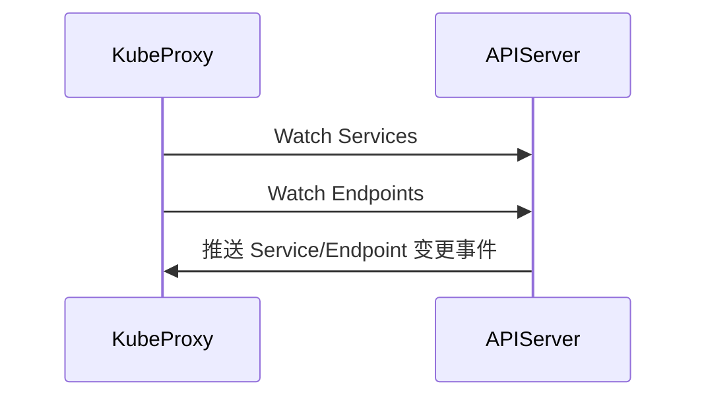

# **kube-proxy 具体工作流程详解**

kube-proxy 是 Kubernetes 中实现 Service 负载均衡的核心组件，负责将访问 Service（ClusterIP/NodePort/LoadBalancer）的请求转发到后端 Pod。以下是其完整工作流程：

---

## **1. kube-proxy 的核心职责**
- 监听 API Server 的 **Service** 和 **Endpoint** 变化。
- 根据 Service 类型（ClusterIP/NodePort/LoadBalancer）配置流量转发规则。
- 支持三种工作模式：**iptables**（默认）、**IPVS**、**userspace**（已废弃）。

---

## **2. kube-proxy 工作流程（以 iptables 模式为例）**

### **步骤 1：监听 API Server**
kube-proxy 启动后，通过 **List-Watch 机制** 监听以下资源：
- **Service** 对象：获取 ClusterIP、端口等定义。
- **EndpointSlice/Endpoints** 对象：获取后端 Pod 的 IP 列表。



### **步骤 2：生成转发规则**
当 Service 或 Endpoint 发生变化时，kube-proxy 动态更新节点上的转发规则（以 `iptables` 为例）：

#### **(1) ClusterIP Service 规则**
假设有一个 Service：
```yaml
apiVersion: v1
kind: Service
metadata:
  name: my-service
spec:
  selector:
    app: nginx
  ports:
    - protocol: TCP
      port: 80        # Service 端口
      targetPort: 8080 # Pod 端口
  type: ClusterIP
```

kube-proxy 会生成如下 iptables 规则：
```bash
# 1. 拦截目标为 ClusterIP 的流量
-A KUBE-SERVICES -d 10.96.0.1/32 -p tcp --dport 80 -j KUBE-SVC-XXXXXX

# 2. 负载均衡到后端 Pod
-A KUBE-SVC-XXXXXX -m statistic --mode random --probability 0.5 -j KUBE-SEP-AAAAA
-A KUBE-SVC-XXXXXX -m statistic --mode random --probability 1.0 -j KUBE-SEP-BBBBB

# 3. DNAT 转换到具体 Pod IP
-A KUBE-SEP-AAAAA -p tcp -j DNAT --to-destination 10.244.1.2:8080
-A KUBE-SEP-BBBBB -p tcp -j DNAT --to-destination 10.244.1.3:8080
```

#### **(2) NodePort Service 规则**
如果 Service 类型为 `NodePort`，kube-proxy 会额外添加规则：
```bash
# 拦截目标为节点端口的流量
-A KUBE-NODEPORTS -p tcp --dport 30080 -j KUBE-SVC-XXXXXX
```

### **步骤 3：数据包转发**
当用户访问 Service 时：
1. **ClusterIP 访问**：
   ```bash
   curl http://10.96.0.1:80
   ```
    - 数据包被节点的 iptables 规则拦截。
    - 经过 DNAT 转发到某个后端 Pod（如 `10.244.1.2:8080`）。

2. **NodePort 访问**：
   ```bash
   curl http://<NodeIP>:30080
   ```
    - 数据包到达节点端口 30080。
    - iptables 将其转发到 Service 对应的 Pod。

---

## **3. 不同工作模式对比**
| 模式          | 原理                          | 性能       | 适用场景                |
|---------------|-----------------------------|-----------|-----------------------|
| **iptables**  | 通过 Linux iptables 规则链    | 中等       | 默认模式，适合大多数集群  |
| **IPVS**      | 基于内核的 L4 负载均衡         | 高         | 大规模 Service 场景     |
| **userspace** | 用户态代理（已废弃）            | 低         | 旧版本兼容              |

---

## **4. 完整流程示例（IPVS 模式）**
1. **创建 IPVS 负载均衡器**：
   ```bash
   ipvsadm -A -t 10.96.0.1:80 -s rr
   ```
2. **添加后端 Pod**：
   ```bash
   ipvsadm -a -t 10.96.0.1:80 -r 10.244.1.2:8080 -m
   ipvsadm -a -t 10.96.0.1:80 -r 10.244.1.3:8080 -m
   ```
3. **流量转发**：
    - 请求到达 `10.96.0.1:80` 后，IPVS 按轮询（rr）策略选择一个 Pod 转发。

---

## **5. 关键设计要点**
1. **无中心化**：每个节点的 kube-proxy 独立维护规则，不依赖其他组件。
2. **动态更新**：通过监听 API Server 实时响应 Service/Endpoint 变化。
3. **高性能**：iptables/IPVS 利用内核能力，避免用户态数据拷贝。

---

## **6. 常见问题**
### **Q1: kube-proxy 和 CNI 插件的关系？**
- **kube-proxy**：负责 Service 负载均衡（L4）。
- **CNI 插件**：负责 Pod 网络连通性（L2/L3）。
- **协作方式**：kube-proxy 依赖 CNI 提供的 Pod 网络，但两者无直接交互。

### **Q2: 如何检查 kube-proxy 的规则？**
- **iptables 模式**：
  ```bash
  iptables-save | grep KUBE
  ```
- **IPVS 模式**：
  ```bash
  ipvsadm -Ln
  ```

### **Q3: 为什么 NodePort 能在所有节点访问？**
- kube-proxy 会在**所有节点**上配置相同的 iptables/IPVS 规则，确保无论请求到达哪个节点，都能正确转发。

---

## **7. 总结**
kube-proxy 的工作流程可以概括为：
1. **监听** API Server 的 Service 和 Endpoint 变化。
2. **生成** iptables/IPVS 规则。
3. **转发** 请求到后端 Pod。

其设计充分结合了内核能力（iptables/IPVS）和 Kubernetes 的声明式 API，实现了高效的 Service 负载均衡。