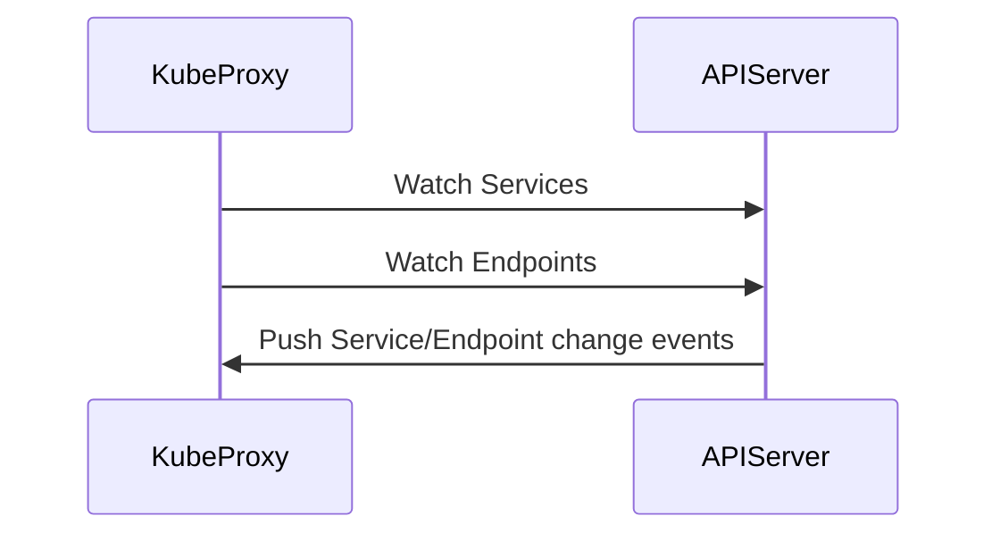

# Detailed Explanation of kube-proxy Specific Workflow

kube-proxy is the core component in Kubernetes that implements Service load balancing, responsible for forwarding requests accessing Services (ClusterIP/NodePort/LoadBalancer) to backend Pods. Below is its complete workflow:

---

## **1. Core Responsibilities of kube-proxy**
- Listens to **Service** and **Endpoint** changes from API Server
- Configures traffic forwarding rules based on Service type (ClusterIP/NodePort/LoadBalancer)
- Supports three working modes: **iptables** (default), **IPVS**, **userspace** (deprecated)

---

## **2. kube-proxy Workflow (Using iptables Mode as Example)**

### **Step 1: Listen to API Server**
After kube-proxy starts, it listens to the following resources through **List-Watch mechanism**:
- **Service** objects: Get definitions like ClusterIP, ports, etc.
- **EndpointSlice/Endpoints** objects: Get backend Pod IP lists



### **Step 2: Generate Forwarding Rules**
When Service or Endpoint changes, kube-proxy dynamically updates forwarding rules on nodes (taking `iptables` as example):

#### **(1) ClusterIP Service Rules**
Assume there is a Service:
```yaml
apiVersion: v1
kind: Service
metadata:
  name: my-service
spec:
  selector:
    app: nginx
  ports:
    - protocol: TCP
      port: 80        # Service port
      targetPort: 8080 # Pod port
  type: ClusterIP
```

kube-proxy will generate the following iptables rules:
```bash
# 1. Intercept traffic destined for ClusterIP
-A KUBE-SERVICES -d 10.96.0.1/32 -p tcp --dport 80 -j KUBE-SVC-XXXXXX

# 2. Load balance to backend Pods
-A KUBE-SVC-XXXXXX -m statistic --mode random --probability 0.5 -j KUBE-SEP-AAAAA
-A KUBE-SVC-XXXXXX -m statistic --mode random --probability 1.0 -j KUBE-SEP-BBBBB

# 3. DNAT translation to specific Pod IP
-A KUBE-SEP-AAAAA -p tcp -j DNAT --to-destination 10.244.1.2:8080
-A KUBE-SEP-BBBBB -p tcp -j DNAT --to-destination 10.244.1.3:8080
```

#### **(2) NodePort Service Rules**
If the Service type is `NodePort`, kube-proxy will add additional rules:
```bash
# Intercept traffic destined for node port
-A KUBE-NODEPORTS -p tcp --dport 30080 -j KUBE-SVC-XXXXXX
```

### **Step 3: Packet Forwarding**
When users access the Service:

1. **ClusterIP Access**:
   ```bash
   curl http://10.96.0.1:80
   ```
   - Packets are intercepted by node's iptables rules
   - After DNAT forwarding to a backend Pod (e.g., `10.244.1.2:8080`)

2. **NodePort Access**:
   ```bash
   curl http://<NodeIP>:30080
   ```
   - Packets arrive at node port 30080
   - iptables forwards them to the Service's corresponding Pod

---

## **3. Comparison of Different Working Modes**

| Mode          | Principle                          | Performance       | Applicable Scenario                |
|---------------|-----------------------------------|------------------|-----------------------|
| **iptables**  | Through Linux iptables rule chains    | Medium           | Default mode, suitable for most clusters  |
| **IPVS**      | Based on kernel L4 load balancing     | High             | Large-scale Service scenarios     |
| **userspace** | User-space proxy (deprecated)         | Low              | Legacy version compatibility      |

---

## **4. Complete Process Example (IPVS Mode)**

1. **Create IPVS Load Balancer**:
   ```bash
   ipvsadm -A -t 10.96.0.1:80 -s rr
   ```

2. **Add Backend Pods**:
   ```bash
   ipvsadm -a -t 10.96.0.1:80 -r 10.244.1.2:8080 -m
   ipvsadm -a -t 10.96.0.1:80 -r 10.244.1.3:8080 -m
   ```

3. **Traffic Forwarding**:
   - After requests arrive at `10.96.0.1:80`, IPVS selects a Pod for forwarding according to round-robin (rr) strategy

---

## **5. Key Design Points**

1. **No Centralization**: Each node's kube-proxy independently maintains rules, doesn't depend on other components
2. **Dynamic Updates**: Real-time response to Service/Endpoint changes by listening to API Server
3. **High Performance**: iptables/IPVS utilizes kernel capabilities, avoiding user-space data copying

---

## **6. Common Questions**

### **Q1: Relationship between kube-proxy and CNI plugins?**
- **kube-proxy**: Responsible for Service load balancing (L4)
- **CNI plugins**: Responsible for Pod network connectivity (L2/L3)
- **Collaboration**: kube-proxy relies on Pod networks provided by CNI, but they don't directly interact

### **Q2: How to check kube-proxy rules?**
- **iptables mode**:
  ```bash
  iptables-save | grep KUBE
  ```
- **IPVS mode**:
  ```bash
  ipvsadm -Ln
  ```

### **Q3: Why can NodePort be accessed on all nodes?**
- kube-proxy configures the same iptables/IPVS rules on **all nodes**, ensuring requests can be correctly forwarded no matter which node they reach

---

## **7. Summary**

kube-proxy's workflow can be summarized as:
1. **Listen** to Service and Endpoint changes from API Server
2. **Generate** iptables/IPVS rules
3. **Forward** requests to backend Pods

Its design fully combines kernel capabilities (iptables/IPVS) with Kubernetes' declarative API, achieving efficient Service load balancing.