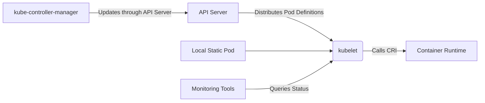
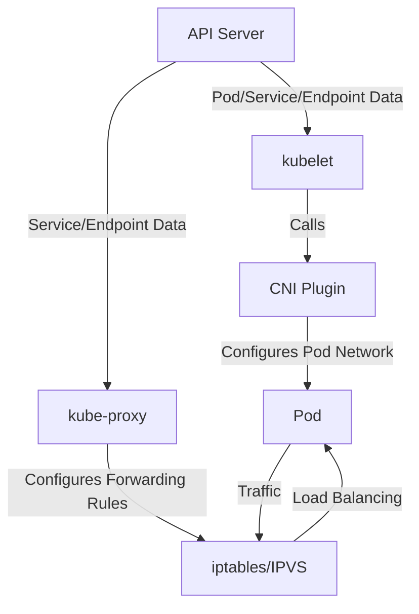

# Introduction to kubelet

In Kubernetes, **kubelet** serves as the core agent component on worker nodes (Worker Node), mainly accepting instructions from **the following sources**, working together to complete Pod lifecycle management:

---

### **1. Kubernetes API Server (Core Commander)**
- **Main Interaction Method**:  
  kube listens to Pod change events related to the current node in API Server (such as `Pod.spec.nodeName = current node`)
- **Specific Responsibilities**:
  - Gets Pod definitions (`PodSpec`) scheduled to this node
  - Executes Pod creation, update, and deletion operations
  - Regularly reports Pod status (like `Running`, `Failed`) to API Server
- **Key Point**:
  - **kubelet is a "subordinate" of API Server**, strictly following instructions issued by it

---

### **2. kube-controller-manager (Indirect Commander)**
- **Node Controller**:
  - Monitors node health status, if node is lost, may trigger Pod rescheduling (notifying other kubelets through API Server)
- **Other Controllers (like DaemonSet Controller)**:
  - Ensures specific Pods (like log collection components) run on all nodes, distributing Pods to corresponding kubelets through API Server

---

### **3. Container Runtime (Container Runtime)**
- **Accepts kubelet's Instructions**:
  - kubelet calls container runtime (like containerd, CRI-O) to actually operate containers through CRI (Container Runtime Interface)
  - For example: `docker run` → `containerd create` → start container
- **Key Point**:
  - kubelet **commands** container runtime, but is itself controlled by API Server

---

### **4. Local Static Pods (Static Pod)**
- **Special Scenario**:
  - If static Pod definition files exist in `/etc/kubernetes/manifests/` directory on the node, kubelet will **bypass API Server to directly manage** these Pods
  - Commonly used for bootstrapping control plane components (like kube-apiserver, etcd)
- **Priority**:
  - Static Pod > API Server distributed Pod

---

### **5. External Monitoring/Management Tools**
- **kubelet API (HTTP/HTTPS Port)**:
  - Provides REST interfaces for external tools (like monitoring systems) to query Pod status, logs, metrics, etc.
  - Default ports: `10250` (read-only), `10255` (deprecated)
- **Security**:
  - Requires certificate authentication or RBAC authorization for access

---

### **Complete Command Chain Summary**


---

### **Key Points**

1. **kubelet's core commander is API Server**, all dynamic Pod creation/updates originate from here
2. **Static Pod is an exception**, managed independently by kubelet (no API Server participation needed)
3. kubelet **doesn't directly accept user commands** (like `kubectl`), all operations need to go through API Server
4. **Hierarchy Relationship**:
   ```
   User → kubectl → API Server → kubelet → Container Runtime
   ```

---

In Kubernetes clusters, **kubelet**, **CNI (Container Network Interface) plugins**, and **kube-proxy** are three key components that work together to achieve Pod lifecycle management and network communication. Below are their responsibilities and interaction relationships:

---

### **1. Core Responsibilities**

| Component            | Main Responsibility                                                                 |
|-------------------|--------------------------------------------------------------------------|
| **kubelet**     | Node agent, responsible for Pod creation, destruction, monitoring, and interaction with container runtime (like containerd) |
| **CNI Plugins**    | Configure Pod networks (IP allocation, network card creation, routing rules, etc.)                          |
| **kube-proxy**  | Maintain network rules on nodes (like iptables/IPVS), implement Service load balancing and routing   |

---

### **2. Workflow and Interaction Relationships**

#### **(1) Collaboration During Pod Creation**

1. **kubelet Creates Pod**
   - Calls container runtime to create containers through CRI (Container Runtime Interface)
   - After container creation, **kubelet calls CNI plugin** to configure network for Pod

2. **CNI Plugin Configures Network**
   - Assigns IP address to Pod (from cluster's CIDR range)
   - Creates virtual network card (like `veth pair`) and connects to cluster network (like bridge or overlay)
   - Sets routing rules (ensures Pod can communicate with other Pods/nodes)

3. **kube-proxy Listens to Service Changes**
   - When Service or Endpoint changes, updates node's iptables/IPVS rules
   - Ensures traffic accessing Service ClusterIP is correctly forwarded to backend Pod

#### **(2) Data Plane Traffic Example**

- **Pod-to-Pod Communication**:
  - Directly through CNI-configured network (like Calico's BGP routing or Flannel's overlay)
  - **Doesn't go through kube-proxy** (unless cross-node and NAT is needed)

- **Pod-to-Service Communication**:
  - Traffic is sent to Service's ClusterIP
  - **kube-proxy's rules** convert ClusterIP to backend Pod IP (through iptables/IPVS)
  - Finally reaches target Pod through CNI network

---

### **3. Key Interaction Scenarios**

#### **(1) Relationship Between kubelet and CNI**
- **Dependency Relationship**:
  - kubelet relies on CNI plugins to provide network capabilities for Pods (specifies plugins through `cni.conf` configuration files)
  - If CNI plugins are not properly installed, Pods will be in `ContainerCreating` state and report errors (like `network plugin not ready`)

- **Call Timing**:
  - During Pod startup (`kubelet` → `CRI` → `CNI`)
  - During Pod deletion (cleanup of network resources)

#### **(2) Relationship Between kubelet and kube-proxy**
- **Indirect Collaboration**:
  - kubelet is responsible for reporting Pod status (IP, ports) to API Server
  - kube-proxy listens to Endpoint changes from API Server, dynamically updates forwarding rules
  - **The two don't directly communicate**, both coordinate through API Server

#### **(3) Relationship Between CNI and kube-proxy**
- **Complementary Functions**:
  - CNI solves **Pod network connectivity** (L3/L4)
  - kube-proxy solves **Service load balancing** (L4)
  - For example: CNI ensures Pods can receive packets, kube-proxy ensures packets are forwarded to the correct Pod

---

### **4. Troubleshooting Example**

#### **Scenario: Pod Cannot Access Service**

1. **Check CNI**
   - Confirm Pod has IP and can ping other Pods:
     ```bash
     kubectl exec <pod> -- ping <another-pod-ip>
     ```
   - If it fails: Check CNI plugin logs (like `calico-node` or `flanneld`)

2. **Check kube-proxy**
   - Confirm Service's iptables/IPVS rules exist:
     ```bash
     iptables-save | grep <service-clusterip>
     ```
   - If rules are missing: Check if `kube-proxy` Pod is running normally

3. **Check kubelet**
   - Confirm Pod network has been initialized:
     ```bash
     kubectl describe pod <pod> | grep Events
     ```
   - If error `network not ready` is reported: Troubleshoot CNI plugin installation or configuration

---

### **5. Summary: Relationship Between the Three**



- **kubelet**: Responsible for Pod lifecycle, calls CNI plugins to configure network
- **CNI Plugin**: Responsible for Pod network connectivity (IP allocation, routing, etc.)
- **kube-proxy**: Responsible for Service load balancing, relies on CNI's network capabilities

The three together ensure:
1. Pods can be created and assigned to networks
2. Pods can communicate across nodes
3. Service virtual IPs can be correctly routed to backend Pods

---

In Kubernetes (k8s), **Pod generation involves the collaboration of multiple components**, but is mainly the responsibility of the following two core components:

---

### **1. Control Plane (Control Plane)**

#### **(1) kube-scheduler (Scheduler)**
- **Responsibility**:
  - Listens to unscheduled Pods (`Pod.spec.nodeName` is empty)
  - Selects the optimal node to run Pod based on resource requirements, affinity rules, etc.
  - Writes scheduling decisions to API Server (updates `Pod.spec.nodeName`)
- **Key Point**:
  - **Doesn't directly create Pods**, only decides which node Pod should run on

#### **(2) kube-controller-manager (Controller Manager)**
- Where **Deployment Controller** / **ReplicaSet Controller** / **StatefulSet Controller**, etc.:
  - Listens to changes in resources (like Deployment, ReplicaSet) in API Server
  - Ensures the number of actually running Pods matches the declared replica count
  - **Generates Pod templates** (PodSpec) and creates Pod objects through API Server
- **Key Point**:
  - **Responsible for generating Pod metadata** (like name, labels, resource requests, etc.), but Pods are not yet scheduled or running

---

### **2. Worker Node (Worker Node)**

#### **(3) kubelet (Node Agent)**
- **Responsibility**:
  - Listens to Pods assigned to this node in API Server
  - Calls container runtime (like containerd, CRI-O) to **actually create containers**
  - Manages Pod lifecycle (start, stop, restart)
- **Key Point**:
  - **The process that actually generates Pods on nodes**, converting Pods from declarative state to actually running containers

---

### **Complete Process Example (Taking Deployment as Example)**

1. **User Submits Deployment**:
   ```bash
   kubectl create deployment nginx --image=nginx
   ```

2. **Deployment Controller Generates ReplicaSet**:
   - Creates ReplicaSet object based on Deployment template

3. **ReplicaSet Controller Generates Pod Object**:
   - Creates Pod through API Server (at this time `Pod.spec.nodeName` is empty)

4. **kube-scheduler Assigns Node**:
   - Selects appropriate node and updates `Pod.spec.nodeName`

5. **Target Node's kubelet Creates Container**:
   - Calls container runtime to start containers within Pod

---

### **Key Summary**

| Component                | Responsibility                               | Does it Directly Generate Pod? |
|---------------------|-----------------------------------|------------------|
| **Deployment/ReplicaSet Controller** | Generates Pod metadata (through API Server) | ❌ (Only generates declaration)   |
| **kube-scheduler**  | Decides which node Pod runs on           | ❌                |
| **kubelet**         | Actually creates containers on nodes               | ✅                |

**Short Answer**:
- **Pod declarations are generated by controllers (like Deployment Controller)**, but **actual creation is executed by kubelet**
- The entire process is coordinated through API Server's listening mechanism