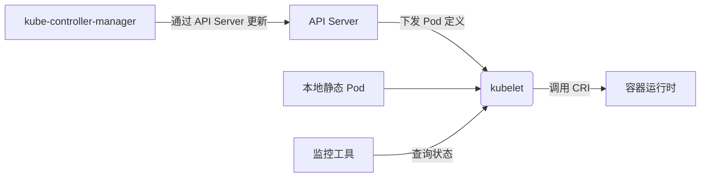
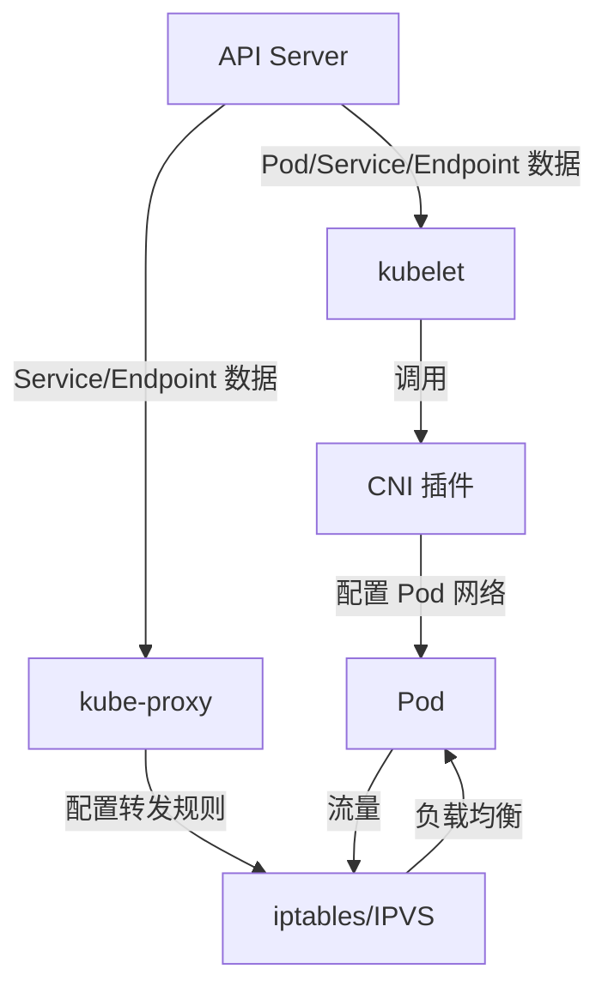

# kubelet简介

在 Kubernetes 中，**kubelet** 作为工作节点（Worker Node）上的核心代理组件，主要接受来自 **以下几个来源的指令**，共同协作完成 Pod 的生命周期管理：

---

### **1. Kubernetes API Server（核心指挥者）**
- **主要交互方式**：  
  kubelet 通过监听 API Server 中与当前节点相关的 Pod 变更事件（如 `Pod.spec.nodeName = 当前节点`）。
- **具体职责**：
    - 获取调度到本节点的 Pod 定义（`PodSpec`）。
    - 执行 Pod 的创建、更新、删除操作。
    - 定期向 API Server 上报 Pod 状态（如 `Running`、`Failed`）。
- **关键点**：
    - **kubelet 是 API Server 的“下属”**，严格遵循其下发的指令。

---

### **2. kube-controller-manager（间接指挥）**
- **Node Controller**：
    - 监控节点健康状态，若节点失联，可能触发 Pod 重新调度（通过 API Server 通知其他 kubelet）。
- **其他控制器（如 DaemonSet Controller）**：
    - 确保特定 Pod（如日志收集组件）在所有节点上运行，通过 API Server 下发 Pod 到对应 kubelet。

---

### **3. 容器运行时（Container Runtime）**
- **接受 kubelet 的指令**：
    - kubelet 通过 CRI（Container Runtime Interface）调用容器运行时（如 containerd、CRI-O）实际操作容器。
    - 例如：`docker run` → `containerd create` → 启动容器。
- **关键点**：
    - kubelet **指挥**容器运行时，但自身受 API Server 控制。

---

### **4. 本地静态 Pod（Static Pod）**
- **特殊场景**：
    - 如果节点上存在 `/etc/kubernetes/manifests/` 目录下的静态 Pod 定义文件，kubelet 会**绕过 API Server 直接管理**这些 Pod。
    - 常用于自举控制平面组件（如 kube-apiserver、etcd）。
- **优先级**：
    - 静态 Pod > API Server 下发的 Pod。

---

### **5. 外部监控/管理工具**
- **kubelet API（HTTP/HTTPS 端口）**：
    - 提供 REST 接口供外部工具（如监控系统）查询 Pod 状态、日志、指标等。
    - 默认端口：`10250`（只读）、`10255`（已弃用）。
- **安全性**：
    - 需配置证书认证或 RBAC 授权访问。

---

### **完整指挥链总结**


---

### **关键点**
1. **kubelet 的核心指挥者是 API Server**，所有动态 Pod 的创建/更新均来源于此。
2. **静态 Pod 是例外**，由 kubelet 自主管理（无需 API Server 参与）。
3. kubelet **不直接接受用户命令**（如 `kubectl`），所有操作需通过 API Server 中转。
4. **层级关系**：
   ``` 
   User → kubectl → API Server → kubelet → 容器运行时
   ```
   
---

在 Kubernetes 集群中，**kubelet**、**CNI（Container Network Interface）插件**和 **kube-proxy** 是三个关键组件，它们协同工作以实现 Pod 的生命周期管理和网络通信。以下是它们的职责和交互关系：

---

### **1. 核心职责**
| 组件            | 主要职责                                                                 |
|-----------------|--------------------------------------------------------------------------|
| **kubelet**     | 节点代理，负责 Pod 的创建、销毁、监控，并与容器运行时（如 containerd）交互 |
| **CNI 插件**    | 配置 Pod 的网络（IP 分配、网卡创建、路由规则等）                          |
| **kube-proxy**  | 维护节点上的网络规则（如 iptables/IPVS），实现 Service 的负载均衡和路由   |

---

### **2. 工作流程与交互关系**
#### **（1）Pod 创建时的协作**
1. **kubelet 创建 Pod**
    - 通过 CRI（Container Runtime Interface）调用容器运行时创建容器。
    - 容器创建后，**kubelet 调用 CNI 插件**为 Pod 配置网络。

2. **CNI 插件配置网络**
    - 为 Pod 分配 IP 地址（从集群的 CIDR 范围）。
    - 创建虚拟网卡（如 `veth pair`）并连接到集群网络（如 bridge 或 overlay）。
    - 设置路由规则（确保 Pod 可以与其他 Pod/节点通信）。

3. **kube-proxy 监听 Service 变化**
    - 当 Service 或 Endpoint 变化时，更新节点的 iptables/IPVS 规则。
    - 确保访问 Service ClusterIP 的流量被正确转发到后端 Pod。

#### **（2）数据面流量示例**
- **Pod-to-Pod 通信**：
    - 直接通过 CNI 配置的网络（如 Calico 的 BGP 路由或 Flannel 的 overlay）。
    - **不经过 kube-proxy**（除非跨节点且需要 NAT）。

- **Pod-to-Service 通信**：
    - 流量发往 Service 的 ClusterIP。
    - **kube-proxy 的规则**将 ClusterIP 转换为后端 Pod IP（通过 iptables/IPVS）。
    - 最终通过 CNI 网络到达目标 Pod。

---

### **3. 关键交互场景**
#### **（1）kubelet 与 CNI 的关系**
- **依赖关系**：
    - kubelet 依赖 CNI 插件为 Pod 提供网络能力（通过 `cni.conf` 配置文件指定插件）。
    - 如果 CNI 插件未正确安装，Pod 会处于 `ContainerCreating` 状态并报错（如 `network plugin not ready`）。

- **调用时机**：
    - 在 Pod 启动时（`kubelet` → `CRI` → `CNI`）。
    - 在 Pod 删除时（清理网络资源）。

#### **（2）kubelet 与 kube-proxy 的关系**
- **间接协作**：
    - kubelet 负责将 Pod 的状态（IP、端口）上报给 API Server。
    - kube-proxy 监听 API Server 的 Endpoint 变化，动态更新转发规则。
    - **两者不直接通信**，均通过 API Server 协调。

#### **（3）CNI 与 kube-proxy 的关系**
- **互补功能**：
    - CNI 解决 **Pod 的网络连通性**（L3/L4）。
    - kube-proxy 解决 **Service 的负载均衡**（L4）。
    - 例如：CNI 确保 Pod 能收到数据包，kube-proxy 确保数据包被转发到正确的 Pod。

---

### **4. 故障排查示例**
#### **场景：Pod 无法访问 Service**
1. **检查 CNI**
    - 确认 Pod 有 IP 且能 ping 通其他 Pod：
      ```bash
      kubectl exec <pod> -- ping <another-pod-ip>
      ```
    - 如果失败：检查 CNI 插件日志（如 `calico-node` 或 `flanneld`）。

2. **检查 kube-proxy**
    - 确认 Service 的 iptables/IPVS 规则存在：
      ```bash
      iptables-save | grep <service-clusterip>
      ```
    - 如果规则缺失：检查 `kube-proxy` Pod 是否运行正常。

3. **检查 kubelet**
    - 确认 Pod 网络已初始化：
      ```bash
      kubectl describe pod <pod> | grep Events
      ```
    - 如果报错 `network not ready`：排查 CNI 插件安装或配置。

---

### **5. 总结：三者的关系**


- **kubelet**：负责 Pod 的生命周期，调用 CNI 插件配置网络。
- **CNI 插件**：负责 Pod 的网络连通性（IP 分配、路由等）。
- **kube-proxy**：负责 Service 的负载均衡，依赖 CNI 的网络能力。

三者共同确保：
1. Pod 能够被创建并分配到网络。
2. Pod 之间可以跨节点通信。
3. Service 的虚拟 IP 能够正确路由到后端 Pod。

---

在 Kubernetes（k8s）中，**Pod 的生成涉及多个组件协同工作**，但主要由以下两个核心组件负责：

---

### **1. 控制平面（Control Plane）**
#### **（1）kube-scheduler（调度器）**
- **职责**：
    - 监听未被调度的 Pod（`Pod.spec.nodeName` 为空）。
    - 根据资源需求、亲和性规则等，选择最优的 Node 运行 Pod。
    - 将调度决策写入 API Server（更新 `Pod.spec.nodeName`）。
- **关键点**：
    - **不直接创建 Pod**，仅决定 Pod 应该运行在哪个 Node 上。

#### **（2）kube-controller-manager（控制器管理器）**
- 其中的 **Deployment Controller** / **ReplicaSet Controller** / **StatefulSet Controller** 等：
    - 监听 API Server 中资源（如 Deployment、ReplicaSet）的变化。
    - 确保实际运行的 Pod 数量与声明的副本数一致。
    - **生成 Pod 模板**（PodSpec）并通过 API Server 创建 Pod 对象。
- **关键点**：
    - **负责生成 Pod 的元数据**（如名称、标签、资源请求等），但 Pod 尚未被调度或运行。

---

### **2. 工作节点（Worker Node）**
#### **（3）kubelet（节点代理）**
- **职责**：
    - 监听 API Server 中分配到本节点的 Pod。
    - 调用容器运行时（如 containerd、CRI-O）**实际创建容器**。
    - 管理 Pod 生命周期（启动、停止、重启）。
- **关键点**：
    - **真正在节点上生成 Pod 的进程**，将 Pod 从声明式状态变为实际运行的容器。

---

### **完整流程示例（以 Deployment 为例）**
1. **用户提交 Deployment**：
   ```bash
   kubectl create deployment nginx --image=nginx
   ```
2. **Deployment Controller 生成 ReplicaSet**：
    - 根据 Deployment 模板创建 ReplicaSet 对象。
3. **ReplicaSet Controller 生成 Pod 对象**：
    - 通过 API Server 创建 Pod（此时 `Pod.spec.nodeName` 为空）。
4. **kube-scheduler 分配 Node**：
    - 选择合适 Node 并更新 `Pod.spec.nodeName`。
5. **目标 Node 的 kubelet 创建容器**：
    - 调用容器运行时启动 Pod 内的容器。

---

### **关键总结**
| 组件                | 职责                               | 是否直接生成 Pod？ |
|---------------------|-----------------------------------|------------------|
| **Deployment/ReplicaSet Controller** | 生成 Pod 元数据（通过 API Server） | ❌（仅生成声明）   |
| **kube-scheduler**  | 决定 Pod 运行在哪个 Node           | ❌                |
| **kubelet**         | 在节点上实际创建容器               | ✅                |

**简答**：
- **Pod 的声明由控制器（如 Deployment Controller）生成**，但**实际创建由 kubelet 执行**。
- 整个过程通过 API Server 的监听机制协调完成。