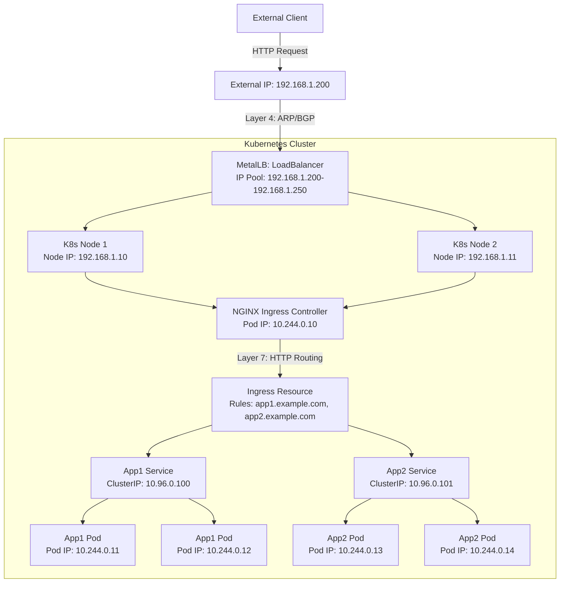

# No, **MetalLB** is not considered an **Ingress Controller**, they are two different tools in the Kubernetes ecosystem that solve different problems. Here's a detailed explanation:

### 1. **Role of MetalLB**
- **MetalLB** is a **network load balancer (Network Load Balancer)** primarily used to implement **LoadBalancer type Services** in **bare-metal (bare-metal)** Kubernetes clusters.
- In cloud environments, Kubernetes can automatically allocate external IPs and handle traffic distribution through cloud provider load balancers (e.g., AWS ELB, GCP Network Load Balancer). However, in bare-metal environments, there is no such native support, and MetalLB fills this gap.
- MetalLB routes external traffic to Kubernetes Services by allocating external IP addresses within the cluster and using **Layer 2 (ARP)** or **Layer 3 (BGP)** protocols. It is essentially a **Layer 4 (IP + port)** load balancing solution.
- MetalLB is typically used to provide external IP addresses for Services (such as ingress-nginx Service) so they can be accessed externally.

### 2. **Role of Ingress Controller**
- **Ingress Controller** is a component that runs in a Kubernetes cluster and is responsible for handling HTTP/HTTPS traffic routing rules defined by **Ingress resources**. It is a **Layer 7 (application layer)** load balancing solution.
- Ingress Controllers (such as NGINX Ingress Controller, Traefik, Contour, etc.) forward external HTTP requests to specific Services within the cluster based on Ingress resource configurations (e.g., hostname, path).
- Ingress Controllers typically require an external IP address to receive traffic, which can be provided by MetalLB in bare-metal environments.

### 3. **Relationship between MetalLB and Ingress Controller**
- **MetalLB and Ingress Controller are complementary**, not replacements for each other.
- In bare-metal environments, the Service of an Ingress Controller (usually LoadBalancer type) needs an external IP address to receive traffic. MetalLB is responsible for allocating an external IP for this Service and directing traffic to cluster nodes through Layer 2 or BGP.
- Simply put:
    - MetalLB provides **external IP and basic traffic distribution** (Layer 4).
    - Ingress Controller provides **advanced routing based on HTTP** (Layer 7), such as hostname or path-based routing, TLS termination, etc.

### 4. **Collaboration in Actual Deployment**
- Typical bare-metal cluster deployment process:
    1. Install MetalLB and configure IP address pools (IPAddressPool) to allocate external IPs for LoadBalancer type Services.
    2. Deploy an Ingress Controller (such as NGINX Ingress Controller), configure its Service as LoadBalancer type, and MetalLB will allocate an external IP for this Service.
    3. Create Ingress resources defining routing rules based on hostname or path, and the Ingress Controller will forward traffic to backend Services based on these rules.
- Example: You deploy an NGINX Ingress Controller, and MetalLB allocates an IP for its Service (e.g., 192.168.1.200). External requests reach this IP, and the NGINX Ingress Controller then routes the request to the corresponding backend application (e.g., `app1.example.com` or `app2.example.com`) based on Ingress rules.

### 5. **Why MetalLB is not an Ingress Controller**
- **Functional differences**:
    - MetalLB only cares about IP address allocation and basic traffic distribution, not handling HTTP protocols or content-based routing.
    - Ingress Controllers focus on advanced routing, TLS termination, and load balancing strategies for HTTP/HTTPS traffic.
- **Protocol layer differences**:
    - MetalLB works at the **network layer (Layer 4)**, handling traffic at the IP and port level.
    - Ingress Controllers work at the **application layer (Layer 7)**, handling HTTP request routing logic.
- **Use case differences**:
    - If you only need a simple LoadBalancer to expose non-HTTP services (like MySQL, SMTP), MetalLB is sufficient.
    - If you need HTTP traffic routing based on hostname or path, or need TLS termination, then an Ingress Controller is required.

### 6. **Must they be used together?**
- Not necessarily. If your service only needs simple LoadBalancer exposure (e.g., non-HTTP protocol services), you can use MetalLB alone without an Ingress Controller.
- However, if you need to handle HTTP traffic and perform complex routing (such as multi-domain, path distribution), you typically combine MetalLB and Ingress Controller.

---

You're right, thank you for your feedback! I didn't explain the IP address allocation details in detail in the previous Mermaid deployment diagram, and indeed Service is a logical resource in Kubernetes, usually associated with nodes (Node), but doesn't directly "run" on nodes. Instead, it proxies traffic to Pods through kube-proxy. To more clearly demonstrate the collaboration between MetalLB and Ingress Controller, and include example IP addresses, I will update the deployment diagram to correct the representation of Service and ensure the logic is more accurate.

### Modifications
1. **Add IP address explanations**:
    - Provide examples for external IPs allocated by MetalLB (e.g., `192.168.1.200`).
    - Add examples for internal ClusterIP and Pod IP for Service and Pod (e.g., ClusterIP in the `10.96.0.x` range and Pod IP in the `10.244.0.x` range).
    - Explain how MetalLB maps external IPs to nodes through ARP/BGP.
2. **Correct Service representation**:
    - Service is a logical abstraction in Kubernetes, not directly running on nodes, but proxying traffic to Pods through kube-proxy.
    - In the diagram, Service will be represented as a cluster-wide resource, associated with Ingress Controller and Pod, rather than directly placed within a specific node.
3. **Optimize diagram structure**:
    - More clearly demonstrate the traffic flow between MetalLB, Ingress Controller, Service, and Pod.
    - Label the processing stages of Layer 4 and Layer 7.

Here is the updated Mermaid deployment diagram, including example IP addresses and corrected Service representation.

### Diagram Updates
1. **IP Address Explanation**:
    - **External IP**: `192.168.1.200`, allocated by MetalLB from the IP pool (example: `192.168.1.200-192.168.1.250`), used for the LoadBalancer Service of the Ingress Controller.
    - **Node IP**: Examples are `192.168.1.10` and `192.168.1.11`, representing the physical/virtual network interface IPs of cluster nodes.
    - **Pod IP**: Examples are `10.244.0.10` (Ingress Controller Pod), `10.244.0.11-10.244.0.14` (backend application Pods), based on Kubernetes' default Pod network (such as Flannel/Calico CNI network).
    - **ClusterIP**: Examples are `10.96.0.100` and `10.96.0.101`, representing the virtual IPs used by Services for internal cluster communication.
2. **Service Representation**:
    - Services (App1 Service and App2 Service) are no longer directly placed within nodes but are represented as cluster-wide logical resources connected to backend Pods.
    - Traffic is forwarded from Service to Pod through kube-proxy (not explicitly shown, but implied in the arrow from Service to Pod).
3. **Traffic Flow**:
    - External client requests reach `192.168.1.200`.
    - MetalLB uses ARP (Layer 2) or BGP (Layer 3) to route traffic to nodes (`192.168.1.10` or `192.168.1.11`).
    - Traffic reaches the Pod of the Ingress Controller (`10.244.0.10`).
    - The Ingress Controller forwards the request to the Service (`10.96.0.100` or `10.96.0.101`) based on Ingress rules.
    - The Service then forwards traffic to backend Pods (`10.244.0.11-10.244.0.14`) through kube-proxy.

### IP Address Allocation Logic
- **MetalLB's IP Pool**: Configured as `192.168.1.200-192.168.1.250`, usually consistent with the subnet where the cluster is located. MetalLB allocates these IPs through `IPAddressPool` and `L2Advertisement` or `BGPPeer`.
- **ClusterIP**: Kubernetes' internal virtual IP, used by Services, defaulting to the `10.96.0.0/12` range (adjustable via kube-apiserver configuration).
- **Pod IP**: Allocated by CNI plugins (like Flannel, Calico), typically in the `10.244.0.0/16` range (specific range depends on CNI configuration).
- **Node IP**: Network interface IPs of bare-metal servers or virtual machines, usually allocated by the data center network (e.g., `192.168.1.0/24`).

### Usage
- Paste the above Mermaid code into tools that support Mermaid (such as Mermaid Live Editor or GitHub Markdown) to render the diagram.
- IP addresses are examples only; actual usage requires configuration based on your network environment (e.g., MetalLB's IP pool needs to match your subnet).

### Additional Notes
- **Service Operation**: Service itself is not a "running" entity; it is a resource in the Kubernetes API, managed and stored by kube-apiserver. Actual traffic forwarding is implemented by kube-proxy on each node through iptables or IPVS rules, forwarding Service ClusterIP traffic to backend Pods.
- **MetalLB's Role**: MetalLB only allocates external IPs for LoadBalancer type Services (such as the Service of the Ingress Controller) and ensures external traffic can reach cluster nodes through ARP or BGP.

If you need further adjustments to the diagram (such as adding more IP addresses, specifying other CNI networks, or showing specific Ingress rules), or need YAML configuration examples for MetalLB/Ingress Controller, please let me know!