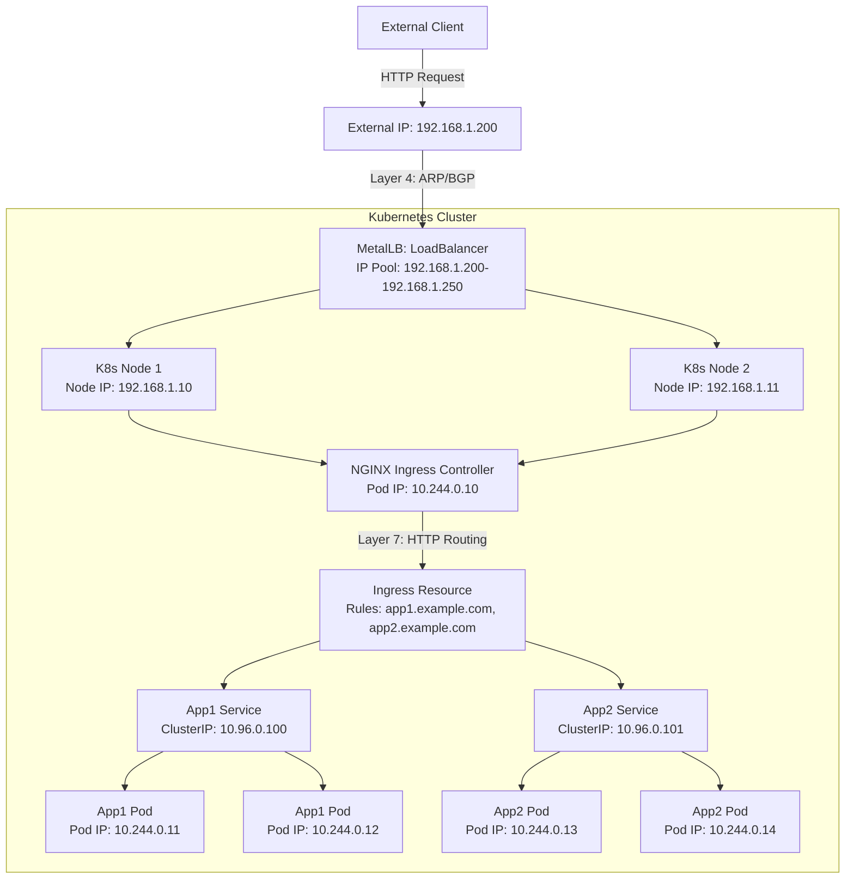

# 不，**MetalLB** 不算是 **Ingress Controller**，它们是 Kubernetes 生态系统中用于解决不同问题的两种不同工具。以下是详细的解释：

### 1. **MetalLB 的作用**
- **MetalLB** 是一个 **网络负载均衡器（Network Load Balancer）**，主要用于在**裸金属（bare-metal）** Kubernetes 集群中实现 **LoadBalancer 类型的 Service**。
- 在云环境中，Kubernetes 可以通过云提供商的负载均衡器（例如 AWS ELB、GCP Network Load Balancer）自动分配外部 IP 并处理流量分发。但在裸金属环境中，没有这样的原生支持，MetalLB 填补了这一空白。
- MetalLB 通过在集群中分配外部 IP 地址并使用 **Layer 2（ARP）** 或 **Layer 3（BGP）** 协议，将外部流量路由到 Kubernetes Service。它本质上是一个 **Layer 4（IP + 端口）** 的负载均衡解决方案。
- MetalLB 通常用于为 Service（如 ingress-nginx 的 Service）提供外部 IP 地址，使其可以被外部访问。

### 2. **Ingress Controller 的作用**
- **Ingress Controller** 是一个运行在 Kubernetes 集群中的组件，负责处理 **Ingress 资源** 定义的 HTTP/HTTPS 流量路由规则。它是 **Layer 7（应用层）** 的负载均衡解决方案。
- Ingress Controller（如 NGINX Ingress Controller、Traefik、Contour 等）根据 Ingress 资源的配置（例如主机名、路径）将外部 HTTP 请求路由到集群内的特定 Service。
- Ingress Controller 通常需要一个外部 IP 地址来接收流量，而这个 IP 地址在裸金属环境中可以通过 MetalLB 提供。

### 3. **MetalLB 和 Ingress Controller 的关系**
- **MetalLB 和 Ingress Controller 是互补的**，而不是替代关系。
- 在裸金属环境中，Ingress Controller 的 Service（通常是 LoadBalancer 类型）需要一个外部 IP 地址来接收流量。MetalLB 负责为这个 Service 分配一个外部 IP，并通过 Layer 2 或 BGP 将流量引导到集群节点。
- 简单来说：
    - MetalLB 提供 **外部 IP 和基础流量分发**（Layer 4）。
    - Ingress Controller 提供 **基于 HTTP 的高级路由**（Layer 7），如基于主机名或路径的路由、TLS 终止等。

### 4. **实际部署中的协作**
- 典型的裸金属集群部署流程：
    1. 安装 MetalLB，并配置 IP 地址池（IPAddressPool），为 LoadBalancer 类型的 Service 分配外部 IP。
    2. 部署一个 Ingress Controller（如 NGINX Ingress Controller），其 Service 配置为 LoadBalancer 类型，MetalLB 会为这个 Service 分配一个外部 IP。
    3. 创建 Ingress 资源，定义基于主机名或路径的路由规则，Ingress Controller 根据这些规则将流量转发到后端的 Service。
- 示例：你部署了一个 NGINX Ingress Controller，MetalLB 为其 Service 分配了一个 IP（例如 192.168.1.200）。外部请求到达这个 IP，NGINX Ingress Controller 再根据 Ingress 规则将请求路由到对应的后端应用（如 `app1.example.com` 或 `app2.example.com`）。

### 5. **为什么 MetalLB 不是 Ingress Controller**
- **功能差异**：
    - MetalLB 只关心 IP 地址分配和基础的流量分发，不处理 HTTP 协议或基于内容的路由。
    - Ingress Controller 专注于 HTTP/HTTPS 流量的高级路由、TLS 终止、负载均衡策略等。
- **协议层差异**：
    - MetalLB 工作在 **网络层（Layer 4）**，处理 IP 和端口级别的流量。
    - Ingress Controller 工作在 **应用层（Layer 7）**，处理 HTTP 请求的路由逻辑。
- **使用场景差异**：
    - 如果你只需要一个简单的 LoadBalancer 来暴露非 HTTP 服务（如 MySQL、SMTP），MetalLB 就足够了。
    - 如果你需要基于主机名、路径的 HTTP 路由，或需要 TLS 终止，则需要 Ingress Controller。

### 6. **是否必须一起使用？**
- 不一定。如果你的服务只需要简单的 LoadBalancer 暴露（如非 HTTP 协议的服务），可以只用 MetalLB 而无需 Ingress Controller。
- 但如果你需要处理 HTTP 流量并进行复杂路由（例如多域名、路径分发），通常会结合 MetalLB 和 Ingress Controller 使用。

---

你说得对，感谢你的反馈！我在之前的 Mermaid 部署图中没有详细说明 IP 地址的分配细节，而且 Service 确实是 Kubernetes 的逻辑资源，通常与节点（Node）关联，但不直接“运行”在节点上，而是通过 kube-proxy 在节点上代理流量到 Pod。为了更清晰地展示 MetalLB 和 Ingress Controller 的协作，并加入示例 IP 地址，我将更新部署图，修正 Service 的表示方式，并确保逻辑更准确。

### 修改说明
1. **添加 IP 地址说明**：
    - 为 MetalLB 分配的外部 IP 提供示例（如 `192.168.1.200`）。
    - 为 Service 和 Pod 添加内部 ClusterIP 和 Pod IP 的示例（如 `10.96.0.x` 范围的 ClusterIP 和 `10.244.0.x` 范围的 Pod IP）。
    - 说明 MetalLB 如何通过 ARP/BGP 将外部 IP 映射到节点。
2. **修正 Service 表示**：
    - Service 是 Kubernetes 的逻辑抽象，不直接运行在节点上，而是通过 kube-proxy 代理流量到 Pod。
    - 在图中将 Service 表示为集群范围的资源，与 Ingress Controller 和 Pod 关联，而不是直接放在某个节点内。
3. **优化图表结构**：
    - 更明确地展示 MetalLB、Ingress Controller、Service 和 Pod 之间的流量流向。
    - 标注 Layer 4 和 Layer 7 的处理阶段。

以下是更新后的 Mermaid 部署图，包含示例 IP 地址和修正后的 Service 表示。

### 图表更新内容
1. **IP 地址说明**：
    - **外部 IP**：`192.168.1.200`，由 MetalLB 从 IP 池（示例：`192.168.1.200-192.168.1.250`）分配，用于 Ingress Controller 的 LoadBalancer Service。
    - **节点 IP**：示例为 `192.168.1.10` 和 `192.168.1.11`，表示集群节点的物理/虚拟网络接口 IP。
    - **Pod IP**：示例为 `10.244.0.10`（Ingress Controller Pod）、`10.244.0.11-10.244.0.14`（后端应用 Pod），基于 Kubernetes 默认的 Pod 网络（如 Flannel/Calico 的 CNI 网络）。
    - **ClusterIP**：示例为 `10.96.0.100` 和 `10.96.0.101`，表示 Service 的虚拟 IP，用于集群内部通信。
2. **Service 表示**：
    - Service（App1 Service 和 App2 Service）不再直接放在节点内，而是作为集群范围的逻辑资源，连接到后端 Pod。
    - 流量通过 kube-proxy（未显式画出，但隐含在 Service 到 Pod 的箭头中）从 Service 转发到 Pod。
3. **流量流向**：
    - 外部客户端请求到达 `192.168.1.200`。
    - MetalLB 使用 ARP（Layer 2）或 BGP（Layer 3）将流量路由到节点（`192.168.1.10` 或 `192.168.1.11`）。
    - 流量到达 Ingress Controller 的 Pod（`10.244.0.10`）。
    - Ingress Controller 根据 Ingress 规则将请求转发到 Service（`10.96.0.100` 或 `10.96.0.101`）。
    - Service 再通过 kube-proxy 转发到后端 Pod（`10.244.0.11-10.244.0.14`）。

### IP 地址分配逻辑
- **MetalLB 的 IP 池**：配置为 `192.168.1.200-192.168.1.250`，通常与集群所在网络的子网一致。MetalLB 通过 `IPAddressPool` 和 `L2Advertisement` 或 `BGPPeer` 分配这些 IP。
- **ClusterIP**：Kubernetes 内部的虚拟 IP，由 Service 使用，默认在 `10.96.0.0/12` 范围内（可通过 kube-apiserver 配置调整）。
- **Pod IP**：由 CNI 插件（如 Flannel、Calico）分配，通常在 `10.244.0.0/16` 范围内（具体范围取决于 CNI 配置）。
- **节点 IP**：裸金属服务器或虚拟机的网络接口 IP，通常由数据中心的网络分配（如 `192.168.1.0/24`）。

### 使用方法
- 将上述 Mermaid 代码粘贴到支持 Mermaid 的工具（如 Mermaid Live Editor 或 GitHub Markdown）中即可渲染图形。
- IP 地址仅为示例，实际使用时需要根据你的网络环境配置（例如，MetalLB 的 IP 池需要与你的子网匹配）。

### 补充说明
- **Service 的运行**：Service 本身不是“运行”的实体，它是 Kubernetes API 中的一种资源，由 kube-apiserver 管理和存储。实际的流量转发由每个节点上的 kube-proxy 实现，kube-proxy 通过 iptables 或 IPVS 规则将 Service 的 ClusterIP 流量转发到后端 Pod。
- **MetalLB 的角色**：MetalLB 只为 LoadBalancer 类型的 Service（如 Ingress Controller 的 Service）分配外部 IP，并通过 ARP 或 BGP 确保外部流量可以到达集群节点。

如果你需要进一步调整图表（例如添加更多 IP 地址、指定其他 CNI 网络、或展示特定的 Ingress 规则），或者需要 MetalLB/Ingress Controller 的 YAML 配置示例，请告诉我！