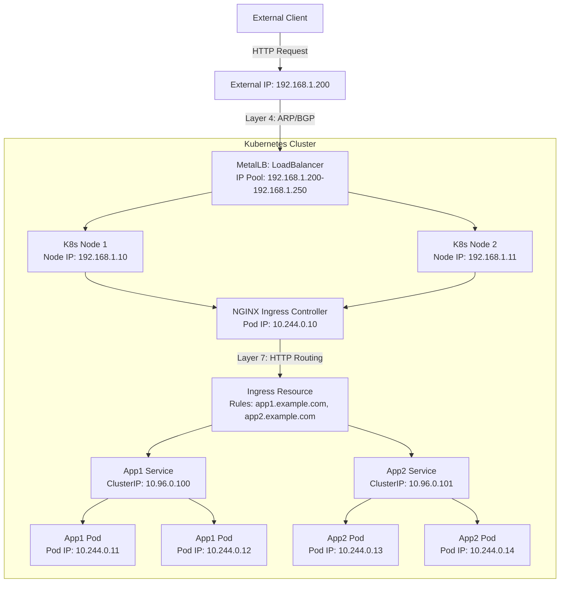
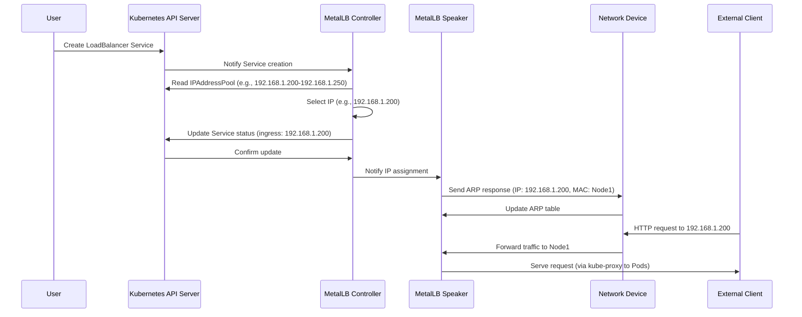
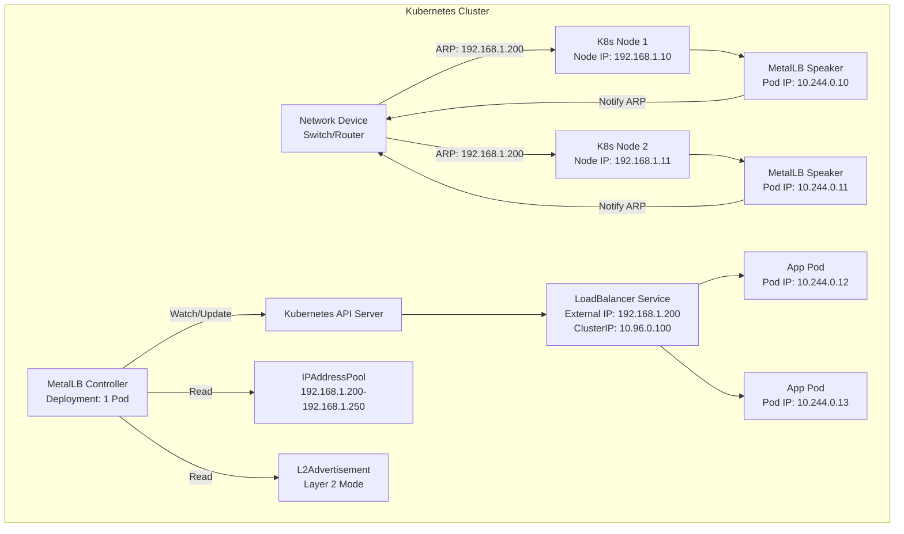
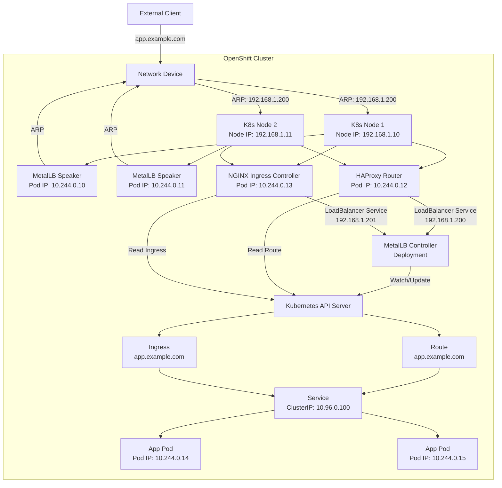

# 不，**MetalLB** 不算是 **Ingress Controller**，它们是 Kubernetes 生态系统中用于解决不同问题的两种不同工具。以下是详细的解释：

### 1. **MetalLB 的作用**
- **MetalLB** 是一个 **网络负载均衡器（Network Load Balancer）**，主要用于在**裸金属（bare-metal）** Kubernetes 集群中实现 **LoadBalancer 类型的 Service**。
- 在云环境中，Kubernetes 可以通过云提供商的负载均衡器（例如 AWS ELB、GCP Network Load Balancer）自动分配外部 IP 并处理流量分发。但在裸金属环境中，没有这样的原生支持，MetalLB 填补了这一空白。
- MetalLB 通过在集群中分配外部 IP 地址并使用 **Layer 2（ARP）** 或 **Layer 3（BGP）** 协议，将外部流量路由到 Kubernetes Service。它本质上是一个 **Layer 4（IP + 端口）** 的负载均衡解决方案。
- MetalLB 通常用于为 Service（如 ingress-nginx 的 Service）提供外部 IP 地址，使其可以被外部访问。[](https://metallb.universe.tf/usage/)

### 2. **Ingress Controller 的作用**
- **Ingress Controller** 是一个运行在 Kubernetes 集群中的组件，负责处理 **Ingress 资源** 定义的 HTTP/HTTPS 流量路由规则。它是 **Layer 7（应用层）** 的负载均衡解决方案。
- Ingress Controller（如 NGINX Ingress Controller、Traefik、Contour 等）根据 Ingress 资源的配置（例如主机名、路径）将外部 HTTP 请求路由到集群内的特定 Service。
- Ingress Controller 通常需要一个外部 IP 地址来接收流量，而这个 IP 地址在裸金属环境中可以通过 MetalLB 提供。[](https://adrin-mukherjee.medium.com/demystifying-kubernetes-ingress-b725f9f52ebc)

### 3. **MetalLB 和 Ingress Controller 的关系**
- **MetalLB 和 Ingress Controller 是互补的**，而不是替代关系。
- 在裸金属环境中，Ingress Controller 的 Service（通常是 LoadBalancer 类型）需要一个外部 IP 地址来接收流量。MetalLB 负责为这个 Service 分配一个外部 IP，并通过 Layer 2 或 BGP 将流量引导到集群节点。
- 简单来说：
    - MetalLB 提供 **外部 IP 和基础流量分发**（Layer 4）。
    - Ingress Controller 提供 **基于 HTTP 的高级路由**（Layer 7），如基于主机名或路径的路由、TLS 终止等。[](https://superuser.com/questions/1522616/metallb-vs-nginx-ingress-in-kubernetes)

### 4. **实际部署中的协作**
- 典型的裸金属集群部署流程：
    1. 安装 MetalLB，并配置 IP 地址池（IPAddressPool），为 LoadBalancer 类型的 Service 分配外部 IP。[](https://kubernetes.github.io/ingress-nginx/deploy/baremetal/)
    2. 部署一个 Ingress Controller（如 NGINX Ingress Controller），其 Service 配置为 LoadBalancer 类型，MetalLB 会为这个 Service 分配一个外部 IP。
    3. 创建 Ingress 资源，定义基于主机名或路径的路由规则，Ingress Controller 根据这些规则将流量转发到后端的 Service。[](https://medium.com/%40DhaneshMalviya/ingress-with-metallb-loadbalancer-on-local-4-node-kubernetes-cluster-a0445357048)
- 示例：你部署了一个 NGINX Ingress Controller，MetalLB 为其 Service 分配了一个 IP（例如 192.168.1.200）。外部请求到达这个 IP，NGINX Ingress Controller 再根据 Ingress 规则将请求路由到对应的后端应用（如 `app1.example.com` 或 `app2.example.com`）。[](https://www.adaltas.com/en/2022/09/08/kubernetes-metallb-nginx/)

### 5. **为什么 MetalLB 不是 Ingress Controller**
- **功能差异**：
    - MetalLB 只关心 IP 地址分配和基础的流量分发，不处理 HTTP 协议或基于内容的路由。
    - Ingress Controller 专注于 HTTP/HTTPS 流量的高级路由、TLS 终止、负载均衡策略等。
- **协议层差异**：
    - MetalLB 工作在 **网络层（Layer 4）**，处理 IP 和端口级别的流量。
    - Ingress Controller 工作在 **应用层（Layer 7）**，处理 HTTP 请求的路由逻辑。[](https://stackoverflow.com/questions/57031505/metallb-with-nginx-ingress-controller-on-minkube-keeps-resetting-external-ip-for)
- **使用场景差异**：
    - 如果你只需要一个简单的 LoadBalancer 来暴露非 HTTP 服务（如 MySQL、SMTP），MetalLB 就足够了。
    - 如果你需要基于主机名、路径的 HTTP 路由，或需要 TLS 终止，则需要 Ingress Controller。[](https://www.reddit.com/r/kubernetes/comments/1bvv38y/home_lab_metallb_is_working_so_do_i_need_ingress/)

### 6. **是否必须一起使用？**
- 不一定。如果你的服务只需要简单的 LoadBalancer 暴露（如非 HTTP 协议的服务），可以只用 MetalLB 而无需 Ingress Controller。
- 但如果你需要处理 HTTP 流量并进行复杂路由（例如多域名、路径分发），通常会结合 MetalLB 和 Ingress Controller 使用。[](https://www.reddit.com/r/kubernetes/comments/1aymfxo/why_to_use_metallb_if_i_can_use_haproxy_in_front/)

---

你说得对，感谢你的反馈！我在之前的 Mermaid 部署图中没有详细说明 IP 地址的分配细节，而且 Service 确实是 Kubernetes 的逻辑资源，通常与节点（Node）关联，但不直接“运行”在节点上，而是通过 kube-proxy 在节点上代理流量到 Pod。为了更清晰地展示 MetalLB 和 Ingress Controller 的协作，并加入示例 IP 地址，我将更新部署图，修正 Service 的表示方式，并确保逻辑更准确。

### 修改说明
1. **添加 IP 地址说明**：
    - 为 MetalLB 分配的外部 IP 提供示例（如 `192.168.1.200`）。
    - 为 Service 和 Pod 添加内部 ClusterIP 和 Pod IP 的示例（如 `10.96.0.x` 范围的 ClusterIP 和 `10.244.0.x` 范围的 Pod IP）。
    - 说明 MetalLB 如何通过 ARP/BGP 将外部 IP 映射到节点。
2. **修正 Service 表示**：
    - Service 是 Kubernetes 的逻辑抽象，不直接运行在节点上，而是通过 kube-proxy 代理流量到 Pod。
    - 在图中将 Service 表示为集群范围的资源，与 Ingress Controller 和 Pod 关联，而不是直接放在某个节点内。
3. **优化图表结构**：
    - 更明确地展示 MetalLB、Ingress Controller、Service 和 Pod 之间的流量流向。
    - 标注 Layer 4 和 Layer 7 的处理阶段。

以下是更新后的 Mermaid 部署图，包含示例 IP 地址和修正后的 Service 表示。



### 图表更新内容
1. **IP 地址说明**：
    - **外部 IP**：`192.168.1.200`，由 MetalLB 从 IP 池（示例：`192.168.1.200-192.168.1.250`）分配，用于 Ingress Controller 的 LoadBalancer Service。
    - **节点 IP**：示例为 `192.168.1.10` 和 `192.168.1.11`，表示集群节点的物理/虚拟网络接口 IP。
    - **Pod IP**：示例为 `10.244.0.10`（Ingress Controller Pod）、`10.244.0.11-10.244.0.14`（后端应用 Pod），基于 Kubernetes 默认的 Pod 网络（如 Flannel/Calico 的 CNI 网络）。
    - **ClusterIP**：示例为 `10.96.0.100` 和 `10.96.0.101`，表示 Service 的虚拟 IP，用于集群内部通信。
2. **Service 表示**：
    - Service（App1 Service 和 App2 Service）不再直接放在节点内，而是作为集群范围的逻辑资源，连接到后端 Pod。
    - 流量通过 kube-proxy（未显式画出，但隐含在 Service 到 Pod 的箭头中）从 Service 转发到 Pod。
3. **流量流向**：
    - 外部客户端请求到达 `192.168.1.200`。
    - MetalLB 使用 ARP（Layer 2）或 BGP（Layer 3）将流量路由到节点（`192.168.1.10` 或 `192.168.1.11`）。
    - 流量到达 Ingress Controller 的 Pod（`10.244.0.10`）。
    - Ingress Controller 根据 Ingress 规则将请求转发到 Service（`10.96.0.100` 或 `10.96.0.101`）。
    - Service 再通过 kube-proxy 转发到后端 Pod（`10.244.0.11-10.244.0.14`）。

### IP 地址分配逻辑
- **MetalLB 的 IP 池**：配置为 `192.168.1.200-192.168.1.250`，通常与集群所在网络的子网一致。MetalLB 通过 `IPAddressPool` 和 `L2Advertisement` 或 `BGPPeer` 分配这些 IP。
- **ClusterIP**：Kubernetes 内部的虚拟 IP，由 Service 使用，默认在 `10.96.0.0/12` 范围内（可通过 kube-apiserver 配置调整）。
- **Pod IP**：由 CNI 插件（如 Flannel、Calico）分配，通常在 `10.244.0.0/16` 范围内（具体范围取决于 CNI 配置）。
- **节点 IP**：裸金属服务器或虚拟机的网络接口 IP，通常由数据中心的网络分配（如 `192.168.1.0/24`）。

### 使用方法
- 将上述 Mermaid 代码粘贴到支持 Mermaid 的工具（如 Mermaid Live Editor 或 GitHub Markdown）中即可渲染图形。
- IP 地址仅为示例，实际使用时需要根据你的网络环境配置（例如，MetalLB 的 IP 池需要与你的子网匹配）。

### 补充说明
- **Service 的运行**：Service 本身不是“运行”的实体，它是 Kubernetes API 中的一种资源，由 kube-apiserver 管理和存储。实际的流量转发由每个节点上的 kube-proxy 实现，kube-proxy 通过 iptables 或 IPVS 规则将 Service 的 ClusterIP 流量转发到后端 Pod。
- **MetalLB 的角色**：MetalLB 只为 LoadBalancer 类型的 Service（如 Ingress Controller 的 Service）分配外部 IP，并通过 ARP 或 BGP 确保外部流量可以到达集群节点。

如果你需要进一步调整图表（例如添加更多 IP 地址、指定其他 CNI 网络、或展示特定的 Ingress 规则），或者需要 MetalLB/Ingress Controller 的 YAML 配置示例，请告诉我！

---

# MetalLB 是一个为裸金属 Kubernetes 集群提供 LoadBalancer 功能的工具，它通过分配外部 IP（External IP）并利用 Layer 2（ARP）或 Layer 3（BGP）协议将流量路由到集群。本回答将详细解释 **MetalLB 如何为 Kubernetes 集群分配 External IP**，以及 **MetalLB 自身的实现机制是否基于 Controller 模式**。

---

### 一、MetalLB 如何为 Kubernetes 集群分配 External IP

MetalLB 的核心功能是为 `LoadBalancer` 类型的 Kubernetes Service 分配一个外部 IP 地址，并确保外部流量可以通过这个 IP 到达集群内的正确 Service。以下是 MetalLB 分配 External IP 的详细流程：

#### 1. **配置 IP 地址池**
- MetalLB 需要用户通过 `IPAddressPool` 自定义资源（CRD）定义一个或多个 IP 地址池。这些地址池是 MetalLB 可以分配的外部 IP 范围。
- 示例 `IPAddressPool` 配置：
  ```yaml
  apiVersion: metallb.io/v1beta1
  kind: IPAddressPool
  metadata:
    name: default-pool
    namespace: metallb-system
  spec:
    addresses:
    - 192.168.1.200-192.168.1.250
  ```
    - `addresses` 字段指定了可用的 IP 范围（如 `192.168.1.200` 到 `192.168.1.250`）或单个 IP（`192.168.1.200/32`）。
    - 这些 IP 必须与集群所在网络的子网兼容，确保外部路由器可以访问。

#### 2. **监控 LoadBalancer 类型的 Service**
- MetalLB 通过其 **Controller 组件**（稍后详述）监控 Kubernetes 集群中的 Service 资源。
- 当用户创建一个 `spec.type: LoadBalancer` 的 Service 时，MetalLB 会检测到该 Service，并从配置的 `IPAddressPool` 中选择一个未使用的 IP 地址。
- 如果 Service 的 `spec.loadBalancerIP` 字段指定了一个特定 IP，MetalLB 会尝试分配该 IP（前提是该 IP 在地址池内且未被占用）。

#### 3. **分配 External IP**
- MetalLB 将选定的 IP 地址写入 Service 的 `status.loadBalancer.ingress` 字段。例如：
  ```yaml
  apiVersion: v1
  kind: Service
  metadata:
    name: example-service
  spec:
    type: LoadBalancer
    ports:
    - port: 80
      targetPort: 8080
    selector:
      app: example
  status:
    loadBalancer:
      ingress:
      - ip: 192.168.1.200
  ```
- 分配的 IP（如 `192.168.1.200`）成为 Service 的 External IP，外部客户端可以通过此 IP 访问 Service。

#### 4. **流量路由**
MetalLB 支持两种模式来将外部流量路由到集群节点，具体取决于配置的协议（Layer 2 或 Layer 3）：

##### **（1）Layer 2 模式（ARP）**
- **机制**：
    - MetalLB 在一个节点上“声明”外部 IP，通过响应 ARP（Address Resolution Protocol）请求，将该 IP 与某个节点的 MAC 地址绑定。
    - 例如，MetalLB 可能选择 `Node 1`（IP: `192.168.1.10`）来响应 `192.168.1.200` 的 ARP 请求，使外部流量到达 `Node 1`。
    - Kubernetes 的 kube-proxy 再通过 Service 的 ClusterIP 和 Pod 网络将流量转发到后端 Pod。
- **实现细节**：
    - MetalLB 的 **Speaker 组件**（运行在每个节点上的 DaemonSet）负责发送 ARP 响应。
    - 只有一个节点（称为“Leader”）会响应 ARP 请求，其他节点保持沉默，以避免 IP 冲突。
    - 如果 Leader 节点故障，MetalLB 会重新选择一个新节点作为 Leader，并更新 ARP 表。
- **特点**：
    - 简单，适用于小型网络。
    - 仅一个节点接收流量，可能成为瓶颈。
    - 不需要额外的网络设备支持。

##### **（2）Layer 3 模式（BGP）**
- **机制**：
    - MetalLB 使用 BGP（Border Gateway Protocol）与外部路由器建立对等关系，通告外部 IP 的路由信息。
    - 例如，MetalLB 可能通告 `192.168.1.200` 可通过某个节点（如 `192.168.1.10`）到达。
    - 外部路由器根据 BGP 路由表将流量转发到相应的节点。
- **实现细节**：
    - MetalLB 的 **Speaker 组件**与配置的 BGP 对等点（`BGPPeer` CRD）通信，发送路由更新。
    - 示例 `BGPPeer` 配置：
      ```yaml
      apiVersion: metallb.io/v1beta1
      kind: BGPPeer
      metadata:
        name: router
        namespace: metallb-system
      spec:
        peerAddress: 192.168.1.1
        peerASN: 64501
        myASN: 64500
      ```
    - 支持多节点负载均衡（通过 ECMP，Equal-Cost Multi-Path），多个节点可以同时接收流量。
- **特点**：
    - 适合大型或复杂网络。
    - 需要网络设备支持 BGP。
    - 提供更高的可扩展性和冗余。

#### 5. **更新与回收**
- **更新**：如果 Service 被删除或修改，MetalLB 会回收分配的 IP 地址并更新路由（ARP 或 BGP）。
- **高可用性**：MetalLB 监控节点健康状态，在节点故障时重新分配 IP 或更新路由，确保服务可用。

---

### 二、MetalLB 自身的实现机制是否基于 Controller

是的，**MetalLB 的核心实现机制基于 Kubernetes 的 Controller 模式**，结合了 Operator 模式和 DaemonSet 组件。MetalLB 由两个主要组件组成：**Controller** 和 **Speaker**，它们协同工作以实现 IP 分配和流量路由。

#### 1. **MetalLB 的组件**
- **Controller**：
    - 运行方式：以单个 Pod 的形式部署在集群中（Deployment）。
    - 功能：
        - 监控 Kubernetes API 中的 Service 资源（特别是 `type: LoadBalancer` 的 Service）。
        - 根据 `IPAddressPool` 和 Service 的需求分配外部 IP。
        - 将分配的 IP 写入 Service 的 `status.loadBalancer.ingress` 字段。
        - 管理 IP 地址的分配状态，处理 IP 回收和冲突。
    - 实现机制：基于 Kubernetes Controller 模式，通过 informer 机制监听 Service 资源的变化，执行 reconcile 循环以确保实际状态与期望状态一致。
- **Speaker**：
    - 运行方式：以 DaemonSet 形式运行在每个 Kubernetes 节点上。
    - 功能：
        - 在 Layer 2 模式下，Speaker 负责发送 ARP 响应，声明外部 IP 的 MAC 地址。
        - 在 Layer 3 模式下，Speaker 与 BGP 对等点通信，通告外部 IP 的路由。
        - 监控节点健康状态，参与 Leader 选举（Layer 2 模式）或路由更新（Layer 3 模式）。
    - 实现机制：Speaker 是一个独立进程，监听 Controller 分配的 IP 和集群状态，通过网络协议（ARP 或 BGP）实现流量路由。

#### 2. **Controller 模式的实现**
MetalLB 的 Controller 组件遵循 Kubernetes 的 **Controller 模式**，其工作原理如下：
- **Informer 机制**：
    - Controller 使用 Kubernetes client-go 库的 Informer 监听 Service、IPAddressPool、L2Advertisement、BGPPeer 等资源的创建、更新和删除事件。
    - Informer 提供高效的资源缓存和事件通知，减少对 Kubernetes API Server 的直接查询。
- **Reconcile 循环**：
    - 对于每个 Service 资源，Controller 执行 reconcile 循环，比较资源的期望状态（desired state，例如需要一个 External IP）和实际状态（current state，例如是否已分配 IP）。
    - 如果需要分配 IP，Controller 从 `IPAddressPool` 中选择一个可用 IP，并更新 Service 的 `status` 字段。
    - 如果 Service 被删除，Controller 回收 IP 并通知 Speaker 更新路由。
- **CRD 和 Operator 模式**：
    - MetalLB 使用自定义资源（如 `IPAddressPool`、`BGPPeer`）来配置行为，这类似于 Kubernetes Operator 模式。
    - Controller 作为 Operator，管理这些 CRD 的生命周期，确保 IP 分配和路由配置与用户定义的 spec 一致。

#### 3. **Speaker 的辅助角色**
- Speaker 虽然不直接实现 Controller 逻辑，但与 Controller 紧密协作：
    - Controller 决定“哪个 Service 使用哪个 IP”。
    - Speaker 负责“如何让外部网络知道这个 IP 可达”。
- 在 Layer 2 模式下，Speaker 之间通过 Leader 选举（基于 Kubernetes 的 lease 机制）决定哪个节点响应 ARP 请求。
- 在 Layer 3 模式下，每个 Speaker 独立与 BGP 对等点通信，通告自己负责的 IP 路由。

#### 4. **技术细节**
- **代码实现**：
    - MetalLB 使用 Go 语言开发，基于 Kubernetes client-go 库实现 Controller 和 Speaker。
    - Controller 使用 workqueue 管理 reconcile 任务，确保高并发和可靠性。
- **高可用性**：
    - Controller 是单点运行，但通过 Kubernetes 的 Deployment 保证重启或故障恢复。
    - Speaker 运行在每个节点上，天然具备分布式高可用性。
- **CRD 管理**：
    - MetalLB 定义了多个 CRD（如 `IPAddressPool`、`L2Advertisement`、`BGPPeer`），通过 Controller 动态管理这些资源的生命周期。

---

### 三、总结

#### **MetalLB 如何分配 External IP**
1. 用户通过 `IPAddressPool` 配置 IP 地址池。
2. Controller 监控 `LoadBalancer` 类型的 Service，从地址池中分配 IP。
3. Controller 更新 Service 的 `status.loadBalancer.ingress` 字段。
4. Speaker 使用 Layer 2（ARP）或 Layer 3（BGP）协议将外部 IP 路由到集群节点。
5. 外部流量通过分配的 IP 到达节点，kube-proxy 再将流量转发到后端 Pod。

#### **MetalLB 是否基于 Controller**
- 是的，MetalLB 的核心逻辑基于 Kubernetes Controller 模式：
    - **Controller 组件**负责 IP 分配和 Service 状态管理，使用 reconcile 循环和 Informer 机制。
    - **Speaker 组件**辅助实现流量路由，运行在每个节点上，处理 ARP 或 BGP 协议。
- MetalLB 结合了 Controller 和 Operator 模式，通过 CRD 提供灵活的配置能力。

#### **附加说明**
- **Layer 2 vs Layer 3**：
    - Layer 2（ARP）适合简单网络，但流量集中在单节点。
    - Layer 3（BGP）适合复杂网络，支持多节点负载均衡，但需要 BGP 路由器支持。
- **实际配置**：
    - 确保 `IPAddressPool` 的 IP 范围与网络环境兼容。
    - 根据网络规模选择 Layer 2 或 Layer 3 模式（小型集群用 Layer 2，大型集群用 Layer 3）。

如果你需要更具体的 MetalLB 配置示例（例如 YAML 文件）、Layer 2/BGP 的详细调试步骤，或者对 Controller 实现的代码级分析，请告诉我，我可以进一步深入！

---

我将为你提供两个 Mermaid 图表：

1. **时序图**：展示 MetalLB 为 Kubernetes 集群中的 LoadBalancer 类型 Service 分配 External IP 的详细过程，涵盖从 Service 创建到流量路由的交互。
2. **部署图**：展示 MetalLB 的 Controller 和 Speaker 组件在 Kubernetes 集群中的结构，以及它们与 Kubernetes 核心组件和网络的关系。

我还会分别解释每个图表的内容和逻辑，确保清晰地说明 MetalLB 的工作机制和部署架构。

---

### 一、Mermaid 时序图：MetalLB 分配 External IP 的过程

#### 时序图说明
这个时序图展示了当用户创建一个 `LoadBalancer` 类型的 Service 时，MetalLB 如何分配 External IP 并完成流量路由的过程。主要参与者包括：
- **用户**：通过 kubectl 创建 Service。
- **Kubernetes API Server**：管理 Service 资源和 CRD。
- **MetalLB Controller**：监控 Service 并分配 IP。
- **MetalLB Speaker**：处理 ARP/BGP 路由。
- **外部客户端**：发起请求以验证服务可达性。
- **网络设备**：在 Layer 2（ARP）或 Layer 3（BGP）模式下处理流量路由。

时序图将以 Layer 2（ARP）模式为例，BGP 模式流程类似但涉及路由器对等点。



#### 时序图流程解释
1. **用户创建 Service**：
    - 用户通过 `kubectl` 创建一个 `type: LoadBalancer` 的 Service（例如 `example-service`）。
    - Service 的 `spec` 定义了端口映射和选择器，但未指定 `loadBalancerIP`（由 MetalLB 自动分配）。
2. **Kubernetes API Server 通知**：
    - API Server 检测到新的 Service 资源，通过 Informer 机制通知 MetalLB Controller。
3. **Controller 分配 IP**：
    - Controller 读取 `IPAddressPool` CRD，获取可用 IP 范围（例如 `192.168.1.200-192.168.1.250`）。
    - Controller 选择一个未使用的 IP（例如 `192.168.1.200`）。
    - Controller 更新 Service 的 `status.loadBalancer.ingress` 字段，写入分配的 IP。
4. **Speaker 路由 IP**：
    - Controller 通知 Speaker（运行在各节点上的 DaemonSet）关于新的 IP 分配。
    - 在 Layer 2 模式下，Speaker 在某个节点（例如 Node1）上发送 ARP 响应，声明 `192.168.1.200` 与 Node1 的 MAC 地址绑定。
    - 网络设备（交换机或路由器）更新 ARP 表，将 `192.168.1.200` 的流量导向 Node1。
5. **客户端访问**：
    - 外部客户端发送 HTTP 请求到 `192.168.1.200`。
    - 网络设备根据 ARP 表将流量转发到 Node1。
    - Node1 上的 kube-proxy 进一步将流量转发到 Service 后端的 Pod。

#### 备注
- **Layer 3（BGP）模式**：如果使用 BGP，Speaker 会与外部路由器建立 BGP 对等关系，通告 `192.168.1.200` 的路由，而不是发送 ARP 响应。
- **高可用性**：如果 Node1 故障，Speaker 会重新选举 Leader 节点并更新 ARP/BGP 路由。
- **时间维度**：整个过程通常在几秒内完成，具体取决于网络延迟和 Kubernetes API 的响应速度。

---

### 二、Mermaid 部署图：MetalLB Controller 在 Kubernetes 集群中的结构

#### 部署图说明
这个部署图展示了 MetalLB 的 Controller 和 Speaker 组件在 Kubernetes 集群中的部署架构，以及它们与 Kubernetes 核心组件（API Server、Nodes、Services）和网络的交互。主要元素包括：
- **Kubernetes 集群**：包含节点、API Server 和 MetalLB 组件。
- **MetalLB Controller**：以 Deployment 形式运行，管理 IP 分配。
- **MetalLB Speaker**：以 DaemonSet 形式运行在每个节点上，处理流量路由。
- **IPAddressPool 和 L2Advertisement**：CRD 资源，定义 IP 分配和路由策略。
- **Network Device**：表示外部网络设备（如交换机或 BGP 路由器）。

部署图以 Layer 2（ARP）模式为例，BGP 模式会额外涉及 `BGPPeer` CRD 和外部路由器。



#### 部署图结构解释
1. **Kubernetes 集群**：
    - 包含两个节点（Node1: `192.168.1.10`，Node2: `192.168.1.11`），代表裸金属服务器或虚拟机。
    - **Kubernetes API Server** 管理所有资源（Service、CRD、Pod 等）。
2. **MetalLB Controller**：
    - 部署为 **Deployment**，运行单个 Pod，负责 IP 分配。
    - 通过 Informer 机制与 **API Server** 交互，监控 `LoadBalancer` 类型的 Service。
    - 读取 `IPAddressPool`（IP 池：`192.168.1.200-192.168.1.250`）和 `L2Advertisement`（定义 Layer 2 模式）。
    - 更新 Service 的 `status.loadBalancer.ingress` 字段（例如分配 `192.168.1.200`）。
3. **MetalLB Speaker**：
    - 部署为 **DaemonSet**，在每个节点上运行一个 Pod（Speaker1: `10.244.0.10`，Speaker2: `10.244.0.11`）。
    - 在 Layer 2 模式下，Speaker 发送 ARP 响应，将 External IP（`192.168.1.200`）绑定到某个节点的 MAC 地址。
    - 与外部 **Network Device**（交换机或路由器）交互，更新 ARP 表。
4. **Service 和 Pod**：
    - **LoadBalancer Service**（External IP: `192.168.1.200`，ClusterIP: `10.96.0.100`）由 MetalLB 分配 IP。
    - Service 连接到后端 Pod（Pod1: `10.244.0.12`，Pod2: `10.244.0.13`），通过 kube-proxy 转发流量。
5. **外部网络**：
    - **Network Device** 接收 Speaker 的 ARP 响应，将 `192.168.1.200` 的流量路由到选定的节点（例如 Node1）。

#### IP 地址说明
- **External IP**：`192.168.1.200`，由 MetalLB 从 IPAddressPool 分配。
- **Node IP**：`192.168.1.10` 和 `192.168.1.11`，集群节点的网络接口 IP。
- **Pod IP**：`10.244.0.10-10.244.0.13`，由 CNI 插件（如 Flannel）分配。
- **ClusterIP**：`10.96.0.100`，Service 的虚拟 IP，用于集群内部通信。

#### 备注
- **BGP 模式**：如果使用 Layer 3（BGP），图中会额外包含 `BGPPeer` CRD，Speaker 与外部 BGP 路由器通信，通告路由信息。
- **高可用性**：
    - Controller 通过 Deployment 自动重启。
    - Speaker 通过 DaemonSet 确保每个节点都有实例，Layer 2 模式下通过 Leader 选举避免冲突。
- **依赖**：
    - MetalLB 依赖 Kubernetes 的 CRD 机制（`IPAddressPool`、`L2Advertisement`）。
    - Speaker 依赖节点的网络堆栈（ARP 或 BGP 协议支持）。

---

### 三、总结

#### 时序图
- 展示了 MetalLB 分配 External IP 的动态过程，从 Service 创建到流量到达 Pod。
- 突出 Controller（IP 分配）和 Speaker（流量路由）的协作。
- 以 Layer 2（ARP）为例，BGP 模式流程类似但涉及路由器。

#### 部署图
- 展示了 MetalLB 的 Controller（Deployment）和 Speaker（DaemonSet）在集群中的静态结构。
- 清晰表示与 Kubernetes API Server、CRD（IPAddressPool、L2Advertisement）、Service 和网络设备的交互。
- 包含示例 IP 地址（External IP、Node IP、Pod IP、ClusterIP）。

#### 使用方法
- **时序图**：粘贴到 Mermaid 支持的工具（如 Mermaid Live Editor）以查看交互流程。
- **部署图**：同样粘贴到 Mermaid 工具以查看集群架构。
- 如果需要调整（如切换到 BGP 模式、添加更多节点、或指定其他 IP 范围），请提供细节，我可以进一步优化。

#### 附加说明
- **MetalLB 的 Controller 机制**：基于 Kubernetes Controller 模式，使用 Informer 和 reconcile 循环管理 Service 和 CRD。
- **实际部署**：
    - 确保 `IPAddressPool` 的 IP 范围与网络子网兼容。
    - 配置 `L2Advertisement` 或 `BGPPeer` 以选择 Layer 2 或 Layer 3 模式。
- 如果你需要 MetalLB 的 YAML 配置示例（例如 `IPAddressPool` 或 `Service` 定义），或对某个步骤有更深入的分析，请告诉我！

---

### 是否可以独立运行于 Kubernetes 集群外部？

**MetalLB 本身的设计和实现使其无法完全独立运行于 Kubernetes 集群外部**，原因如下：

1. **依赖 Kubernetes API 和 CRD**：
    - MetalLB 的 **Controller** 组件需要通过 Kubernetes API Server 监控 `Service` 资源（特别是 `type: LoadBalancer` 的 Service）以及 MetalLB 的自定义资源（如 `IPAddressPool`、`L2Advertisement`、`BGPPeer`）。
    - Controller 使用 Kubernetes 的 Informer 机制和 reconcile 循环来管理 IP 分配，这要求它与 Kubernetes API Server 保持实时通信。
    - 如果运行在集群外部，Controller 需要以某种方式访问 Kubernetes API，但这会引入额外的复杂性和安全挑战。

2. **Speaker 组件的节点依赖**：
    - MetalLB 的 **Speaker** 组件以 DaemonSet 形式运行在 Kubernetes 节点上，负责处理 ARP（Layer 2）或 BGP（Layer 3）协议的流量路由。
    - Speaker 需要直接访问节点的网络堆栈（例如发送 ARP 响应或与 BGP 路由器通信），这要求它运行在 Kubernetes 节点上以获取节点的 MAC 地址或网络接口信息。
    - 在集群外部运行 Speaker 会导致无法直接与节点网络交互，破坏流量路由功能。

3. **与 Kubernetes 网络集成**：
    - MetalLB 依赖 Kubernetes 的 Service 和 Pod 网络（通过 CNI 插件如 Flannel 或 Calico）将流量从 External IP 转发到后端 Pod。
    - 这种集成要求 MetalLB 组件运行在集群内部，以便与 kube-proxy 和 CNI 网络无缝协作。

4. **设计目标**：
    - MetalLB 的设计目标是为裸金属 Kubernetes 集群提供 LoadBalancer 功能，紧密集成于 Kubernetes 生态系统。
    - 它不是一个通用的负载均衡器（如 HAProxy 或 Nginx），而是专门为 Kubernetes Service 定制的解决方案。

**结论**：MetalLB 无法以独立于 Kubernetes 集群的方式运行。它的 Controller 和 Speaker 组件需要部署在集群内部，依赖 Kubernetes API、CRD 和节点网络环境。

---

### 如果尝试在外部运行，通信方式和挑战

虽然 MetalLB 不支持完全独立运行，但可以探讨一种理论场景：将部分功能（例如 Controller 或 Speaker 的类似逻辑）运行在集群外部，并通过某种方式与 Kubernetes 集群通信。以下是可能的通信方式和面临的挑战：

#### 1. **通信方式**
要让外部运行的 MetalLB 组件与 Kubernetes 集群交互，需要以下机制：

- **Kubernetes API 访问**：
    - 外部的 Controller 可以通过 Kubernetes API Server 的 RESTful 接口与集群通信。
    - 需要为外部组件配置服务账户（ServiceAccount）、RBAC 权限和 kubeconfig 文件，以认证和授权对 `Service` 资源和 MetalLB CRD 的读写操作。
    - 示例 kubeconfig：
      ```yaml
      apiVersion: v1
      clusters:
      - cluster:
          server: https://<k8s-api-server>:6443
          certificate-authority-data: <ca-data>
        name: k8s-cluster
      contexts:
      - context:
          cluster: k8s-cluster
          user: metallb-controller
        name: metallb-context
      current-context: metallb-context
      users:
      - name: metallb-controller
        user:
          token: <service-account-token>
      ```
    - Controller 使用 client-go 库通过 HTTPS 与 API Server 通信，监控 Service 和 CRD 的变化。

- **gRPC 或自定义协议**：
    - 如果 Speaker 的功能被提取到外部，Speaker 需要与 Controller 通信以接收 IP 分配信息。
    - 可以使用 gRPC 或自定义协议在外部 Speaker 和集群内的 Controller 之间传递数据（例如 IP 分配状态或路由更新）。
    - 这种通信需要额外的网络配置（如 VPN 或专用网络）以确保安全和低延迟。

- **网络层通信**：
    - 外部 Speaker 需要通过 ARP 或 BGP 将流量路由到 Kubernetes 节点。
    - 可以通过配置外部服务器的网络接口，模拟节点行为（例如发送 ARP 响应或与 BGP 路由器建立对等关系）。
    - 需要确保外部服务器与 Kubernetes 节点的网络在同一子网（Layer 2）或通过路由器可达（Layer 3）。

#### 2. **实现步骤（理论）**
假设尝试将 MetalLB 的 Controller 和 Speaker 运行在外部，以下是大致步骤：

1. **外部 Controller**：
    - 部署 Controller 在 Kubernetes 集群外部的服务器上。
    - 配置 kubeconfig 和 RBAC 权限，允许 Controller 访问 Kubernetes API。
    - Controller 继续监控 `Service` 和 `IPAddressPool`，分配 External IP 并更新 Service 的 `status.loadBalancer.ingress`。
    - 通过 gRPC 或其他协议将分配的 IP 信息发送到外部 Speaker。

2. **外部 Speaker**：
    - 部署 Speaker 在外部服务器上，配置其网络接口以发送 ARP 响应或 BGP 路由通告。
    - Speaker 接收 Controller 的 IP 分配信息，模拟 Kubernetes 节点的网络行为。
    - 需要手动映射 External IP 到 Kubernetes 节点的 IP（例如通过静态路由或隧道）。

3. **流量路由**：
    - 外部 Speaker 将 External IP 的流量路由到 Kubernetes 节点的 IP（例如 `192.168.1.10`）。
    - 集群内的 kube-proxy 负责将流量从 Service 的 ClusterIP 转发到后端 Pod。

#### 3. **面临的挑战**
将 MetalLB 运行在 Kubernetes 集群外部会遇到以下重大挑战：

- **API 通信的复杂性**：
    - 外部 Controller 需要稳定的网络连接到 Kubernetes API Server，可能受防火墙、NAT 或网络延迟影响。
    - RBAC 配置和安全管理（例如证书轮换、Token 更新）增加了运维负担。

- **Speaker 的网络限制**：
    - 在 Layer 2 模式下，Speaker 必须与 Kubernetes 节点在同一子网以发送 ARP 响应，这在外部服务器上难以实现。
    - 在 Layer 3 模式下，外部 Speaker 可以与 BGP 路由器通信，但需要额外的网络配置（如 GRE 隧道或 VXLAN）将流量转发到集群节点。

- **与 CNI 网络的集成**：
    - MetalLB 依赖 Kubernetes 的 CNI 网络（如 Flannel、Calico）将流量从节点转发到 Pod。
    - 外部运行的 Speaker 无法直接与 CNI 网络交互，需要额外的代理或隧道机制。

- **高可用性和一致性**：
    - 集群内的 MetalLB 使用 Kubernetes 的调度和健康检查机制（如 Deployment 和 DaemonSet）保证高可用性。
    - 外部组件需要自行实现类似的高可用性和故障恢复机制，增加了开发和维护成本。

- **性能开销**：
    - 外部通信引入额外的网络延迟，可能影响 IP 分配和路由更新的实时性。
    - 外部 Speaker 处理流量的效率可能低于集群内直接运行的 DaemonSet。

- **代码修改**：
    - MetalLB 的现有代码假设运行在 Kubernetes 内部，外部运行需要重写部分逻辑（例如 Speaker 的节点发现和网络接口管理）。
    - 这可能需要 fork MetalLB 项目并进行大量定制开发。

#### 4. **替代方案**
与其尝试将 MetalLB 运行在集群外部，不如考虑以下更实际的替代方案：

- **在集群内运行 MetalLB**：
    - 按照标准方式部署 MetalLB（Controller 作为 Deployment，Speaker 作为 DaemonSet），这是最简单和推荐的做法。
    - 使用 Layer 2（ARP）或 Layer 3（BGP）模式，根据网络环境配置 `IPAddressPool` 和 `L2Advertisement`/`BGPPeer`。

- **外部负载均衡器**：
    - 如果需要外部负载均衡，可以使用独立的负载均衡器（如 HAProxy、Nginx 或硬件负载均衡器）与 Kubernetes 集群配合。
    - 配置外部负载均衡器将流量转发到 Kubernetes 节点的 NodePort 或 Ingress Controller 的 Service。
    - 示例：HAProxy 配置将流量从 `192.168.1.200` 转发到节点 IP（如 `192.168.1.10:NodePort`）。

- **云提供商的负载均衡器**：
    - 如果未来迁移到云环境，可以使用云提供商的原生 LoadBalancer（例如 AWS ELB、GCP Network Load Balancer），完全替代 MetalLB。

- **Kube-VIP 或其他工具**：
    - Kube-VIP 是一个类似 MetalLB 的工具，提供 Virtual IP 和负载均衡功能，可以运行在集群内或部分外部场景。
    - 与 MetalLB 类似，Kube-VIP 也更适合集群内运行，但可能提供更灵活的外部集成选项。

---

### 总结

1. **MetalLB 是否可以独立运行于 Kubernetes 集群外部？**
    - 不可以。MetalLB 的 Controller 和 Speaker 组件深度依赖 Kubernetes API、CRD 和节点网络环境，设计上必须运行在集群内部。
    - 理论上可以通过外部服务器访问 Kubernetes API 并模拟 Speaker 的网络行为，但实现复杂且不实用。

2. **外部运行的通信方式**：
    - **Controller**：通过 kubeconfig 和 Kubernetes API（HTTPS）与集群通信。
    - **Speaker**：通过 ARP/BGP 协议与网络设备交互，通过 gRPC 或自定义协议与 Controller 通信。
    - 需要额外的网络配置（如子网一致性、隧道或静态路由）。

3. **挑战**：
    - API 通信复杂性、网络限制、CNI 集成、高可用性、性能开销和代码修改需求使得外部运行不可行。
    - 外部运行会丧失 MetalLB 的简单性和集成优势。

4. **推荐方案**：
    - 在 Kubernetes 集群内部署 MetalLB，遵循官方文档配置。
    - 如果需要外部负载均衡，使用 HAProxy、Nginx 或 Kube-VIP 等工具作为补充。

如果你需要 MetalLB 的标准部署 YAML 示例、外部负载均衡器的配置示例，或者对某种替代方案（如 Kube-VIP）有进一步疑问，请告诉我，我可以提供更详细的指导！

---

感谢你的澄清！下面我将回答两个问题：

1. **OpenShift 的 Route 相比 Ingress Controller 的优势是什么？**
2. **Ingress Controller 和 Kubernetes Service 的关系是什么？**

我将结合你之前的背景问题（关于 MetalLB 和 Route），基于功能、架构和使用场景进行详细对比，并提供清晰的结论。答案将尽量简洁，突出重点，同时保留必要的细节。

---

### 一、OpenShift Route 相比 Ingress Controller 的优势

**OpenShift Route** 和 **Ingress Controller** 都是用于管理 HTTP/HTTPS 流量的 Layer 7（应用层）工具，支持基于主机名和路径的路由、TLS 终止等功能。但 Route 是 OpenShift 特有的资源，而 Ingress Controller 是 Kubernetes 的标准组件。以下是 Route 相比 Ingress Controller 的具体优势：

#### 1. **与 OpenShift 生态的深度集成**
- **优势**：
    - Route 专为 OpenShift 设计，与平台的功能（如用户界面、CLI、证书管理）无缝集成。
    - OpenShift 的 Web 控制台和 `oc` 命令行工具提供对 Route 的原生支持，例如通过 UI 直接创建/管理 Route 或查看路由状态。
    - Route 自动与 OpenShift 的服务网格（如 Red Hat Service Mesh）和其他组件（如 OpenShift Monitoring）集成。
- **对比 Ingress Controller**：
    - Ingress Controller 是 Kubernetes 标准，需要额外部署和管理（如 NGINX、Traefik），在 OpenShift 中可能需要手动配置以适配平台特性。
    - Ingress 资源的管理依赖 `kubectl` 或第三方工具，缺乏 OpenShift 的原生 UI 支持。
- **示例**：
    - 在 OpenShift 中，创建 Route（如 `oc expose svc/my-service`）会自动生成 Route 资源并绑定到 HAProxy Router，操作简单。
    - 在纯 Kubernetes 中，需手动部署 Ingress Controller、配置 Ingress 资源，并确保 Service 和 DNS 正确关联。

#### 2. **内置 HAProxy Router 简化部署**
- **优势**：
    - OpenShift 内置 **HAProxy Router**（默认部署），无需用户手动安装或配置 Ingress Controller。
    - HAProxy Router 自动处理 Route 资源，动态更新 HAProxy 配置，支持高可用性和负载均衡。
    - Router 由 OpenShift 集群管理，自动扩展、升级和监控，减少运维负担。
- **对比 Ingress Controller**：
    - Ingress Controller 需要用户选择并部署实现（如 NGINX、Traefik、Contour），涉及 Pod、Service、ConfigMap 等资源的配置。
    - 用户需手动管理 Controller 的高可用性、日志、监控和升级，可能增加复杂性。
- **示例**：
    - Route：创建 Route 后，HAProxy Router 立即生效，无需额外部署。
    - Ingress：需先部署 NGINX Ingress Controller（包括 Deployment、Service、RBAC），然后创建 Ingress 资源。

#### 3. **企业级功能开箱即用**
- **优势**：
    - Route 提供企业级功能，如 **A/B 测试**（基于权重的路由）、**蓝绿部署**、**粘性会话**（session affinity）和细粒度的 TLS 配置。
    - OpenShift 自动为 Route 生成通配符 TLS 证书（通过集群的默认 CA），简化 HTTPS 配置。
    - Route 支持 **路径重写**（path rewriting）和 **流量拆分**，无需额外插件。
- **对比 Ingress Controller**：
    - Ingress Controller 的功能依赖具体实现。例如，NGINX Ingress 支持基本路由和 TLS，但 A/B 测试或路径重写需要额外的 Annotations 或插件。
    - TLS 证书管理通常需要手动配置或集成外部工具（如 cert-manager）。
    - 某些高级功能（如流量拆分）可能需要特定的 Ingress Controller（如 Traefik）或 Service Mesh。
- **示例**：
    - Route 配置 A/B 测试：
      ```yaml
      apiVersion: route.openshift.io/v1
      kind: Route
      metadata:
        name: my-route
      spec:
        host: app.example.com
        to:
          kind: Service
          name: my-service
        alternateBackends:
        - kind: Service
          name: my-service-v2
          weight: 20
        weight: 80
      ```
    - Ingress：NGINX Ingress 需要复杂的 Annotations 或自定义 CRD 实现类似功能。

#### 4. **Ingress 资源自动转换**
- **优势**：
    - OpenShift 的 **Ingress Operator** 监控 Kubernetes Ingress 资源并自动将其转换为 Route，由 HAProxy Router 处理。
    - 这意味着在 OpenShift 中，Route 可以直接支持 Ingress 工作负载，无需单独部署 Ingress Controller，兼容 Kubernetes 标准应用。
- **对比 Ingress Controller**：
    - 在非 OpenShift 的 Kubernetes 集群中，Ingress 资源必须依赖特定的 Ingress Controller 实现。
    - OpenShift 的这种转换机制使 Route 更通用，适合混合使用 Ingress 和 Route 的场景。
- **示例**：
    - 创建 Ingress 资源：
      ```yaml
      apiVersion: networking.k8s.io/v1
      kind: Ingress
      metadata:
        name: my-ingress
      spec:
        rules:
        - host: app.example.com
          http:
            paths:
            - path: /
              pathType: Prefix
              backend:
                service:
                  name: my-service
                  port:
                    number: 8080
      ```
      OpenShift 自动生成对应的 Route，无需额外配置。

#### 5. **更简单的用户体验**
- **优势**：
    - Route 的配置更直观，专为开发者设计，减少对底层网络的依赖。
    - OpenShift 提供 `oc expose` 命令一键生成 Route，自动绑定 Service 和主机名。
    - Route 的错误提示和日志集成到 OpenShift 平台，便于调试。
- **对比 Ingress Controller**：
    - Ingress 配置需要理解 Controller 特定的 Annotations 和行为，不同实现（如 NGINX vs Traefik）可能有差异。
    - 调试 Ingress 问题可能涉及 Controller 日志、Service 配置和 DNS，复杂度较高。
- **示例**：
    - OpenShift：`oc expose svc/my-service --hostname=app.example.com` 即可创建 Route。
    - Kubernetes：需编写 Ingress YAML，配置 Controller 和 DNS，步骤更多。

#### 总结：Route 的优势
- **深度集成 OpenShift 生态**：原生支持 UI、CLI 和平台功能。
- **内置 HAProxy Router**：无需手动部署 Controller，简化运维。
- **企业级功能**：支持 A/B 测试、蓝绿部署、粘性会话等，开箱即用。
- **自动转换 Ingress**：兼容 Kubernetes Ingress 资源，通用性强。
- **用户体验**：配置简单，调试方便，适合开发者。

**局限性**：
- Route 是 OpenShift 专有，缺乏 Kubernetes 的跨平台通用性。
- Ingress Controller 更灵活，支持多种实现（如 NGINX、Traefik），适合非 OpenShift 环境或特定需求（如高性能反向代理）。

---

### 二、Ingress Controller 和 Kubernetes Service 的关系

**Ingress Controller** 和 **Kubernetes Service** 是 Kubernetes 生态中不同层次的组件，协同工作以实现外部流量的访问。以下是它们的关系和交互方式：

#### 1. **功能定位**
- **Service**：
    - 工作在 **Layer 4（传输层）**，提供 TCP/UDP 负载均衡，将流量分发到后端 Pod。
    - Service 定义了一个虚拟 IP（ClusterIP）或外部 IP（如 LoadBalancer 类型），通过 kube-proxy 实现流量转发。
    - 类型包括 `ClusterIP`（集群内部）、`NodePort`（节点端口）、`LoadBalancer`（外部负载均衡）和 `ExternalName`（DNS 别名）。
- **Ingress Controller**：
    - 工作在 **Layer 7（应用层）**，处理 HTTP/HTTPS 流量，根据 Ingress 资源定义的规则（如主机名、路径）路由到特定的 Service。
    - Ingress Controller 是一个运行在集群中的组件（如 NGINX、Traefik），需要通过 Service 暴露以接收外部流量。

#### 2. **架构关系**
- **依赖关系**：
    - Ingress Controller 本身是一个 Kubernetes 应用（通常以 Deployment 或 DaemonSet 形式运行），通过 **Service** 暴露其 Pod。
    - Ingress 资源定义了 HTTP 路由规则，指向后端的 **Service**，由 Ingress Controller 解析和执行。
    - 外部流量首先到达 Ingress Controller 的 Service（通常是 `LoadBalancer` 或 `NodePort` 类型），然后由 Controller 根据 Ingress 规则转发到目标 Service，最后到达 Pod。
- **典型流程**：
    1. 外部客户端请求到达 Ingress Controller 的 Service（例如 `192.168.1.200:80`）。
    2. Ingress Controller 根据 Ingress 规则（例如 `app.example.com`）选择目标 Service（例如 `ClusterIP: 10.96.0.100`）。
    3. 目标 Service 通过 kube-proxy 将流量转发到后端 Pod（例如 `10.244.0.12:8080`）。
- **示例架构**：
  ```plaintext
  Client -> Ingress Controller Service (LoadBalancer: 192.168.1.200)
         -> Ingress Controller Pod (NGINX)
         -> Ingress Rule (app.example.com -> Service)
         -> Target Service (ClusterIP: 10.96.0.100)
         -> Backend Pods (10.244.0.12, 10.244.0.13)
  ```

#### 3. **Service 为 Ingress Controller 提供暴露方式**
- **LoadBalancer 类型**：
    - Ingress Controller 的 Service 通常配置为 `type: LoadBalancer`，在裸金属环境中由 MetalLB 分配外部 IP（例如 `192.168.1.200`）。
    - 例如：
      ```yaml
      apiVersion: v1
      kind: Service
      metadata:
        name: nginx-ingress
      spec:
        type: LoadBalancer
        ports:
        - port: 80
          targetPort: 80
        selector:
          app: nginx-ingress
      ```
- **NodePort 类型**：
    - 如果没有 LoadBalancer 支持，Service 可以使用 `NodePort`，通过节点 IP 和端口（例如 `192.168.1.10:30080`）暴露 Ingress Controller。
- **ClusterIP 类型**：
    - 在某些场景下，Ingress Controller 使用 ClusterIP，结合外部负载均衡器（如 HAProxy）或 DNS 指向。

#### 4. **Ingress 资源连接 Service**
- Ingress 资源通过 `backend.service` 字段指定目标 Service 和端口。例如：
  ```yaml
  apiVersion: networking.k8s.io/v1
  kind: Ingress
  metadata:
    name: my-ingress
  spec:
    rules:
    - host: app.example.com
      http:
        paths:
        - path: /
          pathType: Prefix
          backend:
            service:
              name: my-service
              port:
                number: 8080
  ```
- Ingress Controller 读取此规则，将 `app.example.com` 的请求转发到 `my-service` 的 ClusterIP（例如 `10.96.0.100:8080`）。

#### 5. **总结：Ingress Controller 和 Service 的关系**
- **依赖**：Ingress Controller 依赖 Service 暴露自身（接收外部流量），并通过 Ingress 资源将流量路由到后端 Service。
- **分层**：
    - Service 提供 Layer 4 负载均衡，负责 IP/端口级别的流量分发。
    - Ingress Controller 提供 Layer 7 路由，负责 HTTP 请求的解析和分发。
- **协作**：Service 是 Ingress Controller 的网络入口和后端目标，Ingress Controller 在 Service 之上添加了 HTTP 路由逻辑。
- **裸金属场景**：在裸金属环境中，MetalLB 为 Ingress Controller 的 LoadBalancer Service 分配外部 IP，与 Route 的 HAProxy Router 类似。

---

### 三、Mermaid 图表：关系对比

为直观展示 Route、Ingress Controller 和 Service 的关系，我提供一个 Mermaid 部署图，突出它们在 OpenShift/Kubernetes 集群中的交互。



**图表说明**：
- **Route**：由 HAProxy Router 处理，通过 LoadBalancer Service（借助 MetalLB 分配 IP `192.168.1.200`）接收流量，路由到 Service。
- **Ingress Controller**：以 NGINX 为例，通过自己的 LoadBalancer Service（IP `192.168.1.201`）接收流量，路由到相同的 Service。
- **Service**：作为 Layer 4 负载均衡器，连接 Route 和 Ingress Controller 到后端 Pod。
- **MetalLB**：为 Route 和 Ingress Controller 的 Service 提供外部 IP。

---

### 四、最终结论

1. **Route 相比 Ingress Controller 的优势**：
    - **OpenShift 生态集成**：与 UI、CLI 和平台功能无缝衔接。
    - **内置 Router**：无需手动部署，简化运维。
    - **企业级功能**：支持 A/B 测试、蓝绿部署、粘性会话等。
    - **Ingress 转换**：自动支持 Kubernetes Ingress 资源，兼容性强。
    - **用户体验**：配置简单，调试方便。
    - **适用场景**：OpenShift 环境，优先选择 Route；非 OpenShift 环境，Ingress Controller 更通用。

2. **Ingress Controller 和 Service 的关系**：
    - **依赖关系**：Ingress Controller 通过 Service（通常 LoadBalancer 或 NodePort）暴露自身，接收外部流量；Ingress 资源将流量路由到后端 Service。
    - **功能分层**：Service 提供 Layer 4 负载均衡，Ingress Controller 提供 Layer 7 HTTP 路由。
    - **协作**：Service 是 Ingress Controller 的网络入口和后端目标，共同实现从外部请求到 Pod 的流量路径。
    - **裸金属场景**：MetalLB 为 Ingress Controller 的 LoadBalancer Service 分配外部 IP，与 Route 的 HAProxy Router 类似。

---

### 五、补充说明

- **与 MetalLB 的关联**：
    - Route 和 Ingress Controller 都可能依赖 MetalLB（在裸金属环境中）为它们的 LoadBalancer Service 分配外部 IP。
    - MetalLB 是底层的 Layer 4 支持，与 Route 和 Ingress Controller 的 Layer 7 功能相比，作用更通用。

- **OpenShift 的特殊性**：
    - OpenShift 的 Ingress Operator 使 Route 和 Ingress Controller 在功能上高度重叠，Route 因内置性和企业级功能更具优势。
    - 如果你的集群是 OpenShift，Route 是首选；如果需要跨平台兼容性，Ingress Controller 更适合。

如果你需要具体的 YAML 配置示例（例如 Route、Ingress 或 Service）、更详细的 OpenShift 部署步骤，或对某个功能（如 A/B 测试）的深入分析，请告诉我，我可以进一步定制答案！