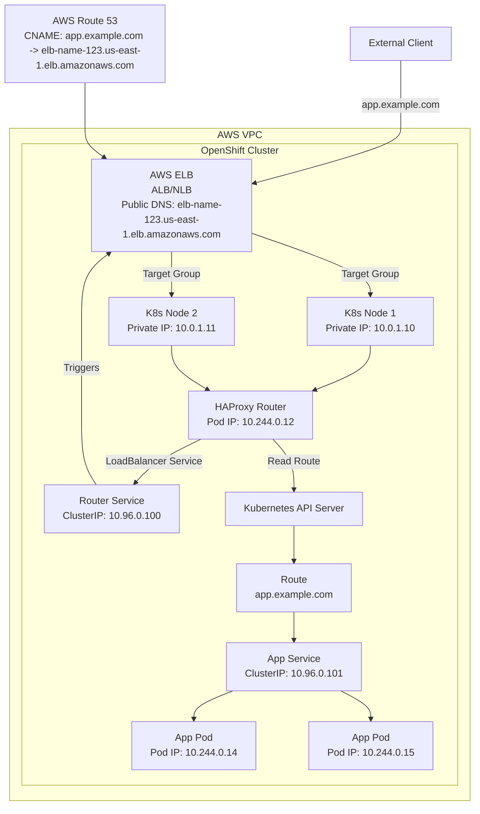
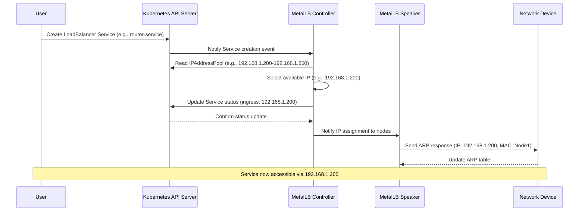
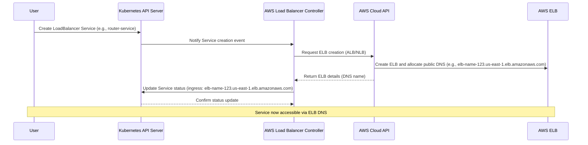

# 为了回答 **在 AWS 上运行的 OpenShift 集群如何利用 AWS 基础设施实现类似 MetalLB 的公共 IP 分配**，我们需要分析 AWS 为 OpenShift 集群提供的原生负载均衡和公共 IP 分配机制，并将其与 MetalLB 在裸金属环境中的功能进行对比。MetalLB 为裸金属 Kubernetes/OpenShift 集群的 `LoadBalancer` 类型 Service 提供外部 IP，并通过 Layer 2（ARP）或 Layer 3（BGP）协议路由流量。而 AWS 提供云原生的负载均衡器和公共 IP 分配，OpenShift 集群可以无缝利用这些功能。以下将详细解释 AWS 基础设施如何支持 OpenShift 集群的公共 IP 分配，与 MetalLB 的对比，以及与 OpenShift 的 Route 和 Ingress Controller 的集成，结合你之前的问题背景。

---

### 一、MetalLB 功能概述
- **作用**：MetalLB 为裸金属 Kubernetes/OpenShift 集群中的 `LoadBalancer` 类型 Service 提供外部 IP 分配和流量路由功能。
- **机制**：
    - **IP 分配**：MetalLB 的 Controller 组件从配置的 `IPAddressPool`（如 `192.168.1.200-192.168.1.250`）中分配 IP。
    - **流量路由**：MetalLB 的 Speaker 组件使用 ARP（Layer 2）或 BGP（Layer 3）协议通告分配的 IP，将流量引导到集群节点。
    - **工作层级**：Layer 4（TCP/UDP），通常用于暴露 OpenShift Router 或 Ingress Controller 的 Service。
- **适用场景**：在没有云提供商支持的裸金属环境中，MetalLB 是实现 LoadBalancer 功能的必要工具。

---

### 二、AWS 上 OpenShift 集群的公共 IP 分配机制

在 AWS 上运行的 OpenShift 集群（无论是 **Red Hat OpenShift Service on AWS (ROSA)**、**OpenShift Dedicated**，还是手动部署的 OpenShift 集群），通过 AWS 的 **Elastic Load Balancer (ELB)** 实现类似 MetalLB 的公共 IP 分配功能。AWS ELB 是云原生的负载均衡解决方案，OpenShift 利用它为 `LoadBalancer` 类型的 Service 分配公共 IP，并处理外部流量路由。以下是详细机制：

#### 1. **AWS Elastic Load Balancer (ELB) 的作用**
- AWS 提供两种主要的 ELB 类型，适用于 OpenShift 集群：
    - **Application Load Balancer (ALB)**：工作在 Layer 7（HTTP/HTTPS），支持基于主机名和路径的路由，适合 OpenShift 的 Route 和 Ingress Controller。
    - **Network Load Balancer (NLB)**：工作在 Layer 4（TCP/UDP），提供低延迟和高性能的负载均衡，适合通用 Service 暴露。
- **功能**：
    - **公共 IP 分配**：ELB 自动分配公共 IP 或 DNS 名称（如 `elb-name-123456789.us-east-1.elb.amazonaws.com`），供外部客户端访问。
    - **流量路由**：ELB 将流量分发到 OpenShift 集群的节点（或 Pod），基于目标组（Target Group）配置。
    - **高可用性**：ELB 跨多个可用区（Availability Zones）运行，确保冗余和故障转移。

#### 2. **OpenShift 集群如何利用 ELB**
OpenShift 集群通过 **AWS Cloud Provider Integration** 与 AWS 基础设施集成，自动为 `LoadBalancer` 类型的 Service 创建 ELB 实例。以下是具体流程：

- **Service 配置**：
    - 当用户在 OpenShift 集群中创建一个 `type: LoadBalancer` 的 Service（例如 OpenShift Router 或 Ingress Controller 的 Service），OpenShift 的 AWS 云提供商插件会与 AWS API 交互，请求创建一个 ELB。
    - 示例 Service 定义：
      ```yaml
      apiVersion: v1
      kind: Service
      metadata:
        name: router-service
        namespace: openshift-ingress
      spec:
        type: LoadBalancer
        selector:
          app: router
        ports:
        - port: 80
          targetPort: 8080
          protocol: TCP
      ```
- **ELB 创建**：
    - AWS 自动创建一个 NLB 或 ALB（取决于 Service 的 Annotations 或默认配置），并分配一个公共 IP 或 DNS 名称。
    - ELB 的目标组（Target Group）配置为指向 OpenShift 节点的 IP（例如 `10.0.1.10`）或 Pod IP（通过节点端口）。
    - Service 的 `status.loadBalancer.ingress` 字段更新为 ELB 的公共 IP 或 DNS 名称：
      ```yaml
      status:
        loadBalancer:
          ingress:
          - hostname: elb-name-123456789.us-east-1.elb.amazonaws.com
      ```
- **流量路由**：
    - 外部客户端通过 ELB 的公共 IP/DNS（例如 `elb-name-123456789.us-east-1.elb.amazonaws.com:80`）发起请求。
    - ELB 根据目标组规则将流量分发到 OpenShift 节点的端口（例如 NodePort `30080` 或直接到 Pod）。
    - OpenShift 的 kube-proxy 进一步将流量转发到目标 Pod（例如 `10.244.0.12:8080`）。

#### 3. **OpenShift Route 和 Ingress Controller 的集成**
- **OpenShift Route**：
    - Route 是 OpenShift 提供的 Layer 7 HTTP 路由机制，由 **HAProxy Router**（运行在 `openshift-ingress` 命名空间）处理。
    - HAProxy Router 的 Service 通常配置为 `type: LoadBalancer`，AWS 会为该 Service 创建一个 ALB 或 NLB，分配公共 IP/DNS。
    - Route 定义的主机名（例如 `app.example.com`）通过 DNS 解析到 ELB 的公共 IP/DNS，流量到达 Router 后根据 Route 规则转发到后端 Service。
    - 示例 Route：
      ```yaml
      apiVersion: route.openshift.io/v1
      kind: Route
      metadata:
        name: my-route
      spec:
        host: app.example.com
        to:
          kind: Service
          name: my-service
        port:
          targetPort: 8080
      ```
- **Ingress Controller**：
    - OpenShift 集群也可以部署 Kubernetes 原生的 Ingress Controller（如 NGINX 或 AWS ALB Ingress Controller）。
    - Ingress Controller 的 Service 配置为 `type: LoadBalancer`，同样由 AWS 创建 ELB，分配公共 IP/DNS。
    - Ingress 资源定义路由规则（类似 Route），指向后端 Service。
    - 在 OpenShift 中，Ingress 资源可以通过 **Ingress Operator** 转换为 Route，由 HAProxy Router 处理，减少对独立 Ingress Controller 的需求。
- **DNS 配置**：
    - 用户需将 Route 或 Ingress 定义的主机名（`app.example.com`）通过 AWS Route 53（或其他 DNS 服务）解析到 ELB 的公共 DNS 名称。
    - 例如，CNAME 记录：
      ```
      app.example.com -> elb-name-123456789.us-east-1.elb.amazonaws.com
      ```

#### 4. **AWS 特定功能**
- **Annotations 增强**：
    - OpenShift 支持 AWS 特定的 Service Annotations，允许定制 ELB 行为。例如：
      ```yaml
      metadata:
        annotations:
          service.beta.kubernetes.io/aws-load-balancer-type: "nlb"
          service.beta.kubernetes.io/aws-load-balancer-internal: "false"
      ```
        - 指定使用 NLB 或 ALB。
        - 配置是否为外部（公共）或内部负载均衡器。
- **Auto Scaling**：
    - ELB 与 AWS Auto Scaling 集成，根据流量负载自动调整 OpenShift 节点或 Pod 的数量。
- **Security Groups**：
    - ELB 使用 AWS 安全组（Security Groups）控制入站流量，确保只允许特定端口（如 80、443）。
- **TLS 终止**：
    - ALB 支持直接在负载均衡器层终止 TLS，配合 AWS Certificate Manager (ACM) 提供托管证书，简化 Route/Ingress 的 HTTPS 配置。

---

### 三、与 MetalLB 的对比

MetalLB 和 AWS ELB 都为 `LoadBalancer` 类型的 Service 提供外部 IP 和流量路由功能，但实现方式和适用场景完全不同。以下是详细对比：

| **特性**                     | **AWS ELB (OpenShift on AWS)**                              | **MetalLB (Bare-Metal)**                              |
|------------------------------|------------------------------------------------------------|-----------------------------------------------------|
| **环境**                    | 云环境（AWS），依赖 AWS 基础设施                            | 裸金属环境，无云提供商支持                          |
| **IP 分配**                 | AWS 自动分配公共 IP 或 DNS 名称（如 `elb-name-123456789.us-east-1.elb.amazonaws.com`） | MetalLB 从用户定义的 `IPAddressPool` 分配 IP（如 `192.168.1.200`） |
| **流量路由**                | Layer 4 (NLB) 或 Layer 7 (ALB)，通过 AWS 网络基础设施分发流量 | Layer 2 (ARP) 或 Layer 3 (BGP)，通过节点网络路由 |
| **高可用性**                | 跨多个可用区（AZs）运行，AWS 自动管理冗余                   | 依赖 Speaker 组件的 Leader 选举（Layer 2）或 BGP ECMP（Layer 3） |
| **配置复杂性**              | 自动集成，需少量 Annotations 配置                          | 需手动配置 `IPAddressPool`、`L2Advertisement` 或 `BGPPeer` |
| **Layer 7 支持**            | ALB 支持主机名/路径路由，适合 Route/Ingress                 | 无 Layer 7 支持，仅提供 IP 分配和基础流量分发      |
| **成本**                    | 按使用计费（ELB 实例、流量等）                              | 无额外成本（开源软件），但需维护                   |
| **与 OpenShift 集成**        | 通过 AWS 云提供商插件无缝集成，Route/Ingress 直接使用       | 需手动部署 MetalLB，配置与 Router/Ingress 配合     |
| **扩展性**                  | 支持 AWS Auto Scaling，动态扩展                            | 受限于裸金属网络规模和 BGP 路由器支持             |

**关键差异**：
- **云 vs 裸金属**：AWS ELB 是云原生解决方案，依赖 AWS 基础设施，自动化程度高；MetalLB 是裸金属的替代方案，需手动配置网络协议。
- **功能范围**：ELB（尤其是 ALB）支持 Layer 7 路由，与 OpenShift Route 的功能更契合；MetalLB 仅限 Layer 4，需配合 Route/Ingress Controller 处理 HTTP 路由。
- **运维负担**：AWS ELB 由 AWS 管理，减少运维；MetalLB 需用户维护 Controller 和 Speaker。

**类似点**：
- 两者都为 `LoadBalancer` Service 分配外部 IP，确保外部流量到达集群。
- 在 OpenShift 中，ELB 和 MetalLB 都常用于暴露 HAProxy Router 或 Ingress Controller 的 Service。

---

### 四、Mermaid 图表：AWS 上 OpenShift 的公共 IP 分配

以下是一个 Mermaid 部署图，展示 AWS 上 OpenShift 集群如何使用 AWS ELB 实现公共 IP 分配，相比 MetalLB 的架构。



**图表说明**：
- **AWS ELB**：为 Router Service（`type: LoadBalancer`）分配公共 DNS（`elb-name-123.us-east-1.elb.amazonaws.com`），流量通过 Target Group 分发到节点。
- **Route 53**：将 `app.example.com` 解析到 ELB 的 DNS。
- **HAProxy Router**：处理 Route 资源（`app.example.com`），将流量路由到后端 App Service。
- **Service 和 Pod**：App Service（`10.96.0.101`）通过 kube-proxy 转发流量到 Pod（`10.244.0.14`、`10.244.0.15`）。
- **对比 MetalLB**：MetalLB 会在裸金属环境中替换 ELB 的角色，分配静态 IP（如 `192.168.1.200`）并使用 ARP/BGP 路由。

---

### 五、与 MetalLB 的具体对比：OpenShift 场景

1. **公共 IP 分配**：
    - **AWS ELB**：动态分配公共 IP/DNS，由 AWS 管理，自动绑定到 ELB 实例。
    - **MetalLB**：从用户定义的 `IPAddressPool` 分配固定 IP，需手动配置。

2. **Route 和 Ingress 的支持**：
    - **AWS ELB**：ALB 支持 Layer 7 路由，直接处理 Route/Ingress 的主机名和路径规则；NLB 提供 Layer 4 支持，配合 HAProxy Router 或 Ingress Controller。
    - **MetalLB**：仅提供 Layer 4 IP 分配，需依赖 HAProxy Router 或 Ingress Controller 处理 Layer 7 路由。

3. **OpenShift Router 的部署**：
    - **AWS**：Router Service 触发 AWS 创建 ELB，自动分配公共 IP/DNS，Router Pod 接收流量后根据 Route 规则分发。
    - **MetalLB**：Router Service 依赖 MetalLB 分配外部 IP（如 `192.168.1.200`），Speaker 使用 ARP/BGP 路由流量到节点。

4. **运维和成本**：
    - **AWS**：ELB 是托管服务，运维由 AWS 负责，但按小时和流量计费。
    - **MetalLB**：开源免费，但需用户部署和维护 Controller/Speaker，配置网络协议。

---

### 六、总结

1. **AWS 上 OpenShift 集群的公共 IP 分配**：
    - OpenShift 利用 **AWS Elastic Load Balancer (ELB)** 为 `LoadBalancer` 类型的 Service（如 HAProxy Router 或 Ingress Controller 的 Service）分配公共 IP 或 DNS。
    - AWS 云提供商插件自动与 AWS API 集成，创建 ALB（Layer 7）或 NLB（Layer 4），分配公共 DNS（如 `elb-name-123456789.us-east-1.elb.amazonaws.com`）。
    - Route 53 用于将 Route/Ingress 的主机名（`app.example.com`）解析到 ELB 的 DNS。
    - 流量从 ELB 分发到 OpenShift 节点，HAProxy Router 或 Ingress Controller 再根据 Route/Ingress 规则转发到后端 Service 和 Pod。

2. **与 MetalLB 的对比**：
    - **AWS ELB** 是云原生解决方案，自动化程度高，支持 Layer 4 和 Layer 7，集成 AWS 生态（如 Route 53、ACM），但需付费。
    - **MetalLB** 是裸金属环境下的开源替代方案，仅支持 Layer 4，需手动配置 IP 池和网络协议，适合无云支持的场景。
    - 在 OpenShift 场景中，AWS ELB 直接为 Router Service 提供公共 IP，功能上等同于 MetalLB，但更适合云环境。

3. **与 Route 和 Ingress 的关系**：
    - Route 和 Ingress Controller 都依赖 `LoadBalancer` Service 暴露，AWS ELB 为其分配公共 IP/DNS，类似 MetalLB 在裸金属环境中的角色。
    - OpenShift 的 HAProxy Router 处理 Route 资源，Ingress Operator 可将 Ingress 转换为 Route，简化 HTTP 流量管理。

如果你需要具体的 OpenShift on AWS 配置示例（例如 Service YAML、Route 配置或 Route 53 设置），或想深入探讨某个部分（如 ALB vs NLB 的选择、与 MetalLB 的性能对比），请告诉我，我可以进一步提供详细信息！

---

AWS Elastic Load Balancer (ELB) 和 MetalLB 功能上相似，都为 Kubernetes/OpenShift 集群中的 `LoadBalancer` 类型 Service 提供外部 IP 和流量路由，但它们的运行方式和实现机制完全不同。以下直接回答你的问题，聚焦于 **AWS ELB 是否类似于 MetalLB、是否运行在 Kubernetes/OpenShift 内部，以及是否以 Controller 方式运行**，避免重复之前的内容。

### 1. **AWS ELB 是否类似于 MetalLB？**
- **相似性**：
    - 两者都为 `LoadBalancer` 类型的 Service 分配外部 IP（或 DNS），使外部流量可以访问集群内的 Service（如 OpenShift Router 或 Ingress Controller）。
    - 都支持将流量分发到集群节点，服务于 Route 或 Ingress 等 Layer 7 机制。
- **差异性**：
    - **环境**：ELB 是 AWS 云原生的托管服务，运行在 AWS 基础设施上，外部于 Kubernetes/OpenShift 集群。MetalLB 是开源软件，专为裸金属环境设计，运行在集群内部。
    - **功能**：ELB 支持 Layer 4 (NLB) 和 Layer 7 (ALB) 负载均衡，提供高级功能（如 TLS 终止、WAF 集成）。MetalLB 仅支持 Layer 4，通过 ARP/BGP 路由流量。
    - **管理**：ELB 由 AWS 自动管理，分配动态 IP/DNS；MetalLB 需用户配置静态 IP 池和网络协议。

**结论**：ELB 在功能上类似于 MetalLB（为 Service 提供外部 IP 和负载均衡），但实现方式和运行环境不同，ELB 是云托管服务，MetalLB 是集群内组件。

### 2. **AWS ELB 是否运行在 Kubernetes/OpenShift 内部？**
- **运行位置**：
    - **ELB**：运行在 AWS 云基础设施上，**完全外部于 Kubernetes/OpenShift 集群**。它作为 AWS 的托管服务，部署在 AWS 的 VPC（虚拟私有云）中，独立于集群的节点和 Pod。
    - **MetalLB**：运行在集群内部，Controller 作为 Deployment，Speaker 作为 DaemonSet，部署在 Kubernetes/OpenShift 节点上。
- **与集群的交互**：
    - ELB 通过 **AWS Cloud Provider** 插件与 OpenShift 集群集成。当创建 `type: LoadBalancer` 的 Service 时，OpenShift 的 AWS 云控制器（运行在集群内）调用 AWS API，动态创建/配置 ELB。
    - ELB 的目标组（Target Group）绑定到集群节点的 IP（或 Pod IP 通过 NodePort），但 ELB 本身不依赖集群的 Kubernetes 控制平面或工作节点。
- **对比**：
    - ELB 是外部云服务，集群只需通过 API 触发其创建，无需在集群内运行任何 ELB 组件。
    - MetalLB 的 Controller 和 Speaker 是 Kubernetes Pod，直接运行在集群内，依赖 Kubernetes API 和节点网络。

**结论**：ELB 不运行在 Kubernetes/OpenShift 内部，而是作为 AWS 云的外部服务，与集群通过云提供商插件交互。

### 3. **AWS ELB 是否以 Controller 方式运行？**
- **ELB 的运行机制**：
    - ELB 本身是 AWS 的托管服务，**不以 Kubernetes Controller 方式运行**。它是一个独立的云负载均衡器，由 AWS 的基础设施管理和调度，不依赖 Kubernetes 的控制循环（reconcile loop）或 Informer 机制。
    - AWS ELB 的生命周期（创建、更新、删除）由 **AWS Load Balancer Controller**（以前称为 AWS ALB Ingress Controller）或 OpenShift 的 **AWS Cloud Controller Manager** 管理。这些控制器是运行在集群内的 Kubernetes 组件，以 Controller 模式工作。
- **AWS Load Balancer Controller**：
    - 这是运行在 OpenShift/Kubernetes 集群内的组件（以 Deployment 形式部署），负责与 AWS API 交互，管理 ELB 的创建和配置。
    - 它使用 Kubernetes Controller 模式，通过 Informer 监控 `Service` 和 `Ingress` 资源的变化，调用 AWS API 创建/更新 ALB 或 NLB。
    - 示例：当创建 `type: LoadBalancer` 的 Service 时，AWS Load Balancer Controller 检测到资源变化，触发 ELB 创建，并更新 Service 的 `status.loadBalancer.ingress` 字段。
    - 配置示例：
      ```yaml
      apiVersion: v1
      kind: Service
      metadata:
        name: router-service
        namespace: openshift-ingress
        annotations:
          service.beta.kubernetes.io/aws-load-balancer-type: "nlb"
      spec:
        type: LoadBalancer
        selector:
          app: router
        ports:
        - port: 80
          targetPort: 8080
      ```
- **对比 MetalLB**：
    - **MetalLB**：其 Controller 组件以 Kubernetes Controller 模式运行在集群内，监控 Service 和 CRD（如 `IPAddressPool`），直接分配 IP 并更新 Service 状态。Speaker 组件则处理网络协议。
    - **ELB**：实际负载均衡逻辑由 AWS 云处理，集群内的 AWS Load Balancer Controller 仅负责协调 ELB 的配置，不直接管理流量路由。
- **关键区别**：
    - MetalLB 的 Controller 直接管理 IP 分配和状态，运行在集群内。
    - ELB 的负载均衡功能由 AWS 云实现，集群内的 AWS Load Balancer Controller 以 Controller 模式间接管理 ELB。

**结论**：ELB 本身不以 Controller 方式运行，而是作为 AWS 云服务存在。集群内的 **AWS Load Balancer Controller** 以 Kubernetes Controller 模式运行，负责与 ELB 的交互，类似 MetalLB 的 Controller 但功能局限于 API 协调。

---

### 四、总结
- **AWS ELB vs MetalLB**：
    - ELB 功能上类似于 MetalLB，为 `LoadBalancer` Service 提供外部 IP 和流量路由，但它是 AWS 云的外部托管服务，而 MetalLB 是集群内的开源组件。
- **运行位置**：
    - ELB 运行在 AWS 云基础设施上，**不在 Kubernetes/OpenShift 内部**，通过 AWS Load Balancer Controller 与集群交互。
    - MetalLB 完全运行在集群内部（Controller 和 Speaker 作为 Pod）。
- **Controller 方式**：
    - ELB 本身不是 Controller，由 AWS 管理。
    - AWS Load Balancer Controller 以 Kubernetes Controller 模式运行在集群内，负责管理 ELB，类似 MetalLB 的 Controller 但功能更间接（仅调用 AWS API）。
    - MetalLB 的 Controller 直接管理 IP 和状态，运行机制更贴近 Kubernetes 原生 Controller。

**与 OpenShift 的关系**：
- 在 AWS 上的 OpenShift 集群中，HAProxy Router 或 Ingress Controller 的 `LoadBalancer` Service 通过 AWS Load Balancer Controller 创建 ELB，分配公共 IP/DNS（如 `elb-name-123.us-east-1.elb.amazonaws.com`），无需 MetalLB。
- Route 和 Ingress 资源依赖这些 Service，流量通过 ELB 到达 Router/Ingress Controller，再分发到后端 Pod。

如果你需要进一步澄清（如 AWS Load Balancer Controller 的配置细节、与 OpenShift Router 的具体交互，或与 MetalLB 的代码级对比），请提供更多细节，我可以深入解答！

---

是的，没错！在 AWS 上运行的 OpenShift 集群中，**AWS Load Balancer Controller**（或类似的 AWS 云控制器）是必须运行在集群内部的组件，用于与 AWS 基础设施交互，为 `LoadBalancer` 类型的 Service（如 OpenShift Route 的 HAProxy Router 或 Ingress Controller 的 Service）分配公共 IP 或 DNS。没有这个控制器，OpenShift 无法自动触发 AWS Elastic Load Balancer (ELB) 的创建，也就无法为 Route 或 Ingress Controller 分配公网 IP。以下是简要说明，回答你的问题并保持简洁：

### 1. **AWS Load Balancer Controller 的必要性**
- **作用**：
    - AWS Load Balancer Controller 是一个运行在 OpenShift/Kubernetes 集群内的组件（以 Deployment 形式部署），负责监控 `Service`（`type: LoadBalancer`）和 `Ingress` 资源。
    - 它通过 AWS API 与 AWS 基础设施通信，动态创建和配置 Elastic Load Balancer（ALB 或 NLB），并将分配的公共 IP 或 DNS（如 `elb-name-123.us-east-1.elb.amazonaws.com`）写入 Service 的 `status.loadBalancer.ingress` 字段。
- **与 OpenShift Route/Ingress Controller 的关系**：
    - OpenShift 的 HAProxy Router（处理 Route 资源）或 Ingress Controller（如 NGINX）通常通过 `LoadBalancer` 类型的 Service 暴露。
    - 例如，Router 的 Service 定义：
      ```yaml
      apiVersion: v1
      kind: Service
      metadata:
        name: router-service
        namespace: openshift-ingress
      spec:
        type: LoadBalancer
        selector:
          app: router
        ports:
        - port: 80
          targetPort: 8080
      ```
    - AWS Load Balancer Controller 检测到该 Service，调用 AWS API 创建 ELB，并分配公共 DNS。
- **必要性**：
    - 没有 AWS Load Balancer Controller，OpenShift 集群无法与 AWS 基础设施通信，无法自动创建 ELB，也就无法为 Route 或 Ingress Controller 的 Service 分配公网 IP。
    - 手动创建 ELB 并绑定到集群是可能的，但极其复杂且不切实际，AWS Load Balancer Controller 自动化了这一过程。

### 2. **为什么需要运行在集群内部？**
- **Controller 模式**：
    - AWS Load Balancer Controller 以 Kubernetes Controller 模式运行，使用 Informer 机制监控集群内的 `Service` 和 `Ingress` 资源变化。
    - 它需要访问 Kubernetes API Server（通过 ServiceAccount 和 RBAC 授权），以读取资源状态并更新 `status` 字段。
- **集群内运行的优势**：
    - 直接与 OpenShift 的控制平面交互，实时响应 Service/Ingress 的创建、更新或删除。
    - 利用 Kubernetes 的调度和健康检查机制，确保控制器高可用（通过 Deployment 自动重启）。
- **外部运行的可行性**：
    - 理论上可以开发一个外部工具通过 AWS API 手动创建 ELB，但需要自行实现与 Kubernetes API 的集成、状态同步和高可用性，复杂度远高于在集群内运行控制器。

### 3. **与 MetalLB 的对比**
- **AWS Load Balancer Controller**：
    - 运行在集群内部，负责调用 AWS API 创建 ELB，ELB 本身是外部云服务，分配公网 IP/DNS。
    - 不直接管理 IP 分配，而是将任务委托给 AWS 基础设施。
- **MetalLB**：
    - 运行在集群内部（Controller 和 Speaker），直接从 `IPAddressPool` 分配 IP，并通过 ARP/BGP 路由流量。
    - 无需外部云服务，适合裸金属环境。
- **关键点**：
    - AWS Load Balancer Controller 是 OpenShift 在 AWS 上实现公网 IP 分配的桥梁，类似 MetalLB 的 Controller，但依赖 AWS ELB 而非本地网络协议。
    - 两者都需要集群内组件（Controller）来管理 Service 的外部暴露。

### 4. **结论**
- **是的**，AWS 上运行的 OpenShift 集群需要 **AWS Load Balancer Controller**（或 AWS 云控制器）运行在集群内部，否则无法为 OpenShift Route（HAProxy Router）或 Ingress Controller 的 `LoadBalancer` Service 自动分配公网 IP。
- 具体来说：
    - AWS Load Balancer Controller 监控 Service/Ingress 资源，触发 AWS ELB 创建，分配公网 DNS（如 `elb-name-123.us-east-1.elb.amazonaws.com`）。
    - Route 和 Ingress Controller 依赖这些 Service 的公网 IP/DNS 接收外部 HTTP 流量。
- 没有控制器，OpenShift 无法与 AWS 基础设施交互，Route 和 Ingress Controller 的 Service 将无法暴露到公网。

如果你需要进一步细节（例如 AWS Load Balancer Controller 的部署 YAML、配置 Annotations，或如何调试 ELB 分配问题），请告诉我，我可以提供更具体的信息！

---

我将为 **MetalLB 的 IP 地址分配过程** 和 **AWS ELB 的公共 IP/DNS 分配过程** 分别提供 Mermaid UML 时序图（Sequence Diagram），并确保图表清晰展示每个过程的关键步骤和组件交互。以下是针对你问题的直接回答，包含两个独立的 Mermaid 时序图，分别说明 MetalLB 和 AWS ELB 在 OpenShift/Kubernetes 集群中的 IP 分配流程。每个图表后附有简要说明，避免重复之前的内容，并专注于分配过程的动态交互。

---

### 1. MetalLB 的 IP 地址分配时序图

**场景**：在裸金属 OpenShift 集群中，创建 `LoadBalancer` 类型的 Service（例如 OpenShift Router 的 Service），MetalLB 为其分配外部 IP。

**参与者**：
- 用户（通过 `kubectl` 或 `oc`）
- Kubernetes API Server
- MetalLB Controller
- MetalLB Speaker
- 网络设备（Network Device，代表交换机/路由器）



**图表说明**：
- **流程**：
    1. 用户创建 `LoadBalancer` 类型的 Service，提交到 Kubernetes API Server。
    2. MetalLB Controller 通过 Informer 检测到 Service 创建事件。
    3. Controller 从 `IPAddressPool` 读取可用 IP 范围，选择一个 IP（`192.168.1.200`）。
    4. Controller 更新 Service 的 `status.loadBalancer.ingress` 字段，写入分配的 IP。
    5. Controller 通知 Speaker（运行在节点上的 DaemonSet）IP 分配结果。
    6. Speaker 在选定节点（例如 Node1）上发送 ARP 响应，将 IP 与节点 MAC 地址绑定。
    7. 网络设备更新 ARP 表，外部流量可通过 `192.168.1.200` 访问 Service。
- **备注**：
    - 图表以 Layer 2（ARP）模式为例；Layer 3（BGP）模式会涉及 Speaker 与 BGP 路由器通信。
    - 分配的 IP 是静态的，来自用户配置的 IP 池。
    - 整个过程通常在几秒内完成，取决于 API Server 和网络响应速度。

---

### 2. AWS ELB 的公共 IP/DNS 分配时序图

**场景**：在 AWS 上的 OpenShift 集群中，创建 `LoadBalancer` 类型的 Service（例如 OpenShift Router 的 Service），AWS ELB 为其分配公共 DNS（或 IP）。

**参与者**：
- 用户（通过 `kubectl` 或 `oc`）
- Kubernetes API Server
- AWS Load Balancer Controller（运行在集群内）
- AWS Cloud API（代表 AWS 基础设施）
- AWS ELB（ALB/NLB）



**图表说明**：
- **流程**：
    1. 用户创建 `LoadBalancer` 类型的 Service，提交到 Kubernetes API Server。
    2. AWS Load Balancer Controller（运行在集群内的 Deployment）通过 Informer 检测到 Service 创建事件。
    3. Controller 调用 AWS Cloud API，请求创建一个 ALB 或 NLB（根据 Service Annotations）。
    4. AWS 基础设施创建 ELB，分配公共 DNS（例如 `elb-name-123.us-east-1.elb.amazonaws.com`）。
    5. AWS API 返回 ELB 的 DNS 名称给 Controller。
    6. Controller 更新 Service 的 `status.loadBalancer.ingress` 字段，写入 ELB 的 DNS。
    7. Service 现在可通过 ELB 的公共 DNS 访问，流量由 ELB 分发到集群节点。
- **备注**：
    - ELB 的 DNS 是动态分配的，实际 IP 由 AWS 管理，用户通常通过 DNS 访问。
    - AWS Load Balancer Controller 需配置正确的 IAM 权限以调用 AWS API。
    - 过程依赖 AWS 基础设施，可能比 MetalLB 稍慢（几秒到几十秒），因涉及云资源创建。

---

### 3. 对比与补充说明
- **MetalLB**：
    - 完全运行在集群内部，Controller 直接分配 IP，Speaker 通过 ARP/BGP 路由。
    - IP 分配基于静态 `IPAddressPool`，适合裸金属环境。
    - 时序图突出本地化控制和网络协议的使用。
- **AWS ELB**：
    - ELB 运行在 AWS 云外部，AWS Load Balancer Controller 在集群内协调 API 调用。
    - 分配的是动态 DNS（或 IP），依赖 AWS 托管基础设施。
    - 时序图突出云服务的外部依赖和控制器与 AWS API 的交互。
- **与 OpenShift Route/Ingress 的关联**：
    - 两者都为 OpenShift Router 或 Ingress Controller 的 `LoadBalancer` Service 分配外部 IP/DNS。
    - MetalLB 分配固定 IP（如 `192.168.1.200`），AWS ELB 分配 DNS（如 `elb-name-123.us-east-1.elb.amazonaws.com`），Route/Ingress 通过 DNS 解析（如 Route 53）绑定主机名（`app.example.com`）。

### 4. 使用说明
- 将上述 Mermaid 代码粘贴到支持 Mermaid 的工具（如 Mermaid Live Editor 或 GitHub Markdown）中即可渲染时序图。
- 图表以 OpenShift Router 的 Service 为例，适用于任何 `LoadBalancer` Service（包括 Ingress Controller）。

如果你需要调整图表（例如添加具体 IP/DNS 值、展示 BGP 模式，或包含 Route/Ingress 的后续路由步骤），或需要相关 YAML 配置示例，请告诉我，我可以进一步优化！