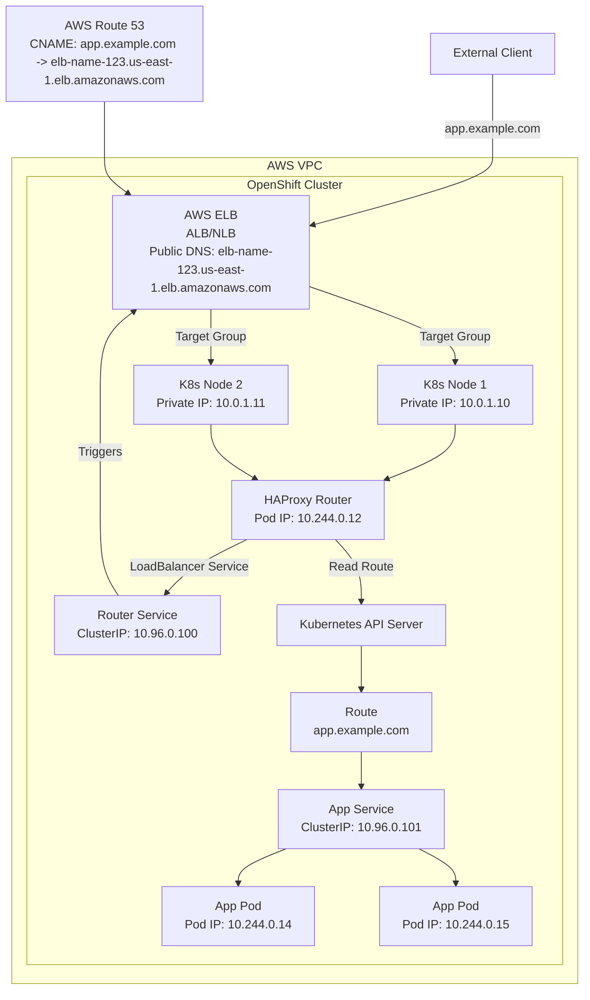

# How OpenShift Clusters on AWS Utilize AWS Infrastructure for Public IP Allocation Similar to MetalLB

To answer **how OpenShift clusters running on AWS utilize AWS infrastructure for public IP allocation similar to MetalLB**, we need to analyze AWS's native load balancing and public IP allocation mechanisms for OpenShift clusters and compare them with MetalLB's functionality in bare-metal environments. MetalLB provides external IPs for `LoadBalancer` type Services in bare-metal Kubernetes/OpenShift clusters through Layer 2 (ARP) or Layer 3 (BGP) protocols. AWS provides cloud-native load balancers and public IP allocation, which OpenShift clusters can seamlessly leverage. Below is a detailed explanation of how AWS infrastructure supports public IP allocation for OpenShift clusters, comparisons with MetalLB, and integration with OpenShift's Route and Ingress Controller, building on your previous questions.

---

### 1. MetalLB Function Overview
- **Purpose**: MetalLB provides external IP allocation and traffic routing for `LoadBalancer` type Services in bare-metal Kubernetes/OpenShift clusters.
- **Mechanism**:
    - **IP Allocation**: MetalLB's Controller component allocates IPs from configured `IPAddressPool` (e.g., `192.168.1.200-192.168.1.250`).
    - **Traffic Routing**: MetalLB's Speaker component advertises allocated IPs using ARP (Layer 2) or BGP (Layer 3) protocols to direct traffic to cluster nodes.
    - **Layer**: Layer 4 (TCP/UDP), typically used to expose OpenShift Router or Ingress Controller Services.
- **Use Case**: Essential for implementing LoadBalancer functionality in bare-metal environments without cloud provider support.

---

### 2. Public IP Allocation Mechanism for OpenShift Clusters on AWS

OpenShift clusters running on AWS (whether **Red Hat OpenShift Service on AWS (ROSA)**, **OpenShift Dedicated**, or manually deployed OpenShift clusters) achieve public IP allocation similar to MetalLB through AWS's **Elastic Load Balancer (ELB)**. AWS ELB is a cloud-native load balancing solution that OpenShift leverages to allocate public IPs for `LoadBalancer` type Services and handle external traffic routing. Here's the detailed mechanism:

#### 2.1 Role of AWS Elastic Load Balancer (ELB)
AWS provides two main ELB types suitable for OpenShift clusters:
- **Application Load Balancer (ALB)**: Operates at Layer 7 (HTTP/HTTPS), supports hostname and path-based routing, suitable for OpenShift Route and Ingress Controller.
- **Network Load Balancer (NLB)**: Operates at Layer 4 (TCP/UDP), provides low-latency, high-performance load balancing, suitable for general Service exposure.

**Features**:
- **Public IP Allocation**: ELB automatically assigns public IPs or DNS names (e.g., `elb-name-123456789.us-east-1.elb.amazonaws.com`) for external client access.
- **Traffic Routing**: ELB distributes traffic to OpenShift cluster nodes (or Pods) based on Target Group configuration.
- **High Availability**: ELB runs across multiple Availability Zones (AZs), ensuring redundancy and failover.

#### 2.2 How OpenShift Clusters Leverage ELB
OpenShift clusters integrate with AWS infrastructure through **AWS Cloud Provider Integration**, automatically creating ELB instances for `LoadBalancer` type Services. Here's the specific process:

**Service Configuration**:
- When users create a `type: LoadBalancer` Service in an OpenShift cluster (e.g., OpenShift Router or Ingress Controller Service), OpenShift's AWS cloud provider plugin interacts with the AWS API to request ELB creation.
- Example Service definition:
  ```yaml
  apiVersion: v1
  kind: Service
  metadata:
    name: router-service
    namespace: openshift-ingress
  spec:
    type: LoadBalancer
    selector:
      app: router
    ports:
    - port: 80
      targetPort: 8080
      protocol: TCP
  ```

**ELB Creation**:
- AWS automatically creates an NLB or ALB (depending on Service Annotations or default configuration) and assigns a public IP or DNS name.
- ELB's Target Group is configured to point to OpenShift node IPs (e.g., `10.0.1.10`) or Pod IPs (via NodePort).
- The Service's `status.loadBalancer.ingress` field is updated with the ELB's public IP or DNS name:
  ```yaml
  status:
    loadBalancer:
      ingress:
      - hostname: elb-name-123456789.us-east-1.elb.amazonaws.com
  ```

**Traffic Routing**:
- External clients initiate requests through the ELB's public IP/DNS (e.g., `elb-name-123456789.us-east-1.elb.amazonaws.com:80`).
- ELB distributes traffic to OpenShift node ports (e.g., NodePort `30080` or directly to Pods) based on Target Group rules.
- OpenShift's kube-proxy further forwards traffic to target Pods (e.g., `10.244.0.12:8080`).

#### 2.3 Integration with OpenShift Route and Ingress Controller

**OpenShift Route**:
- Route is OpenShift's Layer 7 HTTP routing mechanism, handled by **HAProxy Router** (running in `openshift-ingress` namespace).
- HAProxy Router's Service is typically configured as `type: LoadBalancer`, and AWS creates an ALB or NLB for this Service, allocating public IP/DNS.
- The hostname defined in Route (e.g., `app.example.com`) is resolved through DNS to the ELB's public IP/DNS, and traffic reaches the Router, which then forwards to backend Services based on Route rules.
- Example Route:
  ```yaml
  apiVersion: route.openshift.io/v1
  kind: Route
  metadata:
    name: my-route
  spec:
    host: app.example.com
    to:
      kind: Service
      name: my-service
    port:
      targetPort: 8080
  ```

**Ingress Controller**:
- OpenShift clusters can also deploy Kubernetes-native Ingress Controllers (e.g., NGINX or AWS ALB Ingress Controller).
- Ingress Controller's Service is configured as `type: LoadBalancer`, and AWS also creates ELB, allocating public IP/DNS.
- Ingress resources define routing rules (similar to Route), pointing to backend Services.
- In OpenShift, Ingress resources can be converted to Route through **Ingress Operator** for handling by HAProxy Router, reducing the need for separate Ingress Controllers.

**DNS Configuration**:
- Users need to resolve the hostname defined in Route or Ingress (e.g., `app.example.com`) to the ELB's public DNS name through AWS Route 53 (or other DNS services).
- For example, CNAME record:
  ```
  app.example.com -> elb-name-123456789.us-east-1.elb.amazonaws.com
  ```

#### 2.4 AWS-Specific Features
- **Annotations Enhancement**: OpenShift supports AWS-specific Service Annotations, allowing customization of ELB behavior. For example:
  ```yaml
  metadata:
    annotations:
      service.beta.kubernetes.io/aws-load-balancer-type: "nlb"
      service.beta.kubernetes.io/aws-load-balancer-internal: "false"
  ```
  - Specifies use of NLB or ALB.
  - Configures whether it's external (public) or internal load balancer.
- **Auto Scaling**: ELB integrates with AWS Auto Scaling, dynamically adjusting the number of OpenShift nodes or Pods based on traffic load.
- **Security Groups**: ELB uses AWS Security Groups to control inbound traffic, ensuring only specific ports (e.g., 80, 443) are allowed.
- **TLS Termination**: ALB supports direct TLS termination at the load balancer layer, working with AWS Certificate Manager (ACM) to provide managed certificates, simplifying HTTPS configuration for Route/Ingress.

---

### 3. Comparison with MetalLB

Both MetalLB and AWS ELB provide external IP and traffic routing for `LoadBalancer` type Services, but their implementation methods and applicable scenarios are completely different. Here's a detailed comparison:

| **Feature**                     | **AWS ELB (OpenShift on AWS)**                              | **MetalLB (Bare-Metal)**                              |
|------------------------------|------------------------------------------------------------|-----------------------------------------------------|
| **Environment**                    | Cloud environment (AWS), relies on AWS infrastructure                            | Bare-metal environment, no cloud provider support                          |
| **IP Allocation**                 | AWS automatically assigns public IP or DNS name (e.g., `elb-name-123456789.us-east-1.elb.amazonaws.com`) | MetalLB allocates IPs from user-defined `IPAddressPool` (e.g., `192.168.1.200`) |
| **Traffic Routing**                | Layer 4 (NLB) or Layer 7 (ALB), distributes traffic through AWS network infrastructure | Layer 2 (ARP) or Layer 3 (BGP), routes traffic through node network |
| **High Availability**                | Runs across multiple Availability Zones (AZs), AWS automatically manages redundancy                   | Relies on Speaker component's Leader election (Layer 2) or BGP ECMP (Layer 3) |
| **Configuration Complexity**              | Automatic integration, requires minimal Annotations configuration                          | Requires manual configuration of `IPAddressPool`, `L2Advertisement`, or `BGPPeer` |
| **Layer 7 Support**            | ALB supports hostname/path-based routing, suitable for Route/Ingress                 | No Layer 7 support, only provides IP allocation and basic traffic distribution      |
| **Cost**                    | Pay-per-use (ELB instances, traffic, etc.)                              | No additional cost (open-source software), but requires maintenance                   |
| **OpenShift Integration**        | Seamless integration through AWS cloud provider plugin, Route/Ingress can directly use       | Requires manual deployment of MetalLB, configuration to work with Router/Ingress     |
| **Scalability**                  | Supports AWS Auto Scaling, dynamic scaling                            | Limited by bare-metal network scale and BGP router support             |

**Key Differences**:
- **Cloud vs. Bare-Metal**: AWS ELB is a cloud-native solution, highly automated, relying on AWS infrastructure; MetalLB is an alternative for bare-metal environments, requiring manual network protocol configuration.
- **Feature Scope**: ELB (especially ALB) supports Layer 7 routing, better matching OpenShift Route's functionality; MetalLB is limited to Layer 4, requiring cooperation with Route/Ingress Controller for HTTP routing.
- **Operational Overhead**: AWS ELB is managed by AWS, reducing operational burden; MetalLB requires user maintenance of Controller and Speaker.

**Similarities**:
- Both allocate external IPs for `LoadBalancer` Services, ensuring external traffic reaches the cluster.
- In OpenShift, both ELB and MetalLB are commonly used to expose HAProxy Router or Ingress Controller Services.

---

### 4. Mermaid Diagram: Public IP Allocation on AWS OpenShift

Here's a Mermaid deployment diagram showing how OpenShift clusters on AWS use AWS ELB for public IP allocation, compared to MetalLB's architecture.



**Diagram Explanation**:
- **AWS ELB**: Allocates public DNS (e.g., `elb-name-123.us-east-1.elb.amazonaws.com`) for Router Service (`type: LoadBalancer`) and distributes traffic to nodes through Target Groups.
- **Route 53**: Resolves `app.example.com` to the ELB's DNS.
- **HAProxy Router**: Handles Route resources (`app.example.com`) and routes traffic to backend App Service.
- **Service and Pod**: App Service (`10.96.0.101`) forwards traffic to Pods (`10.244.0.14`, `10.244.0.15`) through kube-proxy.
- **Comparison with MetalLB**: MetalLB would replace ELB's role in bare-metal environments, allocating static IPs (e.g., `192.168.1.200`) and using ARP/BGP for routing.

---

### 5. Specific Comparison: OpenShift Scenarios

1. **Public IP Allocation**:
    - **AWS ELB**: Dynamically assigns public IP/DNS, managed by AWS, automatically bound to ELB instances.
    - **MetalLB**: Allocates fixed IPs from user-defined `IPAddressPool`, requires manual configuration.

2. **Support for Route and Ingress**:
    - **AWS ELB**: ALB supports Layer 7 routing, directly handling hostname and path-based rules for Route/Ingress; NLB provides Layer 4 support, working with HAProxy Router or Ingress Controller.
    - **MetalLB**: Limited to Layer 4 IP allocation, relies on HAProxy Router or Ingress Controller for Layer 7 routing.

3. **OpenShift Router Deployment**:
    - **AWS**: Router Service triggers AWS to create ELB, automatically allocating public IP/DNS, Router Pod receives traffic and distributes according to Route rules.
    - **MetalLB**: Router Service relies on MetalLB to allocate external IP (e.g., `192.168.1.200`), Speaker uses ARP/BGP to route traffic to nodes.

4. **Operations and Cost**:
    - **AWS**: ELB is a managed service, operations handled by AWS, but charges apply by hour and traffic.
    - **MetalLB**: Open-source and free, but users must deploy and maintain Controller/Speaker, configure network protocols.

---

### 6. Summary

1. **Public IP Allocation for OpenShift Clusters on AWS**:
    - OpenShift leverages **AWS Elastic Load Balancer (ELB)** to allocate public IPs or DNS for `LoadBalancer` type Services (e.g., HAProxy Router or Ingress Controller Services).
    - AWS cloud provider plugin automatically integrates with AWS API, creating ALB (Layer 7) or NLB (Layer 4), allocating public DNS (e.g., `elb-name-123456789.us-east-1.elb.amazonaws.com`).
    - Route 53 is used to resolve the hostname (e.g., `app.example.com`) defined in Route/Ingress to the ELB's DNS.
    - Traffic flows from ELB to OpenShift nodes, HAProxy Router or Ingress Controller then forwards to backend Services and Pods based on Route/Ingress rules.

2. **Comparison with MetalLB**:
    - **AWS ELB** is a cloud-native solution with high automation, supporting Layer 4 and Layer 7, integrating with AWS ecosystem (e.g., Route 53, ACM), but requires payment.
    - **MetalLB** is an open-source alternative for bare-metal environments, limited to Layer 4, requiring manual configuration of IP pools and network protocols, suitable for scenarios without cloud support.
    - In OpenShift scenarios, AWS ELB directly provides public IPs for Router Service, functionally equivalent to MetalLB but better suited for cloud environments.

3. **Relationship with Route and Ingress**:
    - Both Route and Ingress Controller rely on `LoadBalancer` Service exposure, AWS ELB allocates public IP/DNS for them, similar to MetalLB's role in bare-metal environments.
    - OpenShift's HAProxy Router handles Route resources, Ingress Operator can convert Ingress to Route, simplifying HTTP traffic management.

If you need specific OpenShift on AWS configuration examples (e.g., Service YAML, Route configuration, or Route 53 setup), or want to explore a specific aspect in depth (e.g., ALB vs NLB selection, performance comparison with MetalLB), please let me know and I can provide more detailed information!