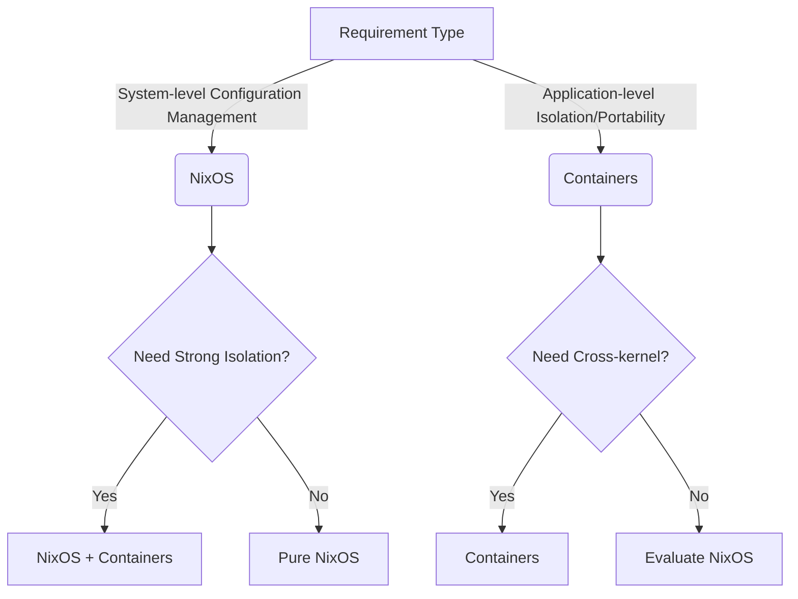

# NixOS is not a container-based distribution (like Docker or LXC), but it shares some similar concepts with container technology (such as isolation and reproducibility) while employing completely different implementation methods. Here are the key differences and characteristics:

---

### 1. **The Core of NixOS is the Nix Package Manager**
- **Declarative Configuration**: NixOS uses pure text configuration files (`configuration.nix`) to define the entire system state (including packages, services, users, etc.), similar to "infrastructure as code" in container orchestration, but applied at the entire operating system level.
- **Atomic and Rollback**: All system changes are atomic, with each modification generating a new system generation that can be rolled back to previous versions at any time.
- **Dependency Isolation**: Nix's package management achieves dependency isolation through hashed storage paths, allowing different versions of software packages to coexist without conflicts (similar to container file system isolation but without virtualization).

---

### 2. **Comparison with Containers**
| **Feature**               | **NixOS**                          | **Containers (like Docker)**              |
|------------------------|------------------------------------|------------------------------------------|
| **Isolation**          | Dependency isolation, but shared processes/kernel | Strong isolation (namespaces, cgroups) |
| **Granularity**        | Entire system or user environment (nix-shell) | Single application or service |
| **Virtualization**     | None, runs directly on hardware or host | Requires container runtime (like containerd) |
| **Storage Usage**      | Shares common dependencies, saves space | Image layers may be redundant |
| **Use Cases**          | Suitable for managing host systems or development environments | Suitable for deploying microservices or cross-platform applications |

---

### 3. **Collaboration between NixOS and Containers**
- **Nix Builds Container Images**: Nix can generate OCI-compliant container images (for example through [`nixpkgs.dockerTools`](https://nixos.org/manual/nixpkgs/stable/#sec-pkgs-dockerTools)), utilizing Nix's reliability to build minimal images.
- **Development Environment Consistency**: `nix-shell` or `direnv` can provide disposable development environments similar to containers, but without starting container processes.
- **NixOS as Host**: NixOS itself supports running Docker/Podman containers, with both being complementary.

---

### 4. **Why NixOS is Not a Container?**
- **No Runtime Isolation**: NixOS does not isolate processes, networks, or file systems by default (unless explicitly configured).
- **System-level Management**: NixOS manages the state of the entire operating system, not individual application instances.

---

### Summary
NixOS achieves **reproducibility** and **isolation** similar to containers through unique package management and declarative configuration, but it is an operating system-level solution rather than container technology. You can view NixOS as a "lower-level container alternative," or combine it with containers to obtain dual advantages.

---

NixOS, through its unique **pure functional package management** and **declarative configuration** design, can efficiently handle problems across different operating systems and environments (such as development, testing, production). Here are its core mechanisms and practical applications:

---

### 1. **Dependency Isolation and Environment Consistency**
#### **Nix Store and Hashed Paths**
- All software packages and dependencies are stored in `/nix/store`, with paths containing hash values (like `/nix/store/abcd123-python-3.11`), ensuring:
    - **Cross-environment Consistency**: The same input (like configuration files) always generates the same build results.
    - **Version Coexistence**: Different versions of software or dependencies can coexist without conflicts.

#### **Nix Shell and Development Environment**
- Quickly create isolated temporary environments through `nix-shell` or `direnv`:
  ```nix
  # shell.nix example
  with import <nixpkgs> {};
  mkShell {
    buildInputs = [ python39 nodejs-16_x ];
    shellHook = "echo Ready for Python/Node development!";
  }
  ```
    - **Effect**: When entering this environment, the specified toolchain is automatically installed, with no impact on other parts of the system after exiting.

---

### 2. **Cross-Operating System Support**
#### **Nix Multi-platform Compatibility**
- The **Nixpkgs repository** supports multiple systems and architectures (Linux, macOS, Windows WSL2, aarch64, etc.).
- The same Nix expression can generate software packages for different platforms (specified through the `system` parameter):
  ```nix
  # Explicitly specify system type
  { pkgs ? import <nixpkgs> { system = "x86_64-darwin"; } }:
  pkgs.hello
  ```

#### **NixOS and Non-NixOS Systems**
- **Using Nix on Non-NixOS Systems**:  
  By installing the Nix package manager, Nix expressions (like development environments or toolchains) can be reused on macOS or regular Linux.
- **Nix Flakes (experimental)** strengthens cross-environment consistency:
  ```nix
  # flake.nix example
  {
    outputs = { nixpkgs, ... }: {
      devShell.x86_64-linux = /* Linux environment */;
      devShell.x86_64-darwin = /* macOS environment */;
    };
  }
  ```

---

### 3. **Environment Differentiation Configuration**
#### **Conditional Configuration**
- Dynamically adjust configuration in `configuration.nix` based on system type or environment variables:
  ```nix
  { config, pkgs, ... }:
  let
    isProduction = config.networking.hostName == "prod-server";
  in {
    services.nginx.enable = true;
    services.nginx.optimize = isProduction; # Enable optimization only in production environment
  }
  ```

#### **Profiles (Configuration Sets)**
- Split different environment configurations through `nixos-generate-config` or custom modules:
  ```bash
  # Generate hardware-related configuration (automatically adapts to current machine)
  sudo nixos-generate-config
  ```

---

### 4. **Collaboration with Containers/Virtualization**
#### **Building Consistent Container Images**
- Use `nixpkgs.dockerTools` to generate lightweight Docker images from Nix expressions:
  ```nix
  { pkgs ? import <nixpkgs> {} }:
  pkgs.dockerTools.buildImage {
    name = "my-app";
    config = { Cmd = [ "${pkgs.nginx}/bin/nginx" ]; };
  }
  ```
    - **Advantage**: No need to manually write Dockerfiles, avoiding "layer bloat" problems.

#### **NixOS Virtual Machines**
- Quickly generate a virtual machine based on current configuration through `nixos-rebuild build-vm` for testing environments.

---

### 5. **Practical Application Scenarios**
#### **Scenario 1: Development Team Collaboration**
- All members share the same `shell.nix` or `flake.nix`, ensuring completely consistent toolchains without manual dependency installation.

#### **Scenario 2: Multi-stage Deployment**
- **Development Machine**: Enable debugging tools and logs.
- **Production Machine**: Disable debugging features, enable security hardening configuration.

#### **Scenario 3: Mixed Architecture Support**
- The same Nix codebase builds software packages for both x86 servers and ARM devices (like Raspberry Pi) simultaneously.

---

### Summary
NixOS achieves:
1. **Environment Consistency**: From development to production, from Linux to macOS, ensuring same input produces same output.
2. **Flexible Adaptation**: Handling differentiated needs through conditional configuration and modular design.
3. **Cross-platform Collaboration**: Complementing with container and virtualization technologies, covering from single-machine to distributed scenarios.

This design makes NixOS significantly reduce "it works on my machine" problems in complex and changing operational scenarios.

---

Both NixOS and containers (like Docker) aim to solve environment consistency and dependency management problems, but they have significant differences in core goals, applicable scenarios, and underlying mechanisms. The reasons for choosing NixOS over containers (or combining both) depend on specific needs. Here are the key comparisons and unique advantages of NixOS:

---

### 1. **Core Philosophy and Design Goals**
| **Dimension**       | **NixOS**                          | **Containers (like Docker)**              |
|-------------------|------------------------------------|------------------------------------------|
| **Focus**         | **Declarative management of entire operating system** | **Application-level isolation and portability** |
| **Isolation Level**| Dependency isolation (through Nix Store) | Process/file system/network isolation (namespaces) |
| **Virtualization** | None, runs directly on hardware    | Requires container runtime (lightweight virtualization) |
| **Configuration Granularity** | System-wide configuration (services, kernel, users, etc.) | Single application or service |

---

### 2. **Why Choose NixOS Over Containers?**
#### **Advantage 1: System-level Reproducibility and Atomicity**
- **Declarative System Configuration**: NixOS's `configuration.nix` defines the entire operating system state (including kernel parameters, system services, packages, etc.), while containers only manage the application layer.  
  *Example*: One-click switching of global configurations between development and production machines (like firewalls, file system mounts, kernel modules).
- **Atomic Rollback**: Each system version generated by `nixos-rebuild switch` can be rolled back, avoiding complex rollback processes in container orchestration.

#### **Advantage 2: The Ultimate Solution for Dependency Management**
- **Precise Dependency Control**: Nix's hashed storage ensures strict matching of dependency relationships, avoiding "invisible conflicts" caused by base image layers or shared libraries in containers.  
  *Comparison*: Docker's `apt-get install` may introduce inconsistencies due to image source updates, while Nix always builds precisely from source or binary cache.
- **Multi-version Coexistence**: Different users on the same system can use different versions of Python/Node.js without starting multiple containers.

#### **Advantage 3: Performance and Resource Overhead**
- **Zero Runtime Overhead**: NixOS runs directly on hardware without container engines (like Docker Daemon) or additional virtualization layers.
- **Shared Dependencies Save Space**: Nix Store automatically deduplicates, while container images may have duplicate dependency layers (like multiple images all containing the `alpine` base layer).

#### **Advantage 4: Simplified Development Experience**
- **Seamless Development Environment**: `nix-shell` or `direnv` directly loads toolchains, lighter than `docker run -it`.  
  *Scenario*: When developers edit code locally, they can directly call tools provided by Nix without entering the container interior.
- **Deep Integration with Host**: Direct use of system GPU, USB devices, etc., without container privileged mode or complex mapping.

#### **Advantage 5: Security and Maintenance**
- **Reduced Attack Surface**: No need for long-running container runtimes (like containerd), reducing potential vulnerability risks.
- **Automatic Update Strategy**: NixOS's `nix-channel` or Flakes can centrally manage all software versions, avoiding fragmented updates of container images.

---

### 3. **When Are Containers Still Needed?**
Despite NixOS's power, containers are better in the following scenarios:
- **Cross-kernel Compatibility**: Need to run applications on non-Linux systems (like Windows).
- **Strong Isolation Requirements**: Multi-tenant scenarios or running untrusted code (like SaaS platforms).
- **Rapid Distribution**: Directly pushing Docker images to registries is simpler than deploying NixOS configurations (for some teams).

---

### 4. **Ultimate Solution: Synergy of NixOS + Containers**
The two are not mutually exclusive and can combine advantages:
- **Build Container Images with Nix**: Generate minimal, highly reproducible images through `nixpkgs.dockerTools` from Nix expressions.
- **NixOS as Host**: Unified management of host and container runtime (like Docker/Podman) configurations.
- **Kubernetes Cluster Deployment**: NixOS manages node systems, containers orchestrate applications.

---

### Decision Tree: When to Choose NixOS?


---

### Summary
**Core Reasons for Choosing NixOS**:  
If you need a **completely reproducible operating system**, **ultimate dependency control**, or **reduced dependence on containers**, NixOS is a more fundamental and unified solution. Containers are more suitable for **rapid application distribution** or **mandatory runtime environment isolation**. For complex scenarios, combining both can maximize value.

---

Nix package management and Homebrew each have their pros and cons. Which is "better" depends on your needs, usage scenarios, and preferences. Here's a comparative analysis to help you determine which is more suitable for you:

---

### 1. Nix Package Management
Nix is a powerful package manager that emphasizes declarative configuration and reproducibility, widely used on Linux and macOS systems.

#### Advantages:
- **Declarative Configuration**: Nix uses configuration files (like `configuration.nix` or `home-manager`) to define system or user environments, convenient for version control and cross-machine reproduction.
- **Reproducibility**: Nix ensures the build process is purely functional, with the same configuration producing consistent results on different machines, suitable for development and production environments.
- **Multi-version Coexistence**: Nix supports installing multiple versions of the same software without interference, solving dependency conflicts.
- **Isolation**: Each package is installed in independent paths (like `/nix/store`), avoiding global pollution.
- **Cross-platform Support**: Nix can run on Linux and macOS, even supporting non-root user installation.
- **Powerful Rollback Mechanism**: Nix supports easy rollback to previous system states, very useful when updates or installations fail.
- **Ecosystem**: Nixpkgs is a huge software package repository containing numerous packages and supporting custom packages.

#### Disadvantages:
- **Steep Learning Curve**: Nix concepts (like declarative configuration, purely functional builds) are not beginner-friendly, and configuration file syntax takes time to adapt to.
- **Complex Installation**: On macOS, Nix installation and configuration may be more troublesome than Homebrew, especially for permission management and cache settings.
- **Community Size**: Although the Nix community is active, it's smaller compared to Homebrew, and documentation and tutorials may not be as rich.
- **Performance Overhead**: Nix build processes may be slower, especially during initial installation or building custom packages.

#### Suitable Scenarios:
- Need highly reproducible development environments (like DevOps, cross-team collaboration).
- Want fine control over system configuration (like managing dotfiles through `home-manager`).
- Need to run multiple versions of software on the same system.
- Have requirements for declarative configuration and version control.

---

### 2. Homebrew
Homebrew is a popular package manager for macOS (also supporting Linux), known for its simplicity and ease of use.

#### Advantages:
- **Simple and Easy to Use**: Homebrew commands (like `brew install <package>`) are intuitive, with low learning costs, suitable for beginners.
- **Fast Installation**: Homebrew provides pre-compiled binary packages (bottles), with installation speeds usually faster than Nix.
- **Strong Community**: Homebrew has massive community support, with rapid software package updates and rich documentation and tutorials.
- **Rich Ecosystem**: Homebrew's software repositories (formulae and casks) cover numerous macOS common tools and GUI applications.
- **macOS Optimization**: Homebrew is designed specifically for macOS, integrating well with the system and supporting GUI application installation (like VS Code, Chrome).
- **Flexibility**: Supports adding third-party repositories through `brew tap`, with strong extensibility.

#### Disadvantages:
- **Weak Dependency Management**: Homebrew doesn't support multi-version coexistence, and upgrading packages may cause dependency conflicts.
- **Poor Reproducibility**: Homebrew installation processes depend on local environments, making it difficult to ensure cross-machine consistency.
- **Global Installation**: Homebrew installs software to global paths (like `/usr/local` or `/opt/homebrew`) by default, potentially causing environmental pollution.
- **Difficult Rollback**: Homebrew doesn't support system-level rollback like Nix, and uninstalling or fixing problems may require manual operations.
- **Limited Linux Support**: Although Homebrew supports Linux, its ecosystem and optimization mainly target macOS.

#### Suitable Scenarios:
- macOS users need to quickly install common software (like Git, Node.js, VS Code).
- Don't need complex dependency management or multi-version coexistence.
- Value simplicity and community support more.
- Need to install GUI applications or macOS-specific tools.

---

### Direct Comparison

| Feature                  | Nix                              | Homebrew                        |
|-----------------------|----------------------------------|---------------------------------|
| **Ease of Use**       | Steep learning curve            | Simple and intuitive           |
| **Reproducibility**   | Extremely strong, purely functional builds | Weaker, depends on local environment |
| **Multi-version Support** | Supported, no interference     | Not supported                  |
| **Installation Speed** | Slower (needs building)        | Faster (pre-compiled binaries) |
| **Isolation**         | Strong, independent paths       | Weak, global installation       |
| **Rollback Mechanism** | Powerful, supports system-level rollback | Basically no rollback mechanism |
| **Community Size**    | Medium, technical-oriented      | Huge, for ordinary users        |
| **macOS Optimization** | General, needs additional configuration | Excellent, native GUI application support |
| **Linux Support**     | Excellent                        | Limited, secondary support      |
| **Declarative Configuration** | Supported, suitable for version control | Not supported                |

---

### Which is Better?
- **If you're a macOS user wanting to quickly install software, pursuing simplicity and community support**: **Homebrew** is the better choice. Its commands are simple, ecosystem is rich, especially suitable for installing macOS-specific tools and GUI applications.
- **If you need reproducible development environments, multi-version coexistence, or declarative configuration**: **Nix** is more powerful. It's suitable for DevOps engineers, developers needing cross-machine environment synchronization, or users with high requirements for system configuration.
- **Mixed Usage**: On macOS, many people use both Homebrew and Nix simultaneously. Homebrew for quickly installing common tools, Nix for managing development environments or specific project dependencies.

---

### Personal Recommendation
- If you're a beginner or regular macOS user, prioritize **Homebrew** because it's fast to learn and has good community support.
- If you have some technical background, are willing to spend time learning, and pursue controllable and reproducible environments, try **Nix**, especially with `home-manager` for managing user configurations.
- If you're on Linux, Nix is usually more advantageous than Homebrew because Homebrew's Linux support is not as complete as macOS.

If you have specific usage scenarios (like needing to install certain types of software, cross-machine environment synchronization, etc.), let me know, and I can provide further analysis!

---

NixOS (or the broader Nix package management) can replace pyenv in some scenarios, but whether it completely replaces it depends on your specific needs and usage scenarios. Here's a comparative analysis of NixOS and pyenv to help you determine if NixOS can meet your Python environment management needs.

---

### 1. pyenv Introduction
pyenv is a tool specifically designed for Python developers to manage multiple Python versions and virtual environments.

#### Main Features:
- **Multi-version Python Installation**: Easily install and switch between different Python versions (like 3.8, 3.10, PyPy).
- **Virtual Environment Management**: Create and manage virtual environments through the `pyenv-virtualenv` plugin.
- **Local/Global Version Switching**: Support specifying Python versions for project directories or globally.
- **Simple and Easy to Use**: Focuses on Python, with intuitive installation and usage, and low learning costs.

#### Advantages:
- Lightweight and focused, specifically designed for Python environments.
- Easy to learn, with simple commands (like `pyenv install 3.10.5`, `pyenv local 3.10.5`).
- Wide community support, rich documentation, suitable for Python developers.
- Supports macOS, Linux, and WSL, with good cross-platform compatibility.

#### Disadvantages:
- Limited to Python environment management, cannot extend to other languages or tools.
- Weak dependency management, needs to cooperate with `pip` or `poetry` for package management.
- Doesn't support declarative configuration, environments are difficult to version and reproduce.
- Installing Python versions may require compilation, with slower speeds (no pre-compiled binaries).

---

### 2. NixOS (or Nix) Introduction
NixOS is a Linux distribution based on Nix package management, while Nix is a general-purpose package manager supporting declarative configuration and highly reproducible environments. Nix can manage versions of various languages and tools, including Python.

#### Nix Features in Python Environment Management:
- **Multi-version Python Installation**: Nix can install multiple Python versions (like `python38`, `python310`) and coexist on the same system.
- **Isolated Environment**: Create temporary or project-specific development environments through `nix-shell` or `nix develop`, similar to virtual environments.
- **Declarative Configuration**: Use Nix configuration files (like `shell.nix` or `flake.nix`) to define project dependencies, including Python versions and packages, convenient for version control.
- **Package Management**: Nixpkgs provides numerous Python packages (through `python3Packages`), supporting direct installation (like `pip`, `numpy`).
- **Reproducibility**: Nix ensures environments are completely consistent across different machines, suitable for team collaboration or CI/CD.

#### Advantages:
- **Universality**: Nix is not limited to Python but can also manage other languages, tools, and system dependencies.
- **Reproducibility**: Declarative configuration ensures environment consistency, simple cross-machine reproduction.
- **Multi-version Coexistence**: Supports multiple Python versions and their dependency isolation without interference.
- **Powerful Ecosystem**: Nixpkgs contains rich Python packages, supporting custom packages.
- **Rollback and Isolation**: Nix's isolation mechanism avoids environmental pollution and supports rollback to previous states.

#### Disadvantages:
- **Learning Curve**: Nix concepts (like `nix-shell`, Flakes) and configuration syntax are not beginner-friendly.
- **Complexity**: Compared to pyenv, setting up Python environments requires more configuration (like writing `shell.nix`).
- **Community Support**: Nix's Python ecosystem is not as focused as pyenv, some edge packages may be missing or require manual definition.
- **Performance Overhead**: Nix build processes may be slower than pyenv, especially during initial setup.

---

### Direct Comparison

| Feature                  | NixOS / Nix                     | pyenv                          |
|-----------------------|---------------------------------|-------------------------------|
| **Function Scope**    | General package management, covers all languages and tools | Specifically designed for Python |
| **Multi-version Support** | Supported, strong isolation    | Supported, weaker isolation   |
| **Virtual Environment** | Through `nix-shell` or Flakes  | Through `pyenv-virtualenv`    |
| **Reproducibility**   | Extremely strong, declarative configuration | Weaker, depends on local environment |
| **Ease of Use**       | Steep learning curve           | Simple and intuitive         |
| **Community Support** | Medium, technical-oriented     | Strong, wide Python community |
| **Configuration Method** | Declarative, suitable for version control | Command-based, manual switching |
| **Performance**       | Slower builds                  | Faster installation (but needs compilation) |
| **Cross-language Support** | Supported (like Node.js, Ruby, etc.) | Limited to Python           |

---

### Can NixOS Replace pyenv?
**Scenarios where it can replace**:
- **Need reproducible development environments**: If you need to ensure Python environment consistency in team development, CI/CD, or cross-machine deployment, Nix's declarative configuration and purely functional builds far exceed pyenv. For example, using `shell.nix` or Nix Flakes to define project dependencies.
- **Multi-language projects**: If projects involve multiple languages or tools (Python + Node.js + PostgreSQL), Nix can manage all dependencies uniformly, while pyenv is limited to Python.
- **Multi-version coexistence**: Nix naturally supports multiple Python versions and their dependency isolation, suitable for projects that need to test different Python versions simultaneously.
- **System-level management**: On NixOS, Nix can manage the entire system configuration, including Python environments, suitable for users pursuing high consistency.

**Scenarios not suitable for replacement**:
- **Simple needs**: If you only occasionally switch Python versions or set up virtual environments for small projects, pyenv is simpler and more direct, while Nix configuration appears overly complex.
- **Quick start**: pyenv has low learning costs, suitable for Python developers to start quickly, while Nix requires understanding its unique workflow.
- **Specific Python packages**: Nixpkgs has extensive Python package coverage, but some niche packages may be missing or require manual definition, while pyenv with `pip` is more flexible.
- **Non-NixOS systems**: On macOS or non-NixOS Linux, Nix setup and performance may not be as smooth as pyenv.

---

### How to Implement pyenv Functionality with Nix?
Here's a simple Nix configuration example showing how to use Nix to replace pyenv for creating Python environments:

#### Example: Creating Python 3.10 Environment
1. Create a `shell.nix` file:
   ```nix
   { pkgs ? import <nixpkgs> {} }:
   pkgs.mkShell {
     buildInputs = with pkgs; [
       python310
       python310Packages.pip
       python310Packages.numpy
     ];
     shellHook = ''
       export PIP_PREFIX=$(pwd)/.venv
       export PYTHONPATH=$PIP_PREFIX/lib/python3.10/site-packages:$PYTHONPATH
       unset SOURCE_DATE_EPOCH
     '';
   }
   ```

2. Enter the environment:
   ```bash
   nix-shell
   ```

3. Install additional Python packages:
   ```bash
   pip install requests
   ```

This configuration creates an isolated Python 3.10 environment containing `numpy` and `pip`, similar to pyenv's virtual environment. You can enhance reproducibility with Nix Flakes.

---

### Conclusion
- **NixOS/Nix can replace pyenv**, especially in scenarios requiring reproducibility, multi-language support, or complex dependency management. Its declarative configuration and isolation make it more powerful in modern development workflows.
- **But pyenv is more suitable for simple, focused Python development**, because it's easy to use and optimized specifically for Python.
- **Recommendations**:
    - If you're on NixOS or already familiar with Nix, recommend using Nix to manage Python environments, with `nix-shell` or Flakes it can completely replace pyenv.
    - If you're on macOS or other systems and only need lightweight Python version management, pyenv is simpler.
    - Can also be mixed: use pyenv for quick Python version management, use Nix for project dependencies or system configuration.

If you have specific needs (like project scale, whether using NixOS, what Python packages are needed), let me know, and I can provide more detailed configuration suggestions or examples!