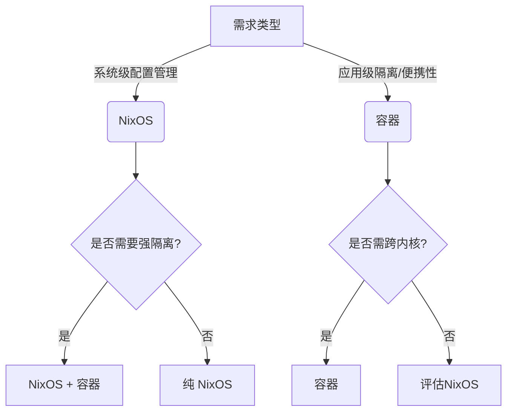

# NixOS 并不是基于容器（如 Docker 或 LXC）的发行版，但它与容器技术有一些相似的理念（如隔离性和可重复性），同时采用了完全不同的实现方式。以下是关键区别和特点：

---

### 1. **NixOS 的核心是 Nix 包管理器**
- **声明式配置**：NixOS 使用纯文本配置文件（`configuration.nix`）定义整个系统的状态（包括软件包、服务、用户等），类似容器编排中的“基础设施即代码”，但作用于整个操作系统层面。
- **原子性和可回滚**：所有系统更改是原子的，每次修改生成一个新的系统世代（generation），可以随时回滚到之前的版本。
- **依赖隔离**：Nix 的包管理通过哈希化存储路径实现依赖隔离，不同版本的软件包可以共存，避免冲突（类似容器的文件系统隔离，但无需虚拟化）。

---

### 2. **与容器的对比**
| **特性**               | **NixOS**                          | **容器（如 Docker）**              |
   |------------------------|------------------------------------|-----------------------------------|
| **隔离性**             | 依赖隔离，但进程/内核共享          | 强隔离（命名空间、cgroups）       |
| **粒度**               | 整个系统或用户环境（nix-shell）    | 单个应用或服务                    |
| **虚拟化**             | 无，直接运行在硬件或宿主机         | 需容器运行时（如 containerd）     |
| **存储占用**           | 共享公共依赖，节省空间             | 镜像层可能冗余                    |
| **用途**               | 适合管理主机系统或开发环境         | 适合部署微服务或跨平台应用        |

---

### 3. **NixOS 与容器的协作**
- **Nix 构建容器镜像**：Nix 可以生成符合 OCI 标准的容器镜像（例如通过 [`nixpkgs.dockerTools`](https://nixos.org/manual/nixpkgs/stable/#sec-pkgs-dockerTools)），利用 Nix 的可靠性构建最小化镜像。
- **开发环境一致性**：`nix-shell` 或 `direnv` 可提供类似容器的一次性开发环境，但无需启动容器进程。
- **NixOS 作为宿主机**：NixOS 本身支持运行 Docker/Podman 容器，两者互补。

---

### 4. **为什么说 NixOS 不是容器？**
- **无运行时隔离**：NixOS 默认不隔离进程、网络或文件系统（除非显式配置）。
- **系统级管理**：NixOS 管理的是整个操作系统的状态，而非单个应用实例。

---

### 总结
NixOS 通过独特的包管理和声明式配置实现了类似容器的**可重复性**和**隔离性**，但它是操作系统层面的解决方案，而非容器技术。你可以将 NixOS 视为一种“更底层的容器替代方案”，或者与容器结合使用以获得双重优势。

---

NixOS 通过其独特的 **纯函数式包管理** 和 **声明式配置** 设计，能够高效处理不同操作系统和环境（如开发、测试、生产）的问题。以下是其核心机制和实际应用方式：

---

### 1. **依赖隔离与环境一致性**
#### **Nix Store 与哈希化路径**
- 所有软件包和依赖项存储在 `/nix/store` 中，路径包含哈希值（如 `/nix/store/abcd123-python-3.11`），确保：
    - **跨环境一致性**：相同的输入（如配置文件）始终生成相同的构建结果。
    - **版本共存**：不同版本的软件或依赖可同时存在，互不冲突。

#### **Nix Shell 与开发环境**
- 通过 `nix-shell` 或 `direnv` 快速创建隔离的临时环境：
  ```nix
  # shell.nix 示例
  with import <nixpkgs> {};
  mkShell {
    buildInputs = [ python39 nodejs-16_x ];
    shellHook = "echo Ready for Python/Node development!";
  }
  ```
    - **效果**：进入该环境时自动安装指定工具链，退出后不影响系统其他部分。

---

### 2. **跨操作系统支持**
#### **Nix 多平台兼容性**
- **Nixpkgs 仓库** 支持多种系统和架构（Linux、macOS、Windows WSL2、aarch64 等）。
- 同一份 Nix 表达式可生成不同平台的软件包（通过 `system` 参数指定）：
  ```nix
  # 显式指定系统类型
  { pkgs ? import <nixpkgs> { system = "x86_64-darwin"; } }:
  pkgs.hello
  ```

#### **NixOS 与非 NixOS 系统**
- **在非 NixOS 系统上使用 Nix**：  
  通过安装 Nix 包管理器，可在 macOS 或普通 Linux 上复用 Nix 表达式（如开发环境或工具链）。
- **Nix Flakes（实验性）** 强化跨环境一致性：
  ```nix
  # flake.nix 示例
  {
    outputs = { nixpkgs, ... }: {
      devShell.x86_64-linux = /* Linux 环境 */;
      devShell.x86_64-darwin = /* macOS 环境 */;
    };
  }
  ```

---

### 3. **环境差异化配置**
#### **条件化配置**
- 在 `configuration.nix` 中根据系统类型或环境变量动态调整配置：
  ```nix
  { config, pkgs, ... }:
  let
    isProduction = config.networking.hostName == "prod-server";
  in {
    services.nginx.enable = true;
    services.nginx.optimize = isProduction; # 仅在生产环境启用优化
  }
  ```

#### **Profiles（配置集）**
- 通过 `nixos-generate-config` 或自定义模块拆分不同环境配置：
  ```bash
  # 生成硬件相关配置（自动适配当前机器）
  sudo nixos-generate-config
  ```

---

### 4. **与容器/虚拟化的协同**
#### **构建一致性的容器镜像**
- 使用 `nixpkgs.dockerTools` 从 Nix 表达式生成轻量级 Docker 镜像：
  ```nix
  { pkgs ? import <nixpkgs> {} }:
  pkgs.dockerTools.buildImage {
    name = "my-app";
    config = { Cmd = [ "${pkgs.nginx}/bin/nginx" ]; };
  }
  ```
    - **优势**：无需手动编写 Dockerfile，避免“层膨胀”问题。

#### **NixOS 虚拟机**
- 通过 `nixos-rebuild build-vm` 快速生成一个基于当前配置的虚拟机，用于测试环境。

---

### 5. **实际应用场景**
#### **场景 1：开发团队协作**
- 所有成员共享同一份 `shell.nix` 或 `flake.nix`，确保工具链完全一致，无需手动安装依赖。

#### **场景 2：多阶段部署**
- **开发机**：启用调试工具和日志。
- **生产机**：关闭调试功能，启用安全强化配置。

#### **场景 3：混合架构支持**
- 同一份 Nix 代码库同时为 x86 服务器和 ARM 设备（如树莓派）构建软件包。

---

### 总结
NixOS 通过 **哈希化存储**、**声明式配置** 和 **纯函数式构建**，实现了：
1. **环境一致性**：从开发到生产，从 Linux 到 macOS，保证相同输入产生相同输出。
2. **灵活适配**：通过条件化配置和模块化设计处理差异化需求。
3. **跨平台协作**：与容器、虚拟化技术互补，覆盖从单机到分布式场景。

这种设计使得 NixOS 在复杂多变的运维场景中显著降低“在我机器上能跑”的问题。

---

NixOS 和容器（如 Docker）虽然都旨在解决环境一致性和依赖管理问题，但它们的核心目标、适用场景和底层机制存在显著差异。选择 NixOS 而非容器（或两者结合）的理由取决于具体需求。以下是关键对比和 NixOS 的独特优势：

---

### 1. **核心哲学与设计目标**
| **维度**       | **NixOS**                          | **容器（如 Docker）**              |
|----------------|------------------------------------|-----------------------------------|
| **关注点**     | **整个操作系统的声明式管理**       | **应用级隔离与便携性**            |
| **隔离级别**   | 依赖隔离（通过 Nix Store）         | 进程/文件系统/网络隔离（命名空间）|
| **虚拟化**     | 无，直接运行在硬件上               | 需容器运行时（轻量级虚拟化）      |
| **配置粒度**   | 系统全局配置（服务、内核、用户等） | 单个应用或服务                    |

---

### 2. **为什么选择 NixOS 而非容器？**
#### **优势 1：系统级可重现性与原子性**
- **声明式系统配置**：NixOS 的 `configuration.nix` 定义整个操作系统状态（包括内核参数、系统服务、软件包等），而容器仅管理应用层。  
  *示例*：一键切换开发机和生产机的全局配置（如防火墙、文件系统挂载、内核模块）。
- **原子回滚**：`nixos-rebuild switch` 生成的每个系统版本均可回滚，避免容器编排的复杂回滚流程。

#### **优势 2：依赖管理的终极方案**
- **精确依赖控制**：Nix 的哈希化存储确保依赖关系严格匹配，避免容器中因基础镜像层或共享库导致的“隐形冲突”。  
  *对比*：Docker 的 `apt-get install` 可能因镜像源更新引入不一致性，而 Nix 始终从源码或二进制缓存精确构建。
- **多版本共存**：同一系统的不同用户可使用不同版本的 Python/Node.js，无需启动多个容器。

#### **优势 3：性能与资源开销**
- **零运行时开销**：NixOS 直接运行在硬件上，无需容器引擎（如 Docker Daemon）或额外的虚拟化层。
- **共享依赖节省空间**：Nix Store 自动去重，而容器镜像可能重复依赖层（如多个镜像均包含 `alpine` 基础层）。

#### **优势 4：开发体验简化**
- **无缝开发环境**：`nix-shell` 或 `direnv` 直接加载工具链，比 `docker run -it` 更轻量。  
  *场景*：开发者在本地编辑代码时，可直接调用 Nix 提供的工具，无需进入容器内部。
- **与宿主机深度集成**：直接使用系统 GPU、USB 设备等，无需容器特权模式或复杂映射。

#### **优势 5：安全与维护**
- **减少攻击面**：无需长期运行的容器运行时（如 containerd），降低潜在漏洞风险。
- **自动更新策略**：NixOS 的 `nix-channel` 或 Flakes 可集中管理所有软件版本，避免容器镜像的碎片化更新。

---

### 3. **何时仍需要容器？**
尽管 NixOS 强大，容器在以下场景更优：
- **跨内核兼容性**：需在非 Linux 系统（如 Windows）运行应用。
- **强隔离需求**：多租户场景或运行不可信代码（如 SaaS 平台）。
- **快速分发**：直接推送 Docker 镜像到注册表比部署 NixOS 配置更简单（对部分团队而言）。

---

### 4. **终极方案：NixOS + 容器的协同**
两者并非二选一，可结合优势：
- **用 Nix 构建容器镜像**：通过 `nixpkgs.dockerTools` 生成最小化、高可复现的镜像。
- **NixOS 作为宿主机**：统一管理主机和容器运行时（如 Docker/Podman）的配置。
- **Kubernetes 集群部署**：NixOS 管理节点系统，容器编排应用。

---

### 决策树：何时选择 NixOS？


---

### 总结
**选择 NixOS 的核心理由**：  
如果你需要 **完全可复现的操作系统**、**极致的依赖控制** 或 **减少对容器的依赖**，NixOS 是更底层、更统一的解决方案。而容器更适合 **快速分发应用** 或 **强制隔离运行时环境**。对于复杂场景，两者结合能发挥最大价值。

---

Nix 包管理和 Homebrew 各有优劣，哪个“更好使”取决于你的需求、使用场景和偏好。以下是对两者的对比分析，帮你判断哪个更适合你：

---

### 1. Nix 包管理
Nix 是一个功能强大、强调声明式配置和可重现性的包管理器，广泛用于 Linux 和 macOS 系统。

#### 优点：
- **声明式配置**：Nix 使用配置文件（如 `configuration.nix` 或 `home-manager`）来定义系统或用户环境，方便版本控制和跨机器复现。
- **可重现性**：Nix 确保构建过程是纯函数式的，相同的配置在不同机器上产生一致的结果，适合开发和生产环境。
- **多版本共存**：Nix 支持安装同一软件的多个版本，互不干扰，解决了依赖冲突问题。
- **隔离性**：每个包都安装在独立的路径（如 `/nix/store`），避免全局污染。
- **跨平台支持**：Nix 可在 Linux 和 macOS 上运行，甚至支持非 root 用户安装。
- **强大的回滚机制**：Nix 支持轻松回滚到之前的系统状态，更新或安装出错时非常有用。
- **生态系统**：Nixpkgs 是巨大的软件包仓库，包含大量软件，且支持自定义包。

#### 缺点：
- **学习曲线陡峭**：Nix 的概念（如声明式配置、纯函数式构建）对新手不友好，配置文件语法需要时间适应。
- **安装复杂**：在 macOS 上，Nix 的安装和配置可能比 Homebrew 麻烦，尤其是权限管理和缓存设置。
- **社区规模**：虽然 Nix 社区活跃，但相比 Homebrew，社区规模较小，文档和教程可能不够丰富。
- **性能开销**：Nix 的构建过程可能较慢，尤其是在首次安装或构建自定义包时。

#### 适合场景：
- 需要高度可重现的开发环境（如 DevOps、跨团队协作）。
- 希望精细控制系统配置（如通过 `home-manager` 管理 dotfiles）。
- 需要在同一系统上运行多个版本的软件。
- 对声明式配置和版本控制有需求。

---

### 2. Homebrew
Homebrew 是 macOS（也支持 Linux）的流行包管理器，以简单易用著称。

#### 优点：
- **简单易用**：Homebrew 的命令（如 `brew install <package>`）直观，学习成本低，适合新手。
- **安装快速**：Homebrew 提供预编译的二进制包（bottles），安装速度通常比 Nix 快。
- **社区强大**：Homebrew 有庞大的社区支持，软件包更新迅速，文档和教程丰富。
- **生态丰富**：Homebrew 的软件仓库（ formulae 和 casks）覆盖了大量 macOS 常用工具和 GUI 应用。
- **macOS 优化**：Homebrew 专为 macOS 设计，与系统集成良好，支持 GUI 应用（如 VS Code、Chrome）的安装。
- **灵活性**：支持通过 `brew tap` 添加第三方仓库，扩展性强。

#### 缺点：
- **依赖管理较弱**：Homebrew 不支持多版本共存，升级包可能导致依赖冲突。
- **可重现性差**：Homebrew 的安装过程依赖于本地环境，难以保证跨机器一致性。
- **全局安装**：Homebrew 默认将软件安装到全局路径（如 `/usr/local` 或 `/opt/homebrew`），可能导致环境污染。
- **回滚困难**：Homebrew 不支持像 Nix 那样的系统级回滚，卸载或修复问题可能需要手动操作。
- **Linux 支持有限**：虽然 Homebrew 支持 Linux，但其生态和优化主要针对 macOS。

#### 适合场景：
- macOS 用户需要快速安装常用软件（如 Git、Node.js、VS Code）。
- 不需要复杂依赖管理或多版本共存。
- 更看重简单性和社区支持。
- 需要安装 GUI 应用或 macOS 专属工具。

---

### 直接对比

| 特性                  | Nix                              | Homebrew                        |
|-----------------------|----------------------------------|---------------------------------|
| **易用性**            | 学习曲线陡峭                   | 简单直观                       |
| **可重现性**          | 极强，纯函数式构建              | 较弱，依赖本地环境             |
| **多版本支持**        | 支持，互不干扰                 | 不支持                         |
| **安装速度**          | 较慢（需构建）                 | 较快（预编译二进制）           |
| **隔离性**            | 强，独立路径                   | 弱，全局安装                   |
| **回滚机制**          | 强大，支持系统级回滚           | 基本无回滚机制                 |
| **社区规模**          | 中等，技术向                   | 庞大，面向普通用户             |
| **macOS 优化**        | 一般，需额外配置               | 优秀，原生支持 GUI 应用        |
| **Linux 支持**        | 优秀                           | 有限，次要支持                 |
| **声明式配置**        | 支持，适合版本控制             | 不支持                         |

---

### 哪个更好使？
- **如果你是 macOS 用户，想要快速安装软件，追求简单和社区支持**：**Homebrew** 是更好的选择。它的命令简单，生态丰富，尤其适合安装 macOS 专属工具和 GUI 应用。
- **如果你需要可重现的开发环境、多版本共存或声明式配置**：**Nix** 更强大。它适合 DevOps 工程师、需要跨机器同步环境的开发者，或对系统配置有高要求的用户。
- **混合使用**：在 macOS 上，很多人同时使用 Homebrew 和 Nix。Homebrew 用于快速安装常用工具，Nix 用于管理开发环境或特定项目依赖。

---

### 个人建议
- 如果你是新手或 macOS 普通用户，优先选择 **Homebrew**，因为它上手快，社区支持好。
- 如果你有一定技术背景，愿意花时间学习，追求环境的可控性和可重现性，尝试 **Nix**，特别是配合 `home-manager` 管理用户配置。
- 如果你在 Linux 上，Nix 通常比 Homebrew 更有优势，因为 Homebrew 的 Linux 支持不如 macOS 完善。

如果你有具体的使用场景（比如需要安装某类软件、跨机器同步环境等），可以告诉我，我可以进一步帮你分析！

---

NixOS（或更广泛的 Nix 包管理）在某些场景下可以替代 pyenv，但是否完全替代取决于你的具体需求和使用场景。以下是对 NixOS 和 pyenv 的对比分析，帮你判断 NixOS 是否能满足你的 Python 环境管理需求。

---

### 1. pyenv 简介
pyenv 是一个专门为 Python 开发者设计的工具，用于管理多个 Python 版本和虚拟环境。

#### 主要功能：
- **多版本 Python 安装**：轻松安装和切换不同版本的 Python（如 3.8、3.10、PyPy）。
- **虚拟环境管理**：通过 `pyenv-virtualenv` 插件创建和管理虚拟环境。
- **本地/全局版本切换**：支持为项目目录或全局指定 Python 版本。
- **简单易用**：专注于 Python，安装和使用直观，学习成本低。

#### 优点：
- 轻量、专注，专为 Python 环境设计。
- 易于上手，命令简单（如 `pyenv install 3.10.5`、`pyenv local 3.10.5`）。
- 社区广泛，文档丰富，适合 Python 开发者。
- 支持 macOS、Linux 和 WSL，跨平台性好。

#### 缺点：
- 仅限 Python 环境管理，无法扩展到其他语言或工具。
- 依赖管理较弱，需配合 `pip` 或 `poetry` 管理包。
- 不支持声明式配置，环境难以版本化和复现。
- 安装 Python 版本可能需要编译，速度较慢（无预编译二进制）。

---

### 2. NixOS（或 Nix）简介
NixOS 是一个基于 Nix 包管理的 Linux 发行版，而 Nix 是一个通用的包管理器，支持声明式配置和高度可重现的环境。Nix 可以管理包括 Python 在内的各种语言和工具的版本。

#### Nix 在 Python 环境管理的功能：
- **多版本 Python 安装**：Nix 可以安装多个 Python 版本（如 `python38`, `python310`），并在同一系统中共存。
- **隔离环境**：通过 `nix-shell` 或 `nix develop` 创建临时或项目专用的开发环境，类似虚拟环境。
- **声明式配置**：使用 Nix 配置文件（如 `shell.nix` 或 `flake.nix`）定义项目依赖，包括 Python 版本和包，方便版本控制。
- **包管理**：Nixpkgs 提供大量 Python 包（通过 `python3Packages`），支持直接安装（如 `pip`、`numpy`）。
- **可重现性**：Nix 确保环境在不同机器上完全一致，适合团队协作或 CI/CD。

#### 优点：
- **通用性**：Nix 不仅限于 Python，还能管理其他语言、工具和系统依赖。
- **可重现性**：声明式配置确保环境一致，跨机器复现简单。
- **多版本共存**：支持多个 Python 版本及其依赖互不干扰。
- **强大的生态**：Nixpkgs 包含丰富的 Python 包，支持自定义包。
- **回滚和隔离**：Nix 的隔离机制避免环境污染，支持回滚到之前状态。

#### 缺点：
- **学习曲线**：Nix 的概念（如 `nix-shell`、Flakes）和配置语法对新手不友好。
- **复杂性**：相比 pyenv，设置 Python 环境需要更多配置（如编写 `shell.nix`）。
- **社区支持**：Nix 的 Python 生态不如 pyenv 专注，某些边缘包可能缺失或需要手动定义。
- **性能开销**：Nix 的构建过程可能比 pyenv 慢，尤其在首次设置时。

---

### 直接对比

| 特性                  | NixOS / Nix                     | pyenv                          |
|-----------------------|---------------------------------|-------------------------------|
| **功能范围**          | 通用包管理，覆盖所有语言和工具 | 专为 Python 设计              |
| **多版本支持**        | 支持，隔离性强                 | 支持，隔离性较弱              |
| **虚拟环境**          | 通过 `nix-shell` 或 Flakes     | 通过 `pyenv-virtualenv`       |
| **可重现性**          | 极强，声明式配置              | 较弱，依赖本地环境            |
| **易用性**            | 学习曲线陡峭                  | 简单直观                     |
| **社区支持**          | 中等，技术向                  | 强大，Python 社区广泛         |
| **配置方式**          | 声明式，适合版本控制          | 命令式，手动切换              |
| **性能**              | 构建较慢                     | 安装较快（但需编译）          |
| **跨语言支持**        | 支持（如 Node.js、Ruby 等）   | 仅限 Python                  |

---

### NixOS 能否替代 pyenv？
**可以替代的场景**：
- **需要可重现的开发环境**：如果你在团队开发、CI/CD 或跨机器部署中需要确保 Python 环境一致，Nix 的声明式配置和纯函数式构建远超 pyenv。例如，使用 `shell.nix` 或 Nix Flakes 定义项目依赖。
- **多语言项目**：如果项目涉及多种语言或工具（Python + Node.js + PostgreSQL），Nix 能统一管理所有依赖，而 pyenv 仅限 Python。
- **多版本共存**：Nix 天然支持多个 Python 版本及其依赖隔离，适合需要同时测试不同 Python 版本的项目。
- **系统级管理**：在 NixOS 上，Nix 可以管理整个系统配置，包括 Python 环境，适合追求高度一致性的用户。

**不适合替代的场景**：
- **简单需求**：如果你只是偶尔切换 Python 版本或为小型项目设置虚拟环境，pyenv 更简单直接，Nix 的配置显得过于复杂。
- **快速上手**：pyenv 的学习成本低，适合 Python 开发者快速开始，而 Nix 需要理解其独特的工作流。
- **特定 Python 包**：Nixpkgs 的 Python 包覆盖广泛，但某些小众包可能缺失或需要手动定义，而 pyenv 配合 `pip` 更灵活。
- **非 NixOS 系统**：在 macOS 或非 NixOS 的 Linux 上，Nix 的设置和性能可能不如 pyenv 流畅。

---

### 如何用 Nix 实现 pyenv 的功能？
以下是一个简单的 Nix 配置示例，展示如何用 Nix 替代 pyenv 创建 Python 环境：

#### 示例：创建 Python 3.10 环境
1. 创建一个 `shell.nix` 文件：
   ```nix
   { pkgs ? import <nixpkgs> {} }:
   pkgs.mkShell {
     buildInputs = with pkgs; [
       python310
       python310Packages.pip
       python310Packages.numpy
     ];
     shellHook = ''
       export PIP_PREFIX=$(pwd)/.venv
       export PYTHONPATH=$PIP_PREFIX/lib/python3.10/site-packages:$PYTHONPATH
       unset SOURCE_DATE_EPOCH
     '';
   }
   ```

2. 进入环境：
   ```bash
   nix-shell
   ```

3. 安装额外的 Python 包：
   ```bash
   pip install requests
   ```

这个配置创建了一个隔离的 Python 3.10 环境，包含 `numpy` 和 `pip`，类似 pyenv 的虚拟环境。你可以用 Nix Flakes 进一步增强可重现性。

---

### 结论
- **NixOS/Nix 可以替代 pyenv**，尤其在需要可重现性、多语言支持或复杂依赖管理的场景下。它的声明式配置和隔离性使其在现代开发工作流中更强大。
- **但 pyenv 更适合简单、专注的 Python 开发**，因为它易用且专为 Python 优化。
- **建议**：
    - 如果你在 NixOS 上或已经熟悉 Nix，推荐用 Nix 管理 Python 环境，配合 `nix-shell` 或 Flakes 完全可以替代 pyenv。
    - 如果你在 macOS 或其他系统上，只需要轻量级 Python 版本管理，pyenv 更简单。
    - 也可以混合使用：用 pyenv 快速管理 Python 版本，用 Nix 管理项目依赖或系统配置。

如果你有具体的需求（比如项目规模、是否用 NixOS、需要哪些 Python 包），可以告诉我，我可以提供更详细的配置建议或示例！