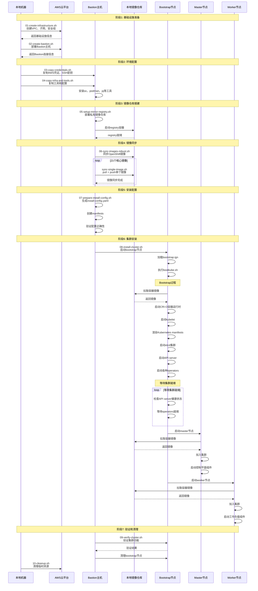
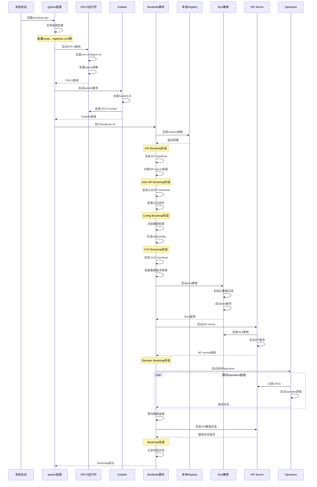
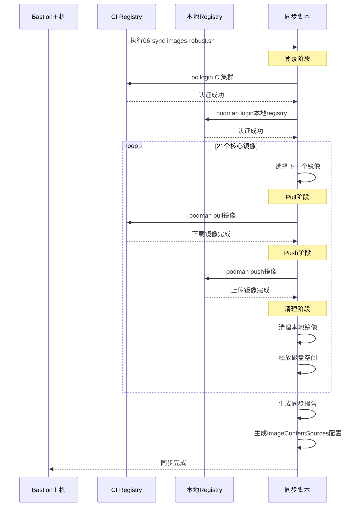

# OpenShift Bootstrap Scripts 分析总结

基于对bootstrap-scripts目录的分析，这些是OpenShift bootstrap过程中的核心脚本，我来总结一下它们的工作流程和关键组件：

### 1. 核心启动流程

**主要启动顺序：**
```
bootkube.sh (主脚本) → crio-configure.sh → kubelet.sh → 各种operator启动
```

**bootkube.sh 的主要阶段：**
1. **API Bootstrap** - 渲染API服务器清单
2. **Auth API Bootstrap** - 渲染认证API清单
3. **Config Bootstrap** - 渲染集群配置
4. **CVO Bootstrap** - 渲染集群版本操作符
5. **Operator Bootstrap** - 启动各种operator

### 2. 关键脚本功能分析

#### **镜像处理相关：**
- **`release-image.sh`** - 定义镜像路径，已修复为使用本地registry
- **`node-image-pull.sh`** - 拉取CoreOS节点镜像
- **`release-image-download.sh`** - 下载release镜像

#### **容器运行时配置：**
- **`crio-configure.sh`** - 配置CRI-O使用本地pause镜像
- **`kubelet.sh`** - 启动kubelet，配置使用CRI-O socket

#### **系统服务：**
- **`node-image-pull.service`** - 拉取节点镜像的systemd服务
- **`node-image-overlay.service`** - 处理镜像覆盖层
- **`node-image-finish.service`** - 完成镜像处理

### 3. 配置文件分析

#### **Registry配置 (`registries.conf`)：**
- ✅ **已修复**：所有mirror都设置为 `insecure = true`
- ✅ **已配置**：所有外部registry都mirror到 `localhost:5000`
- ✅ **支持**：registry.ci.openshift.org、quay.io等

#### **Hosts配置 (`hosts`)：**
- ✅ **已配置**：将外部registry域名指向bastion (10.0.10.10)
- 包括：registry.ci.openshift.org、quay.io、registry.access.redhat.com

#### **Docker配置 (`docker-config.json`)：**
- ✅ **已配置**：包含localhost:5000的认证信息

### 4. 关键发现和状态

#### **✅ 已修复的问题：**
1. **Registry配置** - 所有mirror都正确设置为insecure=true
2. **Release镜像路径** - release-image.sh已修改为使用localhost:5000
3. **Hosts配置** - 外部registry域名正确指向bastion
4. **认证配置** - docker-config.json包含本地registry认证

#### **🔧 当前工作状态：**
1. **Bootstrap脚本已优化** - 支持disconnected环境
2. **镜像路径已修复** - 使用本地registry而不是外部
3. **配置已完善** - registry、hosts、认证都已正确配置

#### **📋 下一步需要解决的问题：**
1. **CRI-O运行时** - bootstrap节点需要CRI-O或Podman作为容器运行时
2. **crictl工具** - 需要crictl进行容器运行时测试
3. **镜像同步** - 确保所有必要镜像都在本地registry中

### 5. 脚本执行流程

**Bootstrap启动流程：**
```
1. 系统启动 → 2. 加载bootstrap.ign → 3. 执行bootkube.sh
4. 配置CRI-O → 5. 启动kubelet → 6. 渲染manifests
7. 启动etcd → 8. 启动API server → 9. 启动operators
10. 等待集群就绪 → 11. 完成bootstrap
```

---

OpenShift Disconnected Cluster Installation Timeline

## 完整安装时序图



## Bootstrap节点详细时序图



## 镜像同步详细时序图



---

关键配置点

### 1. Registry配置
- 所有外部registry都mirror到localhost:5000
- 所有mirror都设置为insecure=true
- 支持registry.ci.openshift.org、quay.io等

### 2. 网络配置
- VPC私有子网，通过NAT网关访问外网
- Bastion在公有子网，作为跳板机
- Bootstrap/Master/Worker在私有子网

### 3. 认证配置
- AWS凭证通过bastion传递
- Registry认证包含在docker-config.json中
- SSH密钥用于节点访问

### 4. 镜像处理
- 使用image_for()函数获取本地镜像路径
- 支持镜像digest和tag两种方式
- 自动重试机制处理网络问题

## 故障排除点

### 1. 镜像同步失败
- 检查网络连接
- 验证CI集群认证
- 检查本地registry存储空间

### 2. Bootstrap启动失败
- 检查CRI-O配置
- 验证镜像可访问性
- 查看bootstrap日志

### 3. 集群安装失败
- 检查manifests配置
- 验证网络策略
- 查看operator日志

### 4. 节点无法加入集群
- 检查kubelet配置
- 验证证书配置
- 查看节点日志

### 6. 关键配置点

#### **镜像处理：**
- 使用 `image_for()` 函数获取本地镜像路径
- 所有镜像都从 `localhost:5000` 拉取
- 支持镜像digest和tag两种方式

#### **容器运行时：**
- kubelet配置使用 `/var/run/crio/crio.sock`
- CRI-O配置使用本地pause镜像
- 支持systemd cgroup驱动

#### **网络配置：**
- 使用host网络模式避免IP冲突
- 配置本地registry访问
- 支持insecure registry

### 7. 总结

这些bootstrap脚本已经很好地适配了disconnected环境：

1. **✅ Registry配置正确** - 所有外部registry都mirror到本地
2. **✅ 镜像路径已修复** - 使用本地registry路径
3. **✅ Hosts配置完善** - 外部域名正确解析
4. **✅ 认证配置正确** - 包含本地registry认证

**当前主要挑战：**
- bootstrap节点需要容器运行时（CRI-O或Podman）
- 需要crictl工具进行测试
- 确保所有必要镜像都在本地registry中

这些脚本为disconnected OpenShift集群的bootstrap过程提供了完整的支持。

---

OpenShift Disconnected Cluster Installation Timeline

## 完整安装时序图


## Bootstrap节点详细时序图


---

镜像同步详细时序图


## 关键配置点

### 1. Registry配置
- 所有外部registry都mirror到localhost:5000
- 所有mirror都设置为insecure=true
- 支持registry.ci.openshift.org、quay.io等

### 2. 网络配置
- VPC私有子网，通过NAT网关访问外网
- Bastion在公有子网，作为跳板机
- Bootstrap/Master/Worker在私有子网

### 3. 认证配置
- AWS凭证通过bastion传递
- Registry认证包含在docker-config.json中
- SSH密钥用于节点访问

### 4. 镜像处理
- 使用image_for()函数获取本地镜像路径
- 支持镜像digest和tag两种方式
- 自动重试机制处理网络问题

## 故障排除点

### 1. 镜像同步失败
- 检查网络连接
- 验证CI集群认证
- 检查本地registry存储空间

### 2. Bootstrap启动失败
- 检查CRI-O配置
- 验证镜像可访问性
- 查看bootstrap日志

### 3. 集群安装失败
- 检查manifests配置
- 验证网络策略
- 查看operator日志

### 4. 节点无法加入集群
- 检查kubelet配置
- 验证证书配置
- 查看节点日志 


