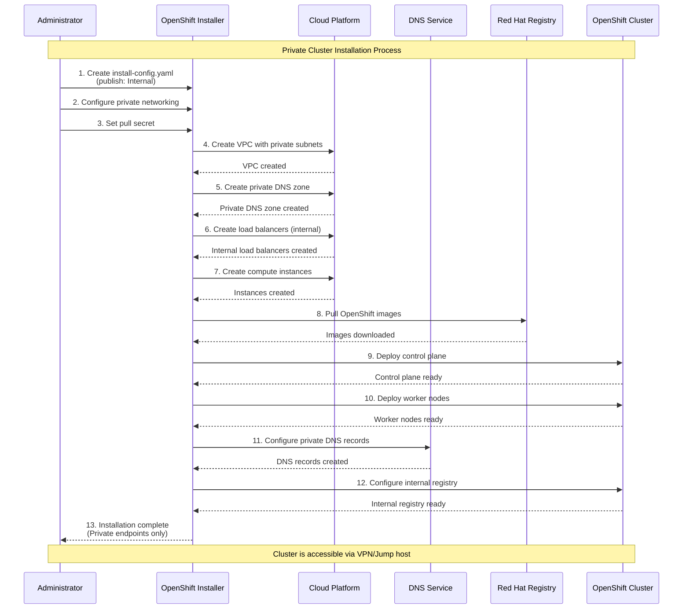
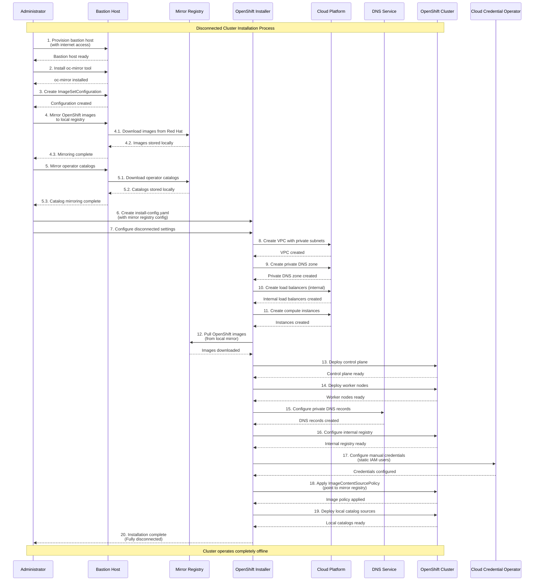
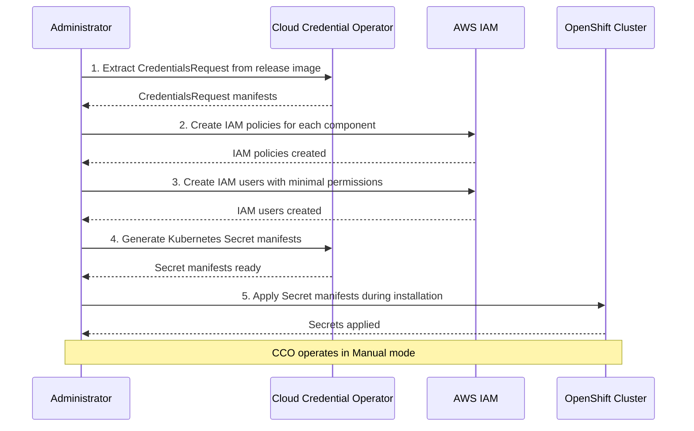
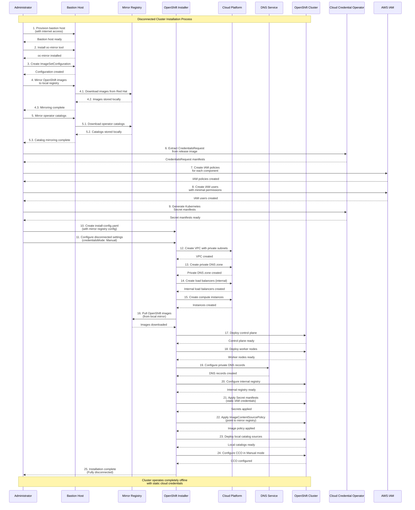

# OpenShift Disconnected Cluster

## AWS Directory Disconnected Cluster Related Scripts Summary

### 1. **VPC Configuration - `aws-provision-vpc-disconnected`**

**Location**: `step-registry/aws/provision/vpc/disconnected/`

**Purpose**: Create dedicated VPC network environment for disconnected cluster

**Key Features**:
- Create independent VPC supporting 1-3 availability zones
- Configure public and private subnets
- Set up Internet Gateway and NAT Gateway
- Configure route tables and network ACLs
- Optimize network configuration for disconnected environments

**Key Configuration**:
```yaml
ref:
  as: aws-provision-vpc-disconnected
  from_image:
    namespace: ocp
    name: "4.12"
    tag: upi-installer
  env:
  - name: ZONES_COUNT
    default: "3"
```

### 2. **IAM User Configuration - `aws-provision-cco-manual-users-static`**

**Location**: `step-registry/aws/provision/cco-manual-users/static/`

**Purpose**: Create static AWS IAM users and permissions for disconnected cluster

**Main Functions**:
- Extract CredentialsRequest from OpenShift release image
- Create corresponding IAM policies for each CredentialsRequest
- Create IAM users with minimum permissions
- Generate Kubernetes Secret manifest files
- Support filtering for TechPreview features

**Key Features**:
```yaml
ref:
  as: aws-provision-cco-manual-users-static
  documentation: |-
    Create static AWS IAM users for disconnected cluster.
```

### 3. **Core Script Function Analysis**

#### **VPC Creation Script** (`aws-provision-vpc-disconnected-commands.sh`):
- Create VPC using CloudFormation template
- Configure multi-availability zone support
- Set network labels and expiration time
- Output key information like VPC ID, subnet IDs

#### **IAM User Creation Script** (`aws-provision-cco-manual-users-static-commands.sh`):
- Use `oc adm release extract` to extract credential requests
- Dynamically generate IAM policy documents
- Create AWS IAM users and access keys
- Generate Kubernetes Secret YAML files
- Support mirror registry authentication configuration

### 4. **Special Considerations for Disconnected Cluster**

**Network Isolation**:
- VPC configuration optimized for disconnected environments
- Support private subnet configuration
- Configurable NAT Gateway for limited internet access

**Image Registry**:
- Support mirror registry configuration
- Handle pull secret and authentication
- Configure ImageContentSourcePolicy

**Permission Management**:
- Principle of least privilege
- Static IAM users instead of dynamic creation
- Support CCO (Cloud Credential Operator) manual mode

### 5. **Integration with Other Components**

These scripts typically work with other disconnected-related components:
- **Image Synchronization**: Use `oc-mirror` tool to sync images to local registry
- **Catalog Source**: Configure local operator catalog
- **Registry Configuration**: Set up mirror policies for image registry
- **Network Configuration**: Configure DNS and routing

### 6. **Use Cases**

These scripts are mainly used for:
- **CI/CD Environments**: Test OpenShift in isolated AWS environments
- **Offline Deployment**: Deploy OpenShift in environments without internet access
- **Security Compliance**: Meet enterprise security policy requirements
- **Performance Testing**: Conduct performance benchmarks in controlled environments

These configuration files and scripts provide a complete automated solution for deploying disconnected OpenShift clusters on AWS, covering key aspects like networking, permissions, and image synchronization.

---

CCO Meaning

**CCO** is the abbreviation for **Cloud Credential Operator**, which is a core component in OpenShift.

### 1. **Role of Cloud Credential Operator (CCO)**

CCO is the Operator in OpenShift responsible for managing cloud platform credentials. Its main functions include:

- **Credential Management**: Manage credentials required by various OpenShift cluster components to access cloud platforms
- **Permission Control**: Ensure each component only gets the minimum permissions it needs
- **Security Policy**: Implement security best practices for cloud platform access

### 2. **CCO Working Modes**

CCO supports multiple working modes:

#### **Mint Mode** (Default)
- CCO automatically creates and manages cloud platform credentials
- Dynamically creates IAM users/service accounts
- Suitable for environments with sufficient permissions

#### **Manual Mode**
- Administrator manually creates and manages credentials
- Uses pre-created IAM users/service accounts
- Suitable for permission-restricted or security-sensitive environments

#### **Passthrough Mode**
- Directly uses existing cloud platform credentials
- Does not perform any credential management

### 3. **Role of `cco-manual-users` Directory**

This directory is specifically for CCO configuration in **Manual Mode**:

#### **Main Functions**:
- **Extract CredentialsRequest**: Extract credential requests needed by various components from OpenShift release image
- **Create IAM Policies**: Automatically generate corresponding AWS IAM policies based on CredentialsRequest
- **Create IAM Users**: Create dedicated IAM users for each component
- **Generate Kubernetes Secret**: Create corresponding Kubernetes Secret manifest files

#### **Workflow**:
```bash
# 1. Extract CredentialsRequest from release image
oc adm release extract --credentials-requests --cloud=aws

# 2. Create IAM policies and users for each CredentialsRequest
# 3. Generate Kubernetes Secret YAML files
```

### 4. **Why Manual Mode is Needed?**

Manual mode is particularly important in the following scenarios:

- **Disconnected Environment**: Cannot dynamically create cloud resources during offline deployment
- **Security Compliance**: Enterprise security policies require manual credential management
- **Permission Limitations**: Cloud platform account permissions are insufficient to support Mint mode
- **Audit Requirements**: Need clear credential creation records

### 5. **Integration with Other Components**

CCO closely integrates with the following components:
- **ccoctl Tool**: CLI tool for generating cloud platform credentials
- **CredentialsRequest**: CRD that defines required permissions for components
- **Various Operators**: Such as image-registry, ingress, machine-api, etc.

### Summary

The scripts in the `cco-manual-users` directory are key components for OpenShift to automatically create and manage cloud platform credentials when deploying in Manual mode on AWS platform. It ensures that in disconnected or security-sensitive environments, OpenShift clusters can correctly obtain the permissions needed to access AWS services while following the principle of least privilege.

---

## Private Cluster vs Disconnected Cluster Installation Process Comparison

### 1. **Concept Definition**

#### **Private Cluster**
- **Network Level**: Cluster's API server and Ingress controller use private IP addresses
- **Access Method**: Access through VPN, jump host, or internal network
- **Internet Connection**: Usually has internet connection, but API server is not exposed externally

#### **Disconnected Cluster**
- **Network Level**: Completely isolated network environment, cannot access internet
- **Image Registry**: Requires local image registry to provide all container images
- **Software Packages**: All software packages and updates need to be pre-downloaded locally

### 2. **Main Differences in Installation Process**

#### **A. Network Configuration Differences**

**Private Cluster**:
```yaml
# install-config.yaml
publish: Internal  # Key configuration
platform:
  aws:
    privateLink: true  # Use private link
```

**Disconnected Cluster**:
```yaml
# install-config.yaml
publish: Internal  # Also uses internal publishing
# But needs additional mirror registry configuration
additionalTrustBundle: |
  -----BEGIN CERTIFICATE-----
  # Mirror registry CA certificate
  -----END CERTIFICATE-----
```

#### **B. Image Processing Methods**

**Private Cluster**:
- Pull images directly from internet
- Use standard pull secret
- No need to pre-prepare images

**Disconnected Cluster**:
- Need to pre-sync all images to local registry
- Use `oc-mirror` tool to sync images
- Configure ImageContentSourcePolicy to point to local registry

```bash
# Disconnected environment image synchronization
oc-mirror --config=imageset.yaml docker://local-registry:5000
```

#### **C. Installation Steps Comparison**

**Private Cluster Installation Flow**:
```yaml
steps:
  - ref: ipi-conf
  - ref: ipi-conf-private-dns  # Configure private DNS
  - ref: ipi-install-install
  - ref: ipi-install-registry  # Configure internal image registry
```

**Disconnected Cluster Installation Flow**:
```yaml
steps:
  - chain: vsphere-provision-bastionhost  # Need bastion host
  - ref: mirror-images-by-oc-adm-in-bastion  # Image synchronization
  - ref: ipi-conf-mirror  # Configure mirror registry
  - ref: ipi-install-install
  - ref: ipi-install-vsphere-registry
  - ref: enable-qe-catalogsource-disconnected  # Enable offline catalog
  - ref: mirror-images-tag-images  # Image tag processing
```

### 3. **Key Component Differences**

#### **A. Image Registry Configuration**

**Private Cluster**:
```yaml
# Use standard registry.redhat.io
imageContentSources:
- mirrors:
  - registry.redhat.io/openshift4/ose-kube-rbac-proxy
  source: registry.redhat.io/openshift4/ose-kube-rbac-proxy
```

**Disconnected Cluster**:
```yaml
# Use local mirror registry
imageContentSources:
- mirrors:
  - mirror-registry.example.com:5000/openshift4/ose-kube-rbac-proxy
  source: registry.redhat.io/openshift4/ose-kube-rbac-proxy
```

#### **B. CCO (Cloud Credential Operator) Configuration**

**Private Cluster**:
- Can use standard Mint mode
- Dynamically create cloud platform credentials

**Disconnected Cluster**:
- Must use Manual mode
- Pre-create static IAM users
- Use `cco-manual-users` script

#### **C. Catalog Source Configuration**

**Private Cluster**:
```yaml
# Use standard Red Hat catalog
apiVersion: operators.coreos.com/v1alpha1
kind: CatalogSource
metadata:
  name: redhat-operators
spec:
  image: registry.redhat.io/redhat/redhat-operator-index
```

**Disconnected Cluster**:
```yaml
# Use local catalog
apiVersion: operators.coreos.com/v1alpha1
kind: CatalogSource
metadata:
  name: redhat-operators
spec:
  image: mirror-registry.example.com:5000/redhat/redhat-operator-index
```

### 4. **Infrastructure Requirements**

#### **Private Cluster**:
- Private subnet configuration
- NAT Gateway (optional)
- Private DNS zone
- VPN or jump host access

#### **Disconnected Cluster**:
- Completely isolated network
- Local image registry (Registry)
- Bastion Host (Bastion Host)
- All pre-downloaded software packages
- Local certificate authority

### 5. **Maintenance and Updates**

#### **Private Cluster**:
- Can directly pull updates from internet
- Standard upgrade process
- Automatic image pulling

#### **Disconnected Cluster**:
- Need to pre-download all updates
- Manual image synchronization
- Offline upgrade process
- Need to maintain local software package repository

### 6. **Security Considerations**

#### **Private Cluster**:
- Network-level isolation
- API server not exposed externally
- Still requires internet connection

#### **Disconnected Cluster**:
- Complete network isolation
- No internet connection
- Higher security level
- Requires strict content validation

### Summary

**Private Cluster** mainly focuses on **network access control**, ensuring cluster API is not exposed externally, but still maintains internet connection to obtain images and updates.

**Disconnected Cluster** focuses on **complete network isolation**, requiring pre-preparation of all necessary images, software packages, and configurations, suitable for deployment in highly secure or completely isolated environments.

The main difference between the two is: Private Cluster is "network privatization", while Disconnected Cluster is "complete offline operation".

---

# OpenShift Cluster Installation Sequence Diagrams

This document contains UML sequence diagrams for OpenShift Private Cluster and Disconnected Cluster installation processes.

## 1. Private Cluster Installation Sequence



## 2. Disconnected Cluster Installation Sequence



## 3. Key Differences Summary

| Aspect | Private Cluster | Disconnected Cluster |
|--------|----------------|---------------------|
| **Network Access** | Limited internet access | No internet access |
| **Image Source** | Red Hat registries | Local mirror registry |
| **Bastion Host** | Optional | Required |
| **Image Preparation** | None required | Pre-mirroring required |
| **CCO Mode** | Mint/Manual | Manual only |
| **Catalog Sources** | Standard Red Hat | Local mirrored |
| **Update Process** | Direct from internet | Manual mirroring |
| **Security Level** | Network isolation | Complete isolation |

## 4. Installation Prerequisites

### Private Cluster Prerequisites
- Cloud platform credentials
- Private network configuration
- DNS zone (private)
- Pull secret for Red Hat registries

### Disconnected Cluster Prerequisites
- Bastion host with internet access
- Local mirror registry
- Pre-mirrored OpenShift images
- Pre-mirrored operator catalogs
- Static cloud credentials (IAM users)
- Local certificate authority
- Complete software package repository

## 5. Post-Installation Considerations

### Private Cluster
- Configure VPN or jump host access
- Set up monitoring and logging
- Configure backup strategies
- Plan for updates and upgrades

### Disconnected Cluster
- Establish image update procedures
- Set up local package management
- Configure offline monitoring
- Plan for offline upgrades
- Maintain local security patches 

---

You're right! The sequence diagram indeed doesn't fully demonstrate the specific usage process of CCO in Disconnected Cluster. Let me explain in detail the key role of CCO in Disconnected Cluster installation:

## CCO Usage Process in Disconnected Cluster

### 1. **CCO Mode Configuration**
In Disconnected Cluster, CCO must use **Manual mode** because:
- Cluster cannot access internet to dynamically create cloud platform credentials
- Requires pre-created static IAM users/service accounts

### 2. **Specific Usage Steps**

#### **Step 1: Extract CredentialsRequest**
```bash
# Extract credential requests from OpenShift release image
oc adm release extract --credentials-requests --cloud=aws ${RELEASE_IMAGE}
```

#### **Step 2: Create Static IAM Users**
```bash
# Create corresponding IAM policies and users for each CredentialsRequest
# For example: openshift-image-registry-installer-cloud-credentials
# For example: openshift-ingress-operator-cloud-credentials
```

#### **Step 3: Generate Kubernetes Secret**
```yaml
# Generate corresponding Secret for each component
apiVersion: v1
kind: Secret
metadata:
  name: installer-cloud-credentials
  namespace: openshift-image-registry
data:
  aws_access_key_id: <base64-encoded-key>
  aws_secret_access_key: <base64-encoded-secret>
```

#### **Step 4: Apply Credential Configuration**
```bash
# Apply these Secrets during cluster installation
oc apply -f manifests/
```

### 3. **Missing Parts of CCO in Sequence Diagram**

In the Disconnected Cluster sequence diagram, the following should be shown in more detail:



### 4. **Key Differences of CCO**

| Aspect | Private Cluster | Disconnected Cluster |
|------|----------------|---------------------|
| **CCO Mode** | Mint/Manual | Manual only |
| **Credential Creation** | Dynamic creation | Static pre-creation |
| **Permission Management** | Automatic management | Manual management |
| **Internet Dependency** | Requires IAM API access | No internet access required |

### 5. **Why Disconnected Cluster Needs Manual Mode**

1. **Network Isolation**: Cluster cannot access AWS IAM API
2. **Security Requirements**: Enterprise security policies require manual credential management
3. **Audit Requirements**: Need clear credential creation records
4. **Permission Control**: Ensure principle of least privilege

### 6. **CCO Configuration Example**

```yaml
# install-config.yaml
credentialsMode: Manual  # Force Manual mode

# Example IAM policy
{
  "Version": "2012-10-17",
  "Statement": [
    {
      "Effect": "Allow",
      "Action": [
        "ec2:DescribeInstances",
        "ec2:DescribeRegions"
      ],
      "Resource": "*"
    }
  ]
}
```

你说得对，时序图中确实没有充分展示CCO的具体工作流程。在实际的Disconnected Cluster安装中，CCO的Manual模式配置是一个关键步骤，需要预先准备所有必要的云平台凭证，而不是依赖动态创建。

---

好的，我来输出包含CCO详细步骤的Disconnected Cluster安装时序图的mermaid内容：



这个更新后的时序图包含了CCO在Disconnected Cluster安装中的完整流程：

1. **步骤6-9**: 展示了CCO的凭证准备过程
    - 提取CredentialsRequest
    - 创建IAM策略和用户
    - 生成Kubernetes Secret清单

2. **步骤11**: 明确配置credentialsMode为Manual

3. **步骤21**: 应用静态凭证Secret

4. **步骤24**: 配置CCO为Manual模式

这样更完整地展示了Disconnected Cluster安装过程中CCO的关键作用和使用方式。

---

这是一个很好的问题！虽然Disconnected Cluster是完全离线的，但创建IAM用户仍然非常重要，原因如下：

## 为什么Disconnected Cluster仍然需要IAM用户

### 1. **云平台资源管理**
即使集群离线，它仍然需要管理云平台上的资源：
- **存储卷**: EBS卷的创建、删除、快照
- **负载均衡器**: 内部负载均衡器的管理
- **网络资源**: 安全组、路由表等
- **镜像仓库**: 如果使用云平台的容器仓库

### 2. **OpenShift组件需要云平台访问**

#### **Image Registry Operator**
```yaml
# 需要访问S3存储桶来存储镜像
apiVersion: v1
kind: Secret
metadata:
  name: installer-cloud-credentials
  namespace: openshift-image-registry
data:
  aws_access_key_id: <base64-encoded>
  aws_secret_access_key: <base64-encoded>
```

#### **Ingress Operator**
```yaml
# 需要管理AWS负载均衡器
apiVersion: v1
kind: Secret
metadata:
  name: cloud-credentials
  namespace: openshift-ingress-operator
```

#### **Machine API Operator**
```yaml
# 需要管理EC2实例（扩缩容时）
apiVersion: v1
kind: Secret
metadata:
  name: aws-cloud-credentials
  namespace: openshift-machine-api
```

### 3. **"离线"的真正含义**

Disconnected Cluster的"离线"指的是：
- **无法访问互联网**（拉取镜像、软件包）
- **无法访问外部服务**（Red Hat服务、更新服务器）

但**不是**指：
- 无法访问云平台API
- 无法管理云平台资源

### 4. **实际使用场景**

```bash
# 集群运行时，这些操作仍然需要云平台访问：

# 1. 创建新的持久卷
oc create -f pvc.yaml  # 需要创建EBS卷

# 2. 扩展节点
oc scale machineset/worker-0 --replicas=3  # 需要创建EC2实例

# 3. 配置负载均衡器
oc create route edge myapp  # 需要创建ALB/NLB

# 4. 存储镜像到云仓库
podman push image to AWS ECR  # 需要访问ECR
```

### 5. **权限最小化原则**

IAM用户只获得**最小必要权限**：

```json
{
  "Version": "2012-10-17",
  "Statement": [
    {
      "Effect": "Allow",
      "Action": [
        "ec2:DescribeInstances",
        "ec2:DescribeRegions",
        "ec2:CreateVolume",
        "ec2:DeleteVolume",
        "elasticloadbalancing:DescribeLoadBalancers"
      ],
      "Resource": "*"
    }
  ]
}
```

### 6. **与Private Cluster的区别**

| 方面 | Private Cluster | Disconnected Cluster |
|------|----------------|---------------------|
| **互联网访问** | 有（拉取镜像） | 无 |
| **云平台访问** | 有（动态创建） | 有（静态用户） |
| **CCO模式** | Mint/Manual | Manual only |
| **凭证管理** | 自动/手动 | 完全手动 |

### 7. **总结**

Disconnected Cluster的"离线"是**网络层面的隔离**，不是**云平台层面的隔离**。集群仍然需要：
- 管理云平台资源
- 访问云平台API
- 使用云平台服务

因此，IAM用户是必需的，只是创建方式从动态变为静态，从自动变为手动。这确保了在完全网络隔离的环境中，集群仍然能够正常管理其云平台资源。

