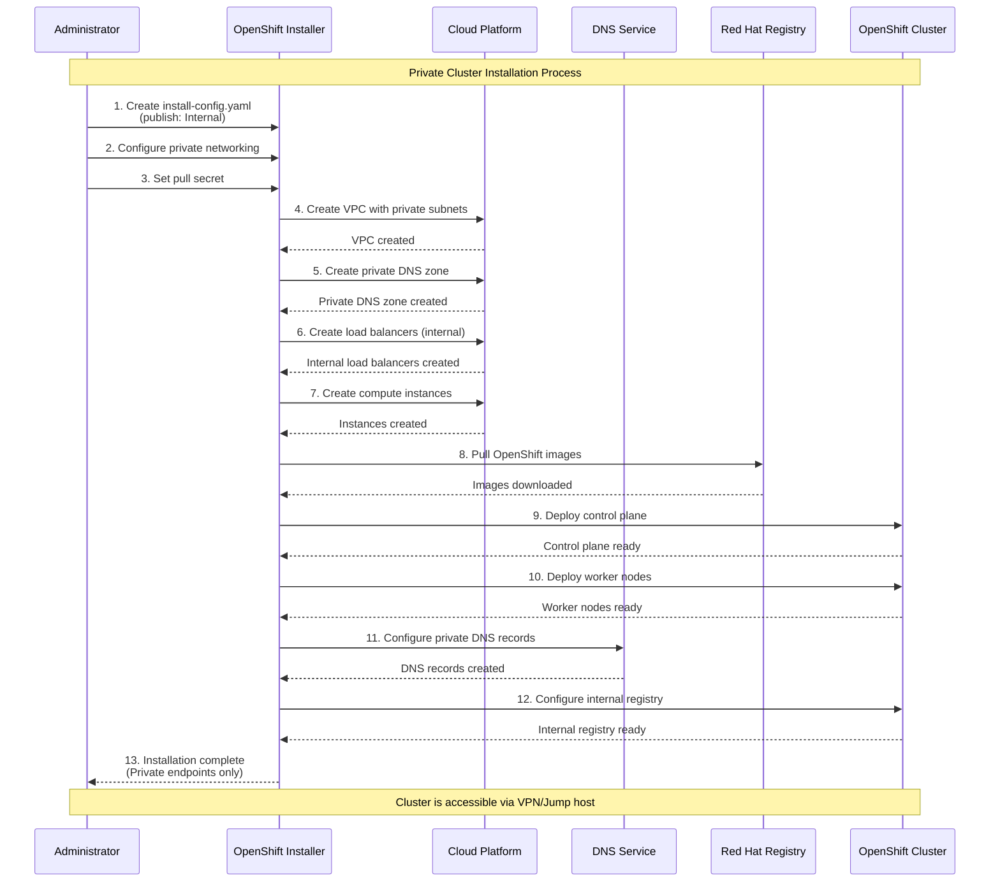
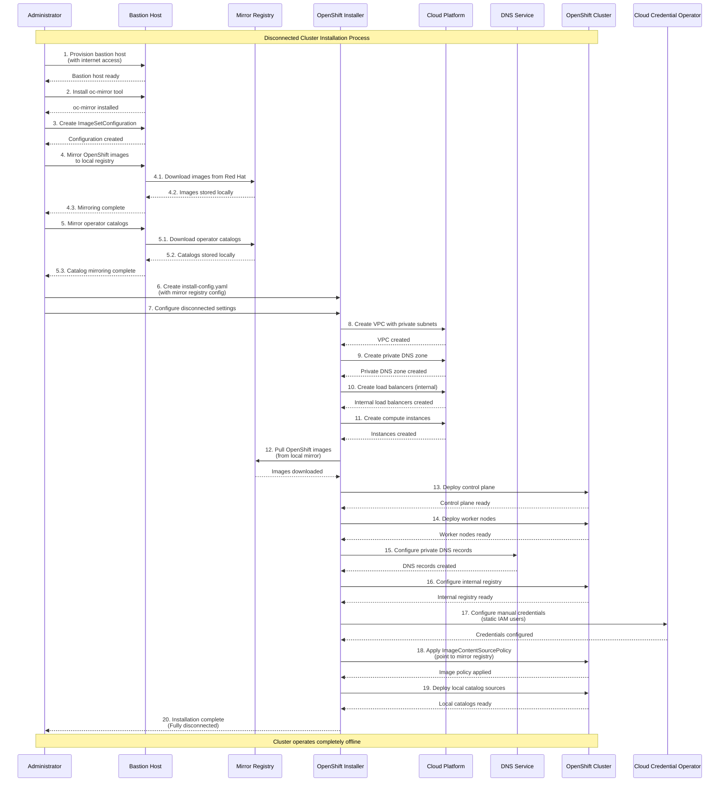

# OpenShift Disconnected Cluster

## AWS目录中Disconnected Cluster相关脚本总结

### 1. **VPC配置 - `aws-provision-vpc-disconnected`**

**位置**: `step-registry/aws/provision/vpc/disconnected/`

**作用**: 为disconnected cluster创建专用的VPC网络环境

**主要特点**:
- 创建独立的VPC，支持1-3个可用区
- 配置公共和私有子网
- 设置Internet Gateway和NAT Gateway
- 配置路由表和网络ACL
- 为disconnected环境优化网络配置

**关键配置**:
```yaml
ref:
  as: aws-provision-vpc-disconnected
  from_image:
    namespace: ocp
    name: "4.12"
    tag: upi-installer
  env:
  - name: ZONES_COUNT
    default: "3"
```

### 2. **IAM用户配置 - `aws-provision-cco-manual-users-static`**

**位置**: `step-registry/aws/provision/cco-manual-users/static/`

**作用**: 为disconnected cluster创建静态AWS IAM用户和权限

**主要功能**:
- 从OpenShift release镜像中提取CredentialsRequest
- 为每个CredentialsRequest创建对应的IAM策略
- 创建IAM用户并分配最小权限
- 生成Kubernetes Secret清单文件
- 支持TechPreview功能的过滤

**关键特性**:
```yaml
ref:
  as: aws-provision-cco-manual-users-static
  documentation: |-
    Create static AWS IAM users for disconnected cluster.
```

### 3. **核心脚本功能分析**

#### **VPC创建脚本** (`aws-provision-vpc-disconnected-commands.sh`):
- 使用CloudFormation模板创建VPC
- 配置多可用区支持
- 设置网络标签和过期时间
- 输出VPC ID、子网ID等关键信息

#### **IAM用户创建脚本** (`aws-provision-cco-manual-users-static-commands.sh`):
- 使用`oc adm release extract`提取凭证请求
- 动态生成IAM策略文档
- 创建AWS IAM用户和访问密钥
- 生成Kubernetes Secret YAML文件
- 支持镜像仓库认证配置

### 4. **Disconnected Cluster的特殊考虑**

**网络隔离**:
- VPC配置为disconnected环境优化
- 支持私有子网配置
- 可配置NAT Gateway用于有限的互联网访问

**镜像仓库**:
- 支持mirror registry配置
- 处理pull secret和认证
- 配置ImageContentSourcePolicy

**权限管理**:
- 最小权限原则
- 静态IAM用户而非动态创建
- 支持CCO (Cloud Credential Operator) 手动模式

### 5. **与其他组件的集成**

这些脚本通常与其他disconnected相关组件配合使用：
- **镜像同步**: 使用`oc-mirror`工具同步镜像到本地registry
- **Catalog Source**: 配置本地operator catalog
- **Registry配置**: 设置镜像仓库的镜像策略
- **网络配置**: 配置DNS和路由

### 6. **使用场景**

这些脚本主要用于：
- **CI/CD环境**: 在隔离的AWS环境中测试OpenShift
- **离线部署**: 在没有互联网访问的环境中部署OpenShift
- **安全合规**: 满足企业安全策略要求
- **性能测试**: 在受控环境中进行性能基准测试

这些配置文件和脚本为在AWS上部署disconnected OpenShift集群提供了完整的自动化解决方案，涵盖了网络、权限、镜像同步等关键方面。

---

CCO 的含义

**CCO** 是 **Cloud Credential Operator** 的缩写，这是OpenShift中的一个核心组件。

### 1. **Cloud Credential Operator (CCO) 的作用**

CCO是OpenShift中负责管理云平台凭证的Operator，它的主要功能包括：

- **凭证管理**: 管理OpenShift集群中各个组件访问云平台所需的凭证
- **权限控制**: 确保每个组件只获得其所需的最小权限
- **安全策略**: 实施云平台访问的安全最佳实践

### 2. **CCO的工作模式**

CCO支持多种工作模式：

#### **Mint模式** (默认)
- CCO自动创建和管理云平台凭证
- 动态创建IAM用户/服务账户
- 适合有足够权限的环境

#### **Manual模式**
- 管理员手动创建和管理凭证
- 使用预创建的IAM用户/服务账户
- 适合权限受限或安全要求严格的环境

#### **Passthrough模式**
- 直接使用现有的云平台凭证
- 不进行任何凭证管理

### 3. **`cco-manual-users` 目录的作用**

这个目录专门用于 **Manual模式** 下的CCO配置：

#### **主要功能**:
- **提取CredentialsRequest**: 从OpenShift release镜像中提取各个组件需要的凭证请求
- **创建IAM策略**: 根据CredentialsRequest自动生成对应的AWS IAM策略
- **创建IAM用户**: 为每个组件创建专用的IAM用户
- **生成Kubernetes Secret**: 创建对应的Kubernetes Secret清单文件

#### **工作流程**:
```bash
# 1. 从release镜像提取CredentialsRequest
oc adm release extract --credentials-requests --cloud=aws

# 2. 为每个CredentialsRequest创建IAM策略和用户
# 3. 生成Kubernetes Secret YAML文件
```

### 4. **为什么需要Manual模式？**

Manual模式在以下场景中特别重要：

- **Disconnected环境**: 离线部署时无法动态创建云资源
- **安全合规**: 企业安全策略要求手动管理凭证
- **权限限制**: 云平台账户权限不足以支持Mint模式
- **审计要求**: 需要明确的凭证创建记录

### 5. **与其他组件的集成**

CCO与以下组件紧密集成：
- **ccoctl工具**: 用于生成云平台凭证的CLI工具
- **CredentialsRequest**: 定义组件所需权限的CRD
- **各种Operator**: 如image-registry、ingress、machine-api等

### 总结

`cco-manual-users` 目录中的脚本是OpenShift在AWS平台上使用Manual模式部署时，自动化创建和管理云平台凭证的关键组件。它确保了在disconnected或安全要求严格的环境中，OpenShift集群能够正确获得访问AWS服务所需的权限，同时遵循最小权限原则。

---

## Private Cluster vs Disconnected Cluster 安装过程对比

### 1. **概念定义**

#### **Private Cluster (私有集群)**
- **网络层面**: 集群的API服务器和Ingress控制器使用私有IP地址
- **访问方式**: 通过VPN、跳板机或内部网络访问
- **互联网连接**: 通常有互联网连接，但API服务器不对外暴露

#### **Disconnected Cluster (离线集群)**
- **网络层面**: 完全隔离的网络环境，无法访问互联网
- **镜像仓库**: 需要本地镜像仓库来提供所有容器镜像
- **软件包**: 所有软件包和更新都需要预先下载到本地

### 2. **安装过程的主要区别**

#### **A. 网络配置差异**

**Private Cluster**:
```yaml
# install-config.yaml
publish: Internal  # 关键配置
platform:
  aws:
    privateLink: true  # 使用私有链接
```

**Disconnected Cluster**:
```yaml
# install-config.yaml
publish: Internal  # 同样使用内部发布
# 但需要额外的镜像仓库配置
additionalTrustBundle: |
  -----BEGIN CERTIFICATE-----
  # 镜像仓库的CA证书
  -----END CERTIFICATE-----
```

#### **B. 镜像处理方式**

**Private Cluster**:
- 直接从互联网拉取镜像
- 使用标准的pull secret
- 不需要预先准备镜像

**Disconnected Cluster**:
- 需要预先同步所有镜像到本地仓库
- 使用`oc-mirror`工具同步镜像
- 配置ImageContentSourcePolicy指向本地仓库

```bash
# Disconnected环境镜像同步
oc-mirror --config=imageset.yaml docker://local-registry:5000
```

#### **C. 安装步骤对比**

**Private Cluster 安装流程**:
```yaml
steps:
  - ref: ipi-conf
  - ref: ipi-conf-private-dns  # 配置私有DNS
  - ref: ipi-install-install
  - ref: ipi-install-registry  # 配置内部镜像仓库
```

**Disconnected Cluster 安装流程**:
```yaml
steps:
  - chain: vsphere-provision-bastionhost  # 需要跳板机
  - ref: mirror-images-by-oc-adm-in-bastion  # 镜像同步
  - ref: ipi-conf-mirror  # 配置镜像仓库
  - ref: ipi-install-install
  - ref: ipi-install-vsphere-registry
  - ref: enable-qe-catalogsource-disconnected  # 启用离线catalog
  - ref: mirror-images-tag-images  # 镜像标签处理
```

### 3. **关键组件差异**

#### **A. 镜像仓库配置**

**Private Cluster**:
```yaml
# 使用标准的registry.redhat.io
imageContentSources:
- mirrors:
  - registry.redhat.io/openshift4/ose-kube-rbac-proxy
  source: registry.redhat.io/openshift4/ose-kube-rbac-proxy
```

**Disconnected Cluster**:
```yaml
# 使用本地镜像仓库
imageContentSources:
- mirrors:
  - mirror-registry.example.com:5000/openshift4/ose-kube-rbac-proxy
  source: registry.redhat.io/openshift4/ose-kube-rbac-proxy
```

#### **B. CCO (Cloud Credential Operator) 配置**

**Private Cluster**:
- 可以使用标准的Mint模式
- 动态创建云平台凭证

**Disconnected Cluster**:
- 必须使用Manual模式
- 预先创建静态IAM用户
- 使用`cco-manual-users`脚本

#### **C. Catalog Source 配置**

**Private Cluster**:
```yaml
# 使用标准的Red Hat catalog
apiVersion: operators.coreos.com/v1alpha1
kind: CatalogSource
metadata:
  name: redhat-operators
spec:
  image: registry.redhat.io/redhat/redhat-operator-index
```

**Disconnected Cluster**:
```yaml
# 使用本地catalog
apiVersion: operators.coreos.com/v1alpha1
kind: CatalogSource
metadata:
  name: redhat-operators
spec:
  image: mirror-registry.example.com:5000/redhat/redhat-operator-index
```

### 4. **基础设施要求**

#### **Private Cluster**:
- 私有子网配置
- NAT Gateway (可选)
- 私有DNS区域
- VPN或跳板机访问

#### **Disconnected Cluster**:
- 完全隔离的网络
- 本地镜像仓库 (Registry)
- 跳板机 (Bastion Host)
- 预先下载的所有软件包
- 本地证书颁发机构

### 5. **维护和更新**

#### **Private Cluster**:
- 可以直接从互联网拉取更新
- 标准的升级流程
- 自动镜像拉取

#### **Disconnected Cluster**:
- 需要预先下载所有更新
- 手动镜像同步
- 离线升级流程
- 需要维护本地软件包仓库

### 6. **安全考虑**

#### **Private Cluster**:
- 网络层面的隔离
- API服务器不对外暴露
- 仍然需要互联网连接

#### **Disconnected Cluster**:
- 完全的网络隔离
- 无互联网连接
- 更高的安全级别
- 需要严格的内容验证

### 总结

**Private Cluster** 主要关注**网络访问控制**，确保集群API不对外暴露，但仍然保持互联网连接以获取镜像和更新。

**Disconnected Cluster** 关注**完全的网络隔离**，需要预先准备所有必要的镜像、软件包和配置，适合在高度安全或完全隔离的环境中部署。

两者的主要区别在于：Private Cluster是"网络私有化"，而Disconnected Cluster是"完全离线化"。

---

# OpenShift Cluster Installation Sequence Diagrams

本文档包含OpenShift Private Cluster和Disconnected Cluster安装过程的UML时序图。

## 1. Private Cluster Installation Sequence



## 2. Disconnected Cluster Installation Sequence



## 3. Key Differences Summary

| Aspect | Private Cluster | Disconnected Cluster |
|--------|----------------|---------------------|
| **Network Access** | Limited internet access | No internet access |
| **Image Source** | Red Hat registries | Local mirror registry |
| **Bastion Host** | Optional | Required |
| **Image Preparation** | None required | Pre-mirroring required |
| **CCO Mode** | Mint/Manual | Manual only |
| **Catalog Sources** | Standard Red Hat | Local mirrored |
| **Update Process** | Direct from internet | Manual mirroring |
| **Security Level** | Network isolation | Complete isolation |

## 4. Installation Prerequisites

### Private Cluster Prerequisites
- Cloud platform credentials
- Private network configuration
- DNS zone (private)
- Pull secret for Red Hat registries

### Disconnected Cluster Prerequisites
- Bastion host with internet access
- Local mirror registry
- Pre-mirrored OpenShift images
- Pre-mirrored operator catalogs
- Static cloud credentials (IAM users)
- Local certificate authority
- Complete software package repository

## 5. Post-Installation Considerations

### Private Cluster
- Configure VPN or jump host access
- Set up monitoring and logging
- Configure backup strategies
- Plan for updates and upgrades

### Disconnected Cluster
- Establish image update procedures
- Set up local package management
- Configure offline monitoring
- Plan for offline upgrades
- Maintain local security patches 